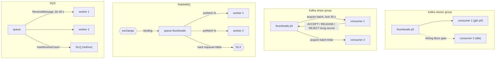
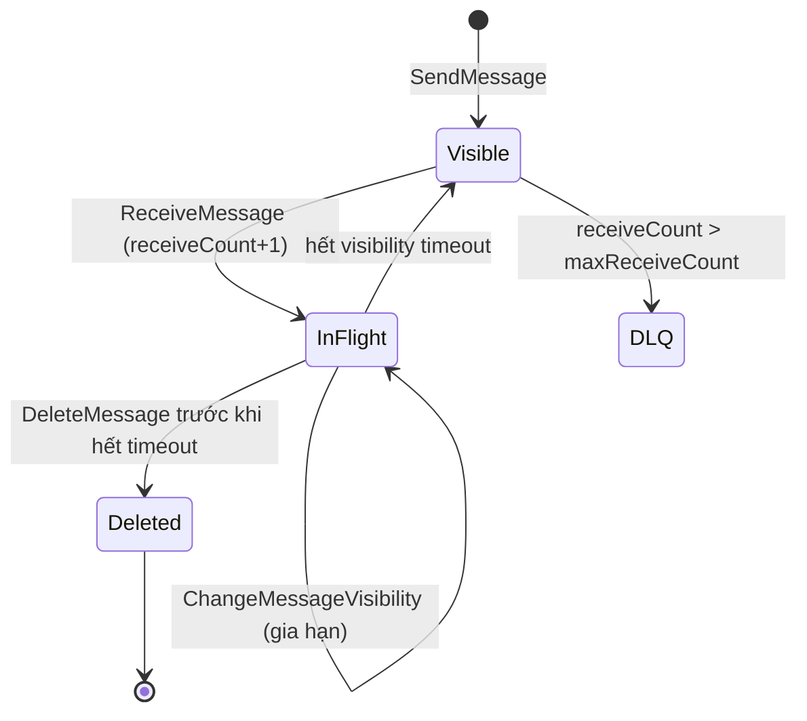

## Bối cảnh & vấn đề

Một team sáu người làm service xử lý ảnh sản phẩm: mỗi ảnh upload cần tạo thumbnail, nén, và đẩy lên CDN. Tech lead đề xuất Kafka "vì công ty đã có Kafka". Sau hai tuần: topic `thumbnails` có 6 partition, 6 consumer; ảnh lớn mất 40 giây, ảnh nhỏ 200 ms; một ảnh hỏng làm partition kẹt; muốn retry một ảnh sau 5 phút phải tự xây retry topic; muốn thêm worker trong giờ cao điểm thì không được vì đã bằng số partition. Một team khác dùng SQS cho đúng bài toán đó với 40 dòng code.

Ngược lại, team analytics từng dùng RabbitMQ để phát event `OrderPlaced` cho bốn hệ thống. Khi hệ thống thứ năm cần "đọc lại 30 ngày đơn hàng để dựng báo cáo", không còn gì để đọc: queue đã xoá message sau ack.

Không có message broker "tốt nhất". Kafka là **log**: giữ dữ liệu, nhiều consumer đọc độc lập, replay, song song theo partition. RabbitMQ và SQS là **queue**: giao việc, ack từng message, xoá khi xong, song song theo message. Bài này so sánh ba hệ thống ở mức cơ chế, đi sâu vào hai điểm hay bị hỏi (visibility timeout của SQS, share groups của Kafka 4.2), và đưa ra khung quyết định.

## Khái niệm

### Log vs queue, nhắc lại

Ở [bài 1](/tracks/messaging-kafka/learn/log-topics-partitions) đã thấy: queue giữ **trạng thái từng message** (ready → unacked → ack/xoá), còn Kafka chỉ giữ **offset của từng group trên từng partition**. Từ đó:

| | Queue (RabbitMQ classic, SQS) | Log (Kafka) |
| --- | --- | --- |
| Đọc có xoá? | Có, sau ack | Không, theo retention |
| Nhiều subscriber | Mỗi subscriber một queue (copy) | Mỗi subscriber một group (không copy) |
| Replay | Không | Có |
| Song song | Theo message (thêm consumer là thêm song song) | Theo partition |
| Ack | Từng message, retry riêng lẻ | Offset liên tục |
| Thứ tự | Theo queue (vỡ khi nhiều consumer) | Theo partition |

Điều Kafka mất khi không theo dõi từng message: không thể retry riêng một message, không có delay theo message, không scale consumer vượt số partition, và một message chậm làm chậm cả partition. **Share groups** (KIP-932) là câu trả lời của Kafka cho đúng những điểm này.

**Interview angle:** follow-up "Kafka mất gì khi không ack từng message, share groups đổi điều đó thế nào?" — nói được bốn điểm trên rồi nối sang share groups.

### RabbitMQ

**RabbitMQ** là "smart broker": producer gửi tới một **exchange** (direct, topic, fanout, headers), exchange định tuyến theo **binding** sang một hoặc nhiều **queue**; consumer nhận message (push, giới hạn bằng **prefetch**), xử lý, rồi `ack`. Không ack (consumer chết) thì message được giao lại. `nack`/`reject` với `requeue=false`, TTL hết hạn, hoặc queue đầy đưa message sang **dead-letter exchange (DLX)**.

Các mảnh làm RabbitMQ hợp với task queue: **ack từng message**, **priority queue**, **TTL** theo message/queue, **DLX**, routing linh hoạt theo pattern (`order.*.vn`), và RPC kiểu request/reply (`reply_to`, `correlation_id`). Độ bền: queue `durable` + message `persistent` + **publisher confirms** + manual ack, và **quorum queue** (Raft, replicate qua nhiều node) cho HA. Classic mirrored queue đã bị **xoá** ở RabbitMQ 4.0 (trước đó deprecated). Quorum queue có `x-delivery-limit` để tự dead-letter message bị giao lại quá nhiều lần (4.0 mặc định giới hạn 20, verify). **RabbitMQ Streams** (3.9+) là cấu trúc dạng log append-only, cho replay và nhiều consumer đọc độc lập, gần với Kafka hơn.

Delay theo message (retry sau 5 phút): RabbitMQ làm được bằng TTL + DLX theo tầng, hoặc plugin delayed message exchange. Đó là lý do câu "cần delayed retry với nhiều mức delay khác nhau" thường nghiêng về RabbitMQ (hoặc SQS) hơn Kafka.

### SQS và SNS

**SQS** là queue serverless của AWS: không có server để vận hành, scale gần như vô hạn (Standard), trả tiền theo request.

- **Standard queue**: at-least-once (có thể giao trùng), thứ tự **best-effort**, throughput gần như không giới hạn.
- **FIFO queue**: thứ tự theo **`MessageGroupId`** (giống key → partition của Kafka, nhưng không cần khai báo số partition), **dedupe** theo `MessageDeduplicationId` trong cửa sổ **5 phút**, throughput giới hạn hơn (300 msg/s mỗi API action, 3.000 với batching, cao hơn nhiều với high-throughput mode, verify theo region).
- Retention mặc định 4 ngày, tối đa 14 ngày; không có replay theo nghĩa Kafka (message đã xoá là mất). **Redrive**: sau `maxReceiveCount` lần nhận mà không xoá, message chuyển sang **DLQ**; có thể redrive ngược từ DLQ về queue nguồn.
- Mỗi message tới **một** consumer. Fan-out cần **SNS + SQS**: SNS topic phát tới nhiều queue (mỗi subscriber một queue), kèm **filter policy** theo attribute.

### Visibility timeout

Khi consumer `ReceiveMessage`, SQS không xoá message mà **ẩn** nó khỏi consumer khác trong **visibility timeout** (mặc định 30 giây, tối đa 12 giờ). Consumer xử lý xong phải `DeleteMessage`. Nếu không xoá kịp trước khi timeout hết, message **hiện lại** và một consumer khác nhận nó.

Bug kinh điển: visibility timeout 30 s, xử lý một video mất 90 s. Ở giây 30, message hiện lại, consumer B nhận và bắt đầu xử lý **song song** với A; ở giây 60, consumer C cũng vậy. Ba lần xử lý cùng lúc, `DeleteMessage` của A ở giây 90 dùng receipt handle cũ (tuỳ thời điểm có thể vẫn xoá được, verify). Sửa: timeout > p99 thời gian xử lý; với việc dài và không đều, **gia hạn** bằng `ChangeMessageVisibility` định kỳ (heartbeat); consumer idempotent; `maxReceiveCount` + DLQ để poison pill không quay vòng mãi.

Đây là anh em sinh đôi của vấn đề `max.poll.interval.ms` trong Kafka ([bài 5](/tracks/messaging-kafka/learn/rebalance-liveness)): cả hai là "broker không nghe thấy gì trong khoảng X thì coi việc đã thất bại và giao cho người khác". Khác ở **đơn vị**: SQS giao lại **một message**, Kafka giao lại **cả partition** (mọi message chưa commit trên đó).

### Share groups (Queues for Kafka)

**Share group** (KIP-932) là một loại group mới trong Kafka: nhiều consumer cùng đọc **cùng một partition**. Broker (share-partition leader) quản lý trạng thái **từng record** trong một cửa sổ "đang bay":

- Consumer fetch → broker **acquire** một loạt record cho consumer đó với **acquisition lock** (mặc định `group.share.record.lock.duration.ms` = 30 s).
- Consumer **ack từng record**: `ACCEPT` (xong), `RELEASE` (trả lại để giao cho người khác), `REJECT` (không xử lý được, bỏ qua vĩnh viễn).
- Lock hết hạn không ack → record được giao lại; mỗi lần giao tăng **delivery count**; vượt `group.share.delivery.count.limit` (mặc định 5) thì record được đánh dấu archived (không giao nữa).
- **Không có thứ tự** giữa các consumer; giao hàng là at-least-once.

Dùng khi: task độc lập (ảnh, email, job), thời gian xử lý không đều, muốn scale consumer **vượt số partition**, muốn retry theo từng record, và không muốn thêm một hệ thống queue riêng bên cạnh Kafka. Không dùng khi: cần thứ tự theo key, hoặc client của bạn chưa hỗ trợ. Kafka 4.0 có bản early access, 4.1 preview, **4.2 production-ready** (verify với release notes). Phía client: Java có `KafkaShareConsumer`; KafkaJS không hỗ trợ; hỗ trợ trong librdkafka/confluent-js cần kiểm tra theo version (verify).

Poison message trong share group: lỗi permanent thì consumer `REJECT`; lỗi lặp lại thì delivery count limit chặn vòng lặp. Không có DLQ tự động như SQS redrive; record bị reject/archived không được chuyển sang topic khác, nên nếu cần giữ lại để điều tra, consumer phải tự publish sang DLQ trước khi reject (verify trạng thái tính năng DLQ cho share groups ở các bản sau).

### BullMQ và Redis

Với một service Node đơn lẻ cần job nền (gửi email, tạo PDF, xử lý ảnh), **BullMQ** (job queue trên Redis) thường là lựa chọn nhẹ nhất: retry với backoff, delay, cron, priority, rate limit, concurrency theo worker. Nó cũng at-least-once (job "stalled" khi worker chết được giao lại), nên worker phải idempotent. Nó không phải event backbone: không replay, không nhiều subscriber độc lập, độ bền phụ thuộc cấu hình persistence của Redis. **Redis Pub/Sub** còn yếu hơn: at-most-once, không lưu gì.

## Cơ chế hoạt động

Cùng một bài toán "thumbnail cho mỗi ảnh", bốn cách giao việc:



Classic group: một partition một consumer, consumer thứ hai không có việc. Share group, RabbitMQ, SQS: mọi worker đều nhận việc từ cùng một nguồn, và lỗi/timeout của một message chỉ ảnh hưởng message đó.

Vòng đời một message SQS với visibility timeout:



Record trong share group đi gần như cùng vòng đời: available → acquired (lock) → acknowledged/released/rejected, với lock hết hạn tương đương visibility timeout và delivery count limit tương đương `maxReceiveCount`.

## Ví dụ thực tế

Chạy thật trên Kafka 4.2.0 (3 broker, `share.version=1` đã được finalize mặc định), dùng công cụ console của Kafka.

### Share group: hai consumer, một partition

Topic `thumbnails` một partition. Hai `kafka-console-share-consumer.sh` cùng group `thumb-workers`, rồi produce 10.000 record:

```bash
kafka-console-share-consumer.sh --bootstrap-server k1:9092 --topic thumbnails --group thumb-workers   # x2
for b in 1 2 3 4 5; do seq -f "img-$b-%g" 1 2000 | kafka-console-producer.sh --bootstrap-server k1:9092 --topic thumbnails; done
kafka-share-groups.sh --bootstrap-server k1:9092 --describe --group thumb-workers
```

```text
GROUP           TOPIC           PARTITION  START-OFFSET  LAG
thumb-workers   thumbnails      0          8982          0
worker 1: 5264 records
worker 2: 4736 records
```

Hai consumer chia nhau 10.000 record từ **một** partition (khoảng 53/47). Một lần thử trước với chỉ 12 record cho kết quả 12/0: consumer đầu acquire cả lô trong một lần fetch. Share group chia việc theo **batch được acquire**, không phải round-robin từng record, nên với ít record hoặc consumer rất nhanh, phân bố có thể lệch.

### Classic group: cùng tình huống

Hai `kafka-console-consumer.sh` cùng group `thumb-classic` trên cùng topic một partition:

```text
GROUP           CONSUMER-ID                                           HOST            CLIENT-ID        #PARTITIONS
thumb-classic   console-consumer-ee7ba5ec-1e8f-463d-a398-2184c72be10d /172.23.0.3     console-consumer 0
thumb-classic   console-consumer-bb7ade41-26b2-48fe-9b35-91f46b3b9086 /172.23.0.3     console-consumer 1
classic consumer 1: 10000 records
classic consumer 2: 0 records
```

Đúng quy tắc của classic group: consumer thứ hai có 0 partition, 0 record.

### Default liên quan trên broker 4.2

```text
group.share.delivery.count.limit=5
group.share.record.lock.duration.ms=30000
group.share.partition.max.record.locks=2000
group.coordinator.rebalance.protocols=classic,consumer,streams
```

`max.record.locks=2000` giới hạn số record "đang bay" trên mỗi share-partition: với việc chậm và nhiều consumer, đó là trần song song thực tế trên một partition (verify tên/giá trị theo version).

### SQS: gia hạn visibility cho việc dài (minh hoạ)

Không chạy trong lab này (cần tài khoản AWS):

```ts
import { SQSClient, ReceiveMessageCommand, ChangeMessageVisibilityCommand, DeleteMessageCommand } from "@aws-sdk/client-sqs";
const sqs = new SQSClient({});
const { Messages = [] } = await sqs.send(new ReceiveMessageCommand({
  QueueUrl, MaxNumberOfMessages: 1, WaitTimeSeconds: 20, VisibilityTimeout: 60,
}));
for (const m of Messages) {
  const extend = setInterval(() => sqs.send(new ChangeMessageVisibilityCommand({
    QueueUrl, ReceiptHandle: m.ReceiptHandle!, VisibilityTimeout: 60,     // push the deadline 60 s from now
  })), 30_000);
  try {
    await transcode(JSON.parse(m.Body!));                                  // idempotent by job id
    await sqs.send(new DeleteMessageCommand({ QueueUrl, ReceiptHandle: m.ReceiptHandle! }));
  } finally { clearInterval(extend); }
}
```

Nếu worker chết, việc gia hạn dừng, message hiện lại sau tối đa 60 s và worker khác nhận. Nếu `transcode` luôn lỗi, sau `maxReceiveCount` lần (cấu hình trên redrive policy) message vào DLQ.

### Khung quyết định cho team sáu người

Hỏi trước khi chọn:

1. **Nhiều consumer độc lập cần cùng dữ liệu, hoặc cần replay?** Có → Kafka (hoặc RabbitMQ Streams). Không → queue.
2. **Đây là event backbone chia sẻ giữa nhiều team?** Có → Kafka (managed: MSK, Confluent Cloud) với schema registry.
3. **Việc là task với retry/delay/priority riêng từng việc?** Có → SQS (nếu trên AWS), RabbitMQ (routing phức tạp, priority, RPC), BullMQ (service Node đơn lẻ, đã có Redis), hoặc Kafka share groups (nếu đã có Kafka 4.2+ và client hỗ trợ).
4. **Ai vận hành?** Không có ai từng vận hành Kafka → managed service hoặc SQS. Tự host Kafka cho một service sáu người hiếm khi đáng.
5. **Throughput, retention, thứ tự?** Hàng trăm nghìn msg/s, retention nhiều ngày, thứ tự theo key → Kafka. Vài trăm msg/s → bất kỳ cái nào.

Senior: chọn theo tổng chi phí sở hữu (vận hành, học, on-call) và rủi ro, không theo trend. Giữ đường lui: một interface nội bộ mỏng (`publish`, `subscribe`), outbox (dùng được với mọi broker), event có schema. Chuyển từ SQS sang Kafka sau này khi xuất hiện nhu cầu replay/nhiều subscriber/stream processing: đau ở chỗ semantics (ack từng message → offset, retry → retry topic, thứ tự → key), không phải ở chỗ đổi SDK.

## Trade-offs & lựa chọn thay thế

| | Kafka (classic group) | Kafka share group | RabbitMQ | SQS (+SNS) | BullMQ |
| --- | --- | --- | --- | --- | --- |
| Mô hình | Log, pull theo offset | Log + ack từng record | Broker định tuyến, push + ack | Queue managed, pull, visibility | Job queue trên Redis |
| Replay | Có (retention) | Có (dữ liệu vẫn là log) | Không (Streams: có) | Không | Không |
| Thứ tự | Theo partition | Không | Theo queue, một consumer | FIFO theo MessageGroupId | Theo queue, không với concurrency |
| Song song | ≤ số partition | Vượt số partition | Theo consumer | Gần như vô hạn | Theo worker × concurrency |
| Retry/delay từng message | Tự xây (retry topic) | Release, delivery count | TTL + DLX, plugin delay | Visibility, DelaySeconds, redrive | Native |
| Routing | Topic + key | Như Kafka | Rất linh hoạt | SNS filter policy | Theo queue |
| Throughput | Rất cao | Cao (verify) | Cao vừa | Rất cao (Standard) | Cao (giới hạn bởi Redis) |
| Vận hành | Nặng (hoặc managed) | Như Kafka | Vừa | Không có server | Nhẹ (cần Redis HA) |
| Hợp | Event streaming, CDC, nhiều team | Task trên hạ tầng Kafka sẵn có | Task queue, routing, RPC | Task trên AWS, fanout với SNS | Job nền của app Node |

Chọn thế nào: Kafka cho event backbone và stream (nhiều subscriber, replay, CDC, analytics); SQS (+SNS) cho task queue đơn giản trên AWS; RabbitMQ khi cần routing phức tạp, priority, hay request/reply; BullMQ cho job nền trong một app Node; share groups khi đã có Kafka 4.2+ và muốn ngữ nghĩa queue mà không thêm hệ thống. Thường một công ty có cả hai: Kafka cho event giữa các domain, một queue cho việc nội bộ của từng service.

## Edge cases & failure modes

- **Visibility timeout < thời gian xử lý**: xử lý song song trùng; xem trên. Theo dõi `ApproximateAgeOfOldestMessage` và số lần receive.
- **SQS Standard giao trùng** ngay cả khi mọi thứ đúng (at-least-once); FIFO dedupe chỉ trong 5 phút và chỉ theo dedup id.
- **FIFO và một MessageGroupId nóng**: giống hot partition, mọi message của group đó tuần tự.
- **RabbitMQ prefetch quá cao**: một consumer ôm hàng nghìn message unacked; nó chết thì tất cả được giao lại, và các consumer khác ngồi chơi trong lúc đó.
- **RabbitMQ memory/disk alarm**: broker chặn publisher khi RAM vượt watermark; producer "treo".
- **Message không route được** (RabbitMQ): routing key sai làm message bị drop âm thầm nếu không có `mandatory` hoặc alternate exchange.
- **Share group lock hết hạn giữa chừng**: record được giao cho consumer khác trong khi consumer cũ vẫn xử lý (giống visibility timeout); việc dài cần lock dài hơn hoặc chia nhỏ, và handler idempotent (verify cơ chế gia hạn lock theo version client).
- **Share group với record "độc" không ai reject**: delivery count limit chặn sau 5 lần; nếu không tự đẩy sang DLQ, record đó coi như biến mất khỏi luồng xử lý.

## Pitfalls

- ❌ Dùng Kafka classic group làm task queue cho việc thời gian không đều → ✅ queue (SQS/RabbitMQ/BullMQ) hoặc share group.
- ❌ Dùng queue làm event backbone cho nhiều team → ✅ log (Kafka); queue không replay, mỗi subscriber một bản copy.
- ❌ Visibility timeout mặc định 30 s cho việc 90 s → ✅ timeout > p99, gia hạn bằng `ChangeMessageVisibility`, consumer idempotent.
- ❌ "SQS FIFO là exactly-once" → ✅ dedupe 5 phút theo dedup id; consumer vẫn phải idempotent.
- ❌ Chọn Kafka vì "công ty có Kafka" cho mọi việc → ✅ chọn theo bài toán; có Kafka thì share groups có thể là lựa chọn queue, nếu client hỗ trợ.
- ❌ "RabbitMQ không bao giờ mất message" → ✅ chỉ khi durable + persistent + publisher confirms + manual ack + quorum queue.
- ❌ Tự host Kafka cho team nhỏ không ai biết vận hành → ✅ managed service hoặc queue serverless.

## Tóm tắt

- Log (Kafka) giữ dữ liệu, nhiều group độc lập, replay, song song theo partition; queue (RabbitMQ, SQS) ack từng message, xoá khi xong, song song theo message.
- RabbitMQ: exchange + binding + queue, ack, prefetch, DLX, quorum queue (mirrored queue đã bị xoá ở 4.0), Streams cho replay.
- SQS: Standard (at-least-once, best-effort order), FIFO (MessageGroupId, dedupe 5 phút); fanout qua SNS; redrive sang DLQ.
- Visibility timeout ngắn hơn thời gian xử lý gây xử lý song song trùng; sửa bằng timeout đủ dài, gia hạn, idempotency, `maxReceiveCount`.
- Share groups (Kafka 4.2 production-ready): nhiều consumer một partition, lock + ack từng record, delivery count limit, không thứ tự.
- Khung quyết định: replay/nhiều subscriber/backbone → Kafka; task trên AWS → SQS; routing/priority/RPC → RabbitMQ; job nền Node → BullMQ.
- Chọn theo tổng chi phí vận hành và để đường lui (interface mỏng, outbox, schema).
