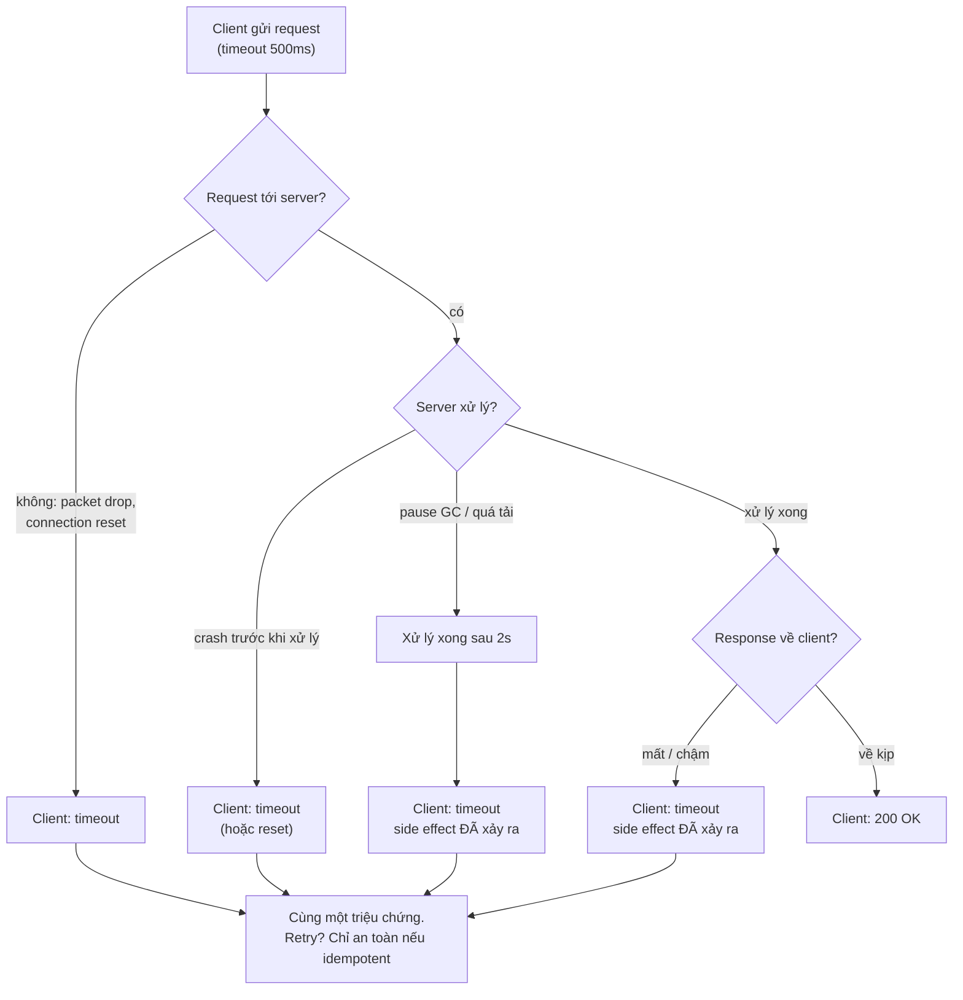
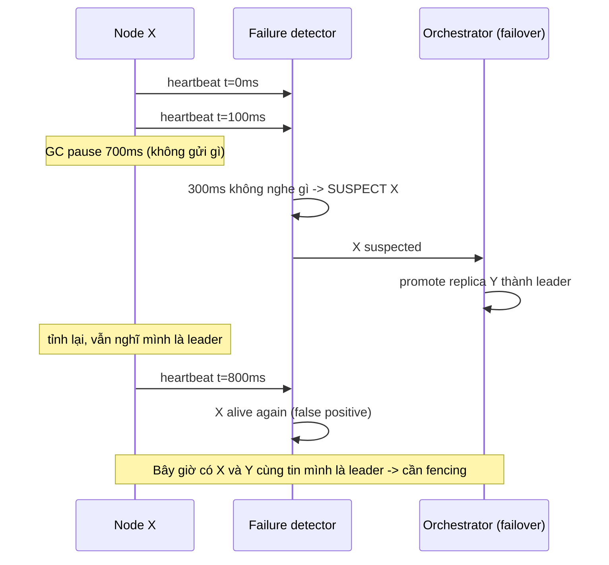

## Bối cảnh & vấn đề

Một team tách module thanh toán ra thành service riêng. Trước đây `chargeCard(order)` là một function call trong cùng process: nó hoặc trả về, hoặc ném exception, và nếu process chết thì cả hai phía chết cùng nhau. Sau khi tách, cùng dòng code đó trở thành một HTTP call. Tuần đầu tiên production, một switch trong data center bị nghẽn 2 giây; checkout service không đặt timeout, 400 request treo cùng lúc, connection pool cạn, và toàn bộ trang checkout trả 502. Tuần thứ hai, team thêm timeout 500 ms và retry; giờ một số khách bị **trừ tiền hai lần**.

Không có dòng code nào "sai" theo nghĩa thông thường. Cái sai là giả định: code được viết như thể đầu kia của mạng là một function. Hệ phân tán là **nhiều máy hợp tác qua một mạng không tin cậy**, không có bộ nhớ chung, không có đồng hồ chung, và mỗi máy có thể dừng lại (crash hoặc pause) vào bất kỳ lúc nào mà các máy khác không biết. Mọi pattern trong track này — timeout, retry, idempotency, quorum, consensus, fencing, saga — đều là cách sống chung với ba sự thật đó.

Bài này đặt nền: mô hình lỗi (cái gì có thể hỏng và hỏng thế nào), vì sao một client **không thể biết** request của mình đã chạy hay chưa, vì sao phát hiện node chết chỉ là đoán, và cách test để thấy những lỗi đó trước khi khách hàng thấy.

## Khái niệm

### Partial failure

Trong một máy, lỗi thường là **toàn phần**: kernel panic thì mọi thứ dừng. Trong hệ phân tán, lỗi là **partial failure**: một phần hệ thống hỏng trong khi phần còn lại vẫn chạy, và phần còn lại thường **không biết chính xác** phần nào hỏng. Node B có thể đã chết, có thể chỉ chậm, có thể còn sống nhưng mạng giữa A và B đứt, hoặc có thể đã xử lý request rồi nhưng response bị mất.

Partial failure là nguồn gốc của độ khó. Nếu mọi lỗi đều toàn phần, ta chỉ cần restart. Vì lỗi là một phần và không quan sát được trực tiếp, mọi quyết định ("B chết chưa?", "request đã chạy chưa?") đều phải đưa ra **dưới sự không chắc chắn**, và thiết kế phải đúng cả khi quyết định đó sai.

**Interview angle:** câu "khác biệt cơ bản nhất giữa lập trình một máy và hệ phân tán là gì?" — trả lời bằng partial failure + không có shared memory/clock, không phải "nhiều server hơn".

### Tám fallacies of distributed computing

Peter Deutsch (Sun, 1994, sau đó James Gosling bổ sung điều thứ tám) liệt kê tám giả định sai mà người mới viết hệ phân tán hay mặc nhiên:

1. Mạng tin cậy (the network is reliable).
2. Latency bằng 0.
3. Bandwidth vô hạn.
4. Mạng an toàn.
5. Topology không đổi.
6. Có một admin duy nhất.
7. Chi phí vận chuyển bằng 0.
8. Mạng đồng nhất (homogeneous).

Với web developer, hai điều gây incident nhiều nhất là **(1)** và **(2)**. Giả định "mạng tin cậy" dẫn tới không có timeout, không có retry, hoặc retry mà không có idempotency (đúng hai sự cố ở đầu bài). Giả định "latency bằng 0" dẫn tới **chatty call**: một trang gọi service khác trong vòng lặp (N+1 qua mạng), mỗi call 5 ms trong datacenter, 200 item thành 1 giây; hoặc tách monolith thành microservice làm một request người dùng đi qua 6 hop và p99 tăng gấp ba. Điều (5) "topology không đổi" cắn khi IP pod đổi sau deploy mà client cache DNS mãi; (7) "chi phí vận chuyển bằng 0" cắn khi hoá đơn cross-AZ data transfer tăng vọt sau khi bật replication.

**Interview angle:** interviewer thường hỏi tiếp "kể một incident khi một local call thành network call" — câu trả lời tốt có con số (latency mỗi hop, số call, p99 trước/sau) và cách sửa (batch API, cache, gộp service).

### Two Generals và sự mù của client

**Two Generals problem**: hai tướng ở hai ngọn đồi muốn tấn công cùng lúc, chỉ liên lạc bằng người đưa tin có thể bị bắt. Tướng A gửi "tấn công lúc 6h"; nếu không nhận xác nhận, A không biết tin có đến không. B gửi xác nhận; nhưng B không biết xác nhận có đến không, nên B cần xác nhận của xác nhận... Không có số lượng message hữu hạn nào đảm bảo cả hai **chắc chắn** đồng thuận qua kênh có thể mất message.

Hệ quả thực tế: khi một client gửi request và không nhận được response, nó **không phân biệt được** ba trường hợp: (a) request chưa tới server, (b) server đã xử lý nhưng response mất hoặc chậm, (c) server đang chậm và sẽ xử lý xong sau. Cả ba trông y hệt nhau từ phía client: một timeout. Đó là lý do retry phải đi kèm idempotency ([bài Idempotency](/tracks/distributed-systems/learn/idempotency-delivery)).

### Delivery semantics

Từ sự mù ở trên sinh ra ba mức đảm bảo khi gửi message:

- **At-most-once**: gửi một lần, không retry. Message có thể **mất**, không bao giờ trùng. Hợp với metric, log không quan trọng.
- **At-least-once**: retry tới khi nhận ack. Message không mất, nhưng có thể **trùng** (vì có thể ack mất chứ không phải message mất). Đây là mặc định của hầu hết queue (SQS, Kafka consumer commit sau khi xử lý, RabbitMQ manual ack).
- **Exactly-once delivery**: mỗi message được giao đúng một lần. Qua mạng không tin cậy, điều này **không đảm bảo được** ở tầng giao vận, đúng vì lý do Two Generals.

Những gì các hệ thống quảng cáo là "exactly-once" thực ra là **exactly-once processing** (hay effectively-once): at-least-once delivery cộng với **deduplication/idempotency** ở phía nhận, hoặc gói việc ghi kết quả và ghi "đã xử lý tới đâu" vào **cùng một transaction** (Kafka transactions ghi output + consumer offset atomically; hoặc lưu offset cùng bảng nghiệp vụ trong Postgres). Đảm bảo đó dừng ở biên của hệ thống tham gia transaction: một email gửi ra ngoài, một call tới Stripe, vẫn cần idempotency của phía đó.

**Interview angle:** "Kafka exactly-once dừng ở đâu?" — dừng ở read-process-write **trong Kafka**; side effect ra ngoài (DB khác, HTTP) không nằm trong transaction đó.

### System model: synchronous, asynchronous, partial synchrony

Lý thuyết hệ phân tán mô tả giả định về thời gian bằng **system model**:

- **Synchronous**: có giới hạn trên đã biết cho độ trễ message, tốc độ xử lý và độ lệch đồng hồ. Trong mô hình này, timeout là phát hiện lỗi **chính xác**. Mạng thật (Ethernet, Internet, cloud) không phải như vậy.
- **Asynchronous**: không có giới hạn nào. Message có thể trễ tuỳ ý; không thể phân biệt node chết với node chậm. Kết quả FLP (xem [bài Consensus](/tracks/distributed-systems/learn/consensus-raft)) nói consensus deterministic không đảm bảo kết thúc trong mô hình này.
- **Partial synchrony**: hệ thống **phần lớn thời gian** cư xử như synchronous, nhưng thỉnh thoảng vượt mọi giới hạn (GC pause, mạng nghẽn, VM bị live-migrate). Đây là mô hình thực tế nhất, và là giả định của Raft, Paxos, ZooKeeper: **safety** (không bao giờ sai) phải đúng ngay cả khi giới hạn bị vượt; **liveness** (cuối cùng có tiến triển) chỉ cần đúng trong các giai đoạn "tốt".

Cùng với thời gian là **mô hình lỗi node**: **crash-stop** (chết hẳn), **crash-recovery** (chết rồi sống lại, có thể mất memory nhưng còn disk) và **Byzantine** (node nói dối, gửi dữ liệu sai). Hệ thống trong công ty thường giả định crash-recovery, không Byzantine; blockchain giả định Byzantine.

### Process pause

Một node "đang sống" vẫn có thể **dừng hẳn** vài trăm mili giây tới vài chục giây mà không biết: stop-the-world GC (JVM, cả V8 với heap lớn), CPU throttling do cgroup quota trong Kubernetes, VM bị hypervisor tạm dừng hoặc live-migrate, swap, laptop sleep, `SIGSTOP`. Trong lúc pause, code không chạy; sau khi tỉnh lại, code tiếp tục **như chưa có gì xảy ra**, với những giả định có thể đã hết hạn ("mình vẫn đang giữ lock", "mình vẫn là leader").

Process pause là lý do lease và lock dựa trên thời gian cần fencing token ([bài Lease & fencing](/tracks/distributed-systems/learn/leases-locks-fencing)), và là lý do failure detector không thể chính xác.

### Failure detector

**Failure detector** là thành phần trả lời "node X còn sống không?". Cách phổ biến nhất: X gửi **heartbeat** định kỳ (ví dụ mỗi 100 ms), detector đánh dấu X là **suspected** nếu không nhận heartbeat trong một **timeout** (ví dụ 1 s). Etcd, Consul, Kubernetes node controller, Redis Sentinel (`down-after-milliseconds`), Kafka session timeout đều là biến thể của ý tưởng này.

Vấn đề cốt lõi: heartbeat vắng mặt có thể vì X **chết**, X **pause**, X **quá tải** (event loop bị chặn không gửi được heartbeat), hoặc **mạng** chậm/đứt giữa X và detector. Detector chỉ **đoán**. Timeout là núm vặn duy nhất: ngắn thì phát hiện nhanh nhưng **false positive** nhiều (failover không cần thiết, rebalance, có thể hai leader); dài thì ít báo nhầm nhưng khi X chết thật, hệ thống mù lâu hơn.

**Phi accrual failure detector** (Hayashibara 2004, dùng trong Cassandra và Akka) không trả lời có/không mà tính một **mức nghi ngờ** φ liên tục dựa trên phân phối khoảng cách giữa các heartbeat đã thấy: φ = −log10(xác suất heartbeat tiếp theo đến muộn hơn khoảng thời gian đã trôi qua). φ = 8 nghĩa là xác suất nhầm cỡ 10⁻⁸ *nếu* phân phối quá khứ còn đúng. Ưu điểm: tự thích nghi với mạng có jitter cao mà không cần chỉnh tay timeout. Nhưng nó vẫn không phân biệt được pause với crash: nó chỉ đo "bất thường so với quá khứ".

**Interview angle:** "liveness probe quá gắt gây outage thế nào?" — app chậm vì tải cao → probe timeout → kubelet restart pod → pod còn lại nhận thêm tải → chậm hơn → restart dây chuyền. Probe là một failure detector có false positive, và hậu quả của false positive (kill) làm tình hình tệ hơn.

## Cơ chế hoạt động

Mỗi network call có nhiều điểm có thể hỏng hơn nhiều so với một function call. Sơ đồ dưới đi theo một request và đánh dấu các kết cục mà client **không phân biệt được**:



Bốn nhánh dẫn tới `timeout` có hậu quả khác nhau ở phía server: hai nhánh đầu **chưa có** side effect, hai nhánh sau **đã có**. Client không có thông tin nào để biết mình đang ở nhánh nào. Vì vậy chỉ có hai chiến lược đúng: (1) không retry và chấp nhận có thể mất (at-most-once), hoặc (2) retry với một định danh để server nhận ra lần lặp (at-least-once + dedupe). "Retry và hy vọng" không phải chiến lược.

Failure detector hoạt động như một vòng lặp quyết định liên tục trên dòng heartbeat:



Đọc sơ đồ: detector đúng là đã "phát hiện" một điều bất thường, nhưng kết luận "X chết" là sai. Nếu hành động dựa trên kết luận đó (promote Y) mà không có cơ chế ngăn X cũ ghi tiếp (quorum, term number, fencing token), dữ liệu có thể bị hỏng. Thiết kế đúng là: failure detector được phép sai, nhưng **sai không được gây hỏng dữ liệu**, chỉ được gây chậm hoặc failover thừa.

## Ví dụ thực tế

### Ba lỗi khác nhau, một triệu chứng

Dựng Toxiproxy 2.12.0 (proxy TCP để tiêm lỗi) giữa client và một server "charge" viết bằng Node 24. Client đặt timeout 500 ms. Ba tình huống: toxic `timeout` làm rơi dữ liệu chiều đi (request không tới), toxic `latency` 2 s ở chiều về (server xử lý, response chậm), và server tự chậm 1,5 s (như GC pause).

```ts
// server: record the charge, then answer (optionally slowly)
const server = http.createServer((req, res) => {
  let body = ""; req.on("data", (c) => (body += c));
  req.on("end", () => { charges.push(body); setTimeout(() => res.end("ok"), SLOW); });
});
// client
const r = await fetch("http://localhost:9000/charge", {
  method: "POST", body: id, signal: AbortSignal.timeout(500),
});
// toxics via the Toxiproxy HTTP API
await api("/proxies/pay/toxics", { type: "timeout", stream: "upstream", attributes: { timeout: 0 } });
await api("/proxies/pay/toxics", { type: "latency", stream: "downstream", attributes: { latency: 2000 } });
```

```text
client [request lost]: TimeoutError after 504ms
  server: processed charge c2 (total charges=1)
client [response lost/slow]: TimeoutError after 502ms
  server: processed charge c3 (total charges=2)
client [server slow]: TimeoutError after 502ms
server-side truth: 2 charges recorded -> [c2, c3]
```

Client thấy ba `TimeoutError` gần như giống hệt (~500 ms). Sự thật ở server: c1 không bao giờ tới, c2 và c3 **đã được charge**. Một retry "ngây thơ" ở đây sẽ đúng cho c1 nhưng trừ tiền hai lần cho c2 và c3. Đây chính là sơ đồ ở phần cơ chế, đo trên mạng thật.

### Failure detector: fixed timeout vs phi accrual

Simulation deterministic (seed cố định, Node 24): heartbeat mỗi 100 ms, jitter mạng 5–40 ms, 3% packet trễ thêm 250 ms, một **GC pause 700 ms** ở t = 5 s, và node **crash thật** ở khoảng t = 12 s. So sánh ba fixed timeout với phi accrual (ngưỡng φ > 8, cửa sổ 100 mẫu, xấp xỉ normal như Akka):

```ts
const y = (elapsed - mean) / sd;
const e = Math.exp(-y * (1.5976 + 0.070566 * y * y));      // logistic approximation of the normal CDF
const p = y > 0 ? e / (1 + e) : 1 - 1 / (1 + e);           // P(heartbeat arrives later than `elapsed`)
const phi = -Math.log10(p);                                 // suspect when phi > threshold
```

```text
fixed timeout 150ms    false positives=8  crash detected at=12070ms (crash at ~12000ms)
fixed timeout 300ms    false positives=1  crash detected at=12220ms (crash at ~12000ms)
fixed timeout 1000ms   false positives=0  crash detected at=12920ms (crash at ~12000ms)
phi accrual, phi>8     false positives=1  crash detected at=12430ms (crash at ~12000ms)
```

Đọc kết quả: timeout 150 ms phát hiện crash nhanh nhất (70 ms) nhưng báo nhầm 8 lần, mỗi lần do một packet trễ 250 ms. Timeout 300 ms chỉ báo nhầm đúng một lần: chính GC pause 700 ms. Timeout 1 s không báo nhầm lần nào nhưng hệ thống mù gần 1 giây khi node chết thật. Phi accrual tự chọn được điểm giữa (bỏ qua các packet trễ 250 ms vì chúng nằm trong phân phối đã thấy) nhưng **vẫn báo nhầm GC pause**: không detector nào phân biệt được pause dài hơn ngưỡng với crash, trừ khi chờ lâu hơn pause dài nhất có thể, mà điều đó không có giới hạn.

### Test dưới lỗi: từ unit tới chaos

Bảng dưới là cách các team thực tế xếp tầng việc test hành vi lỗi, từ rẻ tới đắt:

| Tầng | Công cụ / kỹ thuật | Bắt được gì |
| --- | --- | --- |
| Unit | fake clock (`node:test` mock timers, `@sinonjs/fake-timers`), fake HTTP | logic retry/backoff, idempotency, state machine saga |
| Integration | Toxiproxy (latency, timeout, reset_peer, bandwidth), `docker kill`, `docker network disconnect` | timeout có hoạt động thật, pool có cạn không, retry có trùng không |
| Contract | Pact, schema test | thay đổi API làm caller vỡ |
| Chaos ở staging | kill pod, chặn một dependency, tăng latency | alert có bắn, fallback có chạy, runbook có đúng |
| Chaos ở production | blast radius nhỏ (1% traffic, một AZ), game day | giả định về capacity và failover |
| History checking | invariant checker, Jepsen/Elle cho store tự viết | linearizability, lost update, double charge |

Một invariant checker đơn giản đáng giá hơn nhiều test case: sau một bài test chaos 10 phút, chạy truy vấn "mỗi order có tối đa một charge thành công" và "tổng tiền vào = tổng tiền ra". Nếu invariant vỡ, bạn đã tìm thấy bug trước khách hàng.

**Interview angle:** "chaos experiment đầu tiên cho một service mới?" — thường là **dependency chậm** (không phải chết): thêm 2 s latency vào DB hoặc downstream chính bằng Toxiproxy và xem timeout, pool, breaker có hoạt động không. Dependency chết hẳn thì fail nhanh; dependency chậm mới là thứ gây cascading failure.

## Trade-offs & lựa chọn thay thế

| Quyết định | Phía A | Phía B | Chọn thế nào |
| --- | --- | --- | --- |
| Timeout failure detector | Ngắn: failover nhanh | Dài: ít false positive | Dài hơn pause/jitter thường gặp (đo p99.9 khoảng cách heartbeat); khi hành động là "kill/failover", nghiêng về dài |
| Fixed timeout vs phi accrual | Đơn giản, dễ hiểu | Thích nghi với jitter | Phi accrual khi mạng không đồng đều (multi-region); fixed khi mạng ổn định và cần dễ giải thích |
| At-most-once vs at-least-once | Không trùng, có thể mất | Không mất, có thể trùng | At-least-once + idempotency cho mọi thứ quan trọng; at-most-once cho telemetry |
| Test bằng mock vs fault injection thật | Nhanh, deterministic | Thấy hành vi thật của socket, pool, kernel | Cả hai: mock cho logic, Toxiproxy cho tích hợp |
| Chaos ở staging vs production | An toàn | Thấy đúng tải và cấu hình thật | Bắt đầu staging; production khi có SLO, alert, khả năng abort nhanh |

Nguyên tắc chung khi chọn: luôn hỏi **"nếu quyết định này sai thì hậu quả là gì?"**. Failure detector sai dẫn tới failover thừa: chấp nhận được nếu có fencing, thảm hoạ nếu không. Retry sai dẫn tới trùng: chấp nhận được nếu idempotent, mất tiền nếu không. Thiết kế tốt không cố làm cho quyết định luôn đúng (không thể), mà làm cho quyết định sai trở nên **rẻ**.

## Edge cases & failure modes

- **Asymmetric partition**: A gửi được tới B nhưng B không gửi được tới A. B nhận heartbeat của A và nghĩ A khoẻ; A không nhận được gì từ B và nghĩ B chết. Hai bên có quan điểm khác nhau về "ai còn sống".
- **Gray failure**: node không chết mà "ốm": trả lỗi 5% request, hoặc chậm gấp 10 lần, nhưng vẫn trả lời health check. Health check nông (`/healthz` trả 200 cố định) không bắt được.
- **Event loop bị block**: trong Node, một vòng lặp đồng bộ 2 s chặn cả việc gửi heartbeat lẫn trả health check; với detector, nó trông như node chết.
- **CPU throttling trong Kubernetes**: container có `limits.cpu` thấp bị cgroup throttle; latency tăng theo từng đợt 100 ms, đủ để detector timeout ngắn báo nhầm.
- **Clock jump trên detector**: nếu detector đo khoảng thời gian bằng wall clock, NTP chỉnh giờ làm nó báo nhầm hoặc không bao giờ báo. Phải dùng monotonic clock ([bài Đồng hồ](/tracks/distributed-systems/learn/clocks-ordering-conflicts)).
- **Liveness probe restart dây chuyền**: probe timeout 1 s, tải tăng làm p99 vượt 1 s, kubelet restart pod, tải dồn sang pod còn lại. Liveness probe nên kiểm tra "process có treo không", không kiểm tra dependency.
- **Retry sau timeout khi server vẫn đang xử lý**: request gốc và request retry chạy **song song** trên server, không phải nối tiếp; idempotency phải chịu được trường hợp đồng thời.

## Pitfalls

- ❌ Viết network call như function call (không timeout) → ✅ mọi call qua mạng có timeout và xử lý cả ba kết cục: thành công, lỗi, không biết.
- ❌ Coi timeout là "request thất bại" → ✅ timeout nghĩa là **không biết**; chỉ retry nếu thao tác idempotent hoặc có idempotency key.
- ❌ Tin vào "exactly-once delivery" của một công cụ → ✅ hỏi exactly-once dừng ở biên nào; side effect ra ngoài vẫn cần dedupe.
- ❌ Đặt timeout failure detector theo cảm giác → ✅ đo phân phối heartbeat/latency, đặt trên p99.9, và chấp nhận rằng nó vẫn sẽ báo nhầm.
- ❌ Liveness probe gọi DB hoặc dependency → ✅ liveness chỉ kiểm tra chính process; readiness mới phản ánh khả năng phục vụ.
- ❌ Chỉ test happy path, hoặc chỉ test "dependency chết" → ✅ test dependency **chậm**, packet loss, reset, và kiểm tra invariant sau khi test.
- ❌ Nghĩ partition hiếm nên bỏ qua → ✅ GC pause, deploy, autoscaling, noisy neighbor tạo ra "partition nhỏ" mỗi ngày.

## Tóm tắt

- Hệ phân tán = mạng không tin cậy + không có đồng hồ chung + process có thể pause; lỗi là **partial failure** và không quan sát trực tiếp được.
- Hai fallacy hay cắn web dev nhất: "mạng tin cậy" (thiếu timeout/idempotency) và "latency bằng 0" (chatty call, N+1 qua mạng).
- Client không phân biệt được request mất, server chậm và response mất: cả ba là một timeout (đo bằng Toxiproxy: 3 timeout, 2 charge đã xảy ra).
- Exactly-once **delivery** là không thể; exactly-once **processing** = at-least-once + idempotency/dedupe hoặc transaction gộp kết quả và tiến độ.
- Thực tế là **partial synchrony**: safety phải đúng mọi lúc, liveness chỉ cần khi mạng "tốt".
- Failure detector chỉ đoán; timeout ngắn → false positive, dài → mù lâu; phi accrual thích nghi với jitter nhưng vẫn nhầm GC pause với crash.
- Thiết kế để quyết định sai trở nên rẻ: fencing cho failover nhầm, idempotency cho retry nhầm.
- Test lỗi theo tầng: fake clock → Toxiproxy/kill container → chaos có blast radius nhỏ → invariant checker.
