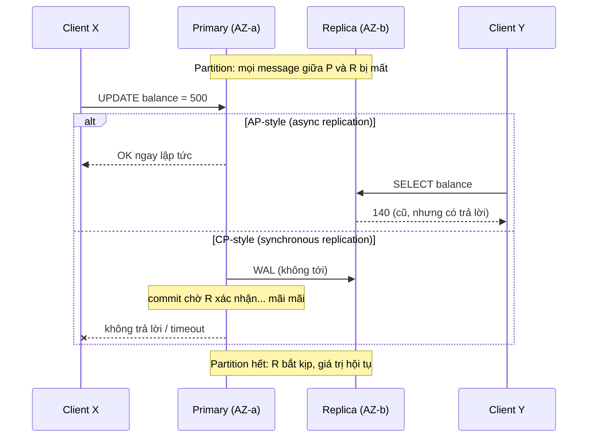
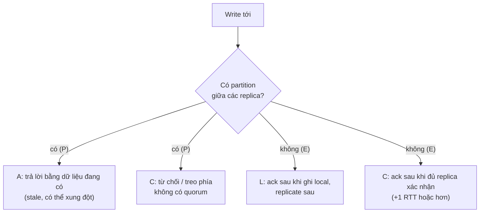

## Bối cảnh & vấn đề

Một sàn bán hàng chạy trên hai availability zone, mỗi AZ có một bản sao dữ liệu tồn kho. Một buổi chiều, đường mạng giữa hai AZ chập chờn 40 giây. Trong 40 giây đó, request đặt hàng tới AZ-b. Hệ thống có hai lựa chọn: **trả lời** dựa trên bản sao ở AZ-b (có thể đã cũ: AZ-a vừa bán món cuối cùng), hoặc **từ chối** cho tới khi liên lạc lại được với AZ-a. Không có lựa chọn thứ ba "trả lời đúng ngay lập tức", vì thông tin cần để trả lời đúng nằm ở phía bên kia một đường mạng đã đứt.

Đó là toàn bộ nội dung của định lý CAP: một sự thật hiển nhiên khi đã nhìn ra, nhưng bị trích dẫn sai nhiều hơn bất kỳ khái niệm nào khác trong hệ phân tán. "Chọn 2 trong 3", "MongoDB là CP", "chúng tôi chọn CA" là những câu interviewer dùng để phân loại ứng viên. Và CAP chỉ nói về lúc mạng đứt; 99% thời gian còn lại, hệ thống vẫn phải trả một cái giá khác cho consistency: **latency**. PACELC đặt tên cho cái giá đó.

Bài này phát biểu CAP và PACELC chính xác, đo cả hai trade-off trên một cặp PostgreSQL primary/replica thật, và kết thúc bằng câu hỏi thực tế nhất: trong một hệ e-commerce, phần nào cần strong consistency và phần nào không.

## Khái niệm

### Ba chữ C, A, P theo đúng định nghĩa

CAP bắt đầu là một phỏng đoán của Eric Brewer (2000) và được Seth Gilbert và Nancy Lynch chứng minh (2002) với định nghĩa chặt:

- **C — Consistency** nghĩa là **linearizability**: mọi thao tác trông như xảy ra tức thời tại một điểm duy nhất giữa lúc gọi và lúc trả về, theo thời gian thực. Sau khi một write được xác nhận, mọi read sau đó, ở bất kỳ node nào, đều thấy giá trị đó hoặc mới hơn. Đây **không phải** chữ C trong ACID (C của ACID là "transaction giữ các invariant của ứng dụng", ví dụ số dư không âm).
- **A — Availability** nghĩa là: mọi request tới một node **không bị lỗi** phải nhận được response **không phải lỗi**, cuối cùng. "Trả 503" không tính là available. Định nghĩa này cũng không có giới hạn thời gian: một node trả lời sau 10 phút vẫn "available" theo CAP, nên A của CAP khác hẳn "availability 99,9%" của SLO.
- **P — Partition tolerance** nghĩa là hệ thống tiếp tục hoạt động (theo một nghĩa nào đó) khi mạng **mất message tuỳ ý** giữa các nhóm node.

Định lý: **khi có network partition, một hệ thống không thể vừa linearizable vừa available.** Chứng minh ngắn đến mức có thể nói trong phỏng vấn: hai node G1 và G2 bị partition; client ghi `x = 1` vào G1; một client khác đọc `x` từ G2. Để available, G2 phải trả lời; nhưng G2 không thể biết về write ở G1 vì mọi message đều mất; nên G2 trả giá trị cũ, vi phạm linearizability.

### Vì sao "chọn 2 trong 3" sai

Câu "chọn 2 trong 3" ngụ ý ba lựa chọn ngang hàng: CA, CP, AP. Nhưng P **không phải thứ bạn chọn**: partition là một sự kiện xảy ra với bạn (switch hỏng, cáp đứt, GC pause dài, cấu hình firewall sai). Một hệ thống chạy trên nhiều máy qua mạng **sẽ** gặp partition; câu hỏi duy nhất là nó làm gì khi gặp. Nên chỉ có hai lựa chọn thật, và chỉ trong lúc partition: từ chối (giữ C, mất A) hoặc trả lời có thể sai (giữ A, mất C).

"Hệ CA" chỉ có nghĩa là "hệ không chịu được partition", tức là một node duy nhất (Postgres một máy), hoặc một hệ mà khi partition xảy ra thì hành vi không được định nghĩa. Nói "chúng tôi chọn CA" trong phỏng vấn là red flag. Ngoài lúc partition, CAP **không nói gì**: không có đánh đổi C/A khi mạng khoẻ.

Brewer (2012) tự nhận xét rằng cách nói "2 trong 3" gây hiểu lầm: partition hiếm, nên thiết kế tốt là chọn C/A **theo từng thao tác** và **trong khoảng thời gian partition**, kèm kế hoạch phát hiện và phục hồi sau partition.

**Interview angle:** câu hỏi mở đầu "phát biểu CAP chính xác" — ba điểm phải có: chỉ khi partition, C = linearizability, P không phải tuỳ chọn.

### CP và AP trong thực tế, và vì sao nhãn thường sai

- **CP**: trong partition, phía không chắc chắn có dữ liệu mới nhất **từ chối** hoặc treo. etcd, ZooKeeper, Consul (khi đọc linearizable), Spanner: phía thiểu số không nhận write, không trả read linearizable.
- **AP**: mọi node còn sống trả lời, dữ liệu có thể cũ hoặc xung đột, hội tụ sau (eventual consistency). Cassandra/ScyllaDB ở consistency `ONE`, DynamoDB eventual read, DNS, CDN.

Martin Kleppmann chỉ ra rằng phần lớn database **không phải CP cũng không phải AP** theo định nghĩa chặt. Ví dụ quan trọng nhất cho web developer: **PostgreSQL single-leader với async replica**. Đọc từ replica không linearizable ngay cả khi mạng khoẻ (replica lag), nên không phải C. Trong partition, primary vẫn nhận write còn replica phía bên kia không nhận write được (trả lỗi read-only), nên cũng không phải A theo nghĩa CAP. Nếu failover sang replica khi primary bị cô lập, các write chưa replicate sẽ **mất**. Câu trả lời chính xác là: "nó không thoả cả hai; hãy nói cụ thể nó làm gì trong partition và khi failover".

Nhiều hệ còn cho chọn **theo từng request**: Cassandra `QUORUM` vs `ONE`, DynamoDB `ConsistentRead: true`, MongoDB `readConcern`/`writeConcern`, etcd `--consistency=s` (serializable, có thể cũ) vs mặc định linearizable. Nhãn CP/AP gán cho cả hệ thống vì thế thường là nhãn cho **cấu hình mặc định**.

**Interview angle:** follow-up kinh điển "Postgres một primary + async replica là CP hay AP?" — trả lời đúng là phân tích hành vi chứ không chọn nhãn.

### PACELC

Daniel Abadi (2010 blog, 2012 paper) bổ sung phần CAP bỏ qua: **if Partition, choose Availability or Consistency; Else, choose Latency or Consistency.** Ý chính: kể cả khi mạng hoàn toàn khoẻ, muốn một write được thấy ở mọi replica trước khi xác nhận thì phải **chờ replica trả lời**, tức là ít nhất một round-trip mạng (và nếu replica ở region khác, hàng chục tới hàng trăm mili giây). Muốn latency thấp thì xác nhận trước, replicate sau, và chấp nhận đọc cũ.

Trade-off E/L/C có mặt **trong mọi request**, còn trade-off P/A/C chỉ xảy ra vài lần một năm. Vì vậy với nhiều hệ, PACELC mô tả trải nghiệm người dùng sát hơn CAP.

Phân loại thường thấy (trích Abadi 2012 và tài liệu từng hệ; chi tiết phụ thuộc cấu hình nên coi là (verify)):

| Hệ | P → | E → | Ghi chú |
| --- | --- | --- | --- |
| Dynamo, Cassandra, Riak | A | L | Mặc định; `QUORUM` dịch về phía C |
| DynamoDB | A | L | Mặc định eventual read; `ConsistentRead` cho read mạnh trong một region, trả thêm latency và capacity |
| BigTable/HBase, VoltDB | C | C | Ghi đồng bộ |
| etcd, ZooKeeper | C | C (write) | ZooKeeper đọc từ follower mặc định có thể cũ (cần `sync`), etcd mặc định đọc linearizable |
| Spanner | C | C | Paxos đồng bộ + commit wait; "latency thấp" là nhờ hạ tầng, không phải bỏ C |
| MongoDB | A | C | Theo Abadi 2012; cấu hình hiện đại `w: majority` khác nhiều (verify) |
| Postgres async replica | (xem trên) | L | Replica lag; sync replication đổi sang C |

**DynamoDB với strongly consistent read** là ví dụ PACELC chuyển theo request: read đó chọn C thay vì L (chi phí: đọc từ leader của partition, latency cao hơn, gấp đôi read capacity), và nếu không liên lạc được với leader thì read trả lỗi (chọn C thay vì A). Write và read mặc định vẫn là PA/EL.

**Interview angle:** "PACELC thêm gì cho CAP?" — latency là cái giá của consistency **mỗi ngày**, không chỉ khi partition.

### Strong vs eventual consistency nhìn từ người dùng

**Strong consistency** (ở đây hiểu là linearizable): sau khi bạn bấm "Lưu" và thấy "Đã lưu", mọi thiết bị, mọi người, mọi region đều thấy giá trị mới. **Eventual consistency**: nếu không ai ghi thêm, các bản sao **cuối cùng** sẽ giống nhau; trong lúc chờ, có người thấy giá trị cũ. Eventual consistency không nói "cuối cùng" là bao lâu, cũng không nói gì về việc bạn có thấy write của chính mình không.

Ví dụ người dùng: đổi mật khẩu cần strong (mật khẩu cũ không được đăng nhập ở region khác sau khi đổi); số like, feed, kết quả search, trang danh sách sản phẩm chấp nhận eventual (thấy 1.203 like thay vì 1.204 trong vài giây không ai bị hại). Giữa hai cực có những mức yếu hơn strong nhưng vẫn hữu ích như read-your-writes và causal consistency, chủ đề của [bài Consistency models](/tracks/distributed-systems/learn/consistency-models).

## Cơ chế hoạt động

Sơ đồ dưới cho thấy hai chiến lược trong cùng một partition. Client X ở phía primary, client Y ở phía replica:



Nhánh AP: primary xác nhận ngay vì nó không cần ai khác; replica trả lời bằng dữ liệu đang có. Hệ thống "available" ở cả hai phía nhưng hai client thấy hai sự thật khác nhau. Nhánh CP: primary từ chối xác nhận cho tới khi replica có bản ghi, nên client X không nhận được "OK" nào là sai; đổi lại, X không nhận được gì cả.

Trong lúc mạng khoẻ (nhánh E của PACELC), cùng hai chiến lược đó có chi phí latency khác nhau: async trả lời sau một lần flush local; sync trả lời sau khi WAL đi tới replica, được ghi (hoặc apply), và ack quay về, tức là thêm ít nhất một RTT.



## Ví dụ thực tế

### Đo cả hai trade-off trên PostgreSQL 17

PostgreSQL 17.11: một primary, một streaming replica (`application_name=r1`); đường replication đi qua Toxiproxy 2.12 với latency +10 ms mỗi chiều (giả lập replica ở AZ khác xa). `synchronous_standby_names = 'r1'` bật synchronous replication; mỗi session chọn mức chờ bằng `synchronous_commit`.

```ts
await P.query("ALTER SYSTEM SET synchronous_standby_names = 'r1'");
await P.query("SELECT pg_reload_conf()");
async function writes(mode: "local" | "remote_apply", n = 20) {
  await P.query(`SET synchronous_commit = ${mode}`);
  for (let i = 0; i < n; i++) {
    const t0 = performance.now();
    await P.query("UPDATE acct SET balance = balance + 1 WHERE id = 1");
    times.push(performance.now() - t0);
  }
}
```

```text
== E (no partition): replication link has +10ms latency each way
async (synchronous_commit=local):       p50=2.4ms p95=10.1ms
sync  (synchronous_commit=remote_apply): p50=26.8ms p95=49.7ms
```

Đây là chữ **E → L hoặc C** của PACELC đo bằng số: cùng một UPDATE, chờ replica apply làm p50 tăng hơn 10 lần (từ ~2 ms lên ~27 ms, khớp với RTT 20 ms thêm vào). Lần chạy trước cho p50 async 0,5 ms; con số tuyệt đối dao động theo máy, tỉ lệ thì không.

Rồi cắt hẳn đường replication (`enabled: false` trên proxy):

```ts
await P.query("SET synchronous_commit = local");
await P.query("UPDATE acct SET balance = 500 WHERE id = 1");   // async: accepted
// replica still serves reads
await P.query("SET synchronous_commit = remote_apply; SET statement_timeout = '2s'");
await P.query("UPDATE acct SET balance = 999 WHERE id = 1");   // sync: waits for r1
```

```text
== P (partition): replication link cut
AP-style (async): write accepted. primary reads 500, replica reads 140 (stale)
  after 3s the UPDATE is still waiting (statement_timeout=2s ignored), wait_event=SyncRep -> pg_cancel_backend
  WARNING: canceling wait for synchronous replication due to user request
  DETAIL: The transaction has already committed locally, but might not have been replicated to the standby.
CP-style (sync): UPDATE returned rowCount=1 after 3042ms, only because we cancelled the wait
after the 'failed' sync write, primary reads 999
```

Ba điều đáng nhớ từ output này. Thứ nhất, nhánh async là AP-style: write được nhận, replica trả `140` cũ. Thứ hai, nhánh sync là CP-style: commit **treo** với `wait_event=SyncRep` và `statement_timeout` không cắt được nó (trong lần chạy này; hành vi chờ SyncRep là sau khi commit local, (verify) trên version của bạn). Thứ ba, và nguy hiểm nhất: khi hủy việc chờ, Postgres trả **thành công** kèm một WARNING, và write **đã commit ở primary** (`999`) dù chưa replicate. Synchronous replication của Postgres đảm bảo "không ack cho client trước khi replica có", không đảm bảo "write không tồn tại nếu replica không có". Ứng dụng nào coi WARNING đó là lỗi và retry sẽ ghi hai lần. Vài giây sau khi mở lại mạng, replica bắt kịp và đọc ra `999`.

### Vạch ranh giới consistency cho e-commerce

Cách bảo vệ một ranh giới trong phỏng vấn là đánh giá **chi phí khi sai** (tiền, pháp lý, niềm tin) so với **chi phí của strong** (latency, availability khi partition, độ phức tạp):

| Tính năng | Mức cần | Lý do | Cách đạt |
| --- | --- | --- | --- |
| Trừ tồn kho khi đặt / giữ chỗ | Strong tại một chỗ | Bán quá = huỷ đơn, mất niềm tin | `UPDATE ... WHERE stock >= n` trên primary |
| Thanh toán, số dư ví | Strong + idempotent | Tiền, đối soát, pháp lý | Một nguồn sự thật, idempotency key |
| Mã giảm giá dùng một lần | Strong | Lạm dụng mã tốn tiền thật | Unique constraint |
| Unique email/username | Strong | Hai tài khoản cùng email phá auth | Unique index |
| Quyền truy cập, revoke | Strong (hoặc TTL ngắn có chủ đích) | Lộ dữ liệu | Đọc từ primary hoặc cache TTL vài giây |
| Catalog, search index | Eventual | Giá hiển thị trễ vài giây; checkout kiểm lại giá | CDC → search index |
| "Còn hàng" ở trang listing | Eventual | Chỉ là gợi ý; checkout mới quyết định | Cache vài giây |
| Review, lượt xem, recommendation | Eventual | Sai lệch nhỏ vô hại | Async, counter gộp |
| Email, analytics | Eventual | Có thể trễ phút | Queue, outbox |

Hai nguyên tắc rút ra. Một: strong consistency **không cần toàn cục**; nó cần ở **điểm quyết định** (thao tác trừ kho, thao tác charge), còn mọi thứ hiển thị có thể eventual miễn là điểm quyết định kiểm tra lại. Hai: phần eventual cần **UX cho trạng thái trung gian**: hiển thị "đang xử lý", refetch sau khi ghi, optimistic UI, và thông báo khi điểm quyết định từ chối ("món này vừa hết").

**Interview angle:** follow-up "làm sao không oversell mà checkout vẫn nhanh khi spike?" — giữ chỗ bằng một thao tác atomic (UPDATE có điều kiện hoặc Redis Lua reservation có đối soát), queue/waiting room phía trước, listing đọc số xấp xỉ.

## Trade-offs & lựa chọn thay thế

| Lựa chọn | Được | Mất | Hợp khi |
| --- | --- | --- | --- |
| CP (từ chối khi partition) | Không bao giờ trả dữ liệu sai | Availability ở phía thiểu số | Tiền, tồn kho, lock, metadata cluster |
| AP (trả lời khi partition) | Luôn phản hồi | Stale/xung đột, cần merge sau | Giỏ hàng, feed, counter, DNS |
| EC (sync replication) | Read ở mọi replica thấy write | +1 RTT mỗi write, write treo khi replica chậm | Dữ liệu không được mất khi failover |
| EL (async replication) | Write nhanh | Replica lag, mất write khi failover | Đa số workload đọc nhiều |
| Consistency theo request | Chọn đúng mức cho từng thao tác | Độ phức tạp, dễ chọn nhầm | Hệ lớn trộn nhiều loại dữ liệu |

Chọn thế nào: bắt đầu từ dữ liệu, không từ database. Với mỗi loại dữ liệu, hỏi "nếu người dùng đọc giá trị cũ 5 giây thì sao?" và "nếu một write đã ack bị mất khi failover thì sao?". Nếu câu trả lời là "mất tiền/pháp lý", dữ liệu đó cần một nguồn sự thật CP/EC và các read quyết định phải đi tới đó. Phần còn lại hưởng latency và availability của AP/EL. Một hệ thống thật hầu như luôn là **hỗn hợp**.

## Edge cases & failure modes

- **Partition một phía, không đối xứng**: primary vẫn thấy client nhưng không thấy replica; với sync replication, mọi write treo dù client "kết nối tốt".
- **Sync replication với một standby duy nhất**: standby chết = primary không ack write nào nữa. Postgres hỗ trợ `ANY 1 (r1, r2)` (quorum commit) để chịu được một standby chết.
- **Hủy chờ sync rep**: như đã đo, write vẫn commit local; retry sau cảnh báo dễ thành ghi trùng.
- **Failover khi async**: replica được promote thiếu các write cuối; client đã nhận "OK" cho những write đó.
- **"Strong" chỉ trong một region**: DynamoDB `ConsistentRead` không áp dụng xuyên region với global tables (verify); đọc ở region khác vẫn eventual.
- **Cache trước database strong**: database linearizable nhưng cache trả giá trị cũ; consistency của hệ là consistency của tầng **yếu nhất** mà read đi qua.
- **Partition rất ngắn, rất thường xuyên**: GC pause hoặc packet loss tạo hàng chục "partition" vài trăm mili giây mỗi ngày; hệ CP sẽ trả lỗi lẻ tẻ, cần retry ở client.

## Pitfalls

- ❌ "Hệ của chúng tôi chọn CA" → ✅ P không phải tuỳ chọn; nói hệ làm gì khi partition (từ chối hay trả dữ liệu cũ).
- ❌ Nhầm C của CAP với C của ACID → ✅ CAP C = linearizability; ACID C = invariant của ứng dụng.
- ❌ Gán nhãn CP/AP cho cả database → ✅ mô tả theo cấu hình và theo thao tác (`QUORUM` vs `ONE`, primary vs replica).
- ❌ Nghĩ CAP chỉ quan trọng khi partition nên bỏ qua → ✅ PACELC: latency của consistency trả mỗi request.
- ❌ Coi WARNING "canceling wait for synchronous replication" là lỗi rồi retry → ✅ write đã commit local; dùng idempotency hoặc kiểm tra lại trạng thái.
- ❌ Strong consistency cho mọi thứ "cho an toàn" → ✅ strong ở điểm quyết định, eventual cho hiển thị, kèm UX cho trạng thái trung gian.
- ❌ Đặt cache/replica trước dữ liệu quyết định rồi vẫn tin là strong → ✅ read quyết định phải đi tới nguồn sự thật.

## Tóm tắt

- CAP: **khi có network partition**, không thể vừa linearizable vừa available; P không phải lựa chọn, "CA" = không phân tán.
- C của CAP là linearizability, khác C của ACID; A của CAP là "node còn sống trả lời không lỗi", khác SLO availability.
- Phần lớn database không thuần CP hay AP; mô tả hành vi theo cấu hình và theo thao tác.
- PACELC: Else → **Latency vs Consistency**; đo trên Postgres: sync replication qua RTT 20 ms làm p50 write từ ~2 ms lên ~27 ms.
- Trong partition: async Postgres nhận write và replica trả dữ liệu cũ; sync Postgres treo commit (`SyncRep`), và hủy chờ vẫn để lại write đã commit local.
- E-commerce: strong ở điểm quyết định (tồn kho, thanh toán, mã một lần, unique), eventual cho catalog, listing, review, analytics.
- Chọn mức consistency theo **chi phí khi sai** của từng loại dữ liệu, không theo database.
