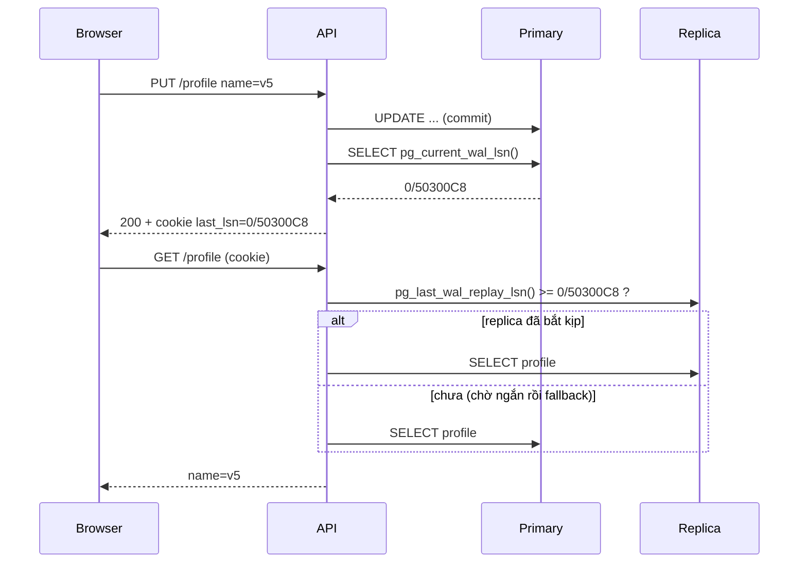

## Bối cảnh & vấn đề

Ticket từ khách hàng: "Tôi đổi tên hiển thị, bấm Lưu, thấy thông báo thành công, rồi trang reload lại hiện **tên cũ**. Bấm F5 lần nữa thì thấy tên mới. F5 lần ba lại thấy tên cũ." Không có bug nào trong code cập nhật profile. Kiến trúc: write đi vào PostgreSQL primary, read đi qua load balancer tới một trong hai read replica, và hai replica có replication lag khác nhau (một cái ở cùng AZ, một cái ở AZ khác và đang bận chạy report).

Hai triệu chứng ở đây là hai vi phạm khác nhau, có tên riêng. "Lưu xong reload thấy tên cũ" là vi phạm **read-your-writes**. "F5 thấy mới rồi F5 lại thấy cũ" là vi phạm **monotonic reads**. Cả hai đều hợp lệ dưới **eventual consistency**, thứ mà async replica cung cấp. Để sửa đúng, ta cần biết chính xác mình cần đảm bảo nào, chứ không phải "làm cho nó strong" (tốn latency và availability, như [bài CAP/PACELC](/tracks/distributed-systems/learn/cap-pacelc) đã đo).

Bài này đi qua thang **consistency models** từ mạnh nhất tới yếu nhất, mỗi model trả lời câu hỏi "một client có thể thấy những kết quả nào?", rồi đo cả hai triệu chứng trên Postgres thật và sửa bằng LSN token.

## Khái niệm

### Consistency model là một hợp đồng

Một **consistency model** là hợp đồng giữa hệ lưu trữ và client: nó liệt kê những **history** (chuỗi thao tác đọc/ghi kèm thời điểm gọi và trả về) nào được phép xảy ra. Model càng mạnh thì càng ít history hợp lệ, càng dễ lập trình (ít bất ngờ), nhưng càng tốn coordination (latency, availability). Model càng yếu thì ngược lại.

Lưu ý thuật ngữ: "consistency" ở đây là về **replica và thứ tự thao tác**, khác với "isolation" trong database (transaction nhìn thấy nhau thế nào, xem [bài Isolation levels](/tracks/sql-postgres/learn/isolation-levels)). Hai trục này gặp nhau ở **strict serializability** = serializable + linearizable.

### Linearizability

**Linearizable** (Herlihy & Wing 1990): mỗi thao tác trông như xảy ra **tức thời** tại một điểm nào đó giữa lúc gọi và lúc trả về, và thứ tự các điểm đó tôn trọng **thời gian thực**: nếu thao tác A trả về trước khi B bắt đầu, A phải đứng trước B. Hệ quả cho người dùng: khi write đã được xác nhận, không ai, ở đâu, đọc được giá trị cũ hơn nữa. Hệ thống cư xử như thể chỉ có **một bản sao** dữ liệu.

Linearizability là thứ bạn cần cho lock, leader election, unique constraint, "kiểm tra số dư rồi trừ" xuyên node. Nó được định nghĩa cho từng object (một key, một register); không nói gì về transaction nhiều key.

**Interview angle:** "linearizable khác serializable thế nào?" — linearizable: một object, thời gian thực; serializable: nhiều object trong transaction, kết quả tương đương một thứ tự tuần tự nào đó, không cần khớp thời gian thực.

### Sequential consistency

**Sequential consistency** (Lamport 1979): tồn tại **một thứ tự toàn cục** của mọi thao tác mà mọi node đều thấy giống nhau, và thứ tự đó tôn trọng **thứ tự của từng client** (program order). Nhưng nó **không** cần khớp thời gian thực giữa các client khác nhau: một read của client C có thể được xếp "trước" một write đã hoàn tất của client A, miễn là mọi người đồng ý cùng một thứ tự.

Ví dụ: A ghi `x = 1` và nhận OK lúc 10 ms. C đọc `x` lúc 12 ms và nhận `0`. Dưới linearizability đây là vi phạm; dưới sequential consistency thì hợp lệ, vì có thể xếp "C đọc 0" trước "A ghi 1". Phần ví dụ bên dưới kiểm chứng đúng history này.

### Causal consistency

**Causal consistency**: chỉ những thao tác có **quan hệ nhân quả** (happens-before) mới bắt buộc được mọi người thấy theo cùng thứ tự. Quan hệ nhân quả: cùng một client làm trước làm sau, hoặc B đọc được kết quả của A rồi mới làm. Các thao tác **đồng thời** (không ai biết về ai) có thể được các node khác nhau thấy theo thứ tự khác nhau.

Ví dụ kinh điển: Alice đăng "Tôi bị mất ví" rồi đăng "À tìm thấy rồi". Bob đọc cả hai và bình luận "Mừng quá!". Dưới causal consistency, không ai thấy bình luận của Bob mà không thấy hai bài đăng của Alice, và không ai thấy "tìm thấy rồi" trước "mất ví". Nhưng nếu Carol đăng một bài không liên quan cùng lúc, các node có thể xếp bài đó ở vị trí khác nhau.

Điều làm causal hấp dẫn: nó là model **mạnh nhất có thể giữ available khi partition** (đã được chứng minh trong các nghiên cứu về "causal+"), nên hợp với ứng dụng toàn cầu, nhiều region ghi. MongoDB có causally consistent sessions; nhiều hệ dùng vector clock hoặc dependency tracking để đạt nó ([bài Đồng hồ](/tracks/distributed-systems/learn/clocks-ordering-conflicts)).

### Session guarantees

Terry et al. (1994) định nghĩa bốn đảm bảo **theo một session** (một client), yếu hơn causal nhưng giải quyết đúng các bug người dùng hay thấy:

- **Read-your-writes**: client luôn thấy các write của **chính nó**. Sửa bug "lưu xong reload thấy tên cũ".
- **Monotonic reads**: một khi client đã thấy một giá trị, các read sau không thấy giá trị **cũ hơn**. Sửa bug "F5 thấy mới rồi lại thấy cũ".
- **Monotonic writes**: các write của một client được áp dụng theo đúng thứ tự client gửi.
- **Writes-follow-reads**: nếu client đọc được X rồi ghi Y, mọi người thấy Y thì cũng đã thấy X (đây là phần của causal).

Điểm then chốt: session guarantees chỉ ràng buộc góc nhìn của **chính client đó**. Người dùng khác vẫn có thể thấy tên cũ vài giây; điều đó thường chấp nhận được, còn chính người vừa sửa thấy tên cũ thì không.

### Eventual consistency

**Eventual consistency**: nếu không có write mới, mọi replica **cuối cùng** sẽ trả cùng một giá trị. Đó là tất cả. Không có giới hạn "cuối cùng" là bao lâu, không đảm bảo read-your-writes, không đảm bảo monotonic reads, và trong lúc có write đồng thời thì không nói gì về giá trị nào thắng. Async replica, DNS, CDN, search index cập nhật qua CDC, cache có TTL đều là eventual.

Eventual consistency không phải "sai": nó là lựa chọn đúng cho phần lớn dữ liệu hiển thị. Nó chỉ cần được **ghép** với các đảm bảo session ở những chỗ người dùng nhận ra.

## Cơ chế hoạt động

Các model xếp thành một thang: mạnh hơn kéo theo mọi đảm bảo của model yếu hơn.

```mermaid
flowchart TD
    SS["Strict serializable<br/>(serializable + linearizable)"] --> L["Linearizable<br/>(một object, thời gian thực)"]
    SS --> SER["Serializable<br/>(transaction, không cần thời gian thực)"]
    L --> SEQ["Sequential<br/>(một thứ tự chung, giữ thứ tự từng client)"]
    SEQ --> C["Causal<br/>(giữ thứ tự nhân quả)"]
    C --> RYW["Read-your-writes"]
    C --> MR["Monotonic reads"]
    C --> MW["Monotonic writes"]
    RYW --> EV["Eventual"]
    MR --> EV
    MW --> EV
```



Ranh giới quan trọng nằm giữa sequential và causal: từ causal trở xuống có thể đạt được mà vẫn available khi partition (mỗi replica tự phục vụ, chỉ cần theo dõi dependency); từ sequential/linearizable trở lên thì không, vì cần coordination để đồng ý một thứ tự chung.

Trong kiến trúc primary + async replica, read-your-writes được thêm vào bằng cách gắn **vị trí của write** vào session và chỉ cho đọc ở replica đã bắt kịp vị trí đó:



Token LSN (Log Sequence Number, vị trí trong WAL) chính là một "phiên bản" của toàn bộ database. Replica báo đã replay tới đâu; nếu đã vượt token thì chắc chắn chứa write của user. Cách này giữ được read scaling (đa số read vẫn đi replica) mà chỉ trả thêm chi phí cho đúng các read cần nó. Token cũng giải quyết luôn monotonic reads nếu client gửi kèm **LSN lớn nhất đã thấy** ở mọi read, không chỉ sau write.

## Ví dụ thực tế

### Kiểm tra một history có linearizable không

Một checker vét cạn nhỏ cho một register (giá trị đầu 0): tìm một thứ tự toàn cục hợp lệ, với ràng buộc thứ tự là thời gian thực (linearizable) hoặc chỉ thứ tự trong cùng client (sequential).

```ts
const mustPrecede = (a: Op, b: Op) =>
  mode === "linearizable" ? a.end < b.start                       // real time, any clients
                          : a.proc === b.proc && a.end < b.start; // program order only
// DFS: pick any op whose predecessors are all placed and whose read value matches the register
const H1 = [
  { label: "A:write(1)", proc: "A", type: "write", value: 1, start: 0,  end: 10 },
  { label: "B:read=1",   proc: "B", type: "read",  value: 1, start: 5,  end: 15 },
  { label: "C:read=0",   proc: "C", type: "read",  value: 0, start: 12, end: 20 },
];
const H2 = [
  { label: "A:write(1)", proc: "A", type: "write", value: 1, start: 0,  end: 10 },
  { label: "A:read=0",   proc: "A", type: "read",  value: 0, start: 12, end: 20 },
];
```

```text
H1 (C reads 0 after the write finished)
  linearizable: NO
  sequential:   yes, e.g. C:read=0 -> A:write(1) -> B:read=1
H2 (A reads 0 after its own write)
  linearizable: NO
  sequential:   NO
```

H1 là "người khác thấy giá trị cũ sau khi write đã xong": không linearizable, nhưng sequential consistent (xếp C trước A). H2 là "chính tôi không thấy write của tôi": vi phạm cả sequential (vì vi phạm thứ tự của chính client A), và cũng chính là vi phạm read-your-writes. Jepsen và thư viện Knossos/Elle làm đúng việc này ở quy mô lớn để kiểm tra database thật.

### Hai triệu chứng của ticket và cách sửa, trên PostgreSQL 17

PostgreSQL 17.11: primary, replica `r2` replicate trực tiếp (gần như không lag), replica `r1` replicate qua Toxiproxy với latency 300 ms ở chiều WAL về.

```ts
await P.query("UPDATE profile SET name = 'Thanh Dinh' WHERE id = 1");
console.log(await read(R1));                       // 1. naive read from lagging replica

await P.query("UPDATE profile SET name = 'v3' WHERE id = 1");
console.log(await read(R2), await read(R1));       // 2. LB alternates replicas

// 3. read-your-writes with an LSN token
await P.query("UPDATE profile SET name = 'v5' WHERE id = 1");
const { rows: [w] } = await P.query("SELECT pg_current_wal_lsn()::text AS lsn"); // AFTER commit
// on read: poll the replica until it has replayed past the token
await R1.query("SELECT pg_last_wal_replay_lsn() >= $1::pg_lsn AS ok", [w.lsn]);
```

```text
== 1. naive: write to primary, read from a lagging replica
read right after write -> 'Thanh'   (user sees the old name: read-your-writes violated)

== 2. monotonic reads: same user, load balancer alternates replicas
request 1 -> replica r2 (no lag): 'v3'
request 2 -> replica r1 (lag):    'Thanh Dinh'   (time went backwards)

== 3a. read-your-writes via LSN token, LSN taken INSIDE the statement (bug)
token LSN 0/502FFD0: replica r1 replayed to 0/502FFD0 after 2ms -> 'v3'

== 3b. LSN taken AFTER COMMIT returned
token LSN 0/50300C8: replica r1 replayed to 0/50300C8 after 311ms -> 'v5'
```

Phần 1 và 2 tái hiện đúng hai triệu chứng của ticket. Phần 3a là một bug có thật mà ta vừa vấp phải khi viết demo: lấy LSN bằng `RETURNING pg_current_wal_lsn()` **ngay trong** câu UPDATE trả về vị trí WAL **trước khi** commit record được ghi. Replica đã replay tới vị trí đó sau 2 ms nhưng chưa có commit, nên vẫn trả `'v3'` cũ. Phần 3b lấy LSN bằng một câu riêng **sau khi** commit trả về: replica cần 311 ms (≈ latency 300 ms đã tiêm) để vượt token, rồi trả đúng `'v5'`.

Trong production, polling được giới hạn bằng một khoảng chờ ngắn (ví dụ 50–100 ms) rồi **fallback về primary**, để một replica lag nặng không làm request treo.

### Bốn cách đạt read-your-writes

| Cách | Cơ chế | Ưu | Nhược |
| --- | --- | --- | --- |
| Đọc primary sau khi ghi | Session ghi `last_write_at`; trong N giây sau đó đọc primary | Đơn giản, không cần LSN | Chọn N đoán mò; dồn tải về primary khi ghi nhiều |
| LSN/position token | Lưu LSN sau commit; chỉ đọc replica đã replay qua nó | Chính xác, giữ read scaling | Cần routing thông minh; token phải đi theo user qua mọi thiết bị nếu muốn cross-device |
| Sticky routing | User luôn đọc một replica cố định | Cho monotonic reads miễn phí | Không cho read-your-writes nếu replica đó lag; replica chết thì mất "dính" |
| Trả dữ liệu từ response của write | UI dùng kết quả của PUT, không đọc lại ngay | Không thêm tải | Chỉ cho màn hình ngay sau đó; tab khác vẫn thấy cũ |

Các hệ khác có cơ chế tương đương: MongoDB causally consistent session gửi `afterClusterTime`; DynamoDB cho `ConsistentRead`; Aurora/RDS Proxy có tuỳ chọn read-after-write ở một số cấu hình (verify).

**Interview angle:** follow-up "cái này tương tác với cache trước replica thế nào?" — cache là một replica nữa; sau khi ghi phải invalidate/ghi đè cache của chính user, hoặc bỏ qua cache cho read có token.

## Trade-offs & lựa chọn thay thế

| Model | Lập trình | Latency | Available khi partition | Ví dụ |
| --- | --- | --- | --- | --- |
| Linearizable | Dễ nhất (như một bản sao) | Cao: cần quorum/leader | Không | etcd, ZooKeeper (`sync`), Spanner |
| Sequential | Dễ, trừ bất ngờ thời gian thực | Cao | Không | ZooKeeper đọc follower (gần với mức này) |
| Causal | Ổn cho đa số ứng dụng cộng tác | Thấp, local | Có | MongoDB causal sessions, COPS |
| Session guarantees | Sửa đúng bug người dùng thấy | Thấp, chỉ trả cho read cần | Có (nếu routing theo session) | LSN token, sticky session |
| Eventual | Khó: phải chịu mọi bất ngờ | Thấp nhất | Có | Async replica, DNS, CDN, search index |

Chọn thế nào: bắt đầu từ triệu chứng người dùng không được thấy. "Tôi không thấy cái tôi vừa làm" → read-your-writes. "Dữ liệu nhảy lùi" → monotonic reads. "Bình luận xuất hiện trước bài viết" → causal. "Hai người cùng lấy được một suất cuối" → linearizable (hoặc một ràng buộc ở nguồn sự thật). Chỉ trả giá cho đúng đảm bảo cần thiết, ở đúng thao tác cần nó.

## Edge cases & failure modes

- **Cross-device**: token trong cookie của laptop không đi theo điện thoại; user sửa trên laptop, mở app trên điện thoại vẫn thấy cũ. Muốn đảm bảo cross-device thì lưu token phía server theo user.
- **Replica bị tách và lag vô hạn**: polling không bao giờ thoả; cần timeout + fallback primary, và health check loại replica lag quá ngưỡng.
- **Failover**: primary mới có timeline/LSN khác; token LSN của primary cũ có thể không còn ý nghĩa (hoặc lớn hơn mọi thứ replica mới có), dẫn tới fallback hàng loạt về primary.
- **LSN lấy trong transaction**: như đã đo, vị trí trước commit record; phải lấy sau `COMMIT`.
- **Cache trước replica**: cache trả giá trị cũ dù replica đã bắt kịp; consistency của read = tầng yếu nhất.
- **Write qua nhiều database**: token LSN chỉ có nghĩa với một cluster; write vào Postgres + Elasticsearch cần token riêng cho từng nơi hoặc chấp nhận eventual cho search.
- **Load balancer round-robin** giữa replica có lag khác nhau tạo vi phạm monotonic reads ngay cả khi không ai ghi gì mới (đo ở phần 2).

## Pitfalls

- ❌ "Eventual consistency nghĩa là vài trăm mili giây" → ✅ không có giới hạn; replica có thể lag phút khi bận hoặc bị tách.
- ❌ Bật synchronous replication cho mọi thứ để sửa bug "lưu xong thấy cũ" → ✅ read-your-writes theo session (LSN token, đọc primary sau ghi) rẻ hơn nhiều.
- ❌ Lấy `pg_current_wal_lsn()` trong cùng câu lệnh ghi → ✅ lấy sau khi commit trả về.
- ❌ Polling replica không có giới hạn → ✅ chờ ngắn rồi fallback primary.
- ❌ Nghĩ sticky session đã đủ cho read-your-writes → ✅ sticky cho monotonic reads; replica dính vẫn có thể lag sau write.
- ❌ Nhầm linearizable với serializable → ✅ một object + thời gian thực vs nhiều object trong transaction.
- ❌ Áp đảm bảo session cho mọi user khác → ✅ chỉ người ghi cần thấy ngay; người khác chấp nhận eventual.

## Tóm tắt

- Consistency model = danh sách history được phép; mạnh hơn thì dễ lập trình hơn nhưng tốn coordination hơn.
- Linearizable: như một bản sao, thời gian thực; sequential: một thứ tự chung không cần thời gian thực; causal: chỉ giữ thứ tự nhân quả, vẫn available khi partition.
- Session guarantees (read-your-writes, monotonic reads, monotonic writes, writes-follow-reads) sửa đúng các bug người dùng nhận ra.
- Checker đo: "người khác đọc cũ sau khi write xong" là sequential nhưng không linearizable; "chính tôi đọc cũ" vi phạm cả hai.
- Postgres async replica tái hiện cả hai triệu chứng; LSN token lấy **sau commit** sửa được read-your-writes (replica bắt kịp sau ~311 ms với lag 300 ms).
- Bốn cách đạt read-your-writes: đọc primary sau ghi, LSN token, sticky routing, dùng response của write; luôn có fallback.
- Chọn model theo triệu chứng không được phép thấy, ở đúng thao tác cần nó.
