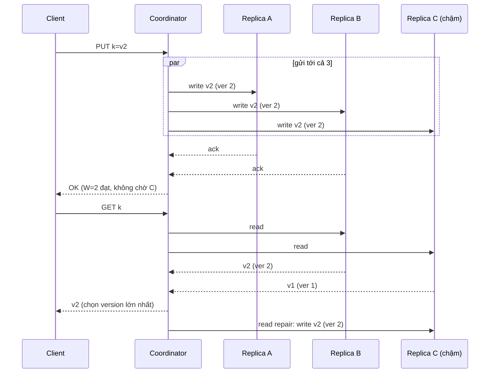
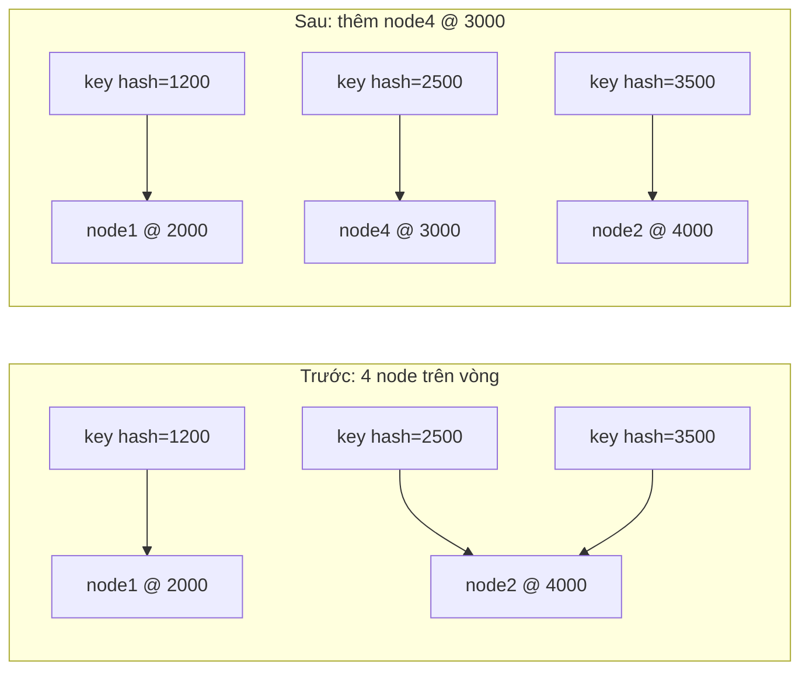

## Bối cảnh & vấn đề

Một cluster cache có 4 node memcached, client chọn node bằng `hash(key) % 4`. Black Friday, team thêm node thứ 5 để chịu tải. Ngay sau khi deploy cấu hình mới, hit rate rơi từ 95% xuống gần 20%, database nhận lượng read gấp 15 lần bình thường và bắt đầu timeout. Không có node nào hỏng; chỉ có công thức `% 5` thay `% 4` đã chuyển **gần 80% key** sang node khác, nơi chúng chưa từng được cache.

Cùng tuần đó, một team khác dùng Redis với Sentinel. Mạng giữa hai AZ chập chờn; Sentinel promote replica ở AZ-b thành master mới, trong khi master cũ ở AZ-a vẫn nhận write từ các client cùng AZ. Khi mạng ổn định, master cũ bị hạ thành replica, đồng bộ lại từ master mới, và mọi write nó nhận trong lúc partition **biến mất**.

Hai sự cố chạm vào hai câu hỏi nền tảng khi dữ liệu nằm trên nhiều máy: **chép dữ liệu ra nhiều bản như thế nào** (replication) và **chia dữ liệu cho các máy ra sao** (partitioning/sharding). Bài này đi qua các mô hình replication, quorum N/R/W và giới hạn của nó, mất write khi failover async, rồi tới consistent hashing và virtual nodes, mỗi phần đo bằng số thật.

## Khái niệm

### Ba mô hình replication

**Single-leader** (primary/replica, master/slave): mọi write đi vào một leader; leader gửi log thay đổi tới follower. Read có thể đi leader (mới nhất) hoặc follower (có thể cũ). PostgreSQL streaming replication, MySQL, MongoDB replica set, Redis, Kafka partition đều theo mô hình này. Ưu điểm: không có xung đột write, dễ suy luận. Nhược điểm: leader là nút cổ chai cho write, và failover là thời điểm nguy hiểm.

**Multi-leader**: nhiều node (thường mỗi region một) cùng nhận write, rồi replicate cho nhau. Ưu điểm: write latency thấp ở mọi region, chịu được mất một region. Nhược điểm: hai region có thể sửa cùng một bản ghi đồng thời, nên **phải giải quyết xung đột** (last-write-wins, merge, CRDT; xem [bài Đồng hồ & xung đột](/tracks/distributed-systems/learn/clocks-ordering-conflicts)). Ví dụ: CouchDB, ứng dụng offline-first, active-active multi-region.

**Leaderless** (Dynamo-style): client (hoặc một coordinator bất kỳ) gửi write tới **mọi** replica và coi là thành công khi đủ W replica xác nhận; read hỏi R replica và lấy bản có version mới nhất. Không có failover vì không có leader. Ví dụ: Cassandra, ScyllaDB, Riak, Amazon Dynamo (paper 2007; dịch vụ DynamoDB hiện nay dùng kiến trúc khác dựa trên leader của mỗi partition (verify)).

Theo chiều thời gian, replication có thể **synchronous** (ack sau khi replica xác nhận), **asynchronous** (ack trước, replicate sau) hoặc **semi-synchronous** (một replica sync, phần còn lại async). [Bài CAP/PACELC](/tracks/distributed-systems/learn/cap-pacelc) đã đo chi phí latency của sync trên Postgres.

### Quorum N, R, W

Trong leaderless replication, mỗi key có **N** replica. Write thành công khi **W** replica xác nhận; read hỏi **R** replica và lấy bản có version lớn nhất. Nếu **R + W > N**, tập replica đọc và tập replica ghi **giao nhau** ít nhất một node, nên read luôn chạm ít nhất một bản có write đã hoàn tất gần nhất. Cấu hình phổ biến: N = 3, W = 2, R = 2, chịu được một node chết cho cả read và write.

Các cấu hình khác đổi chiều tối ưu: **W = 1, R = 3** ưu tiên write nhanh và available (chỉ cần một node), nhưng read phải chờ cả ba và một node chết là read quorum hỏng. **W = 3, R = 1** ngược lại: read nhanh, nhưng một node chết là không ghi được. **W = 1, R = 1** (R + W ≤ N) nhanh nhất và luôn available, nhưng read có thể không thấy write vừa xong.

### Vì sao R + W > N vẫn chưa phải linearizable

Giao nhau giữa tập đọc và tập ghi chỉ đảm bảo "thấy write đã **hoàn tất**". Nhiều tình huống vẫn cho kết quả lạ:

- **Partial write**: write tới được ít hơn W replica, client nhận **lỗi**, nhưng replica đã ghi thì không rollback. Các read sau có lúc thấy giá trị mới (nếu chạm replica đó), có lúc thấy giá trị cũ: dữ liệu "nhảy lùi". Và khi **read repair** chép giá trị mới sang replica khác, write "thất bại" trở thành vĩnh viễn.
- **Write đồng thời**: hai client ghi cùng key cùng lúc; replica nhận theo thứ tự khác nhau. Nếu chọn bản thắng bằng timestamp (LWW), clock skew quyết định ai thắng.
- **Read đồng thời với write đang diễn ra**: read A thấy giá trị mới (vì chạm replica đã nhận), read B bắt đầu **sau khi A xong** lại thấy giá trị cũ (chạm hai replica chưa nhận). Vi phạm linearizability dù R + W > N.
- **Sloppy quorum và hinted handoff**: khi các replica "nhà" của key không liên lạc được, một số hệ cho phép ghi tạm vào node khác (giữ **hint** để chuyển về sau). W được "thoả" bởi node không nằm trong tập N, nên read từ tập nhà không giao với tập ghi.
- **Node replace / mất dữ liệu**: replica bị thay bằng node trống làm số bản có write ít hơn W.

Muốn linearizable với quorum cần thêm cơ chế: read phải **ghi lại** giá trị mới nhất lên đủ quorum trước khi trả (thuật toán ABD), hoặc dùng consensus (Raft/Paxos) cho key đó, như Cassandra lightweight transactions (Paxos) cho `IF NOT EXISTS`.

**Interview angle:** câu hỏi "R + W > N có đảm bảo linearizable không?" — không; nêu ít nhất hai lý do (partial write, sloppy quorum) và cách bổ sung (read repair đồng bộ trước khi trả, consensus).

### Read repair và anti-entropy

Replica lệch nhau thì phải có cơ chế đưa về giống nhau. **Read repair**: khi một read thấy các replica trả version khác nhau, coordinator ghi bản mới nhất lên replica cũ. Chỉ sửa được key **có người đọc**. **Anti-entropy**: tiến trình nền so sánh dữ liệu giữa replica (thường bằng **Merkle tree**: cây hash theo dải key, so từ gốc xuống để chỉ đồng bộ các dải khác nhau) và chép phần thiếu; Cassandra gọi là `nodetool repair`. **Gossip**: các node trao đổi trạng thái (ai sống, ai giữ dải nào) với vài node ngẫu nhiên mỗi giây, lan khắp cluster trong O(log N) vòng.

### Mất write khi failover async

Với single-leader async, leader ack cho client **trước khi** replica có dữ liệu. Nếu leader chết (hoặc bị cô lập) và một replica được promote, các write chưa replicate **không có** ở leader mới. Khi leader cũ quay lại, nó phải bỏ phần lịch sử khác biệt để đi theo leader mới. Postgres làm điều này khi bạn `pg_rewind` primary cũ; Redis làm điều này khi master cũ thành replica và full resync.

Redis Sentinel trong partition là ví dụ rõ nhất. Sentinel ở phía đa số thấy master "chết" (thực ra chỉ không liên lạc được), đủ quorum thì promote replica. Master cũ ở phía thiểu số **không biết** mình đã bị thay, tiếp tục nhận write từ client cùng phía. Khi partition hết, Sentinel cấu hình master cũ thành replica của master mới, và các write đó mất. Redis giới hạn cửa sổ mất mát bằng `min-replicas-to-write N` + `min-replicas-max-lag S`: master từ chối write nếu không có ít nhất N replica đã ack trong S giây gần nhất. Đây là giới hạn, không phải loại bỏ: trong S giây đầu partition, master cũ vẫn nhận write.

**Interview angle:** sau câu Sentinel, interviewer hỏi "dữ liệu nào chấp nhận mất kiểu này?" — cache, session có thể tạo lại, rate limit counter: chấp nhận được; đơn hàng, số dư, lock cho correctness: không, phải nằm ở hệ có consensus hoặc sync replication.

### Partitioning: hash % N

Khi dữ liệu không vừa một máy, ta chia nó thành **partition** (shard). Cách đơn giản nhất: `node = hash(key) % N`. Phân bố đều, lookup O(1). Nhưng khi N đổi, key chỉ đứng yên nếu `hash % N_cũ == hash % N_mới`; từ 4 lên 5 node, xác suất đó chỉ 20%, nên khoảng **80% key** đổi node. Với cache, đó là cache avalanche; với database, đó là di chuyển gần toàn bộ dữ liệu.

### Consistent hashing và virtual nodes

**Consistent hashing** (Karger 1997): đặt cả node và key lên một **vòng** giá trị hash (ví dụ 0..2³² − 1); mỗi key thuộc về node **đầu tiên theo chiều kim đồng hồ**. Thêm node mới chỉ "cắt" một đoạn của vòng từ node kế bên; bớt node chỉ chuyển đoạn của nó cho node kế tiếp. Lượng key di chuyển kỳ vọng là **1/N_mới**, mức tối thiểu có thể.

Với một điểm cho mỗi node, các đoạn trên vòng có độ dài rất không đều (vài node giữ gấp đôi trung bình), và khi một node chết, **toàn bộ** tải của nó dồn vào **một** node kế tiếp. **Virtual nodes** sửa cả hai: mỗi node vật lý có nhiều điểm (vnode) trên vòng, ví dụ 100–256. Tổng độ dài các đoạn của mỗi node tiến về trung bình, node mạnh có thể nhận nhiều vnode hơn, và khi node chết, các đoạn của nó chia cho **nhiều** node khác.

Các biến thể trong thực tế: **Redis Cluster** không dùng vòng mà **16384 hash slot cố định** (`CRC16(key) mod 16384`), mỗi node giữ một tập slot, di chuyển từng slot khi resharding; **hash tag** `{user:42}` ép nhiều key vào cùng slot. **Jump consistent hash** (Google): O(1) bộ nhớ, di chuyển tối thiểu, nhưng chỉ cho node đánh số 0..N−1 và chỉ thêm/bớt ở cuối. **Rendezvous hashing** (highest random weight): mỗi key chọn node có `hash(key, node)` lớn nhất. Cassandra dùng vòng token với vnodes (`num_tokens`, mặc định 16 từ 4.0 (verify)).

Trong Dynamo/Cassandra, replication gắn với vòng: N replica của key là N node **khác nhau** đầu tiên theo chiều kim đồng hồ. Không có replica nào là "primary"; mọi replica ngang hàng.

## Cơ chế hoạt động

Write và read với N = 3, W = 2, R = 2, khi một replica (C) đang chậm:



Write không chờ C: hai ack là đủ. Read chọn B và C; vì {A, B} và {B, C} giao nhau ở B, read thấy v2. Coordinator nhận ra C cũ và sửa nó (read repair). Điều sơ đồ không bảo vệ: nếu chỉ A ack (W chưa đạt) thì client nhận lỗi, nhưng A **đã ghi** v2.

Consistent hashing khi thêm một node:



Chỉ những key nằm trong đoạn (2000, 3000], trước đây thuộc node2, chuyển sang node4. Key ở các đoạn khác giữ nguyên node. Với `hash % N`, gần như mọi key đều có thể đổi chỗ, vì kết quả phép chia lấy dư thay đổi với mọi giá trị hash.

## Ví dụ thực tế

### Quorum: tỉ lệ đọc cũ và các trường hợp R + W > N vẫn lạ

Simulation Node 24, N = 3, 10.000 lượt cho mỗi cấu hình: write được W replica ngẫu nhiên nhận (các replica còn lại chưa nhận), sau đó read R replica ngẫu nhiên.

```ts
function read(db, R, from = pick(Object.keys(db), R), repair = false) {
  const best = from.map((r) => db[r]).reduce((a, b) => (b.ver > a.ver ? b : a));
  if (repair) for (const r of from) if (db[r].ver < best.ver) db[r] = { ...best };
  return best.v;
}
```

```text
W=1 R=1 (R+W<=N): stale reads 67.1%
W=1 R=2 (R+W<=N): stale reads 34.0%
W=2 R=2 (R+W>N): stale reads 0.0%
W=1 R=3 (R+W>N): stale reads 0.0%
W=3 R=1 (R+W>N): stale reads 0.0%

partial write: W=2 requested, only A got v2, client was told 'write failed'
read {A,B} -> v2
read {B,C} -> v1   (a later read went back in time)
read {A,C} with read repair -> v2
replicas now: {"A":"v2","B":"v1","C":"v2"}  ('failed' write is now durable on a quorum)

sloppy quorum: coordinator can't reach A,B,C; writes v2 to stand-ins D,E (W=2 'satisfied')
client on the other side reads home replicas {A,B} (R=2, R+W>N) -> v1
```

Phần đầu khớp lý thuyết: với R + W ≤ N, xác suất đọc cũ là xác suất tập đọc không chạm replica nào đã ghi (2/3 cho W = R = 1, 1/3 cho W = 1, R = 2); với R + W > N là 0%. Phần sau là lý do không gọi nó là linearizable: một write mà client được báo **thất bại** vẫn hiện ra ở read, rồi biến mất ở read sau, rồi qua read repair trở thành bản chiếm đa số. Và sloppy quorum làm phép giao nhau mất tác dụng.

### Redis 8.10: mất write khi failover, và giới hạn nó

Master và replica Redis 8.10.2; đường replication qua Toxiproxy để cắt được. Thay cho Sentinel, script tự promote replica bằng `REPLICAOF NO ONE` (đúng việc Sentinel làm), rồi hạ master cũ thành replica khi mạng hồi phục.

```ts
await tox("/proxies/redisrepl", { enabled: false });   // partition
await R.replicaof("NO", "ONE");                       // failover: replica becomes master
await M.set("order:42", "paid");                       // client in the old master's AZ
await tox("/proxies/redisrepl", { enabled: true });
await M.replicaof("ds18-rr", "6379");                  // heal: old master follows the new one
```

```text
== without min-replicas-to-write
replica has order:41 = paid
partition: replica cut off; failover promotes the replica (REPLICAOF NO ONE, as Sentinel would)
old master accepted order:42 from a client in its AZ
after heal: order:41=paid, order:42=null (read on the demoted old master)

== with min-replicas-to-write 1, min-replicas-max-lag 5
replica has order:41 = paid
partition: replica cut off; failover promotes the replica (REPLICAOF NO ONE, as Sentinel would)
old master rejected order:42 -> NOREPLICAS Not enough good replicas to write.
after heal: order:41=paid, order:42=null (read on the demoted old master)
```

Không bảo vệ: client nhận `OK` cho `order:42`, rồi sau khi master cũ resync từ master mới, `order:42` không còn ở đâu cả. Có `min-replicas-to-write 1` và `min-replicas-max-lag 5`: sau khi replica không ack quá 5 giây, master cũ từ chối write với `NOREPLICAS`, nên client biết write **không** thành công thay vì bị lừa. Script đã chờ 7 giây trước khi ghi; một write trong 5 giây đầu partition vẫn được nhận và vẫn mất.

### Consistent hashing: đo lượng key di chuyển và độ cân bằng

100.000 key, MD5 32 bit, mở rộng từ 4 lên 5 node (lý tưởng: 20% key di chuyển, mỗi node 20.000 key):

```ts
function ring(nodes: string[], vnodes: number) {
  const pts = nodes.flatMap((n) => Array.from({ length: vnodes }, (_, v) => [h32(`${n}#${v}`), n] as const))
                   .sort((a, b) => a[0] - b[0]);
  return (key: string) => { /* binary search first point >= h32(key), wrap around */ };
}
```

```text
4 -> 5 nodes, 100k keys (ideal move = 20%)
hash % N                   moved= 79.7%  load max/mean=1.01  min/mean=0.99
ring, 1 point per node     moved= 20.8%  load max/mean=1.96  min/mean=0.15
ring, 10 vnodes            moved= 17.9%  load max/mean=1.53  min/mean=0.69
ring, 200 vnodes           moved= 18.4%  load max/mean=1.22  min/mean=0.84

node2 dies (5 -> 4 nodes): who absorbs its keys?
vnodes=1    {"node4":3046}
vnodes=200  {"node3":5350,"node0":7061,"node1":4315,"node4":7687}
```

`hash % N` cân bằng hoàn hảo nhưng di chuyển 79,7% key: đúng sự cố Black Friday. Vòng một điểm mỗi node di chuyển đúng ~20% nhưng phân bố tệ: một node giữ gần gấp đôi trung bình, một node chỉ 15%. 200 vnodes đưa max/mean về 1,22 mà vẫn di chuyển tối thiểu. Khi một node chết, không có vnodes thì **một** node hứng toàn bộ phần của nó; có 200 vnodes thì bốn node chia nhau.

## Trade-offs & lựa chọn thay thế

| Lựa chọn | Được | Mất | Hợp khi |
| --- | --- | --- | --- |
| Single-leader async | Đơn giản, write nhanh | Replica lag; mất write khi failover | Đa số ứng dụng web (Postgres/MySQL) |
| Single-leader sync / semi-sync | Không mất write đã ack | Write latency, treo khi replica chậm | Tiền, đơn hàng |
| Multi-leader | Write local mọi region | Phải giải quyết xung đột | Multi-region active-active, offline-first |
| Leaderless quorum | Không failover, tunable N/R/W | Không linearizable, cần repair | Write nhiều, chịu lỗi cao (Cassandra) |
| `hash % N` | Đơn giản, đều | Đổi N là di chuyển gần hết | N cố định (số partition Kafka) |
| Consistent hashing + vnodes | Di chuyển tối thiểu, cân bằng | Metadata vòng, lookup O(log V) | Cache client-side, Dynamo-style |
| Hash slot cố định | Resharding theo slot, đơn giản | Cần bảng slot → node | Redis Cluster |

Chọn thế nào: với dữ liệu nghiệp vụ trong một region, single-leader (Postgres) với failover có quản lý là mặc định đúng; bật sync cho dữ liệu không được mất. Chỉ chọn leaderless khi cần throughput write và khả năng chịu lỗi mà single-leader không cho, và chấp nhận viết code với eventual consistency. Về partitioning: nếu số node thay đổi theo thời gian (cache, autoscaling), dùng consistent hashing với vnodes hoặc hash slot; nếu số partition cố định từ đầu (Kafka topic), `% N` là đủ, và đặt N đủ lớn ngay từ đầu.

## Edge cases & failure modes

- **Hot key**: consistent hashing chia **key** đều, không chia **tải** đều; một key cực nóng vẫn nằm trên một node (và N replica của nó). Cần cache local, chia key (`key#1..k`), hoặc replica đọc.
- **Thay đổi hàm hash hoặc tên node**: đổi format `node#v` hay đổi thư viện client làm mọi key đổi chỗ, giống `% N`. Mọi client phải dùng **cùng** cách băm.
- **Client có view khác nhau về vòng**: trong lúc rollout, nửa client thấy 4 node, nửa thấy 5; cùng key được đọc/ghi ở hai node khác nhau.
- **Read repair làm "hồi sinh" write thất bại** (đã đo); với xoá, cần **tombstone** để replica cũ không làm bản ghi đã xoá sống lại, và tombstone phải giữ lâu hơn chu kỳ repair.
- **Sentinel/quorum đặt sai chỗ**: ba Sentinel đều ở AZ-a; khi AZ-a bị cô lập, phía AZ-b không thể failover, còn phía AZ-a lại có thể promote nhầm.
- **Failover lặp (flapping)**: failure detector báo nhầm liên tục làm leader đổi qua lại, mỗi lần mất một ít write.
- **Async replica bị promote sau khi lag lâu**: replica lag 30 giây được chọn làm primary mới; 30 giây write biến mất. Postgres/Patroni có `maximum_lag_on_failover` để không promote replica lag quá ngưỡng (verify).

## Pitfalls

- ❌ "R + W > N nên hệ của tôi strong consistent" → ✅ chỉ đảm bảo thấy write đã hoàn tất; partial write, sloppy quorum, LWW vẫn cho kết quả lạ.
- ❌ Dùng `hash(key) % N` cho cache cluster có thể scale → ✅ consistent hashing với vnodes hoặc hash slot.
- ❌ Consistent hashing không có vnodes → ✅ 100–256 vnodes mỗi node để cân bằng và chia tải khi node chết.
- ❌ Lưu dữ liệu không được mất trong Redis có failover async → ✅ coi Redis là AP-ish; dữ liệu quan trọng ở DB có sync replication/consensus.
- ❌ Bật `min-replicas-to-write` rồi nghĩ đã hết mất write → ✅ nó giới hạn cửa sổ mất trong `min-replicas-max-lag` giây, không loại bỏ.
- ❌ Đặt tất cả Sentinel/node quorum trong một AZ → ✅ ít nhất ba vị trí độc lập.
- ❌ Nghĩ consistent hashing giải quyết hot key → ✅ nó chia key, không chia tải của một key.

## Tóm tắt

- Ba mô hình: single-leader (đơn giản, failover nguy hiểm), multi-leader (write local, cần giải quyết xung đột), leaderless (quorum, không failover).
- Quorum N/R/W: R + W > N làm tập đọc và ghi giao nhau (đo: 0% đọc cũ so với 34–67% khi R + W ≤ N).
- R + W > N **không** linearizable: partial write hiện rồi mất rồi thành vĩnh viễn qua read repair; sloppy quorum phá phép giao nhau.
- Read repair sửa key được đọc; anti-entropy (Merkle tree) sửa phần còn lại; gossip lan trạng thái cluster.
- Failover async mất write đã ack (đo trên Redis 8.10); `min-replicas-to-write` + `min-replicas-max-lag` biến mất mát âm thầm thành lỗi `NOREPLICAS` sau S giây.
- `hash % N` di chuyển ~80% key khi 4 → 5 node; consistent hashing ~20%; vnodes đưa độ lệch tải từ 1,96 xuống 1,22 và chia tải của node chết cho nhiều node.
- Redis Cluster dùng 16384 hash slot cố định thay vì vòng; Jump hash và rendezvous hashing là các lựa chọn khác.
