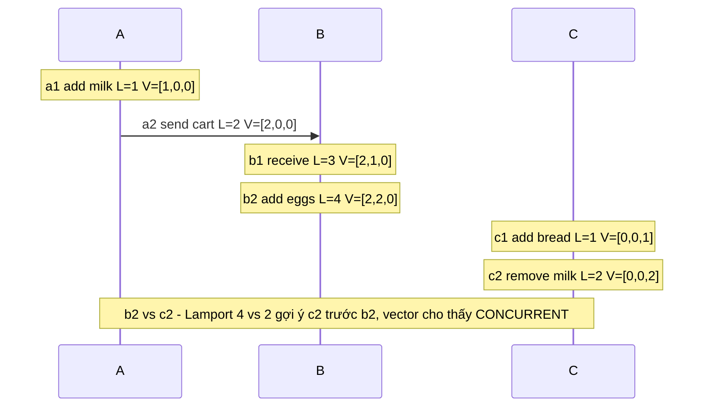
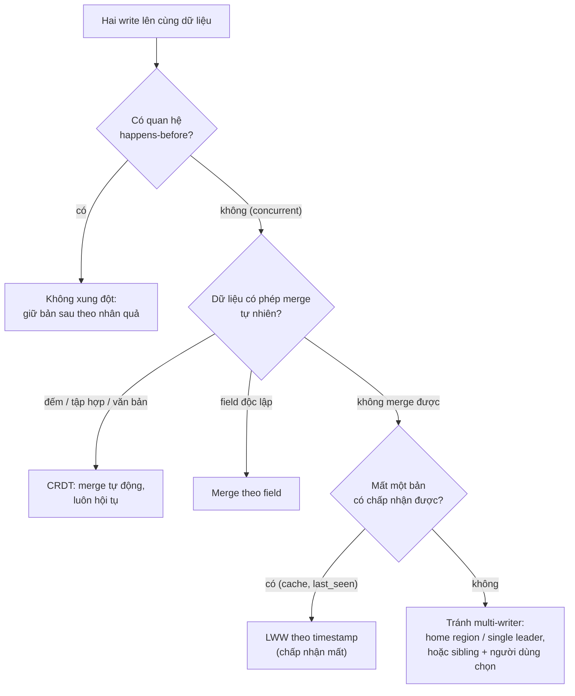

## Bối cảnh & vấn đề

Một công cụ quản lý tài liệu chạy active-active ở hai region, EU và US. Mỗi region nhận write của người dùng gần nó và replicate sang region kia; khi cùng một tài liệu bị sửa ở cả hai nơi, hệ thống giữ bản có **timestamp lớn hơn** (last-write-wins). Người dùng bắt đầu báo: "Tôi sửa tiêu đề thành 'Q3 plan (final)', bấm lưu, thấy thành công, vài giây sau nó quay về 'Q3 plan'." Log cho thấy edit của họ **có** tới server, **có** được replicate. Nó chỉ thua một edit cũ hơn 200 ms ở region kia, vì đồng hồ của các máy ở EU chạy nhanh hơn 300 ms.

Sự cố này gói gọn ba điều. Một: đồng hồ của các máy **không bao giờ khớp** nhau, và lệch hàng trăm mili giây không phải hiếm. Hai: timestamp vật lý **không nói được** sự kiện nào "xảy ra trước" sự kiện nào khi chúng ở hai máy khác nhau. Ba: chiến lược giải quyết xung đột phổ biến nhất (LWW) **âm thầm** bỏ dữ liệu, không lỗi, không log.

Bài này đi từ đồng hồ vật lý (wall clock, monotonic clock, NTP) tới đồng hồ logic (Lamport, vector clock), qua các giải pháp lai (HLC, TrueTime), rồi tới cách xử lý xung đột: LWW, version vector, và CRDT, kèm giới hạn của từng cách.

## Khái niệm

### Wall clock và monotonic clock

Mỗi máy có hai loại đồng hồ với mục đích khác nhau. **Wall clock** (time-of-day, `CLOCK_REALTIME` trên Linux, `Date.now()` trong JS) trả về thời gian lịch, số mili giây kể từ epoch 1970. Nó có thể bị **chỉnh**: NTP **step** (nhảy cóc) khi lệch nhiều, admin đổi giờ, leap second, VM được resume sau khi bị pause rồi đồng bộ lại. Nghĩa là wall clock có thể **nhảy lùi**. Hai lần gọi `Date.now()` liên tiếp có thể cho giá trị sau nhỏ hơn giá trị trước.

**Monotonic clock** (`CLOCK_MONOTONIC`, `performance.now()`, `process.hrtime.bigint()` trong Node) đếm thời gian từ một điểm tuỳ ý (thường là lúc boot hoặc lúc process khởi động), **không bao giờ đi lùi**, và NTP chỉ có thể làm nó chạy nhanh/chậm một chút (**slew**), không nhảy. Giá trị tuyệt đối vô nghĩa, và không so sánh được giữa hai máy; nó chỉ dùng để **đo khoảng thời gian** trên cùng một máy.

Quy tắc: đo duration, timeout, deadline cục bộ, rate limit window → monotonic. Ghi "sự kiện xảy ra lúc mấy giờ" cho người đọc → wall clock. Sắp thứ tự sự kiện giữa các máy → **không dùng cái nào** một mình.

**Interview angle:** câu "đo latency bằng `Date.now()` có vấn đề gì?" — có thể ra số âm hoặc số khổng lồ khi NTP step; dùng `performance.now()`.

### Clock skew và NTP

Thạch anh trong máy chủ trôi (**drift**) cỡ vài chục ppm: 30 ppm ≈ 2,6 giây mỗi ngày nếu không đồng bộ. **NTP** sửa bằng cách hỏi server thời gian và ước lượng độ trễ mạng; độ chính xác thường cỡ vài mili giây trong datacenter tốt và hàng chục tới hàng trăm mili giây qua Internet hoặc khi mạng không đối xứng. Các nhà cloud cung cấp nguồn thời gian riêng chính xác hơn (Amazon Time Sync Service, chrony với PTP trên một số instance) (verify). **Clock skew** là độ lệch giữa đồng hồ hai máy tại cùng một thời điểm.

Đo thật trên laptop viết bài này bằng `sntp`:

```text
$ sntp time.apple.com
+0.171773 +/- 0.105399 time.apple.com 17.253.60.45
```

Đồng hồ máy đang lệch khoảng +172 ms so với server Apple, với sai số ước lượng ±105 ms. Đó là một máy "bình thường" có bật đồng bộ thời gian tự động. Nếu hai máy như vậy gắn timestamp cho hai sự kiện cách nhau 100 ms, thứ tự theo timestamp là **không đáng tin**.

### Happens-before

Lamport (1978) định nghĩa quan hệ **happens-before** (→) không dựa vào đồng hồ: a → b nếu (1) a và b cùng một process và a xảy ra trước b, hoặc (2) a là việc gửi một message và b là việc nhận chính message đó, hoặc (3) có c sao cho a → c và c → b (bắc cầu). Nếu không có a → b cũng không có b → a, hai sự kiện là **concurrent** (đồng thời): không cái nào có thể đã ảnh hưởng tới cái kia.

"Đồng thời" ở đây không có nghĩa "cùng một thời điểm vật lý": hai edit cách nhau 5 phút vẫn concurrent nếu người sửa sau không hề thấy bản của người trước. Đây chính là định nghĩa đúng của **xung đột**: hai write concurrent lên cùng dữ liệu.

### Lamport clock

**Lamport clock**: mỗi node giữ một counter. Mỗi sự kiện local thì tăng counter; khi gửi message, gắn counter vào; khi nhận, đặt `counter = max(local, received) + 1`. Đảm bảo: nếu a → b thì L(a) < L(b). Sắp theo (L, node id) cho ta một **thứ tự toàn phần** nhất quán với nhân quả, đủ để làm những việc như mutual exclusion theo thứ tự trong paper gốc.

Giới hạn quan trọng: chiều ngược lại **không đúng**. L(a) < L(b) không có nghĩa a → b; hai sự kiện concurrent vẫn có Lamport timestamp khác nhau, và nhìn timestamp không thể biết chúng concurrent. Nên Lamport clock **không phát hiện được xung đột**.

### Vector clock và version vector

**Vector clock**: mỗi node giữ một vector, mỗi phần tử là counter của một node. Sự kiện local tăng phần tử của chính mình; nhận message thì lấy max từng phần tử rồi tăng phần tử của mình. So sánh hai vector: V(a) ≤ V(b) ở **mọi** phần tử (và khác nhau ở ít nhất một) ⇔ a → b. Nếu không vector nào ≤ vector kia, a và b **concurrent**. Vector clock vì vậy phát hiện được xung đột, điều Lamport không làm được.

Trong database, ý tưởng này thường xuất hiện dưới dạng **version vector** gắn theo từng **bản ghi** (một counter cho mỗi replica đã sửa nó): Dynamo gốc và Riak dùng để phát hiện các bản "sibling" và trả cả hai cho ứng dụng merge (ví dụ giỏ hàng: hợp các món). Nhược điểm: kích thước tăng theo số node (hoặc số client nếu đếm theo client), cần cắt tỉa; Riak dùng dotted version vectors để giảm vấn đề này.

**Interview angle:** follow-up "dùng vector clock phát hiện xung đột giỏ hàng thế nào?" — mỗi bản giỏ mang version vector; khi đọc thấy hai bản không so sánh được thì đó là xung đột, merge bằng hợp các món (và chấp nhận món đã xoá có thể quay lại, như Dynamo paper mô tả).

### Hybrid Logical Clock và TrueTime

**Hybrid Logical Clock** (HLC, Kulkarni 2014) ghép một thành phần wall time và một counter logic: `(w, c)`. Mỗi sự kiện lấy `w = max(w cũ, giờ vật lý, w trong message nhận được)`, và `c` tăng khi `w` không đổi. Kết quả: timestamp **luôn tôn trọng nhân quả** như Lamport, **không bao giờ đi lùi**, và luôn **gần** giờ vật lý (cách tối đa bằng clock skew). CockroachDB và YugabyteDB dùng HLC cho MVCC timestamp.

**TrueTime** (Google Spanner) đi theo hướng khác: GPS và đồng hồ nguyên tử trong mỗi datacenter cho một API trả về **khoảng** `[earliest, latest]` mà thời gian thật chắc chắn nằm trong đó, với độ rộng ε cỡ vài mili giây. Khi commit, Spanner chọn timestamp rồi **chờ** (commit wait) cho tới khi `earliest` vượt timestamp đó, đảm bảo mọi transaction bắt đầu sau đều có timestamp lớn hơn. Đó là cách Spanner đạt external consistency: **trả bằng latency** (commit wait ~ ε), không phải bỏ qua vật lý.

Khi chỉ cần thứ tự trong phạm vi nhỏ, cách đơn giản nhất là một **nguồn số thứ tự duy nhất**: sequence của database, offset trong một partition Kafka, revision của etcd. Tất cả write đi qua một chỗ thì thứ tự là thứ tự của chỗ đó.

### Last-write-wins

**LWW**: mỗi write mang một timestamp; khi hai bản xung đột, giữ bản có timestamp lớn hơn, bỏ bản kia. Cassandra dùng LWW theo từng cell (timestamp do client hoặc coordinator gán), nhiều hệ multi-region active-active cũng vậy. LWW hấp dẫn vì đơn giản và luôn hội tụ.

Nhưng LWW có hai cách làm mất dữ liệu. Thứ nhất, với hai write **concurrent**, một cái bị bỏ theo định nghĩa: không có "write sau" thật sự, chỉ có "timestamp lớn hơn". Thứ hai, **clock skew** làm bản cũ hơn theo thời gian thật thắng nếu máy ghi nó có đồng hồ nhanh, đúng sự cố ở đầu bài. Và trong cả hai trường hợp, không có lỗi nào được báo: write bị mất sau khi client đã nhận "thành công".

LWW chấp nhận được khi mất write không quan trọng (cache, "last seen at", dữ liệu ghi một lần không bao giờ sửa với key duy nhất như UUID). Với dữ liệu người dùng sửa, các lựa chọn tốt hơn: **single home region** cho mỗi entity (mọi write của tài liệu X đi về region chủ của X, hết xung đột), phát hiện xung đột bằng version vector và để người dùng hoặc logic merge giải quyết, **merge theo field** (người sửa tiêu đề và người sửa mô tả không đè nhau), hoặc CRDT.

### CRDT

**CRDT** (Conflict-free Replicated Data Type, Shapiro 2011) là cấu trúc dữ liệu được thiết kế sao cho mọi replica có thể **cập nhật độc lập**, không cần coordination, kể cả khi partition, và khi trao đổi trạng thái thì luôn hội tụ về **cùng một kết quả**. Với CRDT dạng state-based, điều kiện là hàm `merge` phải **giao hoán** (thứ tự merge không quan trọng), **kết hợp** (gộp nhóm không quan trọng) và **idempotent** (merge trùng không sao).

Các CRDT phổ biến:

- **G-Counter**: mỗi replica một counter chỉ tăng; giá trị = tổng; merge = max từng phần tử. Đếm lượt xem, like.
- **PN-Counter**: hai G-Counter (cộng và trừ); giá trị = P − N. Like/unlike.
- **OR-Set** (observed-remove set): mỗi phần tử thêm vào mang một tag duy nhất; remove chỉ xoá các tag **đã thấy**. Thêm đồng thời với xoá thì thêm thắng. Giỏ hàng, danh sách tag.
- **LWW-Register**: một giá trị với timestamp, merge giữ timestamp lớn hơn (có vấn đề LWW như trên, nhưng ít nhất là hội tụ).
- **Sequence CRDT** (RGA, YATA): văn bản cộng tác; Yjs và Automerge dùng cho Google-Docs-style editing và ứng dụng local-first.

Giới hạn cốt lõi: CRDT chỉ đảm bảo **hội tụ**, không đảm bảo **invariant toàn cục**. "Tồn kho không âm", "số dư ≥ 0", "username duy nhất" đòi hỏi biết trạng thái của **mọi** replica tại thời điểm quyết định, tức là coordination. Hai replica cùng thấy tồn kho 1 và cùng bán là hợp lệ với từng replica, và sau merge tồn kho là −1.

**Interview angle:** "khi nào chọn CRDT?" — khi cần AP, offline hoặc multi-region write, và dữ liệu có phép merge tự nhiên (đếm, tập hợp, văn bản). Không chọn khi có invariant toàn cục.

## Cơ chế hoạt động

Trace dưới có ba node. A sửa giỏ rồi gửi cho B; B nhận và sửa tiếp; C sửa độc lập, không thấy gì từ A hay B. Mỗi sự kiện kèm Lamport clock (L) và vector clock (V):



Lamport chỉ có một con số, nên b2 (L = 4) và c2 (L = 2) trông như "c2 trước". Vector của b2 là [2,2,0], của c2 là [0,0,2]: b2 lớn hơn ở phần A và B, nhỏ hơn ở phần C, nên không cái nào ≤ cái nào: **concurrent**, và "C xoá milk" với "B có milk" là một xung đột thật cần merge.

Quyết định xử lý xung đột theo loại dữ liệu:



## Ví dụ thực tế

### Lamport và vector clock trên cùng một trace

```ts
class Node {
  l = 0; v: Record<string, number>;
  local() { this.l++; this.v[this.id]++; }
  recv(msg: { l: number; v: Record<string, number> }) {
    this.l = Math.max(this.l, msg.l) + 1;
    for (const k in this.v) this.v[k] = Math.max(this.v[k], msg.v[k]);
    this.v[this.id]++;
  }
}
const cmp = (x, y) => {
  const le = ids.every((k) => x.v[k] <= y.v[k]), ge = ids.every((k) => x.v[k] >= y.v[k]);
  return le && !ge ? "happened-before" : ge && !le ? "happened-after" : "CONCURRENT";
};
```

```text
a1: A edits cart (add milk)            L=1  V={"A":1,"B":0,"C":0}
a2: A sends cart to B                  L=2  V={"A":2,"B":0,"C":0}
b1: B receives A's cart                L=3  V={"A":2,"B":1,"C":0}
b2: B adds eggs                        L=4  V={"A":2,"B":2,"C":0}
c1: C adds bread (never saw A or B)    L=1  V={"A":0,"B":0,"C":1}
c2: C removes milk                     L=2  V={"A":0,"B":0,"C":2}
a1 vs b2: Lamport 1 vs 4 -> "a1 before b2"?   vector -> a1 happened-before b2
b2 vs c2: Lamport 4 vs 2 -> "c2 before b2"?   vector -> b2 CONCURRENT c2
c1 vs b1: Lamport 1 vs 3 -> "c1 before b1"?   vector -> c1 CONCURRENT b1
```

Với a1 và b2, Lamport đúng (có quan hệ nhân quả thật). Với hai cặp sau, Lamport "gợi ý" một thứ tự không có thật; chỉ vector clock nói đúng rằng đó là các sự kiện concurrent.

### LWW với clock skew 300 ms

```ts
const skew = { US: 0, EU: 300 };                       // EU servers run 300ms fast
const lww = (region, value, realMs) => {
  const ts = realMs + skew[region];
  if (ts > store.ts) store = { value, ts };            // keep the larger timestamp, drop the other
  return ts;
};
```

```text
LWW, region EU clock runs 300ms fast, US clock is correct
real t=1000ms EU writes title='Q3 plan'            stamped ts=1300
real t=1200ms US writes title='Q3 plan (final)'    stamped ts=1200
stored: title='Q3 plan'   <- the later edit (real t=1200) was silently discarded
```

Edit "(final)" đến sau 200 ms theo thời gian thật nhưng mang timestamp nhỏ hơn, nên bị bỏ. Không có exception, không có log lỗi. Đây chính là ticket ở đầu bài, và lệch 300 ms là con số hoàn toàn thực tế (laptop đo ở trên lệch 172 ms).

### HLC giữ nhân quả khi đồng hồ peer chạy nhanh

```ts
recv([mw, mc]) {
  const pt = this.physical(), w = Math.max(this.w, mw, pt);
  this.c = w === this.w && w === mw ? Math.max(this.c, mc) + 1
         : w === this.w ? this.c + 1 : w === mw ? mc + 1 : 0;
  this.w = w; return [w, this.c];
}
```

```text
real=1000 EU sends msg stamped (1300,0)
real=1005 US wall clock says 1005, receives msg -> (1300,1)  (ordered after the send)
real=1010 US local event -> (1300,2)
real=1410 US local event -> (1410,0)  (physical time caught up, logical resets)
```

US nhận message mang `w = 1300` trong khi giờ của nó là 1005: HLC không dùng 1005 (sẽ "trước" lúc gửi) mà dùng `(1300, 1)`, đứng sau lúc gửi. Các sự kiện tiếp theo tăng counter logic cho tới khi giờ vật lý vượt 1300, rồi counter về 0. Timestamp không bao giờ lùi và không bao giờ vi phạm nhân quả. HLC **không** sửa được vấn đề LWW với hai write concurrent: nó chỉ sắp đúng các sự kiện có quan hệ nhân quả.

### CRDT: hội tụ, OR-Set và giới hạn invariant

```ts
const gMerge = (a, b) => { const r = { ...a }; for (const k in b) r[k] = Math.max(r[k] ?? 0, b[k]); return r; };
const pnMerge = (a, b) => ({ p: gMerge(a.p, b.p), n: gMerge(a.n, b.n) });
// OR-Set: remove deletes only the tags it has observed
const orRemove = (s, item) => { for (const [i, t] of s.adds) if (i === item) s.removes.push(t); };
```

```text
likes: order1=9 order2=9 merged-twice=9  (same result regardless of order/duplicates)
cart after merge: ["eggs","milk"]  (phone's remove only deletes tags it observed)
partition: EU sees stock=1 -> sold; US sees stock=1 -> sold
after merge: stock=-1  (each replica checked locally; the invariant is global)
```

Dòng một: PN-Counter cho cùng kết quả dù merge theo thứ tự nào hay merge trùng. Dòng hai: điện thoại xoá "milk" (tag a1) trong khi laptop thêm "milk" mới (tag b1); sau merge, milk vẫn còn vì remove chỉ xoá tag nó đã thấy (add-wins). Dòng ba và bốn: hai replica cùng kiểm tra `stock >= 1` cục bộ và cùng bán; sau merge tồn kho âm. CRDT hội tụ hoàn hảo về một kết quả sai theo nghiệp vụ.

### Đo duration: wall clock vs monotonic (minh hoạ)

```ts
// minh hoạ: if NTP steps the clock back 2s between the two calls
const t0 = Date.now();             // 1_700_000_005_000
await doWork();                    // ~150ms of real time
const ms = Date.now() - t0;        // 1_700_000_003_150 - ... = -1850  -> negative "latency"
// correct: monotonic
const s = performance.now();
await doWork();
const dur = performance.now() - s; // ~150, never negative
```

Giá trị âm như trên làm metric latency, timeout, rate limiter và lease tính sai. Trên server, NTP thường slew thay vì step khi lệch nhỏ, nhưng VM resume, cấu hình `chrony makestep`, hoặc lệch lớn sẽ step (verify theo cấu hình của bạn).

## Trade-offs & lựa chọn thay thế

| Công cụ | Nói được gì | Không nói được | Chi phí | Dùng khi |
| --- | --- | --- | --- | --- |
| Wall clock | Giờ cho người đọc | Thứ tự giữa máy; duration an toàn | Không | Log, hiển thị, TTL thô |
| Monotonic clock | Duration trên một máy | Bất cứ gì giữa hai máy | Không | Timeout, latency, lease cục bộ |
| Nguồn sequence duy nhất | Thứ tự toàn phần chính xác | (không có vấn đề) | Mọi write qua một chỗ | Một DB, một partition Kafka |
| Lamport clock | Thứ tự nhất quán với nhân quả | Concurrent hay không | Một số | Thứ tự toàn phần rẻ |
| Vector clock / version vector | Trước, sau, hay concurrent | Thời gian vật lý | O(số node) mỗi bản | Phát hiện xung đột |
| HLC | Nhân quả + gần giờ thật | Concurrent hay không | Nhỏ | MVCC timestamp phân tán |
| TrueTime | Thứ tự theo thời gian thật | (cần phần cứng) | GPS/atomic + commit wait | Spanner |
| LWW | Luôn hội tụ, đơn giản | Mất write concurrent, nhạy skew | Thấp | Dữ liệu chấp nhận mất |
| CRDT | Hội tụ không coordination | Invariant toàn cục | Metadata, thiết kế kiểu dữ liệu | Counter, set, văn bản cộng tác |

Chọn thế nào: nếu có thể cho mọi write của một entity đi qua **một chỗ** (single leader, home region, một partition), hãy làm vậy: thứ tự trở nên tầm thường và không có xung đột. Nếu buộc phải multi-writer, phân loại dữ liệu: cái nào merge tự nhiên thì CRDT; cái nào là các field độc lập thì merge theo field; cái nào không merge được và không được mất thì phát hiện xung đột (version vector) và đưa cho người hoặc logic nghiệp vụ, không LWW.

## Edge cases & failure modes

- **Leap second**: ngày có giây 23:59:60; một số hệ step, một số "smear" (Google, AWS kéo dài giây trong nhiều giờ). Năm 2012 nhiều server Linux treo CPU 100% vì bug xử lý leap second.
- **VM pause/resume**: VM bị pause 30 giây; khi chạy lại, wall clock nhảy tới 30 giây trong một lần; lease, TTL, token "hết hạn" hàng loạt.
- **Clock chạy nhanh trên một node Cassandra**: mọi write từ node đó "thắng" trong 10 phút tới; sửa đồng hồ không sửa được dữ liệu đã thắng, và delete với timestamp nhỏ hơn không xoá được nó.
- **Timestamp do client gán**: thiết bị người dùng có thể lệch hàng giờ; không bao giờ dùng giờ client cho LWW.
- **Vector clock phình to**: đếm theo client thay vì theo replica làm vector có hàng nghìn phần tử; cắt tỉa sai thì mất khả năng phát hiện xung đột.
- **OR-Set làm "hồi sinh" món đã xoá**: add-wins nghĩa là thêm đồng thời với xoá thì món đó còn; với một số nghiệp vụ (xoá vì hết hàng) đó là hành vi sai.
- **Deadline epoch qua nhiều máy**: header `x-deadline` dạng epoch ms phụ thuộc đồng bộ đồng hồ giữa caller và callee; lệch 200 ms thì deadline lệch 200 ms. Truyền **thời gian còn lại** và trừ bằng monotonic clock ở mỗi hop ([bài Timeout](/tracks/distributed-systems/learn/timeouts-retries)).

## Pitfalls

- ❌ Đo duration bằng `Date.now()` → ✅ `performance.now()` / `process.hrtime.bigint()`.
- ❌ Sắp xếp sự kiện từ nhiều server theo timestamp và coi đó là thứ tự thật → ✅ dùng sequence từ một nguồn, hoặc logical/vector clock nếu cần nhân quả.
- ❌ LWW cho dữ liệu người dùng sửa ở nhiều nơi → ✅ home region, merge theo field, CRDT, hoặc phát hiện xung đột.
- ❌ Nghĩ Lamport clock phát hiện được xung đột → ✅ chỉ vector clock/version vector phân biệt được concurrent.
- ❌ Dùng CRDT để giữ "tồn kho không âm" → ✅ invariant toàn cục cần coordination ở một điểm (UPDATE có điều kiện, consensus).
- ❌ Tin NTP giữ mọi máy lệch dưới 1 ms → ✅ đo; lệch hàng chục tới hàng trăm ms là bình thường, và có thể tệ hơn nhiều khi lỗi.
- ❌ Dùng timestamp của thiết bị client → ✅ server gán timestamp, hoặc HLC.

## Tóm tắt

- Wall clock có thể nhảy lùi; monotonic clock chỉ đo duration trên một máy; không cái nào sắp được thứ tự giữa các máy.
- Clock skew hàng trăm ms là thực tế (đo: laptop lệch +172 ms ± 105 ms so với NTP server).
- Happens-before định nghĩa nhân quả; hai write concurrent lên cùng dữ liệu là một xung đột.
- Lamport: a → b ⇒ L(a) < L(b), không suy ngược; vector clock phân biệt trước, sau và concurrent (đo trên cùng trace).
- HLC giữ nhân quả và bám giờ thật (CockroachDB); TrueTime trả bằng commit wait để có thứ tự theo thời gian thật (Spanner).
- LWW âm thầm bỏ write concurrent và để đồng hồ nhanh thắng (đo: edit sau 200 ms bị bỏ vì skew 300 ms).
- CRDT hội tụ không cần coordination (counter, OR-Set, văn bản) nhưng không giữ được invariant toàn cục (đo: tồn kho −1).
- Cách đơn giản nhất để khỏi xử lý xung đột: cho mọi write của một entity đi qua một chỗ.
