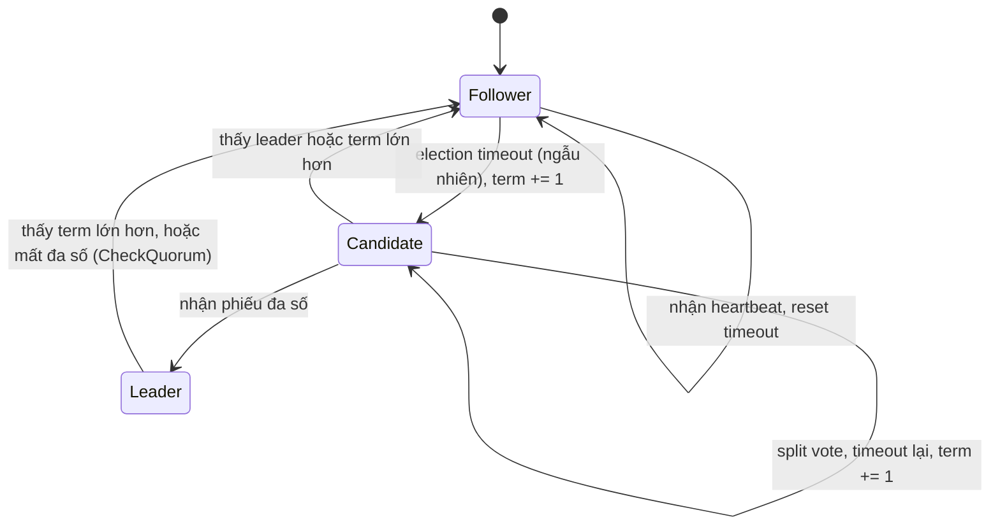
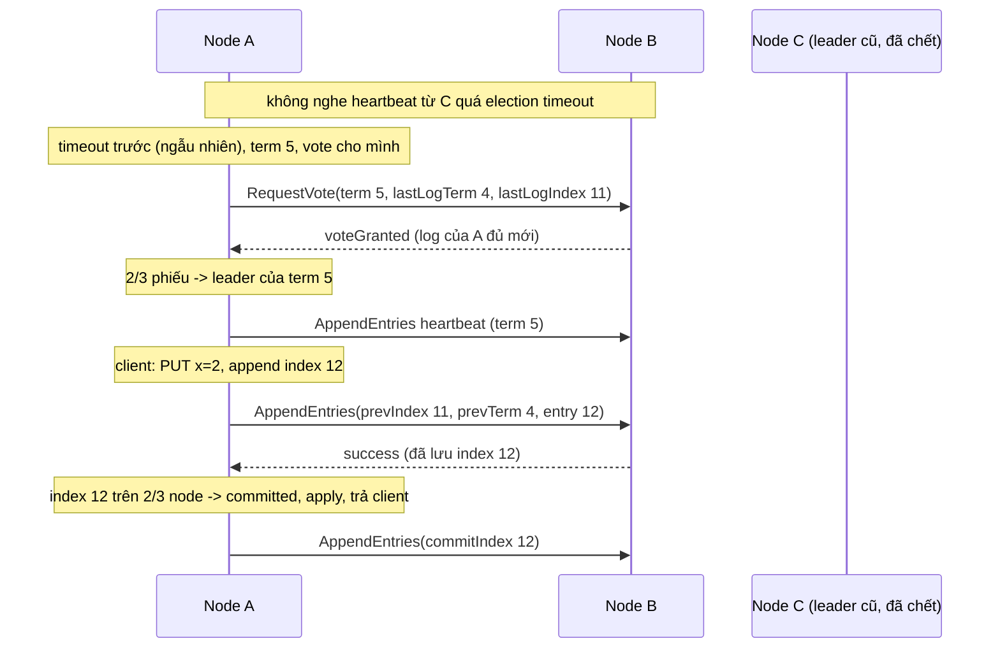

## Bối cảnh & vấn đề

Một team tự viết cơ chế failover cho database: hai node, node nào không nghe heartbeat của node kia trong 3 giây thì tự promote thành primary. Chạy ổn nhiều tháng. Rồi một lần switch giữa hai node bị nghẽn 5 giây: mỗi node đều không nghe được node kia, **cả hai** tự promote, cả hai nhận write từ các app server khác nhau. Khi mạng hồi phục, có hai lịch sử dữ liệu khác nhau, không cái nào "đúng", và team mất hai ngày để đối soát bằng tay.

Đây là **split brain**, và nó xảy ra vì câu hỏi "ai là leader?" được trả lời **cục bộ** bởi từng node dựa trên một failure detector có thể sai ([bài Mô hình lỗi](/tracks/distributed-systems/learn/failure-model)). Câu hỏi đúng là: làm sao để một nhóm node **đồng ý** về một quyết định (ai là leader, entry tiếp theo trong log là gì) sao cho không bao giờ có hai quyết định mâu thuẫn, ngay cả khi mạng chia cắt và node chết? Đó là bài toán **consensus**.

Consensus là nền móng của etcd (Kubernetes lưu toàn bộ trạng thái cluster ở đây), Consul, ZooKeeper, Kafka KRaft controller, CockroachDB, và mọi leader election làm đúng. Bài này giải thích Raft đủ sâu để trả lời các câu hỏi phỏng vấn về election, commit và split brain, rồi chạy một cluster etcd thật để xem nó cư xử khi leader bị cô lập.

## Khái niệm

### Consensus

**Consensus**: một nhóm process, mỗi process có thể đề xuất một giá trị, phải **quyết định** một giá trị duy nhất sao cho: (1) **agreement**: không có hai process quyết định khác nhau; (2) **validity**: giá trị được quyết định là một trong các giá trị được đề xuất; (3) **termination**: mọi process không lỗi cuối cùng đều quyết định. Hai điều đầu là **safety** (không bao giờ có điều xấu), điều cuối là **liveness** (cuối cùng có điều tốt).

Trong thực tế, ta hiếm khi đồng thuận một giá trị đơn lẻ mà đồng thuận một **chuỗi** giá trị: một log các lệnh. Nếu mọi node áp dụng cùng một log theo cùng thứ tự vào cùng một state machine (ví dụ một key-value store), mọi node có cùng trạng thái. Mô hình này gọi là **replicated state machine**, và đó chính là thứ Raft cung cấp.

### FLP impossibility

**FLP** (Fischer, Lynch, Paterson 1985): trong mô hình **hoàn toàn asynchronous** (không có giới hạn thời gian cho message hay xử lý), không có thuật toán consensus **deterministic** nào đảm bảo luôn **kết thúc**, nếu dù chỉ **một** process có thể crash. Trực giác: vì không phân biệt được process chết với process chậm, luôn tồn tại một lịch trình message "xấu" giữ thuật toán ở trạng thái chưa quyết định mãi mãi.

FLP không nói consensus là không thể trong thực tế. Nó nói phải hy sinh một trong ba: deterministic, asynchronous thuần, hoặc đảm bảo kết thúc. Raft và Paxos chọn: **safety luôn đúng** trong mọi lịch trình (không bao giờ hai leader cùng term, không bao giờ hai giá trị khác nhau được commit ở cùng vị trí log), còn **liveness chỉ đúng** khi hệ thống đủ "đồng bộ" một thời gian (partial synchrony), và dùng **timeout ngẫu nhiên** để thoát các vòng lặp xấu. Trong giai đoạn mạng tệ, cluster Raft có thể không bầu được leader (không có tiến triển), nhưng không bao giờ cho ra kết quả sai.

**Interview angle:** follow-up "Raft hy sinh safety hay liveness khi mạng tệ?" — liveness; safety không bao giờ bị hy sinh.

### Quorum và đa số

Raft (và Paxos, ZAB) dựa trên **quorum đa số**: một quyết định chỉ có hiệu lực khi được hơn một nửa số node (⌊N/2⌋ + 1) chấp nhận. Hai tập đa số bất kỳ luôn **giao nhau** ít nhất một node, nên không thể có hai quyết định mâu thuẫn được hai đa số khác nhau chấp nhận: node chung sẽ từ chối cái thứ hai.

Cluster N node chịu được f node lỗi khi N ≥ 2f + 1: 3 node chịu 1, 5 node chịu 2, 7 node chịu 3. Thêm node thứ 4 vào cluster 3 node **không** tăng khả năng chịu lỗi (đa số của 4 là 3, vẫn chỉ chịu 1 lỗi) nhưng làm mỗi write phải chờ thêm một ack và tăng xác suất có node chậm. Đó là lý do cluster consensus gần như luôn có số node **lẻ**.

### Split brain

**Split brain**: hai (hoặc nhiều) node cùng tin mình là leader và cùng nhận write. Nguyên nhân gốc: quyết định leadership dựa vào quan sát cục bộ. Quorum chống split brain vì chỉ phía có **đa số** mới bầu được leader và commit được write; phía thiểu số không thể làm gì, kể cả nếu nó có một node từng là leader. Leader cũ ở phía thiểu số có thể **tin** mình còn là leader một lúc, nhưng nó không commit được gì vì không gom được đa số ack.

Với hai data center, quorum có một cái bẫy: 3 node chia 2 + 1. Nếu DC có 2 node chết (hoặc bị cô lập), DC còn lại chỉ có 1 node, không đủ đa số, cả cluster ngừng nhận write. Nếu DC có 1 node chết thì không sao. Tức là cluster **không** chịu được mất DC lớn hơn. Giải pháp chuẩn là một **node thứ ba ở vị trí thứ ba** (DC/AZ/region khác) làm tie-breaker: 1 + 1 + 1, hoặc 2 + 2 + 1.

**Interview angle:** câu "3 node trên 2 DC (2+1), DC nào chết làm sập cluster?" — DC có 2 node; đáp án đúng kèm đề xuất vị trí thứ ba.

### Leader election: dùng để làm gì

**Leader election** chọn đúng **một** node làm một việc mà chỉ nên có một người làm: nhận write cho một partition (Kafka partition leader, DB primary), điều phối cluster (Kafka controller, Kubernetes controller-manager và scheduler chạy active-passive), chạy cron/scheduler, gán công việc cho worker. Làm sai (hoặc không làm) dẫn tới split brain: ghi trùng, xung đột, email gửi hai lần, batch xử lý hai lần.

Cách làm đúng trong thực tế: dùng một hệ consensus có sẵn (etcd, ZooKeeper, Consul) hoặc primitive được xây trên nó (**Kubernetes Lease** object, vốn lưu trong etcd), hoặc lease trong một database có giao dịch. Viết thuật toán bầu cử riêng gần như luôn sai. Và ngay cả với leader election đúng, một leader bị GC pause vẫn có thể tỉnh dậy sau khi đã mất quyền; [bài Lease & fencing](/tracks/distributed-systems/learn/leases-locks-fencing) xử lý phần đó.

### Raft: vai trò và term

Mỗi node Raft ở một trong ba trạng thái: **follower** (thụ động, trả lời leader và candidate), **candidate** (đang xin phiếu), **leader** (nhận lệnh từ client, replicate log). Thời gian chia thành các **term** đánh số tăng dần; mỗi term bắt đầu bằng một cuộc bầu cử và có tối đa một leader. Term hoạt động như một **logical clock**: mọi message mang term của người gửi; node thấy term lớn hơn của mình thì cập nhật term và **lập tức về follower**; message mang term cũ bị từ chối. Đây là cơ chế làm leader cũ "tự giáng chức" khi quay lại.

### Raft: bầu leader

Leader gửi **heartbeat** (AppendEntries rỗng) định kỳ. Follower không nhận được gì trong **election timeout** (chọn **ngẫu nhiên**, paper gợi ý 150–300 ms; etcd mặc định heartbeat 100 ms, election timeout 1000 ms) thì tăng term, chuyển thành candidate, vote cho chính mình và gửi **RequestVote** cho mọi node. Mỗi node vote **tối đa một lần mỗi term** (ghi xuống disk trước khi trả lời), cho candidate đầu tiên hỏi, với điều kiện log của candidate **ít nhất mới bằng** log của mình (**election restriction**: so term của entry cuối, rồi tới độ dài log). Candidate nhận được đa số phiếu thì thành leader và gửi heartbeat ngay để chặn các cuộc bầu khác.

Timeout ngẫu nhiên giải quyết **split vote**: nếu mọi follower hết timeout cùng lúc, mỗi người tự vote cho mình và không ai đạt đa số; với timeout ngẫu nhiên, thường một node hết hạn trước, xin phiếu và thắng trước khi các node khác kịp thành candidate. Election restriction đảm bảo leader mới luôn có **mọi entry đã commit**, vì entry đã commit nằm trên một đa số, và candidate phải được một đa số (giao với đa số kia) chấp nhận là "đủ mới".

Hai cải tiến mà etcd dùng: **PreVote** (trước khi tăng term thật, hỏi thử xem có thắng được không; node bị cô lập không làm term của cluster tăng vô ích khi quay lại) và **CheckQuorum** (leader tự về follower nếu không nghe được đa số trong một election timeout).

### Raft: replicate log và commit

Client gửi lệnh tới leader. Leader **append** lệnh vào log của mình (kèm term hiện tại), gửi **AppendEntries** cho follower. Mỗi AppendEntries mang chỉ số và term của entry ngay trước các entry mới; follower chỉ chấp nhận nếu log của nó có entry đó (**consistency check**), nếu không thì từ chối và leader lùi lại, gửi các entry sớm hơn cho tới khi khớp. Kết quả: log của follower luôn là **tiền tố** của log leader sau khi đồng bộ, và các entry thừa không khớp ở follower bị ghi đè.

Một entry được coi là **committed** khi leader biết nó đã được lưu trên **đa số** node (tính cả leader). Lúc đó leader áp dụng nó vào state machine, trả kết quả cho client, và báo commit index cho follower ở AppendEntries tiếp theo. Một chi tiết tinh tế: leader chỉ commit bằng cách đếm replica cho entry của **term hiện tại**; entry của term cũ được commit gián tiếp khi một entry term hiện tại phía sau nó được commit (hình 8 trong paper giải thích vì sao đếm replica cho entry term cũ có thể sai).

Với leader cũ bị cô lập: các entry nó append nhưng chưa được đa số lưu là **uncommitted**. Client của nó không nhận được thành công (hoặc timeout). Khi nó quay lại, thấy term lớn hơn, về follower, và leader mới **ghi đè** các entry đó bằng log của mình. Chúng biến mất, và điều đó đúng, vì chưa ai được hứa rằng chúng tồn tại.

**Interview angle:** follow-up "entry chưa commit trên leader cũ bị partition thì sao?" — bị ghi đè khi nó quay lại làm follower; client chưa bao giờ nhận ack nên không có dữ liệu "đã hứa" bị mất.

### Đọc từ cluster consensus

Write đi qua log nên linearizable. Read thì cần cẩn thận: một leader cũ bị cô lập vẫn có dữ liệu cũ và có thể vẫn nghĩ mình là leader. etcd mặc định đọc **linearizable** bằng ReadIndex: leader xác nhận với đa số rằng mình vẫn là leader trước khi trả lời (một round-trip heartbeat, không ghi log). Tuỳ chọn **serializable** (`--consistency=s`) đọc local ở bất kỳ node nào: nhanh, không cần quorum, có thể cũ. ZooKeeper mặc định đọc từ follower đang kết nối (có thể cũ), cần `sync()` trước để có giá trị mới nhất.

## Cơ chế hoạt động

Các trạng thái và chuyển tiếp của một node Raft:



Một lần bầu cử và một lần commit trong cluster 3 node:



Diễn giải: A thắng vì hết timeout trước và log của nó không cũ hơn của B. Với 3 node, A chỉ cần **một** phiếu ngoài phiếu của chính mình; C chết không ảnh hưởng. Write `x=2` được commit ngay khi B lưu xong, không cần chờ C. Nếu C quay lại, nó nhận AppendEntries term 5, về follower, và được bù các entry thiếu.

## Ví dụ thực tế

### etcd 3.6.5: cô lập leader

Ba container etcd 3.6.5 trong một Docker network, `--heartbeat-interval 100 --election-timeout 1000`. Script tìm leader, cắt nó khỏi network bằng `docker network disconnect`, rồi thử ghi ở cả hai phía.

```bash
docker network disconnect ds18-etcd ds18-e$LEADER
# majority side: retry until a write succeeds
until docker exec ds18-e$A etcdctl --command-timeout=2s put /cfg/x 2; do sleep 0.05; done
# isolated old leader
docker exec ds18-e$LEADER etcdctl --command-timeout=2s put /cfg/x 3
docker exec ds18-e$LEADER etcdctl --command-timeout=2s get /cfg/x                    # linearizable (default)
docker exec ds18-e$LEADER etcdctl --command-timeout=2s get /cfg/x --consistency=s    # serializable
```

```text
leader is e2; isolating it from the other two (docker network disconnect)
partition at 02:55:48.724
majority side (e1,e3) accepted put x=2 after 2365ms
-- on the isolated old leader e2:
put x=3            -> Error: context deadline exceeded (2099ms)
get (linearizable) -> Error: context deadline exceeded
get --consistency=s (serializable) -> 1   (stale)
== healed: get -> 2
== lose quorum: stop two nodes
1 of 3 alive, put x=4 -> Error: context deadline exceeded (2226ms)
```

Phía đa số tiếp tục nhận write (2,4 giây bao gồm cả thời gian bầu cử và vòng lặp `docker exec`). Leader cũ ở phía thiểu số: write treo tới hết `--command-timeout` (CP: từ chối thay vì trả lời sai), read linearizable cũng thất bại vì không xác nhận được leadership với đa số, nhưng read serializable trả `1`, giá trị **cũ**, vì nó chỉ đọc local. Khi mạng hồi phục, node cũ đọc ra `2`. Khi chỉ còn một trong ba node, không ai ghi được.

Log Raft của hai node cho thấy từng bước (giờ UTC, rút gọn):

```text
# e1 (majority side)
02:55:49.659 500bce22ee57b309 became pre-candidate at term 4
02:55:49.660 raft.node: 500bce22ee57b309 lost leader d3ef5547dcff775f at term 4
02:55:50.189 raft.node: 500bce22ee57b309 elected leader 2cae8241cbcf764f at term 5
# e2 (isolated old leader)
02:55:50.313 d3ef5547dcff775f became follower at term 4
02:55:51.714 d3ef5547dcff775f became pre-candidate at term 4
02:55:53.114 d3ef5547dcff775f became pre-candidate at term 4
02:55:54.514 d3ef5547dcff775f became pre-candidate at term 4
02:55:55.505 d3ef5547dcff775f became follower at term 5
```

Đọc timeline: partition lúc 48,724; follower e1 hết election timeout và mất leader sau ~0,94 s (đúng cấu hình 1000 ms); leader mới (e3) được bầu ở term 5 lúc 50,189, tức ~1,5 s sau partition. Trong khi đó leader cũ e2 tự **về follower** lúc 50,313 (CheckQuorum: không nghe được đa số trong một election timeout), rồi liên tục thử **pre-vote** nhưng **giữ nguyên term 4** (PreVote ngăn node bị cô lập tăng term). Khi nối lại mạng, nó thấy term 5 và đi theo leader mới. Không lúc nào có hai node commit được write.

### Raft, Paxos, ZAB và chỗ dùng

| | Raft | Multi-Paxos | ZAB |
| --- | --- | --- | --- |
| Mục tiêu thiết kế | Dễ hiểu, đặc tả đầy đủ | Tổng quát, tối thiểu giả định | Primary-backup cho ZooKeeper |
| Leader | Bắt buộc, mạnh | Tối ưu hoá (distinguished proposer) | Bắt buộc |
| Log | Không có lỗ, chỉ từ leader | Có thể có lỗ, mỗi slot đồng thuận riêng | Theo epoch + counter (zxid) |
| Dùng ở | etcd, Consul, CockroachDB, TiKV, Kafka KRaft | Spanner, Chubby | ZooKeeper |

Consensus đắt: mỗi write là ít nhất một round-trip tới đa số và một fsync trên đa số. Dùng nó cho **metadata và điều phối** (cấu hình, leader, membership, lock, sequence), không phải cho dữ liệu nghiệp vụ throughput cao, trừ khi database được thiết kế quanh nó (CockroachDB, Spanner shard dữ liệu thành nhiều nhóm Raft/Paxos nhỏ).

## Trade-offs & lựa chọn thay thế

| Cách chọn leader | Đúng khi partition? | Phụ thuộc | Hợp khi |
| --- | --- | --- | --- |
| Heartbeat + tự promote (2 node) | Không: split brain | Không | Không bao giờ cho dữ liệu quan trọng |
| Consensus (etcd/ZooKeeper/Consul) | Có, phía đa số | Cụm 3/5 node | Metadata, leader election, cấu hình |
| Kubernetes Lease | Có (dựa trên etcd), nhưng holder vẫn có thể pause | API server | Controller, singleton trong K8s |
| Lease trong DB (row + `lease_until`) | Có trong phạm vi DB đó | Database đã có | Job/singleton trong app dùng một DB |
| Managed failover (RDS Multi-AZ, Patroni) | Có, dựa trên consensus/quorum bên dưới | Dịch vụ | Database primary |
| 3 node vs 5 node | 3 chịu 1 lỗi, write nhanh hơn | | 3 cho đa số; 5 khi cần chịu lỗi khi đang bảo trì 1 node |

Chọn thế nào: không tự viết consensus. Nếu đã có Kubernetes, Lease object là leader election rẻ nhất; nếu đã có Postgres và việc cần một leader là việc trên chính Postgres đó, lease trong DB (hoặc advisory lock) đơn giản hơn thêm một hệ thống. Dùng etcd/ZooKeeper khi nhiều service cần điều phối chung hoặc cần watch. Với số node: 3 là mặc định; 5 khi bạn muốn vẫn chịu được 1 lỗi trong lúc 1 node đang được nâng cấp; hiếm khi hơn 7.

## Edge cases & failure modes

- **Disk chậm trên leader**: fsync 500 ms làm mọi write chậm và heartbeat trễ; follower bầu lại liên tục (leader flapping). etcd khuyến nghị SSD và theo dõi `wal_fsync_duration_seconds` (verify).
- **Election timeout quá ngắn so với RTT**: cluster trải nhiều region với RTT 150 ms mà timeout 300 ms sẽ bầu cử liên tục; timeout phải lớn hơn nhiều lần RTT.
- **Leader bị GC pause**: CheckQuorum làm nó về follower *khi nó chạy lại*; trong lúc pause, nó không làm gì nên không gây hại cho log, nhưng client giữ "leadership" ngoài Raft (ví dụ lease) có thể đã hết hạn.
- **Mất disk trên đa số node**: Raft giả định state đã fsync là bền; khôi phục node từ snapshot cũ mà giữ nguyên ID có thể vi phạm safety. Thay node phải đi qua membership change.
- **Membership change**: thêm/bớt node phải theo quy trình (joint consensus hoặc thay từng node một); đổi từ 3 sang 5 bằng cách sửa cấu hình mọi node cùng lúc có thể tạo hai đa số rời nhau.
- **Read serializable bị dùng nhầm**: đọc nhanh từ follower trả dữ liệu cũ, như đã đo; dùng cho cache/hiển thị, không cho quyết định.
- **Cluster mất quorum**: không có write, kể cả khi các node còn lại khoẻ; cần runbook khôi phục (force new cluster từ snapshot) và chấp nhận có thể mất entry chưa commit.

## Pitfalls

- ❌ Tự viết failover hai node bằng heartbeat → ✅ dùng consensus có sẵn hoặc dịch vụ managed; hai node không bao giờ có đa số khi chia đôi.
- ❌ Cluster 4 node "để an toàn hơn" → ✅ 4 chịu lỗi như 3 nhưng chậm hơn; dùng 3 hoặc 5.
- ❌ 3 node trên 2 DC → ✅ thêm vị trí thứ ba làm tie-breaker.
- ❌ Nghĩ FLP nghĩa là consensus không dùng được → ✅ Raft giữ safety luôn đúng, liveness dựa trên partial synchrony + timeout ngẫu nhiên.
- ❌ Đọc từ follower và coi là mới nhất → ✅ read linearizable (ReadIndex/`sync`) cho quyết định; serializable chỉ cho dữ liệu chấp nhận cũ.
- ❌ Đưa dữ liệu nghiệp vụ throughput cao vào etcd → ✅ etcd cho metadata (giới hạn kích thước request và DB mặc định nhỏ (verify)); dữ liệu ở database.
- ❌ Tin leader election là đủ để chỉ một node ghi → ✅ leader có thể pause rồi tỉnh dậy sau khi mất quyền; cần fencing ở storage.

## Tóm tắt

- Consensus: các node đồng ý một giá trị (thực tế là một log) với agreement + validity (safety) và termination (liveness).
- FLP: không có consensus deterministic luôn kết thúc trong mô hình asynchronous với một node crash; Raft giữ safety, đổi liveness lấy partial synchrony và timeout ngẫu nhiên.
- Quorum đa số: hai đa số luôn giao nhau; 2f + 1 node chịu f lỗi; số chẵn không tăng khả năng chịu lỗi; 2 DC cần tie-breaker ở vị trí thứ ba.
- Raft: term là logical clock; bầu bằng RequestVote với election restriction; entry committed khi đa số đã lưu; leader cũ thấy term lớn hơn thì về follower và entry chưa commit bị ghi đè.
- etcd thật: leader mới sau ~1,5 s; leader cũ bị cô lập tự về follower (CheckQuorum), giữ term nhờ PreVote, write và read linearizable thất bại, read serializable trả giá trị cũ.
- Leader election dùng cho mọi việc "chỉ một node được làm"; dùng etcd/ZooKeeper/K8s Lease/lease trong DB, không tự viết.
- Consensus đắt: dùng cho metadata và điều phối, không cho dữ liệu throughput cao.
