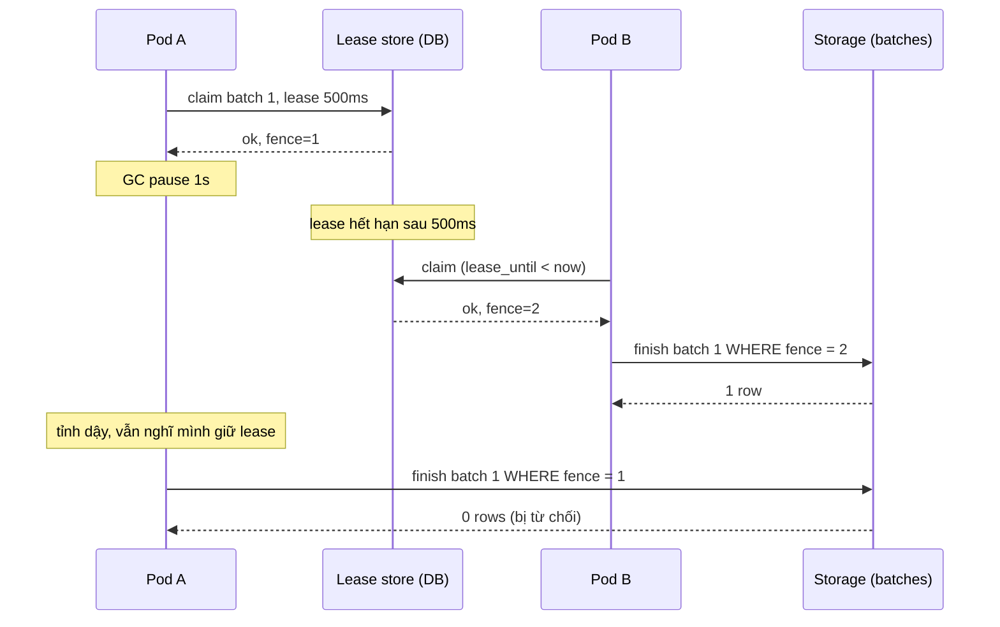
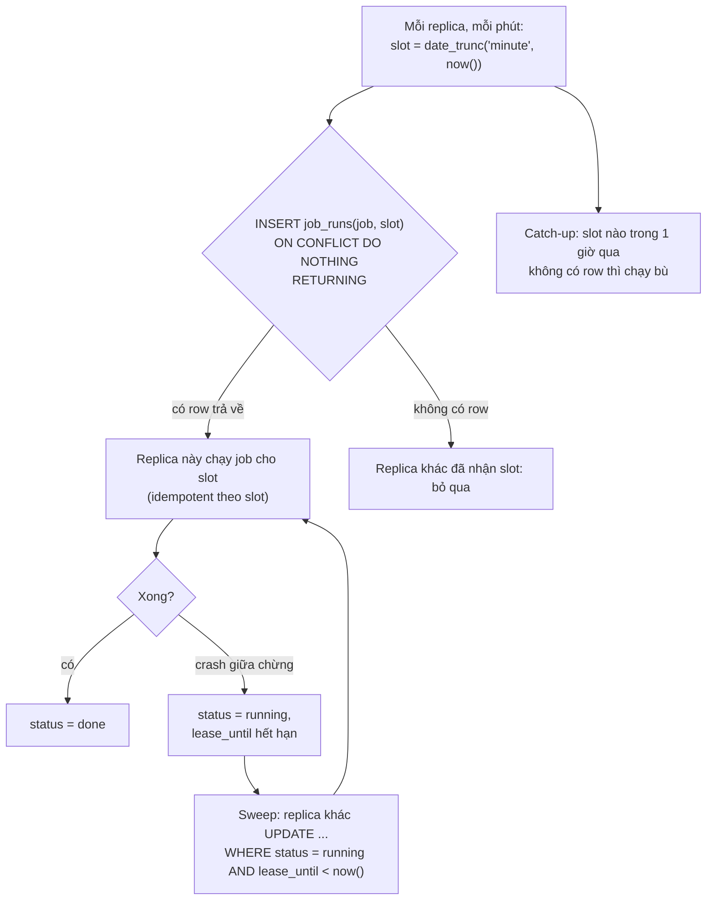

## Bối cảnh & vấn đề

Một service đồng bộ đơn hàng sang hệ thống kế toán chạy 10 replica. Chỉ một replica nên lấy batch tiếp theo, nên team dùng Redis lease: `SET lease:batch <podId> PX 10000 NX`, ai lấy được thì claim batch, xử lý, rồi `DEL`. Hàng tuần có vài batch bị đẩy sang kế toán **hai lần**. Log cho thấy hầu hết batch xong trong 2 giây, nhưng thỉnh thoảng một batch mất 20 giây (GC pause, API kế toán chậm). Không ai thấy lỗi nào: mỗi pod đều "có lease" vào lúc nó bắt đầu.

Một lock trong một process là đảm bảo tuyệt đối: OS biết ai giữ, giữ tới khi nhả, process chết thì lock chết theo. Lock giữa các máy thì không có ai biết chắc ai còn sống ([bài Mô hình lỗi](/tracks/distributed-systems/learn/failure-model)), nên mọi lock phân tán phải **tự hết hạn** để không kẹt mãi khi người giữ chết. Mà đã tự hết hạn thì có thể hết hạn **trong lúc người giữ vẫn đang làm**. Đó là toàn bộ vấn đề.

Bài này xây khái niệm từ lease tới fencing token, đi qua các cách leader election thực tế, tái hiện bug Redis ở trên, sửa nó bằng Postgres, rồi thiết kế bài toán kinh điển "job chạy đúng một lần mỗi phút trên 10 replica". Bài [Distributed lock với Redis](/tracks/caching/learn/distributed-locks) đi sâu phía Redis (`SET NX PX`, Lua release, Redlock); bài này tập trung vào phần độc lập công cụ.

## Khái niệm

### Lease

**Lease** (Gray & Cheriton 1989) là quyền có **thời hạn**: "bạn được làm X cho tới thời điểm T". Người giữ phải gia hạn (renew) trước T nếu muốn giữ tiếp; nếu người giữ chết, lease tự hết hạn và người khác lấy được, không cần ai phát hiện cái chết. Mọi "distributed lock" dựa trên TTL (Redis `PX`, etcd lease, ZooKeeper ephemeral node gắn session timeout, Kubernetes Lease, row có `lease_until`) đều là lease.

Lease đánh đổi **an toàn khi người giữ chết** (không deadlock vĩnh viễn) lấy **rủi ro khi người giữ chậm**: nếu người giữ vẫn sống nhưng không kịp gia hạn, hệ thống sẽ cho người khác lấy lease trong khi người cũ còn đang làm.

### Process pause và vì sao kiểm tra trước khi ghi không đủ

Một process có thể dừng hẳn bất cứ lúc nào: stop-the-world GC, CPU throttling, VM bị pause, swap. Đoạn code sau trông an toàn nhưng không phải:

```ts
if (await stillHoldLease()) {   // true at 10:00:09.900
  // <-- GC pause 2s here: lease expired at 10:00:10.000, pod B took it
  await writeResult();          // runs at 10:00:11.900, B is also writing
}
```

Pause có thể rơi vào **giữa** lần kiểm tra và lần ghi, và process không có cách nào biết mình vừa bị pause. Gia hạn lease (heartbeat/watchdog) giảm xác suất nhưng không loại bỏ: timer gia hạn cũng bị pause. Đồng hồ cũng có thể sai: lease 10 giây theo đồng hồ của Redis không phải 10 giây theo đồng hồ của pod nếu một trong hai bị nhảy giờ.

Kết luận: không có cơ chế nào **ở phía client** đảm bảo client chỉ ghi khi còn giữ lease. Đảm bảo phải nằm ở **phía tài nguyên nhận lệnh ghi**.

### Fencing token

**Fencing token**: mỗi lần cấp lease, dịch vụ lock cấp kèm một số **tăng đơn điệu** (lần sau luôn lớn hơn lần trước). Client gửi token cùng mọi lệnh ghi; **storage** nhớ token lớn nhất đã thấy và **từ chối** mọi lệnh có token nhỏ hơn. Pod A (token 33) tỉnh dậy sau pause và ghi; pod B (token 34) đã ghi trước đó; storage thấy 33 < 34 và từ chối A.

Yêu cầu: (1) nguồn token phải thật sự đơn điệu và gắn với việc cấp lease: etcd revision của key lease, ZooKeeper `zxid` hoặc version của znode, một DB sequence trong cùng transaction cấp lease; (2) storage phải **kiểm tra được**: conditional write (`UPDATE ... WHERE fence < $token`), compare-and-set, cột version. Redis `SET NX` không tự cấp token (có thể dùng `INCR` riêng nhưng lock và token không atomic với nhau nếu không viết Lua), và Redlock không có token.

Giới hạn: fencing chỉ bảo vệ storage **có kiểm tra**. Nếu pod A đã gọi API kế toán bên ngoài (không biết gì về token), lệnh đó đã đi ra rồi. Với side effect bên ngoài, cần idempotency key truyền sang hệ thống đó ([bài Idempotency](/tracks/distributed-systems/learn/idempotency-delivery)).

**Interview angle:** "Redis `SET NX` lock có cho fencing token không?" — không; dùng etcd/ZooKeeper (revision/zxid) hoặc DB sequence, và kiểm tra token ở storage.

### Lock vì efficiency và vì correctness

Kleppmann phân biệt hai loại. **Efficiency lock** tránh làm trùng việc tốn kém (rebuild report, gửi digest email); hỏng thì tốn gấp đôi tài nguyên hoặc gửi trùng một email: khó chịu, chấp nhận được. **Correctness lock** bảo vệ dữ liệu: hỏng thì dữ liệu sai (đẩy batch hai lần sang kế toán, ghi đè lẫn nhau). Redis lock đơn instance là lựa chọn tốt cho efficiency; cho correctness cần fencing hoặc ràng buộc ở chính storage, và thường thì **không cần lock** nếu thao tác có thể làm idempotent hoặc atomic ở DB.

### Leader election trong thực tế

Leader election là một lease đặc biệt: "tôi là leader cho tới T". Các cách phổ biến:

- **Kubernetes Lease** (`coordination.k8s.io/v1`): object có `holderIdentity`, `leaseDurationSeconds`, `renewTime`; client-go `leaderelection` gia hạn định kỳ. controller-manager và scheduler dùng nó. Lưu trong etcd, nên việc cấp lease đúng, nhưng holder vẫn có thể pause; client-go dừng làm việc khi gia hạn thất bại quá `renewDeadline`.
- **etcd election API / ZooKeeper recipe**: lease gắn session; key của leader có revision dùng được làm fencing token.
- **Lease trong database**: một row `leader(name, holder, lease_until)` cập nhật bằng `UPDATE ... WHERE lease_until < now() OR holder = $me`, hoặc `pg_try_advisory_lock` (session-level, tự nhả khi connection đứt). Đơn giản nếu việc của leader nằm trên chính DB đó.
- **Không cần leader**: thay vì một leader làm mọi việc, cho mọi replica **claim từng đơn vị việc** (row, slot, partition) bằng thao tác atomic. Thường là thiết kế tốt nhất.

**Interview angle:** follow-up "leader làm sao biết mình vẫn là leader sau GC pause dài?" — nó không biết chắc; dừng làm việc khi không gia hạn được, và mọi write mang fencing token để storage từ chối nếu nó đã mất quyền.

### Failure detector bên trong lease

Lease chính là một failure detector: "không gia hạn trong T giây = coi như chết". Nó kế thừa mọi giới hạn của heartbeat ([bài Mô hình lỗi](/tracks/distributed-systems/learn/failure-model#sec-failure-detector)): TTL ngắn thì failover nhanh nhưng dễ "giết nhầm" pod đang pause; TTL dài thì khi pod chết thật, việc đứng yên lâu. Fencing là thứ làm cho việc giết nhầm trở nên **vô hại** thay vì làm hỏng dữ liệu.

## Cơ chế hoạt động

Kịch bản pause làm hai pod cùng xử lý, và fencing token chặn lệnh ghi muộn:



Điểm mấu chốt nằm ở hai dòng cuối: lệnh ghi của A không bị chặn bởi việc A "kiểm tra lease" (A không biết mình đã pause), mà bởi việc storage so token. Ở đây lease store và storage là cùng một bảng Postgres, nên chỉ cần `WHERE fence = $mine`: row đã mang token mới hơn thì token cũ không khớp.

Thiết kế job "đúng một lần mỗi phút" theo slot thời gian:



Primary key `(job_name, slot)` biến câu hỏi "ai chạy phút này?" thành một unique constraint: trong 10 INSERT đồng thời, đúng một thành công. Phần còn lại của sơ đồ xử lý hai lỗi mà unique constraint không xử lý: replica thắng chết giữa chừng (sweep theo lease) và không replica nào chạy trong phút đó (catch-up). Vì sweep có thể chạy lại một slot đã chạy một phần, job phải **idempotent theo slot**.

## Ví dụ thực tế

### Tái hiện job Redis lease xử lý trùng batch

Code của câu hỏi debug, thu nhỏ thời gian: lease 1 s thay vì 10 s, xử lý thường 300 ms nhưng tick đầu tiên của pod A mất 2 s. Redis 8.10.2, ioredis, hai "pod" chạy `setInterval(tick, 400)`.

```ts
async function tick() {
  const ok = await redis.set("lease:batch", podId, "PX", 1000, "NX");
  if (!ok) return;
  const batch = await claimNextBatch();
  await processItem(batch);                 // usually 300ms, sometimes 2s
  await redis.del("lease:batch");           // no owner check
}
setInterval(tick, 400);
```

```text
t= 449ms pod-A tick#1 got lease, processing batch-0
t=1626ms pod-A tick#4 got lease, processing batch-0
t=1971ms pod-A tick#4 done, DEL lease (owner was pod-A)
...
t=2453ms pod-A tick#1 done, DEL lease (owner was pod-A)
t=2572ms pod-B tick#6 got lease, processing batch-3
t=2728ms pod-A tick#6 done, DEL lease (owner was pod-B)
t=2825ms pod-A tick#7 got lease, processing batch-4
t=2896ms pod-B tick#6 done, DEL lease (owner was pod-A)
...
batches processed twice: batch-0
```

Ba bug hiện ra cùng lúc. (1) Lease hết hạn giữa chừng: tick#1 của A còn đang xử lý batch-0 tới 2.453 ms nhưng lease hết ở ~1.449 ms, nên tick#4 lấy lại lease lúc 1.626 ms và xử lý batch-0 **lần nữa**. (2) `setInterval` chồng tick: hai tick của **cùng một pod** chạy song song; trường hợp này còn không cần pod thứ hai. (3) `DEL` không kiểm tra owner: lúc 2.728 ms A xoá lease của B, mở đường cho A lấy lease mới lúc 2.825 ms trong khi B vẫn đang chạy.

### Sửa bằng Postgres: lease + fencing trong cùng row

PostgreSQL 17.11. Claim một batch bằng một câu UPDATE atomic: chọn row `pending` (hoặc `processing` nhưng lease đã hết), khoá bằng `FOR UPDATE SKIP LOCKED` để các claimer song song không chờ nhau, ghi owner, `lease_until` và một token mới từ sequence.

```sql
UPDATE batches
SET owner = $1, lease_until = now() + $2 * interval '1 millisecond',
    fence = nextval('fence_seq'), status = 'processing'
WHERE id = (SELECT id FROM batches
            WHERE status = 'pending' OR (status = 'processing' AND lease_until < now())
            ORDER BY id LIMIT 1 FOR UPDATE SKIP LOCKED)
RETURNING id, fence;

-- finish: only the current token holder can complete
UPDATE batches SET status = 'done', result = $3 WHERE id = $1 AND fence = $2;
```

```text
== lease + fencing token in Postgres
pod-A claimed batch 1 fence=1, then a 1s GC pause...
pod-B claimed batch 1 fence=2 (A's lease expired)
pod-B finish -> 1 row(s)
pod-A wakes up, finish -> 0 row(s)  (stale fence rejected)
[
  { id: 1, status: 'done', fence: '2', result: 'by pod-B' },
  { id: 2, status: 'pending', fence: '0', result: null },
  { id: 3, status: 'pending', fence: '0', result: null }
]
```

A claim với lease 500 ms rồi "pause" 1 giây; B claim lại cùng batch với token 2 sau khi lease hết hạn; B hoàn thành; lệnh hoàn thành của A cập nhật **0 dòng**. App của A thấy `rowCount = 0` và biết mình đã mất quyền: không ghi tiếp, không gửi tiếp. Tốt hơn nữa: nếu bước "đẩy sang kế toán" dùng idempotency key là `batch_id`, lần đẩy trùng (nếu A đã kịp đẩy trước khi pause) cũng vô hại phía kế toán.

### 10 replica, một job mỗi phút

```sql
INSERT INTO job_runs (job_name, slot, runner, lease_until)
VALUES ('sync-prices', $1, $2, now() + interval '30 seconds')
ON CONFLICT (job_name, slot) DO NOTHING
RETURNING runner;   -- a row back => this replica runs the job

-- recovery sweep for a winner that crashed
UPDATE job_runs SET runner = $1, lease_until = now() + interval '30 seconds'
WHERE job_name = 'sync-prices' AND status = 'running' AND lease_until < now()
RETURNING slot, runner;
```

```text
== 10 replicas, one scheduled job per minute slot
slot 03:00: 1 winner(s) -> replica-0
slot 03:01: 1 winner(s) -> replica-1
slot 03:02: 1 winner(s) -> replica-0
recovery sweep: [{"slot":"03:02","runner":"replica-7"}]
```

Mười INSERT đồng thời cho mỗi slot, đúng một replica nhận được row. Khi người thắng slot 03:02 "crash" (status vẫn `running`, lease đã hết), sweep của replica-7 nhận lại slot đó. "Exactly once" ở đây thực chất là **at-least-once + idempotent theo slot**: nếu người thắng chưa chết hẳn mà chỉ chậm, cả hai có thể cùng chạy slot 03:02 một lúc, nên job phải ghi kết quả theo `(job, slot)` với upsert hoặc kèm fencing.

### Các lựa chọn khác cho job định kỳ

```yaml
# Kubernetes CronJob: one scheduler outside the app replicas
apiVersion: batch/v1
kind: CronJob
metadata: { name: sync-prices }
spec:
  schedule: "* * * * *"
  concurrencyPolicy: Forbid        # don't start a new run while the previous is still running
  startingDeadlineSeconds: 30
  jobTemplate:
    spec:
      backoffLimit: 2
      template:
        spec:
          restartPolicy: Never
          containers: [{ name: job, image: myapp:1.42, args: ["node", "dist/jobs/sync-prices.js"] }]
```

CronJob là cách đơn giản nhất: không có 10 replica tranh nhau, chỉ có một scheduler (controller của K8s, vốn có leader election riêng). Nhưng tài liệu Kubernetes nói rõ CronJob có thể tạo **hai** Job cho một lịch hoặc **không tạo** Job nào trong một số trường hợp, nên job vẫn phải idempotent (verify). EventBridge Scheduler, Cloud Scheduler là tương đương managed.

## Trade-offs & lựa chọn thay thế

| Cơ chế | Correctness? | Fencing | Phụ thuộc | Hợp khi |
| --- | --- | --- | --- | --- |
| Redis `SET NX PX` + Lua release | Không (pause, failover) | Không có sẵn | Redis | Efficiency lock |
| etcd/ZooKeeper lease + election | Có, kèm kiểm tra token ở storage | Revision / zxid | Cụm consensus | Leader election nhiều service |
| Kubernetes Lease | Cấp đúng; holder có thể pause | `leaseTransitions` (không phải token đầy đủ) | K8s API | Controller, singleton trong K8s |
| Row lease + sequence trong DB | Có trong phạm vi DB | Sequence | Database đã có | Batch/job xử lý trên chính DB |
| `pg_try_advisory_lock` | Có khi connection còn | Không | Postgres | Singleton đơn giản, nhả khi connection đứt |
| Unique slot (`ON CONFLICT DO NOTHING`) | Có cho "ai nhận" | Không cần nếu idempotent | Database | Cron trên nhiều replica |
| CronJob / scheduler riêng | Gần như (có thể chạy trùng/bỏ lỡ) | Không | Platform | Job định kỳ đơn giản |

Chọn thế nào: hỏi trước "có cần lock không, hay có thể claim từng đơn vị việc atomic?". Nếu việc là các row trong DB, `FOR UPDATE SKIP LOCKED` + lease + fencing trong cùng row là đơn giản và đúng. Nếu là job định kỳ, unique slot hoặc CronJob, kèm idempotency. Chỉ khi cần một leader thật sự (một tiến trình điều phối nhiều thứ, cần watch) mới dùng etcd/K8s Lease, và vẫn đẩy kiểm tra token xuống storage. Redis lock giữ cho efficiency.

## Edge cases & failure modes

- **Lease hết hạn giữa chừng** khi việc dài hơn TTL (đo: batch-0 xử lý hai lần). Gia hạn định kỳ và **dừng ngay** khi gia hạn thất bại, nhưng vẫn cần fencing.
- **`setInterval` chồng tick**: tick trước chưa xong thì tick sau bắt đầu; dùng vòng lặp `while (running) { await tick(); await sleep(...) }` hoặc cờ `inFlight`.
- **Release không kiểm tra owner** (đo: A xoá lease của B). Release phải compare-and-delete theo owner/token.
- **Failover của lease store**: Redis replica được promote không có lease vừa cấp; hai pod cùng giữ. Lease cho correctness phải ở store có consensus hoặc sync replication.
- **Đồng hồ khác nhau**: `lease_until` tính bằng `now()` của DB là tốt (một đồng hồ); tính bằng giờ của từng pod rồi so ở DB là sai.
- **Fencing không bao phủ side effect ngoài**: API bên ngoài không biết token; cần idempotency key.
- **Sweep quá hăng**: lease 30 s cho job thường mất 40 s thì sweep "cướp" mọi job đang chạy; lease phải lớn hơn p99.9 thời gian chạy hoặc job phải gia hạn.
- **Slot bị bỏ lỡ**: deploy đúng phút 03:05, không replica nào sống để INSERT; cần catch-up quét các slot thiếu.

## Pitfalls

- ❌ Tin lock có TTL đảm bảo chỉ một người làm → ✅ đó là lease; người giữ có thể pause quá TTL; dùng fencing hoặc idempotency.
- ❌ Kiểm tra "còn giữ lock" ngay trước khi ghi → ✅ pause có thể xảy ra giữa kiểm tra và ghi; storage phải kiểm tra token.
- ❌ `DEL lock` không kiểm tra owner → ✅ compare-and-delete theo token.
- ❌ Lease ngắn hơn thời gian xử lý tệ nhất → ✅ TTL > p99.9 + gia hạn, và dừng khi gia hạn thất bại.
- ❌ Dùng leader election để mọi replica "chờ làm leader rồi chạy cron" → ✅ claim theo slot bằng unique constraint, hoặc CronJob, cộng idempotency.
- ❌ Gọi "exactly once" khi chỉ có unique slot → ✅ at-least-once + idempotent theo slot + recovery sweep + catch-up.
- ❌ Tự viết thuật toán bầu leader → ✅ K8s Lease, etcd, ZooKeeper, hoặc lease trong DB.

## Tóm tắt

- Lock phân tán là lease: tự hết hạn để không kẹt khi người giữ chết, nên có thể hết hạn khi người giữ còn đang làm.
- Process pause làm "kiểm tra rồi ghi" không an toàn; chỉ storage nhận lệnh ghi mới chặn được người giữ cũ.
- Fencing token: số tăng đơn điệu cấp cùng lease, storage từ chối token cũ (đo: lệnh của pod A sau pause cập nhật 0 dòng).
- Leader election thực tế: K8s Lease, etcd/ZooKeeper, lease trong DB; leader sau GC pause không biết mình đã mất quyền.
- Bug Redis lease tái hiện đủ ba lỗi: lease hết giữa chừng, `setInterval` chồng tick, `DEL` xoá lease người khác.
- Sửa bằng `FOR UPDATE SKIP LOCKED` + `lease_until` + sequence token trong cùng row, hoàn thành bằng `WHERE fence = $mine`.
- Job mỗi phút trên 10 replica: unique `(job, slot)` cho đúng một người thắng (đo: 1/10 mỗi slot), sweep theo lease khi người thắng chết, catch-up cho slot bị bỏ lỡ, job idempotent theo slot.
