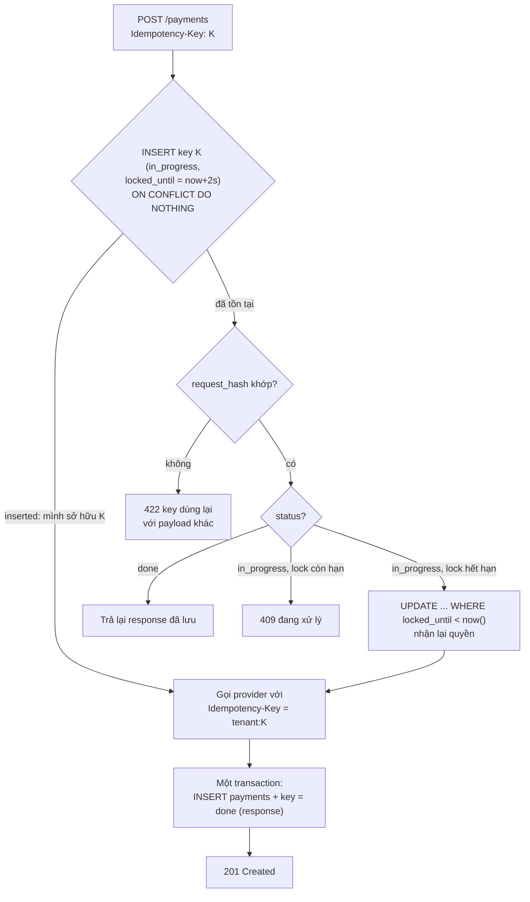
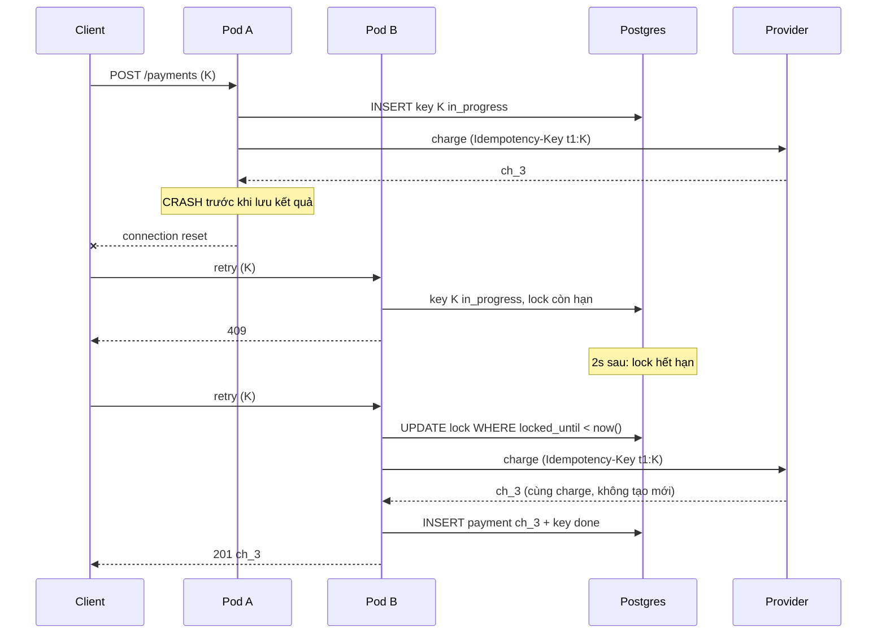

## Bối cảnh & vấn đề

Đội support nhận vài ticket mỗi tuần: "Tôi bị trừ tiền hai lần cho một đơn hàng." Log của checkout cho thấy cùng một mẫu: request `POST /payments` đầu tiên **timeout sau 500 ms**, client retry, request thứ hai thành công. Log của payment provider cho thấy **hai** charge: request đầu tiên không hề thất bại, nó chỉ mất 800 ms vì provider đang chậm, và đã hoàn tất sau khi client bỏ cuộc.

[Bài Mô hình lỗi](/tracks/distributed-systems/learn/failure-model) đã đo điều này: một timeout không nói gì về việc request đã chạy hay chưa. Client chỉ có hai lựa chọn: không retry (khách có thể không được charge, đơn treo) hoặc retry (khách có thể bị charge hai lần). Lựa chọn thứ ba, thứ làm retry trở nên **an toàn**, là thiết kế để chạy một thao tác nhiều lần có cùng tác dụng như chạy một lần: **idempotency**.

Bài này định nghĩa idempotency chính xác, xây một cơ chế Idempotency-Key chạy được trên hai pod dùng chung Postgres, thử nó với timeout, request trùng đồng thời, payload khác và crash giữa chừng, rồi mở rộng thành "exactly-once processing" và một payment API đáng tin cậy.

## Khái niệm

### Idempotent

Một thao tác **idempotent** nếu thực hiện nó N lần (N ≥ 1) có **cùng tác động lên trạng thái server** như thực hiện một lần. Định nghĩa nói về **trạng thái**, không nói về response: `DELETE /orders/42` lần đầu có thể trả `204`, lần sau `404`, nhưng sau cả hai lần đơn 42 đều không còn, nên DELETE vẫn idempotent. Tương tự, tạo resource lần đầu trả `201`, lần lặp trả lại cùng kết quả (hoặc `200`).

Idempotent khác **safe**: safe nghĩa là không thay đổi trạng thái (GET); idempotent cho phép thay đổi, chỉ cần lặp lại không thay đổi thêm. `SET balance = 100` là idempotent; `SET balance = balance + 100` thì không.

### HTTP methods theo RFC 9110

RFC 9110 định nghĩa: **GET, HEAD, OPTIONS, TRACE** là safe (nên cũng idempotent); **PUT, DELETE** là idempotent; **POST** và **PATCH** **không** được đảm bảo idempotent. Đây là hợp đồng mà client, proxy và thư viện HTTP dựa vào: nhiều HTTP client và proxy tự retry GET/PUT/DELETE khi connection đứt, nhưng không retry POST.

Lưu ý: đó là định nghĩa của **method**, không phải đảm bảo của **implementation**. Một `PUT /cart/items` mà server cài đặt thành "thêm một item" là vi phạm hợp đồng, và sẽ thêm hai item khi bị retry. PATCH có thể idempotent nếu thiết kế (JSON Merge Patch đặt giá trị cụ thể), nhưng không nếu nó là "tăng số lượng thêm 1".

**Interview angle:** câu mở đầu thường là "method nào idempotent?" rồi lập tức "vậy làm sao cho POST /payments an toàn khi retry?" — câu trả lời là Idempotency-Key.

### Idempotency tự nhiên trước, key sau

Trước khi thêm cơ chế, hỏi xem thao tác có thể **tự nhiên** idempotent không:

- **Client sinh ID**: client tạo `order_id` (UUID) trước khi gửi; server `INSERT ... ON CONFLICT (order_id) DO NOTHING`. Lặp lại không tạo đơn mới.
- **Đặt giá trị thay vì cộng dồn**: `status = 'shipped'` thay vì "chuyển sang trạng thái tiếp theo".
- **Conditional update**: `UPDATE ... SET status = 'paid' WHERE id = $1 AND status = 'pending'`; lần hai cập nhật 0 dòng.
- **Unique constraint trên khoá nghiệp vụ**: một `payment` cho mỗi `(order_id, attempt)`.

Khi thao tác có side effect không tự idempotent (gọi provider thanh toán, gửi SMS) hoặc khi client không có khoá nghiệp vụ tự nhiên, dùng **Idempotency-Key**.

### Idempotency-Key

Cơ chế (Stripe phổ biến hoá, IETF đang chuẩn hoá header `Idempotency-Key` (verify trạng thái draft)): client sinh một key ngẫu nhiên (UUID) cho **mỗi ý định** (một lần bấm "Thanh toán"), gửi kèm request, và **dùng lại đúng key đó** cho mọi lần retry. Server lưu key cùng kết quả, và khi thấy lại key thì trả lại kết quả cũ thay vì làm lại.

Các thành phần một implementation đúng cần có:

1. **Lưu bền và atomic**: bảng có primary key `(tenant_id, key)`. "Ai sở hữu key" được quyết định bởi **unique constraint**, không phải bởi "SELECT xem có chưa rồi INSERT" (hai request đồng thời đều thấy "chưa có").
2. **Request hash**: lưu hash của payload. Cùng key nhưng payload khác là lỗi của client (dùng lại key cho ý định khác) → `422`. Nếu không kiểm tra, client gửi số tiền khác với key cũ sẽ nhận lại kết quả cũ và tưởng đã thanh toán số mới.
3. **Trạng thái**: `in_progress` khi đang xử lý, `done` kèm response code và body khi xong. Request trùng tới lúc `in_progress` → `409 Conflict` (hoặc chờ ngắn); lúc `done` → trả lại response đã lưu.
4. **Khoá có hạn**: `in_progress` kèm `locked_until`. Nếu pod xử lý chết, key không bị kẹt mãi: sau khi hết hạn, request retry được nhận lại quyền xử lý.
5. **Scope**: key thuộc về một tenant/user; key của tenant A không được trả kết quả cho tenant B.
6. **TTL**: giữ key đủ lâu để phủ cửa sổ retry (Stripe giữ ít nhất 24 giờ (verify)), rồi xoá.
7. **Truyền xuống dưới**: side effect ra ngoài (provider) phải nhận một idempotency key **dẫn xuất từ key của ta**, để chính provider dedupe khi ta gọi lại.
8. **Hoàn tất cùng transaction với business write**: ghi `payments` và chuyển key sang `done` trong một transaction, để không có trạng thái "đã ghi payment nhưng key vẫn in_progress" hay ngược lại.

Lưu key trong **cùng database** với dữ liệu nghiệp vụ tốt hơn chỉ dùng Redis: Redis có thể mất key khi failover hoặc eviction, và không thể commit atomic cùng với `payments`.

**Interview angle:** follow-up "hai request giống nhau tới cách nhau 5 ms trên hai pod khác nhau, chuyện gì xảy ra?" — cả hai INSERT key; unique constraint cho đúng một cái thắng; cái kia thấy `in_progress` và nhận 409 (phần ví dụ đo đúng kịch bản này).

### Delivery semantics và exactly-once processing

Trong messaging, cùng vấn đề có tên là delivery semantics: **at-most-once** (có thể mất, không trùng), **at-least-once** (không mất, có thể trùng), và **exactly-once delivery**, thứ không thể đảm bảo qua mạng không tin cậy vì producer không phân biệt "message mất" với "ack mất" (Two Generals).

Cái các hệ thống gọi là "exactly-once" là **exactly-once processing** (effectively-once): tác động của mỗi message được áp dụng đúng một lần, dù message có thể được **giao** nhiều lần. Hai cách đạt được:

- **At-least-once + dedupe**: consumer ghi message id vào bảng `processed_messages` (unique) **trong cùng transaction** với tác động nghiệp vụ. Message trùng vi phạm unique → bỏ qua. Đây chính là Idempotency-Key áp cho message (còn gọi là **inbox pattern**).
- **Gói tiến độ và kết quả vào một transaction**: Kafka transactions ghi output topic và consumer offset atomically (read-process-write trong Kafka); hoặc lưu offset trong cùng bảng Postgres với kết quả.

Ranh giới: Kafka exactly-once chỉ đúng cho read-process-write **trong Kafka** (và với consumer đọc `read_committed`). Một HTTP call, một email, một write vào database khác trong lúc xử lý **không** nằm trong transaction đó; nếu consumer chết sau khi gọi API nhưng trước khi commit, message được xử lý lại và API bị gọi lại. Mọi side effect ra ngoài vẫn cần idempotency của phía nhận.

**Interview angle:** "exactly-once của Kafka dừng ở đâu?" — ở biên của Kafka; side effect ngoài cần idempotency key hoặc outbox.

## Cơ chế hoạt động

Luồng xử lý một request có Idempotency-Key:



Mỗi nhánh tương ứng với một tình huống thật: retry sau khi xong (replay), retry trong lúc request gốc còn chạy (409), retry sau khi pod gốc chết (nhận lại quyền khi khoá hết hạn), và client dùng sai key (422). Bước "nhận lại quyền" cũng là một UPDATE có điều kiện, nên hai retry đồng thời sau khi khoá hết hạn vẫn chỉ có một cái thắng.

Sự cố "crash sau khi provider đã charge" và vì sao truyền key xuống provider cứu nó:



Không có key truyền xuống, lần gọi provider thứ hai sẽ tạo `ch_4`: khách bị trừ hai lần dù phía ta làm idempotency đúng. Đây là câu follow-up "record idempotency đã ghi nhưng process crash trước khi gọi provider thì sao?": nếu crash **trước** khi gọi provider, retry sau khi khoá hết hạn gọi provider lần đầu, đúng; nếu crash **sau** khi gọi, key truyền xuống làm provider trả lại cùng charge. Cả hai đều đúng nhờ cùng một cơ chế.

## Ví dụ thực tế

### Không có idempotency: hai charge

Node 24, một provider giả lập mất 800 ms, client timeout 500 ms và retry một lần:

```ts
const pay = () => fetch("http://localhost:9300/payments", {
  method: "POST", body: JSON.stringify({ orderId: "o-9", amount: 500 }),
  signal: AbortSignal.timeout(500),
});
```

```text
attempt 1 -> "TimeoutError"
retry     -> "TimeoutError"
provider recorded 2 charges for order o-9: [{"orderId":"o-9","amount":500},{"orderId":"o-9","amount":500}]
```

Client thấy hai lần thất bại; khách bị trừ hai lần. Đây là sự cố ở đầu bài.

### Idempotency-Key trên hai pod dùng chung PostgreSQL 17

Hai API server (port 9201, 9202) cùng dùng một PostgreSQL 17.11; provider giả lập tôn trọng header `Idempotency-Key` như Stripe.

```sql
CREATE TABLE idempotency_keys (
  tenant_id text, key text,
  request_hash text NOT NULL, status text NOT NULL,          -- in_progress | done
  response_code int, response_body jsonb, locked_until timestamptz,
  created_at timestamptz DEFAULT now(),
  PRIMARY KEY (tenant_id, key)
);
```

```ts
// 1) try to own the key
let own = await pool.query(`INSERT INTO idempotency_keys(tenant_id, key, request_hash, status, locked_until)
  VALUES ($1,$2,$3,'in_progress', now() + interval '2 seconds') ON CONFLICT DO NOTHING RETURNING 1`, [tenant, key, hash]);
if (!own.rowCount) {
  const k = (await pool.query("SELECT * FROM idempotency_keys WHERE tenant_id=$1 AND key=$2", [tenant, key])).rows[0];
  if (k.request_hash !== hash) return send(422, { error: "key reused with a different payload" });
  if (k.status === "done") return send(k.response_code, { ...k.response_body, replayed: true });
  own = await pool.query(`UPDATE idempotency_keys SET locked_until = now() + interval '2 seconds'
    WHERE tenant_id=$1 AND key=$2 AND status='in_progress' AND locked_until < now() RETURNING 1`, [tenant, key]);
  if (!own.rowCount) return send(409, { error: "request with this key is in progress" });
}
// 2) side effect with a derived key
const charge = await fetch(PROVIDER, { method: "POST", body: raw, headers: { "idempotency-key": `${tenant}:${key}` } });
// 3) INSERT payments + UPDATE key SET status='done', response_body=... in ONE transaction
```

```text
== 1. client times out (provider slow), retries with the same key
attempt 1 -> client TIMEOUT
attempt 2 -> 201 {"pod":9201,"orderId":"o-1","chargeId":"ch_1","replayed":true}

== 2. two identical requests 5ms apart on different pods
pod 9201 -> 201 {"orderId":"o-2","chargeId":"ch_2","pod":9201}
pod 9202 -> 409 {"error":"request with this key is in progress"}

== 3. same key, different payload
-> 422 {"error":"key reused with a different payload"}

== 4. pod crashes after the provider charged, before saving
  pod:9201 CRASH after provider charged ch_3, before saving
attempt 1 -> client ERROR UND_ERR_SOCKET
retry now -> 409 {"error":"request with this key is in progress"}
retry after lock expiry -> 201 {"orderId":"o-4","chargeId":"ch_3","pod":9202}

our payments: [{"order_id":"o-1","payments":1,"charge":"ch_1"},{"order_id":"o-2","payments":1,"charge":"ch_2"},{"order_id":"o-4","payments":1,"charge":"ch_3"}]
provider: 3 distinct charges for 4 calls
```

Bốn kịch bản, bốn hành vi đúng. (1) Request gốc tiếp tục chạy sau khi client timeout và hoàn tất; retry 700 ms sau nhận lại **response đã lưu** (`replayed: true`), không charge mới. (2) Hai request cùng key cách nhau 5 ms trên hai pod: unique constraint cho pod 9201 thắng, pod 9202 trả `409`; client retry sau đó sẽ nhận replay. (3) Dùng lại key với số tiền khác bị từ chối `422`. (4) Pod crash **sau** khi provider charge: retry ngay nhận `409` (khoá còn hạn), retry sau khi khoá hết hạn được pod khác nhận lại, gọi provider với cùng key dẫn xuất và nhận lại **cùng** `ch_3`. Tổng kết: mỗi đơn đúng một payment; provider nhận 4 lần gọi nhưng chỉ có 3 charge.

### Payment API giữa checkout và provider

Ráp các phần lại thành một thiết kế cho câu hỏi senior:

- **API** nhận `Idempotency-Key` + payload; bảng `payment_attempts` với unique key và một **state machine**: `CREATED → PENDING → SUCCEEDED | FAILED | UNKNOWN`.
- Gọi provider với **cùng key** (dẫn xuất). Kết quả rõ ràng thì chuyển `SUCCEEDED`/`FAILED`. **Timeout hoặc 5xx từ provider → `UNKNOWN`, không phải `FAILED`**: ta không biết tiền đã bị trừ chưa. Trả cho checkout trạng thái "đang xử lý".
- **Reconciliation job** quét `UNKNOWN`/`PENDING` quá N phút, hỏi provider trạng thái theo key hoặc theo reference, rồi chốt trạng thái. Đối soát hằng ngày toàn bộ charge của provider với `payment_attempts` để bắt mọi lệch (charge không có order → refund).
- **Webhook** từ provider: verify chữ ký, idempotent theo `event_id` (bảng processed events, unique), chỉ chuyển trạng thái theo các cạnh hợp lệ của state machine (không cho `SUCCEEDED → PENDING`).
- **Outbox**: khi chuyển `SUCCEEDED`, ghi event `PaymentSucceeded` vào bảng outbox trong cùng transaction; relay publish sau, consumer dedupe.
- Retry có jitter và circuit breaker cho call tới provider ([bài Timeout & retry](/tracks/distributed-systems/learn/timeouts-retries), [bài Circuit breaker](/tracks/distributed-systems/learn/circuit-breaker-bulkhead-shedding)); audit log mọi chuyển trạng thái.

**Interview angle:** follow-up "provider timeout và không bao giờ gửi webhook, đơn được giải quyết thế nào?" — trạng thái `UNKNOWN` + reconciliation hỏi provider; không bao giờ tự đoán là thất bại rồi cho khách thanh toán lại với key mới.

## Trade-offs & lựa chọn thay thế

| Cách | Đảm bảo | Chi phí | Hợp khi |
| --- | --- | --- | --- |
| Method idempotent tự nhiên (PUT, DELETE) | Lặp không đổi trạng thái | Thiết kế API đúng | CRUD theo ID |
| Client sinh ID + `ON CONFLICT DO NOTHING` | Không tạo trùng | Client phải sinh ID | Tạo đơn, tạo resource |
| Conditional update theo trạng thái | Chuyển trạng thái một lần | Không | State machine |
| Idempotency-Key bảng riêng (DB) | Replay response, phát hiện payload khác | Một bảng, TTL, logic | POST có side effect (thanh toán) |
| Idempotency-Key trong Redis | Nhanh | Mất khi failover/eviction, không atomic với DB | Side effect rẻ, chấp nhận hiếm khi trùng |
| Inbox / processed_messages | Exactly-once processing cho consumer | Bảng dedupe | Consumer queue/Kafka ghi DB |
| Kafka transactions | Exactly-once read-process-write trong Kafka | Cấu hình, latency | Stream processing Kafka → Kafka |

Chọn thế nào: ưu tiên idempotency **tự nhiên** (ID do client sinh, conditional update) vì không cần thêm bảng. Thêm Idempotency-Key khi có side effect không tự idempotent và khi cần replay đúng response cũ. Lưu key cùng database với dữ liệu nghiệp vụ để commit atomic. Với consumer message, dùng inbox pattern; chỉ dựa vào Kafka transactions khi toàn bộ pipeline nằm trong Kafka.

## Edge cases & failure modes

- **Client sinh key mới cho mỗi lần retry**: mọi bảo vệ vô dụng. Key phải gắn với **ý định** (lưu cùng order phía client), không sinh lại trong vòng retry.
- **Key bị kẹt `in_progress`** khi pod chết: cần `locked_until` (đã đo) hoặc job dọn dẹp; nếu không, khách không bao giờ thanh toán được đơn đó.
- **Khoá hết hạn trong khi request gốc vẫn đang chạy** (provider chậm hơn thời hạn khoá): hai pod cùng gọi provider; vô hại **nhờ** key dẫn xuất ở provider, nhưng hai pod cùng cố ghi `payments`, nên bước ghi cuối cũng phải có điều kiện (`WHERE status = 'in_progress'`) hoặc unique trên `order_id`.
- **Provider không hỗ trợ idempotency**: phải dùng trạng thái `UNKNOWN` + truy vấn trạng thái theo reference của ta trước khi gọi lại.
- **Response quá lớn để lưu**: lưu tham chiếu (resource id) và tái dựng response khi replay.
- **Key scope sai**: key toàn cục thay vì theo tenant cho phép một tenant đoán key và nhận response của tenant khác.
- **TTL ngắn hơn cửa sổ retry**: mobile app offline 2 ngày rồi retry với key đã bị xoá → tạo charge mới. TTL phải phủ cửa sổ retry thực tế của client.
- **Client timeout ngắn hơn p99 của server**: tạo ra rất nhiều retry vô ích; đặt timeout client lớn hơn p99 server và để idempotency lo phần còn lại.

## Pitfalls

- ❌ Retry POST không có idempotency → ✅ Idempotency-Key cho mỗi ý định, dùng lại cho mọi retry.
- ❌ "SELECT xem key có chưa rồi INSERT" → ✅ unique constraint quyết định ai sở hữu key.
- ❌ Không lưu request hash → ✅ cùng key khác payload phải trả 422.
- ❌ Chỉ dedupe phía mình, không truyền key xuống provider → ✅ crash sau khi gọi provider vẫn tạo charge thứ hai nếu provider không dedupe.
- ❌ Coi timeout từ provider là FAILED → ✅ UNKNOWN + reconciliation.
- ❌ Lưu key trong Redis rồi ghi payment trong Postgres → ✅ cùng database, cùng transaction.
- ❌ Tin "exactly-once" của broker bao phủ cả side effect → ✅ chỉ trong biên của broker; ngoài đó cần dedupe.

## Tóm tắt

- Idempotent: N lần cùng tác động lên **trạng thái** như 1 lần (response có thể khác); GET/HEAD/OPTIONS/PUT/DELETE idempotent theo RFC 9110, POST/PATCH không.
- Ưu tiên idempotency tự nhiên: client sinh ID, `ON CONFLICT DO NOTHING`, conditional update.
- Idempotency-Key đúng: unique `(tenant, key)`, request hash (422), `in_progress` có `locked_until` (409), `done` lưu response (replay), TTL, truyền key xuống provider, hoàn tất trong cùng transaction với business write.
- Đo trên hai pod + Postgres: timeout rồi retry → replay; trùng 5 ms → 201 + 409; payload khác → 422; crash sau khi charge → retry nhận lại cùng `ch_3`; mỗi đơn một payment.
- Exactly-once delivery là không thể; exactly-once processing = at-least-once + dedupe trong cùng transaction (inbox) hoặc transaction gộp tiến độ và kết quả.
- Kafka exactly-once dừng ở biên Kafka; side effect ngoài cần idempotency.
- Payment API: state machine với `UNKNOWN`, reconciliation, webhook idempotent theo event id, outbox, đối soát hằng ngày.
