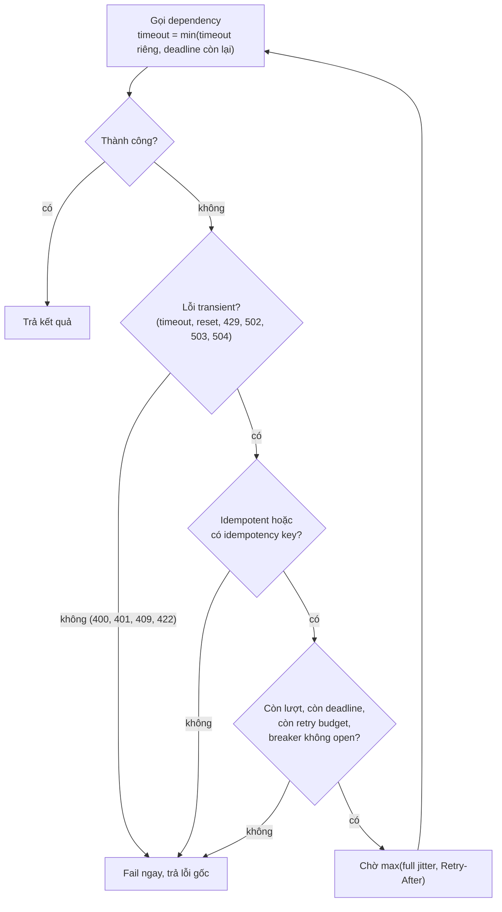
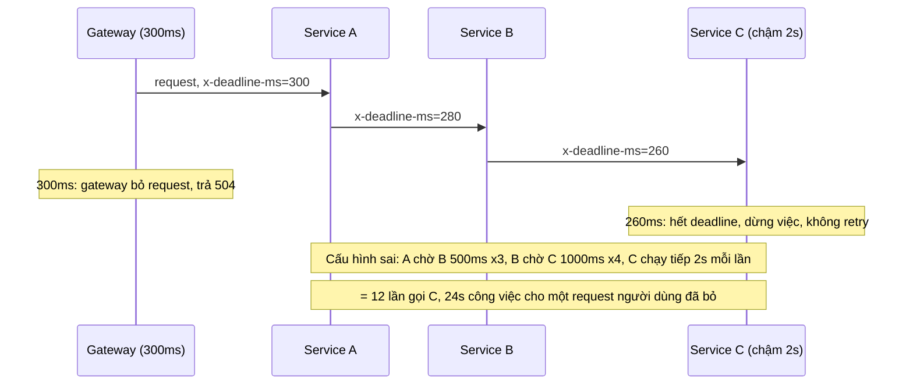

## Bối cảnh & vấn đề

Payment provider của một sàn thương mại điện tử sập 10 phút. Trong 10 phút đó checkout trả lỗi, điều có thể chấp nhận. Điều không chấp nhận được xảy ra **sau đó**: provider vừa lên lại thì lập tức sập lần nữa, dashboard cho thấy lượng request tới nó gấp **năm lần** bình thường. Mỗi tầng (mobile app, API gateway, checkout service, SDK của provider) đều có retry "cho chắc", và trong lúc outage, mỗi request người dùng biến thành hàng chục request đang chờ đến lượt. Khi provider hồi phục, cả backlog đổ vào cùng lúc.

Cùng tuần đó, một team khác thấy người dùng nhận rất nhiều `504` từ service A, trong khi service C ở tầng sâu nhất vẫn đang chạy hết công suất. Khi đọc cấu hình timeout, họ thấy gateway bỏ request sau 3 giây, nhưng A chờ B tới 5 giây và retry, B chờ C tới 10 giây và retry, C chạy query không có `statement_timeout`. C đang làm việc cho những request mà người dùng đã bỏ từ lâu.

Timeout và retry là hai công cụ cơ bản nhất của resilience, và cũng là hai công cụ gây incident nhiều nhất khi dùng sai. Bài này đi từ "vì sao cần timeout" tới deadline propagation, rồi từ "khi nào được retry" tới backoff, jitter, retry budget và hedged requests, mỗi phần đo bằng code chạy thật.

## Khái niệm

### Timeout

Một network call không có **timeout** có thể treo **vô hạn**: TCP không tự báo lỗi khi đầu kia im lặng (không có keepalive tích cực, một connection có thể "sống" hàng giờ). Mỗi request treo giữ một socket, một slot trong connection pool, bộ nhớ cho request/response, và trong Java/Go là một thread/goroutine. Khi dependency chậm, các request treo tích tụ cho tới khi tài nguyên chung cạn và **mọi** request, kể cả request không liên quan, đều chờ: cascading failure ([bài Circuit breaker & bulkhead](/tracks/distributed-systems/learn/circuit-breaker-bulkhead-shedding)).

Timeout còn là cách duy nhất để chuyển "không biết" thành một quyết định: sau T mili giây, coi như thất bại và làm gì đó (trả lỗi, fallback, retry). Nhưng nhớ rằng timeout **không có nghĩa** request thất bại ở phía server ([bài Mô hình lỗi](/tracks/distributed-systems/learn/failure-model)).

### Chọn giá trị timeout

Quy tắc thực tế:

- Dựa trên **latency đo được** của dependency, không đoán: lấy p99 hoặc p99.9 trong điều kiện bình thường cộng một biên. Timeout dưới p99 nghĩa là 1% request bình thường bị cắt và retry, tự tăng tải.
- Phải nằm **trong ngân sách** của request người dùng: nếu người dùng chịu được 2 giây và bạn gọi 3 dependency tuần tự, mỗi cái không thể có timeout 2 giây.
- Tách **connect timeout** (ngắn, ví dụ 100–500 ms trong datacenter: không kết nối được thì thường là host chết) và **read/response timeout** (theo latency của thao tác).
- Thao tác chậm có chủ đích (export báo cáo) không nên đi cùng đường với API đồng bộ; đưa vào job async thay vì nới timeout.

Quá ngắn: false timeout, retry vô ích, tăng tải đúng lúc dependency đang chậm. Quá dài: không bảo vệ được gì, tài nguyên bị giữ lâu.

**Interview angle:** câu "chọn timeout thế nào?" — p99/p99.9 thực đo, trong ngân sách tổng, connect khác read; và nói luôn timeout phải **giảm dần** theo độ sâu của call chain.

### Deadline propagation

Timeout cố định ở mỗi hop có một lỗ hổng: các hop không biết caller đã hết kiên nhẫn. **Deadline propagation**: request người dùng có một ngân sách thời gian (ví dụ 2 s); mỗi hop truyền **thời gian còn lại** (hoặc thời điểm hết hạn) xuống hop tiếp theo; mỗi hop dùng `min(timeout riêng, thời gian còn lại − biên)`, **không bắt đầu** việc mới hoặc **không retry** nếu thời gian còn lại quá ít, và hủy công việc khi caller hủy.

gRPC có deadline sẵn trong protocol (header `grpc-timeout`). Với HTTP trong Node: một header tự đặt (`x-deadline-ms` mang thời gian còn lại), lưu deadline trong `AsyncLocalStorage` để mọi client trong request dùng chung, `AbortSignal.timeout(remaining)` cho `fetch`, truyền `AbortSignal` xuống driver DB và HTTP client, đặt `statement_timeout` ở Postgres cho query.

Truyền **thời gian còn lại** tốt hơn truyền **thời điểm tuyệt đối** (epoch ms): epoch phụ thuộc đồng hồ của caller và callee khớp nhau, và lệch vài trăm ms là bình thường ([bài Đồng hồ](/tracks/distributed-systems/learn/clocks-ordering-conflicts)). Với thời gian còn lại, mỗi hop đo bằng **monotonic clock** của chính nó từ lúc nhận request, chỉ sai lệch bằng network latency của một hop.

**Interview angle:** follow-up "vì sao header deadline dạng epoch phụ thuộc clock sync, và giải pháp thay thế?" — truyền thời gian còn lại, mỗi hop tự trừ bằng monotonic clock.

### Retry: khi nào được phép

Retry giúp vượt qua lỗi **tạm thời** (transient): connection reset, timeout do một packet trễ, `503` khi một instance đang restart, `429` khi bị throttle. Ba điều kiện để retry an toàn:

1. **Lỗi retryable**: timeout, lỗi kết nối, `408`, `429`, `502`, `503`, `504`. Không retry `400`, `401`, `403`, `404`, `409`, `422`: chúng sẽ thất bại y hệt lần sau, và retry chỉ che lỗi thật và tốn tài nguyên.
2. **Thao tác idempotent** hoặc có idempotency key ([bài Idempotency](/tracks/distributed-systems/learn/idempotency-delivery)). Retry `POST /payments` không có key có thể trừ tiền hai lần.
3. **Còn thời gian và còn ngân sách**: còn trong deadline, chưa vượt số lần tối đa (thường 2–3), retry budget còn token, circuit breaker không open. Tôn trọng `Retry-After` nếu server gửi.

### Exponential backoff và jitter

Retry ngay lập tức khi dependency đang quá tải là thêm tải vào đúng lúc tệ nhất. **Exponential backoff** giãn khoảng chờ theo cấp số nhân: `base × 2^n` (100 ms, 200 ms, 400 ms...), luôn có **trần** (`cap`) và số lần tối đa. Nhưng nếu 1.000 client cùng lỗi tại cùng một thời điểm (dependency vừa restart), backoff thuần làm cả 1.000 client retry tại **cùng** các thời điểm 100, 300, 700 ms: các đợt sóng đồng bộ.

**Jitter** ngẫu nhiên hoá delay để phá đồng bộ. Ba biến thể trong bài blog của AWS: **full jitter** `random(0, min(cap, base × 2^n))`, **equal jitter** `d/2 + random(0, d/2)`, và decorrelated jitter. Full jitter trải tải đều nhất và là mặc định được khuyến nghị.

### Retry budget

Backoff và jitter **giãn** retry ra theo thời gian nhưng không **giảm** tổng số retry. Khi dependency đang quá tải vì chính lượng request, mỗi request lỗi sinh thêm 2–3 retry, tải nhân lên 3–4 lần, dependency càng lỗi nhiều hơn: vòng lặp tự duy trì. **Retry budget** giới hạn **tỉ lệ** retry so với request mới: ví dụ retry không quá 10% traffic (Google SRE book mô tả cả budget per-request và per-client). Cài đặt đơn giản bằng token bucket: mỗi request mới nạp 0,1 token, mỗi retry tiêu 1 token; hết token thì không retry. Khi mọi thứ ổn, budget không bao giờ cạn; khi dependency sập, retry tự giảm xuống còn 10% thay vì 300%.

### Retry lồng nhiều tầng

Nếu client retry 3 lần, gateway retry 3 lần, service retry 3 lần, mỗi request người dùng có thể thành 3 × 3 × 3 = 27 request tới tầng dưới cùng. Quy tắc: retry ở **đúng một tầng**, thường là tầng **gần client nhất có idempotency** và có cái nhìn về deadline tổng (thường là service gọi trực tiếp dependency, hoặc client nếu client có idempotency key). Các tầng giữa fail fast và trả lỗi kèm thông tin "có nên retry không".

### Retry storm và metastable failure

**Retry storm**: trong lúc outage, retry tích tụ ở mọi tầng; khi dependency hồi phục, backlog cộng retry đổ vào cùng lúc (thundering herd), vượt capacity, dependency sập lại. **Metastable failure** (Bronson et al. 2021) là tên cho trạng thái này: hệ thống có hai trạng thái ổn định, "khoẻ" và "quá tải", và một kích hoạt tạm thời (outage 10 phút) đẩy nó sang trạng thái quá tải mà **không tự thoát ra được** ngay cả khi kích hoạt đã hết, vì chính retry duy trì tải. Thoát ra cần cắt nguồn khuếch đại: retry budget, circuit breaker, load shedding, hoặc tạm chặn traffic rồi mở dần.

### Hedged requests

**Hedged request** (Dean & Barroso, "The Tail at Scale"): gửi request tới một replica; nếu sau một khoảng (ví dụ p95 latency) chưa có trả lời, gửi **bản thứ hai** tới replica khác, dùng kết quả nào đến trước, hủy cái còn lại. Mục tiêu là cắt **tail latency**: p99 thường bị kéo bởi một replica đang GC, đang compaction, hay đang bị noisy neighbor, và khả năng hai replica cùng chậm thấp hơn nhiều.

Rủi ro: tăng tải (hedge sau p95 tức là ~5% request bị gửi hai lần), chỉ an toàn cho thao tác **đọc/idempotent**, và khi hệ thống quá tải toàn cục thì hedge làm tệ hơn; cần giới hạn tỉ lệ hedge và tắt khi thấy quá tải. Hedge cải thiện p99 rất nhiều nhưng gần như không đổi p50, vì request ở p50 đã xong trước thời điểm hedge.

## Cơ chế hoạt động

Quyết định có retry hay không, theo thứ tự kiểm tra:



Thứ tự có ý nghĩa: kiểm tra rẻ và chắc chắn trước (loại lỗi, idempotency), kiểm tra trạng thái động sau (budget, breaker). Mỗi nhánh "fail" đều giữ lỗi gốc để caller biết vì sao.

Timeout và deadline trong call chain, so sánh cấu hình sai và đúng:



Với deadline propagation, mỗi hop trừ đi một biên nhỏ và truyền tiếp; hop cuối dừng ngay khi hết ngân sách. Không ai làm việc cho một request đã chết. Phần ví dụ đo đúng hai cấu hình này.

## Ví dụ thực tế

### Timeout lồng nhau vs deadline propagation (ba service Node 24)

Gateway → A → B → C, các con số của câu hỏi debug thu nhỏ 10 lần: gateway 300 ms; A gọi B timeout 500 ms, retry 2; B gọi C timeout 1000 ms, retry 3; C "chạy query" 2 giây và không tự dừng. Cấu hình "good": header `x-deadline-ms` mang thời gian còn lại, mỗi hop trừ 20 ms, không retry ở tầng giữa, C dừng khi hết deadline hoặc khi caller đóng connection.

```ts
// B -> C, good mode
const left = Number(req.headers["x-deadline-ms"]) - 20;
if (left < 50) throw new Error("no time");               // don't start work we can't finish
await fetch("http://c", { signal: AbortSignal.timeout(left), headers: { "x-deadline-ms": String(left) } });

// C, good mode: stop when the caller goes away
req.on("close", () => !res.writableEnded && ac.abort());
```

```text
[bad] user got TimeoutError after 309ms; C received 12 call(s), spent 24011ms of work, 0 stopped early
[good] user got TimeoutError after 309ms; C received 1 call(s), spent 281ms of work, 1 stopped early
```

Người dùng thấy cùng một kết quả (timeout sau ~300 ms) trong cả hai cấu hình; đó là bình thường, vì C thật sự chậm. Khác biệt nằm ở phía sau: cấu hình sai tạo **12 lần gọi C** (3 lần A gọi B × 4 lần B gọi C) và **24 giây** công việc vô ích cho một request đã chết; cấu hình đúng tạo 1 lần gọi và dừng sau 281 ms. Nhân với 500 request mỗi giây trong lúc C chậm, cấu hình sai đủ làm cạn pool của C và DB đằng sau nó.

Một gotcha của Node 24 gặp khi viết ví dụ này: `AbortSignal.timeout()` chỉ nhận **số nguyên**.

```text
$ node -e 'AbortSignal.timeout(12.5)'
RangeError The value of "delay" is out of range. It must be an integer. Received 12.5
```

Thời gian còn lại tính từ `performance.now()` là số thực; phải `Math.floor` trước khi truyền vào, nếu không mọi call ném `RangeError`, và một retry helper bắt mọi lỗi sẽ âm thầm "retry" lỗi đó.

### Retry helper đúng (sửa đoạn code của câu debug)

```ts
const RETRYABLE = new Set([408, 429, 502, 503, 504]);
async function call(url: string, { deadlineAt, idempotent, maxAttempts = 3, base = 100, cap = 2000 }) {
  budget.deposit();                                                  // +0.1 token per request
  for (let attempt = 0; ; attempt++) {
    const left = deadlineAt - performance.now();
    if (left <= 0) throw new Error("deadline exceeded");
    let status: number | string, retryAfter: string | null = null;
    try {
      const r = await fetch(url, { signal: AbortSignal.timeout(Math.floor(Math.min(left, 1000))) });
      if (r.ok) return r;
      status = r.status; retryAfter = r.headers.get("retry-after");
    } catch (e) { status = (e as Error).name; }                       // timeout / connection error
    if (typeof status === "number" && !RETRYABLE.has(status)) throw new Error(`${status}: not retryable`);
    if (!idempotent) throw new Error(`${status}: not idempotent, not retrying`);
    if (attempt + 1 >= maxAttempts) throw new Error(`${status}: gave up`);
    if (!budget.spend()) throw new Error(`${status}: retry budget exhausted`);   // -1 token per retry
    const wait = Math.max(Math.random() * Math.min(cap, base * 2 ** attempt), Number(retryAfter ?? 0) * 1000);
    if (performance.now() + wait >= deadlineAt) throw new Error(`${status}: no time left`);
    await sleep(wait);
  }
}
```

```text
GET /flaky (503, 503, 200)     -> 200 after 3 attempt(s)
POST /invalid (422)            -> 422: not retryable
POST /flaky without idem key   -> 503: not idempotent, not retrying
GET /slow (1.5s deadline)      -> TimeoutError: no time left for another attempt
```

So với helper trong câu hỏi debug (retry mọi lỗi, delay cố định 1 s, 5 lần, không timeout mỗi lần, retry cả POST): helper này retry đúng loại lỗi, không retry POST không có key, dùng full jitter, có timeout mỗi attempt, dừng trước deadline, và chia sẻ một retry budget cho toàn service.

### Jitter phá các đợt sóng

1.000 client cùng lỗi tại t = 0, mỗi client retry 3 lần với base 1 s; đếm số request rơi vào cửa sổ 50 ms đông nhất:

```text
no jitter   1s*2^n                 busiest 50ms window = 1000 requests
equal jitter                       busiest 50ms window =  114 requests
full jitter random(0, 1s*2^n)      busiest 50ms window =   78 requests
```

Không jitter, cả 1.000 retry đến **cùng một khoảnh khắc** (mỗi đợt). Full jitter giảm đỉnh gần 13 lần với cùng số retry.

### Retry storm sau outage

Simulation deterministic, tick 100 ms: dependency xử lý 100 request/tick, client gửi 80 request mới/tick (80% capacity), outage 60 giây. Giả định mô hình: khi tải vượt 1,5 lần capacity, dependency "thrash" và capacity giảm một nửa (giống pool cạn, GC, queue dài), nguồn gốc của metastable failure.

```text
no retries                             peak load after recovery=1.0x normal  recovered: 0.0s after outage ends
fixed 1s, 5 retries                    peak load after recovery=6.0x normal  recovered: never (within 180s)
fixed 1s, 5 retries x 2 layers (25)    peak load after recovery=26.0x normal  recovered: never (within 180s)
exp backoff no jitter, 3 retries       peak load after recovery=4.0x normal  recovered: never (within 180s)
exp backoff + full jitter, 3 retries   peak load after recovery=4.2x normal  recovered: never (within 180s)
full jitter + retry budget 10%         peak load after recovery=1.1x normal  recovered: 0.0s after outage ends
```

Kết quả quan trọng nhất là dòng thứ năm: **backoff + full jitter vẫn không hồi phục**. Jitter trải retry đều theo thời gian nhưng mỗi request lỗi vẫn sinh ba retry, nên tải ổn định ở ~4 lần bình thường, đủ giữ dependency ở trạng thái thrash mãi mãi. Chỉ khi giới hạn **tổng lượng** retry (budget 10%), tải sau outage là 1,1 lần và hệ thống hồi phục ngay. Retry lồng hai tầng đẩy đỉnh lên 26 lần. Con số cụ thể phụ thuộc mô hình, nhưng hình dạng thì giống sự cố thật ở đầu bài.

### Hedged requests cắt tail latency

100.000 request, 2% chạm replica chậm (1.000 ms), còn lại 20–60 ms; hedge gửi bản thứ hai sau 58 ms (≈ p95 của latency bình thường):

```text
plain : p50=40ms p99=1000ms p99.9=1000ms
hedged: p50=39ms p99=99ms p99.9=116ms  extra requests=6.8%
```

p99 giảm từ 1.000 ms xuống 99 ms với 6,8% request thêm; p50 gần như không đổi. Đúng như lý thuyết: hedge chỉ tác động lên đuôi.

## Trade-offs & lựa chọn thay thế

| Kỹ thuật | Được | Mất | Khi nào |
| --- | --- | --- | --- |
| Timeout ngắn | Giải phóng tài nguyên nhanh | False timeout, retry tăng tải | Dependency có latency ổn định, có fallback |
| Timeout dài | Ít false timeout | Giữ tài nguyên, cascading failure | Thao tác chậm có chủ đích (tốt hơn: async) |
| Deadline propagation | Không làm việc vô ích | Cần chuẩn header, truyền signal khắp nơi | Call chain ≥ 2 hop |
| Retry + full jitter | Vượt lỗi tạm thời | Khuếch đại tải nếu không có budget | Lỗi transient, thao tác idempotent |
| Retry budget | Chặn retry storm | Một số request lẽ ra cứu được sẽ không được retry | Mọi service có retry |
| Retry ở một tầng | Không nhân bản | Cần thống nhất giữa các team | Kiến trúc nhiều tầng |
| Hedged requests | Cắt tail latency | +5–10% tải; chỉ cho đọc/idempotent | Read path nhạy p99, có nhiều replica |

Chọn thế nào: timeout ở mọi call là bắt buộc, không phải lựa chọn. Thêm deadline propagation ngay khi có hơn một hop. Retry chỉ ở một tầng, chỉ cho lỗi transient và thao tác idempotent, với full jitter **và** budget; thiếu budget thì backoff/jitter không bảo vệ được bạn khỏi metastable failure. Hedge chỉ sau khi đã có budget và chỉ cho read path cần p99 thấp.

## Edge cases & failure modes

- **Timeout của caller ngắn hơn timeout + retry của callee**: callee làm việc cho request đã bị bỏ (đo: 12 lần gọi, 24 s công việc).
- **Không có `statement_timeout`** ở DB: query chạy tiếp sau khi app đã timeout và trả connection về pool (hoặc tệ hơn, giữ connection); đặt `statement_timeout` theo route và hủy query khi request bị hủy.
- **Retry `RangeError`/lỗi lập trình**: helper bắt mọi exception và retry cả lỗi do code (như `AbortSignal.timeout(12.5)`); chỉ retry các lỗi đã phân loại là transient.
- **`Retry-After` rất lớn** (60 s) trong khi deadline còn 2 s: không chờ; fail ngay.
- **429 từ dependency**: là tín hiệu "chậm lại", nên giảm tốc (và có thể tính vào breaker riêng), không retry dồn dập.
- **Clock skew với deadline epoch**: caller nhanh hơn callee 200 ms làm callee nghĩ còn ít thời gian hơn thực tế (hoặc ngược lại).
- **Retry làm thay đổi thứ tự**: retry của write A đến sau write B mới hơn; cần version/conditional write.
- **Hedge khi quá tải toàn cục**: mọi request đều chậm, hedge gửi gấp đôi request; tắt hedge khi tỉ lệ hedge vượt ngưỡng.

## Pitfalls

- ❌ Network call không timeout (mặc định của nhiều client là vô hạn hoặc rất dài) → ✅ timeout tường minh ở mọi call, connect và read riêng.
- ❌ Timeout tăng dần vào trong call chain → ✅ giảm dần theo độ sâu, hoặc deadline propagation.
- ❌ Retry mọi lỗi → ✅ chỉ timeout/reset/408/429/502/503/504.
- ❌ Retry POST không có idempotency key → ✅ idempotency key hoặc không retry.
- ❌ Delay cố định hoặc backoff không jitter → ✅ full jitter `random(0, min(cap, base × 2^n))`.
- ❌ Nghĩ backoff + jitter đủ chống retry storm → ✅ cần retry budget (đo: jitter vẫn kẹt ở 4,2 lần tải; budget 10% hồi phục ngay).
- ❌ Retry ở mọi tầng → ✅ một tầng, các tầng khác fail fast.
- ❌ Truyền deadline dạng epoch giữa các máy → ✅ truyền thời gian còn lại, đo bằng monotonic clock.

## Tóm tắt

- Mọi network call cần timeout: không có thì request treo giữ tài nguyên tới khi cascading failure; chọn theo p99/p99.9 thực đo, trong ngân sách tổng.
- Deadline propagation: truyền thời gian còn lại, mỗi hop dùng `min(own, remaining)`, không bắt đầu/không retry khi hết giờ, hủy việc khi caller hủy (đo: 12 → 1 lần gọi C, 24 s → 0,28 s công việc).
- Retry chỉ khi lỗi transient + thao tác idempotent + còn deadline, còn budget, breaker đóng; tôn trọng `Retry-After`.
- Exponential backoff giãn retry; full jitter phá đồng bộ (đo: đỉnh 1.000 → 78 request mỗi 50 ms).
- Backoff + jitter không giảm tổng retry; retry budget (token bucket ~10%) mới chặn được retry storm và metastable failure.
- Retry ở một tầng; 3 tầng × 3 lần = 27 request.
- Hedged requests cắt p99 (đo: 1.000 → 99 ms với +6,8% tải) nhưng không đổi p50; chỉ cho đọc/idempotent và tắt khi quá tải.
- Gotcha Node: `AbortSignal.timeout()` chỉ nhận số nguyên.
