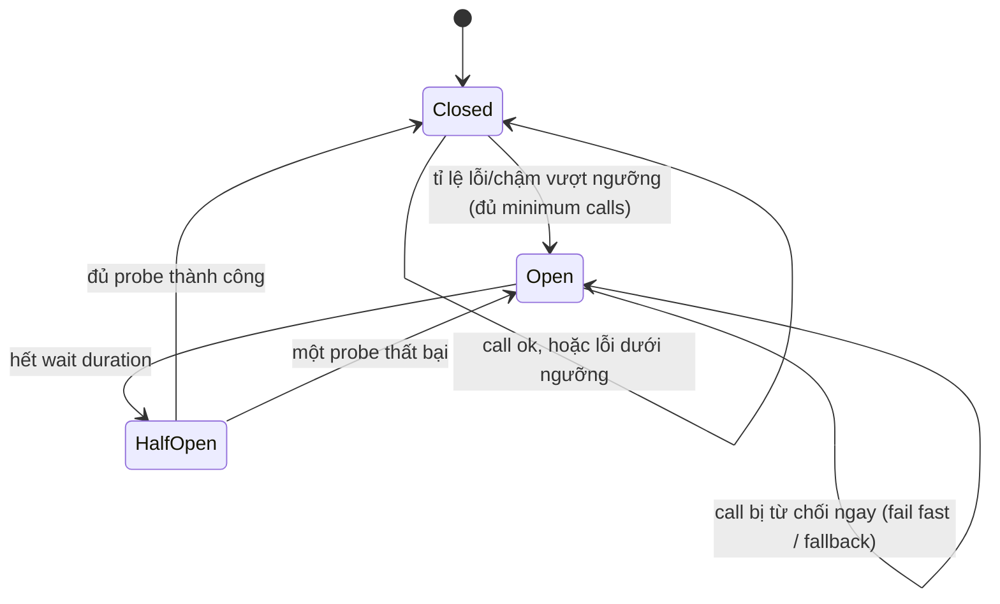
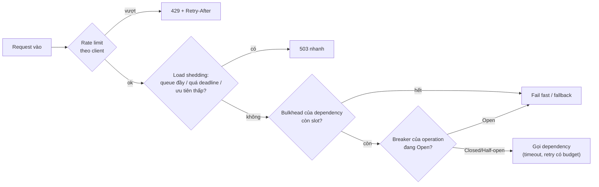

## Bối cảnh & vấn đề

Trang sản phẩm của một shop gọi service recommendation để hiện "sản phẩm tương tự". Một buổi sáng, recommendation chậm từ 50 ms lên 2 giây vì một index bị drop nhầm. Không ai lo lắm: recommendation chỉ là phần phụ. Mười phút sau, **toàn bộ API** ngừng phản hồi, kể cả `/stock` và `/checkout` vốn không gọi recommendation. Health check vẫn xanh; CPU thấp; event loop không bị block.

Thủ phạm là **tài nguyên dùng chung**. Mọi endpoint dùng cùng một connection pool 10 connection tới Postgres, và query của recommendation giữ connection 2 giây. Ba mươi request trang sản phẩm đồng thời đủ chiếm cả 10 connection và xếp hàng 20 cái nữa; mỗi request `/stock` cần query 1 ms cũng phải xếp sau chúng. Một dependency chậm đã trở thành một outage toàn hệ thống: **cascading failure**.

Bài [Timeout & retry](/tracks/distributed-systems/learn/timeouts-retries) giới hạn mỗi call riêng lẻ. Bài này giới hạn **hệ thống**: cô lập tài nguyên (bulkhead), ngừng gọi dependency đang hỏng (circuit breaker), và từ chối có chủ đích khi quá tải (backpressure, load shedding, rate limiting). Mỗi pattern được đo bằng một thí nghiệm thật.

## Khái niệm

### Cascading failure qua tài nguyên chung

**Cascading failure** là khi lỗi ở một thành phần lan sang thành phần khác qua một cơ chế chung. Với dependency **chậm** (chậm nguy hiểm hơn chết, vì chết thì fail nhanh), cơ chế thường là: mỗi request tới dependency chậm **giữ tài nguyên lâu hơn** (connection DB, socket trong HTTP agent, slot trong semaphore, bộ nhớ cho request đang chờ), tài nguyên chung cạn, và mọi request khác phải **chờ** tài nguyên đó. Ở Node, các tài nguyên chung điển hình: DB pool, `http.Agent` với `maxSockets`, worker pool của libuv (DNS, fs, crypto), và bộ nhớ heap.

Dấu hiệu sớm (metric nên có trước khi người dùng thấy): **pool wait time** và số request đang chờ connection, số request in-flight theo dependency, p99 latency của dependency, event loop lag, và tỉ lệ timeout. CPU và health check thường **không** báo gì.

**Interview angle:** follow-up "metric nào cho thấy chuyện này trước khi người dùng thấy?" — pool wait/queue length, in-flight theo dependency, p99 dependency; không phải CPU.

### Bulkhead

**Bulkhead** (vách ngăn trên tàu: một khoang thủng không làm chìm cả tàu): chia tài nguyên thành các phần **riêng** cho từng dependency hoặc loại việc, để một phần cạn không ảnh hưởng phần khác. Java có thread pool riêng cho mỗi dependency (Hystrix). Node không có thread per request, nhưng có các tương đương:

- **Giới hạn concurrency** theo dependency: semaphore/`p-limit` (ví dụ tối đa 5 request đồng thời tới API báo cáo chậm, 50 tới payments), kèm **hàng chờ ngắn**; hết chỗ thì **fail fast** (503 hoặc fallback) thay vì chờ.
- **Pool riêng**: DB pool riêng cho job nền/report và cho API; `http.Agent` riêng với `maxSockets` riêng cho từng upstream.
- **Tách process/deployment**: worker xử lý job nặng chạy ở deployment khác API; tenant lớn ở pool riêng.

Bulkhead không làm dependency nhanh hơn; nó chọn **ai** phải chịu khi dependency chậm: chỉ những request cần dependency đó, và chúng chịu bằng lỗi nhanh thay vì chờ lâu.

### Circuit breaker

**Circuit breaker** (Nygard, Fowler) đặt giữa caller và dependency, theo dõi kết quả và **ngừng gọi** khi dependency rõ ràng đang hỏng. Ba trạng thái:

- **Closed**: request đi qua bình thường; breaker ghi kết quả vào một **sliding window** (N call gần nhất hoặc N giây gần nhất).
- **Open**: khi tỉ lệ lỗi (hoặc tỉ lệ call chậm) trong window vượt ngưỡng, và window có ít nhất `minimumNumberOfCalls` call, breaker chuyển sang Open: mọi call **fail fast** (hoặc trả fallback) mà không chạm dependency, trong một khoảng `waitDurationInOpenState`.
- **Half-open**: hết thời gian chờ, cho một số **probe** giới hạn đi qua. Probe thành công đủ → Closed; thất bại → Open lại.

Breaker bảo vệ hai phía: **caller** không tốn thời gian chờ timeout cho từng request (và không giữ tài nguyên), và **dependency** có khoảng thở để hồi phục thay vì bị dội retry. Trong retry storm, half-open với vài probe là thứ ngăn toàn bộ backlog đổ vào dependency vừa sống lại.

**Fallback** khi Open phải là thứ có nghĩa với nghiệp vụ: recommendation → danh sách "bán chạy" cache sẵn hoặc ẩn khối đó; giá vận chuyển → giá mặc định với cờ "ước tính"; thanh toán → **không** có fallback giả, chỉ có lỗi rõ ràng và "thử lại sau".

### Cấu hình breaker và granularity

Lỗi cấu hình phổ biến nhất là **granularity sai**: một breaker cho **cả** client của một dependency. Một endpoint ít dùng nhưng đang hỏng (export đối soát chạy hằng đêm) làm breaker mở, và breaker mở chặn luôn endpoint chính (`/charge`) đang hoàn toàn khoẻ. Breaker nên tách theo **operation/endpoint** (hoặc theo host/region nếu dependency có nhiều).

Các điểm cấu hình khác:

- Ngưỡng theo **tỉ lệ** lỗi trên window, với `minimumNumberOfCalls` (ví dụ 20): với traffic thấp, "5 lỗi liên tiếp" có thể chỉ là một burst nhỏ.
- **Loại lỗi nào tính**: 5xx, timeout, connection error tính; 4xx do input của client (400, 404, 422) **không** tính, vì dependency vẫn khoẻ. 429 là tín hiệu "chậm lại": thường không tính là failure của breaker chính mà xử lý bằng backoff/`Retry-After`, hoặc tính vào breaker riêng nếu throttle kéo dài.
- **Slow call** cũng là lỗi: call vượt ngưỡng thời gian (ví dụ > 2 s) tính vào tỉ lệ slow-call.
- Thời gian Open và số probe half-open: ngắn quá thì breaker dao động, dài quá thì chậm phát hiện hồi phục.

**Interview angle:** câu "breaker mở cho cả payments client mỗi khi một endpoint hiếm dùng lỗi" — granularity sai; tách breaker theo endpoint, ngưỡng theo tỉ lệ với minimum calls, loại 4xx khỏi failure.

### Backpressure

**Backpressure**: consumer chậm báo ngược cho producer để producer **chậm lại**, thay vì producer đẩy dữ liệu vào một buffer không giới hạn. Ví dụ: Node stream (`write()` trả `false` khi vượt `highWaterMark`, producer chờ event `drain`; `pipeline()` tự làm), TCP flow control (receive window), Kafka consumer **pull** theo tốc độ của nó, queue có giới hạn (BullMQ/SQS với concurrency cố định), và HTTP/2 flow control. Backpressure hoạt động khi producer **có thể** chậm lại: một job import file, một stream.

### Load shedding

**Load shedding**: server quá tải **chủ động từ chối** bớt request (trả 503/429 **nhanh**) để phần còn lại vẫn được phục vụ trong SLO. Cần khi producer **không thể** chậm lại: người dùng Internet không nghe lời backpressure. Không có shedding, queue phía server dài ra, mọi request (kể cả những cái sẽ được xử lý) đều trễ, nhiều request được xử lý xong **sau khi** client đã timeout (công việc vô ích), và goodput (số request hữu ích mỗi giây) **giảm** khi tải tăng.

Cách làm: giới hạn concurrency/queue; **bỏ request đã quá deadline** trước khi xử lý (nó đã vô ích); ưu tiên theo loại request (checkout > browse > recommendation > analytics); dùng tín hiệu sớm (queue time, CPU, in-flight) thay vì chờ timeout. Thứ tự shed trên e-commerce điển hình: bot/crawler và analytics trước, rồi recommendation và search suggest, rồi browse, giữ checkout và payment tới cuối.

### Rate limiting phân tán

**Rate limiter** giới hạn mỗi **client** (API key, tenant, IP) ở một tốc độ, để một client không ăn hết capacity. Thuật toán: **token bucket** (bucket dung lượng C, nạp R token/giây; cho phép burst tới C), **sliding window counter** (đếm theo cửa sổ trượt xấp xỉ), fixed window (đơn giản, có burst gấp đôi ở biên cửa sổ). Với nhiều instance, state phải nằm ở **store chung** (Redis), và đọc-sửa-ghi phải **atomic** (một Lua script) để hai instance không cùng tiêu một token. Key theo client, với hash tag (`{rl:tenant-42}`) để các key của một client cùng slot trong Redis Cluster.

Khi store lỗi, phải chọn: **fail-open** (cho qua, có thể kèm một limit cục bộ bảo thủ mỗi instance) để rate limiter không tự gây outage; hoặc **fail-closed** (chặn) cho API đắt hoặc nhạy cảm (gửi SMS, đăng nhập chống brute force). Response quá limit trả `429` với `Retry-After`, và nên có header `RateLimit-*` (IETF draft (verify)). Tenant lớn cần limit cao hơn mà không sửa code: lưu limit theo tenant trong config/DB, cache trong instance, và Lua đọc capacity/rate từ tham số.

**Interview angle:** follow-up "store lỗi thì sao?" — nói rõ fail-open hay fail-closed **cho từng loại API** và vì sao; fail-open kèm limit cục bộ là câu trả lời cân bằng.

## Cơ chế hoạt động

Trạng thái của circuit breaker:



Breaker là một failure detector có trạng thái, đặt ở phía caller: Closed thì quan sát, Open thì bảo vệ, Half-open thì thăm dò. Chuyển Open → Half-open dựa trên thời gian, không dựa trên việc dependency đã hồi phục (breaker không biết); chính probe trả lời câu hỏi đó.

Các lớp bảo vệ xếp theo đường đi của một request, từ ngoài vào trong:



Thứ tự này đặt các kiểm tra rẻ và mang tính "từ chối sớm" ở ngoài (rate limit, shedding) để không tiêu tài nguyên cho request sẽ bị bỏ, rồi tới các cơ chế cô lập theo dependency (bulkhead, breaker) ở gần chỗ gọi.

## Ví dụ thực tế

### Cascading failure qua pg pool chung, và bulkhead

Node 24, `pg` pool `max: 10` tới PostgreSQL 17. `/recommendations` chạy `SELECT pg_sleep(2)` (dependency chậm), `/stock` chạy `SELECT 1`. Bốn mươi request recommendation đồng thời, trong khi cứ mỗi 50 ms có một request `/stock`.

```ts
// shared: every endpoint uses the same pool
const main = new pg.Pool({ max: 10 });
// bulkhead: recommendations get their own pool + a concurrency limit with a short queue, fail fast beyond it
const reco = new pg.Pool({ max: 3 });
const recoLimit = pLimit(3);
if (recoLimit.activeCount + recoLimit.pendingCount >= 6) return res.writeHead(503).end("shed");
await recoLimit(() => reco.query("SELECT pg_sleep(2)"));
```

```text
[shared] /stock p50=7478ms max=7934ms | /recommendations: 40 ok, 0 shed (503)
[bulkhead] /stock p50=2ms max=7ms | /recommendations: 6 ok, 34 shed (503)
```

Không bulkhead: `/stock`, một query 1 ms, có p50 **7,5 giây**, vì nó xếp hàng sau 40 query 2 giây trong cùng một pool 10 connection. Đây là toàn bộ cơ chế của sự cố ở đầu bài. Có bulkhead: `/stock` giữ 2 ms; recommendation chỉ phục vụ được 6 request và trả 503 nhanh cho 34 request còn lại (trang sản phẩm hiện fallback "bán chạy"). Thiệt hại bị **khoanh** vào đúng tính năng phụ.

### Circuit breaker: granularity

Simulation 5 giây, mỗi 10 ms một call tới payments. Endpoint `/charge` khoẻ trừ khi **cả** dependency sập (1.000–3.000 ms). Endpoint `/dispute-export` ít dùng và đang hỏng; một job export gọi nó liên tiếp trong 500–560 ms. Breaker cấu hình kiểu phổ biến "5 lỗi liên tiếp thì mở", Open 1 giây, 3 probe half-open.

```ts
class Breaker {
  async call(fn, now) {
    if (this.state === "OPEN") { if (now - this.openedAt < this.openMs) throw new Error("breaker open"); this.to("HALF_OPEN", now); }
    if (this.state === "HALF_OPEN" && this.inFlight >= this.probes) throw new Error("breaker half-open: probe slots full");
    // ... call, then record(ok): sliding window, open when failures/calls >= threshold and calls >= minCalls
  }
}
```

```text
== one breaker for the whole payments client: calls reaching dependency=203/500, failed fast=297, healthy-period /charge calls blocked=78
  540ms payments(all): CLOSED -> OPEN
 1540ms payments(all): OPEN -> HALF_OPEN
 1540ms payments(all): HALF_OPEN -> OPEN
 2540ms payments(all): OPEN -> HALF_OPEN
 2540ms payments(all): HALF_OPEN -> OPEN
 3540ms payments(all): OPEN -> HALF_OPEN
== one breaker per endpoint: calls reaching dependency=301/500, failed fast=199, healthy-period /charge calls blocked=0
 1090ms charge: CLOSED -> OPEN
 2090ms charge: OPEN -> HALF_OPEN
 2090ms charge: HALF_OPEN -> OPEN
 3090ms charge: OPEN -> HALF_OPEN
 3110ms charge: HALF_OPEN -> CLOSED
  540ms dispute-export: CLOSED -> OPEN
```

Một breaker chung: burst lỗi của `/dispute-export` mở breaker lúc 540 ms, **trước khi** dependency có vấn đề gì, và chặn **78 call `/charge`** trong lúc payments hoàn toàn khoẻ (540–1.000 ms và 3.000–3.540 ms). Breaker theo endpoint: `/dispute-export` mở riêng lúc 540 ms; `/charge` chỉ mở khi dependency thật sự sập (1.090 ms), probe half-open lúc 3.090 ms gặp dependency vừa hồi phục và đóng lại lúc 3.110 ms. Cũng thấy half-open hoạt động đúng: probe lúc 2.090 ms thất bại (dependency vẫn sập) nên Open lại, và trong cả quá trình chỉ có vài probe chạm dependency đang sập thay vì hàng trăm call.

### Load shedding vs hàng chờ không giới hạn

Server HTTP Node 24 với 10 "worker slot", mỗi request 50 ms: capacity 200 request/giây. Client gửi 1.200 request trong ~3 giây (~400 request/giây, gấp đôi capacity), timeout phía client 1 giây. Chế độ `shed`: hàng chờ tối đa 20, và bỏ request đã chờ quá 300 ms trước khi xử lý.

```ts
if (mode === "shed" && queue.length >= 20) { res.statusCode = 503; res.setHeader("retry-after", "1"); return res.end(); }
// when a slot frees up: drop work that is already too late
if (mode === "shed" && performance.now() - job.at > 300) { job.res.statusCode = 503; job.res.end(); continue; }
```

```text
[queue] offered 1200 @ ~400rps (capacity 200rps): 200 OK within 1s=416, 503=0, client timeouts=784, p50 of OK=533ms
[shed] offered 1200 @ ~400rps (capacity 200rps): 200 OK within 1s=680, 503=520, client timeouts=0, p50 of OK=143ms
```

Hàng chờ không giới hạn: chỉ **416** request thành công trong 1 giây, **784** client timeout, và server vẫn tiếp tục xử lý những request đó sau khi client đã bỏ (công việc vô ích, đúng lúc đang quá tải). Load shedding: **680** request thành công (goodput tăng 63%), latency p50 giảm từ 533 ms xuống 143 ms, và 520 request bị từ chối **ngay** với 503 + `Retry-After`, nên client biết để thử lại sau thay vì treo 1 giây.

### Rate limiter phân tán bằng Redis Lua, và khi Redis lỗi

Ba instance dùng chung Redis 8.10.2; token bucket dung lượng 10, nạp 10 token/giây, cập nhật atomic trong một Lua script. Khi Redis không trả lời trong 50 ms, instance **fail-open** với bucket cục bộ bằng 1/3 limit.

```lua
local b = redis.call('HMGET', KEYS[1], 'tokens', 'ts')
local cap, rate, now, cost = tonumber(ARGV[1]), tonumber(ARGV[2]), tonumber(ARGV[3]), tonumber(ARGV[4])
local tokens = tonumber(b[1]) or cap
local ts = tonumber(b[2]) or now
tokens = math.min(cap, tokens + (now - ts) / 1000 * rate)
local ok = tokens >= cost
if ok then tokens = tokens - cost end
redis.call('HSET', KEYS[1], 'tokens', tokens, 'ts', now)
redis.call('PEXPIRE', KEYS[1], math.ceil(cap / rate * 1000) * 2)
return ok and 1 or 0
```

```text
Redis healthy (bucket 10, 10/s)      60 requests over 3 instances -> 10 allowed, 50 got 429 (decided via redis)
Redis paused, fail-open + local share 60 requests over 3 instances -> 9 allowed, 51 got 429 (decided via local)
Redis back                           60 requests over 3 instances -> 10 allowed, 50 got 429 (decided via redis)
```

Khi Redis khoẻ, 60 request đồng thời trải trên ba instance cho đúng 10 được phép: Lua atomic nên không instance nào tiêu trùng token. Khi Redis bị `docker pause`, mỗi instance tự giới hạn ở 3 request (3,33 token), tổng 9: rate limiter **không** sập theo Redis và cũng không mở toang. Timestamp lấy từ `Date.now()` của từng instance là một xấp xỉ (lệch đồng hồ giữa instance làm tốc độ nạp lệch nhẹ); có thể lấy giờ từ Redis bằng `TIME` trong script để dùng một đồng hồ duy nhất.

## Trade-offs & lựa chọn thay thế

| Pattern | Bảo vệ cái gì | Chi phí / rủi ro | Dùng khi |
| --- | --- | --- | --- |
| Timeout | Một call không treo mãi | Chọn sai giá trị | Mọi call |
| Bulkhead | Tài nguyên của phần còn lại | Phải chia capacity, có thể lãng phí | Dependency chậm/không quan trọng dùng chung pool |
| Circuit breaker | Caller khỏi chờ, dependency khỏi bị dội | Cấu hình sai granularity/ngưỡng chặn nhầm | Dependency có thể hỏng kéo dài |
| Fallback | Trải nghiệm khi dependency hỏng | Dữ liệu cũ/giản lược | Tính năng phụ (recommendation, giá ước tính) |
| Backpressure | Consumer khỏi bị ngập | Producer phải chậm lại được | Stream, queue, pipeline nội bộ |
| Load shedding | SLO của request được phục vụ | Một phần người dùng nhận 503 | Traffic từ ngoài không điều tiết được |
| Rate limiting | Công bằng giữa client | Store chung, latency thêm | Public API, multi-tenant |

Chọn thế nào: các pattern **bổ sung** nhau, không thay thế. Bulkhead giới hạn **bao nhiêu** tài nguyên một dependency được ăn; breaker quyết định **có gọi không**. Cùng một dependency nên có cả hai: bulkhead chặn cascading failure ngay cả khi breaker chưa kịp mở (dependency chậm nhưng chưa lỗi), breaker cắt hẳn khi lỗi rõ ràng. Load shedding và rate limiting nằm ở cửa vào; rate limiting chống một client lạm dụng, shedding chống tổng tải vượt capacity. Backpressure cho mọi luồng nội bộ có thể điều tiết.

## Edge cases & failure modes

- **Dependency chậm nhưng không lỗi**: breaker chỉ đếm lỗi sẽ không bao giờ mở; cần ngưỡng slow-call hoặc timeout ngắn để chậm thành lỗi.
- **Traffic thấp**: window 20 call nhưng endpoint chỉ có 5 call/phút; breaker mở/đóng theo vài call lẻ. `minimumNumberOfCalls` và window theo thời gian.
- **Breaker per instance**: 50 pod, mỗi pod tự học; dependency nhận probe từ cả 50 pod khi half-open. Chấp nhận được với probe nhỏ; breaker chia sẻ state hiếm khi đáng độ phức tạp.
- **Fallback gọi một dependency khác** cũng đang quá tải → cascading failure mới; fallback phải rẻ và local (cache, giá trị tĩnh).
- **Bulkhead quá nhỏ** cho traffic bình thường: shed request ngay cả khi dependency khoẻ; đặt theo concurrency đo được (Little's Law: concurrency ≈ throughput × latency).
- **Shedding theo CPU trong Node**: CPU thấp trong khi pool cạn; dùng tín hiệu đúng (queue time, in-flight, event loop lag).
- **Rate limiter fail-closed khi Redis chết**: tự gây outage cho mọi client; chỉ fail-closed cho API thật sự nhạy cảm.
- **Thiếu `Retry-After`**: client nhận 429/503 và retry ngay, biến shedding thành retry storm.
- **Multi-region rate limit**: limit toàn cục cần đồng bộ cross-region (chậm); thường chia limit theo region hoặc chấp nhận xấp xỉ.

## Pitfalls

- ❌ Một DB pool/HTTP agent cho mọi thứ → ✅ pool/concurrency riêng cho dependency chậm hoặc không quan trọng, fail fast khi hết slot.
- ❌ Một circuit breaker cho cả client của dependency → ✅ breaker theo endpoint/operation (đo: breaker chung chặn 78 call `/charge` khoẻ).
- ❌ Breaker theo "N lỗi liên tiếp" với traffic thấp → ✅ tỉ lệ lỗi trên sliding window với minimum calls.
- ❌ Tính 4xx của client là lỗi của dependency → ✅ chỉ 5xx, timeout, connection error, slow call.
- ❌ Fallback giả cho thao tác tiền bạc → ✅ lỗi rõ ràng; fallback chỉ cho tính năng phụ.
- ❌ Queue không giới hạn "để không mất request" → ✅ queue có giới hạn + bỏ request quá deadline (đo: goodput 416 → 680).
- ❌ Rate limiter đọc-rồi-ghi qua hai lệnh Redis → ✅ một Lua script atomic.
- ❌ Không quyết định trước hành vi khi store lỗi → ✅ fail-open + limit cục bộ, hoặc fail-closed có chủ đích cho API nhạy cảm.

## Tóm tắt

- Dependency chậm gây cascading failure qua tài nguyên chung (đo: `/stock` 1 ms thành p50 7,5 s vì chung pool với query 2 s).
- Bulkhead: pool/concurrency riêng + hàng chờ ngắn + fail fast (đo: `/stock` giữ 2 ms, recommendation shed 34/40 về fallback).
- Circuit breaker: Closed → Open (tỉ lệ lỗi/chậm trên window, đủ minimum calls) → Half-open (vài probe) → Closed/Open.
- Granularity: breaker theo endpoint/operation; 4xx không tính; 429 xử lý bằng backoff; slow call cũng là lỗi.
- Backpressure cho producer chậm lại được; load shedding từ chối nhanh khi producer không điều tiết được (đo: goodput +63%, p50 533 → 143 ms).
- Rate limiter phân tán: token bucket trong Redis Lua atomic, key theo client với hash tag; store lỗi thì fail-open với limit cục bộ (đo: 10 → 9 cho phép khi Redis bị pause) hoặc fail-closed cho API nhạy cảm.
- Các pattern bổ sung nhau: rate limit và shedding ở cửa vào, bulkhead và breaker ở chỗ gọi dependency, timeout ở mọi call.
