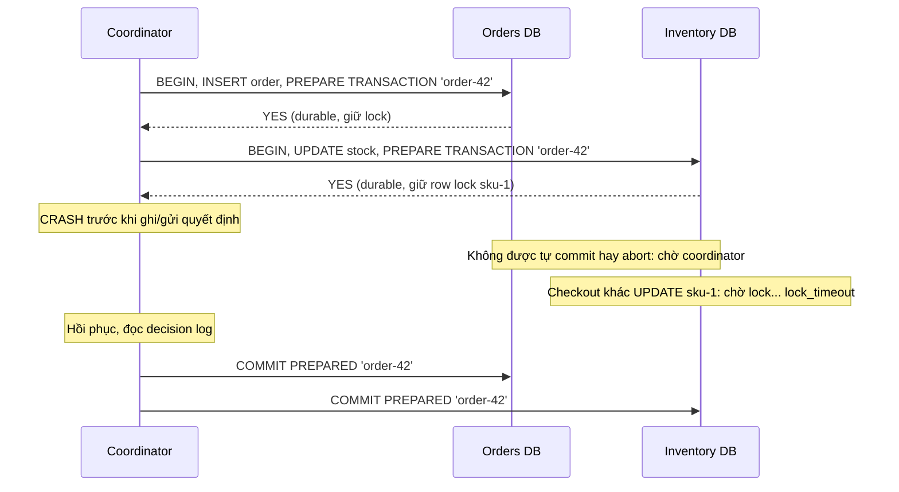
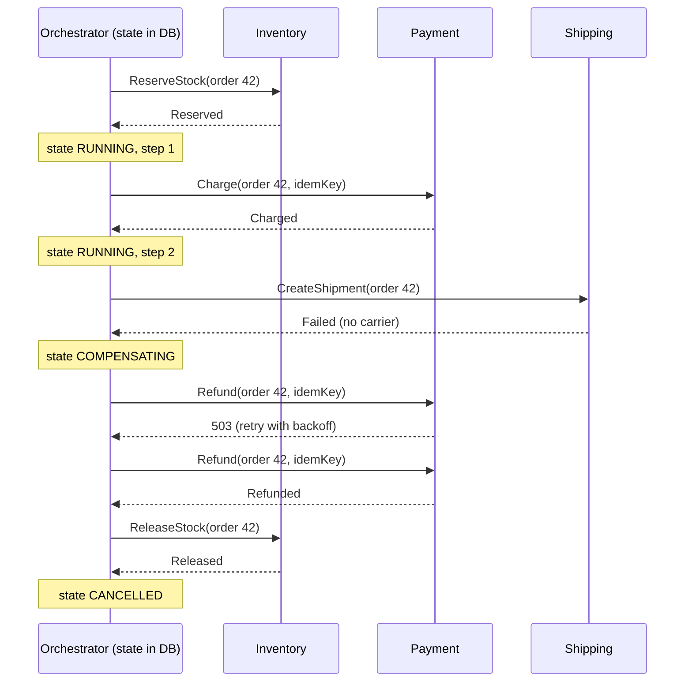

## Bối cảnh & vấn đề

Khi cả hệ thống còn là một monolith trên một Postgres, đặt hàng là một transaction: `BEGIN; INSERT INTO orders ...; UPDATE stock SET qty = qty - 1 ...; INSERT INTO payments ...; COMMIT;`. Hoặc tất cả xảy ra, hoặc không gì xảy ra. Sau khi tách thành ba service (Order, Inventory, Payment), mỗi service có database riêng, và thanh toán đi qua một provider bên ngoài. Không còn `BEGIN` nào bao được cả ba.

Team viết code tuần tự: tạo order, gọi Inventory trừ kho, gọi Payment charge. Một ngày Payment trả lỗi sau khi Inventory đã trừ kho: tồn kho giảm cho một đơn không tồn tại. Một ngày khác, Payment charge thành công nhưng response timeout, Order service đánh dấu đơn thất bại: khách mất tiền mà không có đơn. Mỗi bug được vá bằng một `try/catch` gọi "hoàn tác", cho tới khi chính lệnh hoàn tác cũng thất bại.

Có hai họ giải pháp. **Two-phase commit (2PC)** giữ nguyên ngữ nghĩa atomic xuyên nhiều resource, với cái giá là blocking và coupling. **Saga** bỏ atomic: chia thành chuỗi transaction cục bộ, mỗi bước có hành động **bù** nghiệp vụ, và chấp nhận rằng hệ thống đi qua các trạng thái trung gian nhìn thấy được. Bài này làm rõ cả hai, tái hiện vì sao 2PC "blocking" trên Postgres thật, rồi xây một saga orchestrator có lưu trạng thái và xử lý các lỗi khó: compensation thất bại, orchestrator crash, saga bị kẹt.

## Khái niệm

### Vì sao transaction không trải qua service được

Một transaction trong database dựa vào ba thứ mà database kiểm soát: một **log** chung (WAL) để quyết định commit, **lock** hoặc MVCC để cô lập, và khả năng **rollback** bằng cách bỏ các thay đổi chưa commit. Khi dữ liệu nằm ở ba database của ba service, và một phần là API bên ngoài (provider thanh toán), không có log chung, không có lock chung, và không thể "rollback" một charge đã được thực hiện. Muốn atomic xuyên các bên, cần một **giao thức** giữa chúng.

### Two-phase commit

**2PC** có một **coordinator** và nhiều **participant**:

- **Phase 1 — prepare**: coordinator hỏi từng participant "sẵn sàng commit chưa?". Participant làm toàn bộ việc, **ghi xuống disk đủ để commit sau** (kể cả khi crash), **giữ lock** trên dữ liệu liên quan, rồi trả **yes** hoặc **no**. Một khi đã trả yes, participant **mất quyền tự quyết**: nó không được tự abort, cũng không được tự commit.
- **Phase 2 — commit/abort**: nếu mọi participant trả yes, coordinator ghi quyết định "commit" vào log của nó rồi gửi commit cho tất cả; nếu bất kỳ ai trả no (hoặc không trả lời), gửi abort.

Postgres hỗ trợ phần participant bằng `PREPARE TRANSACTION 'gid'`, sau đó `COMMIT PREPARED 'gid'` hoặc `ROLLBACK PREPARED 'gid'`. Mặc định `max_prepared_transactions = 0` (tắt), và tài liệu khuyến cáo không dùng nếu không có transaction manager thật sự. Chuẩn XA (Java JTA, một số broker) là cùng ý tưởng.

### Vì sao 2PC blocking

Điểm yếu nằm ở khoảng giữa hai phase. Nếu coordinator chết **sau** khi participant đã vote yes và **trước** khi gửi quyết định, participant bị kẹt: nó không biết coordinator đã quyết định commit (có thể participant khác đã commit) hay abort, nên **không được** làm gì. Nó giữ lock cho tới khi coordinator hồi phục và cho biết quyết định. Trong thời gian đó, mọi transaction khác cần các row đó **chờ**. Đó là nghĩa của "blocking protocol". (Three-phase commit cố giải quyết nhưng giả định mạng có giới hạn độ trễ, không phù hợp thực tế; các hệ hiện đại thay vào đó chạy coordinator trên consensus, như Spanner.)

Các chi phí khác: ít nhất hai round-trip và nhiều fsync mỗi transaction; availability của transaction là **tích** availability của mọi participant; coupling chặt (mọi service phải nói cùng giao thức, cùng lúc online); và phần lớn hệ thống hiện đại (Kafka, phần lớn REST API, provider thanh toán) **không hỗ trợ** XA. Vì vậy trong microservices, 2PC hiếm khi là lựa chọn.

**Interview angle:** follow-up "vì sao microservices chuộng saga hơn 2PC?" — blocking khi coordinator chết, availability nhân lên, coupling, và API ngoài không tham gia được 2PC.

### Saga

**Saga** (Garcia-Molina & Salem 1987): một transaction dài được chia thành chuỗi **transaction cục bộ** T1, T2, ..., Tn, mỗi cái commit ngay trong service của nó. Mỗi Ti (trừ các bước cuối) có một **compensating transaction** Ci hoàn tác **về mặt nghiệp vụ**. Nếu Tk thất bại, saga chạy C(k−1), ..., C1 theo thứ tự ngược lại.

Compensation **không phải rollback**: dữ liệu đã commit, người khác có thể đã thấy nó. Bù cho "reserve stock" là "release stock"; bù cho "charge" là "refund" (một giao dịch mới, có phí, hiện trên sao kê của khách); bù cho "gửi email xác nhận" là "gửi email xin lỗi". Saga đảm bảo **ACD** (atomic theo nghĩa "cuối cùng hoặc hoàn tất hoặc được bù", consistent, durable) nhưng **không có I**: thiếu isolation.

### Choreography và orchestration

Có hai cách điều phối các bước:

- **Choreography**: không có điểm trung tâm. Mỗi service nghe event và phát event tiếp theo: Order phát `OrderCreated`, Inventory nghe, reserve rồi phát `StockReserved`, Payment nghe, charge rồi phát `PaymentCompleted`... Lỗi thì phát event lỗi, các service trước nghe và tự bù. Ưu: loose coupling, không thêm thành phần, đơn giản khi 2–3 bước. Nhược: flow **nằm rải rác** trong code của nhiều service, khó trả lời "đơn 42 đang ở bước nào", dễ có vòng event, thêm một bước là sửa nhiều service, timeout ("không ai trả lời trong 10 phút") không có chỗ tự nhiên để đặt.
- **Orchestration**: một **orchestrator** (state machine lưu bền) gửi **command** tới từng service và nhận reply, quyết định bước tiếp theo hoặc bắt đầu bù. Có thể tự viết (bảng `sagas` + worker) hoặc dùng workflow engine (Temporal, AWS Step Functions, Camunda). Ưu: flow tường minh ở một chỗ, timeout/retry/compensation tập trung, dễ quan sát. Nhược: thêm một thành phần phải vận hành, và rủi ro orchestrator "ôm" business logic của các service khác.

Heuristic: ít bước, ít team, flow ổn định → choreography; nhiều bước, long-running (chờ người duyệt, chờ webhook), cần timeout và tầm nhìn rõ ràng → orchestration. Với choreography, vẫn cần một cách **quan sát**: correlation id trên mọi event, một projection/consumer gom event theo `order_id` thành "trạng thái saga", và alert theo tuổi của saga chưa kết thúc.

**Interview angle:** follow-up "quan sát trạng thái một choreographed saga trong production thế nào?" — correlation id + tracing, một read model gom event theo saga, alert cho saga chưa kết thúc sau N phút.

### Thiết kế compensation và pivot transaction

Richardson phân loại các bước của saga thành ba loại, và thứ tự của chúng là quyết định thiết kế quan trọng nhất:

- **Compensatable**: có thể bù (reserve stock → release; tạo order PENDING → đánh dấu CANCELLED).
- **Pivot**: điểm **không quay lại**; nếu nó thành công, saga **phải** chạy tới cuối. Thường là bước tốn kém hoặc không bù được nhất (charge thẻ trong một số thiết kế, hoặc "xác nhận đơn" sau khi charge).
- **Retriable**: các bước sau pivot, không cần bù nhưng **phải** thành công cuối cùng, nên phải idempotent và retry được tới khi xong (gửi email xác nhận, ghi analytics, tạo vận đơn với carrier dự phòng).

Quy tắc: đặt các bước **không bù được** (email đã gửi, hàng đã xuất kho, tiền đã chuyển ra ngoài) **sau** pivot, nơi không bao giờ cần bù; đặt các bước dễ thất bại vì lý do nghiệp vụ (hết hàng, thẻ bị từ chối) **trước**, để thất bại sớm và bù rẻ.

Các yêu cầu cho mọi bước và mọi compensation:

- **Idempotent**: orchestrator có thể gửi lại command sau khi crash; bước thực hiện hai lần phải như một lần ([bài Idempotency](/tracks/distributed-systems/learn/idempotency-delivery)). Refund dùng idempotency key theo `order_id`.
- **Retry được**: compensation có thể lỗi tạm thời (provider 503); retry với backoff, kéo dài hơn nhiều so với retry của request đồng bộ.
- **Commutative khi có thể**: compensation tới trước bước gốc (do message đảo thứ tự) phải không gây hại, ví dụ "release reservation không tồn tại" trả OK và ghi tombstone để bước reserve tới muộn bị từ chối.
- **Trạng thái saga lưu bền ở mỗi bước**, trong cùng transaction với việc ghi command ra ngoài (outbox), để crash ở bất kỳ đâu cũng resume được.

### Thiếu isolation và semantic lock

Vì mỗi bước commit ngay, các transaction khác **thấy** trạng thái trung gian: tồn kho đã giảm cho một đơn sắp bị huỷ; một report đếm đơn "đã đặt" nhưng chưa thanh toán. Các anomaly tương tự isolation level thấp: dirty read (thấy dữ liệu sẽ bị bù), lost update (hai saga sửa cùng thứ). Biện pháp phổ biến:

- **Semantic lock**: đánh dấu bản ghi bằng trạng thái trung gian (`order.status = 'PENDING'`, `reservation` có hạn), và các thao tác khác tôn trọng nó (không ship đơn PENDING, hiển thị "đang xử lý").
- **Commutative update**: thiết kế thao tác sao cho thứ tự không quan trọng (`qty = qty - 1` thay vì đặt giá trị tuyệt đối).
- **Reread value / version**: trước khi cập nhật, kiểm tra version không đổi (optimistic).
- Đặt bước dễ hỏng trước, để cửa sổ trạng thái trung gian ngắn.

### Compensation thất bại

Compensation cũng là một network call và có thể thất bại. Chiến lược:

1. **Retry kéo dài**: lỗi tạm thời (503, timeout) thì retry với backoff trong nhiều phút tới nhiều giờ; saga ở trạng thái `COMPENSATING`, không bao giờ "biến mất".
2. **Phân biệt lỗi vĩnh viễn**: provider từ chối refund (charge đã bị dispute, thẻ đã đóng) thì retry vô ích. Chuyển saga sang `NEEDS_MANUAL`: tạo ticket, đưa vào DLQ/dashboard, **thông báo khách**, và để con người (finance/support) xử lý.
3. **Reconciliation**: job đối chiếu định kỳ giữa trạng thái của ta và của provider (charge còn mà order đã huỷ) để bắt các trường hợp lọt.
4. **Alert theo tuổi saga**: mọi saga chưa ở trạng thái kết thúc (`COMPLETED`, `CANCELLED`) sau N phút là một tín hiệu; query đơn giản trên `updated_at`.

**Interview angle:** câu "bước refund của saga liên tục thất bại, làm gì?" — idempotent + retry có backoff dài, phân biệt lỗi vĩnh viễn, chuyển sang xử lý thủ công có ticket và thông báo, reconciliation, alert saga kẹt; nguyên tắc: saga không bao giờ biến mất ở trạng thái trung gian.

### Outbox: gửi command/event một cách đáng tin

Orchestrator (hoặc service trong choreography) phải làm hai việc: cập nhật trạng thái trong DB của nó và gửi message ra broker. Nếu làm tuần tự, crash giữa hai việc sẽ làm mất message (đã cập nhật DB, chưa gửi) hoặc gửi message cho trạng thái chưa commit. **Transactional outbox**: ghi message vào bảng `outbox` **trong cùng transaction** với thay đổi trạng thái; một relay (polling hoặc CDC như Debezium) đọc `outbox` và publish, at-least-once. Consumer dedupe theo message id. Đây là cách kết hợp "một transaction cục bộ" với "một message đáng tin" mà không cần 2PC giữa DB và broker.

## Cơ chế hoạt động

2PC và điểm blocking:



Từ lúc participant vote YES tới lúc nhận quyết định, nó ở trạng thái **in-doubt**. Không có thông tin cục bộ nào cho phép nó tự kết luận, vì quyết định nằm ở coordinator. Lock được giữ suốt khoảng đó, bất kể nó dài bao lâu.

Saga orchestration với compensation khi bước cuối thất bại:



Mỗi mũi tên từ orchestrator đi kèm một lần ghi trạng thái trước đó: nếu orchestrator crash ở bất kỳ điểm nào, khi khởi động lại nó đọc `state` và `step` và tiếp tục, gửi lại command cuối cùng (vì vậy các bước phải idempotent). Compensation chạy theo thứ tự ngược, và lỗi tạm thời của refund chỉ làm saga ở lại `COMPENSATING` lâu hơn.

## Ví dụ thực tế

### 2PC blocking trên hai PostgreSQL 17

Hai container PostgreSQL 17.11 (`max_prepared_transactions = 10`), một làm Orders DB, một làm Inventory DB; một script Node đóng vai coordinator.

```ts
await orders.query("BEGIN");
await orders.query("INSERT INTO orders VALUES (42, 'placed')");
await orders.query("PREPARE TRANSACTION 'order-42'");
await inventory.query("BEGIN");
await inventory.query("UPDATE stock SET qty = qty - 1 WHERE sku = 'sku-1'");
await inventory.query("PREPARE TRANSACTION 'order-42'");
await orders.end(); await inventory.end();               // coordinator crashes here

// another checkout, on the inventory DB
await other.query("SET lock_timeout = '2s'");
await other.query("UPDATE stock SET qty = qty - 1 WHERE sku = 'sku-1'");
```

```text
== phase 1 (prepare) on both participants
both voted YES. coordinator crashes before sending COMMIT PREPARED.
inventory pg_prepared_xacts: ["order-42"] (survives the session)
another checkout touching sku-1: canceling statement due to lock timeout after 2002ms
reading is fine (MVCC): qty = 5

== recovery: coordinator restarts, reads its decision log ('order-42' -> commit)
orders: [{"id":42,"status":"placed"}] | stock qty: 4 | prepared left: 0
```

Session của coordinator đã đóng nhưng transaction prepared **vẫn còn** trong `pg_prepared_xacts` và **vẫn giữ row lock** trên `sku-1`: checkout khác muốn trừ cùng SKU bị chặn tới `lock_timeout`. Đọc vẫn được (MVCC thấy `qty = 5`, giá trị trước transaction in-doubt). Khi "coordinator" quay lại và gửi `COMMIT PREPARED` cho cả hai, đơn và tồn kho được áp dụng cùng nhau. Transaction prepared còn sống qua cả **restart database**:

```text
$ psql -c "BEGIN; UPDATE stock SET qty=qty-1; PREPARE TRANSACTION 'order-43';"
$ docker restart ds18-pgB
$ psql -tAc "select gid, prepared from pg_prepared_xacts"
order-43|2026-10-01 03:12:13.120447+00
```

Một prepared transaction bị bỏ quên cũng giữ lock **và** ngăn VACUUM dọn dẹp các row version cũ (nó giữ xmin cũ), nên phải có giám sát `pg_prepared_xacts`.

### Saga orchestrator lưu trạng thái trong Postgres

Orchestrator Node 24 với bảng `sagas(order_id, state, step, updated_at)` và `saga_log`. Ba bước: `ReserveStock` (bù: `ReleaseStock`), `Charge` (bù: `Refund`, idempotent theo order), `CreateShipment` (bước cuối). Năm kịch bản: thành công; shipping thất bại; refund lỗi tạm thời hai lần; refund bị từ chối vĩnh viễn; orchestrator crash sau khi charge rồi khởi động lại.

```ts
async function runSaga(orderId: string) {
  await db.query("INSERT INTO sagas(order_id, state) VALUES ($1, 'RUNNING') ON CONFLICT DO NOTHING", [orderId]);
  const sg = (await db.query("SELECT * FROM sagas WHERE order_id=$1", [orderId])).rows[0];
  if (sg.state === "COMPENSATING") return compensate(orderId, sg.step);
  for (let i = sg.step; i < steps.length; i++) {                       // resume from the persisted step
    try { await steps[i].run(orderId); await save(orderId, "RUNNING", i + 1); }
    catch (e) { return compensate(orderId, i); }
  }
  await save(orderId, "COMPLETED", steps.length);
}
async function compensate(orderId: string, fromStep: number) {
  await save(orderId, "COMPENSATING", fromStep);
  for (let i = fromStep - 1; i >= 0; i--) {
    for (let attempt = 1; ; attempt++) {
      try { await steps[i].undo?.(orderId); break; }
      catch (e) {
        if (e.permanent || attempt >= 5) return save(orderId, "NEEDS_MANUAL", i); // + ticket, alert, notify customer
        await sleep(Math.random() * 20 * 2 ** attempt);                // backoff with jitter (scaled down)
      }
    }
    await save(orderId, "COMPENSATING", i);
  }
  await save(orderId, "CANCELLED", 0);
}
```

```text
o-1: ReserveStock ok | Charge ok | CreateShipment ok  => COMPLETED  (reserved=true, charged=true)
o-2: ReserveStock ok | Charge ok | CreateShipment failed: no carrier available | undo Charge ok (attempt 1) | undo ReserveStock ok (attempt 1)  => CANCELLED  (reserved=false, charged=false)
o-3: ReserveStock ok | Charge ok | CreateShipment failed: no carrier available | undo Charge failed: provider 503 | undo Charge failed: provider 503 | undo Charge ok (attempt 3) | undo ReserveStock ok (attempt 1)  => CANCELLED  (reserved=false, charged=false)
o-4: ReserveStock ok | Charge ok | CreateShipment failed: no carrier available | undo Charge failed: provider: charge already disputed, refund rejected | -> ticket + alert, customer notified  => NEEDS_MANUAL  (reserved=true, charged=true)
o-5: ReserveStock ok | Charge ok | orchestrator CRASH  => RUNNING  (reserved=true, charged=true)
o-5: ReserveStock ok | Charge ok | orchestrator CRASH | CreateShipment ok  => COMPLETED  (reserved=true, charged=true)
stuck-saga alert query -> [{"order_id":"o-4","state":"NEEDS_MANUAL","minutes":"20"}]
```

o-2: compensation theo thứ tự ngược, đơn kết thúc `CANCELLED` với cả tồn kho và tiền được trả lại. o-3: refund lỗi 503 hai lần, retry có backoff, thành công ở lần ba. o-4: refund bị từ chối vĩnh viễn, saga **không** biến mất mà dừng ở `NEEDS_MANUAL` (và vì vậy tồn kho chưa được trả; một thiết kế tốt hơn tiếp tục bù các bước **độc lập** với bước lỗi, ở đây `ReleaseStock`, rồi mới chuyển trạng thái thủ công). o-5: orchestrator crash sau `Charge`, lần chạy sau đọc `step = 2` và tiếp tục từ `CreateShipment`, không charge lại. Cuối cùng, query cảnh báo theo tuổi saga tìm ra o-4:

```sql
SELECT order_id, state, round(extract(epoch FROM now() - updated_at) / 60) AS minutes
FROM sagas
WHERE state NOT IN ('COMPLETED', 'CANCELLED') AND updated_at < now() - interval '15 minutes';
```

## Trade-offs & lựa chọn thay thế

| Cách | Atomic? | Isolation | Khi coordinator/điều phối chết | Coupling | Hợp khi |
| --- | --- | --- | --- | --- | --- |
| Một transaction DB | Có | Theo isolation level | Không áp dụng | Một DB | Dữ liệu còn trong một database |
| 2PC / XA | Có | Có (giữ lock tới phase 2) | Participant in-doubt giữ lock tới khi hồi phục | Chặt, cần XA | Vài resource cùng hỗ trợ XA, trong một hệ có kiểm soát |
| Saga choreography | Cuối cùng (bù) | Không | Event nằm trong broker, service tự tiếp tục | Lỏng | 2–3 bước, ít team |
| Saga orchestration | Cuối cùng (bù) | Không (semantic lock) | Resume từ state đã lưu | Trung bình | Nhiều bước, long-running, cần timeout và tầm nhìn |
| Workflow engine (Temporal, Step Functions) | Cuối cùng (bù) | Không | Engine lưu lịch sử và replay | Phụ thuộc engine | Flow phức tạp, nhiều team, cần retry/timer bền |
| Tránh phân tán (gộp dữ liệu) | Có | Có | | | Ranh giới service sai: dữ liệu luôn đổi cùng nhau |

Chọn thế nào: câu hỏi đầu tiên là "có thật sự cần transaction xuyên service không?". Nếu hai bảng luôn phải đổi cùng nhau, có thể ranh giới service đã sai, và đưa chúng về một service (một database) đơn giản hơn mọi giao thức. Nếu cần phân tán, chọn saga; orchestration khi flow có nhiều bước, chờ đợi dài, hoặc cần trả lời "đơn đang ở đâu" nhanh; choreography khi chỉ vài bước và các team muốn độc lập. 2PC chỉ hợp lý trong một hệ có kiểm soát mà mọi resource hỗ trợ (và tốt nhất là coordinator chạy trên consensus).

## Edge cases & failure modes

- **Prepared transaction mồ côi**: coordinator mất decision log, transaction in-doubt giữ lock và chặn VACUUM mãi; cần giám sát `pg_prepared_xacts` theo tuổi và runbook xử lý thủ công.
- **Compensation tới trước bước gốc** (message đảo thứ tự): release tới trước reserve; nếu release trả "không tìm thấy" rồi reserve tới sau, tồn kho bị giữ mãi. Lưu tombstone "đã huỷ" để reserve muộn bị từ chối.
- **Orchestrator crash giữa "gửi command" và "lưu trạng thái"**: command gửi hai lần sau khi resume; các bước phải idempotent (đo: o-5 không charge lại vì state đã lưu sau Charge; nếu crash trước khi lưu, Charge chạy lại và idempotency key của provider cứu).
- **Timeout của một bước**: participant không trả lời; orchestrator không biết bước đã chạy chưa, giống timeout thông thường. Coi là `UNKNOWN`, hỏi lại trạng thái hoặc gửi lại command idempotent, không giả định thất bại rồi bù ngay.
- **Bước không bù được đặt quá sớm**: email "đặt hàng thành công" gửi trước khi charge; charge thất bại thì phải gửi email đính chính. Đặt sau pivot.
- **Hai saga tranh một tài nguyên**: không có isolation; dùng semantic lock (reservation có hạn) và update giao hoán.
- **Saga "biến mất"**: worker chết, message vào DLQ không ai xem; không có alert theo tuổi saga thì không ai biết đơn bị kẹt.
- **Vòng event trong choreography**: service A phản ứng với event của B bằng một event mà B lại phản ứng; cần định nghĩa rõ event nào kết thúc flow.

## Pitfalls

- ❌ Gọi tuần tự nhiều service rồi `try/catch` "rollback" → ✅ saga với trạng thái lưu bền và compensation idempotent.
- ❌ Dùng 2PC qua HTTP giữa microservices → ✅ saga; 2PC blocking, nhân availability và không có API ngoài nào tham gia được.
- ❌ Coi compensation là rollback → ✅ nó là một giao dịch nghiệp vụ mới (refund có phí, email đính chính), có thể thất bại.
- ❌ Compensation không idempotent → ✅ idempotency key theo saga/bước; orchestrator sẽ gửi lại.
- ❌ Để saga im lặng khi compensation thất bại vĩnh viễn → ✅ `NEEDS_MANUAL` + ticket + thông báo khách + reconciliation.
- ❌ Đặt bước không bù được ở đầu saga → ✅ bước dễ hỏng và bù được trước, pivot ở giữa, bước retriable sau.
- ❌ Cập nhật DB rồi publish event riêng lẻ → ✅ outbox trong cùng transaction.
- ❌ Choreography không có tầm nhìn → ✅ correlation id, read model trạng thái saga, alert saga chưa kết thúc.

## Tóm tắt

- Transaction không trải qua service được vì không có log, lock và rollback chung; cần 2PC hoặc saga.
- 2PC: prepare (durable + giữ lock + vote) rồi commit/abort; participant đã vote yes không được tự quyết, nên coordinator chết = blocking (đo: row lock giữ qua cả session đóng và restart DB, checkout khác hết `lock_timeout`).
- Saga: chuỗi transaction cục bộ + compensation nghiệp vụ theo thứ tự ngược; có ACD, không có I.
- Choreography (event, lỏng, khó quan sát) vs orchestration (state machine lưu bền, tường minh, thêm thành phần); chọn theo số bước, độ dài và nhu cầu quan sát.
- Thứ tự bước: compensatable → pivot → retriable; bước không bù được đặt sau pivot.
- Mọi bước và compensation idempotent, retry được, trạng thái saga lưu ở mỗi bước (đo: crash sau Charge resume mà không charge lại).
- Compensation thất bại: retry dài cho lỗi tạm thời, `NEEDS_MANUAL` cho lỗi vĩnh viễn, reconciliation, alert theo tuổi saga.
- Outbox gắn việc gửi command/event vào cùng transaction với thay đổi trạng thái.
