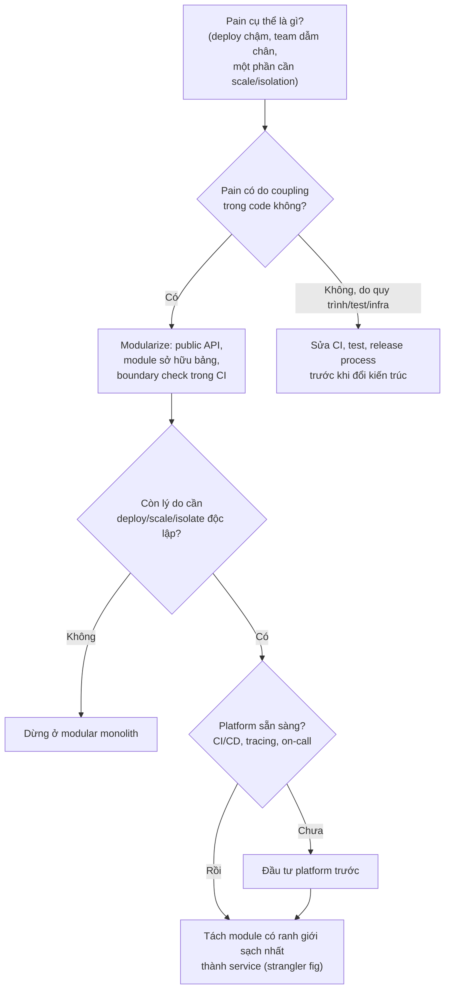
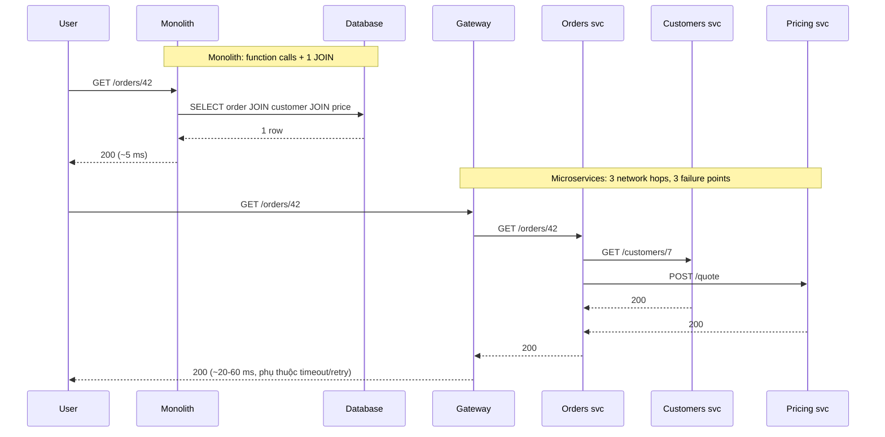

## Bối cảnh & vấn đề

Một công ty có hệ thống back-office viết từ mười năm trước: một repo, một process, một database SQL. Ba năm đầu mọi thứ ổn. Rồi team tăng từ 6 lên 30 người, build mất 25 phút, mỗi lần release phải "đóng băng" cả tuần vì ai cũng sợ thay đổi của người khác làm vỡ phần của mình. Module báo cáo chạy một query nặng làm chậm luôn màn hình nhập đơn. Ban lãnh đạo nghe nói "Netflix dùng microservices" và đề nghị chia hệ thống thành 40 service.

Sáu tháng sau, họ có 12 service nhưng release còn chậm hơn: một feature phải sửa 4 service, deploy theo thứ tự, và khi có lỗi không ai biết request chết ở đâu. Đây là kết cục phổ biến khi chọn kiến trúc theo trào lưu thay vì theo **bài toán cụ thể**. Monolith, modular monolith và microservices là ba câu trả lời cho ba vấn đề khác nhau, và mỗi câu trả lời có cái giá riêng.

Bài này đặt nền cho cả track: mỗi kiểu kiến trúc là gì, vì sao một **network boundary** đắt hơn nhiều so với một function call, và tiêu chí để quyết định đặt một capability mới ở đâu. Các bài sau đi sâu vào ranh giới ([bài 2](/tracks/microservices/learn/bounded-contexts)), dữ liệu ([bài 3](/tracks/microservices/learn/database-per-service)) và migration ([bài 4](/tracks/microservices/learn/strangler-fig-acl)).

## Khái niệm

### Monolith

**Monolith** là hệ thống được build và deploy như **một đơn vị**: một codebase (hoặc vài repo nhưng build chung), một artifact, thường một database. Mọi module gọi nhau bằng function call trong cùng process, và một transaction database có thể bao trọn cả nghiệp vụ (tạo đơn, trừ kho, ghi hoá đơn) với ACID đầy đủ.

Monolith không phải là "kiến trúc xấu". Nó là lựa chọn đúng cho phần lớn sản phẩm ở giai đoạn đầu: dev local chỉ cần chạy một process, debug bằng một stack trace, refactor ranh giới chỉ là di chuyển file. Vấn đề xuất hiện khi nó lớn lên mà **không có ranh giới nội bộ**: module nào cũng đọc bảng của module khác, một thay đổi lan khắp nơi ("big ball of mud"), và mọi team phải release cùng nhịp.

**Interview angle:** đừng định nghĩa monolith bằng giọng chê bai. Interviewer muốn nghe bạn nói được điểm mạnh của nó (ACID, đơn giản vận hành, latency thấp) trước khi nói điểm yếu.

### Modular monolith

**Modular monolith** vẫn là một đơn vị deploy, nhưng code được chia thành **module có ranh giới cứng**: mỗi module có public API (một file `index.ts` hay một interface), module khác chỉ được gọi qua API đó, và mỗi module **sở hữu bảng của mình** (module khác không `SELECT` trực tiếp vào). Ranh giới được **kiểm tra tự động** trong CI, không chỉ bằng quy ước.

Nó giải quyết bài toán **coupling trong code** mà không trả giá phân tán: vẫn một process, vẫn có thể dùng một transaction xuyên module khi thật cần, vẫn deploy một lần. Shopify là ví dụ được nhắc nhiều: họ chọn modular monolith (dự án "componentization" của codebase Rails) thay vì tách hàng trăm service (verify con số team hiện tại). Một module có ranh giới sạch cũng là ứng viên tách service rẻ nhất về sau, vì phần khó nhất (gỡ coupling dữ liệu) đã xong.

```ts
// modules/catalog/index.ts: the only file other modules may import
export { getPrice } from "./internal/pricing";
export type { PriceQuote } from "./internal/types";
// modules/orders/... may import "../catalog" but never "../catalog/internal/..."
```

**Interview angle:** câu "modular monolith khác monolith thường ở đâu?" chỉ có câu trả lời tốt khi bạn nói **ranh giới được enforce bằng tool** (lint rule, build check, quyền DB theo schema), không phải "chia folder".

### Microservices

**Microservices** là cách tổ chức hệ thống thành các service **deploy độc lập**, mỗi service gắn với một **business capability**, **sở hữu dữ liệu của mình**, và giao tiếp qua mạng (HTTP/gRPC hoặc message). Định nghĩa của Lewis & Fowler nhấn mạnh: componentization via services, organized around business capabilities, decentralized data management, infrastructure automation, design for failure.

Lợi ích cốt lõi không phải là "code nhỏ" mà là **tự chủ**: team A sửa và deploy service của mình mà không chờ team B; service tìm kiếm scale lên 30 pod trong khi service hoá đơn chạy 2 pod; lỗi memory leak ở service báo cáo không làm sập checkout (nếu có timeout và bulkhead). Cái giá: mọi function call thành network call, transaction xuyên service thành saga, debug cần distributed tracing, và chi phí vận hành nhân theo số service.

**Interview angle:** câu hỏi "microservices giải quyết vấn đề gì?" chờ đợi từ khoá **independent deployability** và **team autonomy**. Ai trả lời "để scale" sẽ bị hỏi tiếp "monolith cũng scale ngang được, vậy khác gì?".

### Network boundary: cái giá phải trả

Khi một function call trở thành network call, ba thứ thay đổi về bản chất. Thứ nhất, **latency**: function call tốn nano giây, một HTTP call trong cùng datacenter tốn từ dưới 1 ms tới vài chục ms tuỳ payload và serialization. Thứ hai, **availability nhân dồn**: nếu một request phải đi qua N service nối tiếp, mỗi cái sẵn sàng 99.9%, thì availability của chuỗi xấp xỉ 0.999^N. Thứ ba, **partial failure**: call có thể timeout mà bạn không biết bên kia đã xử lý hay chưa, nên mọi thao tác ghi cần idempotency.

Mất **ACID xuyên ranh giới** là cái giá lớn nhất về nghiệp vụ. Trong monolith, "tạo đơn + trừ kho" là một transaction; nếu tách thành Orders service và Inventory service, bạn cần saga với compensating action, outbox để publish event, và UI phải chịu eventual consistency. Chi tiết ở track [Distributed Systems](/tracks/distributed-systems).

**Interview angle:** tính nhanh 0.999^4 ≈ 99.6% (khoảng 2.9 giờ downtime mỗi tháng thay vì 43 phút) là cách thuyết phục nhất để giải thích vì sao chuỗi sync dài nguy hiểm.

### Microservice premium

Fowler gọi chi phí cố định để chạy microservices là **microservice premium**: CI/CD cho từng service, observability (log tập trung, metrics, tracing), service discovery, gateway, quản lý config/secret, on-call cho từng service. Premium này trả ngay từ service đầu tiên, còn lợi ích chỉ đến khi hệ thống và tổ chức đủ lớn. Đó là lý do lời khuyên **MonolithFirst**: bắt đầu bằng monolith (tốt nhất là modular), tách khi đã hiểu domain và có lý do đo được.

| Khía cạnh | Monolith | Modular monolith | Microservices |
| --- | --- | --- | --- |
| Đơn vị deploy | 1 | 1 | Nhiều, độc lập |
| Transaction | ACID dễ | ACID dễ | Saga, eventual consistency |
| Ranh giới module | Thường mờ | Cứng, enforce bằng tool | Cứng (network + data) |
| Vận hành | Đơn giản | Đơn giản | Nặng |
| Refactor ranh giới | Rẻ | Rẻ vừa | Đắt (API + data migration) |

## Cơ chế hoạt động

Quyết định kiến trúc nên đi theo câu hỏi, không theo thời trang. Sơ đồ dưới là cách nghĩ khi đứng trước một hệ thống đang đau (hoặc một sản phẩm mới):



Điểm quan trọng của sơ đồ là **modularize luôn đi trước tách service**. Nếu module chưa có ranh giới sạch trong cùng process, tách nó ra qua mạng chỉ biến coupling trong code thành coupling qua network, tức là distributed monolith ([bài 11](/tracks/microservices/learn/distributed-monolith-platform)). Ngược lại, nếu đã có ranh giới sạch, nhiều team phát hiện họ **không cần** tách nữa: build nhanh hơn nhờ module, test độc lập theo module, và vẫn giữ ACID.

Nhánh "pain không do coupling" cũng hay bị bỏ qua. Deploy chậm vì test suite chạy 40 phút trên một máy, hay vì quy trình phê duyệt thủ công, thì tách service không chữa được; nó chỉ nhân bản quy trình chậm đó ra 10 lần.

Khi đã quyết tách, ranh giới mạng đổi cách một request chạy. Cùng một thao tác "xem đơn hàng" trong hai kiến trúc:



Ở bản monolith, có một điểm lỗi chính (DB) và một round-trip. Ở bản microservices, request đi qua bốn process; mỗi hop cần timeout, mỗi call cần xử lý lỗi, và nếu Customers chậm thì Orders phải quyết định trả lỗi hay trả bản rút gọn ([bài 8](/tracks/microservices/learn/sync-async-resilience)).

## Ví dụ thực tế

### Enforce ranh giới trong modular monolith

Ranh giới chỉ có thật khi CI chặn được vi phạm. Một script nhỏ quét import giữa các module và chỉ cho phép đi qua `index.ts` (trong dự án thật, dùng ESLint `no-restricted-imports`, dependency-cruiser hoặc Nx module boundaries). Cấu trúc thử nghiệm: `orders/internal/place.ts` import cả API công khai của `catalog` lẫn một file nội bộ.

```ts
// orders/internal/place.ts
import { getPrice } from "../../catalog/index.ts";               // OK: public API
import { priceTable } from "../../catalog/internal/pricing.ts";   // violation: reaches into internals

// check-boundaries.ts (rút gọn)
for (const file of files(root)) {
  const from = relative(root, file).split("/")[0];
  for (const [, spec] of readFileSync(file, "utf8").matchAll(/from\s+"([^"]+)"/g)) {
    if (!spec.startsWith(".")) continue;
    const target = relative(root, resolve(dirname(file), spec)).split("/");
    if (target[0] !== from && target[1] !== "index.ts") {
      violations++;
      console.log(`✖ ${relative(root, file)} imports ${target.join("/")} (only ${target[0]}/index.ts is public)`);
    }
  }
}
```

Chạy thật trên Node 24.21:

```text
✖ orders/internal/place.ts imports catalog/internal/pricing.ts (only catalog/index.ts is public)
1 boundary violation(s)
```

Script trả exit code 1, nên PR bị chặn. Ranh giới dữ liệu cần cơ chế tương tự: mỗi module một schema Postgres với role riêng, để `orders` không thể `SELECT` bảng của `catalog` ngay cả khi ai đó muốn đi tắt ([bài 3](/tracks/microservices/learn/database-per-service) chạy ví dụ này).

### Availability của chuỗi sync call

Tính availability lý thuyết khi mỗi hop độc lập (bỏ qua retry và fallback):

```ts
for (const [n, a] of [[3, 0.999], [4, 0.999], [5, 0.99], [10, 0.999]])
  console.log(n, "hops @", a, "=>", (a ** n * 100).toFixed(2) + "%");
```

```text
3 hops @ 0.999 => 99.70%
4 hops @ 0.999 => 99.60%
5 hops @ 0.99 => 95.10%
10 hops @ 0.999 => 99.00%
```

Gateway → A → B → C với mỗi thành phần 99.9% cho khoảng 99.6%: trong một tháng 30 ngày, đó là khoảng 2.9 giờ không phục vụ được thay vì 43 phút của một thành phần đơn lẻ. Năm service 99% nối tiếp chỉ còn 95.1%, tức là cứ 20 request có một request lỗi. Con số thực tế thường tốt hơn nhờ retry và fallback, nhưng cũng có thể tệ hơn vì lỗi không độc lập (cùng một DB, cùng một node).

### Quyết định đặt capability mới ở đâu

Tình huống: team cần thêm "xuất hoá đơn điện tử" gửi lên cổng thuế. Áp các tiêu chí:

| Tiêu chí | Hoá đơn điện tử | Gợi ý |
| --- | --- | --- |
| Bounded context rõ, ít đọc bảng monolith? | Đọc order đã chốt, ghi trạng thái gửi thuế | Rõ, input là snapshot đơn |
| Team riêng sở hữu? | Có team tích hợp thuế | Có |
| Nhu cầu scale/release khác? | Release theo thay đổi quy định thuế, độc lập với feature bán hàng | Khác |
| Isolation (lỗi, compliance)? | Cổng thuế chậm/hay lỗi; không được làm chậm checkout | Cần |
| Cần transaction chung với nhiều bảng monolith? | Không, chỉ cần event "OrderFinalized" | Không |
| Có hạ tầng deploy/observe sẵn? | Có pipeline chuẩn | Có |

Kết luận: ứng viên tốt cho một service mới, nhận event `OrderFinalized` (qua outbox) và tự quản lý retry tới cổng thuế. Ngược lại, "thêm mã giảm giá áp lên giỏ hàng" cần đọc giỏ, giá, tồn kho, khách hàng trong cùng một transaction và đổi cùng nhịp với checkout: đặt nó thành **module mới trong monolith** rẻ hơn nhiều.

## Trade-offs & lựa chọn thay thế

|  | Monolith | Modular monolith | Microservices |
| --- | --- | --- | --- |
| Giải quyết | Ra sản phẩm nhanh, ít người | Coupling trong code khi codebase/team lớn dần | Tự chủ team, deploy/scale/isolate độc lập |
| Không giải quyết | Coupling khi lớn | Deploy độc lập, scale từng phần, stack riêng | Domain chưa rõ, quy trình release kém |
| Chi phí vận hành | Thấp | Thấp | Cao, nhân theo số service |
| Latency nội bộ | ns (function call) | ns | ms mỗi hop |
| Nhất quán dữ liệu | ACID | ACID (nếu cùng DB) | Eventual, saga |
| Rủi ro chính | Big ball of mud | Ranh giới bị vi phạm dần nếu không enforce | Distributed monolith, chi phí phân tán |
| Hợp khi | Sản phẩm mới, 1–2 team | Nhiều team, domain đã rõ một phần | Nhiều team độc lập, nhu cầu scale/isolation khác biệt rõ |

Chọn thế nào. **Sản phẩm mới, domain chưa rõ, một hai team**: monolith với cấu trúc module từ đầu; ranh giới vẽ sai trong monolith sửa trong một buổi chiều, vẽ sai giữa các service tốn hàng quý. **Codebase lớn, nhiều team dẫm chân nhưng không có nhu cầu scale riêng**: modular monolith, enforce ranh giới, tách test và ownership theo module. **Một phần có lý do rõ ràng để độc lập** (scale khác hẳn, compliance như PCI, release cadence khác, lỗi phải cô lập): tách đúng phần đó thành service, giữ phần còn lại là modular monolith. Kiến trúc lai này là trạng thái ổn định của rất nhiều công ty, không phải "giai đoạn chuyển tiếp chưa xong".

Khi nào **không nên** dùng microservices: sản phẩm mới chưa tìm được product-market fit; team dưới khoảng hai, ba nhóm; chưa có CI/CD tự động, tracing, on-call; nghiệp vụ cần nhiều transaction ACID xuyên các phần; yêu cầu latency cực thấp giữa các thành phần. Với một startup ba người mà CTO muốn microservices, câu trả lời tốt là hỏi "pain cụ thể là gì?", tính premium (pipeline, dashboard, on-call cho mỗi service) và đề xuất modular monolith với ranh giới có thể tách sau.

## Edge cases & failure modes

- **Monolith dùng chung một connection pool**: một module báo cáo chạy query 30 giây chiếm hết pool, checkout cũng chết. Đây là lý do thường được dùng để đòi tách service, nhưng sửa rẻ hơn là tách pool/replica đọc cho báo cáo hoặc giới hạn concurrency theo module.
- **Modular monolith bị "thủng" dần**: không có CI check, sau vài tháng có hàng trăm import xuyên `internal/`. Ranh giới chỉ là quy ước thì sẽ mục.
- **Tách service nhưng vẫn chung DB**: deploy độc lập về lý thuyết, nhưng một migration đổi cột vẫn phá service khác. Không có lợi ích, có đủ chi phí.
- **Lỗi không độc lập**: phép tính 0.999^N giả định lỗi độc lập; thực tế nhiều service cùng phụ thuộc một Redis hay một node, nên khi nó chết, tất cả chết cùng lúc.
- **Partial failure**: Orders gọi Payments, timeout sau 2 giây. Payments có thể đã charge thẻ. Không có idempotency key, retry sẽ charge hai lần.
- **Microservices cho một sản phẩm chưa ổn định domain**: mỗi lần đổi mô hình nghiệp vụ phải đổi API giữa 3 service, deploy phối hợp, và migration dữ liệu.

## Pitfalls

- ❌ "Microservices để scale" → ✅ monolith cũng scale ngang được; lý do chính là **deploy và sở hữu độc lập**, scale riêng chỉ là một trong các lý do.
- ❌ Coi modular monolith là "chia folder" → ✅ ranh giới phải được kiểm tra tự động (lint/build check, quyền DB theo schema).
- ❌ Tách service trước khi modularize → ✅ gỡ coupling trong cùng process trước; nếu không, bạn chỉ chuyển coupling lên mạng.
- ❌ Chọn kiến trúc theo công ty lớn (Netflix, Amazon) → ✅ chọn theo pain đo được của mình và năng lực vận hành hiện có.
- ❌ Bỏ qua microservice premium khi ước lượng → ✅ tính chi phí pipeline, observability, on-call cho mỗi service mới.
- ❌ Coi modular monolith là trạng thái tạm → ✅ nó có thể là đích đến; tách thêm chỉ khi có lý do mới.
- ❌ Đặt capability cần transaction với nhiều bảng monolith vào service mới → ✅ để nó là module trong monolith, tách khi phụ thuộc dữ liệu đã giảm.

## Tóm tắt

- Monolith: một deploy, ACID dễ, vận hành đơn giản; đau khi lớn mà không có ranh giới nội bộ.
- Modular monolith: một deploy nhưng module có public API và sở hữu bảng riêng, ranh giới được enforce bằng tool; giải quyết coupling trong code mà không trả giá phân tán.
- Microservices: deploy, scale, sở hữu dữ liệu độc lập theo business capability; đổi lại network call, saga, tracing và microservice premium.
- Network boundary làm availability nhân dồn (0.999^4 ≈ 99.6%), latency cộng dồn và sinh partial failure.
- Luôn modularize trước khi tách; nhiều hệ thống dừng ở modular monolith là đúng.
- Không dùng microservices khi domain chưa rõ, team nhỏ, chưa có CI/CD và observability, hoặc nghiệp vụ cần nhiều ACID xuyên phần.
- Capability mới thành service khi có bounded context rõ, owner riêng, nhu cầu độc lập, và không cần transaction với nhiều bảng của monolith.
