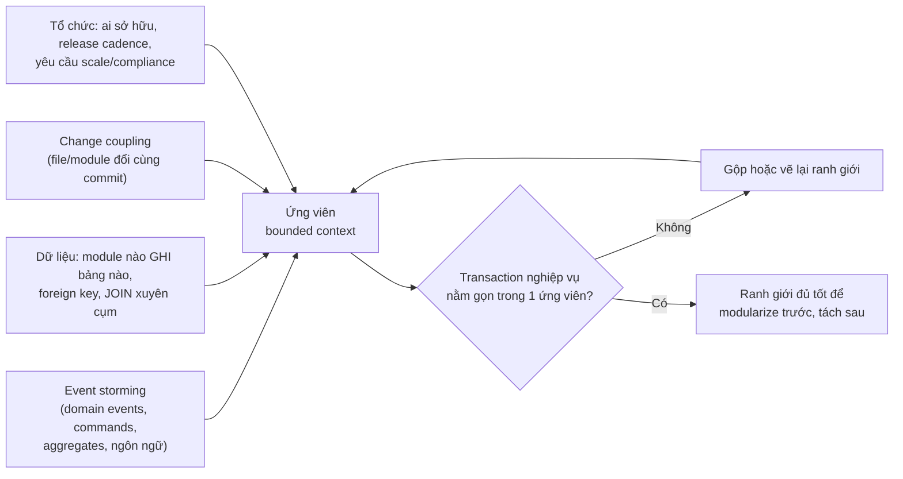

## Bối cảnh & vấn đề

Một team quyết định tách monolith bán hàng thành service theo **entity**: `CustomerService`, `ProductService`, `OrderService`, `InvoiceService`. Nghe rất gọn. Nhưng ngay feature đầu tiên, "khách hàng doanh nghiệp được trả chậm 30 ngày", phải sửa cả bốn service: Customer thêm hạn mức tín dụng, Order kiểm tra hạn mức, Invoice đổi ngày đến hạn, Product thêm cờ "chỉ bán cho doanh nghiệp". Bốn PR, bốn lần review, và một thứ tự deploy bắt buộc.

Vấn đề không nằm ở code mà ở **ranh giới**. Chữ "Customer" ở bộ phận bán hàng (lead, người liên hệ, hạn mức) và ở kế toán (mã số thuế, phương thức thanh toán, công nợ) là hai khái niệm khác nhau dùng chung một tên. Gom chúng vào một `CustomerService` tạo ra một service mà mọi team đều phải sửa, và chia "trả chậm" ra bốn nơi.

Bài này trình bày công cụ để vẽ ranh giới đúng hơn: **bounded context** từ Domain-Driven Design, các tín hiệu dữ liệu và lịch sử thay đổi trong một monolith legacy, và **Conway's law**, vì ranh giới service và ranh giới team gần như luôn trùng nhau, dù bạn có muốn hay không.

## Khái niệm

### Domain, subdomain và ubiquitous language

**Domain** là toàn bộ bài toán nghiệp vụ (bán lẻ, logistics, bảo hiểm). Nó chia thành **subdomain**: **core** (thứ tạo lợi thế cạnh tranh, như định giá động), **supporting** (cần thiết nhưng đặc thù công ty, như quản lý khuyến mãi), và **generic** (ai cũng có, nên mua hoặc dùng sẵn, như gửi email, xác thực). Phân loại này quyết định nơi đầu tư thiết kế kỹ nhất và nơi nên dùng SaaS.

**Ubiquitous language** là bộ thuật ngữ mà dev và domain expert dùng chung, xuất hiện nguyên văn trong code, API và event. Nếu nghiệp vụ nói "đơn đã chốt" mà code gọi `status = 4`, thì mỗi cuộc họp là một lần dịch, và mỗi lần dịch là một cơ hội hiểu sai. Ngôn ngữ chỉ nhất quán **trong một phạm vi**, và phạm vi đó là bounded context.

**Interview angle:** nói được ví dụ một từ có hai nghĩa ở hai bộ phận (Customer, Product, Account) là dấu hiệu bạn hiểu DDD từ thực tế chứ không chỉ thuộc định nghĩa.

### Bounded context

**Bounded context** là ranh giới mà bên trong nó một model và ngôn ngữ có **nghĩa nhất quán**. "Product" trong Catalog là tên, mô tả, ảnh, thuộc tính để bán; "Product" trong Warehouse là SKU, kích thước, vị trí kệ, số lượng tồn. Hai model cùng tên, khác dữ liệu, khác quy tắc, khác người quyết định. Thay vì ép một model "Product" khổng lồ phục vụ cả hai, DDD cho mỗi context model riêng và định nghĩa rõ cách chúng dịch qua lại.

Liên hệ với service: một service tốt thường **trùng một bounded context** hoặc là một phần của nó. Không nên nhỏ hơn đến mức chia đôi một **aggregate** (cụm entity phải nhất quán trong một transaction, ví dụ Order và các OrderLine của nó), vì khi đó một thao tác nghiệp vụ đơn giản phải đi qua mạng và cần saga. Một context có thể thành nhiều service khi có lý do (một phần cần scale khác hẳn), nhưng một service ôm nhiều context thường thành "god service".

```ts
// Catalog context
type Product = { sku: string; title: string; description: string; images: string[]; attributes: Record<string, string> };
// Warehouse context: same word, different model, different owner
type StockItem = { sku: string; binLocation: string; onHand: number; reserved: number; weightGrams: number };
```

**Interview angle:** câu hỏi "bounded context liên quan thế nào tới service boundary?" có hai vế cần nói: service ≈ một context, và **không chia nhỏ hơn aggregate**.

### Context map

Các context phải nói chuyện với nhau, và **context map** mô tả kiểu quan hệ. Các pattern hay gặp: **customer/supplier** (context hạ nguồn có tiếng nói trong việc ưu tiên API của thượng nguồn), **conformist** (hạ nguồn chấp nhận nguyên model của thượng nguồn, thường với hệ bên ngoài không đàm phán được), **anti-corruption layer** (hạ nguồn dựng lớp dịch để model bên ngoài không "rò" vào, xem [bài 4](/tracks/microservices/learn/strangler-fig-acl)), **shared kernel** (hai context dùng chung một phần model nhỏ, đổi phải hai bên đồng ý), **open host service / published language** (thượng nguồn công bố API và schema ổn định cho nhiều consumer, như một OpenAPI hay Avro schema có version).

Context map giúp nói rõ **ai phụ thuộc ai** và **ai chịu chi phí dịch**. Một shared kernel lớn dần là mùi coupling; một quan hệ conformist với hệ legacy là tín hiệu cần ACL.

### Aggregate và ranh giới transaction

**Aggregate** là cụm object được thay đổi như một đơn vị, có một **root** (Order) bảo vệ invariant ("tổng tiền bằng tổng các dòng", "không thêm dòng vào đơn đã chốt"). Quy tắc thực dụng khi tìm ranh giới: **transaction nghiệp vụ nên nằm gọn trong một service**. Nếu "đặt hàng" luôn phải cập nhật Order và trừ hạn mức tín dụng cùng lúc với nhất quán mạnh, có thể hạn mức thuộc cùng context với đặt hàng, hoặc nghiệp vụ chấp nhận reservation + saga. Câu hỏi này phải hỏi domain expert, không phải tự quyết trong code.

### Conway's law và inverse Conway maneuver

**Conway's law** (Melvin Conway, 1968): tổ chức thiết kế hệ thống sẽ tạo ra thiết kế phản ánh **cấu trúc giao tiếp** của chính tổ chức đó. Ba team cùng sửa một service thì service đó thành nút cổ chai và các module bên trong dính vào nhau theo đường giao tiếp của ba team. Một team sở hữu năm service thì năm service đó có xu hướng dính nhau (gọi nhau thoải mái, deploy cùng lúc), vì không có lực nào giữ chúng tách ra.

**Inverse Conway maneuver** là chủ động **tổ chức team theo kiến trúc mong muốn**: mỗi team theo một bounded context, sở hữu end-to-end (code, deploy, on-call, dữ liệu), để kiến trúc tự nhiên đi theo. Kiến trúc microservices mà giữ nguyên tổ chức theo tầng (team frontend, team backend, team DBA) hầu như luôn thất bại, vì mọi feature vẫn cần cả ba team phối hợp.

**Interview angle:** "một team 5 người nên sở hữu bao nhiêu service?" không có con số chuẩn. Câu trả lời tốt nói về **cognitive load** (team hiểu và on-call được bao nhiêu thứ) và việc các service đó nên nằm **trong cùng một context**.

### Team Topologies

**Team Topologies** (Skelton & Pais) gọi tên bốn loại team: **stream-aligned** (gắn với một luồng giá trị/domain, phần lớn team nên là loại này), **platform** (cung cấp "paved road" như CI/CD, observability, template service như một sản phẩm nội bộ), **enabling** (giúp team khác học một năng lực mới, rồi rút ra), **complicated-subsystem** (sở hữu phần cần chuyên môn sâu như engine định giá). Họ cũng đặt **team cognitive load** làm giới hạn chính cho phạm vi sở hữu của một team.

## Cơ chế hoạt động

Tìm ranh giới trong một monolith legacy là kết hợp bốn nguồn tín hiệu, rồi kiểm tra chéo:



**Event storming** là workshop với domain expert: dán các **domain event** ở thì quá khứ theo timeline ("Đơn đã đặt", "Thanh toán thất bại", "Hàng đã xuất kho"), thêm **command** gây ra chúng, **actor**, **policy** ("khi thanh toán thành công thì giữ hàng"), rồi gom thành **aggregate** và khoanh vùng nơi ngôn ngữ đổi nghĩa. Chỗ người ta bắt đầu cãi nhau về nghĩa của một từ thường là ranh giới context.

**Dữ liệu** cho tín hiệu cứng nhất: cụm bảng nào chỉ được **ghi** bởi một module, có ít foreign key ra ngoài, là ứng viên tốt. Bảng được nhiều module ghi (như `customers`) là điểm nóng phải quyết định owner trước khi tách ([bài 3](/tracks/microservices/learn/database-per-service) và [bài 5](/tracks/microservices/learn/data-sync-migration)).

**Change coupling** đo thứ code thực sự đổi cùng nhau: nếu `orders/` và `billing/` cùng xuất hiện trong 75% commit, tách chúng thành hai service đồng nghĩa với 75% thay đổi cần hai deploy phối hợp. **Tổ chức** quyết định phần còn lại: ranh giới service nên trùng ranh giới team có thể sở hữu nó.

Bước kiểm tra cuối cùng (transaction có nằm gọn không) là bộ lọc quan trọng nhất. Một ranh giới đẹp trên giấy mà cắt ngang một transaction thường xuyên sẽ cần saga cho thao tác hằng ngày, và đó là chi phí lớn nhất của microservices.

## Ví dụ thực tế

### Change coupling từ git log

Một repo thử nghiệm với 16 commit mô phỏng lịch sử: `orders` và `billing` hay đổi cùng nhau, `shipping` luôn đổi kèm `orders`, `catalog` gần như độc lập. Script đếm số lần hai module xuất hiện trong cùng một commit:

```ts
const log = execSync("git -C repo log --name-only --pretty=format:@@", { encoding: "utf8" });
const commits = log.split("@@")
  .map((c) => [...new Set(c.trim().split("\n").filter(Boolean).map((f) => f.split("/")[1]))])
  .filter((m) => m.length);
const solo = new Map<string, number>(), pair = new Map<string, number>();
for (const mods of commits) {
  for (const m of mods) solo.set(m, (solo.get(m) ?? 0) + 1);
  for (let i = 0; i < mods.length; i++) for (let j = i + 1; j < mods.length; j++) {
    const k = [mods[i], mods[j]].sort().join(" <-> ");
    pair.set(k, (pair.get(k) ?? 0) + 1);
  }
}
for (const [k, n] of [...pair].sort((a, b) => b[1] - a[1])) {
  const [a, b] = k.split(" <-> ");
  console.log(`${k.padEnd(22)} co-changes=${n}  degree=${(100 * n / Math.min(solo.get(a)!, solo.get(b)!)).toFixed(0)}%`);
}
```

Output thật (git 2.50, Node 24):

```text
commits: 16 | module change counts: { billing: 8, catalog: 5, orders: 10, shipping: 3 }
billing <-> orders     co-changes=6  degree=75%
orders <-> shipping    co-changes=3  degree=100%
catalog <-> orders     co-changes=1  degree=20%
```

Đọc kết quả: `catalog` là ứng viên tách tốt (chỉ 20% thay đổi chạm `orders`). `shipping` đổi **mọi lần** cùng `orders`: hoặc shipping thực chất là một phần của context đặt hàng, hoặc ranh giới hiện tại đang để logic giao hàng rò sang orders; tách nó ra lúc này nghĩa là mọi feature giao hàng cần hai deploy. `billing <-> orders` 75% là tín hiệu phải nhìn kỹ: có thể do một model "Order" dùng chung mà cả hai cùng sửa. Trên repo thật, chạy cùng logic trên 6–12 tháng gần nhất, lọc commit chạm quá nhiều file (merge, format), và đo theo thư mục module thay vì từng file (Tornhill gọi là temporal coupling; công cụ như code-maat làm việc này) (verify cho tool cụ thể).

### Kết quả một buổi event storming (rút gọn)

Workshop 3 giờ với kế toán, bán hàng và kho cho monolith back-office:

```text
Timeline events:
  Báo giá đã gửi → Đơn đã đặt → Hạn mức đã kiểm tra → Đơn đã chốt
  → Hàng đã giữ → Phiếu xuất đã in → Hàng đã giao → Hoá đơn đã phát hành
  → Thanh toán đã ghi nhận → Công nợ đã đối soát
Tranh luận về ngôn ngữ:
  "Customer" (bán hàng: người liên hệ, hạn mức) ≠ "Customer" (kế toán: MST, công nợ)
  "Giao hàng" (kho: phiếu xuất) ≠ "Giao hàng" (bán hàng: ngày hẹn với khách)
Ứng viên context:
  Sales (báo giá, đơn, hạn mức) | Fulfilment (giữ hàng, xuất kho, giao) | Billing (hoá đơn, thanh toán, công nợ)
Policy xuyên context:
  Khi "Đơn đã chốt" → Fulfilment giữ hàng   (event, async được)
  Khi "Hàng đã giao" → Billing phát hành hoá đơn (event, async được)
```

Ba context, các policy giữa chúng đều là phản ứng với event và chấp nhận trễ vài giây: dấu hiệu ranh giới tốt. Ngược lại, "kiểm tra hạn mức" phải xảy ra **đồng bộ** trước khi chốt đơn và dùng dữ liệu công nợ của Billing: đó là chỗ cần quyết định (Sales giữ một bản hạn mức được Billing cập nhật qua event, hay gọi sync tới Billing với timeout và fallback).

### Tổ chức 25 service cho 5 team

Một cách chia thường thấy (minh hoạ):

| Team | Loại | Sở hữu | Ghi chú |
| --- | --- | --- | --- |
| Sales | stream-aligned | quote, order, credit-limit, sales-bff | cùng context Sales |
| Fulfilment | stream-aligned | inventory, picking, shipping, carrier-adapters | adapter cho từng hãng vận chuyển |
| Billing | stream-aligned | invoice, payment, ledger, e-invoice-gateway | ledger có yêu cầu audit |
| Customer Experience | stream-aligned | web-bff, mobile-bff, notification, search-indexer | team frontend sở hữu BFF |
| Platform | platform | gateway, CI templates, observability stack, service template | paved road, không sở hữu nghiệp vụ |

Mỗi stream-aligned team sở hữu 4–6 service **trong cùng context**, nên đa số feature chỉ chạm một team. Service catalog (ví dụ Backstage) ghi owner, on-call, SLO, runbook cho từng service; không service nào "không có chủ". Service mà mọi team đều phải sửa thường xuyên (ví dụ một "common-config-service") là tín hiệu ranh giới sai: hoặc tách phần của từng team ra, hoặc biến nó thành self-service do platform vận hành.

### Kể câu chuyện decomposition của chính bạn

Câu hỏi CV kiểu "bạn chia monolith back-office thế nào, service nào đầu tiên?" cần một cấu trúc rõ (điền dữ liệu thật của bạn, không nêu tên khách hàng):

```text
1. Pain cụ thể: "release 2 tuần/lần vì mọi module dùng chung một build; module báo cáo làm chậm nhập liệu."
2. Cách tìm ranh giới: workshop với nghiệp vụ, bảng nào module nào ghi, file nào đổi cùng nhau.
3. Service đầu tiên và vì sao: coupling thấp + giá trị rõ + rủi ro thấp (ví dụ notification/reporting).
4. Cách chuyển traffic: facade route theo path, tỉ lệ tăng dần, rollback bằng routing.
5. Điều sai và cách phát hiện: "ranh giới X đổi cùng Y trong phần lớn PR → gộp lại".
```

Red flag mà interviewer chờ: "mỗi bảng thành một service" và "không giải thích được vì sao service đó đi đầu".

## Trade-offs & lựa chọn thay thế

| Cách chia | Ví dụ | Ưu | Nhược | Dùng khi |
| --- | --- | --- | --- | --- |
| Theo business capability / bounded context | Sales, Fulfilment, Billing | Ổn định, ít thay đổi xuyên service, khớp team | Cần hiểu domain, tốn workshop | Mặc định |
| Theo entity/bảng | CustomerService, OrderService | Dễ vẽ | Feature chạm nhiều service, CRUD wrapper, chatty | Hầu như không nên |
| Theo layer kỹ thuật | auth-service, db-service, validation-service | Quen thuộc với tổ chức theo tầng | Mọi feature chạm mọi layer, distributed monolith | Không nên |
| Theo use case/verb | place-order-svc, cancel-order-svc | Tách rất mịn | Nano-service, chia đôi aggregate | Hiếm khi |
| Theo yêu cầu phi chức năng | tách phần cần PCI, phần cần GPU | Isolation thật | Có thể cắt ngang context | Bổ sung cho cách chia theo context |

Chọn thế nào. Bắt đầu từ **bounded context**, vì ranh giới nghiệp vụ thay đổi chậm hơn công nghệ. Dùng yêu cầu phi chức năng (compliance, scale, ngôn ngữ đặc thù) để **tách thêm** bên trong hoặc giữa context khi có lý do. Khi hai ứng viên có change coupling cao hoặc chia một transaction thường xuyên, gộp chúng lại. Hướng sai mặc định nên là **service hơi to** thay vì quá nhỏ: gộp hai service lại tốn kém, nhưng tách một module đã có ranh giới sạch trong service lớn thì rẻ.

## Edge cases & failure modes

- **Hai ứng viên cùng ghi một entity** (`customers` được cả Sales và Billing ghi): không tách được cho tới khi chia field theo owner hoặc chọn một owner, bên kia gửi command ([bài 3](/tracks/microservices/learn/database-per-service)).
- **Domain expert không có mặt**: event storming chỉ với dev cho ra ranh giới theo cấu trúc code hiện tại, tức là lặp lại sai lầm cũ.
- **Change coupling bị nhiễu**: commit format code, đổi tên hàng loạt, merge commit làm mọi module "coupled". Lọc commit chạm quá nhiều module.
- **Ranh giới đúng về domain nhưng sai về tổ chức**: context Billing được chia cho hai team ở hai múi giờ; mỗi thay đổi cần họp chéo, service lại dính nhau.
- **Team sở hữu service ở nhiều context**: on-call phải hiểu quá nhiều thứ, cognitive load vượt ngưỡng, chất lượng giảm ở mọi nơi.
- **Shared kernel phình ra**: "chỉ chia sẻ vài type" thành một thư viện domain chung mà mọi service phải nâng version cùng lúc ([bài 11](/tracks/microservices/learn/distributed-monolith-platform)).

## Pitfalls

- ❌ Mỗi bảng/entity một service → ✅ chia theo bounded context, nơi một model có nghĩa nhất quán và transaction nằm gọn bên trong.
- ❌ Chia theo layer kỹ thuật (auth, db, validation) → ✅ chia theo capability nghiệp vụ; cross-cutting thuộc platform hoặc thư viện hạ tầng.
- ❌ Tìm ranh giới chỉ bằng cách đọc code → ✅ kết hợp event storming với nghiệp vụ, quyền ghi dữ liệu, change coupling và tổ chức.
- ❌ Ép một model "Customer" chung cho mọi bộ phận → ✅ mỗi context model riêng, dịch qua lại ở ranh giới.
- ❌ Đổi kiến trúc mà giữ tổ chức theo tầng → ✅ inverse Conway: team theo context, sở hữu end-to-end kể cả on-call.
- ❌ Service không có owner hoặc nhiều owner → ✅ service catalog với một owner, SLO và runbook cho mỗi service.
- ❌ Chia quá nhỏ ngay từ đầu → ✅ bắt đầu với service đủ rộng; tách thêm khi có tín hiệu rõ.

## Tóm tắt

- Bounded context là phạm vi mà model và ngôn ngữ có nghĩa nhất quán; cùng một từ có thể mang nghĩa khác ở context khác.
- Service tốt ≈ một bounded context; không chia nhỏ hơn aggregate, để transaction nghiệp vụ nằm gọn trong một service.
- Context map gọi tên quan hệ giữa context: customer/supplier, conformist, ACL, shared kernel, published language.
- Tìm ranh giới trong legacy bằng bốn tín hiệu: event storming, quyền ghi dữ liệu, change coupling từ git log, và tổ chức.
- Conway's law: hệ thống phản ánh cấu trúc giao tiếp; inverse Conway là tổ chức team theo kiến trúc mong muốn.
- Team Topologies: phần lớn team là stream-aligned theo context, platform team cung cấp paved road; cognitive load giới hạn phạm vi sở hữu.
- Khi kể dự án: pain, cách tìm ranh giới, vì sao service đầu tiên, cách chuyển traffic, và ranh giới nào đã sai.
