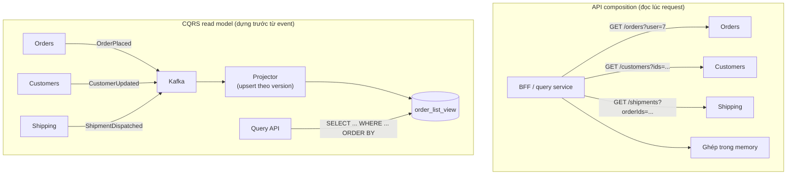
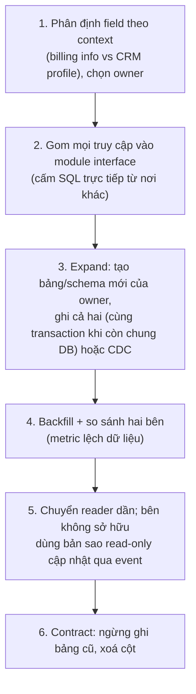

## Bối cảnh & vấn đề

Hai service, Orders và Customers, đã được tách thành hai repo, hai pipeline, hai team. Nhưng Orders vẫn đọc thẳng bảng `customers` trong cùng database để lấy tên và hạng thành viên, "cho nhanh". Một ngày team Customers đổi `tier` từ `varchar` sang bảng tham chiếu `customer_tiers` để hỗ trợ hạng theo quốc gia. Migration chạy lúc 10 giờ sáng, và trang lịch sử đơn hàng bắt đầu trả 500: `column c.tier does not exist`. Team Customers không hề biết Orders đọc cột đó.

Đây là cái giá của **shared database**: schema trở thành một **API ngầm** không có version, không có contract, không có ai chịu trách nhiệm. Hai service deploy "độc lập" trên giấy, nhưng thực tế không ai dám đổi schema mà không hỏi khắp công ty. Lock và query nặng của service này cũng làm chậm service kia.

Bài này giải thích **database-per-service**, cách enforce nó, và hai cách trả lời câu hỏi khó nhất nó sinh ra: khi dữ liệu nằm ở nhiều service, làm sao query chúng cùng nhau?

## Khái niệm

### Database-per-service

**Database-per-service** nghĩa là mỗi service **sở hữu** dữ liệu của mình: chỉ service đó đọc và ghi trực tiếp vào các bảng; service khác truy cập qua **API hoặc event** mà nó công bố. Sở hữu ở đây là về **quyền và trách nhiệm**, không bắt buộc về hạ tầng: có ba mức hiện thực hoá, tăng dần về isolation và chi phí. **Private tables**: cùng database, mỗi service một tập bảng với role riêng. **Schema per service**: cùng server, mỗi service một schema, role chỉ có quyền trên schema của mình. **Database server per service**: tách hẳn instance, cô lập tài nguyên (CPU, IO, connection) và cho phép chọn công nghệ khác (Postgres cho đơn hàng, Elasticsearch cho tìm kiếm).

Mức nào cũng được, miễn là **ranh giới được enforce bằng quyền**, không chỉ bằng quy ước. Nhiều team bắt đầu bằng schema per service trên một cluster Postgres để tiết kiệm chi phí vận hành, rồi tách server cho service có tải hoặc yêu cầu đặc biệt.

**Interview angle:** câu "database-per-service có nghĩa mỗi service một DB server không?" là bẫy. Trả lời đúng: không bắt buộc; điều bắt buộc là ownership và không truy cập chéo.

### Vì sao shared database là anti-pattern

Shared database tạo bốn loại coupling. **Schema coupling**: đổi cột, đổi kiểu, đổi nghĩa của một giá trị phá service khác mà không qua contract test nào. **Deploy coupling**: migration phải phối hợp giữa các team, mất deploy độc lập. **Runtime coupling**: một query quét bảng của service A làm cạn IO và lock của service B; connection pool chung có giới hạn. **Ownership mơ hồ**: hai service cùng ghi một bảng thì không ai là source of truth, invariant nghiệp vụ nằm rải rác ở hai codebase.

Cái giá của việc không chia sẻ cũng rõ: không còn `JOIN` xuyên service, không còn transaction ACID xuyên service. Thay vào đó là API composition, read model, và saga cho thao tác ghi xuyên service (track [Distributed Systems](/tracks/distributed-systems)).

**Interview angle:** red flag là chỉ nói "shared DB là xấu" mà không nói được cái giá của giải pháp thay thế.

### API composition

**API composition**: một thành phần (BFF, gateway, hoặc service "query") gọi các service sở hữu dữ liệu, rồi **ghép kết quả trong memory**. Ví dụ màn hình chi tiết đơn: gọi Orders lấy đơn, rồi song song gọi Customers lấy khách và Shipping lấy vận đơn.

Ưu điểm: đơn giản, dữ liệu luôn **tươi** (đọc từ source of truth), không cần hạ tầng thêm. Nhược điểm: latency bằng call chậm nhất (nếu song song) hoặc tổng các call (nếu tuần tự); availability giảm theo số dependency; và rất khó **filter, sort, paginate** trên dữ liệu ghép ("đơn của khách hạng Gold, sắp xếp theo ngày giao") vì mỗi service chỉ biết phần của mình. Nó hợp với query theo id hoặc danh sách nhỏ, không hợp với tìm kiếm và báo cáo.

### CQRS read model

**CQRS** (Command Query Responsibility Segregation) tách model ghi khỏi model đọc. Trong ngữ cảnh microservices, một **read model** là một view **đã denormalize**, do một service sở hữu, được cập nhật bằng cách **consume event** từ các service khác (`OrderPlaced`, `CustomerUpdated`, `ShipmentDispatched`). Query chạy trên view đó như một bảng bình thường: JOIN, filter, sort, full-text search tuỳ ý.

Cái giá: **eventual consistency** (view trễ hơn source vài trăm ms tới vài giây, hoặc lâu hơn khi consumer lag), phải xử lý event **trùng lặp và sai thứ tự** (upsert có version), phải có cách **rebuild** view từ đầu (replay topic hoặc snapshot), và thêm hạ tầng. Read model không phải source of truth: quyết định quan trọng (đủ hạn mức không, còn hàng không) vẫn hỏi owner.

**Event-carried state transfer** là biến thể: event mang đủ state cần thiết (`CustomerUpdated` chứa tên, tier, version) để consumer giữ một bản sao cục bộ chỉ những field nó cần, không phải gọi lại API.

**Interview angle:** follow-up kinh điển là "read model trễ 30 giây, user vừa sửa xong không thấy thay đổi". Xem cách xử lý ở phần Edge cases.

### Polyglot persistence

Khi mỗi service sở hữu dữ liệu riêng, nó cũng được chọn **loại store** hợp với access pattern của mình: Orders cần transaction và constraint nên dùng Postgres; Search cần full-text và facet nên dùng Elasticsearch/OpenSearch, được nuôi bằng event từ Catalog; Session hay rate limit dùng Redis; event lịch sử dài hạn nằm trong Kafka hoặc object storage. Đây gọi là **polyglot persistence**, và nó là một lợi ích thật của database-per-service.

Nhưng mỗi công nghệ thêm vào là thêm backup, monitoring, nâng cấp, on-call và kiến thức vận hành. Mặc định hợp lý là **một công nghệ chính** (thường là Postgres) cho phần lớn service, và chỉ thêm store khác khi access pattern đòi hỏi rõ ràng (tìm kiếm, cache, time-series). "Mỗi team tự chọn DB yêu thích" là cách nhanh nhất để có năm loại database mà không ai vận hành giỏi cả năm.

### Ownership không có nghĩa là không ai được có bản sao

Một hiểu lầm hay gặp: database-per-service nghĩa là dữ liệu của service A **chỉ** tồn tại trong DB của A. Thực tế, các service khác thường giữ **bản sao một phần** (tên khách hàng, tier, danh mục quốc gia) để không phải gọi A trên mọi request. Điều bắt buộc không phải là "không có bản sao" mà là: chỉ **owner được ghi** bản gốc, bản sao được cập nhật từ owner (event hoặc snapshot), bản sao mang **version** để biết nó cũ tới đâu, và không ai ra quyết định quan trọng dựa trên bản sao. **Reference data** ít đổi (danh mục quốc gia, tiền tệ, bảng mã thuế) thường được phát hành như một dataset có version mà mọi service nạp vào, thay vì gọi API cho mỗi lần tra cứu.

## Cơ chế hoạt động

Hai cách trả lời cùng một câu hỏi "danh sách đơn kèm tên khách và trạng thái giao hàng":



Với API composition, chi phí trả **lúc đọc**: mỗi request chạm ba service. Với read model, chi phí trả **lúc ghi** (projector chạy cho mỗi event) và đổi lại query đọc rẻ, mạnh và không phụ thuộc availability của ba service kia. Projector phải **idempotent và chịu sai thứ tự**: mỗi entity mang `version` tăng dần do owner cấp, và projector chỉ ghi đè khi version mới lớn hơn. Nếu không, một event cũ đến trễ sẽ ghi đè dữ liệu mới.

Tách một bảng dùng chung là quy trình nhiều bước, mỗi bước deploy riêng và rollback được:



Bước 2 là bước bị bỏ qua nhiều nhất và cũng quan trọng nhất: chừng nào còn 40 chỗ `SELECT * FROM customers` rải khắp monolith, mọi bước sau đều không kiểm soát được.

## Ví dụ thực tế

### Enforce ownership bằng schema và role trong Postgres

Chạy trên PostgreSQL 17.11 (Docker). Mỗi service một role và một schema; `orders_svc` không có quyền trên schema `customers`:

```sql
CREATE ROLE orders_svc LOGIN PASSWORD 'o';
CREATE ROLE customers_svc LOGIN PASSWORD 'c';
CREATE SCHEMA orders AUTHORIZATION orders_svc;
CREATE SCHEMA customers AUTHORIZATION customers_svc;
REVOKE ALL ON SCHEMA public FROM PUBLIC;

SET ROLE customers_svc;
CREATE TABLE customers.customers (id text PRIMARY KEY, name text, tier text, version int NOT NULL);
INSERT INTO customers.customers VALUES ('c1', 'Ana', 'gold', 1);

SET ROLE orders_svc;
CREATE TABLE orders.orders (id text PRIMARY KEY, customer_id text NOT NULL, total numeric NOT NULL);
INSERT INTO orders.orders VALUES ('o1', 'c1', 120), ('o2', 'c1', 80);
SELECT o.id, c.name FROM orders.orders o JOIN customers.customers c ON c.id = o.customer_id;
```

```text
ERROR:  permission denied for schema customers
LINE 1: SELECT o.id, c.name FROM orders.orders o JOIN customers.cust...
```

Lối tắt bị chặn ở tầng database, không phụ thuộc vào kỷ luật của từng dev. Muốn có tên khách, Orders phải gọi API của Customers hoặc giữ một bản sao.

### Read model với upsert có version

Orders giữ bản sao `customer_view` chỉ với các field nó cần, cập nhật từ event `CustomerUpdated`. Event v2 đến trước, rồi một event v1 trễ (redelivery hoặc sai thứ tự giữa partition) đến sau:

```sql
CREATE TABLE orders.customer_view (id text PRIMARY KEY, name text, tier text, version int NOT NULL);
INSERT INTO orders.customer_view VALUES ('c1', 'Ana Ng', 'gold', 2)
  ON CONFLICT (id) DO UPDATE SET name = EXCLUDED.name, tier = EXCLUDED.tier, version = EXCLUDED.version
  WHERE orders.customer_view.version < EXCLUDED.version;
INSERT INTO orders.customer_view VALUES ('c1', 'Ana', 'gold', 1)
  ON CONFLICT (id) DO UPDATE SET name = EXCLUDED.name, tier = EXCLUDED.tier, version = EXCLUDED.version
  WHERE orders.customer_view.version < EXCLUDED.version;
SELECT o.id, v.name, v.tier, o.total, v.version AS customer_version
FROM orders.orders o JOIN orders.customer_view v ON v.id = o.customer_id ORDER BY o.id;
```

```text
 id |  name  | tier | total | customer_version
----+--------+------+-------+------------------
 o1 | Ana Ng | gold |   120 |                2
 o2 | Ana Ng | gold |    80 |                2
```

Event v1 trễ bị bỏ qua nhờ điều kiện `WHERE version < EXCLUDED.version`; tên vẫn là "Ana Ng". Nếu dùng upsert không điều kiện, tên sẽ quay lại "Ana" và giữ sai cho tới event tiếp theo. Bây giờ JOIN là hợp lệ vì cả hai bảng thuộc schema của Orders.

### Báo cáo cần dữ liệu từ năm service

Báo cáo doanh thu theo hạng khách, vùng giao hàng và kênh bán chạm Orders, Customers, Shipping, Billing, Marketing. Đừng dùng API composition: báo cáo quét hàng triệu dòng, sẽ đánh sập API của năm service. Các lựa chọn hợp lý:

```text
Option A: CDC/event từ mỗi service → data lake/warehouse (BigQuery, Redshift, ClickHouse)
          → model báo cáo do team data sở hữu. Trễ vài phút tới vài giờ, query tuỳ ý.
Option B: Read model chuyên cho báo cáo (một service reporting consume event).
          Trễ vài giây, nhưng phải tự duy trì schema và replay.
Không nên: một "reporting user" có quyền SELECT vào DB của cả năm service.
          Đó là shared database đi cửa sau: schema của năm service lại thành API ngầm.
```

## Trade-offs & lựa chọn thay thế

| Tiêu chí | API composition | CQRS read model | Bản sao cục bộ (event-carried state) | Warehouse qua CDC |
| --- | --- | --- | --- | --- |
| Độ tươi | Tươi | Trễ ms–giây | Trễ ms–giây | Trễ phút–giờ |
| Query phức tạp (filter/sort/join) | Kém | Tốt | Tốt cho field đã copy | Rất tốt |
| Phụ thuộc availability | Mọi service được gọi | Chỉ view | Chỉ bản sao | Không ảnh hưởng online |
| Hạ tầng thêm | Không | Broker + projector + store | Broker + bảng | Pipeline CDC + warehouse |
| Rủi ro chính | Latency, N+1, cascading failure | Lag, sai thứ tự, rebuild | Dữ liệu cũ dùng cho quyết định | Schema drift, chi phí |
| Hợp khi | Chi tiết theo id, ít service | Màn hình danh sách/tìm kiếm | Hiển thị field ít đổi (tên, tier) | Báo cáo, analytics |

Chọn thế nào. Màn hình chi tiết theo id, cần dữ liệu tươi, chạm 2–3 service: **API composition** với call song song và batch endpoint. Màn hình danh sách có filter/sort trên dữ liệu ghép, hoặc service phụ thuộc không đủ ổn định: **read model**. Chỉ cần vài field ít đổi để hiển thị: **bản sao cục bộ** từ event. Báo cáo và analytics: **warehouse**. Trong mọi trường hợp, quyết định nghiệp vụ quan trọng vẫn hỏi source of truth (hoặc dùng cơ chế reservation của owner), không dựa vào bản sao.

## Edge cases & failure modes

- **Read model trễ 30 giây sau khi user sửa**: UI dùng **read-your-writes**: sau khi ghi, trả về state mới từ response của command và hiển thị nó (optimistic), hoặc đọc từ owner cho chính user đó trong vài giây, hoặc command trả `version` và UI poll view tới khi `version >=` giá trị đó. Hiển thị trạng thái "đang cập nhật" tốt hơn hiển thị dữ liệu cũ như thể là mới.
- **Event sai thứ tự hoặc trùng**: thiếu version guard thì bản cũ ghi đè bản mới; thiếu idempotency thì counter đếm đôi.
- **Rebuild read model**: thêm cột mới vào view cần replay toàn bộ lịch sử. Nếu topic chỉ giữ 7 ngày, bạn không rebuild được; cần compacted topic hoặc snapshot từ owner.
- **Consumer lag khi tải cao**: view trễ vài phút trong flash sale; màn hình "đơn của tôi" phải chịu được hoặc fallback đọc owner.
- **Report JOIN customers với invoices trong một SQL**: sau khi tách, query đó không chạy được nữa. Phải chuyển sang warehouse/read model **trước** khi cắt quyền, không phải phát hiện sau khi báo cáo cuối tháng lỗi.
- **Bản sao bị dùng cho quyết định**: Orders dùng `customer_view.credit_limit` (trễ) để duyệt đơn; khách vượt hạn mức trong khoảng trễ đó. Quyết định cần nhất quán mạnh phải hỏi owner.
- **"Reporting user" có quyền vào mọi schema**: shared DB đi cửa sau, một migration lại phá báo cáo.

## Pitfalls

- ❌ Service đọc thẳng bảng của service khác "cho nhanh" → ✅ đọc qua API, event, hoặc bản sao do chính mình sở hữu.
- ❌ Ownership chỉ là quy ước → ✅ enforce bằng role/schema; lối tắt bị DB từ chối.
- ❌ Nghĩ database-per-service bắt buộc mỗi service một server → ✅ schema per service là khởi đầu hợp lý; tách server khi cần isolation tài nguyên.
- ❌ API composition cho màn hình có filter/sort trên dữ liệu ghép → ✅ read model đã denormalize cho query đó.
- ❌ Upsert read model không có version → ✅ chỉ ghi đè khi version mới lớn hơn, và xử lý event trùng idempotent.
- ❌ Dùng read model để quyết định tiền/hạn mức → ✅ hỏi owner hoặc dùng reservation; read model để hiển thị.
- ❌ Tách bảng chung bằng một migration lớn → ✅ gom truy cập vào interface trước, rồi expand, backfill, chuyển reader, contract.

## Tóm tắt

- Database-per-service: mỗi service sở hữu dữ liệu, service khác chỉ qua API/event; có thể chung server khác schema, miễn quyền được enforce.
- Shared DB biến schema thành API ngầm: phá deploy độc lập, gây tải/lock lẫn nhau, ownership mơ hồ.
- Cái giá: không JOIN và không ACID xuyên service; thay bằng API composition, read model, saga.
- API composition: tươi, đơn giản, nhưng latency/availability phụ thuộc mọi service và kém cho filter/sort.
- CQRS read model: view denormalize cập nhật qua event, query mạnh, nhưng eventual consistency và cần version guard, rebuild.
- Read-your-writes cho UI: trả state từ command, đọc owner trong vài giây, hoặc poll theo version.
- Tách bảng dùng chung: phân định owner, gom truy cập, expand, backfill + so sánh, chuyển reader, contract; báo cáo chuyển sang warehouse trước khi cắt quyền.
