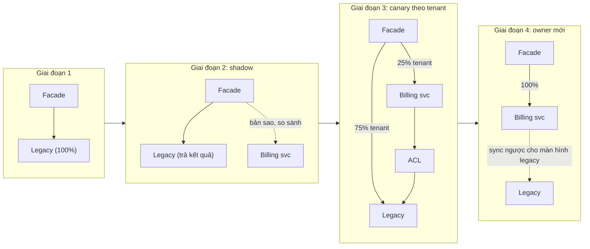
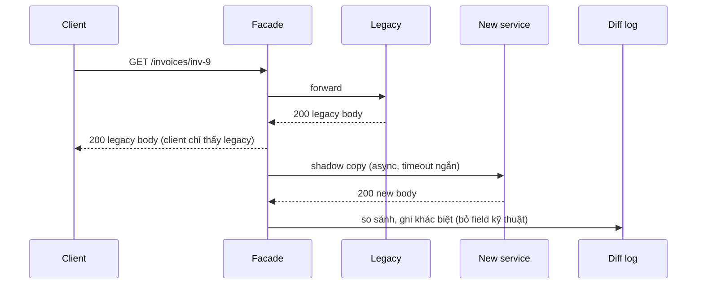

## Bối cảnh & vấn đề

Một công ty quyết định viết lại hệ thống back-office mười năm tuổi từ đầu. Kế hoạch: 12 tháng xây hệ mới song song, đóng băng feature trên hệ cũ, rồi cắt sang trong một đêm cuối tuần. Tháng thứ 8, nghiệp vụ đổi quy định thuế, hệ cũ phải sửa gấp, hệ mới phải đuổi theo. Tháng thứ 14 hệ mới vẫn thiếu 30% chức năng mà không ai liệt kê được, vì chúng nằm trong các nhánh `if` của code legacy. Đêm cắt sang bị huỷ hai lần. Đây là **big-bang rewrite**, và kết quả này phổ biến tới mức nó có tên riêng.

**Strangler fig** là cách ngược lại: không bao giờ cắt một lần. Đặt một **facade** trước hệ cũ, chuyển từng mảnh chức năng sang service mới, chuyển route của mảnh đó, đo, rồi lặp lại. Hệ cũ vẫn chạy và vẫn nhận feature mới trong suốt quá trình; mỗi bước giao giá trị và rollback được bằng một thay đổi routing.

Nhưng chuyển route chỉ là phần dễ. Phần khó là **dữ liệu**: service mới cần dữ liệu đang nằm trong legacy, dưới dạng mã trạng thái bí ẩn, cột `CHAR(10)` có khoảng trắng, ngày giờ lưu theo giờ địa phương. Nếu những quirk đó rò vào domain mới, bạn vừa xây một bản sao của legacy. **Anti-corruption layer** là lớp chặn chúng lại.

## Khái niệm

### Strangler fig

Tên lấy từ cây sung bóp cổ (strangler fig): hạt nảy mầm trên cây chủ, rễ mọc dần xuống đất bao quanh thân cây chủ, tới khi cây chủ chết và cây sung đứng một mình. Martin Fowler dùng hình ảnh này cho việc thay thế hệ thống: **facade** (gateway, reverse proxy, hoặc router trong code) đứng trước legacy; lần lượt xây chức năng mới, hoặc chuyển chức năng cũ, sang service mới rồi **đổi route** tương ứng; lặp lại tới khi legacy trống và bị gỡ.

Ưu điểm: không có ngày cắt lớn; mỗi bước nhỏ, đo được, rollback bằng routing; feature work vẫn tiếp tục. Nhược điểm: chạy **hai hệ song song** trong thời gian dài (thường hàng năm), chi phí vận hành gấp đôi, và **đồng bộ dữ liệu** giữa hai bên là việc khó nhất ([bài 5](/tracks/microservices/learn/data-sync-migration)).

**Interview angle:** interviewer thường hỏi tiếp "dữ liệu mà cả hệ cũ lẫn mới cùng ghi thì sao?". Câu trả lời phải có **một owner tại mỗi thời điểm**.

### Các loại facade

**Edge facade** (API gateway, NGINX, Envoy) route theo path/host/header: `/api/invoices/*` sang Billing service, phần còn lại về monolith. Dễ nhất khi client gọi HTTP và chức năng tương ứng với một nhóm endpoint. **In-app facade** (branch by abstraction): trong code monolith, đặt một interface trước chức năng cần thay, implementation cũ gọi code legacy, implementation mới gọi service mới, chọn bằng feature flag. Dùng khi chức năng không lộ ra thành endpoint riêng (ví dụ một bước tính thuế giữa luồng đặt hàng). **Event interception**: với luồng chạy bằng message (file batch, queue), chặn message ở giữa và chuyển cho service mới.

### Chuyển traffic dần và kill switch

Chuyển route không nên là công tắc 0/100. Các chiến lược: theo **tỉ lệ** request (canary 1% → 10% → 50% → 100%), theo **tenant/khách hàng** (bắt đầu với tenant nội bộ, rồi khách nhỏ), theo **header** (tester nội bộ). Chia theo tenant thường tốt hơn theo request khi dữ liệu có trạng thái: một tenant luôn đi cùng một phía, không nhảy qua lại giữa hai hệ mỗi request. Phép chia nên **ổn định** (hash của tenant id mod 100), để tăng từ 25% lên 50% chỉ thêm tenant mới chứ không xáo trộn tenant cũ.

**Kill switch** là cấu hình đưa toàn bộ về legacy ngay lập tức, không cần deploy. Rollback routing dễ; rollback **dữ liệu** mới là câu hỏi thật: những gì service mới đã ghi trong lúc nó là owner phải về được legacy (sync ngược), nếu không rollback đồng nghĩa với mất dữ liệu.

### Shadow traffic và so sánh kết quả

**Shadow traffic** (dark launch): facade gửi request tới legacy như bình thường và trả kết quả của legacy cho client, đồng thời gửi một bản sao tới service mới **ngoài đường request**, rồi so sánh hai kết quả và ghi lại khác biệt. Không user nào thấy kết quả của service mới, nên có thể chạy hàng tuần trên traffic thật để tìm khác biệt về làm tròn số, encoding, timezone, thứ tự sắp xếp. Thư viện Scientist của GitHub làm việc này ở tầng code.

Chỉ shadow được **thao tác đọc** hoặc thao tác ghi đã được cô lập (service mới ghi vào store riêng không ai đọc). Shadow một request "gửi email" hay "charge thẻ" sẽ làm điều đó hai lần.

### Anti-corruption layer

**Anti-corruption layer (ACL)** là lớp dịch (adapter, translator, facade) giữa model của service mới và model/protocol của legacy hoặc hệ bên ngoài. Nó nhận `STATUS='X9'`, `CUST_TP='3'`, `CRT_DT='01/03/2019 08:30'` (giờ địa phương), và trả ra `OrderStatus.Cancelled`, `tier: "gold"`, `createdAt: "2019-03-01T01:30:00Z"`. Domain mới chỉ nhìn thấy model sạch. Khi legacy bị thay thế hoàn toàn, chỉ ACL phải sửa hoặc xoá.

ACL nên sống **trong service mới** (hoặc một component riêng do team service mới sở hữu), vì team đó là bên muốn bảo vệ model của mình và hiểu model đích. Đặt ACL trong legacy nghĩa là phải sửa legacy cho mỗi thay đổi của service mới; làm một "integration service" chung cho mọi team dễ thành nút cổ chai. Mọi phép dịch dữ liệu nằm **ở một chỗ, có test**, không rải `if (row.CUST_TP === "3")` khắp service.

**Interview angle:** khi kể dự án, nêu một quirk cụ thể (mã trạng thái, encoding, null, timezone) và cách bạn xử lý dữ liệu xấu là thứ phân biệt người đã làm migration thật với người đọc sách.

## Cơ chế hoạt động

Vòng đời của một capability trong strangler fig:



Giai đoạn 1 chỉ đặt facade, không đổi hành vi; đây là lúc kiểm chứng facade không làm tăng latency hay lỗi. Giai đoạn 2 chạy shadow tới khi tỉ lệ khác biệt giảm về mức chấp nhận được và mọi khác biệt còn lại đã được giải thích. Giai đoạn 3 chuyển tenant thật theo từng bậc, có kill switch; service mới vẫn có thể đọc legacy qua ACL cho dữ liệu chưa chuyển. Giai đoạn 4 đổi **source of truth** sang service mới; legacy chỉ còn nhận bản sao để các màn hình cũ chưa chuyển vẫn chạy, rồi bị gỡ dần.

Một request trong giai đoạn shadow chạy như sau:



Điểm thiết kế quan trọng: shadow call chạy **sau** khi đã trả response, có timeout ngắn và lỗi của nó bị nuốt; service mới chậm hay chết không được ảnh hưởng tới client. So sánh phải bỏ qua field kỹ thuật (timestamp sinh ra, id request, field `src`) và chuẩn hoá thứ tự, nếu không diff log ngập nhiễu.

## Ví dụ thực tế

### Facade: shadow, canary theo tenant, kill switch

Ba server Express 5.2 trong cùng process: legacy, Billing service mới, và facade. Billing mới có một khác biệt cố ý: format số tiền của `inv-9` là `"120.5"` thay vì `"120.50"`.

```ts
const config = { invoicesPercent: 25, shadow: true, killSwitch: false };
const bucket = (tenant: string) => createHash("sha256").update(tenant).digest().readUInt16BE(0) % 100;

facade.get("/invoices/:id", async (req, res) => {
  const tenant = String(req.header("x-tenant") ?? "anon");
  const toNew = !config.killSwitch && bucket(tenant) < config.invoicesPercent;
  const r = await fetch((toNew ? BILLING : LEGACY) + req.originalUrl, { signal: AbortSignal.timeout(500) });
  const body = await r.json();
  res.status(r.status).set("x-routed-to", toNew ? "billing" : "legacy").json(body);
  if (config.shadow && !toNew) {               // off the request path, never affects the response
    fetch(BILLING + req.originalUrl, { signal: AbortSignal.timeout(500) })
      .then((s) => s.json())
      .then((shadow) => {
        const { src: _a, ...l } = body; const { src: _b, ...n } = shadow;
        if (JSON.stringify(l) !== JSON.stringify(n)) recordMismatch(req.params.id, l, n);
      })
      .catch(() => {});
  }
});
facade.use(async (req, res) => {               // everything else still goes to the monolith
  const r = await fetch(LEGACY + req.originalUrl); res.status(r.status).json(await r.json());
});
```

Gửi request cho 200 tenant, rồi tăng lên 100%, rồi bật kill switch. Output thật:

```text
  shadow mismatch inv-9: legacy={"INV_NO":"inv-9","AMT":"120.50","CUR":"EUR","STAT":"P"} new={"INV_NO":"inv-9","AMT":"120.5","CUR":"EUR","STAT":"P"}
25% of tenants               legacy=147 billing=53 tenant-42 -> legacy
  shadow mismatches so far: 17
100% of tenants              legacy=0 billing=200 tenant-42 -> billing
kill switch (rollback)       legacy=200 billing=0 tenant-42 -> legacy
other routes: { id: '7', src: 'legacy' }
```

Bốn điều đáng chú ý. Hash cho tỉ lệ **xấp xỉ** (53/200 chứ không đúng 50), và cùng một tenant luôn đi cùng một phía. Shadow bắt được khác biệt format số tiền trước khi bất kỳ khách nào thấy nó; một client parse chuỗi `AMT` cố định hai chữ số thập phân sẽ vỡ. Kill switch đưa mọi thứ về legacy chỉ bằng một thay đổi config. Và các route chưa chuyển (`/orders/*`) vẫn đi thẳng tới monolith. Trong production, `config` nằm trong flag service hoặc config gateway (có audit), và mismatch là một metric có alert, không phải dòng log.

### ACL với test cho các quirk legacy

ACL map một dòng `CUSTOMERS` legacy sang model mới. Quirk thật hay gặp: id `CHAR` có khoảng trắng, mã hạng bằng số, email lẫn hoa thường và chuỗi rỗng thay cho null, ngày giờ lưu theo giờ địa phương UTC+7 dạng `DD/MM/YYYY HH:mm`. Dữ liệu không hiểu được bị **từ chối** (để đưa vào quarantine) thay vì gán giá trị mặc định:

```ts
const TIERS: Record<string, Customer["tier"]> = { "1": "standard", "3": "gold" };
function legacyDateToIso(s: string): string | null {
  const m = /^(\d{2})\/(\d{2})\/(\d{4}) (\d{2}):(\d{2})$/.exec(s.trim());
  if (!m) return null;
  const [, dd, mm, yyyy, hh, mi] = m.map(Number);
  const d = new Date(Date.UTC(yyyy, mm - 1, dd, hh - 7, mi));   // legacy = UTC+7, no DST
  return d.getUTCMonth() === mm - 1 ? d.toISOString() : null;  // rejects 31/02
}
export function toCustomer(row: LegacyCustRow): Customer | Rejected {
  const tier = TIERS[row.CUST_TP.trim()];
  if (!tier) return { row, reason: `unknown CUST_TP '${row.CUST_TP}'` };
  const createdAt = legacyDateToIso(row.CRT_DT);
  if (!createdAt) return { row, reason: `bad CRT_DT '${row.CRT_DT}'` };
  return { id: row.CUST_ID.trim(), tier, email: row.EMAIL_ADDR?.trim().toLowerCase() || null, createdAt };
}
```

Test với `node:test` (fixture lấy từ dữ liệu thật đã ẩn danh), output thật:

```text
✔ maps padded CHAR id, tier code, email case, local time to UTC (2.035625ms)
✔ empty email string becomes null (0.179666ms)
✔ unknown tier code is rejected, not defaulted (0.126667ms)
✔ impossible date is rejected (0.082708ms)
ℹ tests 4
ℹ pass 4
ℹ fail 0
```

Dòng bị từ chối đi vào bảng quarantine (hoặc DLQ nếu đồng bộ qua event) kèm lý do, được báo cho owner nghiệp vụ, và pipeline phải **idempotent** để chạy lại sau khi dữ liệu nguồn được sửa. Gán mặc định `"standard"` cho mã lạ nghe an toàn, nhưng thực chất là âm thầm hạ hạng một khách VIP trong hệ mới.

### Kế hoạch migrate monolith mười năm tuổi (khung)

```text
Quý 0  Mục tiêu đo được: lead time 10 ngày → 2 ngày, deploy 2 tuần/lần → hằng ngày cho Billing.
       Baseline DORA. Lý do migrate được viết thành ADR.
Quý 1  Nền tảng: CI/CD cho service mới, tracing + correlation id xuyên facade và monolith,
       facade đặt trước monolith (chưa đổi route). Modularize Billing trong monolith.
Quý 2  Service đầu tiên: capability coupling thấp, giá trị rõ, rủi ro thấp
       (ví dụ notification hoặc e-invoice gateway). Shadow → canary tenant nội bộ → 100%.
Quý 3+ Billing: ACL + CDC từ legacy, shadow 4 tuần, chuyển tenant theo bậc,
       đổi source of truth, sync ngược cho màn hình legacy, gỡ bảng cũ.
Mỗi quý Review: các chỉ số có tốt lên không? Có nên dừng ở modular monolith cho phần còn lại?
```

Service đầu tiên **không phải** lõi phức tạp nhất (đặt hàng, định giá); nó là nơi team học cách vận hành service mới với rủi ro thấp. Feature work vẫn tiếp tục trên monolith; capability đang migrate có quy tắc rõ "feature mới của Billing viết ở service mới".

## Trade-offs & lựa chọn thay thế

| Cách | Ưu | Nhược | Hợp khi |
| --- | --- | --- | --- |
| Big-bang rewrite | Không chạy song song, kiến trúc "sạch" | Rủi ro cao nhất, đóng băng feature, thiếu chức năng ẩn | Hệ rất nhỏ, có thể đóng băng |
| Strangler qua edge facade | Rollback bằng routing, từng bước | Hai hệ song song lâu, đồng bộ dữ liệu | Chức năng lộ ra thành nhóm endpoint |
| Branch by abstraction (in-app) | Thay chức năng nằm sâu trong luồng | Phải sửa code legacy, cần flag | Chức năng không có endpoint riêng |
| Shadow trước khi chuyển | Bắt khác biệt trên traffic thật, không ảnh hưởng user | Chỉ cho đọc hoặc ghi cô lập, tốn tài nguyên | Logic tính toán, format, báo cáo |
| Canary theo tenant | Một tenant ổn định một phía, dễ giải thích | Tenant lớn là bước nhảy lớn | Dữ liệu có trạng thái theo tenant |
| Canary theo request | Mịn, tăng dần đều | User nhảy giữa hai hệ, dễ thấy dữ liệu lệch | Endpoint stateless, chỉ đọc |

Chọn thế nào. Mặc định là strangler qua edge facade cho chức năng có endpoint, branch by abstraction cho chức năng nằm giữa luồng. Luôn shadow những chỗ có tính toán (tiền, thuế, làm tròn) trước khi chuyển traffic thật. Chuyển theo tenant khi dữ liệu có trạng thái, theo request khi endpoint chỉ đọc và stateless. ACL luôn có mặt khi service mới đọc dữ liệu legacy, không có ngoại lệ.

## Edge cases & failure modes

- **Rollback sau khi service mới đã ghi**: đổi route về legacy thì những hoá đơn service mới tạo trong 3 ngày qua phải có ở legacy, nếu không chúng "biến mất". Cần sync ngược (service mới → legacy) chạy liên tục trong suốt giai đoạn canary, hoặc chỉ rollback khi dữ liệu còn tương thích hai chiều.
- **Shadow có side effect**: shadow `POST /invoices/:id/send` gửi email hai lần. Chỉ shadow đọc, hoặc chạy service mới ở chế độ "dry run" ghi vào store riêng.
- **Facade thành single point of failure**: facade cần HA, timeout, và không chứa business logic, nếu không nó thành monolith thứ hai.
- **Chức năng ẩn trong legacy**: trigger DB, job đêm, stored procedure gửi file cho đối tác. Liệt kê chúng bằng cách đọc job scheduler, trigger, log truy cập, không chỉ đọc code ứng dụng.
- **Dữ liệu xấu trong legacy**: ngày 31/02, mã trạng thái không ai nhớ nghĩa, encoding lẫn lộn. Quarantine và báo owner thay vì sửa âm thầm.
- **Timezone**: legacy lưu giờ địa phương không kèm offset; nếu vùng có DST hoặc từng đổi múi giờ, phép dịch cố định `-7` là sai cho một khoảng lịch sử (verify theo quy định múi giờ của dữ liệu bạn có).
- **Canary theo request với dữ liệu có trạng thái**: user tạo hoá đơn ở service mới, request kế tiếp đi về legacy và không thấy nó.

## Pitfalls

- ❌ Big-bang rewrite với ngày cắt lớn → ✅ strangler fig: chuyển từng capability, đo, rollback bằng routing.
- ❌ Rollback plan chỉ có "đổi route" → ✅ tính cả dữ liệu service mới đã ghi: sync ngược hoặc điều kiện rollback rõ.
- ❌ Chọn lõi phức tạp nhất làm service đầu tiên → ✅ coupling thấp, giá trị rõ, rủi ro thấp; dùng nó để dựng nền tảng.
- ❌ Shadow request có side effect → ✅ shadow đọc, hoặc ghi vào store cô lập.
- ❌ Rải phép dịch dữ liệu legacy khắp service mới → ✅ một ACL có test với fixture thật đã ẩn danh.
- ❌ Gán giá trị mặc định cho dữ liệu legacy không hiểu → ✅ từ chối vào quarantine, báo owner, chạy lại idempotent.
- ❌ Facade chứa logic nghiệp vụ → ✅ facade chỉ route, đo, và chuyển traffic; logic nằm ở service.

## Tóm tắt

- Strangler fig: facade trước legacy, chuyển từng capability, đổi route, lặp tới khi legacy trống; tránh big-bang rewrite.
- Facade có thể là gateway (theo path/header), branch by abstraction trong code, hoặc chặn luồng message.
- Chuyển traffic dần theo tenant hoặc request bằng hash ổn định, có kill switch không cần deploy.
- Shadow traffic so sánh kết quả cũ/mới trên traffic thật, ngoài đường request, chỉ cho thao tác không có side effect.
- Rollback dễ ở routing, khó ở dữ liệu: cần sync ngược những gì service mới đã ghi.
- ACL dịch model legacy sang model sạch, sống trong service mới, gom mọi quirk vào một chỗ có test; dữ liệu xấu vào quarantine.
- Kế hoạch migrate: mục tiêu đo được, nền tảng trước, service đầu tiên rủi ro thấp, review mỗi quý và sẵn sàng dừng lại.
