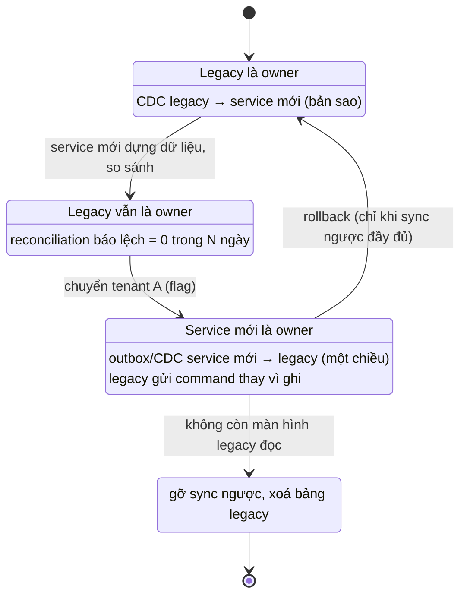
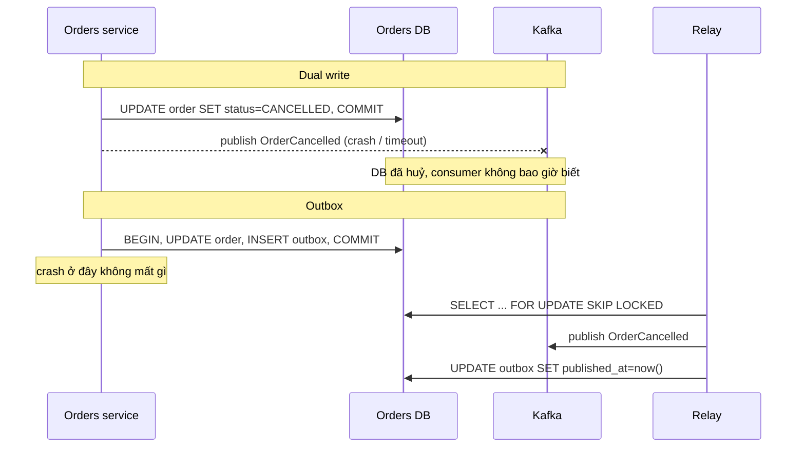

## Bối cảnh & vấn đề

Giữa quá trình migration, Orders service mới đã nhận 30% tenant. Màn hình kho cũ vẫn đọc `legacy_orders`, nên team viết một job đồng bộ hai chiều: service mới ghi trạng thái đơn, job copy sang legacy; job đêm của legacy cập nhật trạng thái, job copy ngược sang service mới. Hai tuần sau, chăm sóc khách hàng báo một số đơn đã giao lại hiện "Đã thanh toán", và một số đơn huỷ lại hiện "Đang giao". Không ai thấy lỗi trong log.

Nguyên nhân: **hai writer** cho cùng một field, đồng bộ hai chiều theo "bản nào mới hơn thắng" dựa trên timestamp của hai máy chủ có đồng hồ lệch nhau, cộng một job legacy ghi lại cả dòng nó đã đọc từ trước (stale). Đây là sự cố kinh điển của strangler migration, và gốc rễ không phải ở code đồng bộ mà ở chỗ **không có owner duy nhất**.

Bài này trình bày các cơ chế đồng bộ dữ liệu (CDC, outbox, batch, và vì sao dual write nguy hiểm), cách xác định **source of truth theo giai đoạn**, và cách kiểm chứng hai bên khớp nhau trước khi cắt.

## Khái niệm

### Dual write và vì sao nó không atomic

**Dual write** là code ứng dụng ghi vào hai nơi trong cùng một request: `UPDATE` database rồi publish Kafka, hoặc ghi DB mới rồi ghi DB legacy. Hai hệ thống không có transaction chung, nên luôn tồn tại khoảng giữa hai lệnh ghi mà process có thể crash, timeout, hoặc lệnh thứ hai thất bại. Kết quả: một bên có dữ liệu, bên kia không, và không ai biết để sửa. Retry cũng không cứu được hoàn toàn: nếu lệnh thứ nhất là publish và lệnh thứ hai (commit DB) rollback, bạn đã phát một event cho thay đổi chưa bao giờ xảy ra.

Dual write cũng không đảm bảo **thứ tự**: hai request đồng thời có thể commit DB theo thứ tự A, B nhưng publish theo thứ tự B, A. Consumer nhận B trước rồi A, và trạng thái cuối cùng sai.

**Interview angle:** câu "sao không ghi DB rồi gửi Kafka luôn?" là cái bẫy; trả lời phải nêu được crash giữa hai lệnh và thứ tự sai, rồi đưa ra outbox hoặc CDC.

### Change Data Capture (CDC)

**CDC** đọc **transaction log** của database (WAL của Postgres, binlog của MySQL, CDC tables của SQL Server) và biến mỗi thay đổi đã commit thành một event. Vì log chỉ chứa thay đổi đã commit, theo đúng thứ tự commit, CDC không có vấn đề crash giữa hai lệnh ghi: một transaction rollback không bao giờ xuất hiện trong luồng thay đổi. Debezium là công cụ phổ biến, đọc log và đẩy vào Kafka.

Ưu điểm lớn nhất trong migration: **không cần sửa code legacy**. Legacy vẫn ghi bảng như cũ; CDC biến các thay đổi đó thành event để service mới dựng dữ liệu của mình. Nhược điểm: event mang **hình dạng bảng** (cột, kiểu, mã `X9`), không mang ý nghĩa nghiệp vụ; service mới phải có ACL để dịch ([bài 4](/tracks/microservices/learn/strangler-fig-acl)). CDC còn cần quản lý **replication slot**: một slot không ai đọc giữ WAL lại và có thể làm đầy đĩa của database nguồn.

### Transactional outbox

**Outbox** giải quyết dual write khi bạn **được sửa** code của bên ghi: trong **cùng một transaction** với thay đổi nghiệp vụ, insert một dòng vào bảng `outbox` mô tả event. Một **relay** (worker poll bảng, hoặc CDC đọc bảng outbox) publish các dòng đó lên broker và đánh dấu đã gửi. Vì thay đổi và event commit cùng nhau, hoặc cả hai tồn tại, hoặc không cái nào.

Relay đảm bảo **at-least-once**: nếu nó publish xong rồi crash trước khi đánh dấu, lần sau nó publish lại. Consumer vì thế phải **idempotent** (dedupe theo event id hoặc upsert có version). Khác với CDC thuần, outbox cho phép event mang **ý nghĩa nghiệp vụ** (`OrderCancelled` với lý do) thay vì một diff cột.

### Source of truth theo giai đoạn

Trong migration, mỗi **entity (hoặc nhóm field)** phải có đúng **một source of truth** tại mỗi thời điểm. Bên còn lại hoặc chỉ đọc bản sao, hoặc gửi **command** tới owner thay vì tự ghi. Ownership chuyển theo giai đoạn: legacy là owner, service mới nhận bản sao qua CDC; rồi một nhóm entity (một tenant, một region) chuyển sang service mới làm owner, legacy nhận bản sao một chiều; cuối cùng toàn bộ chuyển và luồng sync ngược bị gỡ khi màn hình legacy cuối cùng không còn.

Cắt theo **nhóm entity** (tenant by tenant) an toàn hơn cắt theo field ("service mới sở hữu `status`, legacy sở hữu `address` của cùng đơn"), vì cắt theo field giữ hai writer trên cùng một dòng và mọi invariant xuyên field ("không đổi địa chỉ khi đã giao") nằm ở hai hệ.

### Reconciliation

**Reconciliation job** chạy định kỳ, so sánh hai bên (đếm, checksum theo ngày, so từng dòng với bảng nhỏ), xuất metric "số dòng lệch" và alert khi vượt ngưỡng. Nó là lưới an toàn cho mọi cơ chế đồng bộ: CDC có thể dừng vì slot bị xoá, outbox relay có thể kẹt, ACL có thể từ chối dòng xấu. Không có reconciliation thì lệch dữ liệu được phát hiện bởi khách hàng.

## Cơ chế hoạt động

Ownership của một nhóm entity (ví dụ đơn của tenant A) đi qua các trạng thái:



Mỗi mũi tên là một quyết định có điều kiện đo được, không phải một ngày trên lịch. Chuyển từ Shadow sang NewOwner chỉ khi reconciliation báo khớp trong một khoảng đủ dài. Rollback từ NewOwner về LegacyOwner chỉ an toàn khi luồng sync ngược đã đưa mọi thay đổi của service mới về legacy; đó là lý do sync ngược phải chạy ngay từ ngày đầu của NewOwner, không phải "làm sau nếu cần".

So sánh dual write với outbox khi process crash giữa chừng:



Với outbox, crash sau commit chỉ làm event được gửi muộn hơn; crash sau publish nhưng trước khi đánh dấu làm event được gửi hai lần, và consumer idempotent xử lý điều đó.

## Ví dụ thực tế

### CDC bằng logical decoding của Postgres

Chạy trên PostgreSQL 17.11 với `wal_level=logical`, plugin `test_decoding` có sẵn (Debezium dùng `pgoutput`, cùng cơ chế). Legacy không đổi một dòng code:

```sql
CREATE TABLE legacy_orders (id int PRIMARY KEY, status char(2) NOT NULL, updated_at timestamptz DEFAULT now());
ALTER TABLE legacy_orders REPLICA IDENTITY FULL;
SELECT 'slot created' FROM pg_create_logical_replication_slot('orders_cdc', 'test_decoding');
INSERT INTO legacy_orders (id, status) VALUES (1001, 'NW');
BEGIN; UPDATE legacy_orders SET status = 'X9' WHERE id = 1001; COMMIT;
BEGIN; INSERT INTO legacy_orders (id, status) VALUES (1002, 'NW'); ROLLBACK;  -- never emitted
SELECT lsn, xid, data FROM pg_logical_slot_get_changes('orders_cdc', NULL, NULL);
```

```text
    lsn    | xid | data
-----------+-----+-------------------------------------------------------------------
 0/15907B8 | 773 | BEGIN 773
 0/15907B8 | 773 | table public.legacy_orders: INSERT: id[integer]:1001 status[character]:'NW' updated_at[...]:'2026-10-01 02:37:28.319803+00'
 0/15908D0 | 773 | COMMIT 773
 0/15908D0 | 774 | BEGIN 774
 0/15908D0 | 774 | table public.legacy_orders: UPDATE: old-key: id[integer]:1001 status[character]:'NW' updated_at[...]:'2026-10-01 02:37:28.319803+00' new-tuple: id[integer]:1001 status[character]:'X9' updated_at[...]:'2026-10-01 02:37:28.319803+00'
 0/1590968 | 774 | COMMIT 774
```

Ba quan sát. Transaction bị rollback (1002) không xuất hiện: CDC chỉ thấy thay đổi đã commit. `REPLICA IDENTITY FULL` cho ra cả giá trị cũ (`old-key`), hữu ích cho ACL và audit. Và `updated_at` **không đổi** sau `UPDATE` vì legacy không có trigger cập nhật nó: mọi cơ chế sync dựa trên "lấy các dòng có `updated_at` mới hơn lần trước" sẽ bỏ sót thay đổi này. Đọc lại slot lần hai trả 0 dòng (đã consume); slot không ai đọc sẽ giữ WAL, nên phải monitor `pg_replication_slots` và lag của nó.

### Outbox với hai relay song song

Node 24 + `pg` 8.23. Ghi đơn và event trong một transaction; đơn số 7 crash trước commit. Hai relay chạy song song, claim dòng bằng `FOR UPDATE SKIP LOCKED`:

```ts
async function placeOrder(id: number, fail = false) {
  const c = await pool.connect();
  try {
    await c.query("BEGIN");
    await c.query("INSERT INTO orders VALUES ($1, 'PLACED')", [id]);
    await c.query("INSERT INTO outbox (aggregate_id, type, payload) VALUES ($1, 'OrderPlaced', $2)", [String(id), { orderId: id, v: 1 }]);
    if (fail) throw new Error("crash before commit");
    await c.query("COMMIT");
  } catch { await c.query("ROLLBACK"); } finally { c.release(); }
}
async function relay(name: string) {
  for (;;) {
    const c = await pool.connect();
    try {
      await c.query("BEGIN");
      const { rows } = await c.query(`SELECT id, aggregate_id FROM outbox WHERE published_at IS NULL
        ORDER BY id LIMIT 5 FOR UPDATE SKIP LOCKED`);
      if (rows.length === 0) { await c.query("COMMIT"); return; }
      await producer.send(rows);                                   // Kafka in production
      await c.query("UPDATE outbox SET published_at = now() WHERE id = ANY($1)", [rows.map((r) => r.id)]);
      await c.query("COMMIT");
    } finally { c.release(); }
  }
}
```

```text
orders: 19 | outbox rows: 19
published: 19 unique: 19 | order 7 published? false
by relay: { A: 10, B: 9 }
```

Đơn 7 rollback nên không có cả đơn lẫn event. Hai relay chia việc mà không publish trùng, vì `SKIP LOCKED` bỏ qua dòng relay kia đang giữ. Lưu ý: `SKIP LOCKED` với nhiều relay **không giữ thứ tự** toàn cục; nếu consumer cần thứ tự theo entity, publish với key là `aggregate_id` (cùng partition) và chỉ cho một relay xử lý một aggregate tại một thời điểm, hoặc chấp nhận một relay. Dọn bảng outbox định kỳ (xoá dòng đã publish quá N ngày) để nó không phình.

### Sự cố hai writer: mô phỏng và cách sửa

Mô phỏng tất định (chạy thật, dữ liệu giả lập): legacy có đồng hồ nhanh 3 giây; service mới đặt đơn thành `SHIPPED`; một job legacy ghi lại dòng nó đã đọc từ trước (`PAID`); đồng bộ hai chiều theo "timestamp mới hơn thắng". Sau đó cùng kịch bản với một owner duy nhất và command có `expectedVersion`:

```ts
const syncLWW = (from: Map<string, Row>, to: Map<string, Row>, id: string) => {
  const a = from.get(id)!, b = to.get(id);
  if (!b || a.updatedAt > b.updatedAt) to.set(id, { ...a });     // last-write-wins by wall clock
};
// single owner: legacy turns its stale write into a command; owner checks optimistic version
for (const c of commands) {
  const r = modern.get(c.id)!;
  console.log(`command ${c.to} with expectedVersion=${c.expectedVersion} vs current v${r.version}:`,
    r.version === c.expectedVersion ? "applied" : "REJECTED (409 conflict, logged for review)");
}
```

```text
LWW two-way sync  -> legacy: PAID | modern: PAID (SHIPPED lost)
command PAID with expectedVersion=1 vs current v2: REJECTED (409 conflict, logged for review)
single owner      -> legacy: SHIPPED | modern: SHIPPED
```

Với LWW, bản ghi stale của legacy "thắng" nhờ đồng hồ nhanh hơn, và `SHIPPED` biến mất ở cả hai phía. Với một owner, ý định của legacy thành một command; owner thấy version đã đổi và từ chối, sự kiện được ghi lại để người xem xét. Sync một chiều owner → legacy mang `version` để legacy chỉ nhận bản mới hơn. Cách sửa trong production cho sự cố mở đầu: chọn owner cho `status` (service mới với tenant đã chuyển, legacy với phần còn lại), tắt luồng ghi ngược, chuyển job legacy sang gọi API của owner, chạy reconciliation để tìm và sửa các đơn đã lệch, và chuyển ownership **theo tenant** thay vì theo field.

### Reconciliation query

Khi cả hai bên còn trong tầm một query (hoặc đã chép về cùng warehouse), so sánh theo ngày bằng checksum rồi drill xuống dòng (minh hoạ):

```sql
-- daily fingerprint per side; differing days are drilled into row by row
SELECT d, count(*) AS n, md5(string_agg(id || ':' || status, ',' ORDER BY id)) AS fp
FROM (SELECT id, status, created_at::date AS d FROM legacy_orders_mapped
      WHERE created_at >= now() - interval '30 days') t
GROUP BY d ORDER BY d;
```

So sánh `fp` của hai phía, ngày nào khác thì so từng dòng. Xuất số dòng lệch thành metric, alert khi lớn hơn 0 với dữ liệu tiền. Đây cũng là câu trả lời cho câu "làm sao bạn chứng minh service mới trả cùng kết quả với legacy": shadow cho logic đọc, reconciliation cho dữ liệu, cả hai có số liệu theo thời gian.

## Trade-offs & lựa chọn thay thế

| Cơ chế | Sửa code legacy? | Atomic với thay đổi? | Event mang nghĩa nghiệp vụ? | Rủi ro chính | Hợp khi |
| --- | --- | --- | --- | --- | --- |
| Dual write | Có | Không | Có | Mất/lệch khi crash, sai thứ tự | Không nên |
| CDC (log tailing) | Không | Có (chỉ đọc log đã commit) | Không, hình dạng bảng | Slot giữ WAL, schema legacy rò ra | Legacy không sửa được |
| Outbox | Có | Có | Có | Bảng phình, thứ tự với nhiều relay | Service bạn sở hữu |
| Outbox + CDC đọc bảng outbox | Có | Có | Có | Thêm hạ tầng | Throughput cao, ít polling |
| Batch sync định kỳ | Không | Không cần | Không | Trễ, bỏ sót nếu dựa vào `updated_at` | Dữ liệu tham chiếu ít đổi |

Chọn thế nào. Khi **legacy là owner** và khó sửa: CDC từ legacy, ACL ở service mới. Khi **service mới là owner**: outbox (service mới là code bạn sở hữu), sync một chiều về legacy để màn hình cũ chạy. Batch chỉ cho dữ liệu ít thay đổi và chịu trễ (danh mục quốc gia, bảng thuế), và đừng dựa vào `updated_at` nếu không chắc nó luôn được cập nhật. Dual write từ ứng dụng không bao giờ là lựa chọn mặc định, kể cả "tạm thời".

## Edge cases & failure modes

- **Replication slot bị bỏ quên**: consumer CDC chết hai ngày, slot giữ WAL, ổ đĩa database nguồn đầy và legacy ngừng ghi. Alert trên lag của slot; Postgres 13+ có `max_slot_wal_keep_size` để giới hạn (slot bị vô hiệu khi vượt) (verify giá trị phù hợp).
- **Thứ tự event giữa partition**: CDC đẩy theo key; nếu key là id đơn thì thứ tự theo đơn được giữ, nhưng event của đơn và của khách hàng có thể đến lệch nhau.
- **Schema legacy đổi**: ai đó thêm cột hoặc đổi kiểu trong legacy, connector CDC dừng hoặc gửi format mới; ACL phải chịu được (tolerant reader) và alert.
- **Backfill lần đầu**: CDC chỉ thấy thay đổi từ khi tạo slot; dữ liệu cũ cần snapshot nhất quán (Debezium snapshot mode) rồi nối với luồng thay đổi mà không mất khoảng giữa.
- **Sau cutover, màn hình legacy vẫn đọc bảng cũ**: giữ sync một chiều service mới → bảng legacy (read-only với legacy, revoke quyền ghi), cho tới khi màn hình cuối cùng được chuyển.
- **Đồng bộ hai chiều**: vòng lặp (A ghi → sync sang B → CDC của B sync lại sang A) và LWW theo đồng hồ lệch. Một chiều theo owner, kèm version.
- **Event có hiệu lực ngoài hệ thống** (email, gọi đối tác) phát từ cả hai bên trong giai đoạn chuyển: khách nhận hai email. Chỉ owner phát side effect.

## Pitfalls

- ❌ Ghi DB rồi publish event trong cùng request → ✅ outbox trong cùng transaction, hoặc CDC.
- ❌ Hai hệ cùng ghi một field, sync hai chiều bằng timestamp → ✅ một owner tại mỗi thời điểm; bên kia gửi command; sync một chiều có version.
- ❌ Cắt ownership theo field trên cùng một entity → ✅ cắt theo nhóm entity (tenant/region) để mỗi dòng có một writer.
- ❌ Sync dựa trên `updated_at` của legacy → ✅ CDC từ log; `updated_at` thường không được cập nhật ở mọi đường ghi.
- ❌ Không có reconciliation "vì CDC đáng tin" → ✅ job so sánh định kỳ với metric và alert.
- ❌ Rollback plan không tính sync ngược → ✅ sync service mới → legacy chạy từ ngày đầu service mới làm owner.
- ❌ Consumer không idempotent với relay at-least-once → ✅ dedupe theo event id hoặc upsert có version.

## Tóm tắt

- Dual write không atomic và không giữ thứ tự; crash giữa hai lệnh ghi để lại hai bên lệch nhau.
- CDC đọc transaction log, chỉ thấy thay đổi đã commit, không cần sửa legacy; cần ACL và theo dõi replication slot.
- Outbox ghi event cùng transaction với thay đổi, relay publish at-least-once (`FOR UPDATE SKIP LOCKED` cho nhiều relay), consumer idempotent.
- Mỗi entity có đúng một source of truth tại mỗi thời điểm; ownership chuyển theo nhóm entity (tenant by tenant).
- Bên không sở hữu gửi command tới owner, sync một chiều có version; tránh đồng bộ hai chiều theo đồng hồ.
- Reconciliation (checksum theo ngày, rồi theo dòng) là lưới an toàn và là bằng chứng parity trước khi cắt.
- Rollback dữ liệu đòi hỏi sync ngược chạy liên tục; chỉ owner được phát side effect ra ngoài.
- Khi kể sự cố migration: triệu chứng, khoanh vùng bằng correlation id/trace, root cause (owner, thứ tự, timeout), fix, và thay đổi lâu dài.
