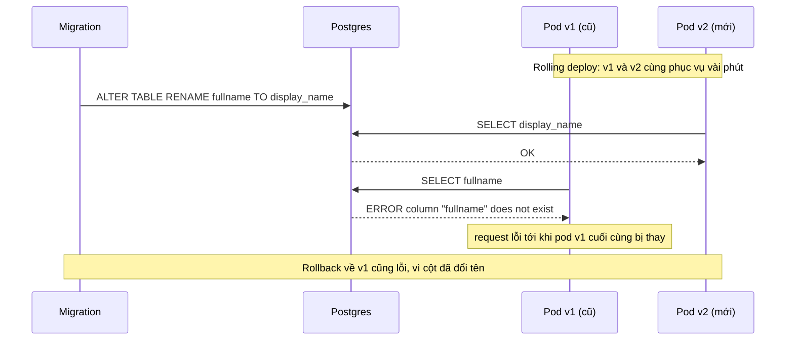
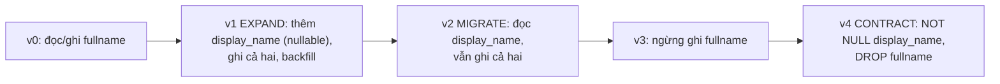

## Bối cảnh & vấn đề

Thứ Ba, team Customers release một thay đổi "nhỏ": đổi `email` thành `contact.email` cho gọn, đổi `tier` sang chữ hoa (`GOLD`) cho thống nhất, thêm `segment`. Code của họ pass hết test. Mười phút sau, ba service khác bắt đầu lỗi: Orders không đọc được email để gửi xác nhận, Billing reject mọi event `CustomerUpdated` vì validation `.strict()`, và một job đồng bộ CRM ghi `null` vào cột email của 40.000 khách hàng.

Không có gì trong thay đổi đó là bug theo nghĩa thông thường. Vấn đề là trong microservices, **API và event là hợp đồng** với những consumer bạn không nhìn thấy, chạy phiên bản code bạn không kiểm soát, deploy theo lịch không trùng với bạn. Monolith đổi tên field thì compiler báo mọi chỗ dùng; microservices thì không ai báo cho tới khi production lỗi.

Bài này đưa ra các quy tắc cụ thể: thay đổi nào an toàn, thay đổi nào breaking, consumer phải viết thế nào để chịu được thay đổi an toàn, version khi nào và thế nào, và **expand/contract**, kỹ thuật cho phép thay đổi breaking mà không có thời điểm nào hai phiên bản không tương thích cùng chạy.

## Khái niệm

### Backward và forward compatibility

**Backward compatible** (với provider) nghĩa là phiên bản mới của API/schema vẫn phục vụ được consumer viết cho phiên bản cũ. **Forward compatible** nghĩa là consumer cũ đọc được dữ liệu do phiên bản mới tạo ra (thường nhờ bỏ qua field lạ). Trong rolling deploy, bạn cần **cả hai chiều**: pod v1 và v2 chạy cùng lúc, đọc dữ liệu của nhau, nhận request từ client cũ và mới.

Với event, câu hỏi tương tự nhưng về thời gian: một topic có thể chứa message viết bởi producer v1 từ ba tháng trước; consumer v3 hôm nay phải đọc được. Schema registry gọi tên các chế độ: **BACKWARD** (consumer dùng schema mới đọc được dữ liệu viết bằng schema cũ), **FORWARD** (consumer dùng schema cũ đọc được dữ liệu viết bằng schema mới), **FULL** (cả hai).

### Thay đổi an toàn và thay đổi breaking

An toàn (additive): **thêm field optional** vào response, **thêm endpoint** mới, **thêm field optional** vào request (provider có giá trị mặc định), **nới lỏng validation** đầu vào (cho phép chuỗi dài hơn).

Breaking: **xoá hoặc đổi tên field**, **đổi kiểu** (`string` → `number`, số → object), **đổi nghĩa** của field hoặc giá trị (đơn vị tiền từ đồng sang nghìn đồng), **thêm field bắt buộc** vào request, **siết validation**, **đổi status code** hoặc format lỗi, đổi **thứ tự mặc định** hoặc kích thước trang mặc định, đổi giá trị enum hiện có (`gold` → `GOLD`).

**Thêm giá trị enum** là vùng xám: an toàn với **request** (provider chấp nhận thêm giá trị), nhưng có thể breaking với **response/event** nếu consumer viết `switch` không có nhánh default hoặc validate bằng enum đóng. Nó chỉ an toàn khi hợp đồng nói rõ enum là **mở** (consumer phải chịu được giá trị lạ) và consumer thực sự làm vậy.

**Interview angle:** câu "thêm enum có breaking không?" có câu trả lời "tuỳ hướng và tuỳ consumer"; đưa ra cả hai trường hợp và cách làm hợp đồng rõ ràng (đánh dấu extensible enum, test với giá trị lạ).

### Tolerant reader

**Tolerant reader** (Fowler) là consumer chỉ đọc **những gì nó cần**, **bỏ qua field lạ**, không phụ thuộc thứ tự field hay vị trí, và có hành vi hợp lý với giá trị enum chưa biết. Nó là nửa còn lại của hợp đồng: provider hứa chỉ thay đổi additive, consumer hứa không vỡ vì thay đổi additive. Một consumer validate bằng schema **đóng** (`additionalProperties: false`, zod `.strict()`) biến mọi thay đổi additive thành breaking.

Tolerant không có nghĩa là chấp nhận mọi thứ: field mà consumer **thực sự dùng** vẫn phải được validate, và dữ liệu không hợp lệ đi vào DLQ thay vì làm crash consumer.

### Chiến lược versioning

**URL version** (`/v1/orders`, `/v2/orders`): rõ ràng, dễ route và cache, dễ đo ai đang dùng v1. Nhược: khuyến khích tạo version lớn và hai version chạy song song tốn công duy trì. **Header/media type** (`Accept: application/vnd.acme.order.v2+json`): URL ổn định, version theo resource. Nhược: khó debug bằng trình duyệt/curl, cache cần `Vary`. **Evolution không version**: chỉ thay đổi additive, tolerant reader, deprecate từng field; breaking bị cấm hoặc đi qua expand/contract. Đây là mặc định phổ biến cho **API nội bộ** có contract test.

Mặc định hợp lý: nội bộ → evolution + contract test ([bài 7](/tracks/microservices/learn/contract-testing)); public/đối tác → URL major version + chính sách deprecation có thời hạn. Event: version trong schema (registry) cho thay đổi tương thích, topic mới (`orders.v2`) cho thay đổi không tương thích.

### Deprecation có số liệu

Deprecate một version hay một field là một quy trình, không phải một dòng changelog. Báo trước bằng header `Deprecation` (RFC 9745) và `Sunset` (RFC 8594, ngày ngừng phục vụ) cùng link tới tài liệu migration; **đo ai còn dùng** bằng client id/`User-Agent`/token subject theo route và field; liên hệ trực tiếp những consumer còn lại; chỉ gỡ khi số liệu về 0 (hoặc sau hạn đã thông báo, với khách bên ngoài).

### Expand/contract (parallel change)

**Expand/contract** chia một thay đổi breaking thành nhiều bước, mỗi bước tự nó tương thích và deploy độc lập. **Expand**: thêm cái mới bên cạnh cái cũ (cột, field, endpoint), code ghi cả hai. **Migrate**: backfill dữ liệu cũ, chuyển reader/consumer sang cái mới. **Contract**: ngừng ghi cái cũ, rồi xoá khi không còn ai dùng. Ở mọi thời điểm, phiên bản N và N+1 của code cùng chạy được trên cùng dữ liệu, nên rolling deploy và rollback luôn an toàn.

Đổi tên `customers.fullname` thành `display_name` thường cần bốn release, không phải ba: (1) thêm cột, ghi cả hai, backfill; (2) đọc cột mới, vẫn ghi cả hai; (3) ngừng ghi cột cũ; (4) xoá cột cũ. Gộp bước 2 và 3 nghĩa là khi rollback từ 3 về 1, code cũ đọc cột cũ đã ngừng được cập nhật.

## Cơ chế hoạt động

Vì sao "rename column trong một migration" không an toàn dưới rolling deploy:



Migration chạy trước (hoặc cùng lúc) khi pod v1 vẫn nhận traffic; mọi request tới v1 lỗi. Tệ hơn, nếu v2 có bug và bạn rollback, cả fleet v1 lỗi vì schema đã đổi. Expand/contract tránh cả hai bằng cách để schema luôn tương thích với **hai** phiên bản code liên tiếp.

Các bước của expand/contract, mỗi bước là một deploy:



Ở mỗi mũi tên, phiên bản trước và sau cùng chạy được: v1 và v0 đều đọc `fullname` (v1 ghi cả hai); v2 và v1 đều có `display_name` đầy đủ nhờ backfill và ghi đôi; v3 và v2 đều đọc `display_name`; v4 chỉ chạy khi không còn code nào đọc `fullname`. Cùng mô hình áp dụng cho API: thêm `contact.email` bên cạnh `email` (expand), chuyển consumer, đo usage của `email`, rồi mới bỏ (contract).

## Ví dụ thực tế

### Expand/contract trên Postgres

PostgreSQL 17.11. Đầu tiên là cách sai, chạy trong transaction để quan sát:

```sql
CREATE TABLE customers (id int PRIMARY KEY, fullname text NOT NULL);
INSERT INTO customers VALUES (1, 'Ana Ng'), (2, 'Bao Tran');
BEGIN;
ALTER TABLE customers RENAME COLUMN fullname TO display_name;
SELECT fullname FROM customers WHERE id = 1;   -- query of a v1 pod
ROLLBACK;
```

```text
ERROR:  column "fullname" does not exist
LINE 1: SELECT fullname FROM customers WHERE id = 1;
```

Rồi expand/contract. Trong lúc rolling deploy, một pod v0 vẫn insert chỉ `fullname`:

```sql
ALTER TABLE customers ADD COLUMN display_name text;                                -- expand
INSERT INTO customers (id, fullname, display_name) VALUES (3, 'Chi Le', 'Chi Le'); -- v1 writes both
INSERT INTO customers (id, fullname) VALUES (4, 'Dung Vo');                        -- v0 pod, old code
UPDATE customers SET display_name = fullname WHERE display_name IS NULL;           -- backfill (batched on big tables)
SELECT count(*) FILTER (WHERE display_name IS DISTINCT FROM fullname) AS mismatches, count(*) AS total FROM customers;
-- ... v2 reads display_name, v3 stops writing fullname, then:
ALTER TABLE customers ALTER COLUMN display_name SET NOT NULL;                      -- contract
ALTER TABLE customers DROP COLUMN fullname;
```

```text
 mismatches | total
------------+-------
          0 |     4

    Column    |  Type   | Collation | Nullable | Default
--------------+---------+-----------+----------+---------
 id           | integer |           | not null |
 display_name | text    |           | not null |
```

Dòng 4 do pod v0 ghi vẫn có `display_name` nhờ backfill chạy **sau** khi v0 đã biến mất; nếu backfill chạy trong lúc v0 vẫn ghi, cần chạy lại hoặc dùng trigger tạm thời để đồng bộ hai cột. Query `mismatches` là kiểm tra trước khi sang bước tiếp. Trên bảng lớn, backfill theo batch có giới hạn (tránh một `UPDATE` khoá hàng triệu dòng và phình WAL), và `SET NOT NULL` trên bảng lớn nên đi qua `CHECK ... NOT VALID` rồi `VALIDATE` (chi tiết ở [Zero-downtime migrations](/tracks/sql-postgres/learn/zero-downtime-migrations)).

### Consumer `CustomerUpdated`: strict vs tolerant

Payload trước và sau release của producer, và hai cách viết consumer với zod 4.6:

```ts
const before   = { id: "c1", email: "a@x.io", tier: "gold" };
const additive = { id: "c1", email: "a@x.io", tier: "gold", segment: "b2b" };          // only adds a field
const after    = { id: "c1", contact: { email: "a@x.io" }, tier: "GOLD", segment: "b2b" }; // the actual release

const Strict = z.object({ id: z.string(), email: z.string().email(), tier: z.enum(["standard", "gold"]) }).strict();
const Tolerant = z.object({                    // default object() strips unknown keys
  id: z.string(),
  email: z.string().email(),
  tier: z.string().transform((t) => (["standard", "gold"].includes(t.toLowerCase()) ? t.toLowerCase() : "unknown")),
});
```

```text
strict   / before    OK  {"id":"c1","email":"a@x.io","tier":"gold"}
tolerant / before    OK  {"id":"c1","email":"a@x.io","tier":"gold"}
strict   / additive  FAIL (root): unrecognized_keys
tolerant / additive  OK  {"id":"c1","email":"a@x.io","tier":"gold"}
strict   / after     FAIL email: invalid_type; tier: invalid_value; (root): unrecognized_keys
tolerant / after     FAIL email: invalid_type
```

Đọc kết quả. Consumer `.strict()` vỡ ngay cả với thay đổi **additive** (chỉ thêm `segment`): đó là lỗi của consumer. Consumer tolerant chịu được field lạ và chuẩn hoá enum lạ về `"unknown"`, nhưng vẫn fail với payload thực tế, vì producer đã **xoá** `email` (chuyển vào `contact`): đó là lỗi của producer, và không consumer nào nên "đoán" để chịu được việc xoá field mình cần. Sửa đúng ở cả hai phía: producer expand (giữ `email`, thêm `contact.email`), không đổi giá trị enum hiện có, đăng ký schema với registry ở chế độ BACKWARD (registry sẽ từ chối schema xoá field bắt buộc); consumer bỏ `.strict()`, xử lý enum lạ, và đẩy message không hợp lệ vào DLQ thay vì crash vòng consume.

### Sau sự cố đổi tên field: quy trình cần có

```text
Ngay lập tức:  rollback provider, hoặc hot-fix trả CẢ HAI field (email + emailAddress).
Trong 1 tuần:  consumer-driven contract test trong CI provider + can-i-deploy trước deploy;
               OpenAPI diff (breaking change detector) chạy trên mỗi PR (bài 7);
               consumer chuyển sang tolerant reader.
Lâu dài:       chính sách: chỉ additive; breaking = expand/contract hoặc version mới;
               deprecation có Deprecation/Sunset header + đo usage theo client id;
               canary + dashboard lỗi theo consumer cho mỗi release.
```

Câu hỏi "làm sao biết consumer nào đang dùng field X hôm nay?" có ba nguồn trả lời: **contract** của từng consumer trên Pact Broker (nói rõ field nào mỗi consumer cần), **log/metric** theo client id cho mỗi route, và với event, danh sách consumer group trên topic. Nếu không có nguồn nào, đó chính là lỗ hổng quy trình đã cho phép sự cố xảy ra.

## Trade-offs & lựa chọn thay thế

| Chiến lược | Ưu | Nhược | Hợp khi |
| --- | --- | --- | --- |
| Evolution, không version | Một codebase, không chạy song song, ít chi phí | Cần kỷ luật additive + contract test; breaking phải expand/contract | API nội bộ, consumer biết rõ |
| URL major version (`/v2`) | Rõ, dễ route/cache/đo usage | Hai version song song, dễ "lạm phát" version | Public API, đối tác |
| Header/media type | URL ổn định, version theo resource | Khó debug, cache cần `Vary` | API hypermedia, client tinh vi |
| Topic mới cho event (`orders.v2`) | Tách sạch thay đổi không tương thích | Producer publish đôi, consumer phải chuyển | Breaking change của event |
| Schema registry (BACKWARD/FULL) | Chặn breaking ngay khi đăng ký schema | Thêm hạ tầng, chỉ cho Avro/Protobuf/JSON Schema | Event qua Kafka |

Chọn thế nào. Nội bộ mặc định là **evolution + tolerant reader + contract test**; thay đổi breaking hiếm và luôn đi qua expand/contract. Public API dùng **URL major version** vì đối tác cần sự rõ ràng và bạn không ép họ nâng cấp theo lịch của mình; mỗi major version có lịch deprecation. Event qua Kafka dùng **schema registry** với chế độ ít nhất BACKWARD, và topic mới khi buộc phải phá. Không chiến lược nào thay được việc **đo** ai đang dùng cái gì.

## Edge cases & failure modes

- **Hai version cùng chạy đọc dữ liệu của nhau**: v2 ghi cache/event format mới, pod v1 đọc và lỗi. Phiên bản N phải đọc được dữ liệu của N+1 (forward compatible) chứ không chỉ ngược lại.
- **Rollback sau contract**: đã `DROP` cột thì không rollback code về bản đọc cột đó được. Contract chỉ sau khi chắc chắn không rollback qua ranh giới đó.
- **Enum mới trong response**: consumer dùng `switch` không có default ném lỗi với `platinum`. Hợp đồng phải nói enum mở hay đóng.
- **Đổi nghĩa không đổi tên**: `amount` từ "đã gồm thuế" sang "chưa gồm thuế". Không validator nào bắt được; đây là breaking tệ nhất. Thêm field mới với tên mới.
- **Đổi default**: page size mặc định 50 → 20; consumer không truyền `limit` thấy dữ liệu "biến mất".
- **Event cũ trong topic**: consumer mới phải đọc message ba tháng tuổi; xoá field bắt buộc khỏi schema đọc là breaking với dữ liệu lịch sử.
- **Backfill trong lúc code cũ còn ghi**: dòng mới do code cũ ghi sau khi backfill xong bị thiếu giá trị; chạy lại backfill sau khi code cũ biến mất, hoặc dùng trigger tạm.

## Pitfalls

- ❌ Đổi tên/xoá field khi còn consumer → ✅ expand (trả cả hai), đo usage, rồi contract.
- ❌ Validate payload bằng schema đóng (`.strict()`, `additionalProperties: false`) → ✅ tolerant reader: bỏ qua field lạ, validate field mình dùng.
- ❌ Đổi giá trị enum hiện có cho "đẹp" → ✅ giữ giá trị cũ; thêm giá trị mới chỉ khi consumer chịu được giá trị lạ.
- ❌ Rename column trong một migration → ✅ add, ghi đôi, backfill, chuyển reader, ngừng ghi, drop.
- ❌ Tạo `/v2` cho mỗi thay đổi nhỏ → ✅ additive change không cần version; version cho breaking không tránh được.
- ❌ Gỡ v1 theo ngày trên lịch nội bộ → ✅ gỡ khi số liệu usage về 0 (hoặc hết hạn Sunset đã báo cho bên ngoài).
- ❌ Đổi nghĩa field giữ nguyên tên → ✅ field mới, tên mới, deprecate field cũ.

## Tóm tắt

- API và event là hợp đồng với consumer bạn không kiểm soát; rolling deploy đòi tương thích cả hai chiều.
- An toàn: thêm field optional, endpoint mới, nới validation. Breaking: xoá/đổi tên/đổi kiểu/đổi nghĩa, field bắt buộc mới, siết validation, đổi status/default/enum hiện có.
- Thêm enum an toàn ở request, có thể breaking ở response/event nếu consumer không chịu được giá trị lạ.
- Tolerant reader: chỉ đọc thứ cần, bỏ qua field lạ, xử lý enum lạ, message lỗi vào DLQ.
- Version: nội bộ dùng evolution + contract test; public dùng URL major version + Deprecation/Sunset + đo usage.
- Expand/contract: thêm mới, ghi đôi, backfill, chuyển reader, ngừng ghi, xoá; mỗi bước tương thích với bước trước.
- Sau sự cố breaking: rollback hoặc trả cả hai field, rồi contract test, OpenAPI diff, schema registry, và chính sách deprecation.
