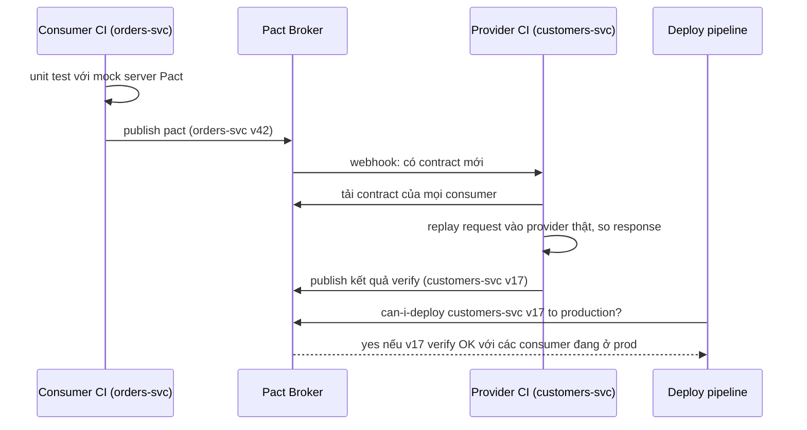
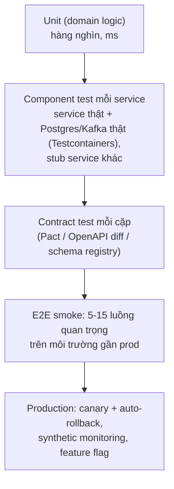

## Bối cảnh & vấn đề

Một công ty có 20 service và một bộ test E2E chạy trên môi trường staging chung. Bộ test mất 70 phút, fail ngẫu nhiên khoảng một lần trong ba lần chạy, và khi fail, việc đầu tiên mọi người làm là bấm "chạy lại". Để chạy được, staging phải có **đúng** phiên bản của cả 20 service, nên các team xếp hàng deploy lên staging. Kết quả: vẫn có sự cố đổi tên field lọt ra production, vì luồng có field đó không nằm trong 40 kịch bản E2E.

E2E test trả lời câu hỏi "cả hệ thống có chạy không?", nhưng với chi phí rất cao và độ phủ thấp. Câu hỏi quan trọng hơn hằng ngày là hẹp hơn nhiều: "thay đổi của provider này có phá consumer nào không?". **Contract testing** trả lời đúng câu đó, trong vài giây, không cần dựng toàn bộ hệ thống, và chỉ ra chính xác cặp service nào hỏng.

Bài này đi qua consumer-driven contract với Pact (chạy thật), kiểm tra breaking change trên OpenAPI, cách xếp các loại test cho một hệ 20 service, và cách đặt chuẩn API cho nhiều team mà không tạo một hội đồng duyệt mọi PR.

## Khái niệm

### Contract và consumer-driven contract

**Contract** là mô tả có thể kiểm chứng bằng máy về một tương tác: request consumer gửi và **phần response mà consumer thực sự dùng**. Trong **consumer-driven contract** (Fowler, Pact), consumer viết contract từ test của chính nó: "khi tôi gửi `GET /customers/c1`, tôi cần status 200 và body có `id`, `email` (string), `tier` khớp `standard|gold`". Contract được publish lên **Pact Broker**; CI của provider tải mọi contract của mọi consumer và **verify** chúng với code thật của provider.

Điểm then chốt: contract chỉ chứa **những gì consumer dùng**, nên provider được tự do thay đổi phần còn lại. Provider biết ngay thay đổi nào phá consumer nào, trước khi merge. Lệnh `can-i-deploy` hỏi broker "phiên bản X của service này đã verify thành công với các phiên bản đang chạy ở production của mọi đối tác chưa?" và chặn deploy nếu chưa.

**Interview angle:** câu "contract test khác E2E thế nào?" cần ba ý: nhanh và ổn định (không dựng cả hệ), chỉ ra đúng cặp lỗi, nhưng **không** kiểm tra hành vi xuyên nhiều hop hay config môi trường, nên vẫn giữ vài E2E smoke.

### Provider state và matcher

**Provider state** ("customer c1 exists") là điều kiện tiền đề mà provider phải dựng trước khi replay một interaction, thường bằng cách seed dữ liệu vào DB test. **Matcher** cho phép contract nói về **hình dạng** thay vì giá trị cụ thể: `like("a@x.io")` nghĩa là "một string", `regex("standard|gold", "gold")` nghĩa là "khớp regex". Không có matcher, contract đòi provider trả đúng chuỗi `"a@x.io"`, và test vỡ vì những lý do không liên quan tới tương thích.

### Contract cho event

Pact hỗ trợ **message contract**: consumer mô tả message nó mong đợi (`CustomerUpdated` có `id`, `email`), provider verify rằng code sinh message của nó tạo ra message thoả mãn. Với Kafka, một lựa chọn bổ sung là **schema registry** với chế độ compatibility, chặn schema breaking ngay lúc đăng ký. Registry kiểm tra schema; contract kiểm tra cả kỳ vọng của từng consumer.

### Schema-driven: OpenAPI diff

Cách tiếp cận khác là **spec-driven**: OpenAPI (hoặc `.proto`, Avro) là nguồn sự thật, và CI chạy một **breaking change detector** so sánh spec của PR với spec trên nhánh chính. Công cụ như oasdiff phân loại thay đổi (xoá property bắt buộc khỏi response, thêm enum vào response, thêm param bắt buộc vào request) và fail build. Nó rẻ và không cần consumer viết gì, nhưng chỉ biết **schema**, không biết consumer nào dùng field nào, và chỉ đúng nếu spec thực sự khớp với code.

### Các tầng test trong microservices

**Unit test** cho logic domain thuần (nhiều nhất, nhanh nhất). **Component/service test**: chạy **một** service thật với dependency hạ tầng thật (Postgres, Redis, Kafka qua Testcontainers) và **stub** các service khác; kiểm tra API, migration, query thật. **Contract test** giữa từng cặp consumer/provider. **E2E smoke** ít, chỉ cho luồng quan trọng nhất (đăng nhập, đặt hàng, thanh toán) trên môi trường gần production. **Kiểm tra trong production**: canary với auto-rollback, synthetic monitoring (một "đơn giả" mỗi phút), feature flag tách deploy khỏi release.

## Cơ chế hoạt động

Vòng đời một contract qua CI của hai team:



Consumer test chạy với một **mock server** do Pact dựng: code client thật của consumer gọi vào mock, mock trả response theo contract, và assertion chạy trên kết quả. Nếu test pass, Pact ghi lại interaction thành file JSON. Phía provider, verifier đọc file, dựng provider state, gửi đúng request đó vào provider thật đang chạy, và so response với matcher. Hai phía không bao giờ cần chạy cùng lúc, và mỗi phía chỉ test code của chính mình.

`can-i-deploy` khép vòng: broker biết phiên bản nào của mỗi service đang chạy ở môi trường nào (deploy pipeline ghi lại), và ma trận verify giữa các phiên bản. Một provider chỉ được deploy khi đã verify với mọi consumer **đang ở production**, và một consumer chỉ được deploy khi contract mới của nó đã được provider **đang ở production** verify.

Xếp các loại test cho hệ 20 service:



Phần lớn độ tin cậy đến từ hai tầng giữa (component và contract), vì chúng test được service thật với hạ tầng thật và test được ranh giới giữa service, mà vẫn nhanh và ổn định. E2E chỉ còn vai trò smoke: xác nhận các mảnh ghép lại được, không phải lưới bắt regression.

## Ví dụ thực tế

### Pact: consumer test sinh contract

Chạy với `@pact-foundation/pact` 17.1.4 (pact-core 20.2.0) trên Node 24. Consumer `orders-svc` chỉ dùng `id`, `email`, `tier`:

```ts
const provider = new PactV4({ consumer: "orders-svc", provider: "customers-svc", dir: "./pacts" });
async function getCustomer(baseUrl: string, id: string) {
  const r = await fetch(`${baseUrl}/customers/${id}`, { headers: { accept: "application/json" } });
  if (!r.ok) throw new Error(`HTTP ${r.status}`);
  const b = await r.json();
  return { id: b.id, email: b.email, tier: b.tier };
}
test("orders-svc reads a customer", async () => {
  await provider.addInteraction()
    .given("customer c1 exists")
    .uponReceiving("a request for customer c1")
    .withRequest("GET", "/customers/c1", (b) => b.headers({ accept: "application/json" }))
    .willRespondWith(200, (b) => b.jsonBody({ id: "c1", email: like("a@x.io"), tier: regex("standard|gold", "gold") }))
    .executeTest(async (mock) => {
      assert.deepEqual(await getCustomer(mock.url, "c1"), { id: "c1", email: "a@x.io", tier: "gold" });
    });
});
```

```text
✔ orders-svc reads a customer (38.603792ms)
ℹ pass 1
ℹ fail 0
```

File `pacts/orders-svc-customers-svc.json` được sinh ra, phần response (rút gọn):

```json
"response": {
  "body": { "content": { "email": "a@x.io", "id": "c1", "tier": "gold" } },
  "matchingRules": { "body": {
    "$.email": { "combine": "AND", "matchers": [{ "match": "type" }] },
    "$.tier":  { "combine": "AND", "matchers": [{ "match": "regex", "regex": "standard|gold" }] }
  } },
  "status": 200
}
```

### Pact: provider verify, pass rồi fail

Provider v1 trả `email` (và thêm `segment` mà consumer không cần). Provider "renamed" đổi `email` thành `emailAddress`:

```ts
await new Verifier({
  providerBaseUrl: "http://localhost:7601",
  pactUrls: ["./pacts/orders-svc-customers-svc.json"],   // in CI: fetched from the Pact Broker
  stateHandlers: { "customer c1 exists": async () => { /* seed test DB */ } },
}).verifyProvider();
```

```text
  a request for customer c1 (0s loading, 53ms verification)
     Given customer c1 exists
    returns a response which
      has status code 200 (OK)
      includes headers
        "Content-Type" with value "application/json" (OK)
      has a matching body (OK)

provider v1: VERIFIED
```

```text
      has a matching body (FAILED)

Failures:

1) Verifying a pact between orders-svc and customers-svc Given customer c1 exists - a request for customer c1
    1.1) has a matching body
           $ -> Actual map is missing the following keys: email
    {
    -  "email": "a@x.io",
    +  "emailAddress": "ana@x.io",
      "id": "c1",
    +  "segment": "b2b",
      "tier": "gold"
}

There were 1 pact failures
```

Hai điều đáng chú ý. Field thừa `segment` **không** làm verify fail ở v1: Pact mặc định cho phép provider trả thêm field (đúng tinh thần tolerant reader). Giá trị `ana@x.io` khác `a@x.io` cũng không sao, vì matcher `like` chỉ kiểm tra kiểu. Thứ duy nhất làm fail là field mà consumer **thực sự cần** đã biến mất, và thông báo chỉ đúng tên consumer và field. Đây là sự cố đổi tên field ([bài 6](/tracks/microservices/learn/backward-compatibility)) bị chặn ở PR của provider.

### OpenAPI diff trong CI

Cùng thay đổi, kiểm tra ở mức spec bằng oasdiff (Docker image `tufin/oasdiff`, chạy tháng 10/2026):

```bash
docker run --rm -v "$PWD":/specs tufin/oasdiff breaking /specs/base.yaml /specs/revision.yaml
```

```text
1 changes: 1 error, 0 warning, 0 info
error  [response-required-property-removed] at /specs/revision.yaml
  in API GET /customers/{id}
    removed the required property `email` from the response with the `200` status
```

Và thêm một giá trị enum vào **response** (`tier: [standard, gold, platinum]`):

```text
1 changes: 1 error, 0 warning, 0 info
error  [response-property-enum-value-added] at /specs/enum.yaml
  in API GET /customers/{id}
    added the new `platinum` enum value to the `tier` response property for the response status `200`
    The server may now return a value the previous contract excluded, so a client written against it may not handle the response. If the value set is meant to grow, declare it with x-extensible-enum.
```

oasdiff coi enum mới trong response là breaking vì consumer có thể không xử lý được giá trị lạ, và gợi ý đánh dấu enum là mở (`x-extensible-enum`) nếu tập giá trị được thiết kế để tăng (phân loại cụ thể của từng rule có thể đổi theo phiên bản, verify). Đây là câu trả lời có số liệu cho câu "thêm enum có breaking không?".

### Component test với Postgres thật (Testcontainers)

Tầng giữa của chiến lược: chạy **một** service thật (HTTP app + migration + SQL thật) với Postgres thật trong container, và **stub** service khác (Customers). testcontainers 12.2 với image `postgres:17`, chạy bằng `node --test`:

```ts
before(async () => {
  container = await new PostgreSqlContainer("postgres:17").start();
  pool = new pg.Pool({ connectionString: container.getConnectionUri() });
  await runMigrations(pool);                                  // the service's real migrations
  stub = customersStub.listen(7651);                          // c1 exists, everything else 404
  server = makeOrdersApp(pool, "http://localhost:7651").listen(7650);
});
test("creates an order once per idempotency key", async () => {
  const a = await post({ customerId: "c1", total: 120 }, "k-1");
  const b = await post({ customerId: "c1", total: 120 }, "k-1");   // client retry
  assert.equal(a.status, 201); assert.equal(b.status, 200);
  assert.deepEqual(await a.json(), await b.json());
  assert.equal((await pool.query("SELECT count(*)::int AS n FROM orders")).rows[0].n, 1);
});
test("DB constraint rejects negative totals (real Postgres, not a mock)", async () => {
  await assert.rejects(pool.query("INSERT INTO orders (idempotency_key, customer_id, total) VALUES ('k-3','c1',-1)"),
    /orders_total_check/);
});
```

```text
# container + app ready in 3679ms
✔ creates an order once per idempotency key (3738.256583ms)
✔ unknown customer -> 422, nothing written (4.136208ms)
✔ DB constraint rejects negative totals (real Postgres, not a mock) (3.967333ms)
ℹ tests 3
ℹ pass 3
```

Khởi động container mất khoảng 3,7 giây khi image đã có sẵn (lần đầu, kéo image, mất hơn 20 giây), sau đó mỗi test chỉ vài ms. Thứ mà mock không bao giờ bắt được thì test này bắt: `ON CONFLICT` của idempotency key hoạt động thật, và `CHECK` constraint có tên đúng như migration tạo ra. Một ví dụ khác cùng loại: driver `pg` trả `numeric(12,2)` và `bigint` dưới dạng **chuỗi** (`{ total: '120.00', b: '7' }` khi chạy thử), nên code so sánh `total === 120` pass với mock trả số nhưng sai với database thật. Dùng một container cho cả file test và dọn dữ liệu giữa các test (transaction rollback hoặc `TRUNCATE`), thay vì một container cho mỗi test.

### Test một luồng async qua ba service

Luồng `OrderPlaced` → Inventory giữ hàng → `StockReserved` → Billing tạo hoá đơn. Thay vì một E2E dựng cả ba service:

```text
1. Message contract: Inventory (consumer) ↔ Orders (provider) cho OrderPlaced;
   Billing (consumer) ↔ Inventory (provider) cho StockReserved.
2. Component test mỗi service với Kafka thật (Testcontainers):
   publish OrderPlaced vào topic → chờ (poll có timeout) StockReserved xuất hiện,
   kiểm tra DB của Inventory; test cả message trùng (idempotency) và message lỗi (vào DLQ).
3. Một E2E smoke trên staging cho cả chuỗi, kiểm tra bằng correlation id trong trace.
4. Production: synthetic order mỗi 5 phút, alert nếu không thấy hoá đơn sau 60s.
```

Đừng dùng `sleep(5000)` rồi assert: poll với timeout và điều kiện cụ thể, nếu không test vừa chậm vừa flaky.

## Trade-offs & lựa chọn thay thế

| Cách | Bắt được | Không bắt được | Chi phí | Hợp khi |
| --- | --- | --- | --- | --- |
| E2E trên staging chung | Lỗi tích hợp nhiều hop, config môi trường | Phần lớn luồng (độ phủ thấp), chỉ ra nguyên nhân | Rất cao, flaky, chặn deploy | 5–15 luồng smoke quan trọng |
| Consumer-driven contract (Pact) | Provider phá kỳ vọng cụ thể của consumer | Hành vi xuyên nhiều hop, hiệu năng | Consumer phải viết và duy trì contract | Cặp service nội bộ, các team phối hợp |
| OpenAPI diff | Breaking change ở mức schema | Consumer nào bị ảnh hưởng, spec lệch code | Thấp | Mọi API có spec, public API |
| Schema registry | Event schema không tương thích | Kỳ vọng nghiệp vụ của consumer | Hạ tầng registry | Event qua Kafka |
| Component test (Testcontainers) | Bug SQL, migration, serialization trong service | Lỗi giữa các service | Trung bình | Mọi service |

Chọn thế nào. Dùng **cả** OpenAPI diff (rẻ, áp cho mọi API) **và** contract test cho các cặp quan trọng: diff bắt lỗi schema ngay trong PR, contract nói rõ ai bị ảnh hưởng và bắt cả thay đổi hành vi mà schema không mô tả. Với event, registry là tối thiểu, message contract cho các consumer quan trọng. Giữ E2E ít và ổn định; nếu một E2E flaky hơn vài phần trăm, sửa hoặc xoá nó.

Khi provider có **15 consumer**, mỗi consumer sở hữu contract của mình (nó mô tả kỳ vọng của nó), provider sở hữu việc **verify** và việc giữ CI xanh. Provider không được sửa contract của consumer; nếu một kỳ vọng không hợp lý, hai team nói chuyện, và consumer cập nhật contract. Broker cho provider thấy toàn bộ ma trận: field nào được bao nhiêu consumer dùng.

## Edge cases & failure modes

- **Contract quá chặt**: consumer ghi giá trị cụ thể thay vì matcher, contract vỡ khi dữ liệu test đổi. Dùng matcher theo kiểu/regex; chỉ ghi field thực sự dùng.
- **Provider state không được dựng đúng**: verify pass vì handler state trống và provider trả 404 khớp ngẫu nhiên với một interaction khác. Mỗi state phải seed dữ liệu thật.
- **Spec lệch code**: OpenAPI viết tay không được sinh từ code (hoặc ngược lại), diff báo xanh trong khi API thật đã đổi. Sinh spec từ code hoặc test response thật với spec.
- **`can-i-deploy` không biết phiên bản đang chạy**: pipeline quên ghi lại deploy (`record-deployment`), broker so với phiên bản cũ.
- **Test async bằng sleep**: chậm và flaky. Poll có timeout, và kiểm tra idempotency với message trùng.
- **Staging chung bị chiếm**: một team deploy bản lỗi lên staging chặn mọi team khác. Môi trường tạm theo PR hoặc component test thay cho phần lớn E2E.
- **Mock tự viết lệch thực tế**: consumer mock provider bằng tay, test pass, production fail. Mock từ contract (Pact) hoặc từ spec đã được verify.

## Pitfalls

- ❌ Dựa vào bộ E2E khổng lồ làm lưới bắt regression → ✅ component test + contract test; E2E chỉ smoke cho vài luồng quan trọng.
- ❌ Contract ghi toàn bộ response của provider → ✅ chỉ field consumer dùng, với matcher theo kiểu.
- ❌ Provider sửa contract của consumer để CI xanh → ✅ consumer sở hữu contract; thay đổi qua trao đổi giữa hai team.
- ❌ Chỉ có OpenAPI diff, coi như đủ → ✅ diff cho schema, contract cho kỳ vọng từng consumer, registry cho event.
- ❌ Deploy mà không hỏi `can-i-deploy` → ✅ gate deploy trên ma trận verify với phiên bản đang ở production.
- ❌ Chuẩn API thực thi bằng một hội đồng review mọi PR → ✅ guideline ngắn + lint/diff tự động trong CI + template service; review người cho quyết định xuyên team qua ADR.
- ❌ Đo "tuân thủ" bằng cách chặn → ✅ đo tỉ lệ tuân thủ, làm paved road dễ đi hơn đường khác.

## Tóm tắt

- Contract là mô tả có thể kiểm chứng của một tương tác; consumer-driven contract chỉ chứa phần consumer thực sự dùng.
- Pact: consumer test với mock sinh pact, publish lên broker, provider verify với code thật, `can-i-deploy` gate deploy.
- Pact cho phép provider trả thêm field và dùng matcher theo kiểu; chỉ fail khi kỳ vọng thật của consumer bị phá.
- OpenAPI diff (oasdiff) bắt breaking change ở mức schema trong PR, kể cả enum mới trong response; schema registry làm việc tương tự cho event.
- Chiến lược cho 20 service: unit, component test với hạ tầng thật, contract test mỗi cặp, vài E2E smoke, canary và synthetic monitoring ở production.
- Luồng async: message contract + component test với Kafka thật, poll có timeout, kiểm tra idempotency và DLQ.
- Governance không nghẽn: guideline ngắn, kiểm tra tự động (Spectral, oasdiff, registry), template service, ADR và guild cho quyết định xuyên team.
