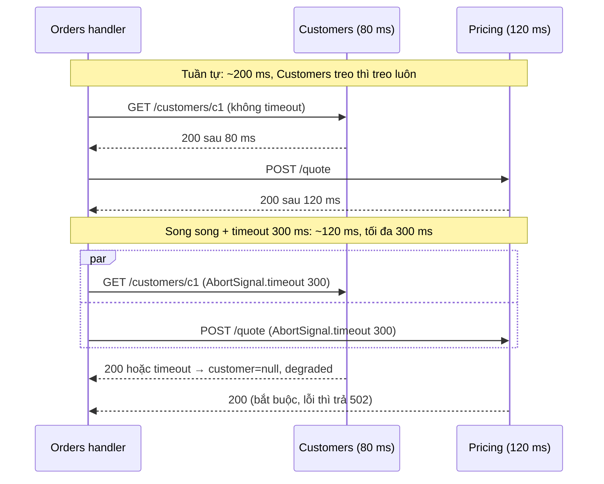
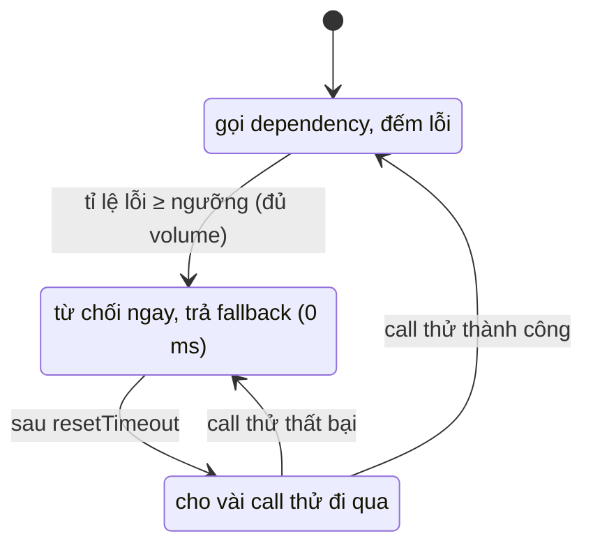

## Bối cảnh & vấn đề

Thứ Sáu, service Customers bị một migration khoá bảng 40 giây. Nó không chết: nó vẫn nhận kết nối, chỉ không trả lời. Trong 40 giây đó, service Orders (gọi Customers trên mọi request xem đơn) ngừng phản hồi hoàn toàn, rồi gateway hết connection, rồi trang chủ (không liên quan gì tới Customers) cũng treo vì dùng chung gateway. Trace trong Jaeger bị đứt ở Orders, nên mất 20 phút mới biết thủ phạm là một service nằm ba hop phía sau.

Một dependency **chậm** nguy hiểm hơn một dependency **chết**: service chết trả lỗi kết nối ngay, service chậm giữ socket, memory và slot xử lý của caller cho tới khi caller tự bỏ cuộc. Nếu caller không bao giờ bỏ cuộc (không có timeout), mọi request đều xếp hàng sau dependency đó, và lỗi lan ngược lên như domino: **cascading failure**.

Bài này trả lời hai câu hỏi. Khi nào nên gọi đồng bộ và khi nào nên phát event để giảm số dependency trên đường request? Và với những call đồng bộ không tránh được, mỗi call cần những gì (timeout, kiểm tra lỗi, chạy song song, fallback, circuit breaker, batch) để một dependency xấu không kéo sập cả hệ?

## Khái niệm

### Giao tiếp đồng bộ

**Sync** (REST qua HTTP, gRPC): caller gửi request và **chờ** response trước khi làm tiếp. Đơn giản, có kết quả ngay, dễ hiểu luồng. Nhưng nó tạo **temporal coupling**: caller chỉ hoạt động được khi callee đang sống **và** nhanh. Latency của caller ít nhất bằng latency của callee, availability của caller bị nhân với availability của callee.

Dùng sync khi caller **cần câu trả lời để trả lời user ngay**: kiểm tra giá trước khi hiển thị giỏ hàng, validate voucher, kiểm tra quyền. Nguyên tắc thiết kế: giữ **chuỗi sync trên đường request của user ngắn** (lý tưởng là một hop từ BFF/gateway tới service sở hữu), và đừng để service A gọi B gọi C gọi D đồng bộ.

### Giao tiếp bất đồng bộ

**Async** (event/message qua Kafka, SQS, RabbitMQ): producer ghi message vào broker và đi tiếp; consumer xử lý khi sẵn sàng. Producer không phụ thuộc consumer có đang sống hay không; consumer chậm chỉ làm **lag** tăng, không làm producer treo. Một event có thể có nhiều consumer (fan-out) mà producer không cần biết.

Phân biệt **event** và **command**. Event là **sự thật đã xảy ra**, thì quá khứ (`OrderPlaced`, `PaymentCaptured`); producer không biết và không quan tâm ai phản ứng. Command là **yêu cầu** làm gì đó (`ReserveStock`), có một người nhận chủ định. Một "event" tên `SendEmail` thực chất là command đội lốt, và nó coupling producer với chi tiết của consumer.

Cái giá: **eventual consistency** (đơn đã đặt nhưng email tới sau vài giây), consumer phải **idempotent** (broker giao at-least-once), thứ tự chỉ được đảm bảo trong phạm vi hẹp (một partition), và debug khó hơn vì không có một stack trace xuyên suốt (cần trace context trong header message, [bài 10](/tracks/microservices/learn/observability-health)).

**Interview angle:** follow-up "Gateway → A → B → C, mỗi cái 99.9%, availability bao nhiêu?" trả lời 0.999^4 ≈ 99.6%; điểm cộng là nói thêm cách giảm: cắt hop sync bằng event/read model, và fallback cho dependency không thiết yếu.

### Timeout và deadline

**Timeout** là giới hạn thời gian caller sẵn sàng chờ một call. Không có timeout, một call có thể chờ vô hạn (hoặc tới timeout mặc định rất dài của OS/thư viện). Trong Node, `fetch` không có timeout mặc định ngắn; truyền `signal: AbortSignal.timeout(ms)` cho từng call. Giá trị timeout chọn từ **latency thực tế** của dependency (ví dụ một chút trên p99) và **budget** của request cha: nếu gateway chờ tối đa 2 giây, service ở giữa không nên đặt timeout 5 giây cho dependency của nó.

**Deadline propagation** mở rộng ý đó: request mang theo thời điểm hết hạn (gRPC có sẵn deadline; HTTP có thể dùng header tự định nghĩa), mỗi hop tính phần thời gian còn lại, và không bắt đầu công việc khi deadline đã qua.

### Fallback và graceful degradation

Không phải mọi dependency đều thiết yếu. Màn hình chi tiết đơn **cần** giá (không có giá thì trả lỗi), nhưng tên khách hàng có thể **thiếu** (hiển thị "Khách hàng #c1"), và gợi ý sản phẩm có thể rỗng. **Graceful degradation** là quyết định trước, cho từng dependency: lỗi thì fail cả request, hay trả response rút gọn và đánh dấu `degraded`? `Promise.allSettled` là công cụ tự nhiên cho việc này trong Node.

### Circuit breaker

**Circuit breaker** bọc một dependency và theo dõi tỉ lệ lỗi. **Closed**: cho call đi qua, đếm lỗi. Khi lỗi vượt ngưỡng (trong một cửa sổ đủ số mẫu), chuyển sang **Open**: từ chối call **ngay lập tức** (fail fast, hoặc trả fallback) mà không chạm dependency. Sau một khoảng `resetTimeout`, chuyển sang **Half-open**: cho một vài call thử; thành công thì về Closed, thất bại thì về Open. Lợi ích kép: caller không lãng phí thời gian và tài nguyên vào dependency đang hỏng, và dependency có khoảng thở để hồi phục thay vì bị dội thêm traffic. Chi tiết retry, backoff, bulkhead và load shedding ở track [Distributed Systems](/tracks/distributed-systems).

### N+1 qua network

**N+1** quen thuộc với ORM (một query lấy danh sách, rồi N query lấy chi tiết) trở nên tệ hơn nhiều qua network: mỗi call tốn từ vài tới vài chục ms thay vì dưới 1 ms, và nếu chạy **tuần tự** trong vòng `for ... await`, tổng thời gian là N lần latency. Cách sửa theo thứ tự ưu tiên: **batch endpoint** (`GET /products?ids=1,2,3`), gọi các batch **song song**, **dedupe** id, **cache** dữ liệu ít đổi, hoặc dựng **read model** đã join sẵn cho màn hình đó ([bài 3](/tracks/microservices/learn/database-per-service)). Nếu buộc phải gọi từng cái, gọi song song với **giới hạn concurrency** (ví dụ 10 cùng lúc) để không dội dependency.

## Cơ chế hoạt động

Cùng một handler "xem đơn" với hai cách gọi dependency, khi Customers mất 80 ms và Pricing mất 120 ms:



Hai call độc lập (call thứ hai không cần kết quả call thứ nhất) chạy song song nên latency bằng call chậm nhất thay vì tổng. Timeout đặt **trần** cho latency của handler bất kể dependency tệ thế nào. Phân loại dependency (bắt buộc hay có thể thiếu) quyết định khi nào trả lỗi và khi nào trả bản rút gọn.

Circuit breaker hoạt động như một state machine:



Trong trạng thái Open, call bị từ chối trong 0 ms thay vì chờ timeout; đó là khác biệt giữa "mỗi request chậm thêm 300 ms" và "mỗi request trả ngay bản rút gọn". Ngưỡng cần một **volume tối thiểu** để vài lỗi lẻ lúc traffic thấp không mở breaker.

## Ví dụ thực tế

### Sửa handler gọi hai service

Handler gốc (trong câu hỏi debug) gọi tuần tự, không timeout, không kiểm tra `r.ok`, POST không có `content-type`. Bản sửa:

```ts
async function getJson(url: string, init: RequestInit = {}, ms = 300) {
  const r = await fetch(url, { ...init, signal: AbortSignal.timeout(ms) });
  if (!r.ok) throw new Error(`${url} -> HTTP ${r.status}`);
  return r.json();
}
app.get("/orders/:id", async (req, res) => {
  const order = await db.order.findUnique({ where: { id: req.params.id } });
  if (!order) return res.status(404).json({ error: "order not found" });
  const [customer, pricing] = await Promise.allSettled([
    getJson(`${CUSTOMER_URL}/customers/${order.customerId}`),
    getJson(`${PRICING_URL}/quote`, {
      method: "POST", headers: { "content-type": "application/json" }, body: JSON.stringify(order),
    }),
  ]);
  if (pricing.status === "rejected") return res.status(502).json({ error: "pricing unavailable" });
  res.json({ ...order, customer: customer.status === "fulfilled" ? customer.value : null,
             pricing: pricing.value, degraded: customer.status === "rejected" });
});
```

Ba server Express 5.2 trong một process (Customers 80 ms, Pricing 120 ms), so sánh logic gốc và logic đã sửa. Output thật (lần chạy warm):

```text
original, all healthy                209ms -> {"total":42.5,"currency":"EUR","ct":"text/plain;charset=UTF-8"}
fixed, all healthy                   124ms -> {"total":42.5,"currency":"EUR","ct":"application/json"}
original, pricing 500                204ms -> {"error":"pricing db down"}
fixed, pricing 500                   124ms -> ERROR Error: http://localhost:7202/quote -> HTTP 500
fixed, customer hangs                302ms -> {"total":42.5,"currency":"EUR","ct":"application/json"} (degraded: customer=null)
original, customer hangs: 200/200 requests still pending after 3s (sockets + memory held)
```

Đọc từng dòng. Tuần tự 209 ms, song song 124 ms (bằng call chậm nhất). Bản gốc gửi body JSON với `content-type: text/plain`, nên một provider dùng `express.json()` sẽ thấy `req.body` rỗng. Khi Pricing trả 500, bản gốc **coi body lỗi là dữ liệu** và trả `{"error":"pricing db down"}` trong field `pricing` với status 200; bản sửa fail rõ ràng. Khi Customers treo, bản sửa trả sau đúng 300 ms với `customer=null`; bản gốc giữ **200/200** request treo sau 3 giây, mỗi cái giữ một socket và closure trong memory, và sẽ giữ mãi. Đó là cơ chế khiến "cả service ngừng phản hồi". Trace bị đứt vì không có `traceparent`: với OpenTelemetry, `fetch` chỉ được propagate khi có instrumentation cho undici ([bài 10](/tracks/microservices/learn/observability-health) chạy thử điều này).

### Circuit breaker với opossum

opossum 10.0 bọc call tới Customers đang treo, timeout 100 ms, mở khi ≥ 50% lỗi trên tối thiểu 5 call, thử lại sau 1 giây:

```ts
const breaker = new CircuitBreaker((id: string) => getJson(`${CUSTOMER_URL}/customers/${id}`, {}, 100), {
  timeout: false, errorThresholdPercentage: 50, volumeThreshold: 5, resetTimeout: 1000,
});
breaker.fallback(() => null);
```

```text
  call 1: 102ms value=null state=CLOSED
  call 2: 102ms value=null state=CLOSED
  call 3: 102ms value=null state=CLOSED
  call 4: 100ms value=null state=CLOSED
  [breaker] -> open
  call 5: 101ms value=null state=OPEN
  call 6: 0ms value=null state=OPEN
  call 7: 0ms value=null state=OPEN
  call 8: 0ms value=null state=OPEN
  [breaker] -> halfOpen
  [breaker] -> close
  after resetTimeout, dependency healed: value={"id":"c1","name":"Ana"} state=CLOSED
  stats: fires=9 failures=5 rejects=3 fallbacks=8
```

Năm call đầu mỗi cái tốn ~100 ms (chờ timeout). Từ call 6, breaker Open từ chối trong **0 ms** và trả fallback. Sau 1 giây, Customers đã hồi phục; call thử ở Half-open thành công và breaker về Closed. `timeout: false` vì timeout đã nằm trong `AbortSignal`; dùng timeout của opossum mà không hủy request thật thì socket vẫn bị giữ.

### N+1 trong BFF danh sách đơn

BFF lấy 50 đơn rồi, trong vòng lặp, gọi Catalog và Shipping cho từng đơn. Mỗi call downstream mất ~20 ms:

```ts
async function batched() {
  const productIds = [...new Set(orders.map((o) => o.productId))];              // dedupe
  const [products, shipments] = await Promise.all([
    get(`${CATALOG}/products?ids=${productIds.join(",")}`),
    get(`${SHIPPING}/shipments?orderIds=${orders.map((o) => o.id).join(",")}`),
  ]);
  const pById = new Map(products.map((p: any) => [p.id, p]));
  const sById = new Map(shipments.map((s: any) => [s.orderId, s]));
  return orders.map((o) => ({ ...o, product: pById.get(o.productId), shipment: sById.get(o.id) }));
}
```

```text
naive N+1 (sequential)   rows=50 calls=100 time=2282ms
batched + Promise.all    rows=50 calls=  2 time=25ms
```

100 call nối tiếp (cộng 1 call lấy danh sách đơn) thành 2 call song song: từ 2.3 giây xuống 25 ms trên localhost; qua mạng thật với latency mỗi call lớn hơn, khoảng cách còn rộng hơn. Nếu team Catalog không chịu thêm batch endpoint: gọi song song có giới hạn concurrency (`p-limit` hoặc tự viết), cache catalog trong BFF (dữ liệu sản phẩm ít đổi), dùng DataLoader để dedupe trong một request, hoặc dựng read model riêng cho màn hình danh sách. Cuộc nói chuyện về batch endpoint vẫn nên diễn ra, vì mỗi lựa chọn còn lại đều dội Catalog nhiều hơn.

### p99 tăng gấp đôi sau khi tách service

Quy trình điều tra (minh hoạ):

```text
1. Trace của request chậm (p99, không phải trung bình): span nào dài ra? Có bao nhiêu span con mới?
2. Đếm call: trước là 1 query JOIN, giờ là 1 + N call HTTP? (chatty, N+1)
3. Mỗi span HTTP: thời gian connect/TLS có xuất hiện không? (keep-alive tắt, agent mới mỗi call)
4. Payload: JSON vài MB serialize/parse trên event loop? (event loop lag)
5. Hạ tầng: DNS lookup mỗi call, cross-AZ hop, sidecar thêm vào, pool connection nhỏ ở service mới.
6. Cache: service mới khởi động với cache lạnh, monolith có cache in-process ấm.
7. Ranh giới: nếu hai service luôn cần dữ liệu của nhau trên mọi request, ranh giới có thể sai.
```

Tail latency còn bị khuếch đại bởi fan-out: nếu một request gọi 10 dependency song song, latency của nó là **max** của 10 call, nên p99 của request bị chi phối bởi p99.9 của từng dependency (Dean & Barroso, "The Tail at Scale"). Fix theo nguyên nhân: batch/aggregate API, bật keep-alive, cache, co-locate, read model, hoặc thừa nhận ranh giới sai và gộp lại ([bài 11](/tracks/microservices/learn/distributed-monolith-platform)).

## Trade-offs & lựa chọn thay thế

| | Sync (REST/gRPC) | Async (event/queue) |
| --- | --- | --- |
| Kết quả | Ngay lập tức | Sau đó (eventual) |
| Coupling | Temporal: callee phải sống và nhanh | Lỏng: chỉ phụ thuộc broker |
| Lỗi lan truyền | Cascading nếu thiếu timeout/breaker | Lag tăng, producer không bị ảnh hưởng |
| Fan-out nhiều consumer | Caller phải gọi từng cái | Tự nhiên (pub/sub) |
| Debug | Một trace liền, dễ | Cần trace context trong message header |
| Đòi hỏi | Timeout, retry có budget, breaker | Idempotency, xử lý thứ tự, DLQ |
| Dùng khi | Query cần trả lời user ngay, validate | Thông báo thay đổi, workflow dài, đồng bộ read model |

| Cách giảm N+1 | Ưu | Nhược |
| --- | --- | --- |
| Batch endpoint | Ít call nhất, dependency tối ưu được query | Cần provider hợp tác, giới hạn kích thước batch |
| Song song có giới hạn concurrency | Không cần provider đổi | Vẫn N call, dội dependency |
| Cache ở BFF | Nhanh, giảm tải | Dữ liệu cũ, invalidation |
| Read model cho màn hình | Một query, nhanh nhất | Eventual consistency, thêm hạ tầng |

Chọn thế nào. Đặt câu hỏi cho từng tương tác: caller có **cần** câu trả lời để trả lời user ngay không? Nếu không (gửi email, cập nhật analytics, đồng bộ read model, bước tiếp theo của workflow), dùng event. Nếu có, dùng sync nhưng giữ chuỗi ngắn, mỗi call có timeout theo budget, call độc lập chạy song song, dependency không thiết yếu có fallback, dependency hay lỗi có breaker. Danh sách nhiều item luôn đi qua batch hoặc read model, không bao giờ qua vòng `for ... await`.

## Edge cases & failure modes

- **Timeout lớn hơn budget của caller**: gateway bỏ cuộc sau 2 giây, service ở giữa vẫn chờ dependency 5 giây và làm việc vô ích, giữ tài nguyên.
- **Timeout không hủy công việc**: wrapper timeout (`Promise.race`) trả lỗi nhưng request thật vẫn chạy và giữ socket. Dùng `AbortSignal` để hủy thật.
- **Retry ở nhiều tầng**: client, BFF và service đều retry 3 lần trên dependency đang quá tải, tải nhân lên ([bài 9](/tracks/microservices/learn/gateway-bff-mesh) đo con số 27).
- **Breaker mở vì vài lỗi lúc traffic thấp**: thiếu `volumeThreshold`, ba lỗi lúc 3 giờ sáng mở breaker và từ chối traffic khỏe mạnh.
- **Fallback che lỗi thật**: trả giá 0 khi Pricing lỗi thay vì fail; khách mua được hàng với giá 0. Chỉ fallback cho dữ liệu không ảnh hưởng tới tiền và quyết định.
- **Batch quá lớn**: `?ids=` với 5.000 id vượt giới hạn URL hoặc làm provider timeout; chia batch theo kích thước giới hạn.
- **Event được dùng như RPC**: phát `ReserveStock` rồi đứng chờ `StockReserved` trong cùng request HTTP với timeout 30 giây; có cái tệ của cả hai cách.

## Pitfalls

- ❌ `fetch` không có timeout → ✅ `AbortSignal.timeout(ms)` cho mọi call, giá trị theo latency thực tế và budget của request cha.
- ❌ `.then((r) => r.json())` không kiểm tra `r.ok` → ✅ kiểm tra status, ném lỗi có ngữ cảnh, phân biệt 4xx (không retry) với 5xx/timeout.
- ❌ Gọi tuần tự các call độc lập → ✅ `Promise.all`/`allSettled`; latency bằng call chậm nhất.
- ❌ Mọi dependency đều là bắt buộc → ✅ phân loại trước: bắt buộc thì fail, không thiết yếu thì trả bản rút gọn có cờ `degraded`.
- ❌ Vòng `for ... await` gọi API cho từng item → ✅ batch endpoint, dedupe, song song có giới hạn, cache, hoặc read model.
- ❌ Chuỗi sync A → B → C → D trên đường request → ✅ cắt bằng event, read model, hoặc gộp ranh giới.
- ❌ Event đặt tên như command (`SendEmail`) → ✅ event là sự thật đã xảy ra (`OrderPlaced`); command có người nhận chủ định.

## Tóm tắt

- Sync khi caller cần câu trả lời để trả lời user ngay; async cho thông báo thay đổi, workflow dài, fan-out và đồng bộ read model.
- Sync tạo temporal coupling: availability nhân dồn (0.999^4 ≈ 99.6%), latency cộng dồn, cascading failure khi dependency chậm.
- Dependency chậm nguy hiểm hơn dependency chết: không timeout thì request treo vô hạn (200/200 trong thử nghiệm).
- Mỗi call: timeout theo budget, kiểm tra `r.ok`, chạy song song call độc lập, fallback cho dependency không thiết yếu.
- Circuit breaker Closed → Open (fail fast 0 ms) → Half-open (thử) → Closed; cần volume tối thiểu.
- N+1 qua network: 100 call tuần tự 2.3 giây thành 2 call batch song song 25 ms.
- p99 tăng sau khi tách: xem trace, đếm call, keep-alive, payload, hạ tầng, cache lạnh, và xem lại ranh giới.
