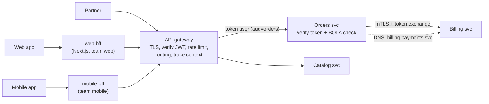
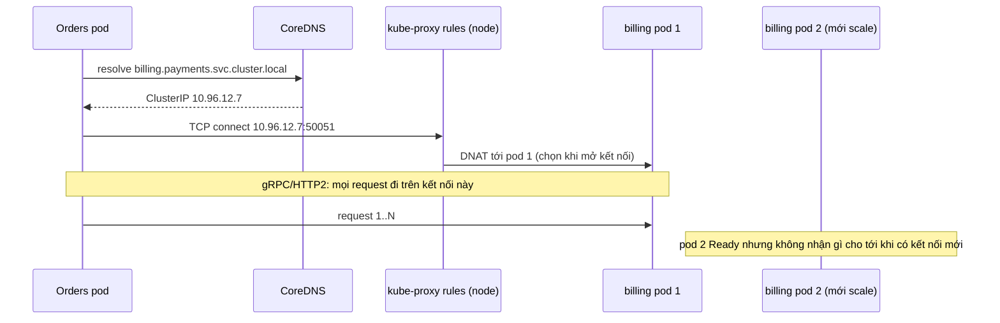

## Bối cảnh & vấn đề

Một hệ thống có 15 service. Ban đầu, app mobile gọi thẳng từng service: 5 call để vẽ màn hình chủ, mỗi service tự kiểm tra token theo cách riêng, URL của service được hard-code trong app. Khi một service đổi địa chỉ, phải phát hành bản app mới. Team quyết định thêm một API gateway. Một năm sau, gateway chứa 3.000 dòng plugin Lua: ghép response, tính phí vận chuyển, áp mã giảm giá cho đối tác. Mọi team phải sửa gateway để ra feature, và gateway thành **monolith mới** mà không ai sở hữu.

Ở phía sau, các service tìm nhau qua Kubernetes Service. Một service gRPC mới được deploy với 6 pod, nhưng dashboard cho thấy một pod nhận 90% traffic, năm pod còn lại gần như rảnh. Và một bài pentest phát hiện service Orders tin header `x-user-id` do gateway gắn, nên ai vào được mạng nội bộ chỉ cần tự gắn header là đọc được đơn của người khác.

Bài này phân định vai trò của các thành phần "ở giữa": gateway, BFF, service discovery, service mesh, và vị trí đúng của authentication và authorization trong một hệ microservices.

## Khái niệm

### API gateway

**API gateway** là điểm vào chung cho client bên ngoài. Nó làm các việc **cross-cutting**: routing theo path/host/header, TLS termination, xác thực token (verify chữ ký, hạn, audience), rate limit và quota, giới hạn kích thước request, CORS, request id/trace context, logging, và canary routing. Ví dụ: Kong, AWS API Gateway, NGINX, Envoy Gateway.

Gateway **không nên** chứa **business logic**, orchestration phức tạp, hay biến đổi dữ liệu nghiệp vụ. Khi gateway biết "phí ship tính thế nào", nó thành nơi mọi team phải sửa, mỗi thay đổi nghiệp vụ cần release gateway, và nó lặp lại sai lầm của ESB thời SOA ("smart pipes"). Gateway cũng là **single point of failure** và điểm nghẽn tiềm năng: cần HA (nhiều instance, nhiều AZ), timeout cho mọi upstream, và cấu hình được quản lý như code (review, version, rollback).

**Interview angle:** follow-up "authorization nằm ở gateway hay service?" là cái bẫy; gateway làm được coarse-grained (token hợp lệ, có scope `orders:read`), còn object-level ("user này có quyền với đơn 42 không") thuộc về service.

### Backend for Frontend (BFF)

**BFF** (Sam Newman) là backend riêng cho **từng loại client**: web, mobile, partner API. Nó gom và ghép nhiều call downstream thành một response đúng hình dạng màn hình cần, cắt payload cho mobile, xử lý session/cookie cho web, và thường được **team frontend sở hữu**, để họ đổi API theo màn hình mà không cần chờ team backend. Next.js Route Handlers và Server Components thường đóng vai BFF cho web.

BFF đáng khi các client có nhu cầu rất khác nhau, hoặc khi một màn hình cần dữ liệu từ nhiều service. Không đáng khi chỉ có một client đơn giản (gateway là đủ). Rủi ro chính: **domain logic trôi vào BFF** ("đơn được huỷ nếu chưa giao và dưới 24 giờ" viết ở cả web-bff lẫn mobile-bff), rồi hai BFF lệch nhau. Quy tắc giữ BFF mỏng: BFF chỉ **ghép, định dạng, cắt** dữ liệu; mọi quyết định nghiệp vụ là một API của service sở hữu (`GET /orders/42/cancellable` hoặc field `cancellable` trong response), và BFF chỉ hiển thị.

### Service discovery

**Service discovery** là cách tìm địa chỉ các instance **đang sống** của một service khi IP thay đổi liên tục (autoscale, redeploy, node chết). **Client-side discovery**: client hỏi registry (Consul, Eureka) danh sách instance rồi tự chọn và load balance. **Server-side discovery**: client gọi một địa chỉ ổn định (load balancer, DNS ảo), và tầng hạ tầng chọn instance.

**Kubernetes** dùng server-side discovery. Một `Service` có tên DNS ổn định (`billing.payments.svc.cluster.local`, rút gọn `billing.payments` trong cluster) trỏ tới một **ClusterIP** ảo; kube-proxy (chế độ iptables, IPVS, hoặc nftables ở các bản mới, verify) hoặc một dataplane eBPF như Cilium chuyển kết nối tới ClusterIP sang một Pod trong danh sách **EndpointSlice**. Chỉ Pod **Ready** (readiness probe pass) có mặt trong danh sách đó. **Headless Service** (`clusterIP: None`) trả trực tiếp IP của từng Pod qua DNS, dành cho client muốn tự load balance (gRPC, database cluster).

### Vì sao gRPC phá load balancing của Service

kube-proxy cân bằng tải ở **tầng kết nối (L4)**: nó chọn Pod khi **mở kết nối TCP**, không phải cho từng request. HTTP/1.1 với nhiều kết nối ngắn trải đều; nhưng gRPC dùng HTTP/2 với **một kết nối sống lâu** và multiplex mọi request lên đó. Client mở kết nối một lần, kube-proxy chọn một Pod, và mọi request đi vào Pod đó tới khi kết nối đứt. Pod mới scale lên không nhận traffic vì không ai mở kết nối mới tới nó.

Cách sửa: load balancing **theo request (L7)**, bằng client-side LB của gRPC với headless Service (client resolve mọi IP Pod và round-robin), bằng một proxy L7 (Envoy, mesh sidecar), hoặc ít nhất giới hạn tuổi kết nối (`MAX_CONNECTION_AGE` phía server) để client định kỳ kết nối lại.

### Service mesh

**Service mesh** gồm **data plane** (proxy chặn mọi traffic giữa service: sidecar Envoy trong mỗi Pod như Istio cổ điển, linkerd2-proxy của Linkerd, hoặc mô hình không sidecar như Istio ambient với ztunnel theo node và waypoint proxy L7 tuỳ chọn) và **control plane** (phân phối cấu hình, cấp chứng chỉ). Nó lo, mà không sửa code: **mTLS** tự động giữa service (danh tính workload, mã hoá), retry/timeout, circuit breaking/outlier detection, traffic shifting (canary theo trọng số, mirror), L7 load balancing (giải quyết vấn đề gRPC ở trên), telemetry đồng nhất, và authorization policy giữa service.

Đáng khi: nhiều service, **nhiều ngôn ngữ** (không muốn viết lại thư viện resilience cho mỗi ngôn ngữ), yêu cầu zero-trust/mTLS, cần canary tinh vi. Không đáng khi: vài service một ngôn ngữ, đã có thư viện HTTP client chuẩn và gateway. Chi phí: thêm latency mỗi hop và tài nguyên cho proxy, thêm một tầng phải vận hành và debug, và một cái bẫy tinh vi: **retry ở mesh cộng với retry ở code**.

**Interview angle:** câu "app retry và mesh cũng retry, chuyện gì xảy ra khi outage?" chờ phép nhân: số lần thử nhân qua từng tầng, và cách sửa là chỉ retry ở một tầng với retry budget.

### Authentication và authorization

**Authentication** ở edge: gateway hoặc BFF xác thực token của user (verify chữ ký với JWKS của IdP, `exp`, `iss`, `aud`). Danh tính được truyền xuống bằng **token** (JWT đã ký, hoặc một token mới đổi qua **token exchange** RFC 8693 cho từng hop với audience hẹp), **không** bằng header `x-user-id` mà service tin mù quáng; mạng nội bộ không phải vùng tin cậy (**zero trust**).

Mỗi service vẫn **tự verify** token (chữ ký, audience của chính nó, hạn) và làm **authorization nghiệp vụ**, đặc biệt **object-level**: user có quyền với đơn 42 không? Gateway không biết đơn 42 thuộc về ai. Lỗi thiếu kiểm tra này là **BOLA** (Broken Object Level Authorization), mục số 1 của OWASP API Security Top 10 (2023). **Service-to-service**: mTLS (thường do mesh cấp) để xác thực workload, hoặc OAuth client credentials cho call không mang ngữ cảnh user.

## Cơ chế hoạt động

Vị trí của từng thành phần trên đường request:



Gateway là cửa vào và làm việc chung cho mọi client. BFF đứng trước (hoặc sau, tuỳ kiến trúc) gateway và phục vụ một loại client. Service sở hữu quyết định nghiệp vụ và quyền theo object. Call giữa service đi qua DNS của Kubernetes Service, được xác thực bằng mTLS và mang token của user (đã đổi audience) khi call nhân danh user.

Kubernetes Service discovery và giới hạn của L4:



Lựa chọn Pod xảy ra một lần mỗi kết nối. Với HTTP/1.1 nhiều kết nối, phân phối đều; với một kết nối HTTP/2 sống lâu, toàn bộ traffic của một client dồn vào một Pod. Đó là lý do cần L7 load balancing cho gRPC.

## Ví dụ thực tế

### Edge authentication, service authorization, BOLA

jose 6.2 với khoá ES256, hai phiên bản service Orders bằng Express 5.2. Bản "naive" tin `x-user-id`; bản "hard" tự verify token với audience của nó và kiểm tra owner của object:

```ts
hard.get("/orders/:id", async (req, res) => {
  try {
    const token = (req.header("authorization") ?? "").replace(/^Bearer /, "");
    const { payload } = await jwtVerify(token, jwks, {
      issuer: "https://idp.example", audience: "orders-svc", algorithms: ["ES256"],
    });
    const order = orders[req.params.id];
    if (!order) return res.status(404).end();
    if (order.ownerId !== payload.sub) return res.status(404).json({ error: "not found" }); // BOLA check
    res.json({ order });
  } catch (e: any) { res.status(401).json({ error: e.code ?? e.message }); }
});
```

```text
naive, direct call, spoofed x-user-id=u2 : 200 {"servedTo":"u2","order":{"id":"o2","ownerId":"u2","total":999}}
hard,  u1 token, own order o1            : 200 {"order":{"id":"o1","ownerId":"u1","total":120}}
hard,  u1 token, someone else's o2 (BOLA): 404 {"error":"not found"}
hard,  token for another audience        : 401 {"error":"ERR_JWT_CLAIM_VALIDATION_FAILED"}
hard,  expired token                     : 401 {"error":"ERR_JWT_EXPIRED"}
hard,  no token, x-user-id=u1            : 401 {"error":"ERR_JWS_INVALID"}
```

Bản naive trả đơn của u2 cho bất kỳ ai gọi thẳng vào service với header tự gắn: một pod bị chiếm, một SSRF, hay một dev tò mò là đủ. Bản hard từ chối token dành cho service khác (audience sai), token hết hạn, và không có token. Quan trọng nhất là dòng BOLA: token hợp lệ của u1, scope đúng, gateway cho qua, nhưng đơn o2 không thuộc u1 nên trả 404 (không trả 403 để không lộ rằng đơn tồn tại). Gateway không thể làm kiểm tra này vì nó không biết `ownerId` của đơn.

### Retry ở app cộng retry ở mesh

Chuỗi A → (proxy "mesh") → B → C, trong đó C đang trả 503. Mỗi tầng thử tối đa 3 lần (một lần đầu + 2 retry):

```ts
const withRetry = async (url: string, attempts: number) => {
  let last = 0;
  for (let i = 0; i < attempts; i++) { last = (await fetch(url)).status; if (last < 500) break; }
  return last;
};
```

```text
A=3 mesh=3 B=3 attempts -> 1 user request = 27 requests to C (status 503)
A=1 mesh=3 B=1 attempts -> 1 user request = 3 requests to C (status 503)
```

Một request của user thành 3 × 3 × 3 = **27** request tới C, đúng lúc C đang quá tải; với bốn tầng là 81. Chỉ retry ở một tầng (ở đây là mesh, gần dependency nhất) đưa con số về 3. Cách làm đúng: chọn **một** tầng retry cho mỗi hop, dùng **retry budget** (ví dụ retry không vượt 10–20% số request) thay vì số lần cố định, backoff có jitter, và chỉ retry thao tác idempotent. Envoy/Istio có retry mặc định trên một số lỗi (verify theo phiên bản), nên khi bật mesh phải xem lại retry trong code.

### Cấu hình Kubernetes cho gRPC (minh hoạ)

```yaml
# Headless Service: DNS trả IP từng pod, client gRPC tự round-robin
apiVersion: v1
kind: Service
metadata: { name: billing-grpc, namespace: payments }
spec:
  clusterIP: None
  selector: { app: billing }
  ports: [{ name: grpc, port: 50051 }]
```

```ts
// @grpc/grpc-js client: resolve all pod IPs via DNS and balance per request
const client = new BillingClient("dns:///billing-grpc.payments.svc.cluster.local:50051",
  credentials.createInsecure(), { "grpc.service_config": JSON.stringify({ loadBalancingConfig: [{ round_robin: {} }] }) });
```

Client cần re-resolve DNS khi pod thay đổi (grpc-js làm khi kết nối lỗi; kết hợp `MAX_CONNECTION_AGE` phía server để kết nối được làm mới định kỳ). Nếu đã có mesh, nó cân bằng theo request ở proxy và không cần headless Service.

## Trade-offs & lựa chọn thay thế

| Thành phần | Làm tốt | Không nên làm | Rủi ro |
| --- | --- | --- | --- |
| API gateway | Routing, TLS, authn, rate limit, CORS, trace, canary | Business logic, orchestration phức tạp | SPOF, thành "ESB" mọi team phải sửa |
| BFF | Ghép/định dạng cho một client, team frontend tự chủ | Quyết định nghiệp vụ | Logic trùng lặp giữa các BFF |
| K8s Service (L4) | Discovery + LB đơn giản, có sẵn | LB theo request cho HTTP/2/gRPC | Dồn traffic vào một pod |
| Client-side LB (headless) | LB theo request, không thêm hop | Đồng nhất giữa nhiều ngôn ngữ | Mỗi ngôn ngữ cấu hình riêng |
| Service mesh | mTLS, L7 LB, retry/timeout, telemetry không sửa code | Thay thế thiết kế đúng | Latency, tài nguyên, thêm tầng debug, retry nhân bản |
| Thư viện trong code | Kiểm soát chi tiết, không thêm hạ tầng | Polyglot đồng nhất | Mỗi service tự làm, dễ lệch |

Chọn thế nào. Hầu hết hệ thống cần **gateway** ngay khi có client bên ngoài. Thêm **BFF** khi có từ hai loại client với nhu cầu khác nhau rõ, và giao nó cho team frontend với quy tắc "BFF không quyết định nghiệp vụ". Với vài service một ngôn ngữ, **thư viện HTTP client chuẩn** (timeout, retry budget, trace) + gateway là đủ. Cân nhắc **mesh** khi số service và số ngôn ngữ tăng, khi cần mTLS toàn hệ thống, hoặc khi gRPC cần L7 LB; bắt đầu với mô hình nhẹ (Linkerd, hoặc Istio ambient chỉ L4 mTLS) và thêm L7 khi cần. Ở mọi lựa chọn, authorization theo object luôn ở trong service.

## Edge cases & failure modes

- **Gateway thành monolith**: plugin ghép response và tính phí; mỗi feature cần release gateway. Đưa logic về service hoặc BFF.
- **Gateway là SPOF**: một instance, không timeout upstream; một upstream chậm làm cạn worker của gateway và sập mọi route.
- **Liveness/readiness sai**: Pod chưa warm nhưng readiness pass, nhận traffic và lỗi; hoặc readiness check DB làm mọi Pod rút khỏi Endpoint cùng lúc khi DB chập chờn ([bài 10](/tracks/microservices/learn/observability-health)).
- **DNS caching ở client**: client cache IP của headless Service quá lâu, gọi vào pod đã chết.
- **Long-lived connection**: gRPC hoặc HTTP keep-alive dồn traffic vào pod cũ sau khi scale; pod mới rảnh.
- **Token được forward nguyên vẹn qua mọi hop**: token có audience rộng; một service bị chiếm dùng nó gọi mọi service khác. Token exchange với audience hẹp cho từng hop.
- **Trust header nội bộ**: `x-user-id`, `x-roles` do gateway gắn nhưng service không kiểm chứng; bất kỳ ai trong mạng nội bộ đều giả được.
- **Retry ở nhiều tầng**: client, gateway, mesh và code cùng retry; một sự cố nhỏ thành retry storm.

## Pitfalls

- ❌ Đặt business logic trong gateway → ✅ gateway chỉ cross-cutting; logic ở service, ghép dữ liệu cho màn hình ở BFF.
- ❌ BFF quyết định nghiệp vụ (ai được huỷ đơn) → ✅ service trả quyết định (`cancellable`), BFF chỉ hiển thị.
- ❌ Chỉ xác thực ở gateway, service tin header → ✅ service tự verify token với audience của nó, mạng nội bộ không phải vùng tin cậy.
- ❌ Nghĩ gateway chặn được BOLA → ✅ kiểm tra quyền theo object trong service sở hữu object.
- ❌ gRPC qua ClusterIP Service rồi thắc mắc vì sao một pod nóng → ✅ L7 LB: client-side với headless Service, hoặc mesh/proxy.
- ❌ Bật mesh mà giữ nguyên retry trong code → ✅ một tầng retry mỗi hop, có retry budget.
- ❌ Dùng mesh để chữa thiết kế sai (chatty, chuỗi sync dài) → ✅ mesh enforce chính sách; thiết kế ranh giới vẫn phải đúng.

## Tóm tắt

- Gateway: điểm vào chung, làm routing, TLS, authn, rate limit, CORS, trace, canary; không chứa business logic; cần HA và config-as-code.
- BFF: backend riêng cho từng loại client, team frontend sở hữu, chỉ ghép/định dạng; quyết định nghiệp vụ ở service.
- Kubernetes Service: DNS ổn định → ClusterIP → Pod Ready qua EndpointSlice; headless Service trả IP từng Pod.
- Load balancing L4 chọn Pod theo kết nối; gRPC/HTTP2 long-lived connection dồn traffic vào một Pod, cần L7 LB.
- Service mesh: data plane (sidecar hoặc ambient) + control plane; mTLS, L7 LB, retry, telemetry; đáng khi nhiều service/ngôn ngữ hoặc cần zero trust.
- Retry nhân qua các tầng (3 × 3 × 3 = 27); chỉ retry ở một tầng với budget.
- Authn ở edge, mỗi service vẫn verify token và làm authorization theo object (BOLA); service-to-service dùng mTLS hoặc client credentials, token exchange cho audience hẹp.
