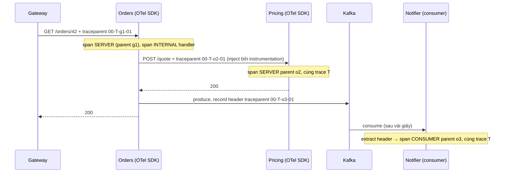
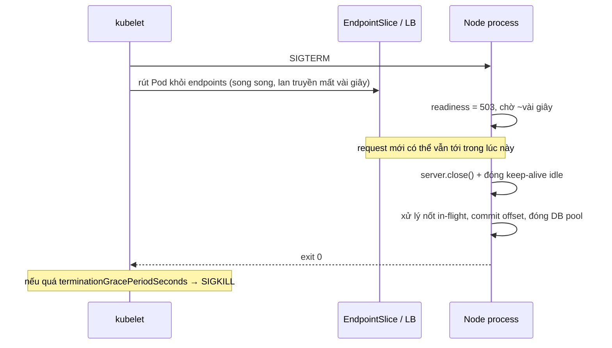

## Bối cảnh & vấn đề

Một khách hàng báo "thanh toán treo rồi báo lỗi". Trong monolith, bạn mở log, tìm theo user id, thấy một stack trace. Trong hệ 15 service, request đó đi qua gateway, BFF, Orders, Payments, một consumer Kafka và một provider bên ngoài. Mỗi service có log riêng, đồng hồ lệch nhau vài trăm ms, và không có gì nối các dòng log lại với nhau. Ba team mỗi team nhìn log của mình và kết luận "phía tôi ổn".

Cùng tuần đó, một DB failover kéo dài 30 giây. Liveness probe của Orders gọi `SELECT 1`, nên kubelet **restart toàn bộ** 12 pod Orders cùng lúc; khi DB trở lại, cả 12 pod đang khởi động lại, cache lạnh, và sự cố 30 giây thành 4 phút. Và mỗi lần deploy, một vài request lỗi `ECONNRESET` vì pod bị tắt khi đang xử lý.

Ba vấn đề, một chủ đề: microservices cần **quan sát được** (biết request đi đâu, chậm ở đâu) và **vận hành được** (platform biết khi nào pod sẵn sàng, khi nào phải restart, và tắt nó thế nào cho êm). Bài này đi qua distributed tracing với OpenTelemetry, health probes, và các nguyên tắc twelve-factor biến một process Node thành một "công dân tốt" trên Kubernetes.

## Khái niệm

### Trace, span và trace context

Một **trace** là toàn bộ hành trình của một request qua hệ thống, định danh bằng **trace id** (16 byte, 32 ký tự hex). Mỗi đơn vị công việc trong đó là một **span**: có span id, **parent span id**, tên, thời điểm bắt đầu/kết thúc, kind (server, client, producer, consumer, internal), status và attributes (`http.route`, `db.statement`, `messaging.destination`). Span tạo thành cây; backend (Jaeger, Tempo, X-Ray, Datadog) vẽ cây đó thành biểu đồ waterfall.

**Trace context** được truyền giữa process bằng header chuẩn **W3C `traceparent`**: `00-<trace-id>-<parent-span-id>-<flags>`, ví dụ `00-4bf92f3577b34da6a3ce929d0e0e4736-00f067aa0ba902b7-01` (flag `01` = sampled). Header `tracestate` mang thông tin riêng của vendor. Service nhận header, tạo span server con với parent là span id trong header, và giữ nguyên trace id. Qua Kafka, cùng thông tin đó đi trong **record headers**.

**Correlation id** là khái niệm cũ hơn và đơn giản hơn: một id gắn vào mọi log của một request. Khi đã có tracing, dùng chính **trace id** làm correlation id và ghi nó vào mọi dòng log JSON, để từ một trace nhảy sang log và ngược lại.

### OpenTelemetry trong Node

**OpenTelemetry (OTel)** là chuẩn mở (CNCF) cho traces, metrics và logs: API, SDK cho từng ngôn ngữ, giao thức **OTLP**, và **Collector** (nhận, xử lý, sampling, export tới backend). Trong Node, SDK cùng **instrumentation** tự động patch thư viện (http, express, pg, ioredis, kafkajs...) để tạo span và inject/extract context mà không sửa code nghiệp vụ.

Ngữ cảnh "span hiện tại" trong Node được giữ bằng **AsyncLocalStorage**, đi theo chuỗi async (promise, timer, callback). Hai cách trace bị đứt phổ biến: thư viện **không được instrument** (ví dụ `fetch` của Node chạy trên undici, không phải module `http`, nên cần instrumentation undici riêng), và code chạy **ngoài** ngữ cảnh của request (consumer đọc message rồi xử lý mà không extract context từ header; pool/queue tự viết giữ callback và chạy chúng trong ngữ cảnh khác).

### Sampling

Giữ 100% trace ở quy mô lớn rất đắt. **Head-based sampling** quyết định ngay ở span đầu tiên (ví dụ giữ 5%, theo trace id để mọi service quyết định giống nhau), rồi truyền quyết định qua flag `sampled`. Rẻ và đơn giản, nhưng **bỏ lỡ lỗi hiếm**: một lỗi xảy ra 1/10.000 request gần như không bao giờ có trace. **Tail-based sampling** (ở Collector) buffer mọi span của một trace tới khi trace kết thúc, rồi quyết định: giữ mọi trace có lỗi hoặc chậm hơn ngưỡng, và một tỉ lệ nhỏ trace bình thường. Bắt được lỗi hiếm, nhưng tốn memory ở Collector, cần mọi span của một trace về cùng một instance Collector (load balancing theo trace id), và thêm độ trễ trước khi trace hiện ra.

**Interview angle:** câu "head vs tail, cái nào bắt lỗi hiếm tốt hơn và với giá nào?" chờ đúng hai ý: tail bắt tốt hơn, đổi lại memory/độ phức tạp ở Collector và routing theo trace id.

### Liveness, readiness và startup probe

Kubernetes có ba loại probe với hậu quả khác nhau. **Readiness** fail → Pod bị **rút khỏi Service endpoints** (không nhận traffic mới) nhưng **không restart**. Dùng cho: đang warm cache, dependency thiết yếu tạm không sẵn sàng, đang shutdown. **Liveness** fail (liên tiếp `failureThreshold` lần) → kubelet **restart container**. Chỉ dùng để phát hiện process **kẹt** (deadlock, event loop treo), và **không** check DB hay dependency: nếu không, một sự cố DB làm restart cả fleet, biến sự cố tạm thời thành mất cache, mất kết nối, và có thể restart loop. **Startup** probe bảo vệ app khởi động chậm: liveness và readiness chỉ bắt đầu chạy sau khi startup probe thành công lần đầu.

**Interview angle:** câu "liveness check DB, DB failover 30 giây thì sao?" chờ chuỗi hậu quả: probe fail → mọi Pod restart cùng lúc → cache lạnh và cold start khi DB vừa về → thời gian sự cố kéo dài, có thể CrashLoopBackOff.

### Twelve-factor cho service Node

Ba nguyên tắc của **Twelve-Factor App** quan trọng nhất cho microservices. **Config qua environment**: không hard-code URL, credentials theo môi trường; secret đến từ secret manager và được inject lúc chạy. **Stateless processes**: không giữ session, file upload, hay state cần bền trong memory/đĩa cục bộ; dùng Redis, S3, DB, để pod có thể bị giết, scale, hay thay bất cứ lúc nào. **Logs là event stream** ra stdout (JSON có trace id), platform thu gom; app không tự quản lý file log. Thêm **disposability**: khởi động nhanh, và **shutdown graceful** khi nhận SIGTERM. Và **dev/prod parity**: backing service (Postgres, Kafka) giống nhau giữa môi trường, gắn qua config.

### Graceful shutdown dưới Kubernetes

Khi Pod bị xoá (deploy, scale down, node drain), Kubernetes làm **song song** hai việc: gửi SIGTERM cho container và rút Pod khỏi EndpointSlice. Vì việc rút endpoint lan tới mọi node và load balancer cần thời gian, trong vài giây đầu sau SIGTERM Pod **vẫn có thể nhận request mới**. Graceful shutdown đúng: khi nhận SIGTERM, cho readiness fail, **chờ một khoảng ngắn** (hoặc dùng `preStop` hook sleep) để endpoint cập nhật, rồi ngừng nhận kết nối mới, xử lý nốt request đang chạy, đóng keep-alive connection, đóng DB pool và consumer Kafka (commit offset), rồi thoát. Tất cả phải xong trước `terminationGracePeriodSeconds` (mặc định 30 giây), sau đó kubelet gửi SIGKILL.

## Cơ chế hoạt động

Một trace đi qua HTTP và Kafka:



Mỗi hop làm hai việc: **extract** context từ header đến (tạo span con), và **inject** context hiện tại vào header đi. Với HTTP, instrumentation làm cả hai tự động. Với Kafka, instrumentation của client (kafkajs, confluent) làm tự động nếu được cài; nếu bạn tự viết consumer, phải gọi `propagation.extract` và tạo span với context đó. Thiếu bất kỳ mắt xích nào, trace bị **cắt thành hai trace** không liên quan.

Vòng đời Pod khi bị xoá và vai trò của probe:



Khoảng chờ sau SIGTERM tồn tại vì hai việc chạy song song: nếu process đóng server ngay lập tức, những request được route tới nó trước khi endpoint cập nhật sẽ gặp connection refused.

## Ví dụ thực tế

### OpenTelemetry: một trace qua hai service và một "Kafka"

Hai process Node 24 (Orders và Pricing), SDK `@opentelemetry/sdk-node` 0.222, instrumentation http 0.222, express 0.70, undici 0.32, exporter tự viết in mỗi span một dòng. Orders gọi Pricing bằng `fetch`, rồi "produce" một record với header được inject; một consumer xử lý record sau đó, ngoài ngữ cảnh request:

```ts
// producer side, inside the request handler
const headers: Record<string, string> = {};
propagation.inject(context.active(), headers);
queue.push({ headers, value: JSON.stringify({ type: "OrderViewed", id: req.params.id }) });

// consumer side, later, outside any request context
const parent = withExtract ? propagation.extract(ROOT_CONTEXT, rec.headers) : ROOT_CONTEXT;
tracer.startActiveSpan("orders.events process", { kind: SpanKind.CONSUMER }, parent, (span) => span.end());
```

Output thật, có instrumentation undici (kind: 0 internal, 1 server, 2 client, 4 consumer; rút gọn một request):

```text
[pricing] incoming traceparent: 00-4242a90b54e08038050ca6275bcf8214-7020a81e898bdb05-01
[pricing] trace=4242a90b54e08038050ca6275bcf8214 span=a1dd5862b01b7b88 parent=7020a81e898bdb05 kind=1 POST /quote
[orders] record headers: {"traceparent":"00-4242a90b54e08038050ca6275bcf8214-044731287b1abdd2-01"}
[orders] trace=4242a90b54e08038050ca6275bcf8214 span=7020a81e898bdb05 parent=044731287b1abdd2 kind=2 POST
[orders] trace=4242a90b54e08038050ca6275bcf8214 span=062362b19617d397 parent=cd408e260a8f2b3d kind=1 GET /orders/:id
[orders] trace=4242a90b54e08038050ca6275bcf8214 span=044731287b1abdd2 parent=062362b19617d397 kind=0 request handler - /orders/:id
[orders] trace=4242a90b54e08038050ca6275bcf8214 span=1c3ec19e5b9a544e parent=044731287b1abdd2 kind=4 orders.events process (extract)
[orders] trace=36647de1b192918455edaba440fb1f49 span=8319f18945a4f13a parent=---------------- kind=4 orders.events process (no extract)
```

Cùng trace id `4242a9...` xuyên Orders, Pricing và consumer: span client `POST` của Orders (`7020a8...`) là parent của span server ở Pricing. Consumer có `extract` nối vào đúng trace; consumer **không** extract bắt đầu một trace mới (`36647d...`) dù cùng xử lý record đó.

Cùng code, **bỏ** instrumentation undici (chỉ có instrumentation http):

```text
[pricing] incoming traceparent: (none)
[pricing] trace=43cd4f9ada8e8dac7a4e0fc663a1b786 span=c1fb34054f132454 parent=---------------- kind=1 POST /quote
[orders] trace=0b6deee4026958a031ef627181b35f64 span=200347255932185e parent=---------------- kind=1 GET /orders/:id
```

Pricing không nhận `traceparent` và mở trace riêng (`43cd4f...`), khác trace của Orders (`0b6dee...`). Không có lỗi, không có cảnh báo: trace chỉ âm thầm bị cắt đôi. Đây là cái bẫy thực tế khi chuyển từ `axios`/`http` sang `fetch` có sẵn của Node: cần `@opentelemetry/instrumentation-undici` (có trong bộ `auto-instrumentations-node`, verify theo phiên bản).

### Graceful shutdown và cái bẫy keep-alive

Express 5.2 với readiness chuyển 503 khi SIGTERM, chờ 300 ms (thay cho preStop), rồi `server.close()`. Một driver gửi request chậm 1,5 giây, gửi SIGTERM giữa chừng, gọi `/readyz` bằng `fetch` (keep-alive), rồi thử một request mới:

```ts
process.on("SIGTERM", async () => {
  shuttingDown = true;                                   // /readyz -> 503
  await sleep(300);                                      // let endpoints update (preStop-like)
  server.close(() => { closeDbPool(); process.exit(0); });
  server.closeIdleConnections();
  setInterval(() => server.closeIdleConnections(), 100).unref(); // keep-alive sockets that become idle later
  setTimeout(() => process.exit(1), 10_000).unref();     // hard stop before SIGKILL
});
```

Không có dòng `setInterval` (output thật):

```text
 1026ms SIGTERM: readiness -> 503, waiting for endpoints to update
client: GET /readyz -> 503 draining
client: slow request -> 200 {"done":true}
client: new request after close -> 200
 5541ms server closed: in-flight done, closing DB pool
```

Có dòng `setInterval`:

```text
  999ms SIGTERM: readiness -> 503, waiting for endpoints to update
client: GET /readyz -> 503 draining
client: slow request -> 200 {"done":true}
 2311ms server closed: in-flight done, closing DB pool
client: new request after close -> ECONNREFUSED
```

Request chậm hoàn tất trong cả hai trường hợp (in-flight được xử lý nốt). Nhưng ở bản đầu, kết nối keep-alive (của `/readyz` và của request chậm) trở thành idle **sau** khi `closeIdleConnections()` đã chạy, nên server sống thêm tới hết `keepAliveTimeout` 5 giây của Node, và trong lúc đó vẫn phục vụ một request mới trên kết nối cũ (`200` sau khi đã "close"). Với `terminationGracePeriodSeconds` ngắn, đây là cách request bị SIGKILL cắt ngang. Đóng các kết nối trở thành idle (hoặc gửi `Connection: close` trên response trong lúc draining) cho shutdown sạch sau 1,3 giây.

### Probe và Deployment (minh hoạ)

```yaml
containers:
  - name: orders
    image: registry.example/orders:1.14.2
    ports: [{ containerPort: 8080 }]
    startupProbe:   { httpGet: { path: /livez, port: 8080 }, periodSeconds: 2, failureThreshold: 30 }  # up to 60s to boot
    livenessProbe:  { httpGet: { path: /livez, port: 8080 }, periodSeconds: 10, failureThreshold: 3 } # process alive only
    readinessProbe: { httpGet: { path: /readyz, port: 8080 }, periodSeconds: 5, failureThreshold: 2 } # can serve now
    lifecycle: { preStop: { exec: { command: ["sleep", "5"] } } }   # needs `sleep` in the image
    env:
      - { name: DATABASE_URL, valueFrom: { secretKeyRef: { name: orders-db, key: url } } }
terminationGracePeriodSeconds: 30
```

`/livez` chỉ trả lời "event loop còn chạy" (không gọi DB). `/readyz` kiểm tra những gì cần để phục vụ **ngay bây giờ**: đã warm xong, không đang shutdown, và có thể là dependency thiết yếu, nhưng cẩn thận: nếu mọi Pod cùng check một DB, DB chập chờn làm **mọi** Pod rút khỏi Service cùng lúc, và không còn ai trả được lỗi có nghĩa. Nhiều team chỉ để readiness phản ánh trạng thái của chính process và để circuit breaker xử lý dependency.

### Lỗi chỉ xảy ra trên một số pod sau deploy

Triệu chứng: sau khi deploy v1.15, khoảng 3% request lỗi, chỉ khi rơi vào một số pod. Quy trình (minh hoạ):

```text
1. Lọc error rate theo label version/pod (service.version trong OTel resource, label app.kubernetes.io/version).
   → lỗi chỉ ở pod v1.15, hoặc chỉ ở pod v1.14 sau khi v1.15 lên?
2. Nếu chỉ ở v1.14 sau khi v1.15 lên: v1.15 ghi dữ liệu (cache, event, cột DB, session) mà v1.14 không đọc được.
   → bản cũ phải đọc được dữ liệu của bản mới (forward compatible), không chỉ ngược lại.
3. Nếu chỉ ở v1.15: so config/secret giữa pod (env khác, secret chưa mount), pod chưa warm, readiness pass quá sớm.
4. Giới hạn: canary 1-5% với auto-rollback theo error rate/latency (Argo Rollouts, Flagger), feature flag
   tách deploy khỏi release, rollback bằng image trước.
```

Câu follow-up "vì sao bản mới phải đọc được dữ liệu do bản **tiếp theo** ghi?" có câu trả lời ở rollback: nếu v1.16 ghi format mới rồi bị rollback về v1.15, v1.15 sẽ gặp dữ liệu đó. Expand/contract cho dữ liệu ([bài 6](/tracks/microservices/learn/backward-compatibility)) là cách đảm bảo điều này.

## Trade-offs & lựa chọn thay thế

| Lựa chọn | Ưu | Nhược | Dùng khi |
| --- | --- | --- | --- |
| Head sampling (theo trace id) | Rẻ, đơn giản, quyết định nhất quán | Bỏ lỡ lỗi hiếm | Traffic lớn, đủ thống kê |
| Tail sampling ở Collector | Giữ mọi trace lỗi/chậm | Memory, routing theo trace id, trễ | Cần debug lỗi hiếm |
| Auto-instrumentation | Không sửa code, phủ nhiều thư viện | Overhead, có thể thiếu thư viện (fetch/undici), span nhiễu | Mặc định |
| Span thủ công | Đúng nghiệp vụ, attributes giàu | Phải viết và duy trì | Bổ sung cho bước quan trọng |
| Readiness chỉ check process | Không sập dây chuyền khi dependency chập chờn | Pod nhận traffic dù dependency chết | Mặc định, kèm breaker |
| Readiness check dependency thiết yếu | Không nhận traffic khi chắc chắn lỗi | Mọi pod rút cùng lúc | Dependency riêng của từng pod |

| Probe | Fail thì | Kiểm tra gì | Không kiểm tra gì |
| --- | --- | --- | --- |
| Startup | Restart (sau threshold), chặn hai probe kia | App đã khởi động xong | Dependency |
| Liveness | Restart container | Process/event loop không kẹt | DB, dependency |
| Readiness | Rút khỏi endpoints, không restart | Sẵn sàng phục vụ ngay lúc này | Thứ khiến mọi pod rút cùng lúc |

Chọn thế nào. Bắt đầu với auto-instrumentation đầy đủ (gồm undici cho `fetch` và client Kafka), head sampling theo trace id ở tỉ lệ vừa phải, và ghi trace id vào mọi log. Khi cần bắt lỗi hiếm, chuyển sampling sang Collector với tail policy "giữ lỗi + chậm + x% còn lại". Probe: liveness rẻ và không dependency, readiness phản ánh khả năng phục vụ của chính pod, startup cho app khởi động chậm.

## Edge cases & failure modes

- **Trace đứt ở `fetch`**: thiếu instrumentation undici, downstream mở trace mới, không có lỗi nào báo.
- **Trace đứt ở consumer**: không extract header, hoặc batch consumer xử lý nhiều message với một span; dùng span link cho batch.
- **Header bị proxy lọc**: gateway hoặc proxy cũ bỏ header lạ, `traceparent` không tới service.
- **Tail sampling không đủ memory**: trace dài hoặc traffic spike làm Collector drop span; một trace mất nửa span khó dùng hơn không có.
- **High-cardinality trong metric**: dùng user id làm label metric làm nổ số time series; id đi vào trace/log, không vào label.
- **Liveness check DB**: DB failover 30 giây → restart toàn fleet → cache lạnh, kết nối mới dồn dập, sự cố kéo dài.
- **Liveness timeout quá ngắn với GC pause hoặc CPU throttle**: pod khoẻ bị restart lặp lại (CrashLoopBackOff).
- **Shutdown không chờ endpoint cập nhật**: request tới sau SIGTERM gặp connection refused; thêm preStop/sleep.
- **Keep-alive giữ server sống**: `server.close()` chờ kết nối idle tới hết `keepAliveTimeout`; đóng idle connection trong lúc draining.
- **State cục bộ**: session trong memory; pod bị thay khi deploy, user bị logout.

## Pitfalls

- ❌ Mỗi service log rời, không id chung → ✅ trace id trong mọi log JSON, propagate `traceparent` qua HTTP và Kafka header.
- ❌ Tin auto-instrumentation phủ mọi thứ → ✅ kiểm chứng trace liền mạch qua từng loại call (fetch, gRPC, Kafka, job nền).
- ❌ Head sampling 1% rồi thắc mắc không có trace của lỗi hiếm → ✅ tail sampling giữ mọi trace lỗi/chậm.
- ❌ Liveness check DB/dependency → ✅ liveness chỉ phát hiện process kẹt; dependency xử lý bằng readiness thận trọng và breaker.
- ❌ App khởi động chậm bị liveness giết trước khi sẵn sàng → ✅ startup probe với ngưỡng đủ dài.
- ❌ Thoát ngay khi nhận SIGTERM → ✅ readiness 503, chờ endpoint cập nhật, close server, đóng keep-alive, xử lý nốt, đóng pool.
- ❌ Config hard-code theo môi trường, session trong memory → ✅ config/secret qua environment, state ở Redis/DB/S3.

## Tóm tắt

- Trace = cây span cùng trace id; context đi qua W3C `traceparent` ở HTTP và record headers ở Kafka.
- OTel: SDK + instrumentation + OTLP + Collector; context trong Node giữ bằng AsyncLocalStorage.
- Trace đứt khi thư viện không được instrument (fetch cần undici instrumentation) hoặc consumer không extract context.
- Head sampling rẻ nhưng bỏ lỡ lỗi hiếm; tail sampling ở Collector giữ trace lỗi/chậm, đổi bằng memory và routing.
- Readiness fail rút khỏi traffic, liveness fail restart, startup bảo vệ khởi động chậm; liveness không check dependency.
- Twelve-factor: config qua env, stateless, log ra stdout có trace id, khởi động nhanh và shutdown graceful.
- Shutdown dưới K8s: readiness 503, chờ endpoint cập nhật, close server và keep-alive, xử lý nốt, đóng pool, trước grace period.
- Lỗi chỉ trên một số pod: lọc theo version/pod label, kiểm tra tương thích hai phiên bản, canary với auto-rollback.
