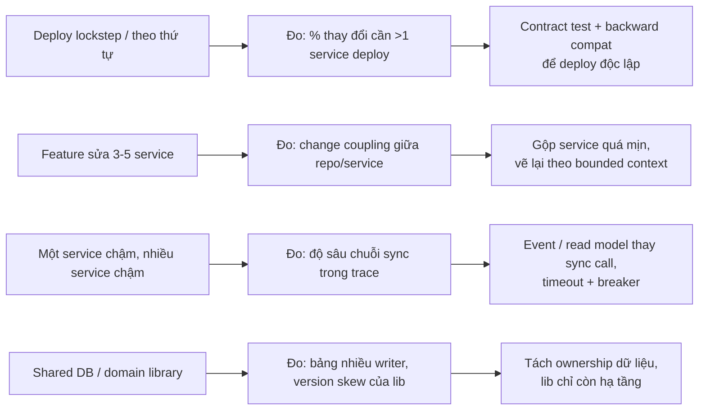
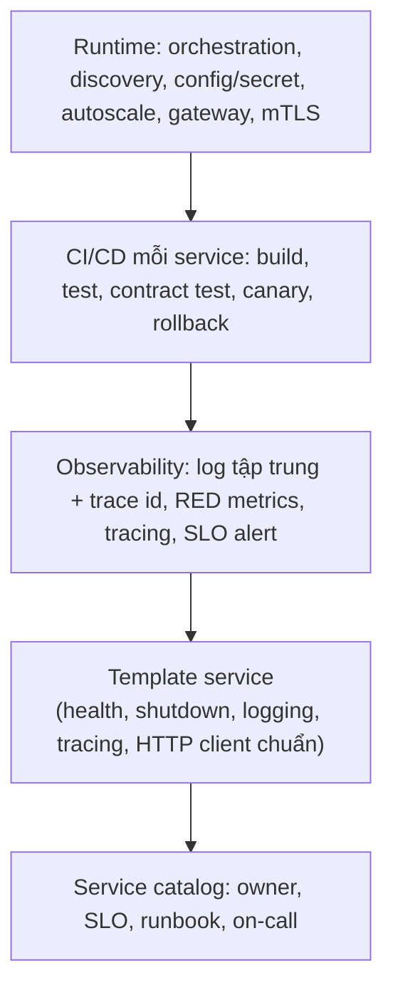

## Bối cảnh & vấn đề

Hai năm sau khi bắt đầu migration, một công ty có 22 service. Báo cáo cho ban lãnh đạo ghi "đã tách 22 service". Nhưng lead time của một thay đổi tăng từ 4 ngày lên 9 ngày, vì 60% feature chạm từ ba service trở lên, mỗi service một PR, và phải deploy theo thứ tự `customers` → `billing` → `orders`. Một thư viện `@acme/domain-models` chứa type `Order` dùng chung; mỗi lần thêm một field, cả 22 service phải nâng version. Khi `customers` chậm, 14 service khác chậm theo.

Đây là **distributed monolith**: có đủ chi phí của hệ phân tán (network, tracing, deploy pipeline, on-call nhiều nơi) mà không có lợi ích (deploy độc lập, cô lập lỗi, team tự chủ). Nó là kết cục phổ biến nhất của các migration thất bại, và nó thường không được phát hiện vì công ty đo **số service** thay vì đo **kết quả**.

Bài cuối của track gom các chủ đề "cấp tổ chức": nhận diện và thoát distributed monolith, ranh giới của shared library, khi nào gộp service lại, platform tối thiểu trước khi chạy nhiều service, cách đo migration có đáng không, và cách nhìn lại một migration của chính bạn một cách trung thực.

## Khái niệm

### Distributed monolith

**Distributed monolith** là hệ có nhiều service nhưng chúng **không độc lập**: không deploy, thay đổi, hay chạy được một mình. Triệu chứng đo được: phải **deploy nhiều service cùng lúc hoặc theo thứ tự**; **shared database** hoặc bảng mà nhiều service cùng ghi; một feature bình thường **sửa 3–5 service**; **chuỗi sync call dài** trên mỗi request; **shared domain library** khoá version giữa các service; một service chết **kéo sập** nhiều service khác; không thể test một service mà không dựng cả hệ.

Nguyên nhân gốc thường nằm ở bước đầu: chia theo entity hoặc layer thay vì bounded context ([bài 2](/tracks/microservices/learn/bounded-contexts)), tách service trước khi gỡ coupling dữ liệu ([bài 3](/tracks/microservices/learn/database-per-service)), dùng sync call cho mọi tương tác ([bài 8](/tracks/microservices/learn/sync-async-resilience)), và không có kỷ luật tương thích nên phải deploy lockstep ([bài 6](/tracks/microservices/learn/backward-compatibility)).

**Interview angle:** liệt kê triệu chứng là phần dễ; interviewer chờ bạn nói được **cách đo** từng triệu chứng (change coupling, tỉ lệ deploy phối hợp, độ sâu chuỗi call trong trace) và **thứ tự thoát**.

### Shared library: nên và không nên chia sẻ

Shared library tạo **coupling qua version**: nếu thư viện chứa model domain, đổi model buộc mọi service nâng cấp cùng lúc, và hai service chạy hai version khác nhau sẽ serialize/deserialize khác nhau. Model chung cũng **xoá ranh giới context**: "Order" của Billing và "Order" của Fulfilment lẽ ra khác nhau, nhưng thư viện ép chúng thành một. Và lỗi trong thư viện lan ra mọi nơi cùng lúc.

Nên chia sẻ: **hạ tầng và cross-cutting** (logger có format chuẩn, setup OpenTelemetry, HTTP client có timeout/retry budget mặc định, middleware xác thực token, health check, graceful shutdown), và **type sinh từ contract** (client sinh từ OpenAPI, type sinh từ Avro/Protobuf) có version theo contract. Không nên chia sẻ: entity domain, logic nghiệp vụ, "utils" chứa quy tắc giá hay thuế. Giữa các service, **trùng lặp rẻ hơn abstraction sai** (Sandi Metz): hai service có hai type `Customer` nhỏ, mỗi cái chỉ chứa field mình cần, tốt hơn một type chung 60 field.

Thư viện hạ tầng vẫn cần được phát hành như một sản phẩm: semver nghiêm túc, changelog, không breaking trong minor, và một cách **rollout nhanh** khi có bản vá bảo mật (bot mở PR nâng version cho mọi repo, CI chạy test, merge tự động khi xanh).

### Gộp service lại

Ranh giới là quyết định **có thể đảo ngược**, và gộp hai service là một kết quả hợp lệ, không phải thất bại. Tín hiệu nên gộp: hai service **luôn deploy cùng nhau**, **thay đổi cùng nhau** (change coupling cao), gọi nhau **chatty** trên mọi request, cùng tham gia một transaction nghiệp vụ mà saga giữa chúng không mang lại lợi ích gì, cùng một team sở hữu, hoặc chi phí vận hành lớn hơn lợi ích. Các trường hợp được công bố: Segment gộp hơn 100 service destination thành một (2018), Amazon Prime Video gộp một hệ giám sát chạy trên nhiều thành phần serverless thành một process và giảm chi phí khoảng 90% (2023) (verify chi tiết theo bài gốc).

Cách gộp: chuyển code thành **module** trong một service, **giữ ranh giới module** (public API, không truy cập nội bộ của nhau) để có thể tách lại; hợp nhất dữ liệu theo expand/contract; giữ **API bên ngoài ổn định** (consumer không cần biết hai service đã thành một).

### Platform tối thiểu

Mỗi service mới nhân chi phí vận hành, trừ khi chi phí đó được trả **một lần** bởi platform. Các năng lực cần có trước khi chạy nhiều service: **CI/CD** tự động cho từng service (build, test, contract test, deploy canary, rollback một lệnh); **observability** (log tập trung có trace id, metrics RED cho mỗi service, distributed tracing, alert theo SLO); **runtime** (container orchestration, service discovery, config/secret, autoscaling); **traffic** (gateway, mTLS hoặc xác thực service-to-service, rate limit); **template service** có sẵn health check, graceful shutdown, logging, tracing; **service catalog** ghi owner, on-call, SLO, runbook. Platform team cung cấp những thứ này như một **sản phẩm nội bộ** ("paved road"): đường chuẩn phải dễ đi hơn đường tự chế.

Với thời gian hạn chế, thứ tự hợp lý là: **CI/CD + rollback** (không có thì mọi thứ khác vô nghĩa), rồi **tracing + log có trace id** (không có thì không debug được), rồi **template service** (để service thứ hai trở đi tự động có những thứ trên), rồi mới đến mesh hay platform nâng cao.

### DORA metrics và đo migration

**DORA** (DevOps Research and Assessment) đưa ra bốn chỉ số: **deployment frequency** (bao lâu deploy một lần), **lead time for changes** (từ commit tới production), **change failure rate** (tỉ lệ deploy gây sự cố cần khắc phục), **time to restore service** (thời gian khôi phục sau sự cố). Hai chỉ số đầu đo **tốc độ**, hai chỉ số sau đo **ổn định**; nghiên cứu của DORA cho thấy đội tốt cải thiện cả hai cùng lúc, không đánh đổi.

Migration nên được đo bằng các chỉ số này **theo từng service/team**, so với **baseline trước migration**, cộng với các chỉ số đặc thù: **tỉ lệ thay đổi cần deploy nhiều service**, thời gian build/test, chi phí hạ tầng, số sự cố do network/dependency, và mức hài lòng của developer. Nếu sau vài service các chỉ số không cải thiện, dừng lại và xem xét modular monolith cho phần còn lại. "Số service đã tách" không phải là kết quả.

## Cơ chế hoạt động

Từ triệu chứng tới cách đo và cách sửa:



Thứ tự thoát quan trọng. Bắt đầu với **tương thích** (contract test, quy tắc additive), vì nó cho phép deploy độc lập ngay cả khi ranh giới chưa hoàn hảo, và giảm rủi ro cho mọi bước sau. Tiếp theo là **gộp** những service có change coupling cao: nhanh, giảm ngay số deploy phối hợp. Sau đó mới đến việc tốn kém nhất: **tách ownership dữ liệu** và thay sync call bằng event/read model. Song song với tất cả, **sắp team theo ranh giới mới** (inverse Conway), nếu không ranh giới sẽ trôi về hình dạng cũ.

Platform được xây theo lớp, mỗi lớp làm lớp trên rẻ hơn:



Lớp dưới cùng (runtime) thường đã có sẵn từ Kubernetes và cloud. Lớp CI/CD và observability là nơi team hay thiếu và là nơi nên đầu tư trước. Template service biến những đầu tư đó thành mặc định cho mọi service mới: service thứ 20 không phải tự nghĩ cách log, trace hay shutdown.

## Ví dụ thực tế

### Đo DORA và deploy phối hợp từ một deploy log

Một deploy log (dữ liệu giả lập, 12 deploy trong 9 ngày, mỗi dòng có service, thời điểm deploy, thời điểm commit, có gây sự cố không, thời điểm khôi phục, và mã thay đổi nghiệp vụ):

```text
service,deployed_at,commit_at,failed,restored_at,change
orders,2026-09-01T10:00,2026-08-29T15:00,0,,ORD-1
billing,2026-09-01T10:05,2026-08-29T16:00,0,,ORD-1
customers,2026-09-01T10:12,2026-08-29T16:30,0,,ORD-1
catalog,2026-09-02T09:00,2026-09-01T17:00,0,,CAT-7
orders,2026-09-03T14:00,2026-09-02T10:00,1,2026-09-03T16:30,ORD-2
...
```

Script tính bốn chỉ số DORA và tỉ lệ thay đổi cần deploy nhiều service:

```ts
const byChange = new Map<string, Set<string>>();
for (const r of rows) byChange.set(r.change, (byChange.get(r.change) ?? new Set()).add(r.service));
const coordinated = [...byChange].filter(([, s]) => s.size > 1);
console.log(`changes needing >1 service deploy: ${coordinated.length}/${byChange.size} ->`,
  coordinated.map(([c, s]) => `${c}[${[...s].join("+")}]`).join(" "));
const failedCoordinated = rows.filter((r) => r.failed && byChange.get(r.change)!.size > 1).length;
console.log(`failures inside coordinated changes: ${failedCoordinated}/${rows.filter((r) => r.failed).length}`);
```

Output thật (Node 24):

```text
deploys: 12 in 9 days -> 1.30/day
lead time for changes (median): 65.7h
change failure rate: 17%
time to restore (median of failures): 2.5h
changes needing >1 service deploy: 3/7 -> ORD-1[orders+billing+customers] ORD-2[orders+billing] ORD-3[orders+billing+customers]
failures inside coordinated changes: 2/2
```

Deploy frequency 1,3 lần/ngày trông ổn, nhưng hai dòng cuối kể câu chuyện thật: 3 trên 7 thay đổi nghiệp vụ cần deploy `orders`, `billing` và thường cả `customers` cùng nhau, và **cả hai** sự cố đều nằm trong các thay đổi phối hợp đó. `catalog` và `search` deploy một mình và không gây sự cố nào. Kết luận cho bộ ba `orders`/`billing`/`customers`: hoặc ranh giới sai (gộp lại, hoặc vẽ lại theo context), hoặc thiếu tương thích khiến chúng phải đi lockstep (contract test, additive change). Đây là loại số liệu nên báo cáo mỗi quý thay cho "đã tách N service" (trong production, lấy dữ liệu từ pipeline deploy và hệ thống incident, không phải CSV tay; số mẫu ở đây quá nhỏ để kết luận thống kê).

### Shared library: trước và sau (minh hoạ)

```ts
// ❌ @acme/domain-models: every service pins it; adding a field = 22 coordinated upgrades
export interface Order { id: string; customer: Customer; lines: OrderLine[]; invoice?: Invoice;
  shipment?: Shipment; loyaltyPoints: number; /* ...40 more fields from 6 contexts */ }

// ✅ @acme/platform: infrastructure only, semver, no domain types
export { createLogger } from "./logging";           // JSON to stdout, trace id injected
export { initTelemetry } from "./otel";             // SDK + http/undici/pg/kafka instrumentation
export { httpClient } from "./http";                // timeouts, retry budget, traceparent
export { gracefulShutdown } from "./shutdown";      // readiness 503, drain, close pools

// ✅ each service: its own small types, or types generated from the provider's OpenAPI
type CustomerForOrders = { id: string; displayName: string; tier: "standard" | "gold" | "unknown" };
```

Bản vá bảo mật cho `@acme/platform` cần tới 30 service trong một ngày: Renovate/Dependabot mở PR cho mọi repo cùng lúc, CI (unit + component + contract test) chạy, PR tự merge khi xanh, canary tự động. Nếu quy trình này cần một tuần, đó là một chỉ số platform cần cải thiện.

### Hồi cứu một migration: khung trả lời

Câu "bạn sẽ làm khác điều gì, và có chọn lại microservices không?" cần trung thực và có tiêu chí (điền dữ liệu thật của bạn):

```text
Điều đã làm đúng:     strangler theo route, ACL tập trung, rollback bằng routing.
Điều sẽ làm sớm hơn:  tracing + contract test từ service đầu tiên; outbox thay vì publish sau commit;
                      modularize trong monolith trước khi tách (đặc biệt phần dữ liệu dùng chung).
Điều sẽ làm khác:     gộp hai service luôn deploy cùng nhau; không tách theo entity.
Có chọn lại không:    theo tiêu chí: bao nhiêu team, release cadence khác nhau không, domain đã rõ chưa,
                      platform sẵn chưa. "Với 2 team và domain chưa rõ, tôi sẽ chọn modular monolith."
```

Red flag: chỉ kể điều tốt, hoặc trả lời "có/không" bằng cảm tính.

## Trade-offs & lựa chọn thay thế

| Tình huống | Lựa chọn | Được | Mất |
| --- | --- | --- | --- |
| Hai service luôn deploy cùng nhau | Gộp thành một service nhiều module | Một deploy, ACID trở lại, ít network | Scale và release chung |
| Hai service luôn deploy cùng nhau | Giữ tách, thêm contract test + additive | Giữ được độc lập về sau | Công sức kỷ luật tương thích |
| Cần chia sẻ code | Thư viện hạ tầng | Nhất quán logging/tracing/HTTP | Phải phát hành như sản phẩm |
| Cần chia sẻ code | Domain model chung | Ít code trùng | Lockstep upgrade, mờ ranh giới |
| Platform còn mỏng | Đầu tư CI/CD + tracing trước | Mỗi service mới rẻ hơn | Chậm tách service trong vài quý |
| Platform còn mỏng | Tách service ngay | Có "tiến độ" để báo cáo | Chi phí vận hành nhân theo số service |

Chọn thế nào. Khi hai service có change coupling cao **và** cùng một team sở hữu, gộp gần như luôn đúng. Khi chúng thuộc hai team có lý do thật để tách (scale, compliance), giữ tách nhưng đầu tư tương thích để bỏ lockstep. Chia sẻ code chỉ ở tầng hạ tầng; domain type đi qua contract. Đầu tư platform trước khi số service vượt quá khả năng vận hành thủ công của team, thường là sớm hơn bạn nghĩ.

## Edge cases & failure modes

- **"Service" chỉ là CRUD wrapper quanh một bảng**: mọi logic nằm ở service gọi nó; mỗi feature sửa hai nơi. Gộp logic về nơi sở hữu dữ liệu.
- **Deploy order được ghi vào runbook** ("deploy B trước A"): dấu hiệu rõ nhất của lockstep; sửa bằng tương thích hai chiều.
- **Thư viện chung kéo theo dependency nặng**: `@acme/common` kéo ORM và AWS SDK vào mọi service, kể cả service không cần, tăng kích thước image và bề mặt tấn công.
- **Version skew của thư viện serialize**: hai service dùng hai version của cùng một model, một field mới bị bỏ qua âm thầm ở bên cũ.
- **Gộp service mà không giữ ranh giới module**: sau khi gộp, code trộn lẫn, mất luôn khả năng tách lại.
- **Đo sai**: báo cáo deploy frequency tăng nhưng change failure rate cũng tăng; nếu chỉ nhìn một chỉ số, migration trông thành công trong khi khách hàng chịu nhiều sự cố hơn. Đọc tốc độ và ổn định cùng nhau, và tìm nguyên nhân (thường là thiếu test tích hợp tự động hoặc thiếu canary).
- **Platform thành nút cổ chai**: mọi service mới phải chờ platform team tạo pipeline bằng tay; paved road phải self-service.

## Pitfalls

- ❌ Báo cáo "số service đã tách" như thành tích → ✅ báo cáo DORA theo service/team so với baseline, cộng tỉ lệ deploy phối hợp.
- ❌ Shared library chứa domain model → ✅ thư viện chỉ chứa hạ tầng; domain type riêng từng service hoặc sinh từ contract.
- ❌ Coi gộp service là thất bại → ✅ ranh giới là quyết định đảo ngược được; gộp khi change coupling và chi phí nói vậy.
- ❌ Gộp code thành một khối không ranh giới → ✅ gộp thành module có public API, giữ API bên ngoài ổn định.
- ❌ Tách service trước khi có CI/CD, tracing, template → ✅ platform tối thiểu trước, để service thứ hai trở đi rẻ.
- ❌ Chấp nhận deploy theo thứ tự như chuyện bình thường → ✅ coi nó là bug kiến trúc; sửa bằng tương thích hoặc gộp.
- ❌ Hồi cứu chỉ kể điều tốt → ✅ nêu cả điều sai, điều sẽ làm sớm hơn, và tiêu chí cho quyết định kiến trúc.

## Tóm tắt

- Distributed monolith: nhiều service nhưng không độc lập; triệu chứng là lockstep deploy, shared DB, feature sửa nhiều service, chuỗi sync dài, shared domain library.
- Thoát theo thứ tự: tương thích + contract test, gộp service có change coupling cao, tách ownership dữ liệu, event/read model thay sync, sắp team theo ranh giới.
- Shared library chỉ chứa hạ tầng (logging, tracing, HTTP client, auth middleware, shutdown) và type sinh từ contract; trùng lặp rẻ hơn abstraction sai.
- Gộp service khi luôn deploy/đổi cùng nhau, chatty, cùng owner; gộp thành module có ranh giới, giữ API ngoài ổn định.
- Platform tối thiểu: CI/CD có rollback, observability với trace id, runtime/discovery/config, gateway và auth, template service, service catalog.
- Đo migration bằng DORA (frequency, lead time, change failure rate, time to restore) so với baseline, cộng tỉ lệ deploy phối hợp; dừng khi không cải thiện.
- Hồi cứu trung thực: điều đúng, điều sẽ làm sớm hơn, điều sẽ làm khác, và trả lời "có chọn lại không" bằng tiêu chí.
