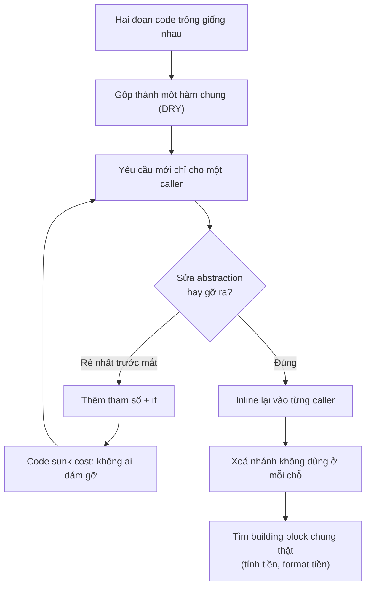
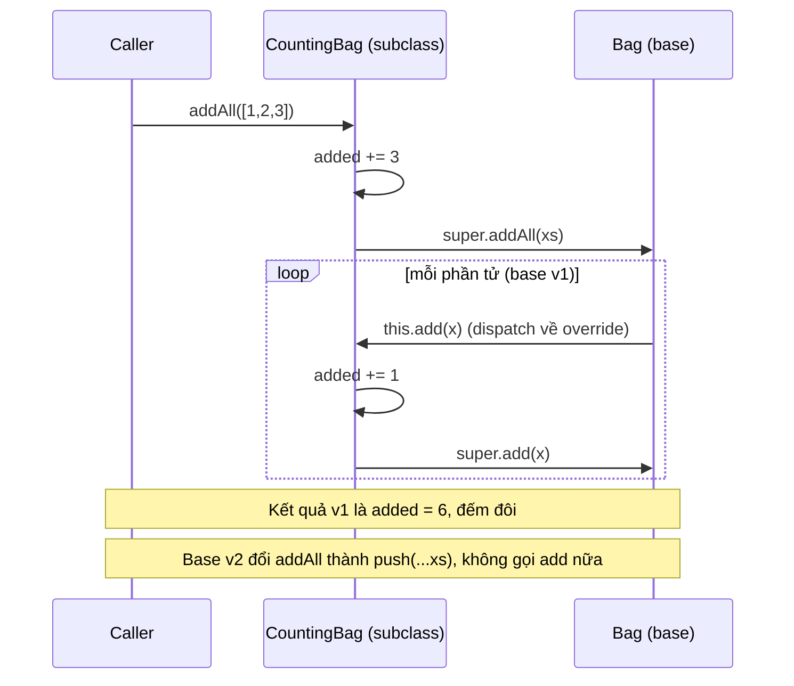

## Bối cảnh & vấn đề

Một team e-commerce có hàm `buildOrderSummary(order, isAdmin, isEmail, isPdf, includeTax, legacyMode, tenantOverride)`. Hai năm trước nó chỉ có tham số `order`: ba màn hình (email xác nhận, trang admin, hoá đơn PDF) cùng hiển thị "tóm tắt đơn hàng", code trông giống nhau, nên ai đó gộp lại cho "DRY". Rồi email muốn bỏ dòng thuế, PDF muốn thêm mã số thuế, admin muốn thấy margin, một tenant lớn muốn layout riêng. Mỗi yêu cầu thêm một `if` và một boolean. Hôm nay hàm có 9 caller, 7 tham số, và mỗi lần sửa cho email thì PDF hỏng.

Không ai trong team cố tình viết code tệ. Mỗi bước đều "hợp lý": gộp code trùng là DRY, thêm một flag nhỏ thì nhanh hơn viết lại. Vấn đề là họ áp dụng một **nguyên lý** (DRY) như một **luật**, mà không hỏi câu quan trọng nhất: **những đoạn code này có đổi vì cùng một lý do không?**

Bài này đặt nền cho cả track. Trước khi học SOLID ([bài 2](/tracks/design-patterns/learn/solid-srp-ocp-lsp)) hay GoF pattern ([bài 4](/tracks/design-patterns/learn/creational-patterns) trở đi), cần hiểu những thước đo mà mọi pattern đều nhắm tới: **coupling**, **cohesion**, chi phí thay đổi. Pattern chỉ là công cụ; thước đo mới là thứ interviewer muốn thấy bạn dùng để phán đoán.

## Khái niệm

### Principle, pattern và theorem

**Principle** (nguyên lý) là một **heuristic** đúc kết từ kinh nghiệm: "làm thế này thường ít rắc rối hơn". Nó không được chứng minh bằng toán, nó **phụ thuộc ngữ cảnh** và có thể cố tình vi phạm khi chi phí tuân thủ lớn hơn lợi ích. SOLID, DRY, KISS, YAGNI, Law of Demeter đều là principle.

**Pattern** (design pattern) là **tên của một giải pháp đã lặp lại nhiều lần** cho một vấn đề có cấu trúc giống nhau: Strategy, Observer, Repository. Pattern có cấu trúc cụ thể (các vai trò, ai gọi ai) và có hệ quả cụ thể (thêm gì, mất gì). Giá trị lớn nhất của pattern là **từ vựng chung**: nói "đây là một Decorator" thì cả team hiểu ngay cấu trúc mà không cần vẽ.

**Theorem** (định lý) như CAP hay FLP mô tả một **giới hạn không thể vượt qua**, đã được chứng minh. Bạn không "vi phạm" được theorem, chỉ có thể chọn phía trong trade-off. Phân biệt điều này giúp tránh tranh luận sai: cãi về SRP như cãi về CAP là nhầm tầng.

**Interview angle:** câu "pattern nào bạn hay dùng nhất?" thường là mồi. Câu trả lời tốt nói về **vấn đề** đã gặp (đổi provider phải sửa 5 file) rồi mới gọi tên pattern đã chọn, và nói luôn khi nào bạn **không** dùng nó.

### Coupling và cohesion

**Coupling** là mức độ một module phải biết về module khác: biết tên class cụ thể, biết thứ tự gọi, biết cấu trúc dữ liệu bên trong, dùng chung state. Coupling càng chặt thì một thay đổi ở module A càng dễ buộc sửa module B. Coupling không thể bằng 0 (code phải gọi nhau), mục tiêu là coupling **đúng chỗ** và **qua contract hẹp**.

**Cohesion** là mức độ các phần trong một module thuộc về nhau: chúng thay đổi cùng nhau, vì cùng một lý do. Một module cohesive cao thì một yêu cầu nghiệp vụ chỉ chạm một chỗ. Một module "utils" chứa format tiền, gửi email và parse CSV có cohesion thấp: ba lý do thay đổi không liên quan sống chung một file.

Hai khái niệm này đi cặp: **high cohesion, low coupling**. Hầu hết principle và pattern trong track là cách cụ thể để đạt nó. SRP ([bài 2](/tracks/design-patterns/learn/solid-srp-ocp-lsp)) là cohesion theo actor; DIP ([bài 3](/tracks/design-patterns/learn/isp-dip-dependency-injection)) là đảo hướng coupling; hexagonal ([bài 8](/tracks/design-patterns/learn/hexagonal-clean-architecture)) là coupling chỉ hướng vào core.

### DRY: một nguồn cho mỗi knowledge

**DRY** (Don't Repeat Yourself, từ *The Pragmatic Programmer*) phát biểu: "Every piece of **knowledge** must have a single, unambiguous, authoritative representation within a system". Từ khoá là **knowledge** (kiến thức nghiệp vụ, quyết định thiết kế), không phải **ký tự**. Quy tắc tính VAT 10% là một knowledge: nếu nó nằm ở 4 chỗ, đổi thuế suất phải sửa 4 chỗ và sẽ quên một. Đó là duplication thật.

Ngược lại, hai hàm `validateCheckoutAddress` và `validatePartnerAddress` có thể trông giống hệt nhau hôm nay nhưng là hai knowledge khác nhau: một cái theo yêu cầu UX checkout, một cái theo API của đối tác vận chuyển. Gộp chúng lại tạo ra **accidental duplication bị xem là duplication thật**: lần đầu đối tác đổi rule, hàm chung mọc ra `if (isPartner)`.

```ts
// Duplication thật: cùng một knowledge (thuế suất) ở nhiều nơi -> gộp
const VAT_RATE = 0.1;
export const withVat = (net: number) => Math.round(net * (1 + VAT_RATE));

// Duplication "tình cờ": giống nhau hôm nay, đổi vì lý do khác nhau -> giữ riêng
export const validateCheckoutAddress = (a: Address) => a.line1.length > 0 && a.phone.length >= 9;
export const validatePartnerAddress  = (a: Address) => a.line1.length > 0 && a.phone.length >= 9;
```

**Rule of three** là heuristic thực tế: chờ tới lần lặp thứ ba, và chỉ trừu tượng hoá khi bạn chắc chúng **đổi cùng lý do**.

**Interview angle:** red flag là "DRY nghĩa là không bao giờ có hai dòng giống nhau". Câu trả lời tốt phân biệt knowledge với text và kể một lần DRY sai chỗ.

### KISS và YAGNI

**KISS** (Keep It Simple) nói: chọn giải pháp đơn giản nhất **giải được vấn đề hiện tại**. "Đơn giản" không phải "ít dòng nhất" mà là ít khái niệm, ít indirection, người mới đọc hiểu nhanh. Một `if/else` hai nhánh đơn giản hơn Strategy + registry + factory cho cùng hành vi.

**YAGNI** (You Aren't Gonna Need It, từ Extreme Programming) nói: đừng build cho yêu cầu **tưởng tượng**. Fowler chỉ ra chi phí của tính năng "phòng khi cần": chi phí build, chi phí trì hoãn thứ thật sự cần, chi phí mang theo (mọi thay đổi sau phải tương thích với nó), và khả năng cao là đoán sai hình dạng yêu cầu. YAGNI **không** cấm viết code dễ thay đổi; nó cấm build **tính năng và extension point** chưa có người dùng.

**Interview angle:** interviewer hay hỏi "YAGNI có mâu thuẫn với OCP không?". Câu trả lời: OCP áp dụng **sau khi** trục biến đổi đã xuất hiện; YAGNI ngăn bạn tạo extension point **trước** khi có bằng chứng.

### Law of Demeter

**Law of Demeter** ("chỉ nói chuyện với bạn thân") nói một method chỉ nên gọi method của: chính nó, tham số, object nó tạo, và field trực tiếp. `order.customer.address.city.toUpperCase()` biết quá nhiều về cấu trúc bên trong ba object; đổi `Address` là vỡ caller ở xa. Cách sửa thường là **hỏi object làm việc** (`order.shippingCity()`) thay vì đi xuyên qua nó. Ngoại lệ hợp lý: DTO/data object không có behavior, nơi chuỗi truy cập field là chuyện bình thường.

### Composition over inheritance

**Inheritance** (`extends`) cho subclass mượn toàn bộ implementation của base class. Đó là coupling **chặt nhất** trong OOP: subclass phụ thuộc không chỉ vào public API mà vào **cách base class tự gọi chính nó** (method nào gọi method nào). Đây là gốc của **fragile base class problem**: base class sửa implementation nội bộ, không đổi signature, subclass vẫn hỏng.

**Composition** ghép hành vi bằng cách **giữ** một object khác (hoặc bọc một function) và chỉ dùng public API của nó. Ba lợi ích: ghép được nhiều hành vi độc lập (cache + retry + log) mà không cần một subclass cho mỗi tổ hợp; đổi được lúc runtime; test từng mảnh riêng. Cái giá: nhiều object nhỏ, wiring dài hơn, phải forward method.

Inheritance vẫn đúng khi có quan hệ **is-a ổn định** và base class **được thiết kế để kế thừa**: `class NotFoundError extends AppError extends Error` (cần `instanceof` và stack trace), các node type của AST, base class mà framework yêu cầu.

```ts
class AppError extends Error {
  constructor(readonly code: string, message: string, readonly status = 500) { super(message); this.name = new.target.name; }
}
class NotFoundError extends AppError {
  constructor(what: string) { super("NOT_FOUND", `${what} not found`, 404); }
}
// is-a thật, hierarchy nông, framework (error handler) dựa vào instanceof
```

**Interview angle:** red flag là "inheritance luôn xấu". Tín hiệu tốt là nêu được fragile base class bằng ví dụ cụ thể và một trường hợp inheritance vẫn hợp.

### Wrong abstraction

**Wrong abstraction** (Sandi Metz) là abstraction gộp những thứ **trông giống** nhưng **đổi vì lý do khác nhau**. Nó nguy hiểm hơn duplication vì nó có quán tính: code đã được gộp trông "chuẩn", người sau ngại gỡ, nên chọn cách rẻ nhất là thêm tham số và nhánh. Câu nổi tiếng: *"duplication is far cheaper than the wrong abstraction"*.

Dấu hiệu nhận biết: tham số boolean (`isEmail`, `legacyMode`), tham số chỉ một caller dùng, nhánh `if` theo tên caller, test phải đi qua tổ hợp flag. Với n flag boolean độc lập, hàm có thể có tới 2^n hành vi: 7 flag là 128 tổ hợp mà không ai test hết.

## Cơ chế hoạt động

Wrong abstraction không xuất hiện trong một commit; nó tích tụ theo một vòng lặp có thể dự đoán. Sơ đồ dưới là vòng đời mà Sandi Metz mô tả, và lối thoát:



Vòng lặp C → D → E → F tự duy trì vì mỗi lần thêm flag đều rẻ hơn gỡ, và mỗi flag làm việc gỡ đắt hơn. Lối thoát (G → H → I) đi ngược trực giác: **tạm tăng duplication**. Bạn copy thân hàm chung vào từng caller, ở mỗi chỗ thay flag bằng giá trị cụ thể của caller đó (email luôn `isEmail = true`), rồi xoá các nhánh chết. Kết quả là ba hàm nhỏ, mỗi hàm chỉ chứa logic của một use case. Lúc này phần **thật sự chung** (tính tổng tiền, format tiền tệ) lộ ra rõ ràng và có thể tách thành building block đúng nghĩa.

Với inheritance, cơ chế gây vỡ là **self-use**: base class gọi method của chính nó (`addAll` gọi `this.add`), và subclass override một trong các method đó. Subclass vô tình phụ thuộc vào chi tiết "addAll có gọi add hay không", một chi tiết không nằm trong signature nào:



Dòng `this.add(x)` trong base được **dynamic dispatch** về method override của subclass. Base v1 và v2 có cùng public API, nhưng hành vi subclass khác hẳn. Ví dụ chạy thật ở phần sau.

## Ví dụ thực tế

### Fragile base class: cùng signature, khác kết quả

Chạy với tsx 4.23 trên Node 24.21:

```ts
class Bag<T> {                                   // base v1
  protected items: T[] = [];
  add(x: T) { this.items.push(x); }
  addAll(xs: T[]) { for (const x of xs) this.add(x); }
  get size() { return this.items.length; }
}
class CountingBag<T> extends Bag<T> {
  added = 0;
  override add(x: T) { this.added++; super.add(x); }
  override addAll(xs: T[]) { this.added += xs.length; super.addAll(xs); }
}

class BagV2<T> {                                 // base v2: "tối ưu" addAll
  protected items: T[] = [];
  add(x: T) { this.items.push(x); }
  addAll(xs: T[]) { this.items.push(...xs); }
  get size() { return this.items.length; }
}
class CountingBagV2<T> extends BagV2<T> {        // subclass chỉ override add
  added = 0;
  override add(x: T) { this.added++; super.add(x); }
}

// Built-in cũng vậy: Set constructor gọi this.add cho từng phần tử
class CountingSet<T> extends Set<T> {
  count = 0;
  override add(v: T) { this.count++; return super.add(v); }
}

// Composition: chỉ dùng public API của Set
class CountingSetC<T> {
  #inner = new Set<T>(); count = 0;
  constructor(init: Iterable<T> = []) { for (const v of init) this.add(v); }
  add(v: T) { this.count++; this.#inner.add(v); return this; }
  get size() { return this.#inner.size; }
}
```

```text
v1 base: { size: 3, added: 6 }
v2 base: { size: 3, added: 0 }
CountingSet: { size: 3, count: 0 }
composition: { size: 3, count: 3 }
```

Ba kết quả sai, ba nguyên nhân khác nhau. Với base v1, subclass đếm đôi vì `addAll` của base gọi lại `add` đã override. Với base v2, cùng subclass (chỉ override `add`) đếm thiếu vì base không còn gọi `add`. Với `CountingSet`, `new Set(iterable)` gọi `this.add` cho từng phần tử **bên trong `super()`** (MDN mô tả constructor dùng method `add` của object), lúc đó field `count` của subclass **chưa được khởi tạo**; sau khi `super()` trả về, initializer `count = 0` ghi đè. Kết quả: set có 3 phần tử nhưng đếm 0. Bản composition không phụ thuộc chi tiết nội bộ nào của `Set`, nên đúng.

### Composition bằng higher-order function

Trong TypeScript, composition thường không cần class: mỗi hành vi là một function nhận `Fetcher` và trả `Fetcher` mới cùng type. Ghép theo thứ tự tuỳ ý:

```ts
type Fetcher = (url: string) => Promise<string>;
let calls = 0;
const flaky: Fetcher = async (u) => { calls++; if (calls < 3) throw new Error(`ECONNRESET #${calls}`); return `200 ${u}`; };

const withRetry = (f: Fetcher, n = 3): Fetcher => async (u) => {
  for (let i = 0; ; i++) {
    try { return await f(u); }
    catch (e) { console.log(`  retry ${i + 1}/${n}: ${(e as Error).message}`); if (i >= n - 1) throw e; }
  }
};
const withLog = (f: Fetcher): Fetcher => async (u) => {
  const t = performance.now();
  try { return await f(u); } finally { console.log(`  GET ${u} took ${(performance.now() - t).toFixed(1)}ms`); }
};
const cache = new Map<string, string>();
const withCache = (f: Fetcher): Fetcher => async (u) => cache.get(u) ?? (cache.set(u, await f(u)), cache.get(u)!);

const http = withCache(withLog(withRetry(flaky)));
console.log("1st:", await http("/products/42"));
console.log("2nd:", await http("/products/42"));
console.log("underlying calls:", calls);
```

```text
  retry 1/3: ECONNRESET #1
  retry 2/3: ECONNRESET #2
  GET /products/42 took 0.4ms
1st: 200 /products/42
2nd: 200 /products/42
underlying calls: 3
```

Ba hành vi độc lập, không có class `CachedLoggingRetryingFetcher`. Thứ tự bọc có ý nghĩa: `withLog` bọc ngoài `withRetry` nên đo **tổng** thời gian gồm cả retry; đổi thứ tự thì log từng lần thử. Lần gọi thứ hai hit cache nên không log và không gọi `flaky`. Với inheritance, mỗi tổ hợp (cache + log, retry + log, ...) sẽ cần một subclass: 3 hành vi là tới 7 tổ hợp.

### Refactor wrong abstraction: inline rồi tìm building block

Trước (minh hoạ, rút gọn):

```ts
function buildOrderSummary(o: Order, isAdmin: boolean, isEmail: boolean, isPdf: boolean,
                           includeTax: boolean, legacyMode: boolean, tenantOverride?: string) {
  const lines = o.lines.map((l) => (isPdf ? `${l.sku}\t${l.qty}\t${fmt(l.total)}` : `${l.qty} x ${l.name}`));
  if (includeTax && !isEmail) lines.push(`VAT: ${fmt(o.vat)}`);
  if (isAdmin) lines.push(`Margin: ${fmt(o.margin)}`);
  if (legacyMode && tenantOverride === "acme") lines.reverse();
  return (isPdf ? "INVOICE\n" : "") + lines.join("\n");
}
```

Sau: mỗi caller có hàm riêng, chung nhau building block thật (`fmt`, cách tính tiền nằm trong `Order`):

```ts
const lineText = (l: OrderLine) => `${l.qty} x ${l.name}`;

export const emailSummary = (o: Order) => o.lines.map(lineText).join("\n");
export const adminSummary = (o: Order) => [...o.lines.map(lineText), `VAT: ${fmt(o.vat)}`, `Margin: ${fmt(o.margin)}`].join("\n");
export const pdfInvoiceBody = (o: Order) =>
  ["INVOICE", ...o.lines.map((l) => `${l.sku}\t${l.qty}\t${fmt(l.total)}`), `VAT: ${fmt(o.vat)}`].join("\n");
export const acmeLegacySummary = (o: Order) => o.lines.map(lineText).reverse().join("\n"); // một tenant, một hàm, có hạn xoá
```

Thay đổi email giờ chỉ chạm `emailSummary`. Quy trình an toàn: viết test cho từng caller với output hiện tại **trước** khi inline (characterization test, xem [bài 12](/tracks/design-patterns/learn/extensible-design-refactoring)), rồi inline từng caller một, mỗi bước một PR.

## Trade-offs & lựa chọn thay thế

| Lựa chọn | Được | Mất | Hợp khi |
| --- | --- | --- | --- |
| Gộp code trùng (DRY) | Một chỗ sửa cho một knowledge | Coupling giữa các caller | Cùng knowledge, đổi cùng lý do, đã lặp ≥ 3 lần |
| Giữ duplication | Mỗi caller tự do tiến hoá | Sửa nhiều chỗ nếu thật ra là cùng knowledge | Chưa rõ trục thay đổi, các caller thuộc actor khác nhau |
| Inheritance | Ít code, polymorphism sẵn, `instanceof` | Coupling vào implementation, fragile base class, không ghép tổ hợp | is-a ổn định, base thiết kế để kế thừa, hierarchy nông (error, AST) |
| Composition (object) | Ghép tổ hợp, đổi runtime, test riêng | Nhiều object, phải forward method | Hành vi cắt ngang (cache, retry, log), nhiều biến thể |
| Composition (HOF) | Rất gọn trong TS | Stack trace dài, khó debug chuỗi dài | Function có một method chính (fetcher, handler) |
| Extension point sớm | Thêm biến thể không sửa code | Indirection, đoán sai trục | Hầu như không bao giờ trước khi có biến thể thứ hai |

Chọn thế nào: bắt đầu bằng code **đơn giản và cụ thể** (KISS, YAGNI). Khi thấy lặp, hỏi "đây có phải cùng một knowledge, đổi cùng lý do không?" trước khi gộp. Khi cần tái dùng hành vi, mặc định composition; chỉ dùng inheritance khi quan hệ is-a ổn định và base class được thiết kế cho nó (tài liệu rõ method nào được gọi nội bộ). Khi một abstraction bắt đầu mọc flag, coi đó là tín hiệu gỡ ra, không phải thêm flag.

## Edge cases & failure modes

- **Gộp code qua ranh giới service/team**: một "shared library" chứa logic nghiệp vụ dùng chung bởi 5 service. Mỗi thay đổi cần release đồng bộ: DRY đã biến thành **distributed monolith**. Giữa các bounded context, duplication thường rẻ hơn coupling.
- **Base class của thư viện đổi implementation**: subclass của bạn override một method mà thư viện bắt đầu (hoặc thôi) gọi nội bộ ở bản minor. Không có compile error nào. Chỉ test hành vi mới bắt được.
- **Constructor gọi method có thể override**: như `Set` ở trên, field của subclass chưa khởi tạo khi constructor base chạy. Trong TS/JS, đây là lý do không nên gọi method overridable trong constructor của chính class bạn.
- **Composition chain quá sâu**: `withA(withB(withC(withD(fn))))` với lỗi ở giữa cho stack trace toàn `async (u) =>`. Đặt tên function (`const withRetry = function withRetry(...)`) hoặc chuyển sang class decorator có tên khi chuỗi dài.
- **YAGNI bị dùng làm cớ** để bỏ qua những thứ khó thêm sau: idempotency key, timezone, tiền dạng integer, tenant id trong schema. Đây là quyết định **khó đảo ngược**, không phải tính năng tưởng tượng; nên làm đúng từ đầu.

## Pitfalls

- ❌ "DRY = không có hai dòng giống nhau" → ✅ DRY là một nguồn cho mỗi **knowledge**; hai đoạn giống nhau nhưng đổi vì lý do khác nhau nên để riêng.
- ❌ Thêm boolean parameter để tái dùng hàm cho caller mới → ✅ viết hàm riêng hoặc option object có tên; boolean flag là mùi của wrong abstraction.
- ❌ Gỡ wrong abstraction bằng một refactor lớn → ✅ inline từng caller, có test cho output hiện tại, mỗi bước một PR.
- ❌ Kế thừa class của thư viện để thêm một hành vi nhỏ → ✅ bọc (composition) và chỉ dùng public API; bạn không kiểm soát implementation của base.
- ❌ "Inheritance luôn sai" → ✅ is-a ổn định và nông (error hierarchy) vẫn là công cụ đúng.
- ❌ Tạo interface + factory "để sau này mở rộng" → ✅ chờ biến thể thứ hai; YAGNI.
- ❌ Coi principle như luật → ✅ principle là heuristic; vi phạm có chủ đích và ghi lý do (ADR, comment) là hợp lệ.

## Tóm tắt

- Principle là heuristic phụ thuộc ngữ cảnh, pattern là tên một giải pháp lặp lại, theorem là giới hạn đã chứng minh.
- Thước đo thật là **coupling** (biết về nhau bao nhiêu) và **cohesion** (thay đổi cùng nhau không); pattern chỉ là cách đạt chúng.
- DRY nói về **knowledge**, không về text. Rule of three, và hỏi "đổi cùng lý do không?" trước khi gộp.
- KISS: ít khái niệm và indirection nhất cho vấn đề hiện tại. YAGNI: không build tính năng/extension point cho yêu cầu tưởng tượng, nhưng vẫn làm đúng các quyết định khó đảo ngược.
- Wrong abstraction lộ ra qua boolean flag; chữa bằng inline lại, xoá nhánh chết, rồi mới tìm building block chung.
- Inheritance coupling vào implementation (fragile base class, self-use); composition ghép hành vi qua public API. Inheritance vẫn hợp cho is-a ổn định, nông.
