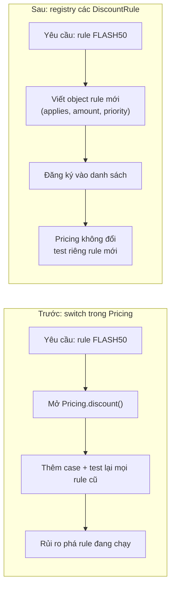
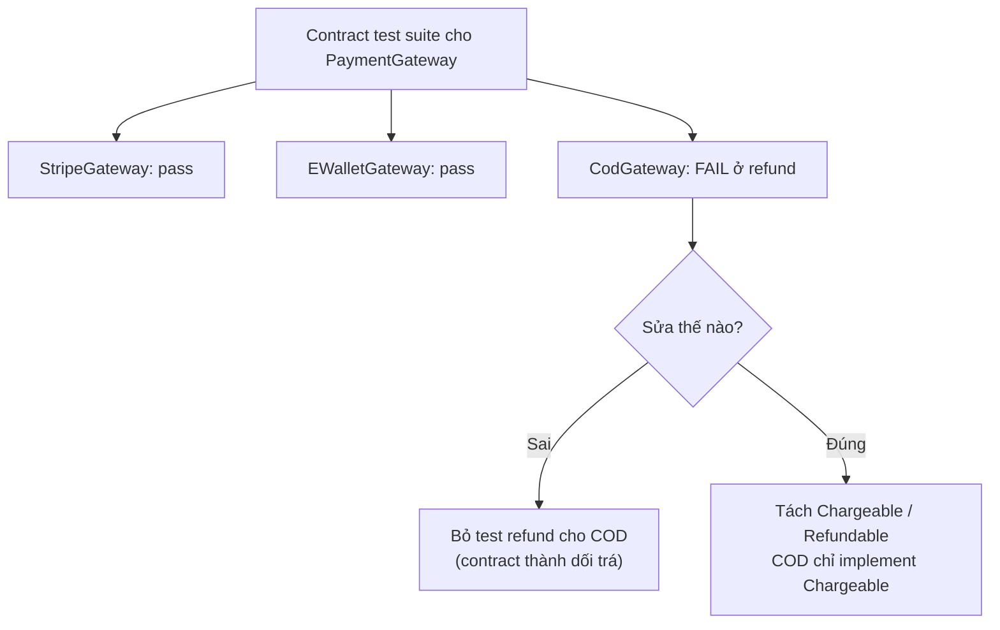

## Bối cảnh & vấn đề

Một batch job hoàn tiền chạy mỗi đêm: duyệt các đơn bị huỷ, gọi `gateways[o.method].refund(...)`. Nó được viết đúng theo interface `PaymentGateway`, review qua, test xanh. Một sprint sau, team thêm phương thức **COD** (thanh toán khi nhận hàng). `CodGateway implements PaymentGateway` compile ngon lành, vì nó có đủ method `charge` và `refund`, chỉ là `refund` thì `throw new Error('COD cannot be refunded online')`. Đêm đó, đơn COD đầu tiên trong danh sách làm job crash, và mọi đơn thẻ phía sau không được hoàn tiền. Sáng hôm sau, support nhận hàng chục ticket.

Không có dòng code nào "sai" theo compiler. Cái sai nằm ở **contract**: interface nói "mọi gateway đều refund được", và một implementation âm thầm phá lời hứa đó. Đây là **Liskov Substitution Principle** bị vi phạm, kéo theo **Interface Segregation** (interface ép COD implement thứ nó không có).

SOLID là năm nguyên lý của Robert C. Martin (Uncle Bob) về **quản lý thay đổi và coupling** trong code hướng đối tượng. Bài này đi qua ba chữ đầu (S, O, L); I và D cùng Dependency Injection nằm ở [bài 3](/tracks/design-patterns/learn/isp-dip-dependency-injection). Nhớ rằng SOLID là principle ([bài 1](/tracks/design-patterns/learn/design-principles)): heuristic để giảm chi phí thay đổi, không phải mục tiêu "có nhiều class".

## Khái niệm

### Tổng quan SOLID bằng vi phạm

Cách nhanh nhất để chứng minh hiểu SOLID là chỉ ra **vi phạm trong code**, vì định nghĩa thì ai cũng thuộc:

| Chữ | Nguyên lý | Vi phạm điển hình (TS) |
| --- | --- | --- |
| S | Single Responsibility | `UserService` vừa validate, vừa gửi email, vừa render PDF: ba nhóm người cùng sửa một file |
| O | Open/Closed | `switch (provider)` trong `pay()`: thêm provider phải sửa hàm đã ổn định |
| L | Liskov Substitution | Subclass `throw new Error('not supported')` cho method của parent |
| I | Interface Segregation | Interface `Repository` 30 method, client chỉ cần `findById` |
| D | Dependency Inversion | `class OrderService { db = new PrismaClient() }`: high-level phụ thuộc chi tiết |

Mục tiêu chung của cả năm: **cô lập thay đổi**. Khi một yêu cầu đổi, số file phải sửa và số người bị ảnh hưởng nên nhỏ và dự đoán được.

**Interview angle:** follow-up kinh điển là "nguyên lý nào bạn cố tình phá thường xuyên nhất?". Câu trả lời thành thật thường là OCP (không tạo extension point cho thứ chưa đổi) hoặc SRP trong script nhỏ, kèm lý do chi phí.

### SRP: một module, một actor

Định nghĩa phổ biến "một class chỉ nên làm một việc" là **sai lệch**. Nếu "một việc" nghĩa là một hành động, bạn sẽ có class một method và hàng trăm file vụn, mà vẫn không giải quyết vấn đề thật. Uncle Bob tự định nghĩa lại (blog 2014, sách *Clean Architecture*): **"A module should be responsible to one, and only one, actor."** **Actor** là một nhóm stakeholder, nguồn phát sinh yêu cầu thay đổi: kế toán, vận hành, team layout, DBA.

Ví dụ trong sách: class `Employee` có `calculatePay()` (kế toán/CFO cần), `reportHours()` (vận hành/COO cần) và `save()` (DBA/CTO cần). Hai method đầu cùng gọi helper `regularHours()`. Kế toán muốn đổi cách tính giờ làm thường cho lương, dev sửa `regularHours()`, test lương xanh, và báo cáo giờ của vận hành bị sai mà không ai biết. Vấn đề không phải "class làm nhiều việc", mà là **hai actor cùng phụ thuộc một đoạn code** nên thay đổi của actor này vô tình đụng actor kia.

```ts
// Hai actor: finance (tổng tiền) và layout team (PDF) -> hai lý do thay đổi
class Invoice {
  total(): Money { /* finance rules */ }
  toPdf(): Buffer { /* layout team */ }
}
// Tách theo actor
class InvoiceCalculator { total(inv: InvoiceData): Money { /* finance */ } }
class InvoicePdfRenderer { render(inv: InvoiceData, total: Money): Buffer { /* layout */ } }
```

SRP là **cohesion nhìn theo nguồn thay đổi**: gom những thứ đổi cùng nhau vì cùng lý do, tách những thứ đổi vì lý do khác nhau. Cùng tư duy này áp dụng ở mức service: tách microservice theo **business capability** (team/actor nào sở hữu), không theo tầng kỹ thuật.

**Interview angle:** red flag là "SRP nghĩa là class chỉ có một method". Tín hiệu tốt: nói "actor", và đưa ví dụ helper dùng chung bị sửa cho actor này làm hỏng actor kia.

### OCP: thêm hành vi bằng code mới

**Open/Closed Principle** (Bertrand Meyer 1988, Uncle Bob phát biểu lại bằng polymorphism): module nên **mở để mở rộng, đóng để sửa đổi**. Nghĩa thực tế: khi thêm một biến thể (provider mới, rule giảm giá mới), bạn **viết code mới** (một class, một object, một entry trong registry) thay vì mở hàm đã ổn định và chen thêm `case`. Code cũ đã test, đã chạy production, không bị chạm nên không bị phá.

Cơ chế hiện thực: polymorphism qua interface, Strategy ([bài 6](/tracks/design-patterns/learn/behavioral-strategy-command-state)), plugin registry, event/hook. Điểm mấu chốt là **extension point** phải nằm đúng trục biến đổi. OCP không có nghĩa "mọi thứ đều mở rộng được"; đó là không thể và rất đắt.

Khi nào OCP thành **over-engineering**: (1) bạn đoán trục biến đổi trước khi nó xuất hiện và đoán sai (tạo `NotificationChannelFactory` khi chỉ có email suốt 3 năm); (2) chỉ có một implementation; (3) chi phí indirection (đọc code phải nhảy qua interface, registry, DI) lớn hơn chi phí sửa một `switch` có exhaustive check. Thực tế: áp OCP **sau khi** biến thể thứ hai hoặc thứ ba đã xuất hiện, đúng tinh thần YAGNI.

**Interview angle:** câu hỏi đi kèm thường là "rule cần chạy theo thứ tự hoặc loại trừ nhau thì sao?". Câu trả lời: thứ tự và loại trừ là **dữ liệu của rule** (`priority`, `exclusive`), engine đọc chúng, không hard-code vào engine.

### LSP: subtype phải giữ behavioral contract

**Liskov Substitution Principle** (Barbara Liskov 1987; Liskov & Wing 1994 hình thức hoá thành *behavioral subtyping*): nếu S là subtype của T, mọi chỗ dùng T phải dùng được S **mà không đổi tính đúng đắn của chương trình**. "Dùng được" ở đây là về **hành vi**, không chỉ là type khớp. Liskov & Wing đưa ra các quy tắc cụ thể:

- **Precondition không được mạnh hơn**: subtype không được đòi hỏi input khắt khe hơn (parent nhận mọi `amount > 0`, subtype chỉ nhận `amount < 1_000_000` là vi phạm).
- **Postcondition không được yếu hơn**: subtype phải đảm bảo ít nhất những gì parent hứa (parent hứa `findById` trả dữ liệu mới nhất sau khi `save`, subtype cache trả dữ liệu stale là vi phạm).
- **Invariant giữ nguyên**, và không ném **exception mới** mà caller của parent không được báo trước.
- **History constraint**: subtype không cho phép thay đổi state mà parent coi là bất biến (subtype mutable của một type immutable).

Ví dụ Square/Rectangle quen thuộc minh hoạ invariant ("đặt width không đổi height"), nhưng ví dụ production hay gặp hơn là **subtype từ chối method** (`ReadOnlyStorage.write()` throw, `CodGateway.refund()` throw) và **subtype đổi ngữ nghĩa** (`CachedUserRepo.findById` trả bản cũ 10 phút trong khi caller dựa vào read-your-writes).

### Vì sao TypeScript không bắt được vi phạm LSP

TypeScript dùng **structural typing**: một type tương thích với type khác nếu **shape** khớp (có các property/method với type tương thích). Compiler không biết gì về hành vi: một method có đúng signature nhưng `throw`, trả dữ liệu khác nghĩa, hay có side effect bất ngờ vẫn compile. Thậm chí override với **ít tham số hơn** cũng hợp lệ (`write(): Promise<void>` thay cho `write(path, data)`), vì JS cho phép bỏ qua tham số thừa.

Có thêm một lỗ hổng ở mức type: **method parameter bivariance**. Với flag `strictFunctionTypes` (bật trong `strict`, từ TS 2.6), tham số của **function-type property** được kiểm **contravariant** (đúng lý thuyết: handler nhận `Animal` không được thay bằng handler chỉ nhận `Dog`). Nhưng release notes TS 2.6 ghi rõ chế độ chặt này **không áp dụng cho method** (cú pháp `handle(a: Animal): void`) và constructor; method vẫn được kiểm **bivariant** để giữ tương thích với các pattern như `Array<T>`. Kết quả: một implementation chỉ chấp nhận `Dog` vẫn gán được vào interface khai báo bằng method syntax nhận `Animal`, và crash lúc runtime (ví dụ chạy thật ở dưới).

Cách sửa ở mức thiết kế là **tách interface theo capability** (ISP): thay vì một subtype từ chối method, đừng để nó khai báo method đó. Ở mức type, khai báo callback bằng **property syntax** (`handle: (a: Animal) => void`) để bật kiểm tra contravariant.

**Interview angle:** câu follow-up "method parameter trong TS là covariant hay contravariant?" có đáp án chính xác: function property là contravariant dưới `strictFunctionTypes`, method là bivariant (verify với phiên bản TS của bạn; hành vi này ổn định từ 2.6 tới 5.9).

## Cơ chế hoạt động

OCP và LSP liên quan chặt: OCP cho phép thêm implementation mới mà không sửa caller, **với điều kiện** implementation mới giữ contract (LSP). Nếu LSP bị phá, caller buộc phải thêm `if (gateway instanceof CodGateway)`, và OCP sụp theo. Sơ đồ so sánh hai cách thêm một rule giảm giá:



Bên trái, mọi rule sống trong một hàm: thêm rule là sửa hàm, và test phải phủ lại mọi tổ hợp. Bên phải, `Pricing` chỉ biết interface `DiscountRule`; rule mới là một object mới, test độc lập. Điều kiện để bên phải hoạt động: mọi rule đều tuân thủ cùng contract (`applies` không side effect, `amount` không âm). Một rule `amount()` trả số âm hoặc gọi API ngoài là vi phạm LSP và sẽ làm engine tính sai mà không cần sửa engine.

LSP có thể kiểm tra bằng **contract test**: một bộ test viết theo interface, chạy trên **mọi** implementation. Nếu `CodGateway` chạy bộ test `PaymentGateway` (có case "refund một charge thành công"), nó fail ngay trong CI, trước khi tới batch job đêm.



## Ví dụ thực tế

### Batch refund: trước và sau khi tách capability

Chạy với tsx 4.23 / Node 24.21. Trước: interface hứa mọi gateway refund được, vòng `for` dừng ở lỗi đầu tiên:

```ts
interface PaymentGateway {
  charge(amount: number): Promise<string>;
  refund(chargeId: string, amount: number): Promise<void>;
}
class CodGateway implements PaymentGateway {
  async charge() { return "cod-" + Date.now(); }
  async refund(): Promise<void> { throw new Error("COD cannot be refunded online"); } // compile OK
}
const gateways: Record<string, PaymentGateway> = { card: new StripeGateway(), cod: new CodGateway() };
const cancelled = [
  { id: "o1", method: "card", chargeId: "ch_1", total: 100 },
  { id: "o2", method: "cod", chargeId: "cod-1", total: 50 },
  { id: "o3", method: "card", chargeId: "ch_3", total: 70 },
];
try {
  for (const o of cancelled) await gateways[o.method].refund(o.chargeId, o.total);
} catch (e) { console.log("  job crashed:", (e as Error).message, "-> o3 never refunded"); }
```

Sau: hai interface theo capability, type guard, và cô lập lỗi từng item:

```ts
interface Chargeable { charge(amount: number): Promise<string> }
interface Refundable { refund(chargeId: string, amount: number): Promise<void> }
const supportsRefund = (g: object): g is Refundable => "refund" in g;

class Stripe2 implements Chargeable, Refundable { /* charge + refund */ }
class Cod2 implements Chargeable { async charge() { return "cod-x"; } } // không hứa refund

const results = await Promise.allSettled(cancelled.map(async (o) => {
  const g = gw2[o.method];
  if (!supportsRefund(g)) return `${o.id}: manual-refund queue`;
  await g.refund(o.chargeId, o.total);
  return `${o.id}: refunded`;
}));
```

```text
BEFORE (loop written against the interface):
  stripe refund ch_1 100
  job crashed: COD cannot be refunded online -> o3 never refunded
AFTER:
  stripe refund ch_1 100
  stripe refund ch_3 70
  o1: refunded
  o2: manual-refund queue
  o3: refunded
```

Hai thay đổi giải hai vấn đề khác nhau. Tách `Refundable` sửa **thiết kế**: COD không còn hứa điều nó không làm được, và job refund có thể khai báo nó chỉ nhận `Refundable`. `allSettled` sửa **độ bền của batch**: một item lỗi (vì bất kỳ lý do gì, kể cả Stripe timeout) không chặn các item khác. Muốn biểu diễn "hỗ trợ partial refund" thì thêm capability riêng (`PartiallyRefundable` với `refund(id, amount)` so với `FullRefundable` với `refundAll(id)`), hoặc một field `capabilities: Set<'refund' | 'partial-refund'>` kèm type guard.

### Compiler im lặng: method bivariance và override bỏ tham số

```ts
class Animal { name = "a"; }
class Dog extends Animal { bark() { return "woof"; } }

interface HandlerMethod { handle(a: Animal): void }          // method syntax
interface HandlerProp { handle: (a: Animal) => void }        // function-property syntax
const dogOnly = (d: Dog) => console.log(d.bark());

const m: HandlerMethod = { handle: dogOnly };   // method params are bivariant -> no error
const p: HandlerProp = { handle: dogOnly };     // strictFunctionTypes -> error

class FileStorage { async write(path: string, data: Uint8Array): Promise<void> { /* ... */ } }
class ReadOnlyStorage extends FileStorage {
  override async write(): Promise<void> { throw new Error("read-only"); } // compiles
}
m.handle(new Animal());
```

`tsc --strict` (TypeScript 5.9.3) chỉ báo **một** lỗi, ở dòng `p`:

```text
l02/variance.ts(10,26): error TS2322: Type '(d: Dog) => void' is not assignable to type '(a: Animal) => void'.
  Types of parameters 'd' and 'a' are incompatible.
    Property 'bark' is missing in type 'Animal' but required in type 'Dog'.
```

Dòng `m` và class `ReadOnlyStorage` compile sạch. Khi chạy, `m.handle(new Animal())` ném `TypeError: d.bark is not a function`. Bài học: type system bảo vệ shape, còn behavioral contract phải được bảo vệ bằng thiết kế interface (ISP) và contract test.

### OCP với thứ tự và loại trừ là dữ liệu

```ts
interface DiscountRule {
  id: string; priority: number; exclusive?: boolean;
  applies(c: Cart): boolean; amount(c: Cart): number;
}
class Pricing {
  constructor(private rules: DiscountRule[]) {}
  discount(c: Cart) {
    const applied: { id: string; amount: number }[] = [];
    for (const r of [...this.rules].sort((a, b) => a.priority - b.priority)) {
      if (!r.applies(c)) continue;
      if (r.exclusive) return [{ id: r.id, amount: r.amount(c) }];   // exclusive rule wins alone
      applied.push({ id: r.id, amount: r.amount(c) });
    }
    return applied;
  }
}
const pricing = new Pricing([vip, bulk]);
console.log(pricing.discount({ subtotal: 400_000, items: 12, customerTier: "vip" }));
const pricing2 = new Pricing([vip, bulk, flash]);  // thêm rule = thêm object
console.log(pricing2.discount({ subtotal: 400_000, items: 12, customerTier: "vip", coupon: "FLASH50" }));
```

```text
[ { id: 'vip-5%', amount: 20000 }, { id: 'bulk-10k', amount: 10000 } ]
[ { id: 'FLASH50', amount: 200000 } ]
```

Thêm `FLASH50` không chạm `Pricing`. Thứ tự (`priority`) và loại trừ (`exclusive`) là thuộc tính của rule. Engine giảm giá đầy đủ (Specification, rule lưu dạng data per tenant) ở [bài 12](/tracks/design-patterns/learn/extensible-design-refactoring).

## Trade-offs & lựa chọn thay thế

| Quyết định | Được | Mất | Khi nên |
| --- | --- | --- | --- |
| Tách class theo actor (SRP) | Thay đổi của một actor không lan sang actor khác | Nhiều file hơn, phải truyền dữ liệu giữa chúng | Hai nhóm stakeholder thật sự sửa cùng file |
| Giữ chung một class | Ít indirection, dễ đọc tuần tự | Rủi ro side effect chéo khi lớn dần | Class nhỏ, một người/nhóm sở hữu |
| Extension point (OCP) | Thêm biến thể không sửa code cũ | Indirection, đoán sai trục | Biến thể đã xuất hiện 2–3 lần, hoặc do bên ngoài (plugin, tenant) thêm |
| `switch` + exhaustive `never` | Rõ ràng, compiler báo khi thêm case | Sửa hàm cũ mỗi lần thêm | Ít biến thể, do chính team kiểm soát |
| Interface rộng + subtype throw | Ít interface | Phá LSP, crash ở caller | Không bao giờ nên |
| Interface theo capability | Caller chỉ nhận thứ nó cần, type guard rõ | Nhiều interface nhỏ | Provider có khả năng khác nhau (payment, storage) |

Chọn thế nào: SRP hỏi "**ai** yêu cầu thay đổi đoạn này?"; nếu câu trả lời là hai nhóm, tách. OCP hỏi "**trục nào** đã biến đổi nhiều lần?"; chỉ mở rộng theo trục đó, các chỗ khác cứ `switch` có exhaustive check (xem [bài 4](/tracks/design-patterns/learn/creational-patterns)). LSP không có trade-off: nếu một subtype không giữ được contract, thì nó **không phải** subtype; đổi thiết kế interface.

## Edge cases & failure modes

- **Subtype "tăng cường" bằng cache**: `CachedUserRepo extends UserRepo` trả dữ liệu cũ. Caller trong flow "đổi email rồi gửi mail xác nhận" đọc email cũ. Postcondition bị yếu đi mà không có lỗi nào.
- **Subtype ném lỗi khác loại**: parent ném `NotFoundError` (caller map 404), subtype ném `TypeError` hay lỗi driver thô. Caller không bắt được, trả 500. Exception cũng là một phần contract.
- **Precondition mạnh hơn ẩn trong validation**: adapter ví điện tử từ chối số tiền lẻ (không chia hết cho 1.000 đồng). Checkout viết theo interface chung không biết, đơn lỗi ngẫu nhiên.
- **OCP registry không có thứ tự xác định**: rule đăng ký qua `import` side effect, thứ tự phụ thuộc thứ tự import. Đổi thứ tự file là đổi tổng tiền. Thứ tự phải là dữ liệu (`priority`).
- **Batch job dừng ở lỗi đầu tiên**: vòng `for await` không cô lập lỗi từng item. Dùng `allSettled`, retry có giới hạn, và ghi item lỗi ra hàng đợi xử lý tay.
- **SRP quá tay**: tách một use case 40 dòng thành 6 class "Validator", "Mapper", "Executor" chỉ một chỗ dùng. Không có actor thứ hai, chỉ có thêm indirection.

## Pitfalls

- ❌ "SRP: mỗi class làm một việc / có một method" → ✅ một module chịu trách nhiệm với **một actor**; gom thứ đổi cùng lý do.
- ❌ Tạo interface + factory cho mọi service "để tuân thủ OCP" → ✅ mở rộng theo trục đã biến đổi; còn lại dùng `switch` có exhaustive check.
- ❌ Subtype implement method bằng `throw new Error('not supported')` → ✅ tách interface theo capability; subtype không hứa điều nó không làm được.
- ❌ Tin compiler đảm bảo LSP → ✅ TS chỉ kiểm shape (và method còn bivariant); viết contract test chạy trên mọi implementation.
- ❌ Khai báo callback bằng method syntax trong interface → ✅ dùng property syntax (`onEvent: (e: E) => void`) để `strictFunctionTypes` có hiệu lực.
- ❌ Thứ tự rule phụ thuộc thứ tự import/đăng ký → ✅ `priority` và `exclusive` là dữ liệu của rule, có test.
- ❌ Đọc thuộc lòng acronym → ✅ chỉ ra một vi phạm cụ thể trong code cho từng chữ.

## Tóm tắt

- SOLID là về **cô lập thay đổi và coupling**; chứng minh hiểu bằng cách chỉ ra vi phạm trong code.
- SRP: một module, **một actor** (nguồn thay đổi). "Làm một việc" là định nghĩa sai lệch.
- OCP: thêm hành vi bằng code mới qua extension point đúng trục; áp dụng sau khi trục đã xuất hiện, nếu không là over-engineering.
- LSP: subtype giữ **behavioral contract** (precondition không mạnh hơn, postcondition không yếu hơn, invariant, không ném exception mới).
- TypeScript không bắt được vi phạm LSP: structural typing chỉ kiểm shape, override bỏ tham số vẫn hợp lệ, method parameter bivariant kể cả dưới `strictFunctionTypes`.
- Sửa vi phạm LSP bằng tách interface theo capability (ISP) và contract test, không bằng `instanceof` ở caller.
- Batch job phải cô lập lỗi từng item (`allSettled`) bất kể thiết kế interface tốt đến đâu.
