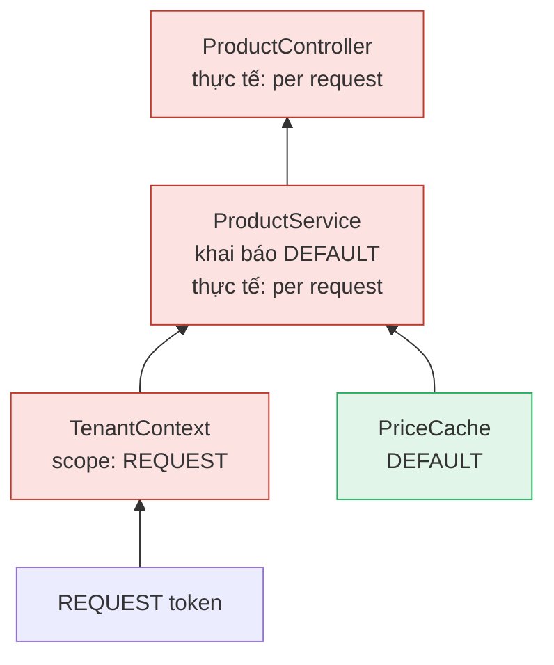
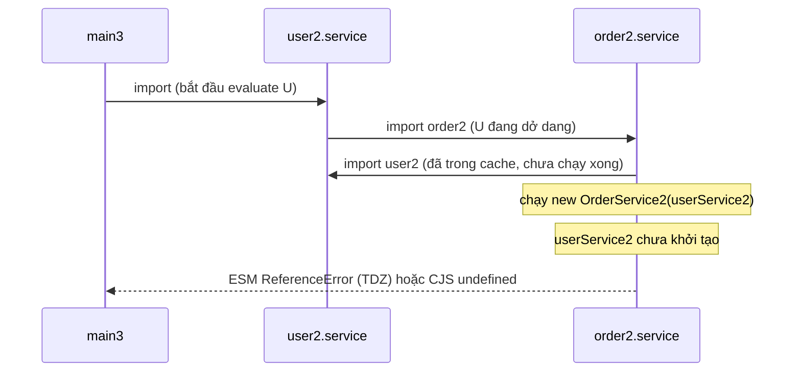

## Bối cảnh & vấn đề

Ba triệu chứng thường gặp trong một backend Node/TypeScript đang lớn:

1. Viết unit test cho `PlaceOrder` thì phải mock một `OrderRepository` có 30 method, dù use case chỉ gọi `findById` và `save`. Mỗi lần ai đó thêm method vào repository, 14 file test phải sửa stub.
2. `OrderService` có dòng `private db = new PrismaClient()`. Không test được nếu không có database thật, và đổi sang read replica cho một query phải sửa class nghiệp vụ.
3. Một dev NestJS thêm `TenantContext` request-scoped để đọc tenant từ header. Sau deploy, p99 latency tăng, GC chạy nhiều hơn, và một cache in-memory trong service "không bao giờ hit".

Ba vấn đề này có chung gốc: **ai phụ thuộc vào ai, và ai tạo ra ai**. Bài này đi qua hai chữ cuối của SOLID (**ISP**, **DIP**), kỹ thuật **Dependency Injection** dùng để hiện thực DIP, các container DI và scope của chúng, và một hệ quả hay bị bỏ qua: **circular dependency**. Ba chữ đầu S, O, L nằm ở [bài 2](/tracks/design-patterns/learn/solid-srp-ocp-lsp).

## Khái niệm

### ISP: client chỉ phụ thuộc thứ nó dùng

**Interface Segregation Principle**: không client nào bị ép phụ thuộc vào method nó không dùng. Một interface "béo" tạo coupling giả: `CancelOrder` chỉ cần đọc và ghi một đơn, nhưng vì nó phụ thuộc `OrderRepository` 30 method, mọi thay đổi signature của `exportCsv` cũng là thay đổi trong dependency của nó. Test double phải stub cả 30 method (hoặc dùng `as any`, mất type safety).

Trong TypeScript, cách hiện thực ISP tự nhiên là **interface nhỏ theo role**: `OrderReader`, `OrderWriter`, `OrderSearch`. Một class cụ thể implement nhiều role (`SqlOrderRepository implements OrderReader, OrderWriter`), còn mỗi client khai báo đúng tổ hợp nó cần bằng **intersection type**. Với interface có sẵn mà không muốn tách, `Pick<OrderRepository, 'findById' | 'save'>` tại chỗ dùng cũng đạt mục đích.

```ts
interface OrderReader { findById(id: OrderId): Promise<Order | null> }
interface OrderWriter { save(o: Order): Promise<void> }
interface OrderSearch { search(q: OrderQuery): Promise<OrderSummary[]> }

class CancelOrder { constructor(private orders: OrderReader & OrderWriter) {} /* ... */ }
class SqlOrderRepository implements OrderReader, OrderWriter, OrderSearch { /* ... */ }

// test double chỉ cần hai method
const fake: OrderReader & OrderWriter = { findById: async () => anOrder(), save: async () => {} };
```

Liên hệ hexagonal ([bài 8](/tracks/design-patterns/learn/hexagonal-clean-architecture)): **port** nên được định nghĩa theo **nhu cầu của use case**, không theo khả năng của database. ISP cũng là cách chữa vi phạm LSP kiểu "subtype throw cho method không hỗ trợ" ([bài 2](/tracks/design-patterns/learn/solid-srp-ocp-lsp#sec-batch-refund-truoc-va-sau-khi-tach-capability)).

**Interview angle:** "ISP giúp mock dễ hơn thế nào?" Trả lời bằng con số: stub 2 method thay vì 30, và test không vỡ khi interface của client khác đổi.

### DIP: hướng phụ thuộc trỏ vào abstraction của phía high-level

**Dependency Inversion Principle** có hai vế: (1) module **high-level** (chính sách nghiệp vụ: đặt hàng, tính giá) và module **low-level** (chi tiết: Prisma, Stripe, SES) đều phụ thuộc vào **abstraction**; (2) abstraction không phụ thuộc chi tiết, chi tiết phụ thuộc abstraction. Phần hay bị bỏ qua: abstraction **thuộc về phía high-level**. Interface `OrderRepository` nằm trong package của use case (core), và package `adapters/sql` import nó để implement. Mũi tên source code đi từ chi tiết **vào** chính sách, ngược với hướng gọi lúc runtime. Đó là chữ "inversion".

Nếu interface nằm trong package adapter (ví dụ `prisma-repository` export `IOrderRepository` và core import nó), core vẫn phụ thuộc package hạ tầng, dù có interface. DIP bị vi phạm dù code "có abstraction".

### IoC, DI và DIP: ba thứ khác nhau

- **Inversion of Control (IoC)** là nguyên lý chung nhất: **framework gọi code của bạn** thay vì bạn gọi framework ("don't call us, we'll call you"). Express gọi handler của bạn, event loop gọi callback, Template Method gọi bước subclass override.
- **Dependency Injection (DI)** là một **kỹ thuật** cụ thể của IoC áp dụng cho việc **tạo dependency**: object nhận dependency từ bên ngoài (constructor, setter, tham số) thay vì tự `new`. Quyền quyết định "dùng implementation nào" bị đảo ra ngoài.
- **DIP** là nguyên lý **thiết kế** về **hướng phụ thuộc** của source code.

Chúng liên quan nhưng độc lập. Có thể dùng DI mà **vẫn vi phạm DIP**: inject thẳng `PrismaClient` vào domain service. Dependency được inject (test được bằng cách truyền mock Prisma), nhưng core vẫn biết Prisma, đổi ORM vẫn phải sửa core. Và có thể theo DIP mà không dùng container nào: manual constructor injection là đủ.

**Interview angle:** red flag là "DIP chỉ là dùng DI container". Câu hỏi follow-up: "trong hexagonal, package nào sở hữu interface `OrderRepository`?" Đáp án: core (application layer).

### Dependency Injection và composition root

DI có ba dạng chính (Fowler 2004): **constructor injection** (phổ biến nhất, dependency bắt buộc, object hợp lệ ngay khi tạo), **setter injection** (dependency tuỳ chọn, nhưng object có thể ở trạng thái thiếu), và **interface/method injection** (truyền dependency qua tham số của method, hợp với thứ thay đổi theo từng lời gọi như `Clock` hoặc transaction).

**Composition root** là **nơi duy nhất** biết mọi implementation cụ thể và ghép graph object: thường là `main.ts` (hoặc module root trong Nest). Mọi chỗ khác chỉ nhận dependency qua constructor. Nhờ vậy, đổi `SesNotifier` thành `SendgridNotifier` là sửa một dòng ở composition root, và test dựng graph khác (in-memory) mà không chạm code nghiệp vụ.

```ts
interface Clock { now(): Date }
interface OrderRepo { save(o: Order): Promise<void> }

class PlaceOrder {
  constructor(private repo: OrderRepo, private clock: Clock) {}
  async run(cmd: PlaceOrderCmd) {
    const order = Order.create(cmd, this.clock.now());
    await this.repo.save(order);
    return order.id;
  }
}
// composition root (main.ts)
const placeOrder = new PlaceOrder(new SqlOrderRepo(pool), { now: () => new Date() });
// test
const t = new PlaceOrder(new InMemoryOrderRepo(), { now: () => new Date("2026-01-01T00:00:00Z") });
```

Không cần framework: với service vài chục class, manual DI ở composition root rõ ràng, type-safe hoàn toàn, lỗi wiring là lỗi compile. **DI container** (NestJS, tsyringe, InversifyJS, Awilix) đáng giá khi graph lớn, cần **scope** (singleton, per-request), lifecycle hook, hoặc module hoá theo feature. Cái giá: wiring dựa trên metadata/token, lỗi thiếu provider là lỗi **runtime** lúc boot.

### Service Locator: vì sao là anti-pattern

**Service Locator** là một registry toàn cục mà code **tự hỏi** dependency: `const repo = Locator.get<OrderRepo>('OrderRepo')`. Nó cũng tách code khỏi implementation cụ thể, nên trông giống DI. Khác biệt: với DI, dependency **hiện trên constructor**; với Service Locator, dependency **ẩn trong thân method**. Đọc signature `new PlaceOrder()` không biết nó cần gì; test phải biết cấu hình locator đúng key; quên đăng ký một service là lỗi runtime ở lời gọi đầu tiên, có thể sâu trong một nhánh hiếm. Mark Seemann gọi nó là anti-pattern vì lý do này: nó vi phạm encapsulation của contract (signature nói dối về dependency). Trong Nest, gọi `moduleRef.get()` rải rác trong service là Service Locator trá hình; chỉ nên dùng ở chỗ hạ tầng (factory động, plugin).

**Interview angle:** "DI khác Service Locator thế nào?" Một câu: DI **đẩy** dependency vào qua constructor nên nó hiện ra; Service Locator để code **kéo** dependency từ global nên nó ẩn đi.

### DI scope trong NestJS

Nest có ba scope cho provider (docs: Injection scopes):

- **DEFAULT** (singleton): một instance cho cả app, tạo lúc boot. Đây là mặc định và là lựa chọn đúng cho hầu hết provider.
- **REQUEST**: một instance mới **cho mỗi request**, garbage-collect sau khi request xong. Inject được token `REQUEST` để đọc request.
- **TRANSIENT**: mỗi consumer nhận một instance riêng (không chia sẻ).

Điểm then chốt mà docs nói rõ: **scope bubbles up the injection chain**. Một controller phụ thuộc `ProductService`, `ProductService` phụ thuộc `TenantContext` request-scoped, thì `ProductService` và controller **cũng trở thành request-scoped**: Nest phải tạo mới chúng mỗi request để inject `TenantContext` của request đó. Provider không phụ thuộc gì request-scoped (như `PriceCache` độc lập) vẫn là singleton. Hệ quả: chi phí khởi tạo và GC theo request, và **state in-memory trong các class bị kéo theo bị mất** sau mỗi request (một `Map` cache đặt trong `ProductService` không bao giờ hit). Docs Nest cũng cảnh báo request scope ảnh hưởng performance (verify con số cụ thể theo phiên bản).

Các cách tránh: đọc context theo request qua **`AsyncLocalStorage`** (thư viện `nestjs-cls` đóng gói sẵn) để toàn bộ graph vẫn là singleton; hoặc **durable providers** (`ContextIdFactory.apply(strategy)` với `durable: true`) để chia sẻ một sub-tree instance **theo tenant** thay vì theo request, hợp cho per-tenant DB connection (verify API theo phiên bản Nest).

### Circular dependency

**Circular dependency** là khi module A import B và B import A (trực tiếp hoặc qua chuỗi). Nó là dấu hiệu **coupling hai chiều**: hai module không thể hiểu, test, hay deploy riêng. Ở mức runtime, nó gây lỗi khó hiểu vì module loader phải **cắt vòng**: khi đang evaluate A thì gặp import B, loader evaluate B; B import A, nhưng A **chưa chạy xong**, nên B nhìn thấy A ở trạng thái dở dang.

- Trong **CommonJS**, B nhận `exports` chưa đầy đủ của A: thuộc tính chưa gán là `undefined`. Nếu B destructure ngay lúc load (`const { userService } = require('./user')`) thì giữ `undefined` mãi mãi. Node in cảnh báo `Accessing non-existent property ... inside circular dependency`.
- Trong **ESM**, binding là **live** nhưng nằm trong **TDZ** (temporal dead zone) cho tới khi dòng `export const` chạy. Dùng nó trong lúc evaluate (gọi constructor, `extends`) ném `ReferenceError: Cannot access 'x' before initialization`. Truy cập muộn (trong method gọi sau khi mọi module đã load) thì chạy được.

Nghĩa là cùng một vòng import có thể **chạy hay vỡ tuỳ entry point** và tuỳ binding được dùng lúc load hay lúc gọi. Đó là lý do lỗi này hay xuất hiện sau một refactor không liên quan (đổi thứ tự import, thêm một file entry mới).

## Cơ chế hoạt động

Sơ đồ dưới là đồ thị inject trong thí nghiệm Nest ở phần Ví dụ. Đỏ là request-scoped, xanh là singleton:



Mũi tên đi từ dependency lên consumer. Request scope lan **ngược chiều inject** (từ `TenantContext` lên `ProductService` rồi controller), vì consumer của một thứ thay đổi theo request không thể là một instance dùng chung. Nó không lan **xuống**: `PriceCache` không phụ thuộc gì request-scoped nên vẫn được tạo một lần lúc boot. Muốn cắt sự lan truyền, phải bỏ phụ thuộc vào provider request-scoped: thay bằng singleton đọc `AsyncLocalStorage`.

Với circular import, thứ tự evaluate quyết định ai thấy ai ở trạng thái dở dang. Trường hợp entry vào vòng từ phía `user2`:



Loader thấy `user2` đã nằm trong module map (đang evaluate) nên không evaluate lại, trả về bản dở dang để cắt vòng. `order2` dùng `userService2` **ngay lúc load** (truyền vào constructor), nên vỡ. Nếu entry là `order2`, thứ tự đảo lại và mọi thứ chạy, đó là lý do bug "lúc có lúc không".

## Ví dụ thực tế

### NestJS: đếm instance khi một provider request-scoped

Chạy thật với `@nestjs/core` 11.2.7, `@nestjs/platform-express` 11.2.7, Node 24.21, biên dịch bằng `tsc` 5.9 (`experimentalDecorators` + `emitDecoratorMetadata`):

```ts
const created: Record<string, number> = {};
const bump = (n: string) => (created[n] = (created[n] ?? 0) + 1);

@Injectable({ scope: Scope.REQUEST })
class TenantContext {
  constructor(@Inject(REQUEST) req: Request) { bump("TenantContext"); this.tenantId = String(req.headers["x-tenant"]); }
  tenantId: string;
}
@Injectable() class PriceCache { cache = new Map<string, number>(); constructor() { bump("PriceCache"); } }
@Injectable()
class ProductService {           // declared default (singleton) scope...
  constructor(private tenant: TenantContext, private prices: PriceCache) { bump("ProductService"); }
  price(sku: string) { return `${this.tenant.tenantId}:${sku}`; }
}
@Controller()
class ProductController {
  constructor(private svc: ProductService) { bump("ProductController"); }
  @Get("/p") get() { return this.svc.price("SKU-1"); }
}
// boot, rồi gửi 3 request với x-tenant: acme, globex, acme
```

```text
after boot: { PriceCache: 1 }
after 3 requests: {
  PriceCache: 1,
  TenantContext: 3,
  ProductService: 3,
  ProductController: 3
}
```

Sau boot chỉ có `PriceCache` được tạo: controller và service **không** được tạo lúc boot vì chúng đã bị kéo thành request-scoped. Ba request tạo ba bộ `TenantContext` + `ProductService` + `ProductController`. Nếu `ProductService` giữ một `Map` cache, nó mất sau mỗi request.

### Thay bằng AsyncLocalStorage: graph vẫn là singleton

```ts
const als = new AsyncLocalStorage<{ tenantId: string }>();

@Injectable()
class TenantContext {            // singleton, reads the per-request store
  get tenantId() { const s = als.getStore(); if (!s) throw new Error("no tenant context"); return s.tenantId; }
}
@Injectable()
class ProductService {
  constructor(private tenant: TenantContext) {}
  async price(sku: string) { await new Promise((r) => setTimeout(r, Math.random() * 20)); return `${this.tenant.tenantId}:${sku}`; }
}
// middleware: als.run({ tenantId: req.headers["x-tenant"] }, next)
// gửi 6 request song song: acme, globex, initech, acme, globex, initech
```

```text
[
  'acme:SKU-1',
  'globex:SKU-1',
  'initech:SKU-1',
  'acme:SKU-1',
  'globex:SKU-1',
  'initech:SKU-1'
]
instances: { TenantContext: 1, ProductService: 1, ProductController: 1 }
```

Sáu request song song, mỗi cái `await` một khoảng ngẫu nhiên, vẫn đọc đúng tenant của mình, và mọi provider chỉ có một instance. `AsyncLocalStorage` truyền context theo **async call chain**, không theo object. Cái giá: context là implicit (không hiện trên signature), có chi phí nhỏ cho async hooks, và code chạy ngoài `als.run` (cron job, consumer Kafka) phải tự mở context, nếu không `getStore()` trả `undefined` (ở đây ném lỗi rõ ràng thay vì âm thầm dùng tenant sai).

### Circular import: cùng code, khác entry point

Hai module phụ thuộc nhau, `order2.service` dùng `userService2` **ngay lúc load** (constructor injection ở top level):

```ts
// order2.service.ts
import { userService2 } from "./user2.service";
export class OrderService2 { constructor(private users: { find(id: string): unknown }) {} owner(id: string) { return this.users.find(id); } }
export const orderService2 = new OrderService2(userService2);

// user2.service.ts
import { orderService2 } from "./order2.service";
export class UserService2 { find(id: string) { return { id }; } orders(id: string) { return orderService2.owner(id); } }
export const userService2 = new UserService2();
```

Entry import `order2` trước: chạy bình thường (`{ id: 'u1' }`) cả CJS lẫn ESM. Entry import `user2` trước:

```text
== CJS main3
main3: TypeError: Cannot read properties of undefined (reading 'find')
== ESM main3
ReferenceError: Cannot access 'userService2' before initialization
```

Còn với CommonJS viết tay destructure lúc load, Node cảnh báo ngay:

```text
TypeError: Cannot read properties of undefined (reading 'find')
(node:27976) Warning: Accessing non-existent property 'userService' of module exports inside circular dependency
```

Phát hiện sớm bằng tool thay vì chờ production. `madge` 8.0.0:

```text
$ npx madge --circular --extensions ts src
✖ Found 2 circular dependencies!

1) order.service.ts > user.service.ts
2) order2.service.ts > user2.service.ts
```

Fix theo thứ tự ưu tiên: (1) tách phần dùng chung thành module thứ ba mà cả hai cùng import (thường là phát hiện ra một khái niệm bị thiếu, ví dụ `OrderOwnership`); (2) đảo một chiều phụ thuộc qua interface hoặc domain event (User không cần gọi Order, nó phát `UserDeactivated` và Order nghe); (3) lazy access (truyền `() => userService` thay vì giá trị). NestJS `forwardRef(() => UserService)` cho phép Nest resolve vòng giữa provider/module, nhưng chỉ **che triệu chứng**: hai module vẫn coupling hai chiều, thứ tự khởi tạo vẫn mong manh, và docs Nest khuyên tránh circular dependency khi có thể. Thêm `import/no-cycle` (eslint-plugin-import) hoặc dependency-cruiser vào CI để vòng mới không lọt vào.

## Trade-offs & lựa chọn thay thế

| Cách cấp dependency | Được | Mất | Hợp khi |
| --- | --- | --- | --- |
| `new` trực tiếp trong class | Đơn giản nhất | Không thay được, khó test, phụ thuộc chi tiết | Value object, helper thuần không I/O |
| Manual constructor DI + composition root | Type-safe, lỗi wiring là lỗi compile, không magic | Composition root dài khi graph lớn | Service nhỏ/vừa, Lambda, CLI |
| DI container (Nest, tsyringe, Inversify) | Wiring tự động, scope, lifecycle, module | Metadata/decorator, lỗi runtime lúc boot, scope bubbling | App lớn, nhiều module, cần per-request/per-tenant |
| Service Locator | Không phải truyền dependency | Dependency ẩn, test khó, lỗi runtime muộn | Chỉ ở hạ tầng (plugin loader, factory động) |
| Request-scoped provider | Đơn giản về mặt khái niệm | Lan lên cả chuỗi, tạo object mỗi request, mất state | Ít provider, traffic thấp |
| AsyncLocalStorage (nestjs-cls) | Graph vẫn singleton | Context implicit, phải mở context cho job/consumer | Context theo request: tenant, user, correlation id |
| Durable provider | Chia sẻ instance theo tenant | Phức tạp, số tenant lớn thì nhiều instance | Per-tenant connection/config |

Chọn thế nào: mặc định **constructor injection**; composition root thủ công cho service nhỏ, container khi graph lớn và cần scope. Interface theo role (ISP) do core định nghĩa (DIP). Tránh request scope cho thứ chỉ cần **dữ liệu** của request (tenant id, user id): dùng ALS. Dùng durable provider khi cần **instance** khác nhau theo tenant (connection pool riêng).

## Edge cases & failure modes

- **Request scope lan tới provider có lifecycle hook**: `onModuleInit` không chạy cho provider request-scoped theo cách bạn nghĩ (nó không được tạo lúc boot). Warm-up cache, mở connection trong đó sẽ không xảy ra (verify với phiên bản Nest).
- **ALS mất context**: callback đăng ký qua thư viện dùng connection pool tự quản (một số driver cũ, `EventEmitter` tạo ngoài context) chạy trong context của lúc tạo, không phải lúc gọi. Kết quả là đọc nhầm tenant của request khác hoặc `undefined`. Test multi-tenant song song là bắt buộc.
- **Circular import chỉ vỡ ở một entry point**: unit test import module theo thứ tự khác app, nên test xanh mà production `ReferenceError` (hoặc ngược lại). Chặn bằng `madge --circular` trong CI.
- **Thiếu provider trong container**: lỗi `Nest can't resolve dependencies of X (?)` chỉ xuất hiện lúc boot. Với manual DI, lỗi tương tự là compile error.
- **Interface béo trong test double**: dùng `as unknown as OrderRepository` để khỏi stub đủ method. Khi code gọi method chưa stub, test ném `undefined is not a function` ở chỗ khó hiểu. Interface nhỏ loại bỏ nhu cầu cast.
- **DI vẫn vi phạm DIP**: inject `PrismaClient` vào domain service, test mock Prisma bằng deep mock. Test xanh nhưng gắn chặt vào API Prisma; nâng cấp Prisma vỡ hàng trăm test.

## Pitfalls

- ❌ Một `Repository` 30 method cho mọi client → ✅ interface theo role (`OrderReader`, `OrderWriter`), client khai báo intersection nó cần.
- ❌ Interface đặt trong package adapter, core import vào → ✅ core sở hữu port; adapter import core để implement.
- ❌ "DIP = dùng DI container" → ✅ DIP là hướng phụ thuộc; DI là kỹ thuật; container là tiện ích tuỳ chọn.
- ❌ `moduleRef.get()` / `Locator.get()` rải trong service → ✅ constructor injection để dependency hiện trên signature.
- ❌ Request-scoped provider chỉ để đọc tenant id → ✅ `AsyncLocalStorage` (nestjs-cls) hoặc truyền tham số; giữ graph singleton.
- ❌ `forwardRef()` như cách sửa circular dependency → ✅ tách module thứ ba hoặc đảo chiều bằng interface/event; `forwardRef` chỉ là băng keo.
- ❌ Không có kiểm tra vòng import trong CI → ✅ `madge --circular`, `import/no-cycle` hoặc dependency-cruiser.

## Tóm tắt

- ISP: interface nhỏ theo role, client chỉ phụ thuộc thứ nó dùng; test double nhỏ, thay đổi không lan.
- DIP: high-level và low-level cùng phụ thuộc abstraction, và **abstraction thuộc về phía high-level** (core sở hữu port).
- IoC là nguyên lý chung (framework gọi bạn), DI là kỹ thuật cấp dependency từ ngoài, DIP là hướng phụ thuộc. Có thể DI mà vẫn phá DIP.
- Constructor injection + một composition root là đủ cho service nhỏ; container khi cần scope và graph lớn. Service Locator ẩn dependency nên là anti-pattern.
- Nest REQUEST scope lan ngược lên chuỗi inject (đo thật: service và controller tạo lại mỗi request); dùng ALS hoặc durable provider để tránh.
- Circular import: CJS cho `undefined`, ESM cho `ReferenceError` (TDZ), tuỳ entry point và binding dùng lúc load hay lúc gọi. Sửa bằng thiết kế, phát hiện bằng `madge`/lint trong CI.
