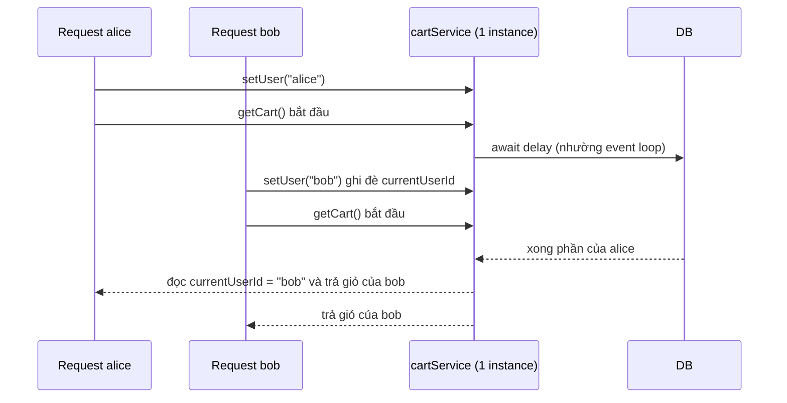
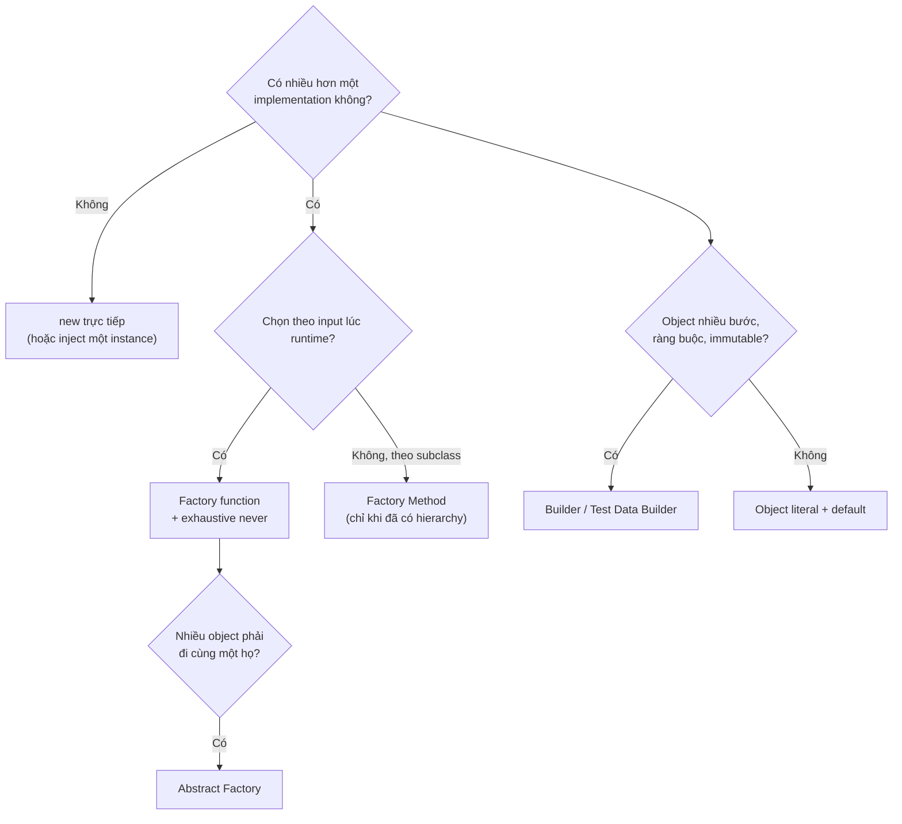

## Bối cảnh & vấn đề

Ticket lúc 2 giờ sáng: "Thỉnh thoảng khách thấy giỏ hàng của người khác". Không tái hiện được trên máy dev, chỉ xảy ra khi tải cao. Code route rất ngắn: `cartService.setUser(req.user.id)` rồi `await cartService.getCart()`. `cartService` là một instance được export từ module, "singleton cho tiết kiệm". Hai request xen kẽ nhau qua một `await`, request sau ghi đè `currentUserId` của request trước. Đây là **rò dữ liệu giữa user**, một sự cố bảo mật, sinh ra từ một quyết định "tạo object thế nào".

**Creational patterns** (nhóm khởi tạo của GoF) trả lời câu hỏi: **ai tạo object, khi nào, và bao nhiêu instance**. Quyết định này nghe nhỏ, nhưng nó quyết định coupling (code gọi `new StripeClient()` thì gắn chặt vào Stripe), testability (không thay được thứ bạn tự `new`), và cả tính đúng đắn khi chạy đồng thời (một instance dùng chung cho mọi request).

Bài này đi qua bốn pattern: **Factory** (ba biến thể), **Builder**, **Singleton**, **Prototype**, luôn với góc nhìn TypeScript: nhiều pattern co lại thành function hoặc tính năng ngôn ngữ, và câu hỏi quan trọng là "khi nào **không** cần".

## Khái niệm

### Factory function (Simple Factory)

**Factory function** là một function trả về object, che giấu **class cụ thể nào** được tạo và **cách** tạo nó. `createNotifier('sms', deps)` trả về một `Notifier`; caller không biết đó là `TwilioNotifier`. Đây không phải pattern GoF chính thức (thường gọi là "Simple Factory"), nhưng là dạng dùng nhiều nhất trong TypeScript: khoảng 90% nhu cầu factory là thế này.

Lợi ích: một chỗ duy nhất biết ánh xạ "input → implementation", caller phụ thuộc interface. Kết hợp **discriminated union + exhaustive check bằng `never`**, compiler sẽ báo lỗi ở đúng chỗ khi ai đó thêm channel mới mà quên xử lý. Đây là dạng `switch` "an toàn" mà [bài 2](/tracks/design-patterns/learn/solid-srp-ocp-lsp) nhắc tới: vi phạm OCP về hình thức (phải sửa factory), nhưng chi phí rất thấp và an toàn nhờ compiler.

### Factory Method

**Factory Method** (GoF): base class định nghĩa một method trừu tượng `createX()`, subclass quyết định class cụ thể. Code chung của base class gọi `this.createX()` mà không biết loại cụ thể. Nó là **Template Method áp dụng cho việc khởi tạo** ([bài 6](/tracks/design-patterns/learn/behavioral-strategy-command-state)), và chỉ hợp khi bạn **đã có** một hierarchy, ví dụ framework importer có `abstract createParser()` mà mỗi loại file override.

Trong TS hiện đại, Factory Method thường được thay bằng **truyền factory function vào constructor** (`new Importer(() => new CsvParser())`), tức composition thay inheritance. Một ghi chú hay bị hiểu sai: Factory Method **không xoá** việc chọn loại cụ thể; nó dời quyết định sang chỗ chọn **subclass nào** để `new`. Nếu chỗ đó vẫn là một `switch`, bạn chỉ chuyển `switch` đi chỗ khác.

### Abstract Factory

**Abstract Factory** tạo **một họ object liên quan phải đi cùng nhau**. `CloudFactory` có `createStorage()` và `createQueue()`; `AwsFactory` trả `S3Storage` + `SqsQueue`, `GcpFactory` trả `GcsStorage` + `PubSubQueue`. Mục đích chính là **nhất quán**: không bao giờ vô tình ghép `S3Storage` với `PubSubQueue` (khác IAM, khác region model). Ví dụ khác: bộ UI component theo theme, bộ driver theo database.

Nhược điểm cố hữu: thêm **một họ mới** thì dễ (một factory mới), nhưng thêm **một loại sản phẩm mới** (`createCache()`) phải sửa mọi factory. Chỉ dùng khi có ít nhất hai họ thật sự tồn tại.

**Interview angle:** "factory function vs Factory Method vs Abstract Factory": trả lời bằng **khi nào dùng** (function: hầu hết; Factory Method: đã có hierarchy; Abstract Factory: họ object phải khớp nhau), và nói luôn "chỉ một implementation thì `new` trực tiếp".

### Builder

**Builder** tách việc **xây dựng** object phức tạp ra khỏi biểu diễn của nó: gọi từng bước (`withLine`, `paid`), rồi `build()` kiểm tra và trả object hoàn chỉnh. GoF có thêm vai trò **Director** biết trình tự bước cho một cấu hình chuẩn (xây "SportsCar" hay "SUV" từ cùng một builder).

Trong TypeScript, với config đơn giản, **object literal + default** (`{ ...defaults, ...opts }`) cộng optional property đã giải quyết vấn đề "telescoping constructor" (constructor 8 tham số). Builder còn đáng dùng khi:

1. Xây dựng **nhiều bước có ràng buộc** (thứ tự, validation chéo: "đơn phải có ít nhất một line").
2. Object phải **immutable** sau khi build (`Object.freeze`), nhưng cần lắp ghép dần.
3. **Fluent API** cho query/request: Knex, query builder của các ORM, `new URLSearchParams`.
4. **Test Data Builder**: `anOrder().withStatus('paid').build()` với default hợp lệ, test chỉ nêu điều nó quan tâm. Đây là use case phổ biến nhất trong backend.
5. **Type-state builder**: compiler từ chối `build()` khi thiếu field bắt buộc.

Type-state builder có một gotcha của structural typing: nếu type parameter trạng thái `S` không xuất hiện trong **cấu trúc** của class, mọi `OrderBuilder<...>` đều tương thích với nhau và compiler không bắt được gì. Phải thêm một **phantom field** (`declare readonly __state: S`) để `S` trở thành một phần của shape (ví dụ chạy thật ở dưới).

### Singleton

**Singleton** (GoF) đảm bảo một class có **đúng một instance** và cung cấp một **global access point** (`Config.getInstance()`). Nó bị gọi là anti-pattern vì: **global state ẩn** (dependency không hiện trên constructor, giống Service Locator ở [bài 3](/tracks/design-patterns/learn/isp-dip-dependency-injection)), **khó test** (không thay bằng fake được, state rò giữa các test), và rất dễ bị dùng để giữ **state theo request**.

Trong Node, bạn gần như không cần viết `getInstance()`: **module cache** đã biến mỗi module thành singleton. Docs Node: module được cache theo **resolved filename**; `require` (hoặc `import`) cùng một file nhiều lần trả cùng một object. `export const logger = createLogger()` là đủ. Cách tốt hơn nữa: để **DI container** quản lý scope singleton (Nest `DEFAULT` scope) và inject nó, để dependency hiện trên constructor.

Gotcha của "một instance": nó chỉ đúng **per process và per resolved path**. Cluster mode, 8 pod Kubernetes, worker thread: mỗi cái có một instance riêng. Hai phiên bản của cùng package trong `node_modules` (app dùng `logger@2`, một SDK kèm `logger@1` trong `node_modules` riêng) là hai file khác nhau, nên là hai instance. Một rate limiter đếm trong memory của singleton chạy trên 8 pod cho phép gấp 8 lần quota.

Singleton hợp lệ: connection pool, logger, config, HTTP agent: những thứ **đắt để tạo** và **stateless theo request** (hoặc state của chúng là thread-safe/shared đúng nghĩa như pool).

**Interview angle:** red flag là "Singleton đảm bảo một instance trên toàn hệ thống". Câu follow-up kinh điển: "8 pod, rate limit bằng counter trong Singleton, cái gì vỡ?" Đáp: mỗi pod một counter, quota thực tế gấp 8 và lệch theo load balancer; cần store dùng chung (Redis) với thao tác atomic.

### Prototype

**Prototype** tạo object mới bằng cách **clone** một object mẫu thay vì dựng từ đầu, hữu ích khi khởi tạo đắt hoặc cần nhiều biến thể gần giống nhau. Trong JS, "prototype" còn là cơ chế kế thừa của ngôn ngữ (prototype chain), và hai khái niệm này hay bị lẫn.

`Object.create(original)` **không** clone: nó tạo object rỗng mà **prototype là `original`**. Đọc `copy.radius` đi theo prototype chain về `original`, nên khi `original` đổi, "bản sao" đổi theo. Các cách copy thật: spread `{ ...obj }` (shallow, mất prototype nên mất method), `structuredClone(obj)` (deep copy dữ liệu, nhưng **mất class prototype**, không copy function, không clone được class instance có `#private` theo cách bạn muốn), hoặc một method `clone()` tự viết gọi constructor và copy sâu những field cần thiết. Với domain object, method `clone()` (hoặc immutable update tạo object mới) là rõ ràng nhất.

## Cơ chế hoạt động

Bug giỏ hàng xảy ra vì **một instance** được dùng bởi **nhiều request đồng thời** trên cùng event loop. Node đơn luồng nhưng **concurrent**: mỗi `await` trả quyền cho event loop, request khác chạy tiếp trên cùng object:



Không có thread nào, không có race condition kiểu CPU, chỉ có **interleaving tại `await`**. Bất kỳ field nào của một object dùng chung bị **ghi theo request** rồi **đọc sau một `await`** đều có lỗi này. Ba cách sửa, theo thứ tự ưu tiên: (1) **stateless**: truyền `userId` làm tham số, object không giữ gì theo request; (2) **AsyncLocalStorage**: context theo async call chain, không theo object; (3) **request-scoped instance** (Nest `Scope.REQUEST`), với chi phí đã đo ở [bài 3](/tracks/design-patterns/learn/isp-dip-dependency-injection#sec-nestjs-dem-instance-khi-mot-provider-request-scoped).

Chọn creational pattern nào có thể tóm thành một cây quyết định ngắn:



Cây này cố ý bắt đầu bằng "có cần không?". Phần lớn object trong một backend chỉ có một implementation và được tạo một lần ở composition root; pattern chỉ xuất hiện khi có biến thể thật.

## Ví dụ thực tế

### Repro bug giỏ hàng và hai cách sửa

Chạy với tsx 4.23 / Node 24.21. Hai request đồng thời cho alice và bob:

```ts
class CartService {                       // BUG: per-request state in a process-wide instance
  private currentUserId?: string;
  setUser(id: string) { this.currentUserId = id; }
  async getCart() { await delay(5); return { user: this.currentUserId, items: carts[this.currentUserId!] }; }
}
const cartService = new CartService();
async function route(userId: string) { cartService.setUser(userId); return { requester: userId, ...(await cartService.getCart()) }; }
console.log("BUGGY:", await Promise.all([route("alice"), route("bob")]));

class CartServiceFixed {                  // stateless: userId is a parameter
  async getCart(userId: string) { await delay(5); return { user: userId, items: carts[userId] }; }
}

const als = new AsyncLocalStorage<{ userId: string }>();
class CartServiceAls {
  async getCart() { await delay(5); const { userId } = als.getStore()!; return { user: userId, items: carts[userId] }; }
}
// gọi: als.run({ userId: u }, () => viaAls.getCart())
```

```text
BUGGY: [
  { requester: 'alice', user: 'bob', items: [ 'laptop', 'mouse' ] },
  { requester: 'bob', user: 'bob', items: [ 'laptop', 'mouse' ] }
]
STATELESS: [
  { requester: 'alice', user: 'alice', items: [ 'book' ] },
  { requester: 'bob', user: 'bob', items: [ 'laptop', 'mouse' ] }
]
ALS: [
  { requester: 'alice', user: 'alice', items: [ 'book' ] },
  { requester: 'bob', user: 'bob', items: [ 'laptop', 'mouse' ] }
]
```

Alice nhận giỏ của bob, đúng như ticket. Lỗi chỉ cần **hai** request chồng lên nhau trong 5 ms, nên trên máy dev (một người click) không bao giờ thấy. Bản stateless là cách sửa nên chọn: dependency theo request hiện trên signature. ALS hợp khi context phải đi xuyên nhiều tầng mà không muốn thêm tham số ở mọi hàm (tenant id, correlation id); cái giá là context implicit và phải mở context cho code chạy ngoài request.

### Factory function với exhaustive check

```ts
type Channel = "email" | "sms" | "push" | "zalo";   // "zalo" vừa được thêm
interface Notifier { send(to: string, msg: string): Promise<void> }
export const createNotifier = (c: Channel): Notifier => {
  switch (c) {
    case "email": return mk("ses");
    case "sms": return mk("twilio");
    case "push": return mk("fcm");
    default: { const _exhaustive: never = c; throw new Error(`unknown channel ${_exhaustive}`); }
  }
};
```

```text
l04/exhaustive.ts(9,22): error TS2322: Type '"zalo"' is not assignable to type 'never'.
```

Khi union có thêm `"zalo"`, nhánh `default` không còn nhận `never` nữa và `tsc` 5.9 báo lỗi **tại factory**, chứ không phải lúc runtime khi người dùng chọn Zalo. Đây là lý do một `switch` có exhaustive check thường tốt hơn một registry `Record<string, Notifier>` nếu team tự kiểm soát danh sách channel: registry lỏng (`string` key) chỉ lỗi runtime. Nếu dùng registry, khai báo kiểu `Record<Channel, Factory>` để compiler bắt thiếu key.

### Type-state builder: compiler từ chối build() khi thiếu field

```ts
type Has<K extends string> = { [P in K]: true };
class OrderBuilder<S extends Partial<Has<"customer" | "line">> = {}> {
  declare readonly __state: S;            // phantom: makes S part of the structure
  private constructor(private o: Partial<Order>) {}
  static create() { return new OrderBuilder({ lines: [], currency: "VND" }); }
  forCustomer(id: string) { return new OrderBuilder<S & Has<"customer">>({ ...this.o, customerId: id }); }
  withLine(sku: string, qty: number) { return new OrderBuilder<S & Has<"line">>({ ...this.o, lines: [...this.o.lines!, { sku, qty }] }); }
  inCurrency(c: Order["currency"]) { return new OrderBuilder<S>({ ...this.o, currency: c }); }
  build(this: OrderBuilder<Has<"customer" | "line">>): Readonly<Order> { return Object.freeze(this.o as Order); }
}
const ok = OrderBuilder.create().forCustomer("c1").withLine("SKU-1", 2).build();
const bad = OrderBuilder.create().withLine("SKU-1", 2).build();   // thiếu customer
```

```text
l04/typestate.ts(14,13): error TS2684: The 'this' context of type 'OrderBuilder<Has<"line">>' is not assignable to method's 'this' of type 'OrderBuilder<Has<"customer" | "line">>'.
  Property 'customer' is missing in type 'Has<"line">' but required in type 'Has<"customer" | "line">'.
```

Mỗi bước trả về builder với **type trạng thái mới**; `build()` khai báo `this` phải ở trạng thái đủ field. Thí nghiệm cho thấy: **bỏ dòng `declare readonly __state: S`** thì `bad` compile sạch, vì `S` không xuất hiện trong shape nên mọi `OrderBuilder<...>` là cùng một type đối với structural typing. Type-state builder đáng giá cho API công khai (SDK, query builder); trong code nội bộ, một hàm `createOrder({ customerId, lines })` với field bắt buộc thường đơn giản hơn.

### Singleton: "một instance" theo resolved path

Ba thư mục: app dùng `logger@2.0.0` ở `node_modules/logger`, một SDK kèm `logger@1.4.0` trong `node_modules/sdk/node_modules/logger`:

```text
same path twice: true
app logger 2.0.0 vs sdk logger 1.4.0 -> same instance? false
resolved: node_modules/logger/index.js | node_modules/sdk/node_modules/logger/index.js
```

Require cùng path hai lần trả cùng object (module cache). Nhưng "singleton" của SDK là một instance khác hoàn toàn, vì khác resolved filename. Lỗi thật hay gặp: `instanceof` thất bại giữa hai bản của cùng thư viện, hoặc hai registry/config "toàn cục" song song. `npm ls logger` cho thấy duplicate; `npm dedupe` hoặc `overrides` gom lại.

### Prototype: Object.create không phải bản sao

```ts
class Circle { constructor(public radius: number, public color: string, public tags: string[] = []) {} area() { return Math.round(Math.PI * this.radius ** 2); } }
const original = new Circle(10, "red", ["ui"]);
const viaCreate = Object.create(original) as Circle;   // NOT a copy
original.radius = 99;
const spread = { ...original };
const sc = structuredClone(original);
class Circle2 extends Circle { clone(): Circle2 { return new Circle2(this.radius, this.color, [...this.tags]); } }
```

```text
Object.create own keys: [] radius: 10
after original.radius=99 -> viaCreate.radius: 99
spread has area(): undefined | tags shared: true
structuredClone instanceof Circle: false | tags shared: false
explicit clone: true 79 [ 'x' ] [ 'x', 'y' ]
```

`Object.create` không có own property nào; đổi `original` thì "bản sao" đổi theo. Spread mất method và chia sẻ mảng `tags`. `structuredClone` copy sâu nhưng trả object thường (không còn `instanceof Circle`). Chỉ method `clone()` tự viết cho đúng cả class lẫn độc lập dữ liệu.

## Trade-offs & lựa chọn thay thế

| Pattern | Được | Mất | Khi KHÔNG dùng |
| --- | --- | --- | --- |
| Factory function | Một chỗ chọn implementation, exhaustive check | Sửa factory khi thêm loại | Chỉ có một implementation |
| Factory Method | Base class giữ khung, subclass chọn sản phẩm | Cần hierarchy, khó ghép | Không có hierarchy sẵn; truyền factory function thay thế |
| Abstract Factory | Họ object luôn khớp nhau | Thêm loại sản phẩm phải sửa mọi factory | Chỉ có một họ |
| Builder | Nhiều bước, validation, immutable, fluent | Thêm class, dễ thừa | Config phẳng: object literal + default là đủ |
| Test Data Builder | Test ngắn, default hợp lệ, ít vỡ khi thêm field | Một lớp nữa phải bảo trì | Test chỉ cần 1–2 object đơn giản |
| Singleton (class tự quản) | Một instance, lazy | Global state ẩn, khó test | Gần như luôn có lựa chọn tốt hơn |
| Module export / DI singleton | Một instance per process, inject được | Vẫn per process, per resolved path | Khi giữ state theo request hoặc cần nhất quán nhiều pod |
| Prototype / clone | Tạo biến thể nhanh từ mẫu | Deep vs shallow dễ sai | Khi constructor đã rẻ và rõ ràng |

Chọn thế nào: **mặc định `new` ở composition root**; thêm factory function khi chọn implementation theo dữ liệu runtime; Abstract Factory chỉ khi có họ object thật. Builder chủ yếu cho test data và API công khai. Singleton: dùng module export hoặc DI scope, giữ chúng **stateless theo request**; mọi thứ cần nhất quán giữa pod (rate limit, lock, counter) đi vào store dùng chung.

## Edge cases & failure modes

- **Per-request state trong singleton**: không chỉ field `currentUserId`. Một `this.lastError`, một mảng `this.buffer` tích dần, một biến module-level `let currentTenant` đều có cùng lỗi. Grep `this\.\w+ =` ngoài constructor trong service singleton là một review check đáng làm.
- **Singleton chứa cache không giới hạn**: `Map` trong một service sống suốt đời process, lớn dần tới OOM. Dùng LRU có giới hạn và TTL.
- **Lazy singleton với async init chạy hai lần**: `if (!client) client = await connect()` khi hai request tới cùng lúc tạo hai connection. Cache **promise** (`client ??= connect()`), không cache kết quả.
- **Duplicate package**: hai bản thư viện trong `node_modules` cho hai "singleton", `instanceof` sai giữa chúng. Kiểm tra bằng `npm ls <pkg>`.
- **Factory ẩn lỗi cấu hình**: factory trả về implementation "mặc định" khi không khớp key (thay vì throw) làm một tenant cấu hình sai âm thầm dùng provider khác.
- **Builder tái sử dụng sau build()**: builder mutable được dùng lại cho object thứ hai, object đầu bị sửa theo (shared array `lines`). Builder nên trả object freeze và copy dữ liệu, hoặc mỗi bước trả builder mới như type-state ở trên.
- **Clone nông dữ liệu lồng nhau**: copy một đơn hàng mẫu bằng spread rồi `push` line mới, đơn mẫu cũng có line đó.

## Pitfalls

- ❌ Lưu `currentUserId`/`tenantId` vào field của service dùng chung → ✅ truyền làm tham số, hoặc `AsyncLocalStorage`; singleton phải stateless theo request.
- ❌ Tự viết `getInstance()` trong Node → ✅ export instance từ module hoặc để DI container quản lý scope, rồi inject.
- ❌ Tin "một instance trên toàn hệ thống" → ✅ chỉ per process và per resolved path; state cần nhất quán đi vào Redis/DB.
- ❌ Registry `Record<string, Factory>` cho tập giá trị đóng → ✅ `Record<Channel, Factory>` hoặc `switch` + `never` để compiler bắt thiếu case.
- ❌ Builder cho mọi object có nhiều field → ✅ object literal + default; Builder cho nhiều bước có ràng buộc và test data.
- ❌ Type-state builder không có phantom field → ✅ `declare readonly __state: S` để structural typing phân biệt trạng thái.
- ❌ `Object.create(obj)` để "clone" → ✅ method `clone()` rõ ràng, hoặc `structuredClone` cho dữ liệu thuần.

## Tóm tắt

- Creational pattern trả lời: ai tạo object, khi nào, bao nhiêu instance. Câu hỏi đầu tiên luôn là "có cần pattern không".
- Factory function + discriminated union + `never` là dạng factory chính trong TS; Factory Method chỉ khi đã có hierarchy; Abstract Factory cho họ object phải khớp nhau.
- Builder còn giá trị cho nhiều bước có ràng buộc, immutable, fluent API, Test Data Builder và type-state builder (cần phantom field).
- Singleton trong Node là module cache theo resolved path; "một instance" chỉ đúng per process. Singleton hợp lệ khi stateless theo request (pool, logger, config).
- Per-request state trong instance dùng chung + `await` = rò dữ liệu giữa user. Sửa bằng stateless, ALS, hoặc request scope.
- `Object.create` không clone; spread là shallow và mất method; `structuredClone` mất class; `clone()` tự viết là rõ nhất.
