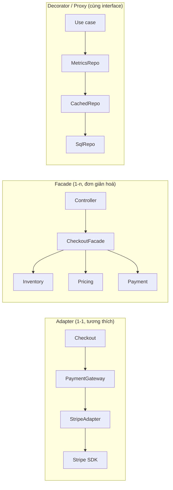
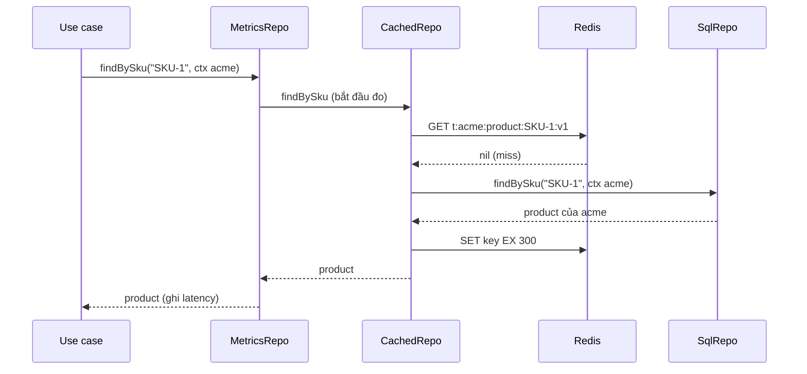

## Bối cảnh & vấn đề

Một app multi-tenant bán hàng B2B. Team thêm cache Redis cho `ProductRepository` theo đúng sách: viết `CachedProductRepo implements ProductRepo`, bọc repo SQL thật, cùng interface, không sửa dòng nào của caller. Review khen "Decorator chuẩn". Hai ngày sau, một khách của tenant Globex gọi điện: giá trên web là giá của Acme. Cache key là `product:${sku}`, thiếu `tenantId`. Cấu trúc pattern đúng 100%, nhưng decorator **làm mất một phần ngữ nghĩa** của lời gọi: kết quả phụ thuộc vào tenant, key thì không.

**Structural patterns** mô tả cách **ghép** object và class thành cấu trúc lớn hơn. Bốn pattern hay gặp nhất trong backend Node (Adapter, Facade, Decorator, Proxy) có hình dạng gần giống nhau: **một object bọc một object khác**. Khác biệt nằm ở **intent** (mục đích), và interviewer hỏi chính điều đó: "Adapter và Facade khác nhau thế nào?", "Decorator và Proxy?". Bài này đi qua intent, cách hiện thực idiomatic trong TypeScript, và các failure mode thật: tenant leak, `this` sai trong JS `Proxy`, decorator ngôn ngữ khác decorator pattern.

## Khái niệm

### Adapter: đổi interface để tương thích

**Adapter** chuyển **một** interface lạ (của SDK, service cũ, đối tác) thành interface mà client đang mong đợi. Quan hệ thường là 1-1: `StripeAdapter implements PaymentGateway` gọi `stripe.paymentIntents.create(...)` và trả về `ChargeResult` của domain mình. Intent là **tương thích**: client viết theo `PaymentGateway`, không biết Stripe tồn tại.

Adapter là nơi đặt **translation**: đơn vị tiền (Stripe dùng minor unit), mã trạng thái (`succeeded` → `paid`), lỗi (Stripe `card_declined` → `PaymentDeclined` của domain). Trong hexagonal ([bài 8](/tracks/design-patterns/learn/hexagonal-clean-architecture)), mọi driven adapter đều là Adapter theo nghĩa này.

```ts
interface PaymentGateway { charge(amount: Money, token: string): Promise<ChargeResult> }
type ChargeResult = { id: string; status: "paid" | "pending" | "declined" };

class StripeAdapter implements PaymentGateway {
  constructor(private stripe: StripeLike) {}
  async charge(amount: Money, token: string): Promise<ChargeResult> {
    try {
      const pi = await this.stripe.paymentIntents.create({ amount: Number(amount.minor), currency: amount.currency.toLowerCase(), payment_method: token, confirm: true });
      return { id: pi.id, status: pi.status === "succeeded" ? "paid" : "pending" };
    } catch (e: any) {
      if (e?.code === "card_declined") return { id: "", status: "declined" }; // lỗi SDK -> ngôn ngữ domain
      throw e;
    }
  }
}
```

**Anti-Corruption Layer** (ACL, thuật ngữ DDD) là phiên bản lớn hơn của ý tưởng này: một **tầng** gồm nhiều adapter + translator bảo vệ model của bounded context khỏi model của hệ thống khác. ACL không chỉ đổi tên method: nó dịch **khái niệm** (khái niệm "account" của CRM cũ thành `Customer` + `BillingProfile` của bạn), có thể gộp nhiều lời gọi, cache, và che các quirk của hệ thống kia.

### Facade: đơn giản hoá một subsystem

**Facade** cung cấp một interface **đơn giản hơn** cho cả một **subsystem** nhiều thành phần (quan hệ 1-n). `CheckoutFacade.placeOrder(cart, payment)` gọi inventory, pricing, payment, notification theo đúng thứ tự; caller (controller, CLI) chỉ biết một method. Intent là **đơn giản hoá và che giấu độ phức tạp**, không phải tương thích.

Facade không cấm truy cập trực tiếp vào subsystem; nó là lối đi tắt. Nguy cơ là Facade phình thành **god object** biết mọi thứ: khi thấy `CheckoutFacade` có 40 method, đó là nhiều use case bị gom sai chỗ. Trong hexagonal, application service / use case thường đóng vai Facade cho domain.

**Interview angle:** một câu: Adapter là về **tương thích** (đổi shape của một thứ), Facade là về **đơn giản hoá** (một cửa cho nhiều thứ). Follow-up về ACL: nó là tập adapter + translation ở mức bounded context.

### Decorator: thêm hành vi, giữ nguyên interface

**Decorator** (GoF) bọc một object và **cùng implement interface đó**, thêm hành vi trước/sau khi uỷ quyền cho object bên trong: logging, metrics, cache, retry, kiểm tra quyền. Vì cùng interface, decorator **ghép chồng** được: `new MetricsRepo(new CachedRepo(new SqlRepo(pool)))`, và bật/tắt từng lớp bằng config ở composition root. Đây là composition over inheritance ([bài 1](/tracks/design-patterns/learn/design-principles)) ở dạng thuần nhất.

Trong TS, decorator cho interface một method thường là **higher-order function** (`withRetry(fetcher)`); cho interface nhiều method thì là class forward từng method. Điều kiện để decorator đúng: nó phải **giữ contract** (LSP, [bài 2](/tracks/design-patterns/learn/solid-srp-ocp-lsp)). Cache decorator vi phạm khi trả dữ liệu cũ cho caller cần read-your-writes, hoặc khi key thiếu một input ảnh hưởng kết quả (tenant, locale, currency, quyền).

### Proxy: kiểm soát truy cập, cùng interface

**Proxy** có **cấu trúc giống hệt** Decorator (cùng interface, giữ reference tới subject), khác ở **intent**: Proxy **kiểm soát truy cập** tới subject, còn Decorator **bổ sung hành vi**. Các loại Proxy kinh điển:

- **Virtual proxy**: trì hoãn tạo object đắt tới lần dùng đầu (lazy client, lazy load relation trong ORM).
- **Protection proxy**: kiểm tra quyền trước khi chuyển lời gọi.
- **Caching proxy**: trả kết quả đã có (ranh giới với cache decorator rất mờ, gọi tên nào cũng được miễn nói rõ intent).
- **Remote proxy**: object local đại diện cho object ở xa: gRPC stub, client sinh từ OpenAPI.

JavaScript có object built-in **`Proxy`** với các **trap** (`get`, `set`, `apply`, `has`...) chặn thao tác trên object. Vue 3 reactivity, MobX, Immer dùng nó. Nó mạnh nhưng có giá: chậm hơn truy cập trực tiếp, khó debug (stack trace đi qua trap), và **`this` bên trong method** bị đổi thành proxy nếu không cẩn thận, làm vỡ class có **`#private` field**: private field chỉ truy cập được trên **chính object** đã được constructor khởi tạo, proxy không có "brand" đó (ví dụ chạy thật ở dưới).

**Interview angle:** "Decorator vs Proxy?" Cùng cấu trúc, khác intent; cho ba use case Proxy (lazy, permission, remote). Follow-up hay gặp: JS `Proxy` quanh class có `#private` thì sao?

### Composite, Bridge, Flyweight (ngắn gọn)

- **Composite**: coi một **cây** object và một object đơn lẻ như nhau qua cùng interface. `PriceRule` có thể là rule lá hoặc `AllOf([rule1, rule2])`; menu lồng nhau; AST. Gặp lại ở Specification pattern ([bài 12](/tracks/design-patterns/learn/extensible-design-refactoring)).
- **Bridge**: tách **abstraction** khỏi **implementation** để hai trục thay đổi độc lập: `Notification` (Alert, Reminder) × `Channel` (email, SMS) thay vì 6 subclass. Trong TS thường chỉ là composition: `new Alert(new SmsChannel())`.
- **Flyweight**: chia sẻ phần state **bất biến** giữa rất nhiều object để tiết kiệm memory (glyph trong text editor, sprite trong game). Hiếm trong backend; gần nhất là intern string hoặc cache object cấu hình dùng chung.

### GoF Decorator và TypeScript `@decorator`

Hai thứ cùng tên nhưng khác bản chất. **GoF Decorator** là **object wrapper lúc runtime**, áp dụng **per instance**, ghép tuỳ ý, bật/tắt theo config. **TypeScript `@decorator`** là **metaprogramming lúc định nghĩa class**: một function được gọi khi class được khai báo, nhận method/field/class và có thể thay thế nó. `@Cacheable` có thể hiện thực ý tưởng decorator pattern, nhưng nó áp lên **mọi instance** của class, không chọn được per instance, và khó tắt trong test.

TypeScript có **hai** hệ decorator (verify chi tiết theo phiên bản):

- **Legacy / experimental** (`experimentalDecorators: true`): hệ cũ từ TS 1.5, hỗ trợ **parameter decorator** (`constructor(@Inject(TOKEN) x)`) và đi kèm **`emitDecoratorMetadata`** (phát `design:paramtypes` để DI container biết type của tham số constructor). NestJS, TypeORM, class-validator, Angular cũ dựa vào hệ này.
- **ECMAScript decorators** (TC39 Stage 3), TS hỗ trợ từ **5.0** khi **không** bật `experimentalDecorators`. API khác (decorator nhận `(value, context)`), có `context.addInitializer`, `accessor` field, metadata qua `Symbol.metadata` (TS 5.2). Nhưng: **không có parameter decorator**, và `emitDecoratorMetadata` **không hoạt động** với hệ này (tsc từ chối cấu hình, xem output thật ở dưới).

Vì vậy NestJS chưa thể chuyển sang decorator chuẩn: DI của Nest đọc `design:paramtypes` (cần `emitDecoratorMetadata`) và dùng parameter decorator (`@Inject`, `@Body`, `@Param`). Cả hai đều không có trong hệ chuẩn hiện tại (verify trạng thái của Nest và proposal parameter decorators tại thời điểm đọc).

**Interview angle:** "GoF Decorator và `@decorator` có phải một?" Không: một bên là wrapper runtime per instance, một bên là metaprogramming lúc định nghĩa. Điểm cộng: biết TS 5.0 có decorator chuẩn và vì sao Nest vẫn cần `experimentalDecorators`.

## Cơ chế hoạt động

Bốn pattern cùng hình dạng "bọc", khác nhau ở **ai được bọc** và **vì sao**:



Adapter đứng giữa hai interface **khác nhau**. Facade đứng trước **nhiều** thành phần. Decorator/Proxy đứng trước **một** thành phần **cùng interface**, nên có thể xếp chồng nhiều lớp. Chuỗi decorator chạy như một pipeline: lời gọi đi vào lớp ngoài cùng, mỗi lớp làm phần việc rồi uỷ quyền vào trong, kết quả đi ngược ra:



Điểm then chốt của cache decorator: **key phải gồm mọi input ảnh hưởng tới kết quả** của lời gọi được bọc. `SqlRepo.findBySku(sku, ctx)` lọc theo `ctx.tenantId`; nếu key chỉ có `sku`, decorator đã đổi hàm "giá của SKU trong tenant X" thành "giá của SKU trong tenant nào gọi trước". Cùng lý do, nếu kết quả phụ thuộc locale, currency, hay quyền của user, những thứ đó phải nằm trong key (hoặc không được cache ở tầng này).

## Ví dụ thực tế

### Cache decorator làm lộ giá giữa tenant, và bản sửa

Chạy với tsx 4.23 / Node 24.21, dùng một fake Redis in-memory cùng API `get`/`set` để thấy rõ key:

```ts
class CachedProductRepoBuggy implements ProductRepo {
  constructor(private inner: ProductRepo, private cache: FakeRedis) {}
  async findBySku(sku: string, ctx: Ctx) {
    const key = `product:${sku}`;                                 // BUG: tenant missing
    const hit = await this.cache.get(key); if (hit) return JSON.parse(hit);
    const p = await this.inner.findBySku(sku, ctx);
    await this.cache.set(key, JSON.stringify(p), "EX", 300); return p;
  }
}
class CachedProductRepo implements ProductRepo {
  constructor(private inner: ProductRepo, private cache: FakeRedis, private ver = "v1") {}
  key(sku: string, ctx: Ctx) { return `t:${ctx.tenantId}:product:${sku}:${this.ver}`; }
  async findBySku(sku: string, ctx: Ctx) {
    const key = this.key(sku, ctx);
    const hit = await this.cache.get(key); if (hit) return JSON.parse(hit) as Product | null;
    const p = await this.inner.findBySku(sku, ctx);
    await this.cache.set(key, JSON.stringify(p), "EX", p ? 300 : 30);   // cache null briefly
    return p;
  }
  invalidateTenant(tenantId: string) { return this.cache.scanDel(`t:${tenantId}:`); }
}
```

```text
buggy acme  : { sku: 'SKU-1', price: 100000, tenantId: 'acme' }
buggy globex: { sku: 'SKU-1', price: 100000, tenantId: 'acme' }
fixed acme  : { sku: 'SKU-1', price: 100000, tenantId: 'acme' }
fixed globex: { sku: 'SKU-1', price: 85000, tenantId: 'globex' }
keys: [
  't:acme:product:SKU-1:v1',
  't:globex:product:SKU-1:v1',
  't:acme:product:SKU-404:v1'
]
invalidate acme -> 2 keys left: [ 't:globex:product:SKU-1:v1' ]
db hits: 4
```

Bản lỗi trả giá Acme cho Globex. Bản sửa: key bắt đầu bằng tenant (`t:<tenant>:`), có version (`v1`, đổi schema là đổi version thay vì flush), cache cả `null` với TTL ngắn (SKU không tồn tại chỉ đánh DB một lần trong 30 giây, chống penetration), và invalidate theo prefix tenant (giá Acme đổi chỉ xoá key Acme). Trên Redis thật, xoá theo prefix bằng `SCAN` + `DEL` là O(số key); với số key lớn, dùng **namespace version** (một key `t:acme:ver` được `INCR` và nhúng vào mọi key) để invalidate cả tenant trong O(1). Chi tiết ở track Caching ([key design multi-tenant](/tracks/caching/learn/keys-multi-tenant)). Bài học cho decorator: **mỗi decorator cache cần một test multi-tenant**: gọi cùng input với hai tenant và assert kết quả khác nhau.

### JS Proxy làm lazy client: vỡ với #private

Lazy proxy kiểu "khởi tạo client nặng khi dùng lần đầu", thử với một class có private field:

```ts
class S3Like {
  #region: string; #calls = 0;
  constructor(region: string) { console.log("  (S3Like constructed)"); this.#region = region; }
  send(cmd: string) { this.#calls++; return `${cmd} @ ${this.#region} (#${this.#calls})`; }
}
const lazy = <T extends object>(factory: () => T): T => {
  let inst: T | undefined;
  return new Proxy({} as T, { get: (_t, k) => Reflect.get((inst ??= factory()), k) });
};
const s3 = lazy(() => new S3Like("ap-southeast-1"));
s3.send("PutObject");   // this === proxy bên trong send

const lazyBound = <T extends object>(factory: () => T): T => {
  let inst: T | undefined;
  return new Proxy({} as T, { get: (_t, k) => { const i = (inst ??= factory()); const v = Reflect.get(i, k, i); return typeof v === "function" ? v.bind(i) : v; } });
};
```

```text
proxy created, nothing constructed yet
  (S3Like constructed)
   TypeError: Cannot read private member #calls from an object whose class did not declare it
  (S3Like constructed)
PutObject @ ap-southeast-1 (#1)
GetObject @ ap-southeast-1 (#2)
```

Lazy hoạt động (constructor chỉ chạy khi gọi lần đầu), nhưng `s3.send(...)` gọi method với `this` là **proxy**, và `this.#calls` ném `TypeError` vì proxy không phải object mà constructor `S3Like` đã khởi tạo. Bản sửa bind method vào instance thật (`v.bind(i)`). Cái giá của bind: mỗi lần `get` tạo function mới (`s3.send !== s3.send`), và `instanceof S3Like` trên proxy vẫn false. Với lazy init, một closure đơn giản (`const getS3 = once(() => new S3Client(...))`) thường rõ ràng hơn `Proxy`.

### TypeScript decorator chuẩn (TS 5.x, không experimentalDecorators)

```ts
function logged<This, Args extends unknown[], R>(target: (this: This, ...a: Args) => R, ctx: ClassMethodDecoratorContext<This, (this: This, ...a: Args) => R>) {
  const name = String(ctx.name);
  return function (this: This, ...args: Args): R {
    console.log(`-> ${name}(${JSON.stringify(args)})`);
    const r = target.call(this, ...args);
    console.log(`<- ${name} = ${JSON.stringify(r)}`);
    return r;
  };
}
class PriceService {
  @logged quote(sku: string, qty: number) { return qty * (sku === "A" ? 100 : 50); }
}
new PriceService().quote("A", 3);
```

```text
-> quote(["A",3])
<- quote = 300
--- emitDecoratorMetadata without experimentalDecorators:
tsconfig.json(1,3): error TS5052: Option 'emitDecoratorMetadata' cannot be specified without specifying option 'experimentalDecorators'.
```

Biên dịch bằng `tsc` 5.9.3, target ES2022, chạy trên Node 24. Decorator chuẩn nhận `(target, context)` và trả method thay thế. Dòng thứ hai là lý do kỹ thuật cụ thể khiến framework DI dựa trên metadata (Nest) vẫn phải dùng hệ legacy: tsc từ chối `emitDecoratorMetadata` khi không bật `experimentalDecorators`. So với GoF wrapper, `@logged` áp lên **mọi** `PriceService`; muốn tắt log trong test hay chỉ log cho một tenant thì wrapper object (`new LoggingPriceService(inner)`) linh hoạt hơn.

## Trade-offs & lựa chọn thay thế

| Pattern | Intent | Được | Mất | Khi KHÔNG dùng |
| --- | --- | --- | --- | --- |
| Adapter | Tương thích interface lạ | Core không biết SDK, đổi provider cục bộ | Thêm lớp mapping | SDK đã khớp interface của bạn và chỉ dùng ở một chỗ |
| ACL | Bảo vệ model khỏi hệ thống khác | Model sạch, cô lập quirk | Nhiều code dịch, phải bảo trì | Hệ thống kia dùng cùng ngôn ngữ domain |
| Facade | Một cửa cho subsystem | Caller đơn giản | Dễ thành god object | Chỉ có một hoặc hai lời gọi |
| Decorator (object) | Thêm hành vi, giữ interface | Ghép chồng, bật/tắt per instance, test riêng | Forward nhiều method, dễ quên ngữ nghĩa (key cache) | Hành vi chỉ cần ở một chỗ: viết thẳng vào |
| HOF decorator | Như trên cho interface một method | Rất gọn | Stack trace khó đọc khi chuỗi dài | Interface nhiều method |
| TS `@decorator` | Metaprogramming lúc định nghĩa | Khai báo gọn, framework đọc được | Áp mọi instance, khó tắt, hai hệ không tương thích | Hành vi cần bật/tắt theo config hoặc tenant |
| Proxy (pattern) | Kiểm soát truy cập | Lazy, phân quyền, remote trong suốt | Ẩn chi phí (một lời gọi "local" thật ra qua mạng) | Khi caller cần biết đó là lời gọi đắt |
| JS `Proxy` object | Chặn thao tác ngôn ngữ | Reactivity, API động | Chậm hơn, `this`/`#private`/`instanceof` bất ngờ | Code hot path, class có private field |

Chọn thế nào: gọi tên theo **intent** khi review ("đây là Adapter cho Stripe", "đây là cache decorator"), vì intent nói ra điều cần kiểm tra (Adapter: mapping lỗi và trạng thái đủ chưa; cache decorator: key có đủ input chưa). Ưu tiên wrapper object hoặc HOF hơn `@decorator` cho hành vi cắt ngang cần bật/tắt. Chỉ dùng JS `Proxy` khi thật sự cần chặn thao tác động; lazy init thì closure là đủ.

## Edge cases & failure modes

- **Decorator thiếu một input trong cache key**: tenant, locale, currency, role, feature flag. Triệu chứng là "đôi khi thấy dữ liệu người khác", chỉ khi hai tenant hỏi cùng key trong cửa sổ TTL.
- **Decorator nuốt lỗi**: retry decorator bắt mọi lỗi kể cả `ValidationError` (không nên retry) hoặc lỗi không idempotent (charge thẻ hai lần). Retry chỉ cho lỗi transient và thao tác idempotent.
- **Thứ tự decorator sai**: cache bọc ngoài authorization thì user không có quyền vẫn nhận kết quả đã cache của user có quyền. Protection proxy phải ở **ngoài** cache, hoặc quyền nằm trong key.
- **Adapter rò khái niệm của SDK**: trả nguyên `Stripe.PaymentIntent` ra ngoài "cho tiện". Lần đổi provider, mọi caller vỡ. Adapter trả type của domain.
- **JS Proxy với `#private`, `instanceof`, `JSON.stringify`**: method gọi với `this` = proxy ném `TypeError`; `instanceof` sai; một số thư viện kiểm tra `Object.getPrototypeOf` hay identity và hành xử khác.
- **Trộn hai hệ decorator**: thư viện viết cho legacy decorator dùng trong project không bật `experimentalDecorators` sẽ chạy theo semantic chuẩn với chữ ký khác, lỗi kiểu `Cannot read properties of undefined` lúc định nghĩa class.
- **Remote proxy che latency**: `user.orders` trông như truy cập field nhưng là một HTTP call; trong vòng lặp thành N+1 qua mạng.

## Pitfalls

- ❌ Cache key chỉ có id nghiệp vụ (`product:${sku}`) → ✅ key gồm tenant + mọi input ảnh hưởng kết quả + version; có test hai tenant.
- ❌ Adapter trả nguyên type của SDK → ✅ map sang type và lỗi của domain; SDK không lọt ra ngoài adapter.
- ❌ Gọi mọi wrapper là "Decorator" → ✅ gọi theo intent (Adapter/Facade/Decorator/Proxy) để reviewer biết cần kiểm tra gì.
- ❌ Facade 40 method → ✅ tách theo use case; Facade là lối tắt cho một nhóm thao tác liên quan.
- ❌ `@Cacheable` cho mọi thứ → ✅ wrapper object ở composition root khi cần bật/tắt theo config, tenant hay test.
- ❌ Dùng JS `Proxy` để lazy-load class có `#private` mà không bind → ✅ bind method vào instance thật, hoặc dùng closure `once()`.
- ❌ "TS decorator = GoF Decorator" → ✅ một bên là metaprogramming lúc định nghĩa, một bên là wrapper runtime per instance.

## Tóm tắt

- Adapter, Facade, Decorator, Proxy đều "bọc", khác **intent**: tương thích (1-1), đơn giản hoá (1-n), thêm hành vi (cùng interface), kiểm soát truy cập (cùng interface).
- ACL là tập adapter + translation ở mức bounded context; nó dịch khái niệm, không chỉ tên method.
- Decorator đúng phải giữ contract: cache key phải có mọi input ảnh hưởng kết quả (tenant, locale, quyền).
- Composite (cây như lá), Bridge (hai trục độc lập), Flyweight (chia sẻ state bất biến) ít gặp hơn nhưng nên nhận ra.
- TS có hai hệ decorator: legacy (`experimentalDecorators`, parameter decorator, `emitDecoratorMetadata`, NestJS dùng) và TC39 chuẩn từ TS 5.0 (không parameter decorator, không `emitDecoratorMetadata`).
- JS `Proxy` đổi `this` thành proxy: class có `#private` sẽ ném `TypeError` nếu không bind; lazy init thường chỉ cần closure.
