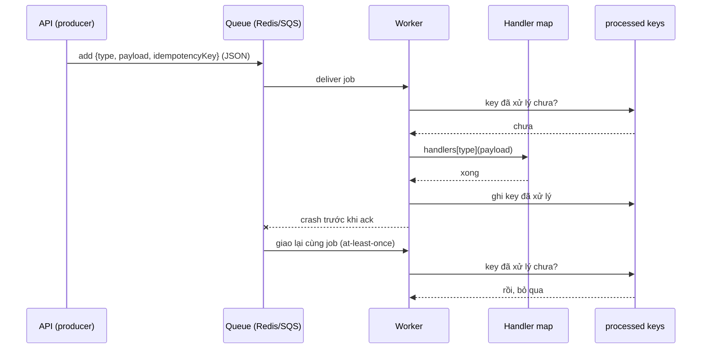
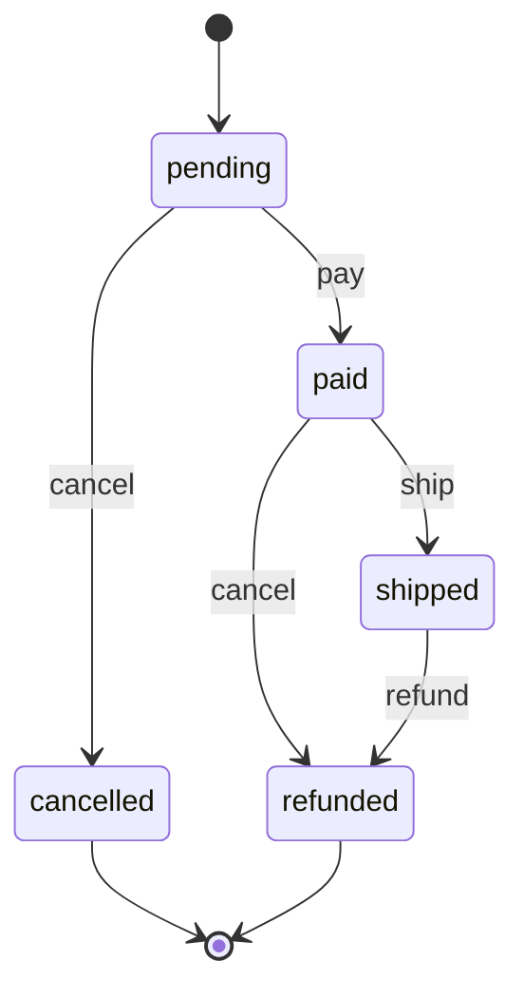

## Bối cảnh & vấn đề

Ba đoạn code từ cùng một codebase:

1. `calculateShipping(order)` có một `switch` 6 nhánh theo `order.shippingMethod`. Cùng `switch` đó được copy ở trang checkout (để hiển thị), ở job tính lại phí khi đổi địa chỉ, và ở báo cáo. Thêm phương thức "giao trong 2 giờ" phải sửa 4 chỗ.
2. Một worker gửi hoá đơn nhận job từ queue. Ai đó đẩy vào queue một **class instance** `new SendInvoice(orderId)` có method `execute()`. Worker nhận được `{ orderId: 'o-42' }`, không có `execute`, không có tên lệnh, và không biết phải làm gì.
3. `Order` có các method `pay()`, `ship()`, `cancel()`, mỗi method bắt đầu bằng 5 dòng `if (this.status === ...)`. Một bug cho phép huỷ đơn đã giao vì một nhánh bị quên.

Ba vấn đề, ba pattern hành vi: **Strategy** (hoán đổi thuật toán), **Command** (biến request thành object/dữ liệu), **State** (hành vi phụ thuộc trạng thái). Cùng với **Template Method** và **Iterator**, đây là các pattern hành vi hay gặp nhất trong backend. Điểm chung của bài: **trong TypeScript, nhiều pattern GoF co lại thành function hoặc dữ liệu**. Peter Norvig đã chỉ ra từ 1996 rằng 16/23 pattern GoF có cách hiện thực "đơn giản hơn về chất hoặc vô hình" trong Lisp/Dylan, những ngôn ngữ động có first-class function, và phần lớn lập luận đó áp dụng cho JS/TS. Biết pattern vẫn quan trọng (như từ vựng), nhưng hình dạng class-heavy của sách không bắt buộc.

## Khái niệm

### Strategy

**Strategy** đóng gói **một họ thuật toán hoán đổi được** sau cùng một interface; client (context) chọn thuật toán lúc runtime và gọi nó mà không biết chi tiết. Nó thay cho `if/switch` theo loại **rải ở nhiều nơi**: logic chọn nằm một chỗ (registry), logic từng thuật toán nằm ở implementation của nó.

Trong TS, Strategy idiomatic là **function type** hoặc **map `Record<Key, Fn>`**, không cần class + interface + context class. Key là discriminated union để compiler kiểm tra đủ case:

```ts
type ShippingFee = (o: { weightKg: number; subtotal: number }) => number;
const strategies: Record<"standard" | "express" | "free", ShippingFee> = {
  standard: (o) => 20_000 + o.weightKg * 5_000,
  express: (o) => 50_000 + o.weightKg * 8_000,
  free: () => 0,
};
const fee = strategies[order.shippingMethod](order);
```

Dùng class khi strategy có **state hoặc dependency** (một `TieredPricing` cần config và repository), hoặc khi interface có nhiều method liên quan. Khi KHÔNG dùng: chỉ có 2 nhánh, không có dấu hiệu tăng, và chỉ dùng ở một chỗ: `if` rõ ràng hơn.

**Strategy vs State**: cùng cấu trúc (context giữ một object và uỷ quyền), khác ai quyết định. Với Strategy, **client chọn** thuật toán từ ngoài và các strategy không biết nhau. Với State, **object tự đổi** state nội bộ khi sự kiện xảy ra, và các state biết state kế tiếp.

**Interview angle:** câu follow-up kinh điển "Strategy khác State thế nào?". Một câu: Strategy do caller chọn và độc lập; State do object tự chuyển theo transition.

### Template Method

**Template Method** định nghĩa **khung thuật toán cố định** trong base class (`run()` gọi `parse → validate → save`), và để subclass override **các bước**. Khung không đổi, bước thay đổi. Nó dựa trên **inheritance** và là một dạng IoC ([bài 3](/tracks/design-patterns/learn/isp-dip-dependency-injection)): base class gọi code của subclass.

Template Method hợp khi khung thật sự ổn định và nhiều bước dùng chung: importer cho nhiều định dạng file, base class test, lifecycle hook của framework (`ngOnInit`, `onModuleInit` là biến thể của ý tưởng này). Nhược điểm là các nhược điểm của inheritance ([bài 1](/tracks/design-patterns/learn/design-principles#sec-composition-over-inheritance)): subclass phụ thuộc thứ tự gọi của base (fragile base class), không ghép được hai biến thể (CSV + dry-run cần subclass thứ ba), hierarchy sâu dần.

**Template Method vs Strategy**: cả hai cho phép thay một phần thuật toán. Template Method thay **bằng kế thừa**, chọn **lúc compile** (subclass nào), và base class điều khiển luồng. Strategy thay **bằng composition**, chọn **lúc runtime**, ghép nhiều strategy độc lập. Trong TS hiện đại, Template Method thường được viết lại thành **function nhận các bước làm tham số**: khung vẫn là một hàm, bước là object `{ parse, validate, save }`, và ghép biến thể là truyền bước khác.

### Command

**Command** biến **một request thành một object**: tên lệnh + dữ liệu cần thiết (+ đôi khi `execute()`/`undo()`). Khi request là object, bạn có thể làm những việc không làm được với một lời gọi hàm: **xếp hàng** (queue), **ghi log**, **retry**, **gửi qua mạng**, **trì hoãn**, **undo**.

Ba nơi Command xuất hiện trong backend:

- **Job queue** (BullMQ, SQS): job `{ name: 'invoice.send', data: { orderId } }` là command; worker là handler. Vì job đi qua Redis/mạng, command phải là **dữ liệu serializable** (JSON), không phải class instance hay closure: method và closure **không sống qua `JSON.stringify`**. Command nên mang **idempotency key**, vì queue giao **at-least-once**: cùng job có thể chạy hai lần sau một lần worker crash.
- **Undo/redo** (editor, form builder): stack các command có `undo()`, hoặc lưu **inverse** (lệnh ngược). Redux action là command dạng dữ liệu; reducer là handler.
- **CQRS**: "command" là **ý định** thay đổi state (`PlaceOrder`), được validate trước khi chấp nhận ([bài 11](/tracks/design-patterns/learn/cqrs-event-sourcing)). Khác với event (`OrderPlaced`), đã xảy ra và không thể từ chối.

Khi KHÔNG dùng Command: gọi hàm trực tiếp là đủ và không cần queue, log, retry hay undo. Một `CommandBus` in-process chỉ để "decouple" controller khỏi service thường chỉ thêm indirection.

### State

**State** cho phép object **đổi hành vi khi state nội bộ đổi**, như thể nó đổi class. Dạng GoF: mỗi state là một class (`PendingState`, `PaidState`) implement cùng interface (`pay()`, `ship()`, `cancel()`), và context uỷ quyền cho state hiện tại. Dạng hay dùng hơn trong TS: **bảng transition** dạng dữ liệu `Record<Status, Partial<Record<Event, Status>>>` cộng một hàm `next(s, e)` ném lỗi khi transition không hợp lệ.

Bảng transition có ba ưu điểm: toàn bộ luật nằm ở **một chỗ** đọc được (và vẽ được thành diagram), transition không hợp lệ bị chặn **mặc định** (thứ không có trong bảng là cấm, thay vì thứ quên `if` là cho phép), và test được bằng cách liệt kê. Dùng class-per-state khi mỗi state có **hành vi khác nhau đáng kể** (không chỉ "có được chuyển hay không"), ví dụ kết nối mạng: `Connecting` buffer message, `Open` gửi ngay, `Closed` ném lỗi. Thư viện như XState hợp khi state machine có state lồng nhau, timer, guard phức tạp.

### Iterator

**Iterator** cho phép duyệt một tập phần tử mà không lộ cấu trúc bên trong. JS đã có sẵn ở mức ngôn ngữ: **iterator protocol**, `for...of`, và **generator** (`function*`). Với dữ liệu phân trang từ API hay DB, **async generator** (`async function*` + `for await`) là Iterator lazy: chỉ fetch trang tiếp theo khi consumer cần, dừng sớm (`break`) thì không fetch nữa. Đây là một ví dụ pattern "biến mất vào ngôn ngữ".

### GoF nào co lại thành function trong TypeScript

| Pattern | Dạng TS idiomatic | Khi nào vẫn đáng dùng class |
| --- | --- | --- |
| Strategy | Function param, `Record<Key, Fn>` | Strategy có state/dependency, nhiều method |
| Command | Plain object `{ type, payload }` + handler map, hoặc closure | Undo/redo phức tạp với state riêng mỗi lệnh |
| Template Method | Higher-order function nhận các bước | Framework lifecycle, base test class |
| Observer | Callback, `EventEmitter`, `AbortSignal` | Subject có lifecycle, nhiều loại event có type |
| Factory | Function trả object | Abstract Factory cho họ object |
| Decorator | HOF `withX(fn)` | Interface nhiều method (repository) |
| Iterator | Generator / async generator | Hiếm khi cần |
| State | Bảng transition + hàm `next` | Mỗi state có hành vi khác nhau nhiều |

Thứ vẫn đáng ở dạng class/object: thứ có **state + nhiều method liên quan** (Repository, Gateway adapter), có **lifecycle** (connect/close), cần **DI container** quản lý, hoặc State pattern với hành vi khác nhau. Tiêu chí chọn là readability và testability, không phải sách.

**Interview angle:** câu senior "pattern nào co lại thành function?" đo xem bạn hiểu **vấn đề** pattern giải hay chỉ thuộc **hình dạng** UML. Follow-up: "khi nào chuỗi HOF khó debug hơn class decorator?": khi chuỗi dài, lỗi ở giữa cho stack trace toàn anonymous function, và không có chỗ đặt breakpoint/tên rõ ràng.

## Cơ chế hoạt động

Command trong job queue đi qua ranh giới process, nên vòng đời của nó quyết định thiết kế: serializable, có tên để route, có idempotency key vì có thể chạy lại:



Lần giao thứ hai xảy ra vì worker crash trước khi ack: queue không biết job đã chạy xong. Idempotency key biến "chạy lại" thành no-op. Lưu ý thứ tự: nếu ghi key **trước** khi chạy handler, crash ở giữa làm job bị coi là xong mà chưa làm (mất việc); ghi **sau** thì có cửa sổ chạy hai lần, nên handler phải tự idempotent ở tầng side effect (unique constraint, provider idempotency key) cho thao tác quan trọng như charge tiền.

State machine của đơn hàng, đúng bảng transition dùng trong ví dụ:



Diagram và bảng là **cùng một thông tin**; đó là lợi ích lớn nhất của dạng bảng: product owner đọc diagram, code đọc bảng, test liệt kê các cặp (state, event) không có mũi tên để chắc chúng bị từ chối. `shipped --cancel-->` không có mũi tên, nên là transition bất hợp lệ.

## Ví dụ thực tế

### Command qua JSON: chỉ dữ liệu sống sót

Chạy với tsx 4.23 / Node 24.21:

```ts
class SendInvoice { constructor(public orderId: string) {} execute() { return `send invoice ${this.orderId}`; } }
const asClass = new SendInvoice("o-42");
const asClosure = { type: "invoice.send", run: () => "send invoice o-42" };
const asData = { type: "invoice.send", payload: { orderId: "o-42" }, idempotencyKey: "invoice:o-42" };
for (const [name, cmd] of Object.entries({ asClass, asClosure, asData })) {
  const wire = JSON.parse(JSON.stringify(cmd));
  console.log(name.padEnd(9), "->", JSON.stringify(wire), "| execute/run survives?", typeof wire.execute === "function" || typeof wire.run === "function");
}

type Command<T = unknown> = { type: string; payload: T; idempotencyKey: string };
const handlers: Record<string, (c: Command<any>) => Promise<void>> = {
  "invoice.send": async (c) => { sent.push(c.payload.orderId); },
};
async function dispatch(c: Command) {
  if (processed.has(c.idempotencyKey)) return "skipped (duplicate)";
  const h = handlers[c.type]; if (!h) throw new Error(`no handler for ${c.type}`);
  await h(c); processed.add(c.idempotencyKey); return "done";
}
console.log(await dispatch(msg), "|", await dispatch(msg), "| invoices sent:", sent);
```

```text
asClass   -> {"orderId":"o-42"} | execute/run survives? false
asClosure -> {"type":"invoice.send"} | execute/run survives? false
asData    -> {"type":"invoice.send","payload":{"orderId":"o-42"},"idempotencyKey":"invoice:o-42"} | execute/run survives? false
done | skipped (duplicate) | invoices sent: [ 'o-42' ]
```

Class instance qua JSON chỉ còn `{"orderId":"o-42"}`: mất cả method lẫn **tên lệnh**, worker không biết route đi đâu. Closure mất hoàn toàn hành vi. Chỉ dạng dữ liệu `{ type, payload, idempotencyKey }` mang đủ thông tin; hành vi nằm ở **handler map phía worker**, đăng ký theo `type`. Lần dispatch thứ hai bị bỏ qua nhờ idempotency key. Trong production, `processed` phải là store bền và atomic (unique constraint trong DB, hoặc `SET key NX` trên Redis): một `Set` in-memory với "check rồi add" có race khi hai worker nhận trùng job cùng lúc.

### Undo/redo bằng stack command

```ts
interface EditCommand { do(doc: string[]): void; undo(doc: string[]): void; label: string }
const insert = (i: number, text: string): EditCommand => ({ label: `insert@${i}`, do: (d) => d.splice(i, 0, text), undo: (d) => d.splice(i, 1) });
const run = (c: EditCommand) => { c.do(doc); undo.push(c); redo.length = 0; };
run(insert(0, "Hello")); run(insert(1, "world")); run(insert(1, "dear"));
// undo 2 lần, rồi redo 1 lần
```

```text
doc: Hello dear world
after 2x undo: Hello
after redo: Hello world
```

Mỗi command biết cách tự đảo ngược. Chạy lệnh mới thì xoá redo stack (nhánh lịch sử cũ không còn hợp lệ). Đây là command **in-process** nên closure là ổn; nếu cần lưu lịch sử vào DB hay đồng bộ nhiều client, command lại phải là dữ liệu.

### State machine dạng bảng và Strategy dạng map

```ts
type Status = "pending" | "paid" | "shipped" | "cancelled" | "refunded";
type Event = "pay" | "ship" | "cancel" | "refund";
const transitions: Record<Status, Partial<Record<Event, Status>>> = {
  pending: { pay: "paid", cancel: "cancelled" },
  paid: { ship: "shipped", cancel: "refunded" },
  shipped: { refund: "refunded" },
  cancelled: {}, refunded: {},
};
function next(s: Status, e: Event): Status {
  const to = transitions[s][e];
  if (!to) throw new Error(`ILLEGAL_TRANSITION ${s} --${e}-->`);
  return to;
}
```

```text
pay    -> paid
ship   -> shipped
cancel -> ILLEGAL_TRANSITION shipped --cancel-->
{ standard: 30000, express: 66000, free: 0 }
```

Huỷ đơn đã giao bị chặn vì cặp `(shipped, cancel)` không có trong bảng: mặc định là cấm. Thêm state mới (`Status` có thêm `"returned"`) thì `Record<Status, ...>` bắt buộc khai báo dòng mới, compiler báo nếu quên. Dòng cuối là ba strategy phí ship tính cho cùng đơn 2 kg.

### Template Method và bản higher-order function

```ts
abstract class Importer<Row> {
  async run(file: string) {
    const rows = this.parse(file);
    const valid = rows.filter((r) => this.validate(r));
    await this.save(valid);
    return { total: rows.length, saved: valid.length };
  }
  protected abstract parse(f: string): Row[];
  protected abstract validate(r: Row): boolean;
  protected abstract save(rows: Row[]): Promise<void>;
}
class CsvProductImporter extends Importer<ProductRow> { /* parse, validate, save */ }

// Cùng khung, các bước là tham số
type Steps<Row> = { parse(f: string): Row[]; validate(r: Row): boolean; save(rows: Row[]): Promise<void> };
const makeImporter = <Row>(s: Steps<Row>) => async (file: string) => {
  const rows = s.parse(file); const valid = rows.filter(s.validate); await s.save(valid);
  return { total: rows.length, saved: valid.length };
};
const importCsv = makeImporter<ProductRow>({ parse: parseCsv, validate: (r) => r.price > 0, save: saveToDb });
const dryRun = makeImporter<ProductRow>({ parse: parseCsv, validate: (r) => r.price > 0, save: async (rows) => console.log("  dry-run would save", rows.length) });
```

```text
  saved [ 'A', 'C' ]
template: { total: 3, saved: 2 }
  saved [ 'A', 'C' ]
hof: { total: 3, saved: 2 }
  dry-run would save 2
hof dry: { total: 3, saved: 2 }
```

Kết quả giống nhau. Bản HOF **được**: ghép biến thể bằng cách thay một bước (dry-run chỉ đổi `save`, không cần subclass `DryRunCsvImporter`), test từng bước như function thuần, không có `protected`/`abstract`. Bản HOF **mất**: không có chỗ tự nhiên cho state dùng chung giữa các bước (phải dùng closure), và tên class giúp tìm kiếm/IDE navigation. Gotcha của bản HOF: `rows.filter(s.validate)` truyền method rời khỏi object, nên nếu `validate` dùng `this` thì `this` sẽ là `undefined`; viết steps bằng arrow function hoặc gọi `s.validate(r)`.

### Iterator: phân trang lazy bằng async generator

```ts
async function* pages(fetchPage: (cursor?: string) => Promise<{ items: string[]; next?: string }>) {
  let cursor: string | undefined;
  do { const p = await fetchPage(cursor); yield* p.items; cursor = p.next; } while (cursor);
}
for await (const u of pages(fetchPage)) { if (u === "u3") { console.log("found u3 after", calls, "page calls"); break; } }
```

```text
found u3 after 2 page calls
```

Năm user, trang 2 phần tử: tìm thấy `u3` sau 2 lần gọi, trang thứ 3 không bao giờ được fetch vì `break` kết thúc generator (gọi `return()` trên iterator). Consumer không biết gì về cursor.

## Trade-offs & lựa chọn thay thế

| Lựa chọn | Được | Mất | Khi KHÔNG dùng |
| --- | --- | --- | --- |
| `if/switch` tại chỗ | Đọc tuần tự, không indirection | Lặp lại khi cùng quyết định ở nhiều nơi | Khi cùng `switch` đã copy ở ≥ 2 chỗ |
| Strategy (map function) | Thêm biến thể = thêm entry, test riêng | Indirection, phải tìm registry | 2 nhánh, một chỗ dùng |
| Template Method | Khung cố định, bước dùng chung | Inheritance, khó ghép, fragile base | Cần ghép biến thể, bước ít |
| HOF nhận steps | Ghép tự do, test thuần | Mất chỗ cho state chung, `this` bị tách | Khung có nhiều state nội bộ |
| Command dạng dữ liệu | Queue, retry, log, replay, cross-process | Handler map phải đồng bộ version với producer | Gọi hàm trực tiếp là đủ |
| Command có `undo()` | Undo/redo đơn giản | Mỗi lệnh phải viết inverse đúng | Không có yêu cầu undo |
| State (bảng transition) | Luật một chỗ, mặc định cấm, vẽ được | Hành vi khác nhau theo state phải để ngoài | State có hành vi rất khác nhau |
| State (class-per-state) | Hành vi đóng gói theo state | Nhiều class, transition rải rác | Chỉ cần kiểm tra "được chuyển không" |

Chọn thế nào: khi cùng một quyết định "theo loại" xuất hiện ở **nhiều chỗ**, gom thành Strategy map với key là union type. Khi có khung cố định, bắt đầu bằng HOF nhận steps; chỉ dùng Template Method khi framework yêu cầu hoặc khung có nhiều state nội bộ. Bất cứ thứ gì đi qua queue/mạng là **command dạng dữ liệu** có `type` và idempotency key. Trạng thái nghiệp vụ có luật chuyển là **bảng transition**, kể cả khi nó chỉ có 4 state.

## Edge cases & failure modes

- **Command version lệch**: producer đã deploy `invoice.send` v2 (payload thêm `locale`), worker còn chạy v1. Job mới bị xử lý thiếu trường, hoặc ngược lại worker mới nhận job cũ thiếu trường. Version trong command (`v: 2`) và handler chấp nhận cả hai trong giai đoạn chuyển.
- **Không có handler cho type**: job với type gõ sai hoặc đã xoá handler. Nếu worker throw và queue retry vô hạn, job độc chiếm worker. Đưa vào dead-letter queue sau N lần.
- **Idempotency check-then-act race**: hai worker cùng `has(key) === false` rồi cùng chạy. Dùng thao tác atomic (`INSERT ... ON CONFLICT DO NOTHING` rồi kiểm tra số dòng, `SET NX`).
- **Undo không đúng inverse**: undo của "xoá dòng 3" phải chèn lại đúng nội dung và vị trí; nếu document đổi giữa chừng bởi người khác (cộng tác real-time), inverse đơn giản sai. Cần OT/CRDT, ngoài phạm vi Command.
- **State bị sửa trực tiếp**: bảng transition hoàn hảo nhưng một script admin `UPDATE orders SET status='pending'` bỏ qua nó. Chặn ở DB (check constraint, trigger) cho transition quan trọng, hoặc chỉ cho đổi state qua một đường.
- **Strategy registry key là `string`**: `strategies[req.body.method]` với giá trị lạ trả `undefined`, gọi nó ném `TypeError: strategies[...] is not a function`. Validate input thành union type ở biên (zod) trước khi tra.
- **Generator không được đóng**: consumer quên `break`/`return` khi lỗi, giữ connection/cursor DB mở. `for await` tự gọi `return()` khi `break` hoặc throw; code gọi `next()` thủ công phải tự đóng.

## Pitfalls

- ❌ Cùng `switch (method)` copy ở 4 chỗ → ✅ một Strategy map `Record<Method, Fn>` dùng chung; key là union để compiler bắt thiếu case.
- ❌ Interface + class + context class cho Strategy chỉ có một method → ✅ function type là đủ trong TS.
- ❌ Đẩy class instance hoặc closure vào queue → ✅ command là dữ liệu JSON `{ type, payload, idempotencyKey, v }`, hành vi ở handler map.
- ❌ Idempotency bằng `Set` in-memory hoặc check rồi ghi không atomic → ✅ unique constraint hoặc `SET NX` trong store bền.
- ❌ Trạng thái nghiệp vụ kiểm tra bằng `if` rải trong từng method → ✅ bảng transition một chỗ, mặc định cấm, có test liệt kê.
- ❌ Template Method cho mọi khung → ✅ HOF nhận steps; Template Method khi framework yêu cầu.
- ❌ `CommandBus` in-process cho mọi lời gọi controller → service → ✅ gọi trực tiếp; Command khi cần queue, retry, log hoặc undo.

## Tóm tắt

- Strategy: hoán đổi thuật toán sau cùng interface; trong TS là function hoặc `Record<Union, Fn>`. Khác State ở chỗ client chọn, không phải object tự chuyển.
- Template Method: khung cố định, bước override qua kế thừa; thường viết lại thành HOF nhận steps để ghép biến thể.
- Command: request thành object/dữ liệu để queue, retry, log, undo. Qua queue phải là JSON có `type` + idempotency key vì delivery là at-least-once.
- State: bảng transition `Record<Status, Partial<Record<Event, Status>>>` là dạng mặc định; class-per-state khi hành vi khác nhau nhiều.
- Iterator đã có trong ngôn ngữ: generator và async generator cho phân trang lazy.
- Phần lớn GoF behavioral co lại thành function trong TS; class vẫn đáng dùng khi có state + nhiều method + lifecycle.
