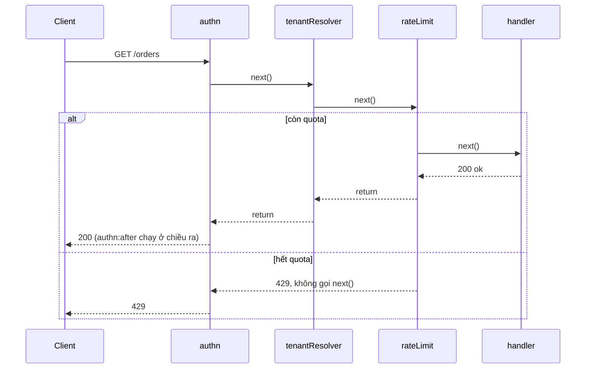
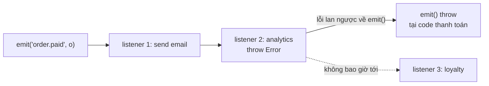

## Bối cảnh & vấn đề

Một dashboard giá chứng khoán dùng Server-Sent Events (SSE). Mỗi trình duyệt mở `/prices/stream`, server đăng ký một listener lên `priceEvents` (một `EventEmitter`) và ghi mỗi cập nhật giá xuống response. Sau vài giờ, log có dòng `MaxListenersExceededWarning: Possible EventEmitter memory leak detected`, memory tăng đều, và CPU tăng theo số người **đã từng** mở dashboard chứ không phải số người **đang** mở. Lý do: listener được thêm khi client kết nối nhưng không bao giờ bị gỡ khi client đóng tab.

Cùng tuần, một dev thêm listener `order.paid` gửi analytics. Analytics provider lỗi, listener throw, và email xác nhận đơn hàng (listener đăng ký **sau** nó) ngừng gửi. Không ai nghĩ một tính năng "phụ" có thể chặn tính năng chính, vì "event là loose coupling mà".

Bài này nói về hai pattern hành vi gắn chặt với Node: **Observer** (Node có sẵn `EventEmitter`, DOM có `addEventListener`) và **Chain of Responsibility** (Express/Koa/Nest middleware). Cả hai trông đơn giản, và chính vì vậy failure mode của chúng thường bị bỏ qua: listener leak, lỗi lan qua emit, thứ tự middleware, quên `next()`, lỗi async không được forward. Cuối bài là **Mediator**, pattern hay bị nhầm với Observer.

## Khái niệm

### Observer

**Observer** (GoF): một **subject** giữ danh sách **observer** (listener, subscriber) và thông báo cho tất cả khi state của nó đổi. Subject không biết observer làm gì, observer không biết nhau. Đó là loose coupling: thêm một phản ứng mới với "đơn đã thanh toán" là đăng ký thêm một listener, không sửa code thanh toán.

Observer có sẵn khắp nơi trong JavaScript: Node `EventEmitter` (stream, HTTP server, socket đều là emitter), DOM `addEventListener`, `AbortSignal`, RxJS `Observable`, Redux `store.subscribe`, React `useSyncExternalStore` (subscribe vào external store). Hiểu một cái là hiểu cả họ, và **mọi `subscribe` đều cần `unsubscribe`** gắn với lifecycle của bên đăng ký.

### Observer khác pub/sub qua broker

Observer là **in-process và (với `EventEmitter`) đồng bộ**: listener chạy trong cùng process, cùng call stack với `emit()`. Nếu process chết giữa chừng, event mất; nếu có 5 pod, listener ở pod A không thấy event emit ở pod B. **Pub/sub qua broker** (Kafka, RabbitMQ, Redis Pub/Sub, SNS) là **cross-process và bất đồng bộ**: message đi qua mạng, có thể bền (Kafka lưu log), có thể retry, có consumer group. Hai thứ cùng ý tưởng (publisher không biết subscriber) nhưng khác hoàn toàn về **độ tin cậy, thứ tự, và phạm vi**.

Hệ quả thiết kế: đừng dùng `EventEmitter` in-process cho thứ **không được mất** (gửi email xác nhận, cập nhật tồn kho) mà không có cơ chế bền phía sau. Domain event cần đi ra ngoài process phải qua outbox ([bài 10](/tracks/design-patterns/learn/repository-uow-outbox)).

### EventEmitter: đồng bộ, theo thứ tự, lỗi lan ra emit

Docs Node ghi rõ: `emit()` gọi các listener **đồng bộ**, **theo thứ tự đăng ký**. Ba hệ quả thực tế:

1. **Một listener throw thì `emit()` throw**, và các listener **sau** nó **không chạy**. Lỗi đi ngược về chỗ gọi `emit()` (code thanh toán của bạn).
2. **Listener chậm chặn emitter**: một listener làm việc CPU 200 ms thì `emit()` mất 200 ms, và nếu emit trong request handler thì request đó chậm theo.
3. **Listener `async` không được await**: `emit()` không đợi promise. Promise reject thành **unhandled rejection** (từ Node 15, mặc định làm **crash process**), trừ khi tạo emitter với `{ captureRejections: true }`, khi đó rejection được chuyển sang event `'error'`.

Thêm một quy ước đặc biệt: emit `'error'` khi **không có** listener `'error'` nào thì Node **throw** lỗi đó. Một stream/socket không có handler `'error'` có thể làm sập process.

**Interview angle:** follow-up kinh điển: "nếu một listener throw trong `emitter.emit()`, các listener khác thế nào?" Đáp: listener sau không chạy và emit throw, vì emit là đồng bộ, theo thứ tự. Cách cô lập: try/catch trong từng listener, hoặc chuyển phản ứng không quan trọng sang queue.

### Memory leak qua listener và MaxListenersExceededWarning

Listener giữ **reference** tới mọi thứ nó closure: trong ví dụ SSE, handler giữ `res`, `res` giữ socket, request, buffer. Không gỡ listener thì không gì trong đó được garbage-collect, kể cả khi client đã đóng kết nối. Mỗi lần emit còn ghi vào socket đã đóng, tốn CPU vô ích.

Node có một **cảnh báo** (không phải giới hạn) để bắt loại lỗi này: khi một event có **hơn 10 listener** (`events.defaultMaxListeners = 10`), Node in `MaxListenersExceededWarning` một lần. Listener thứ 11 **vẫn được thêm**. Cảnh báo là tín hiệu "có thể bạn đang thêm listener trong một vòng lặp hoặc theo request mà không gỡ". Phản xạ sai là `setMaxListeners(0)` để tắt nó; phản xạ đúng là tìm chỗ thiếu `off()`. Chỉ tăng giới hạn khi số listener **có giới hạn và có chủ đích** (ví dụ 50 module cùng nghe `shutdown`).

### Chain of Responsibility

**Chain of Responsibility** (GoF): request đi qua một **chuỗi handler**; mỗi handler hoặc **xử lý và dừng**, hoặc **chuyển tiếp** cho handler kế tiếp. Người gửi không biết handler nào sẽ xử lý. Ví dụ sống trong Node:

- **Express/Koa middleware**: `(req, res, next)`; gọi `next()` để chuyển tiếp, gửi response để dừng, `next(err)` để nhảy tới error handler.
- **NestJS request lifecycle**: middleware → guards → interceptors (trước) → pipes → handler → interceptors (sau) → exception filters. Mỗi tầng là một mắt xích với vai trò riêng (verify thứ tự chi tiết trong docs Nest).
- **Axios interceptors**, **fetch wrapper** chains, chuỗi validator.

Koa-style middleware (`await next()`) còn cho phép chạy code **sau** khi phần còn lại của chuỗi xong (đo thời gian, bắt lỗi, thêm header): đó là "onion model".

Chain of Responsibility tốt cho **cross-cutting concern**: auth, tenant resolution, rate limit, logging, CORS, body parsing. Nó tệ khi **logic nghiệp vụ** bị rải trong 12 middleware: muốn biết "vì sao đơn này bị từ chối" phải đọc chuỗi theo đúng thứ tự đăng ký, có khi nằm ở nhiều file.

### Failure mode của middleware

- **Thứ tự sai**: rate limit đặt **sau** một auth tốn kém (gọi IdP, query DB) thì kẻ tấn công vẫn làm bạn tốn tài nguyên trước khi bị chặn. Body parser đặt sau handler thì `req.body` là `undefined`. CORS đặt sau auth thì preflight `OPTIONS` bị 401.
- **Quên gọi `next()`** (và cũng không gửi response): request **treo** tới khi client hoặc load balancer timeout.
- **Gọi `next()` hai lần**: handler phía sau chạy hai lần; trong Express hay dẫn tới `ERR_HTTP_HEADERS_SENT` ("Cannot set headers after they are sent"). Koa-compose ném "next() called multiple times".
- **Lỗi trong async middleware không được forward (Express 4)**: Express 4 không biết middleware trả promise; nếu nó reject, Express không thấy lỗi, không gọi error handler, request **treo**, và process nhận unhandled rejection (mặc định crash từ Node 15). Phải bọc `try/catch` + `next(err)` hoặc dùng wrapper. **Express 5** tự bắt rejected promise từ middleware/handler và chuyển vào `next(err)` (docs migrating-5, ví dụ chạy thật ở dưới).

### Mediator

**Mediator** (GoF) tập trung việc **điều phối** giữa nhiều object vào một object trung gian, để các object không gọi nhau trực tiếp (n đối tượng nói chuyện qua 1 mediator thay vì n×(n−1) đường). Khác Observer: Observer **phát** sự kiện cho ai muốn nghe và không biết ai nghe; Mediator **biết** các thành phần và **quyết định** ai làm gì tiếp theo. Ví dụ backend: một **orchestrator** của saga điều phối Payment, Inventory, Shipping; một form wizard điều phối các field phụ thuộc nhau. Rủi ro: mediator thành god object chứa toàn bộ logic. Các thư viện "mediator" kiểu MediatR (C#) thực chất là command/query bus in-process ([bài 6](/tracks/design-patterns/learn/behavioral-strategy-command-state)).

## Cơ chế hoạt động

Request đi qua chuỗi middleware theo onion model: code trước `await next()` chạy theo chiều vào, code sau chạy theo chiều ra; một mắt xích có thể dừng chuỗi bằng cách trả response mà không gọi `next()`:



Trong nhánh hết quota, handler không bao giờ chạy, nhưng phần "after" của `authn` vẫn chạy khi chuỗi tháo ra. Thứ tự đăng ký **chính là** thứ tự trong diagram; vì vậy đặt mắt xích rẻ và có khả năng từ chối sớm (rate limit theo IP, CORS preflight) càng gần đầu chuỗi càng tốt.

Với `EventEmitter`, `emit()` là một vòng lặp đồng bộ qua mảng listener; không có cô lập lỗi nào:



Thứ tự đăng ký quyết định listener nào bị "chặn". Nếu listener email đăng ký sau analytics, email cũng không gửi. Vì emit đồng bộ, lỗi còn đi ngược vào code thanh toán và có thể làm rollback một transaction đã đúng.

## Ví dụ thực tế

### EventEmitter: thứ tự, đồng bộ, và lỗi

Chạy với tsx 4.23 / Node 24.21:

```ts
const e = new EventEmitter();
e.on("order.paid", (o) => console.log("  1 send email", o.id));
e.on("order.paid", () => { throw new Error("analytics down"); });
e.on("order.paid", (o) => console.log("  3 update loyalty", o.id));
try { e.emit("order.paid", { id: "o1" }); console.log("  after emit"); }
catch (err) { console.log("  emit threw:", (err as Error).message, "-> listener 3 never ran"); }

const e2 = new EventEmitter();
e2.on("x", () => console.log("  listener runs"));
console.log("  before emit"); e2.emit("x"); console.log("  after emit");

const e3 = new EventEmitter({ captureRejections: true });
e3.on("order.paid", async () => { throw new Error("async boom"); });
e3.on("error", (err) => console.log("  routed to 'error' listener:", err.message));
e3.emit("order.paid", {});

try { new EventEmitter().emit("error", new Error("nobody listens")); } catch (err) { console.log("  thrown:", (err as Error).message); }
```

```text
sync emit order of execution:
  1 send email o1
  emit threw: analytics down -> listener 3 never ran
emit is synchronous:
  before emit
  listener runs
  after emit
async listener rejection:
  routed to 'error' listener: async boom
'error' with no listener:
  thrown: nobody listens
```

Bốn hành vi, bốn hệ quả thiết kế: listener phải tự bắt lỗi của nó (hoặc emitter phải bọc từng listener); emit trong hot path chạy toàn bộ listener trước khi trả về; listener async cần `captureRejections` hoặc tự `catch`; mọi emitter (stream, socket) cần handler `'error'`.

### Leak SSE: trước và sau

Server Express 5.2.1 thật, 12 client kết nối `/prices/stream` rồi ngắt:

```ts
app.get("/prices/stream", (req, res) => {
  res.setHeader("Content-Type", "text/event-stream");
  res.flushHeaders();
  const handler = (p: unknown) => res.write(`data: ${JSON.stringify(p)}\n\n`);
  priceEvents.on("price", handler);
  if (mode === "fixed") req.on("close", () => priceEvents.off("price", handler));
});
```

```text
(node:35988) MaxListenersExceededWarning: Possible EventEmitter memory leak detected. 11 price listeners added to [EventEmitter]. MaxListeners is 10. Use emitter.setMaxListeners() to increase limit
(Use `node --trace-warnings ...` to show where the warning was created)
[leak] listeners after 12 clients disconnected: 12
[fixed] listeners after 12 clients disconnected: 0
```

Bản leak: cảnh báo ở listener thứ 11, và sau khi **cả 12** client đã ngắt vẫn còn 12 listener (mỗi cái giữ một `res` đã chết). Bản sửa giữ reference tới `handler` và gỡ nó khi `req` phát `'close'`. Lưu ý phải truyền **đúng function đã đăng ký** vào `off()`: một arrow function mới viết lại y hệt là function khác và không gỡ được gì.

Câu hỏi tiếp theo ở production: **5 pod** sau load balancer, cập nhật giá được publish ở một pod, làm sao mọi client SSE (kết nối rải trên 5 pod) đều nhận? `EventEmitter` chỉ trong process. Cần một kênh fan-out giữa các pod: Redis Pub/Sub (hoặc Streams), Kafka topic mà mỗi pod là một consumer group riêng, hoặc dịch vụ managed. Mỗi pod subscribe kênh đó và emit vào `EventEmitter` local của nó; Observer in-process vẫn dùng cho phần "từ pod tới các kết nối của pod".

### Express 4 vs Express 5: async middleware throw

Cùng một app, chạy với `express@4.22.3` rồi `express@5.2.1`:

```ts
app.use(async (_req, _res, _next) => { await new Promise((r) => setTimeout(r, 5)); throw new Error("tenant lookup failed"); });
app.get("/", (_req, res) => res.send("ok"));
app.use((err: Error, _req, res, _next) => res.status(500).json({ error: err.message }));
process.on("unhandledRejection", (r: any) => console.log(`  [express ${v}] unhandledRejection:`, r.message));
// client gọi GET / với timeout 1 giây
```

```text
  [express 4] unhandledRejection: tenant lookup failed
  [express 4] request hung -> client timeout after 1s
  [express 5] status 500 {"error":"tenant lookup failed"}
```

Express 4: error handler không bao giờ chạy, request treo tới timeout, và lỗi thành unhandled rejection (ở đây có handler in ra; không có handler thì Node 15+ **crash process**). Express 5: rejected promise được chuyển vào `next(err)`, error handler trả 500. Với Express 4, viết `try { ... } catch (e) { next(e) }` trong mọi async middleware, hoặc một wrapper `const ah = (fn) => (req, res, next) => fn(req, res, next).catch(next)`.

### Tự viết compose: thứ tự, dừng chuỗi, next() hai lần

Một `compose` kiểu Koa, 40 dòng, để thấy cơ chế:

```ts
type Mw = (ctx: Ctx, next: () => Promise<void>) => Promise<void>;
function compose(mws: Mw[]) {
  return (ctx: Ctx) => {
    let last = -1;
    const dispatch = async (i: number): Promise<void> => {
      if (i <= last) throw new Error("next() called multiple times");
      last = i;
      const mw = mws[i]; if (!mw) return;
      await mw(ctx, () => dispatch(i + 1));
    };
    return dispatch(0);
  };
}
const rateLimit: Mw = async (ctx, next) => {
  ctx.log.push("rateLimit");
  if ((quota[ctx.tenant!] -= 1) < 0) { ctx.status = 429; ctx.body = "Too Many Requests"; return; } // stop chain
  await next();
};
const app = compose([authn, tenant, rateLimit, handler]);
```

```text
req1: 200 authn > tenant > rateLimit > handler > authn:after
req2: 429 authn > tenant > rateLimit > authn:after
bug: next() called multiple times
```

Request 2 dừng ở `rateLimit` (không gọi `next()`), handler không chạy, phần "after" của `authn` vẫn chạy. Một middleware gọi `next()` hai lần bị phát hiện ngay bằng chỉ số `last`; Express không có kiểm tra này, nên hậu quả hiện ra muộn hơn dưới dạng `ERR_HTTP_HEADERS_SENT`.

## Trade-offs & lựa chọn thay thế

| Lựa chọn | Được | Mất | Khi KHÔNG dùng |
| --- | --- | --- | --- |
| Gọi trực tiếp các bước | Rõ ràng, lỗi đi đúng chỗ, dễ trace | Code thanh toán biết mọi phản ứng | Khi số phản ứng tăng và do team khác sở hữu |
| `EventEmitter` in-process | Loose coupling, rẻ | Đồng bộ, lỗi lan, mất khi crash, chỉ một process | Phản ứng không được mất hoặc phải đi qua pod khác |
| Broker (Kafka, Redis Streams) | Bền, retry, cross-process, scale | Vận hành, eventual, phải idempotent | Phản ứng phải xảy ra cùng transaction |
| Middleware chain | Cross-cutting tách khỏi handler, tái dùng | Thứ tự ngầm, khó trace logic nghiệp vụ | Logic nghiệp vụ của một use case |
| Nest guard/interceptor/pipe | Vai trò rõ theo tầng | Phải nhớ lifecycle | App nhỏ không cần phân tầng |
| Mediator/orchestrator | Luồng phối hợp ở một chỗ | Dễ thành god object | Ít thành phần, luồng đơn giản |

Chọn thế nào: phản ứng **bắt buộc và quan trọng** (email xác nhận, trừ tồn kho) gọi trực tiếp hoặc đi qua outbox + broker; phản ứng **phụ** (analytics, cache warm) có thể là listener in-process **có try/catch riêng**. Middleware cho cross-cutting concern, đặt theo thứ tự "rẻ và từ chối sớm trước"; logic nghiệp vụ ở use case. Khi luồng phối hợp nhiều bước có bù trừ (saga), dùng orchestrator rõ ràng thay vì chuỗi event ngầm mà không ai vẽ được.

## Edge cases & failure modes

- **Listener đăng ký trong request handler** (SSE, WebSocket, long-poll): luôn gỡ ở `'close'`; test bằng cách đếm `listenerCount` sau khi client ngắt.
- **`once()` không gỡ khi event không bao giờ tới**: `emitter.once('ready', ...)` trong mỗi request khi `'ready'` đã phát từ lâu thì listener nằm đó mãi. Dùng `events.once(emitter, 'ready', { signal })` với `AbortSignal` timeout.
- **Listener chậm trên emitter nóng**: một listener làm JSON.stringify payload lớn cho mỗi tick giá làm event loop lag cho toàn process.
- **Thứ tự listener là implicit contract**: code cũ dựa vào việc listener A chạy trước B (A set field, B đọc). Đổi thứ tự import là đổi thứ tự đăng ký.
- **Middleware async ở Express 4**: một middleware quên `next(err)` làm request treo; với LB timeout 60 giây, connection pool phía client cạn dần.
- **Error handler sai chữ ký**: Express nhận diện error handler bằng **4 tham số** `(err, req, res, next)`; bỏ `next` (vì "không dùng") làm nó thành middleware thường và lỗi không bao giờ tới.
- **Rate limit sau auth đắt**: tấn công credential stuffing vẫn đánh vào IdP/DB trước khi bị 429.

## Pitfalls

- ❌ `emitter.on(...)` theo request mà không `off` → ✅ giữ reference handler, gỡ ở `req.on('close')` hoặc cleanup của lifecycle.
- ❌ `setMaxListeners(0)` để tắt cảnh báo → ✅ coi cảnh báo là tín hiệu leak; chỉ tăng giới hạn khi số listener có chủ đích và có giới hạn.
- ❌ Tin rằng event in-process là "fire and forget an toàn" → ✅ emit đồng bộ: listener throw chặn listener sau và lỗi về chỗ emit; bọc try/catch từng listener.
- ❌ Listener `async` không bắt lỗi → ✅ `captureRejections: true` + handler `'error'`, hoặc `try/catch` trong listener.
- ❌ Dùng `EventEmitter` để fan-out giữa nhiều pod → ✅ broker (Redis Pub/Sub, Kafka) giữa các pod, emitter local trong mỗi pod.
- ❌ Async middleware trong Express 4 không có `next(err)` → ✅ wrapper `.catch(next)` hoặc nâng lên Express 5.
- ❌ Logic nghiệp vụ rải trong middleware → ✅ middleware cho cross-cutting; quyết định nghiệp vụ ở use case, đọc được trong một file.

## Tóm tắt

- Observer: subject thông báo cho observer không biết nhau; có sẵn qua `EventEmitter`, DOM events, RxJS, `useSyncExternalStore`. Mọi subscribe cần unsubscribe.
- Observer in-process khác pub/sub qua broker: đồng bộ, không bền, chỉ trong một process.
- `emit()` gọi listener đồng bộ theo thứ tự đăng ký; listener throw làm emit throw và chặn listener sau; listener async cần `captureRejections`; `'error'` không có listener thì throw.
- `MaxListenersExceededWarning` (mặc định > 10) là cảnh báo leak, không phải giới hạn; sửa bằng `off()` đúng function đã đăng ký.
- Middleware là Chain of Responsibility: thứ tự quan trọng, quên `next()` làm treo, gọi hai lần làm handler chạy hai lần.
- Express 4 không bắt rejected promise (request treo, unhandled rejection); Express 5 chuyển vào `next(err)`.
- Mediator điều phối các thành phần đã biết; Observer phát cho người nghe không biết trước.
