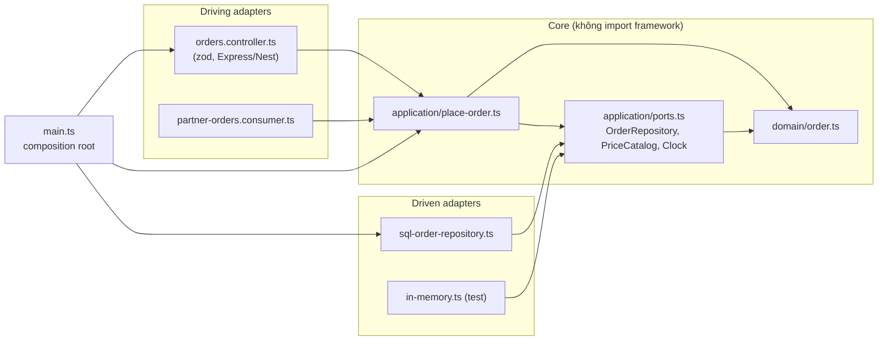
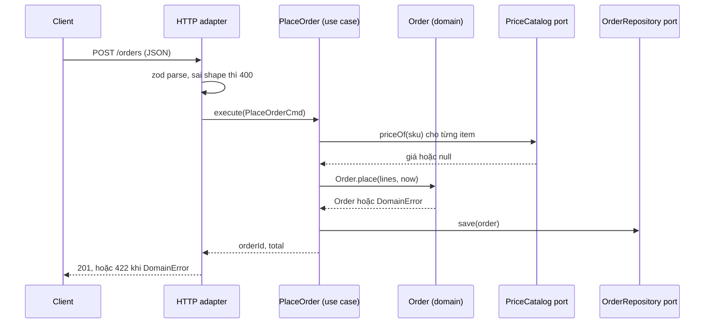

## Bối cảnh & vấn đề

Hai codebase, cùng một tính năng "đặt hàng".

Codebase A: controller Express gọi thẳng Prisma, tính tổng tiền, gọi Stripe, gửi email SES, tất cả trong một handler 180 dòng. Muốn test rule "đơn không được rỗng" phải dựng Postgres, mock Stripe và SES. Khi team muốn nhận đơn qua Kafka (từ app đối tác), họ copy handler sang consumer, và từ đó hai bản rule lệch nhau.

Codebase B: một CRUD "sửa tên danh mục" đi qua controller, request DTO, mapper, use case, input port, output port, repository interface, repository implementation, persistence entity, domain entity, response DTO: 11 file. Một thay đổi thêm một field mất nửa ngày và ba lần review vì mapping sai.

Cả hai đều có vấn đề kiến trúc, theo hai chiều ngược nhau. A thiếu **ranh giới** giữa logic nghiệp vụ và chi tiết kỹ thuật; B có ranh giới ở **chỗ không cần**. **Hexagonal architecture** (Ports & Adapters, Alistair Cockburn 2005) và **Clean Architecture** (Uncle Bob 2012) là câu trả lời cho A. Bài này giải thích chúng hoạt động thế nào, chúng tốn gì, và làm sao không biến thành B. Nền tảng là DIP ở [bài 3](/tracks/design-patterns/learn/isp-dip-dependency-injection) và Adapter ở [bài 5](/tracks/design-patterns/learn/structural-patterns).

## Khái niệm

### Core, port và adapter

**Hexagonal architecture** chia ứng dụng thành **core** (application core: domain model + use case) ở giữa và **adapter** ở ngoài. Core không biết HTTP, Kafka, Postgres, Stripe; nó chỉ biết **port**. Hình lục giác chỉ là cách vẽ để nhấn mạnh "nhiều mặt, mặt nào cũng như nhau", không có ý nghĩa về số 6.

**Port** là một interface **do core định nghĩa**, theo **nhu cầu của core**. Có hai loại:

- **Driving port** (inbound, primary): cách thế giới ngoài **gọi vào** core. Thường là use case: `PlaceOrder.execute(cmd)`.
- **Driven port** (outbound, secondary): thứ core **cần từ** thế giới ngoài: `OrderRepository`, `PaymentGateway`, `Clock`, `EventPublisher`.

**Adapter** là code ở ngoài nối port với công nghệ cụ thể:

- **Driving adapter** (Express/Nest controller, Kafka consumer, CLI, cron job) nhận input của công nghệ đó, chuyển thành command, gọi driving port.
- **Driven adapter** (`SqlOrderRepository`, `StripePaymentGateway`, `KafkaEventPublisher`) **implement** driven port bằng công nghệ cụ thể.

Ý tưởng gốc của Cockburn: ứng dụng nên **chạy được như nhau** dù được điều khiển bởi người dùng, chương trình khác, hay test tự động, và **test được độc lập** với database và thiết bị ngoài. Codebase A ở trên vi phạm đúng điều này: thêm một driving adapter (Kafka) buộc copy logic.

### Dependency rule

**Dependency rule** (Clean Architecture): source code dependency **chỉ được hướng vào trong**. Code ở vòng trong (domain, use case) không được **nhắc tên** bất cứ thứ gì ở vòng ngoài: không import Express, Prisma, zod, SDK, và không import adapter. Adapter import core, không bao giờ ngược lại.

Làm sao use case gọi được database nếu không import nó? **DIP**: use case phụ thuộc interface `OrderRepository` mà **chính core định nghĩa**; adapter SQL implement interface đó. Lúc runtime, luồng gọi đi từ use case ra adapter; lúc compile, mũi tên import đi từ adapter vào core. Đây là chỗ "inversion" ([bài 3](/tracks/design-patterns/learn/isp-dip-dependency-injection#sec-dip-huong-phu-thuoc-tro-vao-abstraction-cua-phia-high-level)).

Clean Architecture vẽ thành các vòng tròn đồng tâm: **Entities** (domain), **Use Cases**, **Interface Adapters** (controller, presenter, gateway), **Frameworks & Drivers** (web, DB). Hexagonal và Clean khác nhau về thuật ngữ và số vòng, giống nhau ở ý chính: **business logic ở giữa, chi tiết ở ngoài, phụ thuộc hướng vào trong**. Onion Architecture (Jeffrey Palermo) là một biến thể cùng ý.

**Interview angle:** red flag là "clean architecture nghĩa là có thư mục controllers, services, repositories". Đó là **layered architecture** theo tầng kỹ thuật, và service trong đó thường import thẳng ORM. Dấu hiệu thật của clean/hexagonal là **hướng import**, kiểm tra được bằng tool.

### Composition root

**Composition root** (`main.ts`, hoặc root module trong Nest) là **nơi duy nhất** `new` các adapter cụ thể và ghép chúng vào use case. Nó nằm ngoài cùng, được phép biết mọi thứ. Mọi file khác nhận dependency qua constructor. Nhờ vậy, test dựng một composition khác (in-memory adapter), và môi trường khác nhau (dev dùng fake payment, prod dùng Stripe) chỉ khác ở composition root.

### Cấu trúc thư mục: theo feature trước, theo tầng bên trong

Tổ chức tốt cho một service Node/TS là **theo feature (bounded context) trước**, rồi **theo vai trò bên trong** feature:

```text
src/
  orders/
    domain/          order.ts, money.ts, events.ts        (không import gì ngoài std + domain)
    application/     place-order.ts, cancel-order.ts, ports.ts
    adapters/
      http/          orders.controller.ts                 (driving)
      kafka/         partner-orders.consumer.ts           (driving)
      sql/           sql-order-repository.ts              (driven)
      payment/       stripe-payment-gateway.ts            (driven)
  catalog/
    ...              (module CRUD đơn giản có thể mỏng hơn nhiều)
  main.ts            composition root
```

Tổ chức theo feature giữ những thứ đổi cùng nhau ở gần nhau (cohesion, [bài 1](/tracks/design-patterns/learn/design-principles)), và cho phép mỗi feature chọn độ dày kiến trúc riêng. Một repo chia `controllers/`, `services/`, `repositories/` ở top level buộc mọi thay đổi chạm ba thư mục xa nhau. Với module đơn giản, gộp `application` và `domain` là chấp nhận được.

### Validation thuộc tầng nào

Có **hai loại** validation, nằm ở hai chỗ:

- **Shape validation** (kiểu dữ liệu, field bắt buộc, format email, số nguyên): ở **driving adapter**, bằng zod/class-validator, trả **400**. Đây là việc dịch input của một công nghệ (JSON qua HTTP) thành command có type. Kafka consumer có validator riêng cho message của nó.
- **Business invariant** ("đơn phải có ít nhất một dòng", "không huỷ đơn đã giao", "SKU phải tồn tại"): ở **domain/use case**, ném domain error, adapter map sang **422/409**. Mọi driving adapter đều đi qua nó, nên rule không bị copy.

Đặt zod trong use case làm core phụ thuộc thư viện ngoài và trộn hai loại lỗi; đặt invariant trong controller làm Kafka consumer bỏ qua nó.

### Chi phí

Hexagonal không miễn phí:

- **Nhiều file và lớp**: interface + implementation + wiring cho mỗi dependency.
- **Mapping**: DTO ↔ command ↔ domain ↔ persistence model. Mỗi field mới đi qua 3–4 chỗ, và mapping sai là một nguồn bug thật.
- **Kỷ luật**: một import "tạm thời" từ domain vào adapter phá rule; không có tool thì nó sẽ xảy ra.
- **Over-engineering cho CRUD**: khi use case chỉ là "nhận form, lưu row", mọi lớp chỉ forward dữ liệu.

Vì vậy câu trả lời cho "khi nào KHÔNG dùng": prototype, admin CRUD, Lambda đơn nhiệm, module có domain logic mỏng. Hexagonal đáng giá ở module có **rule nghiệp vụ thật** và **nhiều driving/driven adapter** (checkout, pricing, billing).

## Cơ chế hoạt động

Sơ đồ dependency (mũi tên = import trong source code). Mọi mũi tên đều hướng vào core:



Đọc sơ đồ theo hai câu hỏi. "Domain import gì?": không gì cả ngoài chính nó. "Ai biết Postgres?": chỉ `sql-order-repository.ts` và composition root. Lúc runtime, một request đi theo hướng khác: controller → use case → (qua interface) → SQL adapter. Sự khác nhau giữa **hướng gọi** và **hướng phụ thuộc** là toàn bộ ý tưởng.

Luồng một request đặt hàng qua các tầng, cho thấy mỗi tầng làm gì và lỗi nào được dịch ở đâu:



Controller không biết rule "SKU phải tồn tại"; nó chỉ biết map `DomainError` thành 422. Use case không biết HTTP; nó chỉ trả kết quả hoặc ném lỗi domain. Thêm một Kafka consumer là thêm một driving adapter khác gọi cùng `execute`, rule không bị copy.

## Ví dụ thực tế

### Một service hexagonal nhỏ chạy thật

Cấu trúc như phần Khái niệm, chạy với tsx 4.23, zod 3, Node 24.21. Domain và use case (rút gọn):

```ts
// domain/order.ts: không import gì
export class DomainError extends Error { constructor(readonly code: string) { super(code); } }
export class Order {
  static place(id: string, customerId: string, lines: OrderLine[], now: Date) {
    if (lines.length === 0) throw new DomainError("ORDER_EMPTY");
    if (lines.some((l) => l.qty <= 0)) throw new DomainError("QTY_INVALID");
    return new Order(id, customerId, lines, "placed", now);
  }
  get total() { return this.lines.reduce((s, l) => s + l.qty * l.unitPrice, 0); }
  /* snapshot(), restore() cho persistence */
}

// application/place-order.ts: chỉ import domain và ports
export class PlaceOrder {
  constructor(private orders: OrderRepository, private catalog: PriceCatalog, private clock: Clock, private ids: IdGen) {}
  async execute(cmd: PlaceOrderCmd) {
    const lines = [];
    for (const i of cmd.items) {
      const price = await this.catalog.priceOf(i.sku);
      if (price === null) throw new DomainError("SKU_NOT_FOUND");
      lines.push({ ...i, unitPrice: price });
    }
    const order = Order.place(this.ids.next(), cmd.customerId, lines, this.clock.now());
    await this.orders.save(order);
    return { orderId: order.id, total: order.total };
  }
}
```

Driving adapter giữ zod và mapping lỗi:

```ts
const Body = z.object({ customerId: z.string().min(1), items: z.array(z.object({ sku: z.string(), qty: z.number().int() })).min(1) });
const status: Record<string, number> = { ORDER_EMPTY: 422, QTY_INVALID: 422, SKU_NOT_FOUND: 422 };
export const placeOrderHandler = (uc: PlaceOrder) => async (raw: unknown) => {
  const parsed = Body.safeParse(raw);                     // shape validation at the edge
  if (!parsed.success) return { status: 400, body: { error: "BAD_REQUEST", issues: parsed.error.issues.length } };
  try { return { status: 201, body: await uc.execute(parsed.data) }; }
  catch (e) { if (e instanceof DomainError) return { status: status[e.code] ?? 422, body: { error: e.code } }; throw e; }
};
```

Composition root ghép adapter in-memory và gọi bốn request:

```text
{ status: 201, body: { orderId: 'ord_1', total: 225000 } }
{ status: 422, body: { error: 'QTY_INVALID' } }
{ status: 422, body: { error: 'SKU_NOT_FOUND' } }
{ status: 400, body: { error: 'BAD_REQUEST', issues: 2 } }
```

Bốn kết quả, ba nguồn: shape sai (400, adapter), invariant (422, domain), dữ liệu tham chiếu không tồn tại (422, use case). Unit test use case không cần HTTP hay DB (`node:test` qua tsx):

```ts
const setup = () => { const repo = new InMemoryOrderRepository(); const uc = new PlaceOrder(repo, new FixedCatalog({ A: 100 }), { now: () => new Date("2026-01-01T00:00:00Z") }, { next: () => "ord_1" }); return { repo, uc }; };
test("places an order and persists it", async () => {
  const { repo, uc } = setup();
  assert.deepEqual(await uc.execute({ customerId: "c1", items: [{ sku: "A", qty: 3 }] }), { orderId: "ord_1", total: 300 });
  assert.equal((await repo.byId("ord_1"))?.state, "placed");
});
```

```text
✔ places an order and persists it (2.734541ms)
✔ rejects unknown sku (0.672041ms)
```

Hai test chạy trong vài mili giây. `Clock` và `IdGen` là port nên test có kết quả xác định (deterministic).

### Enforce dependency rule bằng dependency-cruiser

Rule viết bằng config (dependency-cruiser 16.10.4):

```js
module.exports = {
  forbidden: [
    { name: "domain-is-pure", severity: "error",
      from: { path: "^src/[^/]+/domain" }, to: { pathNot: "^src/[^/]+/domain" } },
    { name: "application-no-adapters", severity: "error",
      from: { path: "^src/[^/]+/application" }, to: { path: "(^src/[^/]+/adapters)|node_modules" } },
    { name: "no-circular", severity: "error", from: {}, to: { circular: true } },
  ],
  options: { tsPreCompilationDeps: true, doNotFollow: { path: "node_modules" }, tsConfig: { fileName: "tsconfig.json" } },
};
```

Thêm hai vi phạm "tạm thời": domain import adapter in-memory, use case import zod. Chạy `npx depcruise --output-type err src`:

```text
  error no-circular: src/orders/adapters/memory/in-memory.ts → 
      src/orders/domain/order.ts →
      src/orders/adapters/memory/in-memory.ts
  error no-circular: src/orders/adapters/memory/in-memory.ts → 
      src/orders/application/ports.ts →
      src/orders/domain/order.ts →
      src/orders/adapters/memory/in-memory.ts
  error domain-is-pure: src/orders/domain/order.ts → src/orders/adapters/memory/in-memory.ts
  error application-no-adapters: src/orders/application/place-order.ts → node_modules/zod/index.cjs

x 4 dependency violations (4 errors, 0 warnings). 7 modules, 13 dependencies cruised.
```

Gỡ hai import, chạy lại: `✔ no dependency violations found (7 modules, 11 dependencies cruised)`. Một import sai từ domain sinh ra **hai vòng import** cùng lúc, đúng loại lỗi đã thấy ở [bài 3](/tracks/design-patterns/learn/isp-dip-dependency-injection#sec-circular-import-cung-code-khac-entry-point). Chạy lệnh này trong CI là cách duy nhất giữ rule qua thời gian. Lưu ý gặp thật khi chạy: dependency-cruiser 16.10 chỉ nhận TypeScript `>=2 <6` làm transpiler; với `typescript@7` trong project nó âm thầm cruise **0 module** và báo "no violations" (verify với phiên bản bạn dùng). Hãy kiểm tra số module cruised trong output, đừng chỉ nhìn dấu ✔. Alternative: `eslint-plugin-boundaries`, hoặc `no-restricted-imports` cho rule đơn giản, hoặc tách package trong monorepo để package manager chặn import.

### Test từng tầng

| Tầng | Loại test | Phụ thuộc thật | Tốc độ |
| --- | --- | --- | --- |
| Domain | Unit thuần (input → output/lỗi) | Không | Rất nhanh |
| Use case | Unit với in-memory/fake adapter | Không | Nhanh |
| Driven adapter | Integration với DB/dịch vụ thật (Testcontainers, sandbox) | DB, broker | Chậm hơn |
| Driving adapter | HTTP test mỏng: shape, status code, mapping lỗi | Use case giả hoặc thật | Nhanh |
| Toàn hệ thống | Vài E2E cho luồng chính | Tất cả | Chậm |

Thêm **contract test** cho port: cùng một bộ test chạy trên `InMemoryOrderRepository` và `SqlOrderRepository`, đảm bảo fake hành xử như thật (nếu không, test use case xanh trên fake nhưng production sai).

## Trade-offs & lựa chọn thay thế

| Kiến trúc | Được | Mất | Hợp khi |
| --- | --- | --- | --- |
| Handler gọi thẳng ORM/SDK | Nhanh nhất để viết, ít file | Logic trộn với I/O, khó test, copy khi thêm entry point | Prototype, script, CRUD mỏng |
| Layered (controller/service/repo) | Quen thuộc, có phân tách | Service thường import ORM, hướng phụ thuộc đi xuống DB | Đa số app CRUD vừa |
| Vertical slice (theo use case) | Mỗi use case tự chọn cách làm, ít mapping | Dễ lặp code giữa slice, cần kỷ luật chung | Module nhiều use case độc lập, read-heavy |
| Hexagonal / Clean | Core độc lập, test nhanh, nhiều adapter dễ | Nhiều file, mapping, cần tooling | Domain rule phức tạp, nhiều entry point/provider |
| Hỗn hợp theo module | Mỗi module đúng độ dày | Phải giải thích và ghi lại vì sao | Codebase lớn, độ phức tạp không đều |

Chọn thế nào: độ dày kiến trúc nên **tỉ lệ với độ phức tạp nghiệp vụ** của từng module, không đồng phục cho cả codebase. Checkout, pricing, billing: hexagonal. Admin CRUD, báo cáo đọc: vertical slice mỏng hoặc layered, query builder trực tiếp. Một quy tắc đặt ra cho cả team: dù mỏng hay dày, **domain/use case không import framework**, vì đó là phần rẻ nhất để giữ và đắt nhất để gỡ sau.

### Khi team đã có 11 file cho một CRUD

Đây là câu hỏi judgment, không có đáp án đúng duy nhất. Một quy trình hợp lý:

1. **Hỏi lý do lịch sử trước** (Chesterton's fence): từng có kế hoạch đổi DB? có nhiều adapter thật? có bộ test dựa vào cấu trúc này? Đừng gỡ hàng rào trước khi biết vì sao nó được dựng.
2. **Đo chi phí thật**: lead time của một thay đổi nhỏ, số file mỗi PR, số bug do mapping trong 6 tháng, thời gian onboarding.
3. **Đề xuất phân tầng theo độ phức tạp**: module CRUD/read-heavy chuyển sang slice mỏng (controller + use case + query trực tiếp); module có rule phức tạp giữ hexagonal.
4. **Ghi ADR** (Architecture Decision Record): bối cảnh, lựa chọn, hệ quả, tiêu chí khi nào một module "lên hạng" sang hexagonal.
5. **Thử trên một module**, so sánh số liệu, rồi mới mở rộng.

Lo ngại "codebase không nhất quán" được giải bằng việc **nhất quán ở mức quy tắc**, không ở mức số file: mọi module theo cùng cấu trúc thư mục cơ bản, cùng rule import (enforce bằng tool), và ADR nói rõ khi nào dùng kiểu nào. Tín hiệu senior là không dogmatic về cả hai phía.

## Edge cases & failure modes

- **Port định nghĩa theo DB thay vì theo use case**: `OrderRepository` có `findWithJoins(include: Prisma.OrderInclude)`. Core giờ phụ thuộc type của Prisma qua cửa sau; dependency rule bị phá dù import có vẻ sạch.
- **Domain error rò thành 500**: adapter quên map một `DomainError` mới, client nhận 500 cho lỗi nghiệp vụ, alert on-call vô ích. Một bảng map tập trung + test "mọi code lỗi domain đều có status".
- **Transaction xuyên use case**: hai use case cần chạy trong một transaction, nhưng mỗi cái tự mở transaction qua repository. Cần Unit of Work là một port ([bài 10](/tracks/design-patterns/learn/repository-uow-outbox)).
- **Fake adapter lệch với thật**: in-memory repo không có unique constraint, test xanh, production lỗi duplicate key. Contract test chung cho fake và thật.
- **Composition root phình**: `main.ts` 800 dòng `new`. Chia theo module (`orders/compose.ts` export một hàm wiring), hoặc dùng container cho phần lớn.
- **Tool im lặng**: dependency-cruiser không tìm được transpiler phù hợp, cruise 0 module, báo xanh. Kiểm tra số module trong output CI.
- **Mapping mất dữ liệu**: field mới thêm vào domain nhưng quên trong persistence mapper, ghi xuống DB là `null`. Test round-trip (save rồi load) cho repository.

## Pitfalls

- ❌ "Clean architecture = thư mục controllers/services/repositories" → ✅ clean/hexagonal được định nghĩa bằng **hướng import**: domain và use case không import framework/adapter.
- ❌ Interface port đặt trong adapter hoặc mang type của ORM → ✅ port do core định nghĩa, theo nhu cầu use case, type thuần.
- ❌ zod/class-validator trong use case, invariant trong controller → ✅ shape ở driving adapter (400), invariant ở domain/use case (422).
- ❌ `new SqlRepo()` rải trong code → ✅ một composition root; mọi chỗ khác nhận qua constructor.
- ❌ Dựa vào review để giữ dependency rule → ✅ dependency-cruiser / eslint boundaries trong CI, và kiểm tra số module được cruise.
- ❌ Hexagonal đồng phục cho mọi module → ✅ độ dày tỉ lệ với độ phức tạp nghiệp vụ; ghi ADR.
- ❌ Gỡ kiến trúc hiện có vì "nhiều file" → ✅ hỏi lý do lịch sử, đo lead time và bug, thử trên một module trước.

## Tóm tắt

- Hexagonal: core (domain + use case) ở giữa, adapter ở ngoài, nói chuyện qua **port** do core định nghĩa. Driving adapter gọi vào, driven adapter implement port ra ngoài.
- Dependency rule: import chỉ hướng vào trong; hiện thực bằng DIP. Hướng gọi lúc runtime và hướng phụ thuộc lúc compile ngược nhau.
- Composition root là nơi duy nhất biết adapter cụ thể; test và môi trường khác nhau chỉ khác ở đó.
- Tổ chức theo feature trước, theo vai trò bên trong; shape validation ở adapter, invariant ở domain.
- Test: domain và use case là unit nhanh với fake, adapter là integration với hạ tầng thật, thêm contract test cho fake.
- Enforce bằng tool (dependency-cruiser bắt được cả vòng import), không bằng trí nhớ.
- Chi phí là file, mapping và kỷ luật; độ dày kiến trúc nên tỉ lệ với độ phức tạp của từng module.
