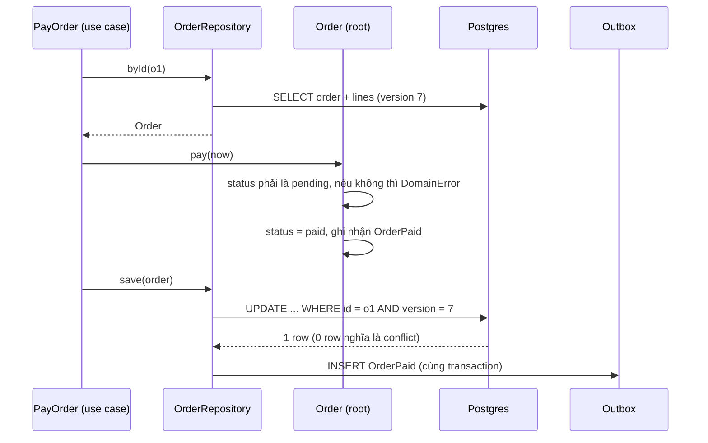
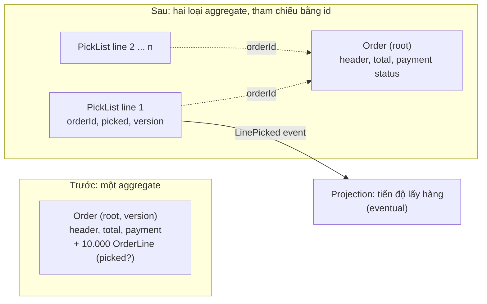

## Bối cảnh & vấn đề

Một hệ thống quản lý đơn hàng B2B. Bảng `orders` có cột `status`, `paid_at`, `shipped_at`. Mười hai service khác nhau set các cột này: `PaymentService`, `WarehouseService`, một job đồng bộ từ ERP, một màn hình admin. Sau một năm, query kiểm tra dữ liệu tìm thấy 340 đơn `status = 'SHIPPED'` nhưng `paid_at IS NULL`, 12 đơn bị huỷ sau khi đã giao, và một rule "đơn trên 50 triệu phải được duyệt" được copy ở 4 service với 2 ngưỡng khác nhau.

Cùng hệ thống, team kho than phiền: mỗi khi hai nhân viên cùng đánh dấu "đã lấy hàng" trên hai dòng khác nhau của một đơn lớn, một người nhận lỗi "dữ liệu đã bị thay đổi, vui lòng thử lại". Một đơn có 10.000 dòng, mở trang mất 4 giây.

Hai triệu chứng, hai lỗi thiết kế ngược chiều: invariant nghiệp vụ không có **chủ sở hữu** (ai cũng sửa được field), và ranh giới nhất quán **quá to** (một đơn là một khối khoá chung). **DDD tactical patterns** (Eric Evans 2003, Vaughn Vernon 2013) cho từ vựng và quy tắc để giải cả hai: **Entity**, **Value Object**, **Aggregate**, **Domain Event**, **Domain Service**. Bài này không cần biết DDD strategic (bounded context, context map) để hiểu, nhưng nhớ rằng mọi khái niệm ở đây sống **bên trong một bounded context**.

## Khái niệm

### Entity

**Entity** là object có **identity** tồn tại xuyên thời gian: `Order#123` vẫn là đơn đó dù trạng thái, địa chỉ, dòng hàng thay đổi. Hai entity bằng nhau khi **cùng id**, không phải khi cùng thuộc tính: hai khách hàng cùng tên "Nguyễn Văn A" là hai người. Entity thường mutable (qua method có kiểm soát) và có vòng đời (tạo, đổi trạng thái, kết thúc).

### Value Object

**Value Object** (VO) là object **không có identity**, được định nghĩa hoàn toàn bởi **giá trị** của nó, và **bất biến**: `Money(1999n, 'USD')`, `Address`, `DateRange`, `EmailAddress`, `Quantity`. Hai VO bằng nhau khi mọi thành phần bằng nhau. Muốn "đổi" thì tạo VO mới (`money.add(other)` trả object mới).

VO là công cụ mạnh nhất và rẻ nhất của DDD tactical, vì nó **đóng gói rule nhỏ** vào kiểu dữ liệu: `Money` không cho cộng VND với USD, dùng **integer minor unit** (`bigint` xu/đồng) thay vì float, và chia tiền không mất một xu (`allocate`). `EmailAddress.parse()` chỉ tạo được object hợp lệ, nên mọi chỗ nhận `EmailAddress` không cần validate lại. Đây là cách chữa **primitive obsession** ([bài 12](/tracks/design-patterns/learn/extensible-design-refactoring)): dùng `string` cho tiền, id, email làm mất rule và dễ truyền nhầm tham số.

### Aggregate

**Aggregate** là một cụm entity và VO được coi là **một đơn vị nhất quán**, có đúng **một root** (aggregate root). Quy tắc:

- Mọi thay đổi bên trong aggregate **đi qua root**: `order.addLine(...)`, không bao giờ `order.lines.push(...)` hay update trực tiếp bảng `order_lines`.
- Root bảo vệ **invariant** của cả cụm: "tổng tiền = tổng các dòng", "không thêm dòng khi đơn đã thanh toán".
- **Một transaction sửa một aggregate**. Aggregate là đơn vị load, save, và khoá (optimistic version).
- Bên ngoài chỉ giữ **reference tới root bằng id**, không giữ reference tới object bên trong.

Ranh giới aggregate không vẽ theo "thứ gì thuộc về thứ gì" trong đời thực (đơn hàng "có" khách hàng, khách hàng "có" địa chỉ...), mà theo **invariant phải nhất quán tức thì** (true invariant): những dữ liệu nào phải luôn đúng cùng nhau **ngay khi commit**? Nếu một rule chấp nhận đúng "sau vài giây", nó nằm **giữa** các aggregate và được đảm bảo bằng domain event (eventual consistency).

### Bốn quy tắc aggregate nhỏ (Vaughn Vernon)

Trong loạt bài *Effective Aggregate Design*, Vernon tóm thành bốn quy tắc:

1. **Model true invariants in consistency boundaries**: chỉ gom vào một aggregate những thứ có invariant chung thật sự.
2. **Design small aggregates**: aggregate nhỏ load nhanh, ít conflict, scale tốt. Mặc định là root + VO; chỉ thêm entity con khi invariant đòi.
3. **Reference other aggregates by identity**: `order.customerId`, không phải `order.customer: Customer`. Tránh load cả đồ thị và tránh sửa hai aggregate trong một transaction "vì tiện".
4. **Use eventual consistency outside the boundary**: thay đổi lan sang aggregate khác qua domain event, xử lý ở transaction riêng.

Aggregate **quá to** (`Order` chứa `Customer` chứa mọi `Order` khác của khách) gây: load chậm, lock contention, và optimistic-lock conflict giữa những người sửa phần **không liên quan** (ví dụ chạy thật ở dưới).

### Domain Event và Domain Service

**Domain Event** là một sự kiện nghiệp vụ **đã xảy ra**, đặt tên ở thì quá khứ: `OrderPaid`, `LinePicked`, `CustomerDeactivated`. Aggregate ghi nhận event khi trạng thái đổi; event được publish sau khi transaction commit (qua outbox, [bài 10](/tracks/design-patterns/learn/repository-uow-outbox)) để aggregate khác phản ứng. Đây là cơ chế cho quy tắc 4 của Vernon.

**Domain Service** chứa rule **không thuộc tự nhiên về một entity nào**, thường vì nó cần nhiều aggregate hoặc một khái niệm không có identity: tính phí vận chuyển dựa trên đơn + kho + bảng giá, chuyển tiền giữa hai tài khoản (có ngữ cảnh), kiểm tra trùng lặp. Domain service vẫn là code domain (không I/O trực tiếp, nhận dữ liệu qua tham số hoặc port), khác với **application service** (use case) chỉ điều phối: load aggregate, gọi method, save.

### Anemic vs rich domain model

**Anemic domain model**: entity chỉ là túi dữ liệu (field + getter/setter), mọi rule nằm trong service. Fowler gọi đây là anti-pattern **khi bạn đang cố làm DDD**: bạn trả chi phí của domain model (mapping, lớp) mà không được lợi ích (invariant đóng gói). Mọi chỗ có quyền set field đều có thể tạo trạng thái không hợp lệ, đúng như 340 đơn "SHIPPED nhưng chưa thanh toán" ở trên.

**Rich domain model**: entity/aggregate đóng gói rule trong method mang ngữ nghĩa nghiệp vụ: `order.pay(at)` kiểm tra trạng thái, set `paidAt`, ghi nhận `OrderPaid`. Không có `setStatus()` public. Invariant **luôn đúng** vì không có đường nào khác để đổi state.

Anemic **không phải lúc nào cũng sai**. Với CRUD hoặc logic đơn giản, **Transaction Script** (Fowler: một procedure cho mỗi request, đọc/sửa dữ liệu trực tiếp) + data object là rõ ràng và dễ hiểu hơn. Dấu hiệu cần chuyển sang rich model: cùng một rule bị copy ở nhiều service, bug do trạng thái không hợp lệ, điều kiện `if (status === ...)` rải khắp nơi.

**Interview angle:** "anemic có luôn sai không?" Câu trả lời tốt: sai khi domain có invariant thật mà bị bỏ ngỏ; đúng cho CRUD. Follow-up: "persist rich object có private field bằng ORM thế nào?" Ba cách: snapshot/restore (Memento) qua mapper riêng; ORM map field private (TypeORM/MikroORM hỗ trợ property mapping); hoặc tách persistence model + mapper.

### Domain error: exception hay Result

Lỗi nghiệp vụ **dự kiến** (`INSUFFICIENT_STOCK`, `COUPON_EXPIRED`, `ORDER_NOT_PAYABLE`) khác lỗi **không mong đợi** (DB down, bug null). Hai cách biểu diễn:

- **Exception** (`throw new DomainError('ORDER_NOT_PAYABLE')`): ngắn gọn, có stack trace, đi xuyên nhiều tầng mà không phải kiểm tra từng bước. Nhược: TypeScript **không có checked exception**; signature `pay(at: Date): void` không nói nó có thể ném gì, nên caller không biết phải xử lý những lỗi nào, và `catch {}` nuốt mọi thứ.
- **Result type** (discriminated union `{ ok: true, value } | { ok: false, error }`, hoặc thư viện neverthrow): lỗi dự kiến nằm **trong type**, compiler ép caller xử lý, và tập error code là union có thể map đầy đủ sang HTTP (dùng `satisfies Record<ErrorCode, number>` để compiler bắt thiếu code). Nhược: rườm rà khi chain nhiều bước, và không thay được exception cho lỗi hạ tầng.

Cách kết hợp thực tế: **Result cho lỗi nghiệp vụ dự kiến** trong domain/use case, **exception cho lỗi hạ tầng và bug**. Ở biên (controller, error middleware), map cả hai sang một format response thống nhất (ví dụ Problem Details), với bảng `code → status` tập trung. Chọn một cách cho mỗi codebase và nhất quán; trộn tuỳ hứng là tệ nhất.

## Cơ chế hoạt động

Một thay đổi trên aggregate đi qua root, kiểm tra invariant, lưu với kiểm tra version, và phát event cho aggregate khác:



Hai cơ chế cùng bảo vệ invariant. Method `pay` chặn transition không hợp lệ **trong bộ nhớ**. `WHERE version = 7` chặn **lost update**: nếu ai đó đã sửa đơn sau khi bạn load, update khớp 0 dòng và use case phải retry hoặc báo conflict. Version thuộc về **cả aggregate**; đó là lý do aggregate to thì conflict nhiều: sửa một dòng bất kỳ cũng tăng version của cả đơn.

Thiết kế lại aggregate 10.000 dòng: tách theo invariant thật.



Câu hỏi quyết định: trạng thái "đã lấy hàng" của dòng 1 có liên quan tới invariant nào của `Order` không? "Tổng tiền = tổng dòng" liên quan tới **giá và số lượng**, không tới picking. Vậy picking là một aggregate riêng (theo dòng hoặc theo kho), version riêng, nhân viên kho không còn tranh nhau. Trạng thái tổng ("đã lấy 8.500/10.000 dòng") là một **projection** cập nhật bằng event, eventual consistency. UI phải chấp nhận trạng thái trung gian: thanh tiến độ có thể chậm một nhịp.

## Ví dụ thực tế

### Value Object Money

Chạy với tsx 4.23 / Node 24.21:

```ts
class Money {
  private constructor(readonly minor: bigint, readonly currency: "VND" | "USD") { Object.freeze(this); }
  static of(minor: bigint, c: "VND" | "USD") { return new Money(minor, c); }
  add(o: Money) { if (o.currency !== this.currency) throw new Error("CURRENCY_MISMATCH"); return new Money(this.minor + o.minor, this.currency); }
  allocate(parts: number) {                                   // split without losing a single minor unit
    const base = this.minor / BigInt(parts), rest = this.minor % BigInt(parts);
    return Array.from({ length: parts }, (_, i) => new Money(base + (BigInt(i) < rest ? 1n : 0n), this.currency));
  }
  equals(o: Money) { return this.minor === o.minor && this.currency === o.currency; }
}
console.log("float:", 0.1 + 0.2, "| 19.99*100 =", 19.99 * 100);
const a = Money.of(1999n, "USD"), b = Money.of(1999n, "USD");
console.log("a === b:", a === b, "| a.equals(b):", a.equals(b));
console.log("100 USD cents split 3:", Money.of(100n, "USD").allocate(3).map(String));
```

```text
float: 0.30000000000000004 | 19.99*100 = 1998.9999999999998
a === b: false | a.equals(b): true
100 USD cents split 3: [ '34 USD', '33 USD', '33 USD' ]
add VND+USD: CURRENCY_MISMATCH
mutate frozen VO: TypeError
```

`19.99 * 100` không ra 1999: lưu tiền bằng float là bug chờ xảy ra. `===` so sánh reference nên VO cần `equals`. Chia 100 xu cho 3 không mất xu nào (34 + 33 + 33). VO freeze nên mutate ném `TypeError` (ESM chạy strict mode).

### Aggregate to: đo conflict trên Postgres 17

Một đơn 10.000 dòng; 8 nhân viên cùng đánh dấu 8 dòng **khác nhau**. Bản aggregate to: mọi thay đổi tăng version của `orders` (PostgreSQL 17.11, `pg` 8.23):

```ts
async function pickLineBigAggregate(line: number) {
  const { rows: [o] } = await pool.query("SELECT version FROM orders WHERE id='o1'");
  await new Promise((r) => setTimeout(r, 5));                         // load 10k lines, think, etc.
  // BEGIN
  const r = await c.query("UPDATE orders SET version = version + 1 WHERE id='o1' AND version=$1", [o.version]);
  if (r.rowCount === 0) { await c.query("ROLLBACK"); return "CONFLICT"; }
  await c.query("UPDATE order_lines SET picked = true WHERE order_id='o1' AND line_no=$1", [line]);
  // COMMIT
}
// Bản tách: mỗi dòng picking là aggregate riêng, version riêng
async function pickLineSmall(line: number) {
  const { rows: [p] } = await pool.query("SELECT version FROM pick_lists WHERE order_id='o1' AND line_no=$1", [line]);
  await new Promise((r) => setTimeout(r, 5));
  const r = await pool.query("UPDATE pick_lists SET picked=true, version=version+1 WHERE order_id='o1' AND line_no=$1 AND version=$2", [line, p.version]);
  return r.rowCount === 1 ? "ok" : "CONFLICT";
}
```

```text
load aggregate: 10000 lines
8 staff pick different lines (big aggregate): { ok: 2, CONFLICT: 6 }
8 staff pick different lines (small aggregates): { ok: 8 }
```

6 trên 8 thao tác **không xung đột về nghiệp vụ** vẫn bị từ chối (số chính xác thay đổi theo lần chạy, tuỳ ai đọc version trước commit đầu tiên). Bản tách: cả 8 thành công. Nếu bắt buộc giữ chung một aggregate, các biện pháp giảm nhẹ: lazy load lines (không load 10.000 dòng chỉ để đổi một), command nhỏ hơn, retry tự động cho conflict mà command có thể áp lại an toàn. Nhưng chữa tận gốc là đặt lại ranh giới theo invariant.

### Invariant xuyên aggregate: "tối đa 3 đơn chưa thanh toán"

Rule này **không** nằm trong `Order`: một đơn không biết các đơn khác của khách. Nó là invariant **trên tập** đơn của một khách. Ba cách thử, 6 request đặt hàng đồng thời cho cùng khách:

```ts
// 1. naive: đếm rồi insert trong transaction READ COMMITTED
const { rows: [{ n }] } = await c.query("SELECT count(*)::int n FROM orders2 WHERE customer_id='c1' AND status='unpaid'");
if (n >= 3) return "rejected";
await c.query("INSERT INTO orders2(customer_id, status) VALUES ('c1','unpaid')");

// 2. serialize theo khách: khoá row customer trước khi đếm
await c.query("SELECT 1 FROM customers WHERE id='c1' FOR UPDATE");

// 3. counter trên customer + CHECK constraint (customer là aggregate giữ invariant)
await c.query("UPDATE customers SET unpaid_count = unpaid_count + 1 WHERE id='c1'"); // CHECK (unpaid_count <= 3)
```

```text
naive count             -> placed=6 rejected=0 unpaid in DB=6
FOR UPDATE on customer  -> placed=3 rejected=3 unpaid in DB=3
counter + CHECK         -> placed=3 rejected=3 unpaid in DB=3
```

Bản naive cho 6 đơn: cả 6 transaction cùng đếm thấy 0 trước khi ai commit (write skew, xem track SQL về [isolation](/tracks/sql-postgres/learn/isolation-levels)). Hai cách đúng đều **chọn một aggregate làm chủ invariant**: hoặc khoá `Customer` để serialize mọi đặt hàng của khách đó, hoặc mô hình hoá `Customer.unpaidCount` như một phần của aggregate `Customer` với constraint ở DB. Cách thứ 3 cần giảm counter khi đơn được thanh toán hoặc huỷ (qua event `OrderPaid`, trong cùng transaction nếu muốn chính xác tức thì, hoặc eventual nếu nghiệp vụ chấp nhận vượt tạm thời). Nếu nghiệp vụ chấp nhận "đôi khi 4 đơn trong vài giây", eventual check bằng event + huỷ đơn thừa cũng hợp lệ, và rẻ hơn. Đó là câu hỏi cho product, không cho dev.

### Result type map sang HTTP

```ts
type Result<T, E extends string> = { ok: true; value: T } | { ok: false; error: E };
const reserve = (stock: number, qty: number): Result<number, "INSUFFICIENT_STOCK" | "QTY_INVALID"> =>
  qty <= 0 ? { ok: false, error: "QTY_INVALID" } : qty <= stock ? { ok: true, value: stock - qty } : { ok: false, error: "INSUFFICIENT_STOCK" };
const httpStatus = { INSUFFICIENT_STOCK: 409, QTY_INVALID: 422 } satisfies Record<"INSUFFICIENT_STOCK" | "QTY_INVALID", number>;
```

```text
reserve(5, 2) -> 200 left=3
reserve(5, 9) -> 409 INSUFFICIENT_STOCK
reserve(5, 0) -> 422 QTY_INVALID
```

Thêm error code mới vào union mà quên `httpStatus` thì `satisfies` báo lỗi compile. Đây là cách giữ error code nhất quán giữa domain và HTTP response: **một nguồn** (union type), một bảng map có kiểm tra đầy đủ.

## Trade-offs & lựa chọn thay thế

| Lựa chọn | Được | Mất | Hợp khi |
| --- | --- | --- | --- |
| Transaction script + anemic data | Đơn giản, đọc tuần tự | Rule copy, trạng thái không hợp lệ khi lớn | CRUD, logic mỏng |
| Rich domain model | Invariant luôn đúng, rule một chỗ | Mapping persistence, học DDD | Rule nghiệp vụ phức tạp, nhiều chỗ đổi state |
| Value Object | Rule nhỏ trong type, chống primitive obsession | Thêm class, serialize/deserialize | Tiền, số lượng, email, khoảng thời gian, id có format |
| Aggregate to | Mọi invariant tức thì | Load chậm, conflict, lock | Hầu như không nên |
| Aggregate nhỏ + event | Ít conflict, scale | Eventual consistency, UI chịu trạng thái trung gian | Mặc định |
| Exception cho domain error | Gọn, xuyên tầng | Không có trong type, dễ nuốt | Codebase đã quen, ít loại lỗi |
| Result type | Lỗi trong type, compiler ép xử lý | Rườm rà khi chain | Nhiều lỗi nghiệp vụ dự kiến cần map chính xác |

Chọn thế nào: bắt đầu bằng **Value Object** ở mọi chỗ dùng tiền và id, kể cả trong code transaction script: nó rẻ và chữa nhiều bug. Chuyển sang rich aggregate khi thấy rule bị copy hoặc dữ liệu ở trạng thái không hợp lệ. Vẽ ranh giới aggregate theo invariant **tức thì**, mặc định nhỏ; mọi thứ còn lại là eventual qua event. Với invariant xuyên aggregate, hỏi product "vi phạm tạm thời có chấp nhận được không?" trước khi chọn giữa khoá/constraint và eventual check.

## Edge cases & failure modes

- **Setter public trên aggregate**: `order.status = 'shipped'` vẫn compile vì field public. Dùng `private`/`#private` + method nghiệp vụ; ORM map qua mapper hoặc field access.
- **Sửa hai aggregate trong một transaction "cho tiện"**: chạy được với một DB, nhưng tạo lock giữa hai aggregate, và vỡ khi một trong hai tách sang service khác.
- **Load cả đồ thị qua reference object**: `order.customer.orders` lazy-load trong vòng lặp tạo N+1 và kéo aggregate khác vào phạm vi sửa. Tham chiếu bằng id.
- **Invariant tập hợp kiểm tra bằng đếm**: write skew ở READ COMMITTED (đo ở trên). Cần khoá, constraint, hoặc SERIALIZABLE với retry.
- **Event phát trước commit**: aggregate phát `OrderPaid` qua `EventEmitter` ngay trong `pay()`, transaction rollback sau đó, consumer đã gửi email "thanh toán thành công". Event chỉ được publish sau commit (outbox).
- **VO bị mutate qua reference**: `Address` có mảng `lines` không freeze sâu; ai đó `push` vào và mọi đơn dùng chung object đó đổi theo.
- **Result bị bỏ qua**: `reserve(stock, qty)` trả `{ ok: false }` nhưng caller không kiểm tra `ok`; TS không cảnh báo nếu giá trị trả về không được dùng. Lint rule (ví dụ của neverthrow) hoặc review.

## Pitfalls

- ❌ Aggregate theo "thứ gì sở hữu thứ gì" trong đời thực → ✅ theo invariant phải nhất quán tức thì; mặc định nhỏ.
- ❌ `order.customer: Customer` → ✅ `order.customerId: CustomerId`; aggregate khác load riêng khi cần.
- ❌ Service 2.000 dòng + entity chỉ có getter/setter, gọi là DDD → ✅ method nghiệp vụ trên aggregate (`pay`, `cancel`), không có setter public.
- ❌ Tiền bằng `number` float → ✅ `Money` VO với `bigint` minor unit, currency, rounding policy rõ.
- ❌ Đếm rồi insert để giữ "tối đa N" → ✅ khoá row chủ invariant, counter + CHECK, hoặc SERIALIZABLE có retry.
- ❌ Publish domain event trước khi commit → ✅ ghi event vào outbox cùng transaction, publish sau commit.
- ❌ Trộn exception và Result tuỳ hứng → ✅ Result cho lỗi nghiệp vụ dự kiến, exception cho hạ tầng; một bảng map code → HTTP có kiểm tra đầy đủ.

## Tóm tắt

- Entity có identity xuyên thời gian; Value Object được định nghĩa bởi giá trị, bất biến, so sánh bằng `equals`, và là cách rẻ nhất để đóng gói rule nhỏ (Money, Email).
- Aggregate là ranh giới nhất quán với một root: mọi thay đổi qua root, một transaction một aggregate, tham chiếu aggregate khác bằng id.
- Vẽ ranh giới theo **true invariant**; aggregate nhỏ, eventual consistency giữa aggregate qua domain event (Vernon).
- Aggregate to gây load chậm và optimistic-lock conflict giữa thay đổi không liên quan (đo thật: 6/8 conflict so với 0/8 khi tách).
- Invariant xuyên aggregate cần một chủ sở hữu: khoá row, counter + constraint, hoặc chấp nhận eventual sau khi hỏi product.
- Anemic model sai khi domain có invariant thật; với CRUD, transaction script là hợp lý.
- Domain error: Result cho lỗi dự kiến (compiler ép xử lý), exception cho hạ tầng; map tập trung sang HTTP.
