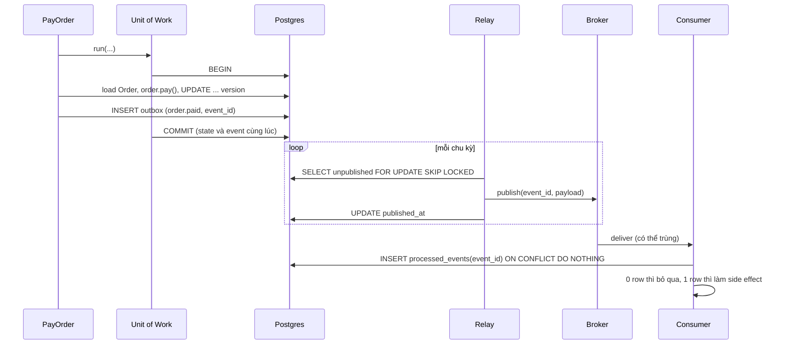
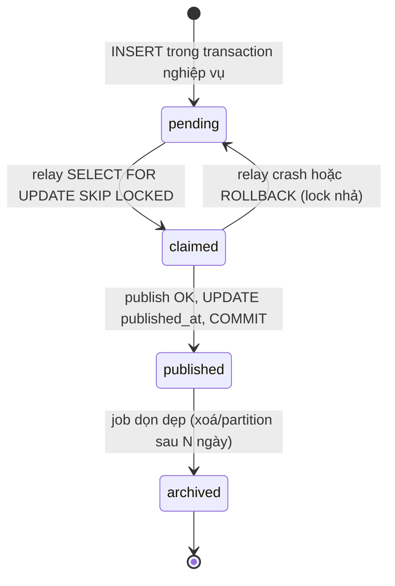

## Bối cảnh & vấn đề

Use case "thanh toán đơn" viết thế này:

```ts
await prisma.order.update({ where: { id }, data: { status: "PAID" } });
await kafka.send({ topic: "order.paid", messages: [{ value: JSON.stringify({ orderId: id }) }] });
```

Ngày thường nó chạy. Ngày Kafka bị restart 40 giây, 1.200 đơn được ghi `PAID` nhưng event không bao giờ được gửi: kho không đóng gói, khách không nhận email, và không có dấu vết nào để gửi lại. Đảo thứ tự (gửi event trước, update sau) thì ngày Postgres failover, kho đóng gói những đơn **chưa** được ghi thanh toán. Đây là **dual-write problem**: ghi vào hai hệ thống không có transaction chung, thì luôn có một cửa sổ mà một bên thành công và bên kia thất bại.

Cùng codebase còn hai câu hỏi thiết kế thường gặp trong phỏng vấn: "đã dùng Prisma/TypeORM rồi, thêm Repository có đáng không hay chỉ là ceremony?", và "làm sao để nhiều repository dùng chung một transaction mà không truyền `tx` qua mọi hàm?". Bài này trả lời cả ba bằng ba pattern liên kết với nhau: **Repository**, **Unit of Work**, **Transactional Outbox**. Chúng nối domain model ([bài 9](/tracks/design-patterns/learn/ddd-tactical)) với persistence và messaging.

## Khái niệm

### Repository

**Repository** (Fowler, PoEAA): "mediates between the domain and data mapping layers using a **collection-like interface**". Với domain code, repository trông như một tập hợp aggregate trong bộ nhớ: `orders.byId(id)`, `orders.save(order)`, `orders.openForCustomer(customerId)`. Nó che giấu SQL, ORM, cache, và việc map row ↔ aggregate.

Repository có giá trị khi:

- Domain có **invariant thật** và bạn dùng aggregate ([bài 9](/tracks/design-patterns/learn/ddd-tactical)): repository load và save **cả aggregate** (root + con), kiểm tra version, và là chỗ duy nhất biết aggregate được lưu thế nào.
- Bạn muốn **test use case bằng in-memory repo** (nhanh, deterministic), như ở [bài 8](/tracks/design-patterns/learn/hexagonal-clean-architecture).
- Cần **chính sách bắt buộc** cho mọi truy cập: filter `tenant_id` không bao giờ được quên, soft-delete, row-level permission.
- Một phần storage khác loại: đơn lưu SQL, nhưng tìm kiếm đơn đi qua Elasticsearch.

Repository là **ceremony** khi app là CRUD mỏng và repository chỉ forward 1-1 sang ORM (`findById → prisma.x.findUnique`), hoặc khi nó là **generic `Repository<T>`** với `findAll/findById/save/delete` cho mọi bảng. Generic repository không mang ngữ nghĩa domain, thường lộ query builder ra ngoài (mất cả ý nghĩa của việc che giấu), và lý do "để sau này đổi database" hiếm khi thành hiện thực: đổi DB khó vì **semantic** (transaction, index, JSON), không vì tên method.

Quy tắc: **một repository cho mỗi aggregate root** (không cho mỗi bảng), method mang **ngữ nghĩa domain** (`findOpenOrdersForCustomer`), trả về aggregate hoặc VO, không trả row ORM.

**Interview angle:** red flag là "luôn wrap ORM để có thể đổi DB sau này". Follow-up hay gặp: "query báo cáo join 6 bảng đặt trong repository không?" Không: báo cáo là **read model**, đi qua query service/DAO riêng trả DTO, viết SQL hoặc query builder trực tiếp ([CQRS](/tracks/design-patterns/learn/cqrs-event-sourcing) ở dạng nhẹ). Repository chỉ cho write side và load aggregate.

### Unit of Work

**Unit of Work** (Fowler): theo dõi các object mới, đổi, xoá trong một **business transaction** và ghi tất cả thay đổi **một lần**, atomic. Trong .NET/Java, `DbContext` của EF hay `Session` của Hibernate là UoW đầy đủ (change tracking). Trong Node, ORM phổ biến cung cấp phần quan trọng nhất là **transaction scope**:

- **Prisma**: interactive transaction `prisma.$transaction(async (tx) => { ... })`; mọi query qua `tx` nằm trong một transaction, commit khi callback resolve, rollback khi reject. Có timeout mặc định (khoảng 5 giây, verify theo phiên bản), và không nên giữ transaction lâu.
- **TypeORM**: `dataSource.transaction(async (manager) => { ... })`; dùng `manager` (EntityManager) cho mọi thao tác trong đó.
- **Driver thuần** (`pg`): `BEGIN` / `COMMIT` / `ROLLBACK` trên **một** client lấy từ pool (không phải trên pool: mỗi `pool.query` có thể đi một connection khác).

Trong clean architecture, UoW là một **port**: use case gọi `uow.run(async () => {...})` và mọi repository bên trong tự dùng chung transaction. Có hai cách truyền transaction tới repository: (1) **explicit**: `uow.run(async (tx) => { tx.orders.byId(...) })`, repo được tạo từ `tx`; (2) **implicit** qua **`AsyncLocalStorage`**: UoW mở transaction và đặt client vào ALS; repository đọc `txStore.getStore() ?? pool`. Cách (2) giữ signature sạch nhưng ẩn dependency; thư viện như `@nestjs-cls/transactional` đóng gói sẵn (verify).

Pitfall lớn nhất: **gọi HTTP/Kafka bên trong transaction**. Transaction giữ lock và connection trong suốt thời gian gọi mạng (connection pool cạn khi provider chậm), và side effect bên ngoài **không rollback được**: đã gửi email rồi thì transaction rollback cũng không "gửi ngược". Đó là lý do cần Outbox.

### Dual-write problem

Ghi DB và gửi message là hai hệ thống, không có transaction chung (không ai dùng 2PC/XA giữa Postgres và Kafka trong app thông thường). Mọi thứ tự đều có cửa sổ lỗi:

- **DB trước, publish sau**: publish lỗi (broker down, process crash giữa hai dòng) thì state đã đổi nhưng event mất.
- **Publish trước, DB sau**: DB lỗi thì consumer đã phản ứng với một thay đổi không tồn tại (phantom event).
- **Retry publish** trong process: process chết thì retry chết theo.

### Transactional Outbox

**Transactional Outbox**: thay vì publish trực tiếp, ghi event vào một **bảng `outbox` trong cùng database, cùng transaction** với thay đổi state. Commit thành công nghĩa là **cả hai** đã được lưu; rollback nghĩa là **không cái nào**. Một tiến trình riêng, **relay**, đọc các row chưa publish, gửi lên broker, rồi đánh dấu đã gửi.

Relay có hai kiểu:

- **Polling publisher**: định kỳ `SELECT ... WHERE published_at IS NULL ORDER BY id LIMIT n FOR UPDATE SKIP LOCKED`, publish, `UPDATE published_at`. `SKIP LOCKED` cho phép nhiều relay chạy song song mà không giành cùng row và không chờ nhau. Đơn giản, chạy với mọi DB, nhưng thêm tải query và độ trễ bằng chu kỳ poll.
- **CDC** (Change Data Capture, ví dụ Debezium đọc WAL của Postgres): mọi INSERT vào `outbox` được stream từ log replication lên Kafka, độ trễ thấp, không polling. Debezium có sẵn "Outbox Event Router". Cái giá: vận hành Kafka Connect/Debezium, replication slot (slot treo thì WAL phình), và thêm một hệ thống cần monitor.

Cả hai đều cho **at-least-once**: relay crash **sau khi publish** nhưng **trước khi đánh dấu** sẽ publish lại lần sau. Không có cách nào tránh hoàn toàn trùng lặp ở bước này, nên **consumer phải idempotent**: mỗi event có `event_id`, consumer ghi `event_id` vào bảng `processed_events` (unique) **trong cùng transaction** với side effect của nó, và bỏ qua nếu đã có.

### Domain event và integration event

**Domain event** là sự kiện **bên trong** bounded context, có thể chứa type và chi tiết nội bộ, đổi tự do theo model. **Integration event** là **contract public** giữa các context/service: schema ổn định, versioned, chỉ chứa dữ liệu bên ngoài cần, thường mỏng hơn. Đừng publish nguyên domain event ra Kafka: mỗi lần refactor model là phá consumer của team khác. Outbox thường chứa integration event (được map từ domain event lúc ghi), hoặc chứa domain event và relay map sang integration event.

## Cơ chế hoạt động

Ghép ba pattern: aggregate ghi nhận event trong bộ nhớ, UoW commit state + outbox cùng transaction, relay publish sau commit, consumer dedupe:



Mỗi mũi tên có một lý do. COMMIT gom state và event nên không còn cửa sổ dual-write. Relay là tiến trình riêng nên broker down chỉ làm **trễ**, không làm **mất**: row nằm trong outbox chờ. `SKIP LOCKED` cho nhiều relay chia việc. `processed_events` biến lần giao trùng thành no-op. Thứ tự: outbox theo `id` tăng dần cho thứ tự **xấp xỉ**; nếu cần thứ tự chặt theo aggregate, publish với key = aggregate id (Kafka giữ thứ tự trong partition) và một relay cho mỗi partition key.

Vòng đời một row outbox:



Nhánh `claimed → pending` là nguồn của trùng lặp: nếu crash xảy ra **sau** khi publish, event đã ở broker, nhưng row quay về pending và sẽ được publish lần nữa. Bảng outbox cũng cần dọn dẹp: không xoá thì nó lớn mãi, và index partial `WHERE published_at IS NULL` giữ query của relay nhanh dù bảng lớn.

## Ví dụ thực tế

Tất cả chạy trên PostgreSQL 17.11 (Docker), `pg` 8.23, tsx 4.23, Node 24.21. Schema:

```sql
CREATE TABLE orders3 (id text PRIMARY KEY, status text NOT NULL, version int NOT NULL DEFAULT 0);
CREATE TABLE outbox (id bigserial PRIMARY KEY, event_id uuid NOT NULL DEFAULT gen_random_uuid(), type text NOT NULL,
                     payload jsonb NOT NULL, created_at timestamptz DEFAULT now(), published_at timestamptz);
CREATE INDEX outbox_unpublished ON outbox (id) WHERE published_at IS NULL;
CREATE TABLE processed_events (event_id uuid PRIMARY KEY);
```

### Unit of Work qua AsyncLocalStorage

```ts
const txStore = new AsyncLocalStorage<pg.PoolClient>();
const db = () => txStore.getStore() ?? pool;                       // repos use the tx if one is open
async function unitOfWork<T>(fn: () => Promise<T>): Promise<T> {
  const c = await pool.connect();
  try { await c.query("BEGIN"); const r = await txStore.run(c, fn); await c.query("COMMIT"); return r; }
  catch (e) { await c.query("ROLLBACK"); throw e; } finally { c.release(); }
}
const orders = {
  async byId(id: string) { const { rows: [r] } = await db().query("SELECT * FROM orders3 WHERE id=$1", [id]); return new Order(r.id, r.status, r.version); },
  async save(o: Order) {
    const r = await db().query("UPDATE orders3 SET status=$2, version=version+1 WHERE id=$1 AND version=$3", [o.id, o.state, o.version]);
    if (r.rowCount === 0) throw new Error("CONCURRENT_MODIFICATION");
  },
};
const outbox = { async addAll(evts) { for (const e of evts) await db().query("INSERT INTO outbox(type, payload) VALUES ($1,$2)", [e.type, e.payload]); } };
```

Repository không nhận `tx` làm tham số; `db()` chọn client của transaction đang mở (nếu có). `Order.pay()` ghi nhận event vào mảng private, `pullEvents()` lấy ra để ghi outbox. Tương đương với ORM (minh hoạ, cùng ý tưởng): `prisma.$transaction(async (tx) => { await tx.order.update(...); await tx.outbox.create(...) })`, hoặc `dataSource.transaction(async (em) => { ... })` trong TypeORM.

### Dual write vs outbox

```ts
// 1) dual write: DB commit OK, broker down
try {
  await unitOfWork(async () => { const o = await orders.byId("o1"); o.pay(); await orders.save(o); });
  await broker.publish("order.paid", { orderId: "o1" });
} catch (e) { console.log("dual write:", e.message, "-> o1 is", (await orders.byId("o1")).state, "but no event was ever sent"); }

// 2) outbox: state + event cùng transaction; o3 rollback ở bước sau
await unitOfWork(async () => { const o = await orders.byId("o2"); o.pay(); await orders.save(o); await outbox.addAll(o.pullEvents()); });
await unitOfWork(async () => { const o = await orders.byId("o3"); o.pay(); await orders.save(o); await outbox.addAll(o.pullEvents()); throw new Error("later step failed"); });
```

```text
dual write: ECONNREFUSED broker -> o1 is paid but no event was ever sent
rolled back: later step failed -> o3 is pending
outbox rows: [ { type: 'order.paid', order_id: 'o2' } ]
```

`o1` là đúng sự cố ở phần Bối cảnh: đã `paid`, event mất, không có gì để retry. `o2` có event trong outbox, chờ relay. `o3` rollback kéo theo cả row outbox: không có phantom event.

### Relay crash và consumer idempotent

```ts
async function relayOnce(crashAfterPublish = false) {
  // BEGIN
  const { rows } = await c.query("SELECT id, event_id, type, payload FROM outbox WHERE published_at IS NULL ORDER BY id LIMIT 100 FOR UPDATE SKIP LOCKED");
  for (const r of rows) await broker.publish(r.type, { eventId: r.event_id, ...r.payload });
  if (crashAfterPublish) throw new Error("relay crashed before marking");
  await c.query("UPDATE outbox SET published_at=now() WHERE id = ANY($1)", [rows.map((r) => r.id)]);
  // COMMIT
}
async function consume(msg: string) {
  return unitOfWork(async () => {
    const r = await db().query("INSERT INTO processed_events VALUES ($1) ON CONFLICT DO NOTHING", [eventId]);
    if (r.rowCount === 0) return "duplicate skipped";
    emails++; return "email sent";
  });
}
```

```text
relay: relay crashed before marking
relay published: 1 | broker received: 2 messages
consume: email sent
consume: duplicate skipped
emails sent: 1
```

Relay lần đầu đã publish rồi crash: rollback nhả lock, row về pending. Lần sau publish lại, broker nhận **2** message cho **1** event. Consumer insert `event_id` vào `processed_events` trong cùng transaction với side effect: lần hai `rowCount === 0`, bỏ qua, khách chỉ nhận một email. Nếu side effect là gọi API ngoài (gửi email qua SES) thì không nằm trong transaction DB được; khi đó dùng idempotency key của provider, hoặc ghi "đã gửi" trước và chấp nhận rủi ro mất (at-most-once) tuỳ nghiệp vụ.

### Hai relay song song: có và không có SKIP LOCKED

10 row pending, hai relay, mỗi relay lấy 5 row và mất 200 ms để publish:

```text
relay-A: ids 3,4,5,6,7 (waited 3ms for locks)
relay-B: ids 8,9,10,11,12 (waited 2ms for locks)
relay-A: ids 8,9,10,11,12 (waited 212ms for locks)
relay-B: ids 3,4,5,6,7 (waited 2ms for locks)
```

Với `SKIP LOCKED` (hai dòng đầu), hai relay lấy hai tập row khác nhau ngay lập tức. Không có (hai dòng sau), relay-A đứng chờ lock **212 ms** cho tới khi relay-B commit: relay song song bị serialize, thêm relay không tăng throughput.

## Trade-offs & lựa chọn thay thế

| Lựa chọn | Được | Mất | Hợp khi |
| --- | --- | --- | --- |
| ORM trực tiếp trong use case | Ít lớp, dùng hết sức mạnh ORM | Use case gắn ORM, test cần DB | CRUD mỏng |
| Repository theo aggregate | Ngữ nghĩa domain, test in-memory, policy bắt buộc (tenant) | Thêm lớp, mapping | Domain có invariant, multi-tenant |
| Generic `Repository<T>` | "Tái dùng" | Không ngữ nghĩa, lộ ORM, ceremony | Gần như không bao giờ |
| Query service cho báo cáo | SQL tối ưu, DTO đúng màn hình | Hai đường đọc | Join nhiều bảng, aggregation |
| UoW explicit (`tx` tham số) | Dependency hiện rõ | Truyền `tx` khắp nơi | Codebase nhỏ, ít tầng |
| UoW qua ALS | Signature sạch | Implicit, phải cẩn thận với code ngoài context | Nhiều repository, nhiều tầng |
| Publish trực tiếp sau commit | Đơn giản | Dual-write, mất event | Event không quan trọng (cache warm) |
| Outbox + polling | Không mất event, chạy với mọi DB | Độ trễ = chu kỳ poll, tải query | Mặc định, throughput vừa |
| Outbox + CDC (Debezium) | Độ trễ thấp, không poll | Vận hành Kafka Connect, replication slot | Throughput cao, đã có hạ tầng Kafka |

Chọn thế nào: Repository theo aggregate cho write side khi domain có rule, query trực tiếp cho read side. UoW là port; chọn explicit hay ALS theo kích thước codebase, nhưng **không I/O mạng trong transaction**. Mọi event mà mất là sự cố nghiệp vụ đều đi qua **outbox**; bắt đầu bằng polling (đơn giản, đủ cho hàng trăm event/giây) và chuyển sang CDC khi độ trễ hoặc tải poll thành vấn đề. Consumer luôn idempotent, bất kể relay kiểu gì.

## Edge cases & failure modes

- **Transaction dài vì gọi mạng bên trong**: provider chậm 30 giây, transaction giữ connection 30 giây; 20 request như vậy cạn pool, toàn app treo. Gọi mạng trước hoặc sau transaction, hoặc qua outbox.
- **`pool.query` trong "transaction"**: `BEGIN` qua `pool.query`, các lệnh sau đi connection khác, không có transaction nào cả. Luôn lấy một client cho transaction.
- **Prisma interactive transaction timeout**: callback chạy quá timeout mặc định thì transaction bị huỷ với lỗi; tăng timeout là băng keo, rút ngắn công việc trong transaction mới là sửa.
- **ALS mất context**: repository được gọi trong callback của thư viện tạo ngoài `txStore.run` sẽ dùng `pool` thay vì transaction, ghi ra **ngoài** transaction mà không báo lỗi. Test: rollback một UoW và assert không có gì được ghi.
- **Replication slot của CDC bị treo**: Debezium dừng, slot giữ WAL, disk Postgres đầy. Monitor `pg_replication_slots` và giới hạn `max_slot_wal_keep_size`.
- **Outbox phình**: không dọn dẹp row đã publish; bảng hàng trăm triệu row, vacuum chậm. Xoá theo lô hoặc partition theo ngày.
- **Consumer dedupe ngoài transaction**: kiểm tra `processed_events` rồi làm side effect ở transaction khác; crash ở giữa gây mất hoặc làm hai lần.
- **Thứ tự event**: relay song song có thể publish `OrderShipped` trước `OrderPaid` của cùng đơn; consumer cần key theo aggregate hoặc chịu được out-of-order (so version).

## Pitfalls

- ❌ "Wrap ORM để sau này đổi database" → ✅ Repository khi có ngữ nghĩa domain, test in-memory hay policy bắt buộc; không thì dùng ORM trực tiếp.
- ❌ Generic `Repository<T>` cho mọi bảng → ✅ một repository mỗi aggregate root, method mang ngữ nghĩa domain.
- ❌ Query báo cáo 6 bảng trong repository → ✅ query service/read model trả DTO.
- ❌ Gọi Stripe/Kafka/SES trong transaction → ✅ ghi intent vào outbox trong transaction, side effect chạy sau commit.
- ❌ `await db.update(); await kafka.send()` → ✅ outbox cùng transaction + relay; chấp nhận at-least-once.
- ❌ Relay không có `SKIP LOCKED` → ✅ `FOR UPDATE SKIP LOCKED` để nhiều relay chia việc không chờ nhau.
- ❌ Consumer không idempotent "vì relay hiếm khi gửi trùng" → ✅ `processed_events(event_id)` unique, cùng transaction với side effect.
- ❌ Publish nguyên domain event ra ngoài → ✅ integration event có schema và version riêng.

## Tóm tắt

- Repository: collection-like access cho aggregate; đáng giá khi có invariant, test in-memory, policy bắt buộc. Generic repository và wrapper 1-1 trên ORM là ceremony.
- Báo cáo và màn hình đọc nhiều bảng dùng query service, không dùng repository.
- Unit of Work gom thay đổi vào một transaction; trong Node là `$transaction`/`dataSource.transaction`/client `BEGIN…COMMIT`. Truyền transaction explicit hoặc qua ALS.
- Dual-write giữa DB và broker luôn có cửa sổ mất hoặc phantom event; không I/O mạng trong transaction.
- Outbox: event ghi cùng transaction với state, relay (polling `SKIP LOCKED` hoặc CDC) publish sau commit.
- Delivery là at-least-once (relay crash sau publish thì gửi lại); consumer dedupe bằng `event_id` trong cùng transaction với side effect.
- Domain event là nội bộ; ra ngoài dùng integration event có version.
