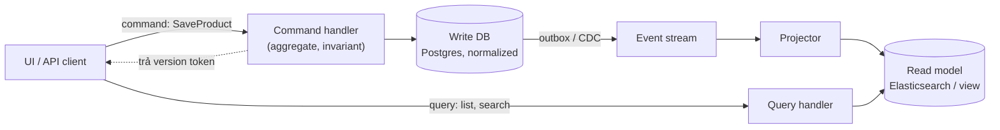
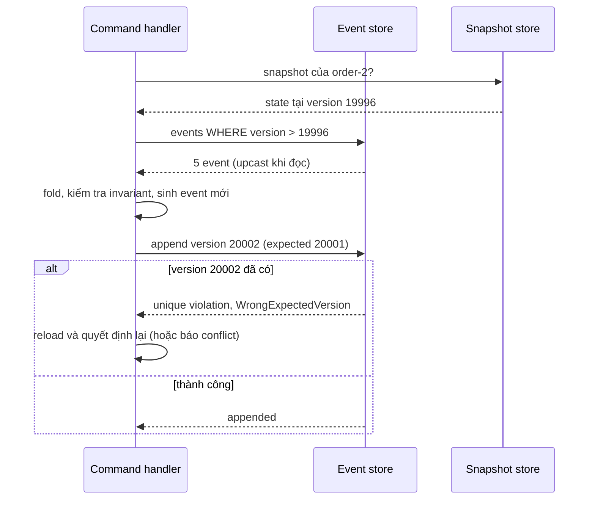

## Bối cảnh & vấn đề

Hai yêu cầu đến cùng tuần ở một sàn thương mại điện tử.

Team catalog: trang danh sách sản phẩm cần lọc theo 15 thuộc tính, full-text search tiếng Việt, facet đếm theo thương hiệu, và chịu 5.000 request/giây, trong khi bảng `products` được normalize thành 9 bảng phục vụ màn hình chỉnh sửa của seller. Mỗi query đọc join 9 bảng, và mọi index thêm vào để đọc nhanh lại làm ghi chậm đi.

Team kho: product owner muốn "lịch sử đầy đủ mọi lần điều chỉnh tồn kho, ai làm, khi nào, và nút undo". Một dev đề xuất: "chuyển cả platform sang Event Sourcing, như vậy có audit và undo miễn phí".

Yêu cầu thứ nhất là bài toán kinh điển của **CQRS** (Command Query Responsibility Segregation): **shape** của dữ liệu khi ghi và khi đọc khác nhau quá xa. Yêu cầu thứ hai **nghe** giống **Event Sourcing**, nhưng nhu cầu thật ("audit + undo") có lời giải rẻ hơn nhiều. Bài này giải thích cả hai pattern, phần khó mà tutorial bỏ qua, và cách phân biệt nhu cầu nghiệp vụ với giải pháp kỹ thuật hấp dẫn. Nền tảng: aggregate và domain event ([bài 9](/tracks/design-patterns/learn/ddd-tactical)), outbox ([bài 10](/tracks/design-patterns/learn/repository-uow-outbox)).

## Khái niệm

### CQRS

**CQRS** tách **model ghi** (command side) và **model đọc** (query side). Model ghi nhận command (`ChangePrice`), load aggregate, kiểm tra invariant, lưu ở dạng **normalized** tối ưu cho tính đúng. Model đọc là một hoặc nhiều **read model** (projection) **denormalized**, có shape đúng màn hình: một document Elasticsearch cho trang tìm kiếm, một bảng phẳng `product_list_view` cho admin, một Redis hash cho trang chi tiết. Read model được cập nhật từ thay đổi bên ghi, thường qua event (outbox/CDC).

CQRS có nhiều mức độ:

1. **Tách code**: cùng database, nhưng query đi qua query service trả DTO (không đi qua repository/aggregate). Đây là mức nhẹ nhất và hầu như luôn hợp lý.
2. **Tách bảng/view**: cùng database, read model là bảng denormalized hoặc materialized view, cập nhật trong cùng transaction hoặc bằng trigger/job.
3. **Tách store**: write ở Postgres, read ở Elasticsearch/Redis/document DB, đồng bộ bất đồng bộ qua event. Mạnh nhất, đắt nhất.

CQRS giải các vấn đề: read/write shape rất khác nhau, tải đọc gấp nhiều lần ghi (scale đọc độc lập), cần khả năng mà write DB làm kém (full-text, facet, geo). Chi phí: **eventual consistency** (read model trễ so với write), pipeline đồng bộ phải monitor (lag, lỗi, dead letter), khả năng **rebuild** projection khi đổi schema hoặc khi bị hỏng, và **hai model** để bảo trì.

Fowler nhấn mạnh: CQRS thường chỉ hợp cho **một số bounded context** cụ thể, không cho cả hệ thống, và CQRS **không bắt buộc** Event Sourcing (ngược lại thì ES gần như luôn cần CQRS, vì query trực tiếp trên event log rất khó).

**Interview angle:** câu push-back: domain CRUD, read và write cùng shape, team nhỏ thì không cần CQRS mức 3. Follow-up kinh điển: "user lưu sản phẩm mà trang danh sách 2 giây sau mới thấy, làm gì?" (xem phần Cơ chế).

### Event Sourcing

**Event Sourcing** (ES): thay vì lưu **state hiện tại** (row `orders` với `status = paid`), lưu **chuỗi event bất biến** đã xảy ra với aggregate (`OrderPlaced`, `ItemAdded`, `OrderPaid`). State hiện tại là **fold** (reduce) của chuỗi event: `events.reduce(apply, initial)`. Mỗi aggregate là một **stream**; event được **append**, không bao giờ update hay delete.

Lợi ích: **audit log hoàn chỉnh** theo nghĩa đen (log chính là nguồn sự thật, không thể "quên ghi audit"), **time travel** (state tại thời điểm bất kỳ), **rebuild projection mới** từ toàn bộ lịch sử (một báo cáo mới có ngay dữ liệu 3 năm), và debug bằng replay.

### Những phần khó mà tutorial bỏ qua

- **Expected version (optimistic concurrency trên stream)**: hai writer cùng load stream ở version 2 và cùng append event version 3. Phải có một ràng buộc chỉ cho một bên thắng: unique key `(stream_id, version)` trong Postgres, hoặc API `expectedRevision` của event store chuyên dụng. Bên thua reload và quyết định lại.
- **Schema evolution**: event cũ nằm trong log **mãi mãi** và code mới phải đọc được chúng. Kỹ thuật: version trong event (`v: 1`), **upcaster** chuyển event cũ sang shape mới khi đọc, thêm field có default thay vì đổi nghĩa field, và tuyệt đối không "sửa" event đã lưu. Greg Young viết cả một cuốn sách về chủ đề này.
- **Snapshot**: stream dài (20.000 event) thì mỗi lần load phải fold 20.000 event. Snapshot lưu state tại version N; load = snapshot + event sau N. Snapshot là **cache**, có thể xoá và tính lại; khi code `apply` đổi, snapshot cũ phải bị vô hiệu.
- **Query ad-hoc**: "các đơn chưa thanh toán trên 3 ngày" không query được trên event log; mọi câu hỏi cần một projection. Đó là lý do ES đi kèm CQRS.
- **GDPR / quyền được xoá**: log bất biến chứa PII. Cách chuẩn là **crypto-shredding**: mã hoá PII bằng một key riêng cho mỗi người dùng, lưu key ở chỗ khác; xoá key thì dữ liệu trong log không còn đọc được, log vẫn nguyên vẹn. Hoặc không đưa PII vào event (chỉ id tham chiếu tới store có thể xoá).
- **Projection lag và rebuild**: projection bất đồng bộ luôn trễ; rebuild từ đầu một stream hàng trăm triệu event mất hàng giờ, cần chạy song song với bản cũ rồi chuyển.
- **Debugging và tooling**: "tại sao state sai?" trở thành "event nào, theo thứ tự nào, qua phiên bản `apply` nào". Team cần tool xem stream, replay, và kinh nghiệm.

**Interview angle:** câu hỏi "phần khó tutorial bỏ qua là gì?" đo kinh nghiệm thật. Nêu được ba trong các ý trên (versioning, snapshot, GDPR, concurrency) kèm cách xử lý là tín hiệu tốt.

### Audit log, ledger và Event Sourcing

Ba thứ hay bị nhầm:

- **Audit log**: bảng phụ ghi "ai đổi gì, khi nào" bên cạnh state. State vẫn là nguồn sự thật; audit có thể thiếu nếu ai đó quên ghi (giảm thiểu bằng trigger).
- **Ledger** (sổ cái, ví dụ `inventory_movements`): bảng **append-only** các movement (+50 nhập kho, −8 điều chỉnh), **cùng transaction** với cập nhật state tổng hợp (`stock.on_hand`). Invariant: `on_hand = sum(delta)`. Đây là cách kế toán làm từ hàng trăm năm, và nó cho audit + "undo" (bằng **compensating movement**) mà không cần ES.
- **Event Sourcing**: event là **nguồn sự thật duy nhất**, state chỉ là projection.

"Undo" trong cả ledger lẫn ES **không phải xoá lịch sử**: nó là một bút toán ngược (`undo #2: +8`) có người thực hiện và lý do. Xoá row là mất audit.

## Cơ chế hoạt động

Luồng CQRS mức 3: command đi vào write model, thay đổi được đẩy qua outbox tới projector, projector cập nhật read model; query đọc thẳng read model:



Khoảng thời gian từ COMMIT ở write DB tới lúc read model phản ánh thay đổi là **projection lag**: thường vài chục ms tới vài giây, và có thể lên phút khi projector lỗi hoặc backlog. Các lựa chọn khi người dùng "lưu xong không thấy":

1. **Trả dữ liệu vừa ghi** trong response của command; UI hiển thị nó (optimistic UI) thay vì đọc lại list.
2. **Version token**: command trả `version`; query (hoặc UI) chờ tới khi read model đạt version đó, có timeout (ví dụ chạy thật ở dưới).
3. **Đọc từ write model** cho màn hình "vừa sửa xong" (trang chi tiết sau khi lưu), read model cho list/search.
4. **Báo cho người dùng**: "Thay đổi sẽ xuất hiện trong vài giây", kèm trạng thái đang đồng bộ.
5. Nếu read-after-write là bắt buộc ở mọi nơi: có thể CQRS mức 3 không hợp với màn hình đó; dùng mức 2 (read table cập nhật cùng transaction).

Với Event Sourcing, load và append một aggregate:



Ba chi tiết: snapshot chỉ là tối ưu (thiếu nó thì fold từ đầu, kết quả phải giống hệt); **upcaster** chạy ở bước đọc nên code `apply` chỉ biết shape mới nhất; expected version là cơ chế duy nhất chống lost update, vì append-only không có `UPDATE ... WHERE version`.

## Ví dụ thực tế

### Event store trên Postgres: upcaster và expected version

Chạy với PostgreSQL 17.11, `pg` 8.23, tsx 4.23. Event store tối giản là một bảng với primary key `(stream_id, version)`:

```sql
CREATE TABLE events (stream_id text, version int, type text NOT NULL, data jsonb NOT NULL,
                     at timestamptz DEFAULT now(), PRIMARY KEY (stream_id, version));
```

```ts
type OrderEvent =
  | { type: "OrderPlaced"; v: 1; total: number }                       // v1: total in VND, no currency
  | { type: "OrderPlaced"; v: 2; total: { minor: number; currency: string } }
  | { type: "ItemAdded"; v: 1; sku: string; price: number }
  | { type: "OrderPaid"; v: 1; paidAt: string };

const upcast = (e: any): OrderEvent => e.type === "OrderPlaced" && e.v === 1 ? { type: "OrderPlaced", v: 2, total: { minor: e.total, currency: "VND" } } : e;
const apply = (s: OrderState, raw: OrderEvent): OrderState => {
  const e = upcast(raw);
  switch (e.type) {
    case "OrderPlaced": return e.v === 2 ? { ...s, status: "pending", total: e.total.minor, currency: e.total.currency } : s;
    case "ItemAdded": return { ...s, total: s.total + e.price, items: s.items + 1 };
    case "OrderPaid": return { ...s, status: "paid" };
  }
};
async function append(stream: string, expectedVersion: number, evts: OrderEvent[]) {
  // BEGIN; INSERT mỗi event với version = expectedVersion + i + 1; COMMIT
  // lỗi 23505 (unique_violation) => WrongExpectedVersion
}
await append("order-1", 0, [{ type: "OrderPlaced", v: 1, total: 100_000 }]);   // event cũ, schema v1
await append("order-1", 1, [{ type: "ItemAdded", v: 1, sku: "B", price: 25_000 }]);
// hai writer cùng expected version 2
await Promise.all([append("order-1", 2, [paid]), append("order-1", 2, [itemC])]);
```

```text
rebuilt with upcaster: {
  state: { status: 'pending', total: 125000, currency: 'VND', items: 1 },
  version: 2
}
[ 'appended', 'WrongExpectedVersion (expected 2)' ]
after race: {
  state: { status: 'paid', total: 125000, currency: 'VND', items: 1 },
  version: 3
}
```

Event `OrderPlaced` v1 (không có currency) vẫn được đọc nhờ upcaster, code `apply` chỉ xử lý v2. Hai writer cùng append version 3: primary key cho một bên thắng, bên kia nhận `WrongExpectedVersion` và phải reload (state đã `paid`, có thể không còn được thêm item nữa: quyết định lại là đúng, không phải retry mù).

### Snapshot

Stream `order-2` có 20.001 event. Snapshot tại version 19.996, được tính bởi job nền bằng cách fold các event tới đó:

```ts
const { rows: head } = await pool.query("SELECT data FROM events WHERE stream_id='order-2' AND version <= $1 ORDER BY version", [full.version - 5]);
await pool.query("INSERT INTO snapshots VALUES ('order-2', $1, $2)", [full.version - 5, head.reduce((s, r) => apply(s, r.data), initial)]);
// load = snapshot + events after it
```

```text
full replay 20001 events: 45ms | snapshot + 5 events: 4.6ms | same state: true
```

Fold toàn bộ mất 45 ms (một aggregate, một request); snapshot + 5 event mất vài ms. Một gotcha gặp khi chạy: so sánh bằng `JSON.stringify` cho kết quả **false** dù state giống nhau, vì `jsonb` của Postgres **không giữ thứ tự key** (docs: jsonb lưu ở dạng đã phân rã, không bảo toàn thứ tự). Dùng so sánh sâu (`util.isDeepStrictEqual`), và đừng dựa vào thứ tự key của jsonb cho hash hay checksum.

### Crypto-shredding cho GDPR

```ts
const keys = new Map<string, Buffer>([["cust-9", randomBytes(32)]]);           // key store riêng, có thể xoá
const enc = (cust: string, s: string) => { /* AES-256-GCM với key của khách */ };
const dec = (cust: string, blob: string) => { const k = keys.get(cust); if (!k) return "<shredded>"; /* ... */ };
const stored = { type: "CustomerRegistered", customerId: "cust-9", email: enc("cust-9", "lan@example.com") };
console.log("before erasure:", dec("cust-9", stored.email));
keys.delete("cust-9");
console.log("after key deletion:", dec("cust-9", stored.email), "| event still in log:", stored.type);
```

```text
before erasure: lan@example.com
after key deletion: <shredded> | event still in log: CustomerRegistered
```

Log không bị sửa, nhưng PII không còn đọc được. Lưu ý: key store phải thật sự xoá được (và có backup policy tương ứng), projection đã giải mã PII ra chỗ khác cũng phải được xoá, và đánh giá pháp lý (crypto-shredding có được chấp nhận như "xoá" không) là việc của legal, không phải của dev (verify với tư vấn pháp lý).

### Read-after-write với version token

Mô phỏng projector chạy mỗi 300 ms:

```ts
function saveProduct(id: string, name: string, price: number) {          // command side
  const version = (writeDb.get(id)?.version ?? 0) + 1;
  writeDb.set(id, { name, price, version }); queue.push({ id, version });
  return { id, version };                                                // return the version token
}
async function waitForVersion(id: string, v: number, timeoutMs = 2000) {
  const t0 = Date.now();
  while ((readModel.get(id)?.version ?? 0) < v) { if (Date.now() - t0 > timeoutMs) return false; await new Promise((r) => setTimeout(r, 20)); }
  return true;
}
```

```text
t=0    list page: []
t=343ms list page: [ 'Áo thun 199.000 ₫' ]
```

Đọc ngay sau khi lưu: danh sách rỗng, đúng triệu chứng "lưu xong không thấy". Chờ theo version token: thấy sau 343 ms. Trong hệ thật, version token có thể là LSN của Postgres, offset Kafka, hoặc version của aggregate, và `waitForVersion` nằm ở query API (header `X-Min-Version`) với timeout rõ ràng.

### Ledger tồn kho thay cho Event Sourcing toàn platform

Yêu cầu "audit + undo cho điều chỉnh tồn kho", giải bằng ledger:

```sql
CREATE TABLE stock (sku text PRIMARY KEY, on_hand int NOT NULL CHECK (on_hand >= 0));
CREATE TABLE inventory_movements (id bigserial PRIMARY KEY, sku text REFERENCES stock, delta int NOT NULL CHECK (delta <> 0),
  reason text NOT NULL, actor text NOT NULL, reverses bigint REFERENCES inventory_movements, at timestamptz DEFAULT now());
CREATE UNIQUE INDEX one_reversal_per_movement ON inventory_movements(reverses) WHERE reverses IS NOT NULL;
```

```ts
async function move(sku: string, delta: number, reason: string, actor: string, reverses?: number) {
  // BEGIN
  // INSERT inventory_movements(...) ; UPDATE stock SET on_hand = on_hand + delta   (cùng transaction)
  // COMMIT, hoặc ROLLBACK khi CHECK (23514) / unique (23505) vi phạm
}
const undo = async (id: number, actor: string) => { /* move(sku, -delta, `undo #${id}`, actor, id) */ };
await move("SKU-1", 50, "receive PO-77", "lan");
await move("SKU-1", -8, "stocktake adjustment", "minh");
await move("SKU-1", -100, "bad scan", "minh");
await undo(2, "lan"); await undo(2, "lan");
```

```text
movement #1
movement #2
rejected (stock would go negative)
movement #4 | rejected (already reversed)
[
  {
    id: '1',
    delta: 50,
    reason: 'receive PO-77',
    actor: 'lan',
    reverses: null
  },
  {
    id: '2',
    delta: -8,
    reason: 'stocktake adjustment',
    actor: 'minh',
    reverses: null
  },
  { id: '4', delta: 8, reason: 'undo #2', actor: 'lan', reverses: '2' }
]
stock vs sum(movements): { on_hand: 50, sum_movements: 50 }
```

Mọi yêu cầu được đáp ứng: lịch sử đầy đủ (ai, khi nào, lý do), undo là compensating movement có người thực hiện, undo hai lần bị chặn bởi unique index, tồn kho không âm nhờ CHECK, và `on_hand = sum(delta)` vì hai thao tác nằm cùng transaction (id 3 bị nhảy vì sequence không rollback, chuyện bình thường). Đây là cách trả lời đề xuất "Event Sourcing cho cả platform": tách **nhu cầu** (audit, undo) khỏi **giải pháp** (ES), giải nhu cầu bằng ledger; nếu sau đó inventory thật sự cần ES (rebuild nhiều projection, time travel phức tạp), giới hạn ES trong **bounded context inventory**, có spike với tiêu chí thành công đo được và một ADR.

## Trade-offs & lựa chọn thay thế

| Lựa chọn | Được | Mất | Khi KHÔNG dùng |
| --- | --- | --- | --- |
| Một model CRUD | Đơn giản, read-after-write tự nhiên | Read và write tranh index, shape | Read shape khác hẳn write, tải đọc cực lớn |
| CQRS mức 1–2 (query service, view) | Query tối ưu, vẫn một DB | Hai đường code | Hầu như luôn đáng ở mức 1 |
| CQRS mức 3 (store riêng) | Scale đọc, search/facet, read model tối ưu | Eventual consistency, pipeline, rebuild | Domain đơn giản, team nhỏ, read = write shape |
| Audit table / trigger | Rẻ, ai cũng hiểu | Có thể thiếu, không là nguồn sự thật | Khi cần time travel và rebuild projection |
| Ledger append-only | Audit + compensating undo + invariant tổng | Chỉ hợp dữ liệu dạng movement | Khi state không phải tổng các delta |
| Event Sourcing | Audit tuyệt đối, time travel, projection mới từ lịch sử | Versioning, snapshot, GDPR, query khó, tooling, học khó | Hầu hết CRUD; team chưa có kinh nghiệm; toàn platform |

Chọn thế nào: CQRS mức 1 (query service riêng cho đọc) gần như luôn đúng. Lên mức 3 chỉ cho context có tải đọc/khả năng search thật sự cần, và thiết kế UX cho projection lag ngay từ đầu. Event Sourcing chỉ cho một bounded context mà **lịch sử là nghiệp vụ** (sổ cái tài chính, workflow pháp lý cần time travel, domain mà replay tạo giá trị), và khi team sẵn sàng trả chi phí versioning. Với "chúng tôi cần audit", bắt đầu bằng audit table hoặc ledger.

## Edge cases & failure modes

- **Projector chết lặng lẽ**: read model ngừng cập nhật, không ai biết cho tới khi khách phàn nàn. Monitor lag (thời gian của event cũ nhất chưa xử lý) và alert.
- **Projector không idempotent**: event giao lại (at-least-once) cộng số lần hai. Projector ghi theo version (`UPDATE ... WHERE version < $v`) hoặc dedupe theo event id.
- **Event đến sai thứ tự**: `PriceChanged` v5 đến trước v4; projector ghi đè giá mới bằng giá cũ. So version trước khi áp dụng.
- **Rebuild projection trong giờ cao điểm**: replay 200 triệu event làm nghẽn DB. Rebuild vào bảng/index mới song song, chuyển alias khi xong (như reindex Elasticsearch).
- **Đổi nghĩa field của event**: `total` từ "đã gồm VAT" sang "chưa gồm VAT" mà không đổi version. Mọi projection tính sai lịch sử. Event mới, version mới, upcaster rõ ràng.
- **Snapshot cũ sau khi đổi `apply`**: snapshot được tính bằng logic cũ, state sai. Version hoá snapshot theo phiên bản logic; vô hiệu khi đổi.
- **PII trong event không mã hoá**: yêu cầu xoá theo GDPR buộc phải sửa log bất biến (phá audit) hoặc vi phạm luật. Thiết kế crypto-shredding hoặc loại PII ra khỏi event từ đầu.
- **Ledger cập nhật state ngoài transaction**: insert movement thành công, update stock lỗi; `on_hand` lệch `sum(delta)` vĩnh viễn. Luôn cùng transaction, và có job đối soát.

## Pitfalls

- ❌ CQRS cho cả hệ thống → ✅ cho bounded context có read/write shape khác nhau thật; mức 1 (query service) cho phần còn lại.
- ❌ "CQRS nghĩa là phải Event Sourcing" → ✅ CQRS độc lập với ES; read model có thể cập nhật từ outbox/CDC của state thường.
- ❌ Bỏ qua projection lag trong UX → ✅ trả dữ liệu vừa ghi, version token, hoặc đọc write model cho màn hình vừa sửa.
- ❌ Sửa event đã lưu khi đổi schema → ✅ version trong event + upcaster khi đọc; event là bất biến.
- ❌ Append không có expected version → ✅ unique `(stream_id, version)` hoặc `expectedRevision`; bên thua reload và quyết định lại.
- ❌ PII trong event plain text → ✅ crypto-shredding với key theo người dùng, hoặc chỉ lưu id tham chiếu.
- ❌ "Undo" bằng cách xoá event/row → ✅ compensating event/movement có actor và lý do.
- ❌ Event Sourcing để có audit log → ✅ audit table hoặc ledger trước; ES chỉ khi lịch sử là nghiệp vụ và team sẵn sàng.

## Tóm tắt

- CQRS tách write model (invariant, normalized) và read model (denormalized, đúng màn hình); có ba mức, mức 1 gần như luôn hợp lý, mức 3 đắt.
- Chi phí chính của CQRS bất đồng bộ là projection lag; xử lý bằng trả dữ liệu vừa ghi, version token, hoặc đọc write model.
- Event Sourcing: state = fold của event bất biến; lợi ích là audit, time travel, rebuild projection.
- Phần khó: expected version (unique key), schema evolution (version + upcaster), snapshot (là cache), query cần projection, GDPR (crypto-shredding), lag và tooling.
- CQRS không bắt buộc ES; ES gần như luôn cần CQRS.
- "Audit + undo" thường giải bằng ledger append-only cùng transaction với state tổng và compensating movement; ES chỉ cho một bounded context có lý do rõ.
