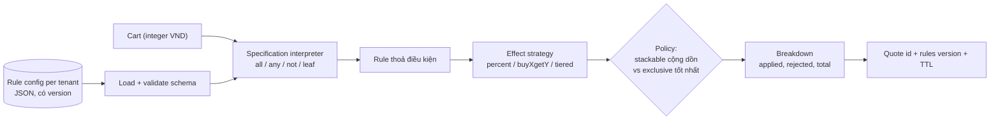
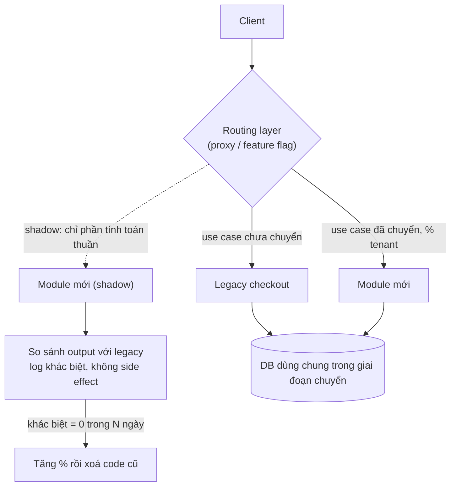

## Bối cảnh & vấn đề

Ba tình huống senior thường được hỏi, đều đến từ cùng một kiểu codebase SaaS sáu năm tuổi:

1. Code có `if (tenant.plan === 'enterprise')` ở **40 chỗ**. Thêm gói "edu" mất hai tuần và gây ba bug: SSO bật ở chỗ này nhưng không ở chỗ kia, giới hạn seat sai, một endpoint export bị lộ cho gói free.
2. Marketing muốn một **promotion engine**: giảm phần trăm, mua 2 tặng 1, giảm theo bậc, rule khác nhau theo tenant, tự cấu hình không cần deploy. Hiện tại mỗi khuyến mãi là một PR thêm `if` vào `calculateTotal()`.
3. Module checkout **4.000 dòng mỗi file, không có test**, mang về phần lớn doanh thu. Mỗi lần sửa ai cũng sợ. Một người đề xuất "viết lại từ đầu thành service mới".

Bài cuối của track ghép các pattern đã học thành **thiết kế thật**: nhận diện anti-pattern, gom quyết định về một chỗ (Entitlements), mở rộng có kiểm soát (Strategy + Specification, Adapter + Registry), và thay đổi code đang chạy mà không làm vỡ doanh thu (characterization test, seam, Strangler Fig). Phần cuối nói về con người: đưa design principle vào team mà không biến code review thành "pattern police".

## Khái niệm

### Anti-pattern hay gặp trong backend Node/TS

**Anti-pattern** là một giải pháp **trông hợp lý** nhưng thường xuyên gây hại nhiều hơn lợi. Danh sách hay gặp, kèm cách phát hiện:

- **God object / god service**: `OrderService` 3.000 dòng, 60 method, bị sửa trong mọi sprint. Phát hiện: kích thước file + **churn** (số commit chạm file), số actor khác nhau yêu cầu thay đổi (SRP, [bài 2](/tracks/design-patterns/learn/solid-srp-ocp-lsp)).
- **Anemic model lẫn transaction script**: rule copy ở nhiều service, trạng thái không hợp lệ trong DB ([bài 9](/tracks/design-patterns/learn/ddd-tactical)).
- **Premature abstraction / speculative generality**: interface chỉ một implementation, flag cấu hình không ai bật, generic `Repository<T>`. Phát hiện: "find implementations" trả 1 kết quả; tham số luôn nhận cùng giá trị.
- **Golden hammer**: mọi vấn đề đều giải bằng công cụ quen tay (mọi thứ qua Kafka, mọi thứ cache Redis, mọi thứ là microservice).
- **Distributed monolith**: nhiều service nhưng phải deploy cùng nhau, gọi đồng bộ thành chuỗi, chung database. Có chi phí của distributed system mà không có lợi ích.
- **Shotgun surgery**: một thay đổi nghiệp vụ phải sửa 12 file rải rác (40 chỗ check plan). Phát hiện: các file luôn thay đổi **cùng nhau** trong commit (change coupling).
- **Primitive obsession**: `string` cho tiền, id, email, mã tiền tệ. Bug thật: truyền `customerId` vào chỗ cần `orderId` (cùng là `string`), cộng VND với USD, tính tiền bằng float.
- **Magic container wiring**: DI container auto-scan, provider đăng ký ngầm, không ai biết class nào được inject ở đâu.
- **Catch-and-ignore**: `catch {}` hoặc `catch (e) { console.log(e) }` nuốt lỗi, hệ thống tiếp tục với state sai.

Công cụ phát hiện có hệ thống: **hotspot analysis** (Adam Tornhill): file có churn cao **và** complexity cao là nơi đáng refactor nhất; file phức tạp nhưng không ai sửa thì cứ để yên. Thêm: coupling metrics, cycle detection ([bài 3](/tracks/design-patterns/learn/isp-dip-dependency-injection), [bài 8](/tracks/design-patterns/learn/hexagonal-clean-architecture)), và review checklist ngắn.

```bash
# minh hoạ: top file theo số commit trong 12 tháng (churn)
git log --since="12 months ago" --format= --name-only -- src | sort | uniq -c | sort -rn | head -20
```

**Branded type** chữa primitive obsession ở mức type mà không tốn runtime: `type OrderId = string & { readonly __brand: 'OrderId' }`. Hai id cùng là `string` lúc runtime nhưng khác type lúc compile; một constructor function (`OrderId(s)`) là chỗ duy nhất validate và "đóng dấu".

### Entitlements: thay câu hỏi "gói nào" bằng "được làm gì"

Bốn mươi chỗ `if (plan === 'enterprise')` là **shotgun surgery** cộng **một khái niệm domain bị thiếu**: **entitlements** (quyền lợi theo gói). Caller không thật sự quan tâm tenant dùng gói gì; nó quan tâm "tenant này **được dùng SSO không**", "**tối đa bao nhiêu seat**". Khi câu hỏi là tên gói, mọi gói mới buộc sửa mọi chỗ.

Refactor: gom quyết định về **một chỗ**. `entitlementsFor(tenant)` trả `{ features: Set<Feature>, maxSeats, apiRatePerMin }`, tính từ **bảng mặc định theo plan** cộng **override theo tenant** (deal của sales). Caller hỏi capability: `ent.features.has('sso')`. Bảng `Record<Plan, Entitlements>` buộc compiler đòi một dòng cho plan mới. Bước sau: lưu bảng này dạng **data** (DB, feature-flag service) để thêm plan không cần deploy.

Khi hành vi **khác nhau thật** theo plan (không chỉ bật/tắt), ví dụ cách tính hoá đơn, dùng **Replace Conditional with Polymorphism**: một Strategy `BillingCalculator` theo plan ([bài 6](/tracks/design-patterns/learn/behavioral-strategy-command-state)).

Entitlements khác **RBAC**: entitlements trả lời "**tenant** này đã mua tính năng gì", RBAC trả lời "**user** này trong tenant có quyền làm gì". Một thao tác thường cần **cả hai**: tenant có `bulk-import` **và** user có role `admin`. Hai check, hai nguồn dữ liệu, thường gộp trong một policy function ở biên.

### Specification

**Specification** (Evans & Fowler): đóng gói một **điều kiện nghiệp vụ** thành object có `isSatisfiedBy(candidate)`, và cho phép **ghép** bằng `and`, `or`, `not`. Nó là Composite ([bài 5](/tracks/design-patterns/learn/structural-patterns#sec-composite-bridge-flyweight-ngan-gon)) áp dụng cho boolean logic. Trong promotion engine, điều kiện "khách VIP **và** giỏ ≥ 500k **và không** dùng coupon khác" là một cây specification.

Khi specification là **dữ liệu** (JSON: `{ all: [{ tier: 'vip' }, { subtotalAtLeast: 500000 }] }`) cộng một **interpreter**, marketing có thể cấu hình rule qua UI, rule lưu per tenant, có version. Giới hạn quan trọng: giữ ngôn ngữ rule **nhỏ và không Turing-complete** (không vòng lặp, không biến, không gọi hàm tuỳ ý). Khi yêu cầu bắt đầu đòi "nếu… thì đặt biến… rồi lặp…", đó là lúc cân nhắc rule engine có sẵn, thay vì tự viết một ngôn ngữ lập trình tồi.

### Promotion engine: các nguyên tắc thiết kế

- **Rule = Specification (điều kiện) + Effect (Strategy tính số tiền giảm)**: `percent`, `buyXgetY`, `tiered` là các strategy, chọn theo `kind`.
- **Thứ tự và loại trừ là dữ liệu**: `priority`, `stackable`; chính sách kết hợp ("best discount wins": rule độc quyền tốt nhất so với tổng các rule cộng dồn) là một quyết định nghiệp vụ được viết rõ.
- **Pure function**: `price(cart, rules) → breakdown`. Không I/O, không đọc giờ hệ thống (truyền `now` vào). Nhờ vậy test bằng bảng input/output, và **giải thích được**: breakdown liệt kê rule nào áp dụng, bao nhiêu, rule nào bị loại. Câu hỏi "tại sao tôi được giảm 50k?" có câu trả lời.
- **Tiền là integer minor unit**, rounding policy rõ (floor ở đâu), tổng giảm không vượt subtotal.
- **Giá ở giỏ bằng giá lúc thanh toán**: rule đổi giữa hai thời điểm. Cách xử lý: **quote** có id, version của bộ rule và thời hạn; checkout charge theo quote nếu còn hạn, hoặc tính lại và **báo cho khách** nếu khác.

### Payment provider plug-in

Mục tiêu: thêm provider (Stripe, ví điện tử nội địa, COD, chuyển khoản) **không sửa checkout**.

- **Port theo capability** (ISP/LSP, [bài 2](/tracks/design-patterns/learn/solid-srp-ocp-lsp), [bài 3](/tracks/design-patterns/learn/isp-dip-dependency-injection)): `start()`, `parseWebhook()` là bắt buộc; `refund`, `partial_refund`, `capture_later` là **capability khai báo**, checkout kiểm tra trước khi dùng. COD không giả vờ refund được.
- **Mỗi provider là một Adapter + anti-corruption mapping** ([bài 5](/tracks/design-patterns/learn/structural-patterns)): trạng thái riêng của provider map về state machine chung `pending → authorized → captured | failed → refunded`.
- **Registry/Factory chọn provider** theo tenant, quốc gia, phương thức; cấu hình ở DB.
- **"Next action" là discriminated union**: redirect (3DS, app ví), hiển thị QR, thu khi giao hàng, hoặc không gì cả. Đừng ép các flow khác hẳn nhau vào một method trả `string url`; union + exhaustive `switch` buộc UI xử lý mọi trường hợp.
- **Webhook**: verify chữ ký, **idempotent theo provider event id** (provider retry), chịu được **out-of-order** (event cũ đến sau event mới không được kéo state lùi), trả 2xx nhanh rồi xử lý nền.
- **Idempotency khi gọi provider**: gửi idempotency key (Stripe hỗ trợ header `Idempotency-Key`) để retry không charge hai lần.
- **Contract test chung** chạy trên mọi adapter (sandbox), giống [bài 2](/tracks/design-patterns/learn/solid-srp-ocp-lsp#sec-co-che-hoat-dong).

### Refactor legacy an toàn

Michael Feathers định nghĩa legacy code là **code không có test**. Quy trình an toàn cho module checkout 4.000 dòng:

1. **Characterization test** (golden master) trước tiên: ghi lại hành vi **hiện tại**, kể cả bug, ở biên (HTTP/API hoặc function công khai), với input thật đã ẩn danh hoặc sinh tổ hợp. Mục tiêu không phải chứng minh code đúng, mà phát hiện khi refactor làm **thay đổi** hành vi.
2. **Tìm seam**: chỗ có thể thay hành vi mà không sửa code tại đó (Feathers): tách I/O ra function, truyền dependency qua tham số, wrap global. Seam là chỗ đặt test double và chỗ cắt module.
3. **Refactor nhỏ, merge thường xuyên**, mỗi bước có thể rollback; **không** refactor cùng lúc đổi hành vi (hai PR riêng).
4. **Strangler Fig** (Fowler): dựng phần mới **bên cạnh** phần cũ, chuyển dần từng use case qua một điểm định tuyến (proxy, feature flag), chạy song song và so sánh, rồi xoá phần cũ. Cây "strangler fig" mọc quanh cây chủ và thay thế nó dần.
5. **Đo** error rate, conversion, latency theo từng bước chuyển.

**Big-bang rewrite** là red flag: nó đánh cược toàn bộ kiến thức ẩn trong code cũ (các quirk nghiệp vụ không ai ghi lại) vào một lần chuyển, và thường kéo dài hơn dự kiến trong khi code cũ vẫn phải được bảo trì song song.

So sánh cũ/mới ở production **mà không charge khách hai lần**: chạy **shadow** chỉ cho phần **tính toán thuần** (giá, phí ship, thuế): đường cũ phục vụ khách, đường mới tính song song, so sánh và log khác biệt, không có side effect. Phần có side effect (charge, gửi email) chỉ chạy ở một đường, chuyển bằng feature flag theo phần trăm tenant, có rollback nhanh.

### Đưa design principle vào team

- **Nói bằng vấn đề, không bằng tên pattern**: "thêm provider phải sửa 5 file và đã gây 2 incident" thuyết phục hơn "phải dùng Strategy".
- **Tài liệu ngắn và cụ thể**: ADR cho quyết định lớn (bối cảnh, lựa chọn, hệ quả), ví dụ good/bad lấy từ **chính codebase**, template module.
- **Tự động hoá phần cơ học**: lint boundaries, cycle detection, complexity threshold trong CI, để review tập trung vào design thay vì tranh luận style.
- **Pair/mob trên refactor thật**, tech talk ngắn sau incident ("bug này xảy ra vì…").
- **Chấp nhận "good enough"** với code ít thay đổi; đầu tư vào **hotspot**.
- Khi phản biện abstraction của một senior khác: dựa trên dữ liệu (số implementation thật, tần suất thay đổi, chi phí đọc), đề xuất thử nghiệm có thời hạn, và sẵn sàng đổi ý.

## Cơ chế hoạt động

Promotion engine dạng pipeline thuần: rule là dữ liệu của tenant, interpreter đánh giá specification, strategy tính số tiền, chính sách kết hợp chọn kết quả, breakdown giải thích:



Mỗi hộp là một function thuần hoặc dữ liệu, nên mỗi bước test riêng được. `Quote` ở cuối giải bài toán "giá ở giỏ khác giá lúc thanh toán": checkout charge theo quote (rules version cố định) nếu còn hạn.

Strangler Fig cho module checkout, theo thời gian:



Điểm định tuyến là seam lớn nhất: nó quyết định mỗi request đi đường nào, cho phép chuyển từng use case (tính phí ship trước, rồi tính giá, rồi tạo đơn) và rollback bằng một flag. Shadow chỉ chạy phần không có side effect; phần charge tiền đi đúng một đường tại một thời điểm.

## Ví dụ thực tế

### Promotion engine: Specification dạng dữ liệu + Strategy

Chạy với tsx 4.23 / Node 24.21. Rule được load từ JSON (giả lập cấu hình tenant trong DB):

```ts
type Spec =
  | { all: Spec[] } | { any: Spec[] } | { not: Spec }
  | { subtotalAtLeast: number } | { tier: "regular" | "vip" } | { coupon: string } | { hasCategory: string; minQty?: number };
type Effect =
  | { kind: "percent"; pct: number; maxOff?: number }
  | { kind: "buyXgetY"; sku: string; buy: number; free: number }
  | { kind: "tiered"; tiers: { from: number; off: number }[] };
type Rule = { id: string; v: 1; when: Spec; then: Effect; stackable: boolean; priority: number };

const sat = (s: Spec, c: Cart): boolean =>
  "all" in s ? s.all.every((x) => sat(x, c)) : "any" in s ? s.any.some((x) => sat(x, c)) : "not" in s ? !sat(s.not, c)
  : "subtotalAtLeast" in s ? subtotal(c) >= s.subtotalAtLeast : "tier" in s ? c.customerTier === s.tier
  : "coupon" in s ? c.coupon === s.coupon : c.lines.some((l) => l.category === s.hasCategory && l.qty >= (s.minQty ?? 1));
const amount = (e: Effect, c: Cart): number => {
  switch (e.kind) {
    case "percent": { const off = Math.floor((subtotal(c) * e.pct) / 100); return e.maxOff ? Math.min(off, e.maxOff) : off; }  // rounding policy: floor
    case "buyXgetY": { const l = c.lines.find((x) => x.sku === e.sku); if (!l) return 0; return Math.floor(l.qty / (e.buy + e.free)) * e.free * l.unitPrice; }
    case "tiered": { const st = subtotal(c); return [...e.tiers].sort((a, b) => b.from - a.from).find((t) => st >= t.from)?.off ?? 0; }
  }
};
function price(c: Cart, rules: Rule[]) {   // pure: cart + rules -> breakdown
  const hits = rules.filter((r) => sat(r.when, c)).map((r) => ({ id: r.id, off: amount(r.then, c), stackable: r.stackable, priority: r.priority })).filter((h) => h.off > 0);
  const stack = hits.filter((h) => h.stackable).sort((a, b) => a.priority - b.priority);
  const stackTotal = stack.reduce((s, h) => s + h.off, 0);
  const bestExclusive = hits.filter((h) => !h.stackable).sort((a, b) => b.off - a.off)[0];
  const chosen = bestExclusive && bestExclusive.off > stackTotal ? [bestExclusive] : stack;            // "best discount wins"
  const discount = Math.min(chosen.reduce((s, h) => s + h.off, 0), subtotal(c));                      // never below zero
  return { subtotal: subtotal(c), applied: chosen.map((h) => `${h.id}: -${h.off}`), rejected: hits.filter((h) => !chosen.includes(h)).map((h) => h.id), total: subtotal(c) - discount };
}
// rules: VIP5 (5%, tối đa 50k), TEE-3FOR2 (mua 2 tặng 1 áo), TIER (≥500k giảm 30k, ≥1tr giảm 80k),
//        FLASH50 (coupon, không cho VIP, 50% tối đa 300k, độc quyền)
// cart: 3 áo x 150k + 1 mũ 120k = 570k
```

```text
vip cart: {
  subtotal: 570000,
  applied: [ 'VIP5: -28500', 'TEE-3FOR2: -150000', 'TIER: -30000' ],
  rejected: [],
  total: 361500
}
regular + FLASH50: {
  subtotal: 570000,
  applied: [ 'FLASH50: -285000' ],
  rejected: [ 'TEE-3FOR2', 'TIER' ],
  total: 285000
}
```

Khách VIP nhận ba rule cộng dồn. Khách thường dùng FLASH50: rule độc quyền giảm 285k, lớn hơn tổng 180k của các rule cộng dồn, nên thắng, và breakdown ghi rõ hai rule bị loại. Thêm một loại effect mới là thêm một nhánh vào union `Effect` (compiler bắt `switch` thiếu case); thêm một rule mới cho tenant là **dữ liệu**, không deploy. Một quyết định nghiệp vụ lộ ra khi viết test: phần trăm tính trên **subtotal gốc** hay trên **số tiền sau các rule trước**? Ở đây là subtotal gốc; cả hai đều hợp lệ, nhưng phải được viết ra và test.

### Payment provider plug-in chạy thật

```ts
type NextAction =
  | { type: "none" }
  | { type: "redirect"; url: string }               // 3DS, e-wallet app switch
  | { type: "show_qr"; payload: string; expiresAt: string }
  | { type: "collect_on_delivery" };
interface PaymentProvider {
  readonly id: string;
  readonly capabilities: ReadonlySet<"refund" | "partial_refund" | "capture_later">;
  start(p: { orderId: string; amount: Money; returnUrl: string }): Promise<{ providerRef: string; status: PaymentStatus; next: NextAction }>;
  parseWebhook(raw: { headers: Record<string, string>; body: string }): { eventId: string; providerRef: string; status: PaymentStatus; occurredAt: string } | null;
}
const enabled: Record<string, string[]> = { "acme:VN": ["card", "ewallet", "cod"], "acme:US": ["card"] };
const providerFor = (tenant: string, country: string, method: string) => { /* check enabled, return registry.get(method) */ };
const render = (n: NextAction): string => {
  switch (n.type) {
    case "none": return "done";
    case "redirect": return `302 -> ${n.url}`;
    case "show_qr": return `render QR (expires ${n.expiresAt})`;
    case "collect_on_delivery": return "show 'pay the courier'";
    default: { const _x: never = n; return _x; }
  }
};
// webhook: verify, dedupe by event id, ignore stale status (out-of-order)
const rank: Record<PaymentStatus, number> = { pending: 0, authorized: 1, failed: 2, captured: 3, refunded: 4 };
```

```text
card     pending    302 -> https://3ds.example/o9
ewallet  pending    render QR (expires 2026-10-01T10:15:00Z)
cod      authorized show 'pay the courier'
METHOD_NOT_ENABLED cod for acme:US
200 -> captured
200 ignored stale authorized (current captured)
200 duplicate evt_2
401 bad signature
cod can refund? false | card partial refund? true
```

Checkout chỉ biết port và union `NextAction`; ba provider với ba flow khác hẳn nhau (redirect, QR, thu khi giao) không bị ép vào một shape. Webhook `captured` đến **trước** `authorized`: event cũ bị bỏ qua thay vì kéo state lùi. Provider retry `evt_2`: dedupe theo event id. Chữ ký sai: 401. Bảng `rank` ở đây là đơn giản hoá; production dùng state machine transition đầy đủ ([bài 6](/tracks/design-patterns/learn/behavioral-strategy-command-state)) vì `failed` sau `authorized` và `refunded` sau `captured` có luật riêng, và lưu dedupe trong DB (unique constraint), không trong `Set`.

### Entitlements thay 40 chỗ check plan

```ts
type Plan = "free" | "pro" | "enterprise" | "edu";      // "edu" is the new plan
type Feature = "sso" | "bulk-import" | "audit-log" | "api";
const PLAN_DEFAULTS: Record<Plan, Entitlements> = {     // single place; compiler forces a row for "edu"
  free:       { features: new Set(),                                      maxSeats: 3,        apiRatePerMin: 0 },
  pro:        { features: new Set(["bulk-import", "api"]),                maxSeats: 50,       apiRatePerMin: 600 },
  enterprise: { features: new Set(["sso", "bulk-import", "audit-log", "api"]), maxSeats: Infinity, apiRatePerMin: 6000 },
  edu:        { features: new Set(["sso", "bulk-import"]),               maxSeats: 500,      apiRatePerMin: 0 },
};
function entitlementsFor(t: { plan: Plan; override?: Override }): Entitlements { /* defaults + per-tenant override */ }
const canUseSso = (e: Entitlements) => e.features.has("sso");
const legacyCanUseSso = (t: { plan: string }) => t.plan === "enterprise";   // 40 copies of this
```

```text
t1 pro        sso: false seats: 50 bulk: true
t2 enterprise sso: true seats: Infinity bulk: true
t3 edu        sso: true seats: 500 bulk: true
t4 pro        sso: true seats: 80 bulk: true
legacy check for edu + sales-deal pro: false false
```

Gói edu có SSO, tenant t4 (gói pro nhưng có deal với sales) cũng có SSO và 80 seat. Check cũ trả `false` cho cả hai: đúng loại bug khi thêm gói. Quy trình refactor: grep mọi check `plan ===`, viết test cho hành vi từng chỗ, thay từng chỗ bằng câu hỏi capability, rồi chuyển `PLAN_DEFAULTS` sang dữ liệu. Gotcha khi chuyển sang DB/JSON: `Infinity` serialize thành `null`; dùng `null` có nghĩa "không giới hạn" một cách tường minh.

### Characterization test bắt được quirk bị quên

```ts
function legacyShipping(o) {                       // 6-year-old code, no tests
  let fee = 30000;
  if (o.weightKg > 2) fee += Math.ceil(o.weightKg - 2) * 5000;
  if (o.province == "HN" || o.province == "HCM") fee -= 10000;
  if (o.subtotal > 500000) fee = 0;
  if (o.subtotal == 500000) fee = fee / 2;          // quirk nobody remembers
  return fee;
}
function newShipping(o) { /* refactor gọn hơn, quên quirk */ }
const golden = inputs.map((i) => ({ i, out: legacyShipping(i) }));   // 4 x 4 x 2 tổ hợp, lưu thành snapshot
const diffs = golden.filter((g) => newShipping(g.i) !== g.out);
```

```text
32 recorded cases, 8 differ
   {"weightKg":0.5,"subtotal":500000,"province":"HN"} legacy 10000 new 20000
   {"weightKg":0.5,"subtotal":500000,"province":"DN"} legacy 15000 new 30000
   {"weightKg":2,"subtotal":500000,"province":"HN"} legacy 10000 new 20000
```

Bản refactor "gọn hơn" làm mất quy tắc nửa giá ship khi đơn đúng 500.000 đ. Golden master không nói quirk đó đúng hay sai; nó buộc team **quyết định có chủ đích**: giữ (và đặt tên cho nó) hoặc bỏ (và thông báo cho business), thay vì đổi hành vi một cách vô tình. Giá trị biên (499.999, 500.000, 500.001) là nơi quirk hay nằm, nên tổ hợp input luôn gồm biên.

### Branded type chống primitive obsession

```ts
type Brand<T, B extends string> = T & { readonly __brand: B };
type OrderId = Brand<string, "OrderId">;
type CustomerId = Brand<string, "CustomerId">;
type MinorVND = Brand<bigint, "MinorVND">;
declare function refund(order: OrderId, amount: MinorVND): void;
refund(c, 100n as MinorVND);       // swapped id
refund(o, 100n);                   // raw bigint
```

```text
l12/brand.ts(9,8): error TS2345: Argument of type 'CustomerId' is not assignable to parameter of type 'OrderId'.
l12/brand.ts(10,11): error TS2345: Argument of type 'bigint' is not assignable to parameter of type 'MinorVND'.
```

`tsc` 5.9 bắt cả hai bug, chi phí runtime bằng 0 (brand chỉ tồn tại trong type). Cast `as MinorVND` nên chỉ nằm trong constructor function có validate.

## Trade-offs & lựa chọn thay thế

| Quyết định | Được | Mất | Khi KHÔNG |
| --- | --- | --- | --- |
| `if (plan === …)` tại chỗ | Nhanh cho lần đầu | Shotgun surgery khi thêm plan | Khi check xuất hiện > 2 chỗ |
| Entitlements object | Một chỗ, capability rõ, override per tenant | Thêm một khái niệm, cần migration | Chỉ một tính năng phân theo gói |
| Promotion bằng code (`if` trong calculateTotal) | Đơn giản, type-safe | Mỗi khuyến mãi một deploy | Marketing cần tự cấu hình |
| Rule là dữ liệu + interpreter | Không deploy, per tenant, giải thích được | Phải validate schema, version, UI cấu hình | Rule cần logic tuỳ ý (dùng rule engine) |
| Rule engine có sẵn | Ngôn ngữ mạnh, tooling | Học, vận hành, khó debug | Rule đơn giản, vài loại effect |
| Một method `pay()` chung cho mọi provider | API đơn giản | Ép flow khác nhau vào một shape | Có redirect/QR/COD cùng lúc |
| Port theo capability + `NextAction` union | Thêm provider không sửa checkout | Nhiều type hơn | Chỉ một provider, không có kế hoạch thêm |
| Big-bang rewrite | Thiết kế mới "sạch" | Mất quirk ẩn, rủi ro dồn một lần, bảo trì song song | Gần như luôn sai cho module mang doanh thu |
| Strangler Fig + characterization | Rủi ro nhỏ từng bước, rollback được | Chạy song song lâu, routing layer | Code nhỏ, ít rủi ro: refactor tại chỗ |

Chọn thế nào: khi một quyết định "theo loại" (plan, provider, khuyến mãi) xuất hiện ở nhiều chỗ, gom nó thành **một khái niệm có tên** (Entitlements, PaymentProvider, Rule). Đưa vào **dữ liệu** những thứ business thay đổi thường xuyên; giữ trong **code** những thứ cần type safety và hiếm khi đổi. Với code legacy mang doanh thu: test trước, seam, từng bước, đo.

## Edge cases & failure modes

- **Rule config không hợp lệ**: marketing lưu `pct: 500`. Validate schema (zod) khi lưu **và** khi load, với giới hạn nghiệp vụ (0 < pct ≤ 100, maxOff bắt buộc với rule phần trăm lớn).
- **Rule chồng nhau làm giá âm**: tổng giảm vượt subtotal. Chặn ở policy (`min(discount, subtotal)`) và có alert khi tỉ lệ giảm vượt ngưỡng.
- **Rule đổi giữa giỏ và checkout**: khách thấy 285k, bị charge 361k. Quote có version và TTL.
- **Webhook đến trước response của `start()`**: provider gọi webhook `captured` khi app chưa kịp lưu `providerRef`. Lưu payment intent **trước** khi gọi provider, với idempotency key.
- **Provider retry webhook nhiều giờ**: endpoint trả 500 do lỗi xử lý nội bộ; provider retry theo backoff (lịch retry khác nhau theo provider, verify). Trả 2xx ngay sau khi lưu event thô, xử lý nền.
- **Entitlements cache stale**: tenant nâng cấp gói nhưng cache entitlements 1 giờ, khách không dùng được tính năng vừa mua. Invalidate khi subscription đổi.
- **Shadow run có side effect ẩn**: phần "tính toán thuần" trong module mới hoá ra ghi log vào bảng audit hoặc gọi API tỉ giá có quota. Kiểm tra mọi dependency của đường shadow.
- **Golden master với dữ liệu thật chứa PII**: snapshot test commit vào repo. Ẩn danh hoá trước khi ghi.
- **Strangler không bao giờ xong**: 80% đã chuyển, 20% khó nhất bị bỏ dở, giờ có hai hệ thống. Lên kế hoạch xoá code cũ như một deliverable, có deadline.

## Pitfalls

- ❌ `if (tenant.plan === 'enterprise')` rải khắp nơi → ✅ `entitlementsFor(tenant)` và hỏi capability; bảng plan là `Record<Plan, …>` hoặc dữ liệu.
- ❌ Nhầm entitlements với RBAC → ✅ entitlements là tenant đã mua gì, RBAC là user được làm gì; thường cần cả hai.
- ❌ Mỗi khuyến mãi là một `if` mới trong `calculateTotal` → ✅ Specification + Effect strategy, rule là dữ liệu, `price()` thuần trả breakdown.
- ❌ Tự viết DSL khuyến mãi Turing-complete → ✅ ngôn ngữ rule nhỏ (all/any/not + leaf); vượt quá thì dùng rule engine có sẵn.
- ❌ `PaymentGateway.pay(): Promise<string /* redirect url */>` cho mọi provider → ✅ capability + `NextAction` discriminated union + exhaustive switch.
- ❌ Webhook không verify chữ ký, không dedupe, không xử lý out-of-order → ✅ cả ba, và trả 2xx nhanh.
- ❌ "Viết lại từ đầu" module mang doanh thu → ✅ characterization test, seam, Strangler Fig, shadow cho phần thuần.
- ❌ Refactor và đổi hành vi trong cùng PR → ✅ hai PR: refactor (golden master không đổi), rồi đổi hành vi có chủ đích.
- ❌ Review bằng tên pattern ("chỗ này phải dùng Factory") → ✅ review bằng vấn đề và chi phí thay đổi; tự động hoá phần cơ học.

## Tóm tắt

- Anti-pattern hay gặp: god service, speculative generality, golden hammer, distributed monolith, shotgun surgery, primitive obsession, catch-and-ignore. Ưu tiên refactor hotspot (churn × complexity).
- Branded type chữa primitive obsession ở compile time, không tốn runtime.
- 40 chỗ check plan là một khái niệm bị thiếu: Entitlements (defaults theo plan + override theo tenant), caller hỏi capability.
- Promotion engine: Specification (điều kiện ghép được) + Strategy (effect) + rule là dữ liệu per tenant + `price()` thuần trả breakdown; quote có version để giá giỏ bằng giá checkout.
- Payment plug-in: port theo capability, Adapter + mapping trạng thái, registry theo tenant/quốc gia, `NextAction` union, webhook verify + dedupe + out-of-order, idempotency key khi gọi provider.
- Legacy: characterization test trước, tìm seam, refactor nhỏ, Strangler Fig; shadow chỉ cho phần không side effect.
- Đưa principle vào team bằng vấn đề cụ thể, ADR, tooling trong CI và pair trên refactor thật, không bằng tên pattern.
