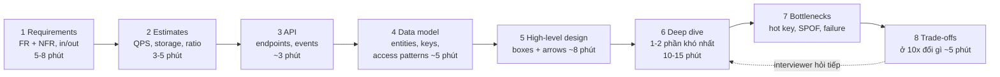
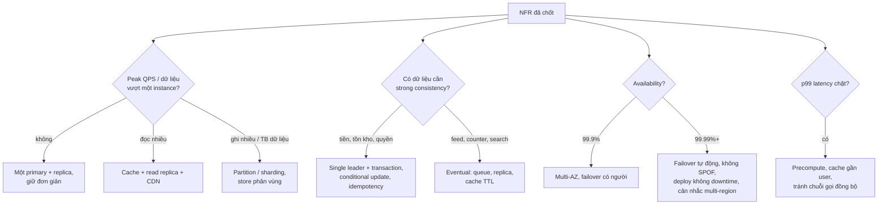

## Bối cảnh & vấn đề

Hai ứng viên cùng nhận đề "Thiết kế hệ thống đặt vé xem phim". Ứng viên A cầm bút vẽ ngay: load balancer, ba service, Kafka, Redis, Cassandra, Elasticsearch. Sau 30 phút bảng kín ô, nhưng khi interviewer hỏi "Hai người cùng bấm đặt ghế G7 thì sao?", A mới nhận ra mình chưa hề nghĩ tới chuyện đó, và Cassandra (không có transaction nhiều dòng) là lựa chọn tệ cho đúng phần khó nhất của bài. Ứng viên B mất 7 phút đầu chỉ để hỏi: bao nhiêu rạp, bao nhiêu người đặt cùng lúc lúc mở bán phim bom tấn, có giữ ghế tạm trong lúc thanh toán không, có được phép bán trùng ghế không (không bao giờ). B vẽ ít ô hơn, nhưng mọi ô đều có lý do, và 15 phút deep dive dành cho đúng chỗ khó: giữ ghế atomic và hết hạn giữ ghế.

B đậu, A trượt, dù A "biết nhiều công nghệ hơn". Lý do: **system design interview không chấm đáp án, nó chấm quy trình ra quyết định**. Interviewer muốn thấy bạn làm việc như một senior engineer trong buổi thiết kế thật: làm rõ vấn đề trước khi giải, dùng con số để chọn kiến trúc, biết chỗ nào là rủi ro chính và nói rõ mình đánh đổi gì.

Bài này là nền cho cả track. Nó trả lời bốn câu: một buổi 45 phút nên chia thế nào; những non-functional requirement nào luôn phải hỏi và chúng đổi thiết kế ra sao; làm gì khi đề cố tình mơ hồ; và trả lời câu "build hay buy" thế nào cho ra senior. Các bài sau (ước lượng, building blocks, các bài toán cụ thể) đều dùng khung ở đây.

## Khái niệm

### Functional requirement và non-functional requirement

**Functional requirement (FR)** là hệ thống **làm gì**: "user tạo short link", "user gửi tin nhắn cho nhóm", "admin xem báo cáo doanh thu". **Non-functional requirement (NFR)** là hệ thống làm điều đó **tốt tới mức nào**: nhanh bao nhiêu, sống bao nhiêu phần trăm thời gian, dữ liệu đúng tới đâu, chịu được bao nhiêu tải, tốn bao nhiêu tiền.

Lý do phải tách: FR quyết định **API và data model**, còn NFR quyết định **kiến trúc**. Cùng một FR "gửi tin nhắn" nhưng NFR "1.000 user, không cần realtime" cho ra một bảng Postgres và polling 10 giây; NFR "50 triệu DAU, latency dưới 200 ms, offline sync" cho ra WebSocket gateway, message store phân vùng và push service. Ứng viên chỉ hỏi FR sẽ thiết kế sai cỡ.

Ví dụ ghi lên bảng: "FR: tạo link, redirect, xem số click. NFR: redirect p99 < 50 ms, 99,99% availability cho redirect (tạo link 99,9% là đủ), link không đoán được, read:write ≈ 100:1".

**Interview angle:** interviewer thường không cho NFR; họ chờ bạn hỏi. Không hỏi = tín hiệu mid-level.

### Các NFR luôn phải làm rõ

Có một bộ NFR gần như bài nào cũng cần. Điều quan trọng không phải là thuộc danh sách mà là **mỗi NFR phải dẫn tới một quyết định**:

- **Scale**: DAU, QPS trung bình và peak, dữ liệu tăng bao nhiêu mỗi năm. Dẫn tới: có cần cache, read replica, sharding, partition theo thời gian không.
- **Latency**: p50 và p99 mục tiêu cho từng đường đi chính (đọc feed, checkout). Dẫn tới: cache, CDN, precompute, tránh gọi chuỗi nhiều service đồng bộ.
- **Availability**: bao nhiêu "số chín". Dẫn tới: multi-AZ, failover tự động, multi-region, loại bỏ single point of failure.
- **Consistency**: chỗ nào bắt buộc strong (tiền, tồn kho, quyền truy cập), chỗ nào eventual được (feed, số like, search). Dẫn tới: single leader + transaction cho phần strong, replica/cache/queue cho phần còn lại.
- **Durability**: mất bao nhiêu dữ liệu là chấp nhận được (RPO). Dẫn tới: replication đồng bộ hay async, backup, outbox.
- **Security/compliance**: PII, dữ liệu thanh toán, tenant isolation, data residency. Dẫn tới: mã hoá, region cố định, RLS, audit log.
- **Cost** và **read/write ratio**, **geo** (user ở đâu).

Ví dụ: "Consistency cho tồn kho phải strong" dẫn tới "trừ kho bằng conditional update trên primary, không qua cache"; "feed eventual 5 giây được" dẫn tới "fan-out bất đồng bộ qua queue".

**Interview angle:** câu follow-up kinh điển là "99,99% khác 99,9% thế nào về kiến trúc và chi phí?". Câu trả lời phải có con số downtime và hệ quả kiến trúc (xem bảng ở phần Ví dụ).

### Availability, SLO và "số chín"

**Availability** là tỷ lệ thời gian (hoặc tỷ lệ request) hệ thống phục vụ đúng. **SLO** (service level objective) là mục tiêu nội bộ cho một chỉ số đo được (SLI), ví dụ "99,9% request checkout thành công trong 1 giây, đo theo 30 ngày". Mỗi "số chín" thêm vào giảm downtime cho phép khoảng 10 lần: 99,9% cho phép khoảng 8,8 giờ mỗi năm, 99,99% chỉ khoảng 53 phút.

Vì sao điều này đổi kiến trúc: với 53 phút/năm, bạn **không có thời gian cho con người** phát hiện và xử lý sự cố bằng tay (một lần on-call được page, mở laptop, đọc dashboard đã mất 15 phút). Nên 99,99% đòi hỏi failover tự động, deploy không downtime, nhiều AZ, và thường là phụ thuộc nào cũng phải ≥ 99,99% (vì availability của chuỗi phụ thuộc đồng bộ là **tích** các availability: ba dependency 99,9% nối tiếp chỉ còn khoảng 99,7%). Chi phí tăng không tuyến tính: thêm hạ tầng dự phòng, thêm người, chậm release.

Ví dụ: "Redirect của URL shortener cần 99,99% vì link nằm trong email marketing đã gửi đi, không sửa được; trang admin tạo link 99,9% là đủ". Tách SLO theo đường đi giúp không trả giá 99,99% cho cả hệ thống. Chi tiết SLO và error budget ở [bài 5](/tracks/system-design/learn/async-idempotency-resilience).

### Scope: in, out và giả định

**Scoping** là chọn 2–3 use case cốt lõi để thiết kế trong thời gian có hạn và **nói rõ** cái gì bị bỏ ra. Một đề như "design Instagram" có hàng chục tính năng (đăng ảnh, feed, story, reels, DM, search, ads, notification, explore). Không ai thiết kế hết trong 45 phút; ứng viên cố làm hết sẽ chỉ chạm bề mặt mọi thứ.

Cách làm: liệt kê nhanh các tính năng, đề xuất giữ lại phần tạo ra "xương sống" của sản phẩm (đăng ảnh, follow, xem home feed), nói rõ bỏ gì và vì sao ("DM là một bài chat riêng, story có TTL 24h nên là biến thể nhỏ của feed"), rồi **xin interviewer xác nhận**. Giả định được viết lên bảng bằng con số ("500 triệu DAU, mỗi user xem feed 10 lần/ngày, đăng 0,1 ảnh/ngày, ảnh trung bình 2 MB").

**Interview angle:** senior signal là dám cắt scope và giải thích tiêu chí cắt, không phải là kể được nhiều tính năng.

### Build vs buy

**Build vs buy** là quyết định tự vận hành một thành phần (Kafka tự host, Elasticsearch trên EC2, auth tự viết) hay dùng dịch vụ managed (MSK/Confluent Cloud, OpenSearch Service, Auth0/Cognito, EventBridge Scheduler). Đây không phải câu hỏi công nghệ mà là câu hỏi **chi phí tổng và rủi ro**.

Các tiêu chí: thành phần đó có phải **điểm khác biệt cốt lõi** của sản phẩm không (thường không: không khách hàng nào trả tiền vì bạn tự vận hành Kafka giỏi); **chi phí vận hành thật** (on-call, nâng version, vá bảo mật, backup, capacity planning) so với hoá đơn dịch vụ; yêu cầu **compliance/data residency**; **lock-in và exit cost**; **giới hạn** của dịch vụ managed (quota, tính năng thiếu, không chỉnh được config, noisy neighbor); và **năng lực team** hiện tại.

Ví dụ: team 15 người, chưa ai từng vận hành Elasticsearch. Self-host 3 node trên EC2 có vẻ rẻ hơn OpenSearch Service, nhưng chi phí ẩn là: shard rebalancing khi một node chết, nâng version major có breaking change, JVM heap tuning, snapshot/restore, bảo mật cluster. Một sự cố split-brain lúc 2 giờ sáng tốn nhiều hơn chênh lệch hoá đơn cả năm.

**Interview angle:** câu trả lời tốt luôn có "điều kiện để đổi quyết định": "Tôi chọn managed, nhưng nếu chi phí vượt X hoặc cần tính năng Y mà managed không có, tôi sẽ cân nhắc self-host".

## Cơ chế hoạt động

### Tám bước trong 45 phút

Một buổi điển hình có khoảng 40 phút làm việc thật (trừ giới thiệu và câu hỏi cuối). Khung dưới đây là thứ tự, không phải luật cứng; interviewer có thể kéo bạn vào deep dive sớm, và bạn đi theo họ.



Diễn giải từng bước:

1. **Requirements (5–8 phút)**: FR, NFR, scope in/out. Kết thúc bằng một danh sách ngắn viết trên bảng. Đây là bước bị bỏ nhiều nhất và là bước quyết định nhất.
2. **Estimates (3–5 phút)**: QPS đọc/ghi, storage theo năm, băng thông, số connection. Mục tiêu là **bậc độ lớn** để biết có cần sharding hay một instance là đủ ([bài 2](/tracks/system-design/learn/back-of-envelope)).
3. **API (~3 phút)**: vài endpoint chính với method, path, body quan trọng. Ví dụ `POST /links {longUrl, alias?, expiresAt?} → 201 {code}`. API buộc bạn chốt ranh giới hệ thống.
4. **Data model (~5 phút)**: entity, khoá chính, khoá phân vùng, index, và **access pattern** (truy vấn nào chạy nhiều nhất). Từ đây mới chọn SQL hay NoSQL.
5. **High-level design (~8 phút)**: các ô và mũi tên cho đường đi chính (write path, read path). Mỗi ô phải trả lời "nó giải quyết vấn đề gì".
6. **Deep dive (10–15 phút)**: chọn 1–2 phần khó nhất, hoặc hỏi interviewer muốn đào phần nào. Đây là nơi chấm điểm nhiều nhất.
7. **Bottlenecks & failure**: hot key, single point of failure, chuyện gì xảy ra khi Redis chết, khi queue lag, khi retry trùng.
8. **Trade-offs**: tóm tắt các lựa chọn và cái giá, "ở 10x traffic tôi sẽ đổi gì".

Mũi tên chấm từ bước 8 quay lại bước 6 thể hiện thực tế: interviewer sẽ đẩy bạn đào tiếp. Đó là dấu hiệu tốt, không phải bạn sai.

### Từ NFR tới quyết định

Cách nối NFR với thiết kế có thể vẽ thành cây quyết định. Không phải mọi đề đều đi hết các nhánh, nhưng nói ra được mối nối là thứ phân biệt ứng viên.



Ba nhánh scale, consistency và availability gần như độc lập, nên một hệ thống có thể vừa "strong cho checkout" vừa "eventual cho review". Đó chính là ý "chọn per use case, không per hệ thống" mà bài [CAP/PACELC](/tracks/system-design/learn/data-replication-sharding) sẽ đào sâu.

### Nói to suy nghĩ

Interviewer chấm cái họ **nghe thấy**. Một quyết định đúng mà không nói lý do có giá trị gần bằng một quyết định đoán. Câu mẫu: "Tôi chọn Postgres cho orders vì cần transaction giữa order và order lines, và 230 write/s thì một primary chịu thoải mái. Nếu ghi tăng 50 lần tôi sẽ partition theo tenant." Câu này có lựa chọn, lý do, con số và điều kiện để đổi.

## Ví dụ thực tế

### Bảng downtime tính thật

Chạy với Node 24.21 (`node est.ts` trong thư mục nháp), công thức `downtime = (1 − availability) × thời gian`:

```ts
for (const a of [0.99, 0.999, 0.9999, 0.99999]) {
  const yr = (1 - a) * 365 * 24 * 60;
  console.log(`${(a * 100).toFixed(3)}% -> ${(yr / 60).toFixed(2)} h/year = ${yr.toFixed(1)} min/year, ${((1 - a) * 30 * 24 * 60).toFixed(1)} min/month`);
}
```

```text
99.000% -> 87.60 h/year = 5256.0 min/year, 432.0 min/month
99.900% -> 8.76 h/year = 525.6 min/year, 43.2 min/month
99.990% -> 0.88 h/year = 52.6 min/year, 4.3 min/month
99.999% -> 0.09 h/year = 5.3 min/year, 0.4 min/month
```

Đọc bảng như interviewer muốn: 99,9% cho 43 phút mỗi tháng, đủ cho một sự cố có người xử lý. 99,99% chỉ còn 4,3 phút mỗi tháng: một lần deploy lỗi rollback chậm là hết budget, nên cần canary + rollback tự động + failover tự động. 99,999% (5 phút/năm) gần như chỉ đạt được với multi-region active-active, và rất hiếm hệ thống thật sự cần.

Availability của chuỗi phụ thuộc đồng bộ: API 99,95% gọi DB 99,95% và payment 99,9% thì tối đa khoảng 0,9995 × 0,9995 × 0,999 ≈ 99,8%. Muốn checkout 99,9% thì không thể gọi đồng bộ quá nhiều thứ, hoặc phải có fallback cho dependency không quan trọng.

### Phiên requirements mẫu: "Thiết kế URL shortener"

Đây là đoạn ghi trên bảng sau 6 phút đầu (minh hoạ cách viết, không phải output chạy):

```text
FR (in):  tạo short link (custom alias tuỳ chọn, expiry tuỳ chọn) · redirect · đếm click theo ngày
FR (out): QR code, A/B link, chỉnh sửa link sau khi tạo, dashboard team
NFR:
  - 100M link mới/tháng, read:write ~100:1          -> read-heavy, cache
  - redirect p99 < 50 ms, 99.99%; tạo link 99.9%     -> tách read path khỏi write path
  - code không đoán được cho link private            -> random code, không dùng counter lộ
  - analytics trễ vài phút được                      -> click event qua queue, không ghi đồng bộ
  - link sống 10 năm                                 -> ~6 TB, chưa cần sharding phức tạp
Giả định: user toàn cầu, 1 region chính + CDN edge
```

Mỗi dòng NFR có mũi tên tới một quyết định. Đó là thứ interviewer chụp lại trong đầu.

### Scoping "design Instagram" trong 5 phút

Một đoạn hội thoại mẫu (minh hoạ):

```text
Candidate: Instagram có nhiều phần: đăng ảnh, follow, home feed, story, reels, DM, explore, search, ads.
           Tôi đề xuất tập trung vào: (1) đăng ảnh, (2) follow, (3) home feed. DM là một bài chat riêng,
           story là feed có TTL 24h, search/explore là bài ranking. Anh/chị đồng ý chứ?
Interviewer: OK, nhưng feed phải có ranking chứ không chỉ theo thời gian.
Candidate: Ghi nhận. NFR tôi giả định: 500M DAU, mỗi người mở feed ~10 lần/ngày, đăng ~0.1 ảnh/ngày,
           feed load p99 < 300 ms, ảnh không được mất (durability 11 số chín ở object storage),
           feed eventual vài giây chấp nhận được. Tôi sẽ vẽ HLD toàn bộ trước, rồi đào sâu fan-out
           và ranking vì đó là chỗ khó nhất.
```

Ứng viên đã: liệt kê, cắt có lý do, xin xác nhận, đón thêm yêu cầu (ranking) vào scope, viết NFR bằng số, và đề xuất thứ tự deep dive. Khi interviewer nửa chừng thêm "phải chạy offline", không vẽ lại từ đầu: thêm một lớp local store ở client (queue các thao tác đăng ảnh, sync khi có mạng, idempotency key cho mỗi upload) và nói rõ phần nào của HLD bị ảnh hưởng (upload API phải idempotent, feed phải có cursor để sync phần thiếu).

### Build vs buy cho một scheduler

Đề: "nhắc lịch hẹn lúc 09:00 theo time zone của user, vài triệu job/ngày". Ba lựa chọn: tự viết dispatcher trên Postgres (`FOR UPDATE SKIP LOCKED`, [bài 11](/tracks/system-design/learn/scheduling-notifications-webhooks)), dùng BullMQ trên Redis, hoặc dùng EventBridge Scheduler. Lập luận mẫu: nếu đang chạy trên AWS và mỗi job chỉ cần gọi một endpoint/queue, managed scheduler loại bỏ cả lớp lease/heartbeat/HA mà mình phải tự vận hành; nhưng cần kiểm tra quota số schedule và chi phí theo số lần gọi (verify trên trang quota/pricing hiện hành), và cần adapter mỏng để test local. Nếu job cần truy vấn phức tạp theo dữ liệu nghiệp vụ (huỷ hàng loạt job của một tenant), bảng job trong Postgres linh hoạt hơn.

## Trade-offs & lựa chọn thay thế

| Quyết định trong buổi phỏng vấn | Cách A | Cách B | Chọn A khi |
| --- | --- | --- | --- |
| Thứ tự trình bày | HLD toàn bộ trước, rồi deep dive | Deep dive phần khó ngay | Đề rộng; interviewer chưa chỉ định phần muốn đào |
| Mức scale giả định | Scale của đề (10k user) | "Google-scale" | Luôn A; nói "ở 100x tôi sẽ đổi X" thay vì thiết kế 100x ngay |
| Consistency | Strong cho toàn hệ thống | Per use case | Gần như không bao giờ A; tách theo dữ liệu |
| Thành phần hạ tầng | Managed | Self-host | Commodity, team nhỏ, không có yêu cầu đặc biệt |
| Mức chi tiết API | Vài endpoint chính | Đủ mọi endpoint | Luôn A; chi tiết hoá endpoint liên quan tới deep dive |
| Khi interviewer im lặng | Đề xuất phần tiếp theo và hỏi | Chờ | Luôn A; chủ động dẫn dắt là senior signal |

Chọn thế nào: mặc định đi theo khung 8 bước, nhưng **ưu tiên tín hiệu của interviewer**. Nếu họ nói "phần này tôi không quan tâm, đào sâu checkout đi", bỏ qua bước còn lại và đào sâu. Với build vs buy, mặc định buy cho infra commodity và build cho logic tạo khác biệt; luôn đặt một lớp adapter mỏng ở biên (interface `Scheduler`, `SearchIndex`) để giảm lock-in, nhưng đừng trừu tượng hoá mọi tính năng (dùng mẫu số chung nhỏ nhất của ba nhà cung cấp là mất hết lợi thế của managed).

## Edge cases & failure modes

- **Interviewer nói "bạn tự quyết requirements"**: đừng coi đó là tự do vô hạn. Đề xuất một bộ requirements cụ thể, có số, nói lý do, và hỏi "như vậy hợp lý không?". Mục tiêu là cho thấy bạn biết requirement nào quan trọng.
- **Đề đổi giữa chừng** ("giờ phải chạy offline", "giờ có 10x traffic"): không vẽ lại. Xác định phần nào của thiết kế bị ảnh hưởng, đề xuất thay đổi tối thiểu, nói cái giá.
- **Hết giờ trước deep dive**: dấu hiệu dành quá nhiều thời gian cho HLD. Đặt mốc thời gian trong đầu; tới phút 20 mà chưa vào deep dive thì chủ động hỏi "tôi đào sâu phần X nhé?".
- **Không biết một công nghệ interviewer nhắc tới**: nói thật và suy luận từ nguyên lý ("tôi chưa dùng Spanner, nhưng nếu nó cho transaction toàn cầu với latency commit cao hơn thì tôi sẽ dùng cho X và không cho Y"). Bịa là red flag nặng nhất.
- **Ước lượng ra số vô lý** (ví dụ 3 triệu QPS cho app nội bộ): dừng lại kiểm tra giả định trước khi thiết kế cho con số đó.
- **NFR mâu thuẫn** (latency cực thấp + strong consistency toàn cầu): gọi tên mâu thuẫn và đề xuất đánh đổi (strong trong một region, đọc stale ở region khác).

## Pitfalls

- ❌ Vẽ ô ngay phút thứ hai → ✅ 5–8 phút requirements; ô nào cũng phải có lý do từ một requirement.
- ❌ Liệt kê NFR như thuộc bài rồi không dùng → ✅ mỗi NFR nối với một quyết định ("99,99% → failover tự động").
- ❌ Thiết kế Google-scale cho đề 10.000 user → ✅ thiết kế cho scale của đề, nói rõ sẽ đổi gì ở 10x/100x.
- ❌ "Dùng Kafka/microservices vì scale tốt" → ✅ nói vấn đề cụ thể nó giải quyết và cái giá (vận hành, eventual consistency).
- ❌ Cố bao phủ mọi tính năng của "Instagram" → ✅ chọn 2–3 use case, nói rõ bỏ gì, xin xác nhận.
- ❌ Build vs buy trả lời bằng sở thích ("tôi thích tự host cho chủ động") → ✅ tiêu chí: core hay commodity, chi phí vận hành thật, compliance, lock-in, năng lực team.
- ❌ Im lặng khi suy nghĩ → ✅ nói to giả định và lựa chọn đang cân nhắc.

## Tóm tắt

- System design interview chấm **quy trình ra quyết định**: requirements → estimates → API → data model → HLD → deep dive → bottlenecks → trade-offs.
- FR quyết định API và data model; **NFR quyết định kiến trúc**. Luôn hỏi scale, latency, availability, consistency, durability, security, cost.
- 99,9% ≈ 8,8 giờ/năm, 99,99% ≈ 53 phút/năm: thêm một số chín nghĩa là bỏ con người khỏi vòng failover, và chi phí tăng mạnh. Availability của chuỗi đồng bộ là tích các availability.
- Đề mơ hồ: liệt kê, cắt scope có lý do, viết giả định bằng số, xin xác nhận, đề xuất thứ tự deep dive.
- Build vs buy: core differentiator, chi phí vận hành thật, compliance, lock-in, giới hạn managed, năng lực team; luôn nói điều kiện để đổi quyết định.
- Đi theo tín hiệu của interviewer; chủ động dẫn dắt khi họ im lặng.
