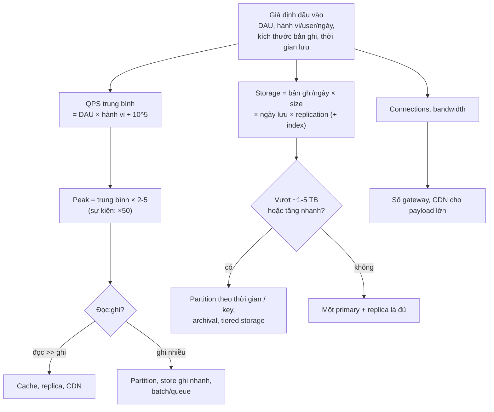
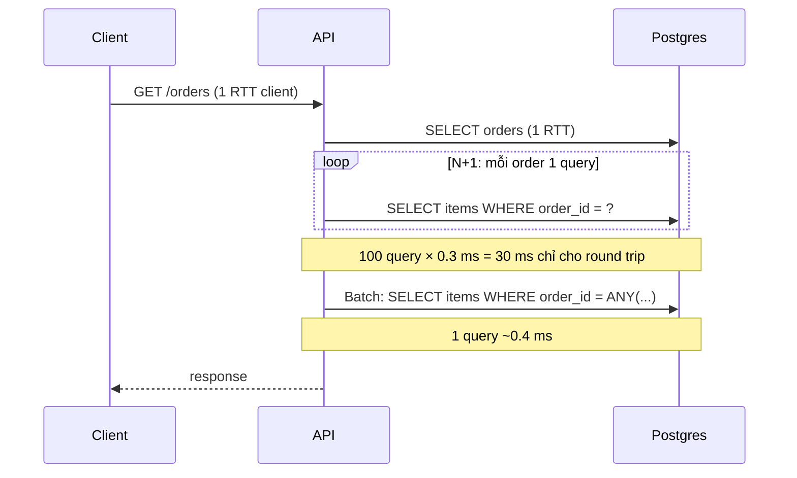

## Bối cảnh & vấn đề

Một team được giao làm hệ thống nhắn tin nội bộ cho công ty 3.000 nhân viên. Tech lead đề xuất Kafka, Cassandra 6 node và 10 WebSocket gateway "để scale". Một kỹ sư khác làm phép tính 30 giây: 3.000 người × 100 tin/ngày = 300.000 tin/ngày, chia 86.400 giây ≈ **3,5 tin/giây**; mỗi tin 500 byte thì một năm là 55 GB. Một Postgres nhỏ và một process Socket.IO đủ chạy, còn dư 100 lần. Kiến trúc đề xuất ban đầu tốn hàng nghìn đô mỗi tháng và một người vận hành toàn thời gian, cho một tải mà laptop cũng chịu được.

Chiều ngược lại cũng xảy ra: một team ước lượng "chắc vài trăm request/giây" cho trang flash sale, deploy một primary Postgres, và lúc mở bán nhận 40.000 request/giây. Không ai làm phép nhân giữa số user đăng ký nhận thông báo và tỷ lệ bấm trong phút đầu.

**Back-of-envelope estimation** là phép tính nhanh, làm tròn mạnh tay, để biết **bậc độ lớn** (10, 1.000 hay 100.000 QPS; GB hay PB) trước khi chọn kiến trúc. Trong phỏng vấn, nó có hai vai trò: chứng minh bạn không thiết kế mù, và tạo ra các con số mà bước sau dùng để ra quyết định. Ước lượng xong mà không dùng con số nào là lãng phí 5 phút.

## Khái niệm

### Bậc độ lớn và làm tròn

Mục tiêu không phải con số chính xác, mà là **bậc độ lớn** đúng: 2.300 QPS và 3.000 QPS dẫn tới cùng một kiến trúc; 2.300 và 230.000 thì không. Vì thế làm tròn mạnh tay để tính nhẩm được: một ngày có 86.400 giây, làm tròn **10⁵**; một tháng khoảng **2,5 × 10⁶** giây; một năm khoảng **3 × 10⁷** giây. 1 triệu request/ngày ≈ 12 QPS trung bình; 1 tỷ/ngày ≈ 12.000 QPS.

Ví dụ: 10 triệu DAU × 20 request = 2 × 10⁸ request/ngày; chia 10⁵ ≈ 2.000 QPS (chính xác là 2.315). Sai 15% không đổi quyết định nào.

**Interview angle:** nói to phép làm tròn ("tôi làm tròn 86.400 thành 10⁵") để interviewer theo được và sửa giả định nếu cần.

### Trung bình và peak

Traffic không đều: buổi tối gấp mấy lần buổi sáng, Black Friday gấp chục lần ngày thường, flash sale có thể dồn cả ngày vào vài phút. **Peak factor** thường lấy ×2–×5 so với trung bình cho traffic tiêu dùng; với sự kiện (mở bán vé, flash sale, push notification gửi tới 5 triệu người cùng lúc) có thể ×50 hoặc hơn. Hệ thống phải được thiết kế cho **peak**, còn chi phí lưu trữ tính theo **tổng**.

Ví dụ: 2.300 QPS đọc trung bình, peak ×3 ≈ 7.000 QPS. Một Postgres primary phục vụ 7.000 query đơn giản theo primary key mỗi giây là trong tầm; 70.000 thì cần cache.

### Latency numbers

Bảng latency kinh điển (từ Jeff Dean, cập nhật theo thời gian) cho **tỷ lệ** giữa các thao tác. Con số tuyệt đối đổi theo phần cứng; tỷ lệ thì tương đối ổn định (verify với phần cứng của bạn):

- L1 cache ~1 ns; main memory ~100 ns.
- SSD random read ~100 µs (NVMe có thể nhanh hơn nhiều).
- Round trip trong cùng datacenter ~0,5 ms; Redis GET qua mạng cùng AZ ~0,2–1 ms.
- Query DB theo index ~1–10 ms (gồm round trip + thực thi).
- Round trip xuyên lục địa ~100–150 ms.

Cách dùng: biết một **network round trip** (~0,5 ms) đắt hơn đọc memory **5.000 lần**, nên 100 query tuần tự là 50 ms chỉ riêng tiền mạng (N+1); biết gọi service ở region khác cho mỗi request là thêm 100+ ms; biết cache in-process (100 ns) nhanh hơn Redis (~0,5 ms) khoảng **5.000 lần**, đủ lý do để có L1 cache cho dữ liệu nóng.

**Interview angle:** follow-up hay gặp: "một trang gọi 30 lần tuần tự tới service cùng datacenter, sàn latency là bao nhiêu?". 30 × 0,5 ms = 15 ms chỉ cho mạng, cộng thời gian xử lý mỗi lần; cách cắt là gọi song song, batch API, hoặc gom dữ liệu bằng một endpoint.

### Storage

Công thức: **storage = số bản ghi mới/ngày × kích thước bản ghi × số ngày lưu × hệ số replication**, cộng phần index (thường 20–100% dữ liệu, tuỳ số index). Kích thước bản ghi ước từ schema: UUID 16 byte, timestamp 8 byte, URL trung bình 100–200 byte, JSON metadata vài trăm byte.

Ví dụ: 20 triệu bản ghi/ngày × 1 KB = 20 GB/ngày; × 365 × 3 năm ≈ 22 TB; × 3 replica ≈ 66 TB. Con số 22 TB nói rằng dữ liệu **không vừa thoải mái một instance** (vẫn có thể, nhưng backup, vacuum, restore sẽ đau), nên cần partition theo thời gian và archival dữ liệu cũ.

### Keyspace

Khi sinh ID ngắn (short code, voucher code), cần biết **keyspace** có đủ không: base62 (0–9, a–z, A–Z) với 7 ký tự cho 62⁷ ≈ **3,5 × 10¹²** giá trị. Với 100 triệu code mỗi tháng, 3,5 × 10¹² / 10⁸ = 35.000 tháng ≈ 2.900 năm. Nhưng nếu code sinh **ngẫu nhiên**, xác suất trùng tăng dần theo số code đã dùng (birthday problem): khi đã dùng 1% keyspace, mỗi lần sinh có 1% khả năng trùng, nên phải có unique constraint và retry.

### Connection và băng thông

Hai con số hay bị quên: **số connection đồng thời** (WebSocket, long polling) và **băng thông**. Một WebSocket gateway giữ được khoảng 50.000–100.000 connection tuỳ memory và lượng tin (verify bằng load test của chính bạn); 5 triệu user online nghĩa là 50–100 gateway. Băng thông = QPS × kích thước response; 10.000 QPS × 50 KB = 500 MB/s = 4 Gbps, vượt card mạng của nhiều instance cỡ vừa, nên phải đưa ảnh/file ra CDN.

## Cơ chế hoạt động

### Quy trình ước lượng



Bốn bước: (1) viết giả định ra bảng, (2) tính QPS trung bình rồi peak, (3) tính storage, (4) tính connection/băng thông nếu bài có realtime hoặc file. Sau mỗi con số, **nói luôn nó dẫn tới quyết định gì**. Con số không dẫn tới quyết định nào là noise, có thể bỏ qua.

### Latency floor của một request

Latency tối thiểu của một request là tổng các bước **tuần tự**. Các bước song song chỉ tính bước chậm nhất. Đây là lý do N+1 query và chuỗi gọi service đồng bộ giết latency: chúng biến cộng song song thành cộng tuần tự.



## Ví dụ thực tế

### Đo latency trên máy thật

Chạy với Node 24.21, ioredis 6.0, pg 8.23, Redis 8.10.2 và Postgres 17 trong Docker trên macOS (Docker Desktop thêm một lớp mạng ảo, nên số tuyệt đối chỉ minh hoạ bậc độ lớn; trên hạ tầng thật cùng AZ thường chậm hơn một chút vì đi qua mạng vật lý):

```ts
const t = async (label: string, fn: () => Promise<unknown>, n = 1) => {
  for (let i = 0; i < 20; i++) await fn();                       // warm up
  const s = performance.now(); for (let i = 0; i < n; i++) await fn();
  console.log(`${label.padEnd(44)} ${((performance.now() - s) / n).toFixed(3)} ms`);
};
await t("redis GET (1 round trip)", () => redis.get("k"), 2000);
await t("pg SELECT by primary key", () => db.query("SELECT * FROM product WHERE id=$1", [4242]), 2000);
const ids = Array.from({ length: 100 }, (_, i) => i * 997 + 1);
await t("N+1: 100 sequential PK queries", async () => { for (const id of ids) await db.query("SELECT * FROM product WHERE id=$1", [id]); }, 20);
await t("batched: 1 query WHERE id = ANY($1)", () => db.query("SELECT * FROM product WHERE id = ANY($1)", [ids]), 200);
await t("30 parallel redis GET (Promise.all)", () => Promise.all(Array.from({ length: 30 }, () => redis.get("k"))), 200);
await t("30 sequential redis GET", async () => { for (let i = 0; i < 30; i++) await redis.get("k"); }, 200);
```

```text
redis GET (1 round trip)                     0.219 ms
pg SELECT by primary key                     0.293 ms
N+1: 100 sequential PK queries               29.960 ms
batched: 1 query WHERE id = ANY($1)          0.430 ms
30 parallel redis GET (Promise.all)          0.916 ms
30 sequential redis GET                      6.423 ms
```

Đọc kết quả: một PK lookup chỉ 0,3 ms, gần bằng một Redis GET, vì cả hai bị chi phối bởi round trip chứ không phải thực thi. 100 query tuần tự tốn **30 ms**, trong khi một query batch lấy cùng 100 dòng chỉ **0,43 ms**: gấp 70 lần, hoàn toàn do round trip. 30 lệnh song song tốn khoảng 1 ms (ioredis pipeline chúng trên một connection), tuần tự tốn 6,4 ms. Bài học cho câu 003: số tuyệt đối thay đổi theo môi trường, **tỷ lệ round trip : thực thi** mới là thứ quyết định thiết kế.

### Bài 10 triệu DAU, 20 đọc + 2 ghi, 1 KB, giữ 3 năm

```ts
const DAY = 86_400;
const readQps = (10e6 * 20) / DAY, writeQps = (10e6 * 2) / DAY;
const perDay = 10e6 * 2 * 1000, total = perDay * 365 * 3;
```

```text
10M DAU, 20 reads + 2 writes, 1 KB, 3y
  read QPS  avg=2315 peak=6944
  write QPS avg=231 peak=694
  ratio read:write = 10:1
  storage/day=20.0 GB total(3y)=21.9 TB x3 replicas=65.7 TB
```

Từng bước bằng nhẩm: 10⁷ × 20 = 2 × 10⁸ đọc/ngày, chia 10⁵ = 2.000 QPS (máy tính ra 2.315); peak ×3 ≈ 7.000. Ghi bằng 1/10 ≈ 230 QPS. Storage: 2 × 10⁷ ghi × 1 KB = 20 GB/ngày; × 1.000 ngày ≈ 20 TB (máy tính ra 21,9 TB); × 3 replica ≈ 66 TB, chưa tính index.

Con số nào đổi kiến trúc (follow-up của câu 004)? **Tỷ lệ 10:1** nói hệ thống read-heavy, nên cache và read replica là đòn bẩy đầu tiên. **22 TB** nói không nên nhét một instance mà không có partition theo thời gian và chính sách archival (dữ liệu > 1 năm chuyển sang storage rẻ). **230 write/s** thì một primary Postgres chịu thoải mái, nên **chưa cần sharding ghi**. Peak 7.000 QPS đọc thì một primary + 2 replica + cache là đủ. Số 66 TB với replication chủ yếu ảnh hưởng chi phí, không ảnh hưởng thiết kế.

### URL shortener: 100 triệu link/tháng, đọc:ghi 100:1

```text
URL shortener
  writes/s=38.6 reads/s=3858 peak x5=19290
  storage/month=50.0 GB 10y=6.0 TB
  base62^7=3.52e+12 years to exhaust at 100M/month=2935
```

Nhẩm: 10⁸ / (2,5 × 10⁶ giây/tháng) = 40 ghi/s; đọc ×100 = 4.000/s, peak ×5 ≈ 20.000/s. Bản ghi ~500 byte (code 7 byte, long URL ~200 byte, owner, created_at, expires_at, overhead) → 10⁸ × 500 B = 50 GB/tháng, 10 năm 6 TB. Keyspace 62⁷ ≈ 3,5 × 10¹², đủ dùng gần 3.000 năm. Băng thông đọc nhỏ: một response 302 chỉ vài trăm byte, 20.000/s × 500 B = 10 MB/s.

Kết luận dẫn tới thiết kế ([bài 6](/tracks/system-design/learn/rate-limiter-url-shortener)): read path chiếm tuyệt đại đa số và phân bố lệch (80/20: một số link viral), nên cache hot link trong Redis và/hoặc CDN edge; 40 ghi/s và 6 TB/10 năm thì KV store hoặc Postgres + cache đều ổn, **chưa cần sharding sớm**.

### Chat 50 triệu DAU, 40 tin/user/ngày, 10% online lúc peak

```text
Chat 50M DAU
  msgs/day=2.0B avg=23148/s peak x3=69444/s
  storage 200B/msg: 400.0 GB/day, 146.0 TB/year, x3 replicas=438.0 TB
  online peak=5M conns; gateways @50k=100 @100k=50
  heartbeats every 30s=166667/s
```

Nhẩm: 5 × 10⁷ × 40 = 2 × 10⁹ tin/ngày; chia 10⁵ = 20.000/s (máy ra 23.000), peak ×3 ≈ 70.000 ghi/s. Mỗi tin trong group còn được **fan-out** tới N thành viên, nên số lượt "giao" có thể gấp 10–100 lần số tin ghi. Storage: 200 byte × 2 × 10⁹ = 400 GB/ngày ≈ 146 TB/năm, × 3 replica ≈ 440 TB. Connection: 5 triệu đồng thời, chia 50.000–100.000 mỗi gateway → 50–100 gateway. Heartbeat 30 giây một lần cho 5 triệu connection = 170.000 gói/giây, lớn hơn cả lượng tin.

Con số nào đẩy khỏi relational DB cho message (follow-up của câu 042)? **70.000 ghi/s** liên tục và **146 TB/năm** tăng mãi: một primary Postgres không ghi nổi tốc độ đó ổn định, và bảng trăm TB là ác mộng vận hành. Access pattern lại rất hẹp: "lấy tin của conversation X sau seq Y". Đó là đúng hình dạng của wide-column store phân vùng theo `conversation_id` (Cassandra, ScyllaDB, DynamoDB) với clustering key là `seq`. Bài toán chính là **connection management và fan-out**, không phải CPU ([bài 8](/tracks/system-design/learn/realtime-chat)).

## Trade-offs & lựa chọn thay thế

| Cách ước lượng | Ưu | Nhược | Dùng khi |
| --- | --- | --- | --- |
| Top-down từ DAU × hành vi | Nhanh, ai cũng hiểu | Phụ thuộc giả định hành vi | Phỏng vấn, đề mới |
| Bottom-up từ dữ liệu thật (log, APM) | Chính xác, có phân bố | Cần hệ thống đang chạy | Capacity planning thật |
| Peak factor cố định ×3 | Đơn giản | Sai với sự kiện (flash sale, push) | Traffic tiêu dùng bình thường |
| Mô hình sự kiện (số người nhận push × tỷ lệ click trong 60 s) | Bắt được spike | Cần thêm giả định | Flash sale, mở bán, campaign |
| Load test | Con số thật của chính hệ thống | Tốn công, cần môi trường giống prod | Trước sự kiện lớn, sau thay đổi kiến trúc |

Trong phỏng vấn, dùng top-down và nói rõ giả định; nếu đề có sự kiện (flash sale, celebrity post), thêm mô hình spike. Trong công việc thật, ước lượng top-down chỉ để chọn hướng; quyết định cuối cùng phải dựa trên số đo thật (APM, `pg_stat_statements`, load test), vì giả định hành vi user thường sai 2–10 lần.

## Edge cases & failure modes

- **Quên fan-out**: chat group 500 người, một tin ghi thành 500 lượt giao. Ước lượng chỉ theo tin ghi sẽ thấp 100 lần so với tải của gateway.
- **Quên index và overhead**: 22 TB dữ liệu thô có thể thành 35–40 TB trên đĩa với index, TOAST, bloat. Ước lượng storage nên cộng 30–100%.
- **Quên retention và xoá**: dữ liệu "giữ mãi" nghĩa là chi phí và thời gian backup tăng mãi; hỏi retention.
- **Spike do chính mình gây ra**: gửi push tới 5 triệu người lúc 20:00, cron chạy đúng 00:00 ở mọi instance, cache cùng hết hạn sau deploy. Những spike này không có trong "DAU × hành vi".
- **Latency đuôi**: trung bình 5 ms nhưng p99 200 ms. Với fan-out song song tới 30 backend, request chờ backend chậm nhất, nên p99 của mỗi backend gần thành p50 của request tổng (tail at scale).
- **Đo trên laptop rồi suy ra prod**: Docker trên macOS, loopback, cache nóng, không có TLS. Dùng tỷ lệ, không dùng số tuyệt đối.

## Pitfalls

- ❌ Tính ra con số rồi không dùng → ✅ sau mỗi con số, nói nó dẫn tới quyết định gì (hoặc nói "số này không đổi thiết kế").
- ❌ Thiết kế theo trung bình → ✅ thiết kế cho peak, tính chi phí theo tổng; hỏi về sự kiện.
- ❌ Tính chính xác tới từng chữ số → ✅ làm tròn (86.400 ≈ 10⁵), giữ bậc độ lớn đúng.
- ❌ Thuộc lòng latency tuyệt đối → ✅ nhớ tỷ lệ: memory ≪ SSD ≪ round trip ≪ xuyên lục địa.
- ❌ Bỏ qua connection count cho bài realtime → ✅ connection và heartbeat thường là bottleneck, không phải QPS.
- ❌ Bỏ qua hệ số fan-out → ✅ nhân với số người nhận/follower.
- ❌ Quên replication và index trong storage → ✅ ghi rõ "chưa tính index" hoặc cộng thêm hệ số.

## Tóm tắt

- Ước lượng để biết **bậc độ lớn**, không để có con số chính xác; 1 ngày ≈ 10⁵ giây, 1 triệu/ngày ≈ 12 QPS.
- QPS = DAU × hành vi ÷ 10⁵; thiết kế cho peak (×2–5, sự kiện ×50).
- Storage = bản ghi/ngày × size × ngày lưu × replication, cộng index.
- Round trip (~0,3–0,5 ms) chi phối latency: 100 query tuần tự 30 ms, một query batch 0,43 ms (đo thật).
- Keyspace base62 7 ký tự ≈ 3,5 × 10¹²; random code vẫn cần unique constraint và retry.
- Bài realtime: connection, heartbeat và fan-out mới là bottleneck.
- Mỗi con số phải nối tới một quyết định: read-heavy → cache/replica; TB tăng nhanh → partition/archival; ghi chục nghìn/s → store phân vùng.
