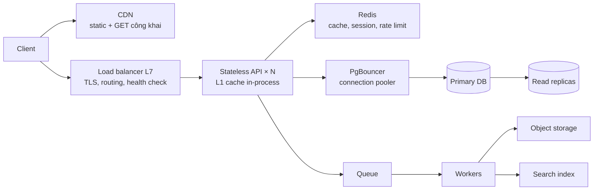
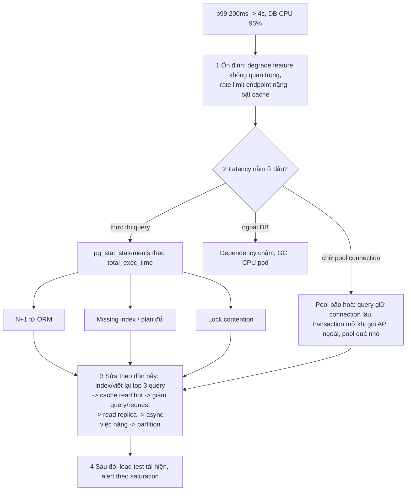

## Bối cảnh & vấn đề

Một API Node.js chạy 4 pod, mỗi pod một connection pool 10 tới Postgres. Trước chiến dịch marketing, team bật autoscaling lên tối đa 40 pod "cho chắc". Lúc traffic tăng, HPA scale lên 12 pod và bỗng một nửa request lỗi với `sorry, too many clients already`. Thêm pod không làm hệ thống mạnh hơn mà làm nó chết nhanh hơn: tổng connection 12 × 10 = 120 vượt `max_connections = 100` của Postgres. Cùng ngày, session đăng nhập của user bị mất mỗi khi request rơi vào pod mới, vì session nằm trong memory của pod cũ.

Câu chuyện này gói gọn bài học của các building block: mỗi thành phần (service, load balancer, cache, database) có **điều kiện** để scale, và vi phạm điều kiện thì "thêm máy" phản tác dụng. Bài này đi qua từng viên gạch theo thứ tự request đi: client → CDN → load balancer → service stateless → cache → database, và kết thúc bằng quy trình tìm bottleneck khi mọi thứ chậm.

Kiến trúc "mặc định" để bắt đầu một bài phỏng vấn là hình dưới. Bắt đầu từ đây rồi **bỏ bớt hoặc thêm** theo requirements; đừng vẽ thành phần nào mà không nói được nó giải quyết vấn đề gì.

## Khái niệm

### Vertical và horizontal scaling

**Vertical scaling** là đổi sang máy to hơn (nhiều CPU, RAM hơn). Ưu điểm: không đổi code, không có vấn đề phân tán. Nhược điểm: có trần (máy lớn nhất vẫn có giới hạn), giá tăng nhanh hơn tuyến tính ở dải cao, máy đó là single point of failure, và nâng cấp thường cần downtime.

**Horizontal scaling** là thêm instance giống nhau sau load balancer. Không có trần lý thuyết và chịu được mất một instance, nhưng chỉ hoạt động khi service thoả vài điều kiện: **stateless** (không giữ state theo user trong memory/disk cục bộ: session, upload tạm, cache bắt buộc phải nhất quán), **an toàn với retry** (load balancer có thể gửi lại request sang instance khác), **không có job chạy trên mọi instance** (cron trong process sẽ chạy N lần), và **tổng tài nguyên dùng chung không vượt giới hạn** (connection DB, rate limit của API bên thứ ba).

Ví dụ: chuyển session từ `express-session` MemoryStore sang Redis store, chuyển file upload tạm từ `/tmp` sang S3 presigned upload, chuyển `node-cron` sang một scheduler riêng, và đặt PgBouncer trước Postgres. Sau bốn thay đổi đó, thêm pod mới thật sự tăng sức chịu tải.

**Interview angle:** database thường là thứ khó scale ngang nhất, nên câu trả lời tốt luôn kèm "còn DB thì sao": read replica, cache, connection pooler, partitioning.

### Stateless service

**Stateless** nghĩa là mọi request có thể được phục vụ bởi bất kỳ instance nào, vì state nằm ở nơi dùng chung (DB, Redis, object storage) hoặc nằm trong chính request (JWT, cursor). Instance có thể có **cache** cục bộ, nhưng cache đó phải là tối ưu hoá (mất thì chỉ chậm hơn), không phải nguồn sự thật.

Tại sao quan trọng: stateless cho phép autoscaling, rolling deploy (tắt pod cũ không mất gì), và chịu lỗi (pod chết, LB chuyển sang pod khác). Ngoại lệ phổ biến là **WebSocket**: connection là state gắn với một instance; cách xử lý là giữ gateway "mỏng" và đẩy state ra Redis/pub-sub ([bài 8](/tracks/system-design/learn/realtime-chat)).

### Load balancer L4 và L7

**L4 load balancer** làm việc ở tầng transport (TCP/UDP): nhìn IP và port, chọn backend, chuyển tiếp byte. Nó không đọc HTTP, nên rất nhanh, giữ được connection rất lâu, và chuyển tiếp được mọi giao thức trên TCP (WebSocket, gRPC, database, MQTT). Ví dụ: AWS NLB, HAProxy ở mode tcp.

**L7 load balancer** làm việc ở tầng HTTP: kết thúc TLS, đọc path, host, header, cookie, rồi route (`/api/*` tới service A, `/static/*` tới bucket), sticky session bằng cookie, retry request lỗi, rate limit, WAF, nén. Ví dụ: AWS ALB, Nginx, Envoy, Traefik. Đổi lại, nó tốn CPU hơn và có các timeout HTTP riêng.

Ảnh hưởng tới thiết kế: WebSocket qua L7 cần LB hỗ trợ `Upgrade` và **idle timeout** đủ dài (ALB mặc định 60 giây, verify với cấu hình hiện hành), nếu không connection không có traffic sẽ bị cắt đúng sau 60 giây; cách sửa là heartbeat/ping ngắn hơn idle timeout (Socket.IO mặc định ping 25 giây) hoặc tăng idle timeout. Socket.IO bắt đầu bằng HTTP long polling nên cần **sticky session** khi có nhiều instance. **Health check** phải phản ánh readiness thật (kết nối được DB, đã warm cache), nếu không LB gửi traffic vào pod chưa sẵn sàng.

**Interview angle:** "Vì sao WebSocket rớt đúng sau 60 giây?" là câu kiểm tra bạn biết idle timeout của LB; câu trả lời là heartbeat hoặc tăng timeout, không phải "tăng timeout của server".

### Các lớp cache

Cache có thể đặt ở nhiều tầng, mỗi tầng bảo vệ một thứ khác nhau:

- **Browser cache** (header `Cache-Control`, `ETag`): bảo vệ mạng và server khỏi request lặp lại của cùng một user. Không kiểm soát được sau khi gửi đi, nên chỉ dùng cho tài nguyên có version (`app.3f9a.js`) hoặc TTL ngắn.
- **CDN**: cache response **công khai** ở edge gần user. Bảo vệ origin khỏi traffic tĩnh và GET công khai; giảm latency xuyên lục địa.
- **API gateway / reverse proxy**: cache response cho một số route, gom request.
- **In-process cache** (LRU trong memory của pod): nhanh nhất (~100 ns), không qua mạng, nhưng không chia sẻ giữa pod và mỗi pod có bản riêng, nên invalidation khó; hợp với dữ liệu nóng, nhỏ, chịu được stale vài giây.
- **Distributed cache** (Redis, Memcached): chia sẻ giữa mọi pod, ~0,2–1 ms. Bảo vệ DB khỏi đọc lặp.
- **DB buffer pool** (`shared_buffers` của Postgres, page cache của OS): tự động, bảo vệ đĩa.

Với mỗi lớp, phải nói được **key, TTL, cách invalidate, và cái gì không được cache**. Lỗi nguy hiểm nhất: cache response **per-user hoặc per-tenant** ở CDN hoặc proxy dùng chung (user B thấy giỏ hàng của user A). Cách chặn: `Cache-Control: private, no-store` cho response có dữ liệu cá nhân, CDN chỉ cache theo allowlist route, cache key ở tầng app luôn chứa `tenant_id` và locale. Chi tiết ở track [Caching](/tracks/caching/learn/http-cdn-caching).

### Chọn SQL hay NoSQL

Quyết định bắt đầu từ **access pattern** và **consistency**, không từ hype:

- **Relational (Postgres, MySQL, SQL Server)**: quan hệ giữa entity, transaction nhiều bảng, ràng buộc (unique, foreign key, check), query ad-hoc và reporting. Hợp cho orders, payments, inventory, user, quyền.
- **Key-value / wide-column (DynamoDB, Cassandra, ScyllaDB)**: access pattern biết trước và hẹp ("lấy theo partition key, sắp theo sort key"), write throughput rất cao, scale ngang tuyến tính. Hợp cho chat message, event log, session, time series. Đổi lại: không join, transaction hạn chế, đổi access pattern sau này rất đắt.
- **Document (MongoDB)**: aggregate tự nhiên dạng document (một sản phẩm với thuộc tính khác nhau theo category), schema linh hoạt.
- **Search engine (Elasticsearch, OpenSearch)**: full-text, relevance, facet, typo tolerance. **Không** là source of truth: không có transaction, refresh gần realtime (mặc định 1 giây), mapping đổi phải reindex.

**Polyglot persistence** (mỗi loại dữ liệu một store phù hợp) là bình thường, nhưng mỗi store thêm chi phí vận hành, backup, và **đồng bộ** (dual write là nguồn bug kinh điển, xem outbox ở [bài 5](/tracks/system-design/learn/async-idempotency-resilience)).

**Interview angle:** "Vì sao Elasticsearch là primary datastore tệ cho orders?" — không có transaction đa document, không có unique constraint, ghi chỉ visible sau refresh, mất node có thể mất ghi chưa replicate, mapping không đổi được tại chỗ.

## Cơ chế hoạt động

### Đường đi của một request qua các building block



Đọc hình từ trái sang phải: CDN chặn phần lớn traffic tĩnh trước khi tới hạ tầng của bạn. Load balancer phân phối request tới các API pod giống hệt nhau; vì pod stateless, bất kỳ pod nào cũng phục vụ được. Pod đọc cache (L1 trong process, rồi Redis) trước khi chạm DB. Connection tới DB đi qua **PgBouncer** để 40 pod × 10 connection không thành 400 connection thật tới Postgres (pooler gộp chúng thành vài chục). Việc nặng hoặc không cần kết quả ngay (gửi email, xử lý ảnh, cập nhật search index) đi qua queue cho worker.

### Thứ tự tìm bottleneck

Khi latency tăng và DB CPU cao, làm theo thứ tự: **ổn định trước, tìm nguyên nhân sau, sửa theo đòn bẩy**.



Điểm mấu chốt ở bước 2: **chờ connection từ pool trông y như DB chậm** trong APM (span "db query" dài ra), nhưng nguyên nhân và cách sửa khác hẳn. Phải đo riêng thời gian chờ pool (`pool.connect()`) và thời gian thực thi. Ở bước query, sắp theo **tổng thời gian** (`total_exec_time` = số lần × thời gian trung bình), không theo query chậm nhất: một query 2 ms chạy 50.000 lần/phút tốn hơn một query 3 giây chạy 10 lần/phút. Chi tiết `pg_stat_statements` và EXPLAIN ở track [SQL](/tracks/sql-postgres/learn/planner-explain); trên SQL Server, công cụ tương đương là Query Store.

## Ví dụ thực tế

### 12 pod làm Postgres từ chối kết nối

Chạy với Postgres 17 (`max_connections` mặc định 100), pg 8.23, Node 24.21. Mỗi "pod" là một `pg.Pool` với `max: 10`, mọi connection chạy cùng lúc một query 0,5 giây:

```ts
for (const pods of [4, 12]) {
  const pools = Array.from({ length: pods }, () => new pg.Pool({ connectionString: APP_URL, max: 10 }));
  const errors = new Map<string, number>();
  await Promise.all(pools.flatMap((p) => Array.from({ length: 10 }, () =>
    p.query("SELECT pg_sleep(0.5)").catch((e: Error) => errors.set(e.message, (errors.get(e.message) ?? 0) + 1)))));
  console.log(`${pods} pods x pool 10 = ${pods * 10} connections ->`, errors.size ? Object.fromEntries(errors) : "ok");
  await Promise.all(pools.map((p) => p.end()));
}
```

```text
max_connections = 100 | superuser_reserved = 3
4 pods x pool 10 = 40 connections -> ok
12 pods x pool 10 = 120 connections -> {
  'sorry, too many clients already': 9,
  'remaining connection slots are reserved for roles with the SUPERUSER attribute': 15
}
```

24 request lỗi ngay lập tức. Lưu ý thông báo thứ hai: 3 slot được dành cho superuser, nên role ứng dụng chỉ có 97 slot. Đây là câu trả lời cho follow-up của câu 005 ("scale từ 4 lên 40 pod thì DB từ chối kết nối, vì sao?"): tổng `pods × pool size` vượt `max_connections`. Cách sửa: connection pooler (PgBouncer, RDS Proxy) ở transaction mode, giảm pool size mỗi pod, và đặt giới hạn `maxReplicas` của autoscaler theo ngân sách connection. Chi tiết ở [Connection pooling](/tracks/sql-postgres/learn/connection-pooling).

### Chờ pool hay query chậm?

Pool `max: 5`, 50 request đồng thời, mỗi query đúng 50 ms (`pg_sleep(0.05)`); đo riêng thời gian chờ `pool.connect()` và thời gian thực thi:

```ts
async function timed() {
  const t0 = performance.now(); const c = await pool.connect(); const t1 = performance.now();
  try { await c.query("SELECT pg_sleep(0.05)"); } finally { c.release(); }
  const t2 = performance.now(); return { wait: t1 - t0, exec: t2 - t1, total: t2 - t0 };
}
const r = await Promise.all(Array.from({ length: 50 }, timed));
```

```text
wait  p50=217ms p99=469ms
exec  p50=51ms p99=54ms
total p50=268ms p99=521ms
pool stats at end: { total: 5, idle: 5, waiting: 0 }
```

Query luôn mất 51 ms, nhưng request mất 268 ms ở p50 và 521 ms ở p99: **80–90% latency là chờ pool**. Nếu APM chỉ đo "thời gian gọi `db.query()`" (bao gồm chờ pool), bạn sẽ kết luận DB chậm và đi thêm index vô ích. Tín hiệu để phân biệt (follow-up câu 036): metric `waitingCount` của pool > 0 kéo dài, thời gian thực thi trong `pg_stat_statements` không đổi trong khi latency ở app tăng, và DB có nhiều connection `idle in transaction` (app giữ connection mà không chạy query, thường do mở transaction rồi gọi API ngoài).

### Cache-Control cho từng loại response

Header minh hoạ cho ba loại response (không phải output chạy):

```http
# asset có hash trong tên: cache 1 năm ở mọi tầng
Cache-Control: public, max-age=31536000, immutable

# danh sách sản phẩm công khai: CDN 60 s, browser 0, cho phép stale khi refresh
Cache-Control: public, max-age=0, s-maxage=60, stale-while-revalidate=30

# giỏ hàng / dữ liệu per-user hoặc per-tenant: không tầng dùng chung nào được giữ
Cache-Control: private, no-store
```

`s-maxage` chỉ áp dụng cho cache dùng chung (CDN, proxy); `private` cấm cache dùng chung giữ response. Nếu response phụ thuộc header (`Accept-Language`, tenant theo `Host`), phải có `Vary` tương ứng hoặc cache key của CDN phải chứa giá trị đó.

## Trade-offs & lựa chọn thay thế

| Quyết định | Lựa chọn A | Lựa chọn B | Chọn A khi |
| --- | --- | --- | --- |
| Scale | Vertical (máy to hơn) | Horizontal (thêm instance) | Giai đoạn đầu, DB primary, workload khó chia; B khi service stateless |
| Load balancer | L4 (NLB) | L7 (ALB, Nginx, Envoy) | Cần throughput/latency tối đa, TCP thuần, giữ IP client; B khi cần route theo path, TLS termination, WAF |
| Sticky session | Có (cookie) | Không, state ra Redis | Socket.IO polling, WebSocket cần đi lại cùng node; B cho mọi thứ khác |
| Cache gần app | In-process LRU | Redis | Dữ liệu nhỏ, rất nóng, chịu stale vài giây; B khi cần chia sẻ và invalidate chung |
| Database chính | Relational | Wide-column / KV | Quan hệ, transaction, query ad-hoc; B khi access pattern hẹp, ghi rất cao, dữ liệu TB tăng nhanh |
| Search | Postgres full-text (`tsvector`) | Elasticsearch | Dataset vừa, yêu cầu đơn giản, tránh thêm hệ thống; B khi cần relevance, facet, typo, nhiều ngôn ngữ |

Chọn thế nào: bắt đầu bằng ít hệ thống nhất có thể (một Postgres, một Redis, một loại queue), vì mỗi hệ thống thêm vào là thêm on-call, backup và đồng bộ. Chỉ tách ra store chuyên dụng khi có con số cho thấy store hiện tại không đáp ứng (QPS ghi, kích thước, loại query). Với load balancer, mặc định L7 cho HTTP API; dùng L4 khi giao thức không phải HTTP hoặc cần giữ connection rất dài với overhead tối thiểu.

## Edge cases & failure modes

- **Autoscaling làm cạn tài nguyên dùng chung**: connection DB, rate limit của PSP, license. Đặt `maxReplicas` theo ngân sách tài nguyên chung, không theo cảm giác.
- **Health check quá nông**: `/health` trả 200 dù DB không kết nối được, LB tiếp tục gửi traffic. Ngược lại, health check quá sâu (gọi mọi dependency) làm một dependency chậm khiến LB rút **mọi** pod. Tách liveness (process còn sống) và readiness (sẵn sàng nhận traffic, chỉ kiểm tra dependency bắt buộc).
- **Idle timeout không khớp**: LB 60 giây, server keep-alive 5 giây, client keep-alive 120 giây; connection bị đóng ở một đầu trong khi đầu kia còn dùng, sinh lỗi `ECONNRESET` ngẫu nhiên. Quy tắc: keep-alive timeout của backend lớn hơn idle timeout của LB.
- **Cache lạnh sau deploy hoặc restart**: mọi request đánh DB cùng lúc (cache avalanche). Warm cache, giới hạn concurrency vào DB, TTL có jitter.
- **Read replica lag**: dữ liệu vừa ghi chưa thấy trên replica ([bài 4](/tracks/system-design/learn/data-replication-sharding)).
- **Một pod chậm (GC pause, noisy neighbor)**: round-robin vẫn gửi đều, p99 xấu đi. LB với thuật toán least-outstanding-requests và outlier detection giảm vấn đề này.

## Pitfalls

- ❌ Session, upload tạm, cron trong process rồi bật autoscaling → ✅ đẩy state ra Redis/S3, scheduler riêng, sau đó mới scale ngang.
- ❌ Tăng pool size khi thấy "DB chậm" → ✅ đo chờ pool và thời gian thực thi riêng; pool lớn hơn thường làm DB chậm thêm.
- ❌ Cache response per-user ở CDN → ✅ `Cache-Control: private, no-store` và allowlist route cho CDN.
- ❌ Chọn NoSQL "vì scale" khi dữ liệu có quan hệ và cần transaction → ✅ bắt đầu từ access pattern và consistency.
- ❌ Dùng Elasticsearch làm source of truth → ✅ DB là nguồn sự thật, ES là index dẫn xuất có thể rebuild.
- ❌ Sắp query theo thời gian trung bình → ✅ sắp theo `total_exec_time`; query nhanh chạy nhiều mới là thủ phạm hay gặp.
- ❌ Tăng idle timeout của server để "sửa" WebSocket rớt sau 60 giây → ✅ heartbeat ngắn hơn idle timeout của LB.

## Tóm tắt

- Scale ngang đòi hỏi service stateless, an toàn với retry, không cron trong process, và tổng tài nguyên dùng chung (connection DB) không vượt giới hạn; 12 pod × 10 = 120 > 100 làm Postgres từ chối kết nối (đo thật).
- L4 chuyển tiếp TCP nhanh và giao thức nào cũng được; L7 hiểu HTTP: route, TLS, sticky cookie, WAF, nhưng có idle timeout (ALB mặc định 60 giây).
- Cache có nhiều lớp (browser, CDN, proxy, in-process, Redis, buffer pool); mỗi lớp cần key, TTL, invalidation và danh sách "không được cache".
- Chọn database theo access pattern và consistency; search engine không bao giờ là source of truth.
- Khi DB CPU 95%: ổn định trước, đo chờ pool và thời gian thực thi riêng, sắp query theo tổng thời gian, sửa theo đòn bẩy (index/query → cache → giảm query → replica → async → partition).
- Bắt đầu với ít hệ thống nhất; thêm store chuyên dụng khi có con số chứng minh.
