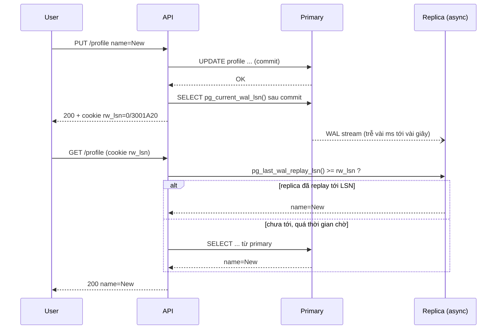
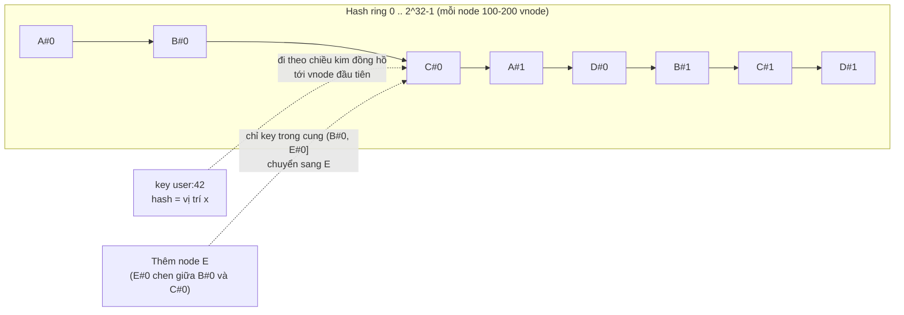

## Bối cảnh & vấn đề

Một sàn thương mại điện tử thêm hai read replica cho Postgres vì primary đã 80% CPU. Hôm sau, support nhận hàng loạt ticket: "Tôi vừa đổi địa chỉ giao hàng, bấm lưu, trang hiện lại địa chỉ cũ". Dữ liệu không mất: nó đã ghi vào primary, nhưng trang profile đọc từ replica, và replica chậm vài trăm mili giây. Cùng tuần, team data báo bảng `events` đã 4 TB và tăng 300 GB mỗi tháng; đề xuất là "shard theo `tenant_id`". Một tenant enterprise chiếm 40% traffic, nên shard đó nóng gấp mười các shard khác.

Hai câu chuyện là hai mặt của cùng một vấn đề: khi dữ liệu không còn nằm gọn trên một máy, bạn phải chọn **nhân bản** (replication: nhiều bản sao của cùng dữ liệu) và/hoặc **chia nhỏ** (partitioning/sharding: mỗi máy giữ một phần). Mỗi lựa chọn mang theo một loại bất thường: replication sinh ra **lag và stale read**, sharding sinh ra **hot shard và mất cross-shard query**. Bài này đi qua các khái niệm nền (CAP, PACELC), rồi từng kỹ thuật với số đo thật: replica Postgres có độ trễ, consistent hashing mô phỏng, và so sánh các loại ID trên Postgres 18.

## Khái niệm

### CAP

**CAP theorem** nói rằng khi có **network partition** (một nhóm node không liên lạc được với nhóm kia), một hệ thống phân tán phải chọn giữa **Consistency** (mọi đọc thấy ghi mới nhất, theo nghĩa linearizable) và **Availability** (mọi node còn sống đều trả lời). Partition không phải lựa chọn: mạng sẽ lỗi. Nên câu "chọn hai trong ba" là sai; câu đúng là "khi partition xảy ra, bạn từ chối phục vụ (giữ C) hay phục vụ dữ liệu có thể cũ/xung đột (giữ A)".

Ví dụ: hai datacenter mất kết nối. Hệ thống tồn kho chọn **CP**: datacenter không liên lạc được với leader từ chối ghi, vì bán vượt tồn kho tệ hơn báo lỗi. Hệ thống đếm like chọn **AP**: cả hai phía tiếp tục nhận like, sau khi mạng nối lại thì cộng gộp.

**Interview angle:** red flag là "tôi chọn hai trong ba". Câu trả lời mạnh nói CAP chỉ áp dụng lúc partition, và chọn **per use case**, không per hệ thống.

### PACELC

**PACELC** mở rộng CAP cho lúc **không có** partition: **if Partition, choose A or C; Else, choose Latency or Consistency**. Đây mới là trade-off bạn gặp hằng ngày: đọc từ replica gần (latency thấp, có thể stale) hay đọc từ leader/quorum (đúng, nhưng chậm hơn). Synchronous replication cho consistency nhưng mỗi commit phải chờ replica xác nhận; async replication commit nhanh nhưng có cửa sổ mất dữ liệu khi failover.

Ví dụ: "Postgres với async read replica là CP hay AP?" (follow-up câu 007). Như **hệ thống tổng thể**: ghi chỉ đi vào primary, nên khi partition cắt primary khỏi app thì không ghi được (giống C); nhưng đọc replica là chọn **latency over consistency** (EL), và failover sang replica async có thể mất ghi chưa replicate. Kleppmann chỉ ra rằng gán nhãn CP/AP cho một database thường gây hiểu lầm; hãy nói theo từng đường đọc/ghi.

### Replication và replication lag

**Replication** là giữ nhiều bản sao dữ liệu: một **leader/primary** nhận ghi, các **follower/replica** nhận luồng thay đổi (ở Postgres là WAL) và áp dụng lại. Mục đích: scale đọc, chịu lỗi (failover), backup không ảnh hưởng primary, đặt bản sao gần user.

Với **async replication** (mặc định phổ biến), primary commit xong là trả lời client, không chờ replica. Replica áp dụng thay đổi sau đó vài mili giây tới vài giây (hoặc lâu hơn khi replica bận, mạng chậm, query dài trên replica chặn replay). Khoảng chênh đó là **replication lag**, và mọi đọc từ replica trong khoảng đó thấy dữ liệu cũ.

### Read-your-writes

**Read-your-writes consistency** đảm bảo một user luôn thấy **ghi của chính họ**, dù người khác có thể thấy stale. Đây gần như luôn là yêu cầu UX tối thiểu. Các cách làm:

- **Đọc từ primary trong N giây sau khi user ghi**: sau khi ghi, đặt cookie/flag `recent_write_until = now + 5s`; middleware thấy flag thì route đọc của user đó vào primary. Hoạt động với nhiều pod sau load balancer vì flag nằm ở client (cookie) hoặc Redis, không ở memory pod.
- **Theo vị trí log (LSN/GTID)**: sau khi ghi, lấy LSN hiện tại của primary; đọc từ replica chỉ khi `pg_last_wal_replay_lsn()` của replica ≥ LSN đó, nếu không thì chờ có giới hạn hoặc fallback sang primary.
- **Trả dữ liệu mới ngay từ response của write** và cập nhật state ở client, nên trang không cần đọc lại.

Chỉ đọc replica cho dữ liệu chịu được stale (danh sách, báo cáo, search). Monitor lag và **loại replica chậm khỏi pool** khi lag vượt ngưỡng.

### Partitioning và sharding

**Partitioning** chia dữ liệu thành nhiều phần theo một **partition key**; khi các phần nằm trên nhiều máy thì gọi là **sharding**. Ba chiến lược:

- **Range** (theo `created_at`, theo dải `tenant_id`): range query hiệu quả (lấy dữ liệu tháng 9 chỉ đọc một shard), dễ archival theo thời gian. Nhược: ghi mới luôn dồn vào shard cuối (hot), phân bố lệch nếu key không đều.
- **Hash** (`hash(key) % N` hoặc consistent hashing): phân tán đều. Nhược: mất range query theo key (phải hỏi mọi shard), và với `% N` thì đổi N làm hầu hết key đổi chỗ.
- **Directory / lookup**: một bảng map `tenant → shard`. Linh hoạt nhất: di chuyển một tenant lớn sang shard riêng chỉ cần đổi một dòng. Nhược: thêm một dependency (bảng lookup phải được cache và HA).

**Hot shard** xảy ra khi một key (tenant enterprise, celebrity, SKU flash sale) nhận tải vượt một shard. Cách xử lý: tách key lớn ra shard riêng (directory), **salting** (ghi vào `key#0..9` rồi gộp khi đọc) cho tải ghi, cache cho tải đọc, chia nhỏ theo sub-key (`tenant_id, store_id`).

**Interview angle:** "Shard multi-tenant SaaS theo `tenant_id`? Một tenant chiếm 40% traffic thì sao?" — tenant đó cần shard riêng (hoặc silo), và trong tenant có thể chia tiếp theo sub-key; directory sharding cho phép làm điều đó mà không đổi hàm hash của mọi tenant khác.

### Consistent hashing và virtual nodes

Với `hash(key) % N`, thêm node thứ N+1 làm gần như **mọi key** đổi node (mô phỏng bên dưới: 80% key đổi chỗ khi đi từ 4 lên 5 node). Với cache, đó là cache miss toàn bộ; với storage, là di chuyển gần hết dữ liệu.

**Consistent hashing** đặt cả node và key lên một **vòng hash** (ví dụ 0 tới 2³² − 1). Key thuộc về node đầu tiên gặp được khi đi theo chiều kim đồng hồ từ vị trí của key. Thêm một node chỉ "cướp" phần vòng giữa nó và node đứng trước, nên chỉ khoảng **1/N** key di chuyển; bớt một node thì key của nó chuyển cho node kế tiếp.

Vấn đề của ring cơ bản: với ít điểm, các cung trên vòng dài ngắn rất khác nhau, nên tải lệch; và khi một node chết, **toàn bộ** tải của nó đổ lên **một** node kế tiếp. **Virtual nodes** (vnode) cho mỗi node vật lý nhiều điểm trên vòng (100–200): tải đều hơn, node mạnh được nhiều vnode hơn, và khi một node chết thì key của nó rải đều cho mọi node còn lại.

Dùng ở: Dynamo/Cassandra, client-side sharding của Memcached (ketama). **Redis Cluster** dùng ý tưởng gần giống nhưng khác cơ chế: 16.384 **hash slot** cố định (`CRC16(key) mod 16384`), mỗi node giữ một tập slot, resharding là di chuyển slot giữa các node. Hash tag `{...}` ép nhiều key vào cùng slot.

### ID trong hệ phân tán

ID tốt cần: duy nhất, sinh được ở nhiều nơi mà không phối hợp, và (tuỳ trường hợp) sắp được theo thời gian, gọn, khó đoán.

- **Auto-increment** (`bigint GENERATED ALWAYS AS IDENTITY`): đơn giản, 8 byte, tăng dần nên B-tree chỉ ghi vào trang cuối. Nhưng cần DB cấp (round trip, một nguồn duy nhất), lộ thông tin (`/orders/1042` cho biết bạn có bao nhiêu đơn), và gộp nhiều shard khó.
- **UUIDv4**: 122 bit ngẫu nhiên, sinh ở đâu cũng được. Nhưng chèn ngẫu nhiên vào B-tree: mỗi insert chạm một trang khác nhau, trang bị split ở giữa, index lớn hơn và **cần nhiều trang trong cache hơn**; khi index vượt RAM, mỗi insert có thể là một lần đọc đĩa.
- **UUIDv7** (RFC 9562, 2024): 48 bit Unix timestamp mili giây ở đầu + phần random (có thể kèm counter để đơn điệu trong cùng mili giây). Gần như tăng dần nên thân thiện với index như bigint, vẫn sinh phân tán được, 16 byte. Lộ thời điểm tạo (thường chấp nhận được). Postgres 18 có hàm `uuidv7()` built-in (verify theo version bạn dùng).
- **Snowflake** (Twitter): 64 bit = 41 bit timestamp ms (khoảng 69 năm từ một epoch tự chọn) + 10 bit machine id + 12 bit sequence (4.096 ID mỗi ms mỗi máy). Gọn (vừa `bigint`), sắp theo thời gian. Cần gán machine id duy nhất (ZooKeeper, config, lease) và xử lý **đồng hồ đi lùi**.

Lưu ý bảo mật: ID khó đoán **không thay thế** authorization check. Nếu API trả `/invoices/:id` mà không kiểm tra quyền, dùng UUID chỉ làm IDOR khó khai thác hơn chứ không hết lỗi.

### Multi-region: active-passive và active-active

**Active-passive**: một region nhận ghi, region kia giữ replica async và standby. Đơn giản, nhưng **RPO > 0** (failover mất vài giây dữ liệu chưa replicate) và **RTO** tính bằng phút (phát hiện, promote, đổi DNS). Failover phải được **diễn tập** định kỳ; failover chưa từng chạy thử thì hầu như chắc chắn hỏng vào ngày cần.

**Active-active**: cả hai region nhận ghi. User được phục vụ ở region gần, mất một region thì region kia nhận hết. Cái giá thật: **conflict** khi hai region cùng sửa một bản ghi. Last-write-wins đơn giản nhưng **sai với tiền và tồn kho** (mất một trong hai lần trừ kho); CRDT hợp với counter, set, nhưng không biểu diễn được "số dư không âm". Cách thực tế: **home region per entity**: mỗi tenant/user/SKU có một region "chủ" nhận ghi cho nó (single leader per key), region khác chuyển tiếp ghi về region chủ, còn đọc và phần stateless thì chạy ở mọi region.

## Cơ chế hoạt động

### Đường đi của ghi và đọc với replica



Mấu chốt: LSN phải được lấy **sau khi commit**. Lấy trong cùng câu lệnh ghi (ví dụ `RETURNING pg_current_wal_lsn()`) cho LSN **trước** commit record; replica có thể đã replay tới vị trí đó nhưng chưa áp dụng commit, nên kiểm tra "đã bắt kịp" trả true mà đọc vẫn ra dữ liệu cũ. Ví dụ bên dưới tái hiện đúng lỗi này.

### Consistent hashing ring



Khi thêm E, chỉ các key nằm trong cung mà vnode của E chiếm (trước đó thuộc vnode kế tiếp) di chuyển; mọi key khác giữ nguyên node. Khi B chết, mỗi vnode của B giao lại cung của nó cho vnode kế tiếp, và vì vnode của B rải khắp vòng nên tải của B chia cho A, C, D.

## Ví dụ thực tế

### Replica Postgres có độ trễ: stale read và read-your-writes theo LSN

Dựng primary + streaming replica Postgres 17 trong Docker (`pg_basebackup -R`), đặt `recovery_min_apply_delay = '2s'` trên replica để lag luôn khoảng 2 giây (thay cho một replica bận trong production). Node 24.21, pg 8.23:

```ts
await primary.query("UPDATE profile SET name='New Name' WHERE user_id=1");                    // autocommit
const { rows: [{ lsn }] } = await primary.query("SELECT pg_current_wal_lsn()::text AS lsn");  // LSN AFTER commit
console.log("t+0ms replica says:", (await replica.query("SELECT name FROM profile WHERE user_id=1")).rows[0].name);

async function readAfter(lsn: string, maxWaitMs = 3000) {
  const start = Date.now();
  while (Date.now() - start < maxWaitMs) {
    const { rows: [r] } = await replica.query(
      "SELECT pg_last_wal_replay_lsn() >= $1::pg_lsn AS caught_up, (SELECT name FROM profile WHERE user_id=1) AS name", [lsn]);
    if (r.caught_up) return `replica caught up after ${Date.now() - start}ms: ${r.name}`;
    await new Promise((x) => setTimeout(x, 100));
  }
  return `fallback to primary: ${(await primary.query("SELECT name FROM profile WHERE user_id=1")).rows[0].name}`;
}
console.log(await readAfter(lsn));
```

```text
t+0ms replica says: Old Name
replica caught up after 2050ms: New Name
replay lag on replica: PostgresInterval { seconds: 2, milliseconds: 68.004 }
```

Đọc ngay từ replica ra `Old Name`, đúng triệu chứng của câu 010. Đọc có điều kiện LSN chờ 2 giây rồi ra `New Name`. Trong production, `maxWaitMs` nên nhỏ (50–200 ms) và fallback sang primary, vì user không nên chờ 2 giây.

Lần chạy đầu tiên dùng `UPDATE ... RETURNING pg_current_wal_lsn()` và cho kết quả sai:

```text
t+0ms replica says: Old Name
replica caught up after 4ms: Old Name
```

LSN lấy trong câu lệnh là vị trí **trước** commit record, replica đã replay tới đó (record UPDATE) nhưng `recovery_min_apply_delay` giữ commit lại, nên "caught up" là true mà dữ liệu vẫn cũ. Lấy LSN bằng một câu lệnh riêng **sau** commit là đúng.

Cách đơn giản hơn cho follow-up "đọc từ primary 5 giây sau khi ghi, trong Node API sau load balancer" (minh hoạ):

```ts
app.use((req, res, next) => {
  const until = Number(req.signedCookies.rw_until ?? 0);
  req.db = Date.now() < until ? primaryPool : replicaPool;     // per-request routing, works on any pod
  next();
});
function markWrite(res: Response) {
  res.cookie("rw_until", String(Date.now() + 5_000), { signed: true, httpOnly: true, sameSite: "lax", maxAge: 5_000 });
}
```

Cookie nằm ở client nên pod nào nhận request cũng biết; không cần sticky session. Nếu user có nhiều thiết bị, cờ trong Redis theo `user_id` thay cho cookie.

### Consistent hashing: modulo so với ring, có và không có vnode

Mô phỏng 100.000 key, hash MD5 lấy 32 bit đầu, Node 24.21:

```ts
const modMoved = keys.filter((k) => h(k) % 4 !== h(k) % 5).length;   // 4 -> 5 nodes with modulo
class Ring { /* sorted array of { pos, node }, binary search for the first pos >= hash(key) */ }
for (const vn of [1, 10, 100, 200]) { /* share per node, % moved when adding E, where B's keys go when B dies */ }
```

```text
hash % N, 4 -> 5 nodes: moved 79.7% of keys
vnodes=  1 | share A B C D = 3.1% 1.3% 40.2% 55.4% | add E moves 17.3% | B dies -> its keys go to {"C":1332}
vnodes= 10 | share A B C D = 12.0% 39.9% 21.8% 26.3% | add E moves 24.9% | B dies -> its keys go to {"D":24890,"C":15053}
vnodes=100 | share A B C D = 25.7% 24.8% 25.2% 24.3% | add E moves 19.6% | B dies -> its keys go to {"D":4975,"C":10457,"A":9413}
vnodes=200 | share A B C D = 26.7% 26.4% 26.3% 20.5% | add E moves 18.9% | B dies -> its keys go to {"A":12191,"D":5266,"C":8992}
```

Ba điều đọc được: (1) modulo làm **80%** key đổi chỗ, đúng như lý thuyết (1 − 1/5). (2) Ring luôn chỉ di chuyển khoảng 1/5 key (17–25%) khi thêm node thứ năm, nhưng với **1 vnode** tải cực lệch (D giữ 55%, B giữ 1,3%), và khi B chết toàn bộ key của nó dồn sang **một** node (C). (3) Với **100 vnode**, mỗi node giữ 24–26%, và key của B rải cho cả A, C, D. Đó là lý do mọi triển khai thật dùng vnode.

### UUIDv4, UUIDv7 và bigint trên Postgres 18

Postgres 18.6 trong Docker với `shared_buffers = 32MB` (nhỏ cố ý để index vượt cache, giống bảng lớn trong production), chèn 5 triệu dòng mỗi bảng:

```sql
CREATE TABLE t_v4  (id uuid PRIMARY KEY DEFAULT gen_random_uuid(), payload int);
CREATE TABLE t_v7  (id uuid PRIMARY KEY DEFAULT uuidv7(), payload int);
CREATE TABLE t_seq (id bigint GENERATED ALWAYS AS IDENTITY PRIMARY KEY, payload int);
INSERT INTO t_v4(payload)  SELECT g FROM generate_series(1, 5000000) g;
INSERT INTO t_v7(payload)  SELECT g FROM generate_series(1, 5000000) g;
INSERT INTO t_seq(payload) SELECT g FROM generate_series(1, 5000000) g;
SELECT relname, pg_size_pretty(pg_relation_size(indexrelid)) AS pk_index_size
FROM pg_stat_user_indexes WHERE relname IN ('t_v4','t_v7','t_seq') ORDER BY relname;
```

```text
Time: 55535.119 ms (00:55.535)    -- t_v4
Time: 13317.409 ms (00:13.317)    -- t_v7
Time: 7152.236 ms (00:07.152)     -- t_seq
 relname | pk_index_size
---------+---------------
 t_seq   | 107 MB
 t_v4    | 195 MB
 t_v7    | 150 MB
```

UUIDv4 chậm hơn UUIDv7 **4,2 lần** và index lớn hơn 30%: chèn ngẫu nhiên làm mỗi insert chạm một trang lá khác, trang bị split ở giữa (chỉ đầy khoảng một nửa) và liên tục bị đẩy khỏi cache 32 MB. UUIDv7 gần với bigint vì chèn gần như tuần tự; nó vẫn lớn hơn bigint vì mỗi khoá 16 byte thay vì 8.

Một gotcha từ lần thử trước trên Postgres 17 với một hàm `uuid_v7()` tự viết (timestamp ms + 74 bit random, **không** có counter đơn điệu trong cùng mili giây), chèn 2 triệu dòng trong một câu lệnh: index ra 86 MB, **lớn hơn** UUIDv4 (77 MB). Trong một lần chèn hàng loạt, hàng trăm dòng rơi vào cùng một mili giây và có thứ tự ngẫu nhiên trong mili giây đó, nên trang cuối liên tục split 50/50 mà không bao giờ được lấp lại. Hàm `uuidv7()` của Postgres 18 dùng phần sub-millisecond để đơn điệu trong một backend nên không bị vậy (verify khi dùng thư viện sinh UUIDv7 ở app: chọn loại có monotonic counter).

### Snowflake và đồng hồ đi lùi

```ts
const EPOCH = 1_704_067_200_000n; // 2024-01-01T00:00:00Z
class Snowflake {
  private lastMs = -1n; private seq = 0n; private readonly machine: bigint; private readonly now: () => bigint;
  constructor(machineId: number, now: () => bigint = () => BigInt(Date.now())) {
    if (machineId < 0 || machineId > 1023) throw new Error("machineId must fit in 10 bits");
    this.machine = BigInt(machineId); this.now = now;
  }
  next(): bigint {
    let ms = this.now();
    if (ms < this.lastMs) throw new Error(`clock moved backwards by ${this.lastMs - ms} ms, refusing to generate`);
    if (ms === this.lastMs) {
      this.seq = (this.seq + 1n) & 0xfffn;                       // 12 bits: 4096 ids per ms per machine
      if (this.seq === 0n) { while (ms <= this.lastMs) ms = this.now(); }  // sequence exhausted: wait for next ms
    } else this.seq = 0n;
    this.lastMs = ms;
    return ((ms - EPOCH) << 22n) | (this.machine << 12n) | this.seq;
  }
}
```

```text
363876732450664448 { ts: '2026-10-01T02:36:13.519Z', machine: 7, seq: 0 }
363876732450664449 { ts: '2026-10-01T02:36:13.519Z', machine: 7, seq: 1 } sorted: true
years of ids in 41 bits: 69.7
NTP step back: clock moved backwards by 5 ms, refusing to generate
```

Follow-up câu 022 ("đồng hồ đi lùi thì sao?"): nếu generator cứ sinh tiếp, nó có thể sinh lại một timestamp đã dùng với sequence đã dùng, nghĩa là **trùng ID**. Các lựa chọn: từ chối sinh (như trên) và để caller retry; chờ cho tới khi đồng hồ vượt `lastMs` nếu lệch nhỏ (vài ms); hoặc dùng "logical clock" (tiếp tục từ `lastMs` thay vì đồng hồ thật). Cấu hình NTP ở chế độ slew (chỉnh từ từ) thay vì step giảm khả năng này.

## Trade-offs & lựa chọn thay thế

| Quyết định | Lựa chọn A | Lựa chọn B | Chọn A khi |
| --- | --- | --- | --- |
| Replication | Async | Sync (hoặc quorum) | Latency ghi quan trọng, chấp nhận RPO vài giây; B cho dữ liệu không được mất (tiền) với chi phí latency |
| Đọc sau ghi | Primary trong N giây (cookie/Redis) | Theo LSN/GTID | Đơn giản, đủ cho hầu hết UX; B khi cần chính xác và có nhiều replica |
| Sharding | Hash | Range | Phân tán đều, access theo key; B khi query theo khoảng (thời gian) và archival |
| Sharding multi-tenant | Directory (`tenant → shard`) | Hash `tenant_id` | Tenant kích thước rất khác nhau, cần di chuyển tenant lớn; B khi tenant đồng đều |
| Phân phối cache/key | Consistent hashing + vnode | Hash slots cố định (Redis Cluster) | Tự xây client-side sharding; B khi dùng Redis Cluster có sẵn |
| ID | UUIDv7 / Snowflake | bigint identity | Nhiều writer, sinh ở app, không muốn lộ số lượng; B khi một DB, cần gọn nhất |
| Multi-region | Active-passive | Active-active với home region | Đa số hệ thống; B khi cần latency thấp toàn cầu hoặc chịu mất region mà không dừng ghi |

Chọn thế nào: trì hoãn sharding lâu nhất có thể. Một primary Postgres tốt + read replica + cache + partition theo thời gian (partitioning trong một máy, không phải sharding) chịu được rất xa; sharding nhân độ phức tạp của mọi thứ (migration, cross-shard query, transaction, backup). Khi phải shard, chọn key theo access pattern chính và theo đơn vị cô lập tự nhiên (tenant, user), và dùng directory nếu kích thước các đơn vị chênh nhau lớn. Với ID, UUIDv7 là mặc định hợp lý cho hệ thống mới khi cần ID sinh ở app; bigint vẫn tốt nhất khi một DB là nguồn duy nhất.

## Edge cases & failure modes

- **Failover với async replication**: replica được promote thiếu các ghi cuối của primary cũ (RPO > 0). Nếu primary cũ sống lại và vẫn nhận ghi (split brain), dữ liệu phân nhánh. Cần fencing (STONITH, chặn primary cũ khỏi mạng/DNS) và quy trình reconcile.
- **Replica lag tăng đột ngột**: query dài trên replica xung đột với replay (Postgres huỷ query hoặc trì hoãn replay tuỳ `max_standby_streaming_delay`); bulk update trên primary sinh WAL lớn. Monitor lag và rút replica khỏi pool tự động.
- **Monotonic reads**: user đọc replica A (mới) rồi replica B (cũ hơn), thấy dữ liệu "đi lùi". Gắn user với một replica (sticky theo user) hoặc dùng LSN.
- **Cross-shard query và transaction**: báo cáo toàn hệ thống phải scatter-gather; transaction giữa hai shard cần saga hoặc 2PC. Thiết kế key để transaction thường gặp nằm trong một shard.
- **Resharding online**: di chuyển dữ liệu khi đang nhận ghi cần dual write hoặc CDC + cutover; với Redis Cluster là `MIGRATE` từng slot (client nhận `ASK`/`MOVED`).
- **Hot key sau khi shard**: hash phân tán đều **key**, không phân tán đều **tải**; một key hot vẫn nằm trên một shard.
- **Đồng hồ**: Snowflake và UUIDv7 dựa vào đồng hồ; máy có đồng hồ sai nhiều (VM vừa resume) sinh ID "từ tương lai" làm thứ tự sắp sai.

## Pitfalls

- ❌ "CAP: tôi chọn C và A" → ✅ partition là bắt buộc; chọn C hay A **khi partition**, và chọn per use case. Lúc bình thường, trade-off là latency vs consistency (PACELC).
- ❌ Đọc mọi thứ từ replica sau khi thêm replica → ✅ đọc replica cho dữ liệu chịu stale; read-your-writes cho dữ liệu user vừa ghi.
- ❌ Lấy LSN bằng `RETURNING pg_current_wal_lsn()` trong câu lệnh ghi → ✅ lấy sau commit bằng câu lệnh riêng.
- ❌ `hash(key) % N` cho cache cluster cần thêm/bớt node → ✅ consistent hashing với vnode, hoặc hash slot.
- ❌ Shard theo `tenant_id` bằng hash khi tenant chênh nhau 1.000 lần → ✅ directory sharding; tenant lớn có shard riêng.
- ❌ UUIDv4 làm primary key cho bảng ghi nhiều, lớn hơn RAM → ✅ UUIDv7 (có monotonic counter) hoặc bigint.
- ❌ Active-active với last-write-wins cho tồn kho/số dư → ✅ home region per entity, single writer per key.
- ❌ Failover chưa từng diễn tập → ✅ game day định kỳ, đo RTO/RPO thật.

## Tóm tắt

- CAP chỉ nói về lúc partition: chọn từ chối (C) hay phục vụ có thể cũ (A), per use case. PACELC thêm trade-off hằng ngày: latency hay consistency.
- Async replication sinh lag; read-your-writes bằng cờ "đọc primary N giây" (cookie/Redis) hoặc LSN lấy **sau** commit. Đo thật: đọc ngay ra dữ liệu cũ, chờ LSN 2 giây ra dữ liệu mới.
- Range sharding cho range query nhưng dễ hot; hash phân tán đều; directory linh hoạt cho tenant lớn. Hot shard xử lý bằng tách key lớn, salting, cache.
- `% N` di chuyển ~80% key khi thêm node; consistent hashing ~1/N; vnode làm tải đều và rải tải khi node chết (mô phỏng). Redis Cluster dùng 16.384 hash slot.
- UUIDv4 làm B-tree phân mảnh: chèn 5 triệu dòng chậm hơn UUIDv7 4,2 lần, index lớn hơn 30% (PG 18, đo thật). Snowflake gọn 64 bit nhưng phải xử lý machine id và đồng hồ đi lùi.
- Active-passive: đơn giản, RPO > 0, phải diễn tập. Active-active: conflict là cái giá thật; dữ liệu mạnh giữ single writer per key (home region).
