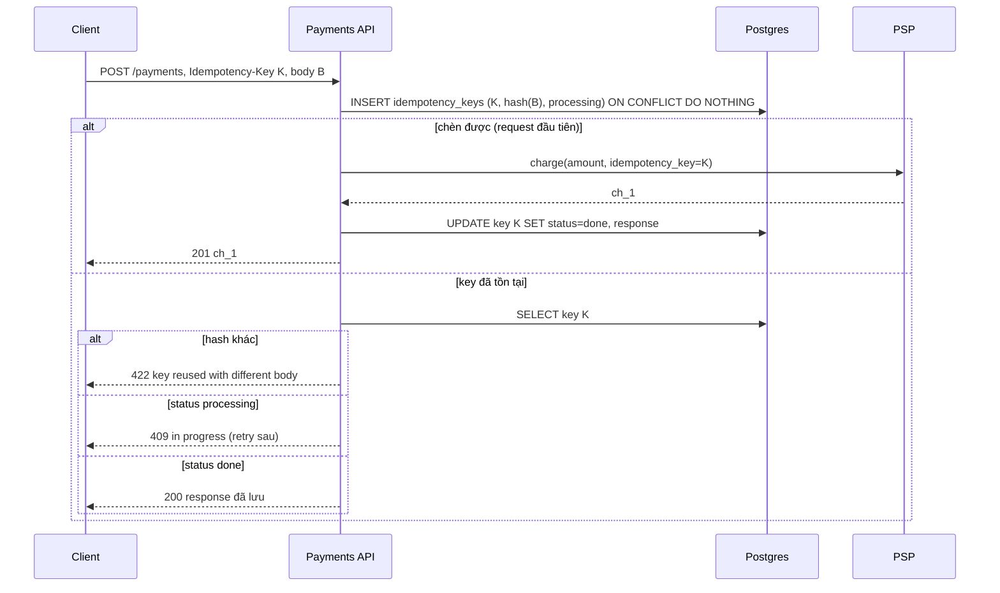
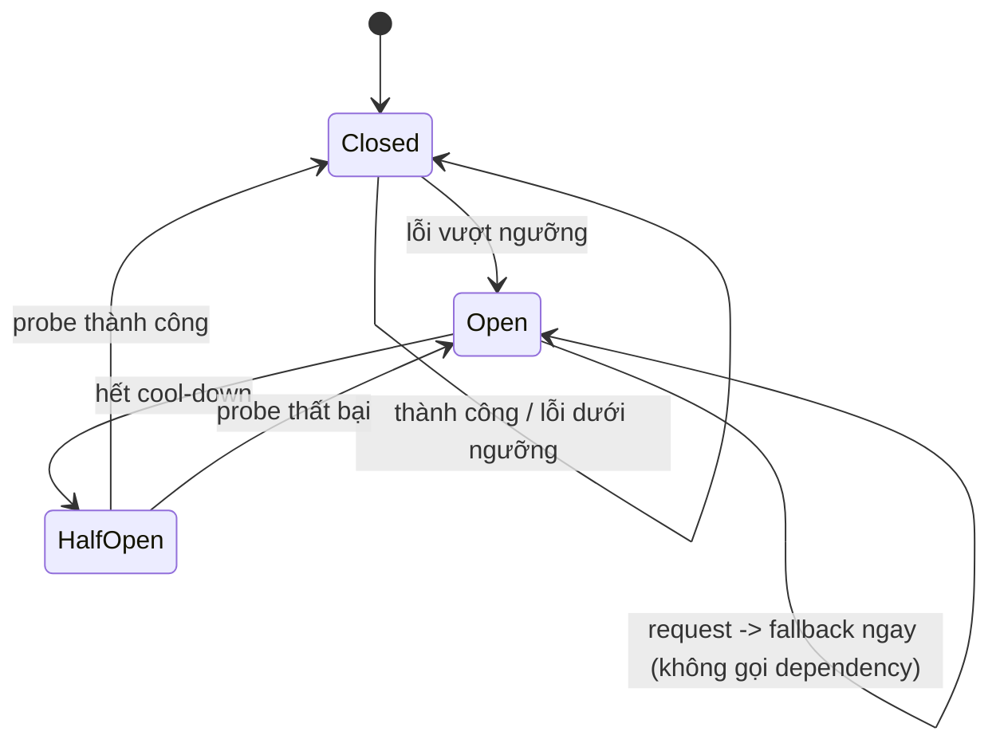

## Bối cảnh & vấn đề

Thứ Sáu đen tối của một shop online: payment provider (PSP) chậm, p99 từ 800 ms lên 25 giây. Client mobile có timeout 10 giây và tự retry 3 lần; API gateway cũng retry 2 lần; service checkout retry PSP 3 lần. Kết quả: mỗi lần user bấm "Thanh toán" sinh ra tới vài chục lời gọi tới PSP đang yếu, PSP càng chậm hơn, và một số khách bị **trừ tiền hai lần** vì endpoint `POST /payments` kiểm tra idempotency key bằng `SELECT` trước rồi mới charge. Trong lúc đó trang sản phẩm cũng chết, dù nó không liên quan tới thanh toán, vì widget "sản phẩm gợi ý" gọi đồng bộ một recommendation service đang treo và chiếm hết thread pool.

Mọi thứ trong câu chuyện đều là lựa chọn thiết kế, không phải xui xẻo: retry ở nhiều tầng không có budget, idempotency có race, không có timeout/circuit breaker cho dependency không quan trọng, và không ai định nghĩa trang sản phẩm nên **degrade** thế nào. Bài này gom các kỹ thuật làm cho hệ thống phân tán chịu được thất bại: queue để tách đồng bộ, idempotency để retry an toàn, timeout/retry/jitter/circuit breaker để không khuếch đại sự cố, idempotent consumer để có effectively-once, và SLO để biết nên đầu tư vào đâu.

## Khái niệm

### Sync và async: khi nào đặt queue

Gọi **đồng bộ** (HTTP/gRPC) nghĩa là người gọi chờ kết quả. Đơn giản, dễ debug, có kết quả ngay; nhưng hai bên **cùng sống cùng chết**: callee chậm thì caller chậm, callee chết thì caller lỗi, và tải của caller đổ thẳng vào callee.

Đặt **queue** ở giữa (SQS, RabbitMQ, BullMQ, Kafka) khi: người gọi **không cần kết quả ngay** để trả lời user (gửi email, cập nhật search index, tạo thumbnail); cần **hấp thụ burst** (flash sale nhận 40.000 đơn trong một phút, worker xử lý 2.000/giây); consumer chậm hoặc không ổn định (API bên thứ ba có rate limit); cần **fan-out** một sự kiện tới nhiều consumer; cần retry có kiểm soát với **DLQ** (dead letter queue: nơi giữ message thất bại sau N lần để người xem xét).

Giữ đồng bộ khi: cần kết quả để trả cho user (giá, kiểm tra tồn kho, xác thực), chuỗi ngắn, latency quan trọng.

Chi phí của async: **eventual consistency** (user không thấy kết quả ngay), **at-least-once** delivery nên consumer phải idempotent, **ordering** chỉ có trong một partition/queue, phải monitor **lag**, và debug khó hơn (cần trace id đi theo message).

Ví dụ hiển thị trạng thái cho việc đã async hoá (follow-up câu 013): `POST /exports` trả `202 Accepted` + `Location: /exports/123`; client poll `GET /exports/123` (status `queued → running → done` + URL tải), hoặc server đẩy qua WebSocket/SSE/email khi xong.

### Idempotency

Một thao tác **idempotent** nếu thực hiện nhiều lần cho kết quả như một lần. `GET`, `PUT` (ghi đè toàn bộ), `DELETE` theo id về ngữ nghĩa là idempotent; `POST /payments` thì không: gọi hai lần là hai lần trừ tiền. Mà retry là không tránh được: client timeout trong khi server vẫn đang xử lý, mạng rớt sau khi server commit nhưng trước khi response tới, user bấm hai lần, queue giao lại message.

**Idempotency key** biến một POST thành an toàn để retry: client sinh một UUID cho mỗi **ý định** (một lần bấm "Thanh toán", không phải mỗi lần gửi HTTP) và gửi trong header `Idempotency-Key`. Server lưu `(tenant_id, key) → request hash, status, response` với **unique constraint**:

1. **Claim key trước**: `INSERT ... status='processing'`; nếu trùng (unique violation / `ON CONFLICT DO NOTHING` không chèn được) thì đây là retry.
2. Retry: nếu `request_hash` khác → **422** (key bị dùng lại cho request khác); nếu đang `processing` → **409** (hoặc chờ ngắn rồi trả kết quả); nếu `done` → trả **response đã lưu**.
3. Người claim được thì xử lý, lưu response, đặt `done`.
4. Key có TTL (Stripe giữ ít nhất 24 giờ, verify theo docs hiện hành) và được dọn định kỳ.

Hai chi tiết quyết định: **claim phải xảy ra trước side effect** (trước khi gọi PSP), và **truyền key xuống downstream** (Stripe nhận `Idempotency-Key`) để chính PSP cũng dedupe. Nếu có thể, ghi idempotency record và business row **trong cùng transaction**.

**Interview angle:** follow-up "request đầu crash sau khi trừ tiền nhưng trước khi lưu response, retry thì sao?" — key vẫn ở `processing`, retry nhận 409; một **reconciliation job** tìm key `processing` quá N phút, hỏi PSP theo reference id (hoặc chính idempotency key) để biết đã charge chưa, rồi hoàn tất hoặc giải phóng key. Không bao giờ tự charge lại bằng key mới.

### Timeout, retry, backoff, jitter

**Timeout** ở mọi lời gọi mạng, gồm connect timeout và request timeout. Không có timeout, một dependency treo giữ connection/thread của bạn mãi. Timeout của callee phải **nhỏ hơn** timeout của caller (deadline propagation): nếu gateway cắt sau 10 giây mà service bên trong chờ PSP 30 giây, service vẫn làm việc vô ích 20 giây sau khi không ai chờ kết quả.

**Retry** chỉ cho lỗi **tạm thời** (timeout, 503, connection reset, 429 có `Retry-After`) và chỉ cho request **idempotent** (hoặc có idempotency key). Không retry 400/401/403/422: lặp lại không làm chúng thành công.

**Exponential backoff** giãn thời gian giữa các lần thử (100 ms, 200 ms, 400 ms, ...) để dependency có thời gian hồi phục. **Jitter** thêm ngẫu nhiên vào khoảng chờ; không có jitter, 1.000 client lỗi cùng lúc sẽ retry **cùng lúc** ở mọi lần, tạo ra các đợt sóng đồng bộ. "Full jitter" (`sleep = random(0, min(cap, base × 2^attempt))`) là lựa chọn AWS khuyến nghị.

**Retry budget**: giới hạn tỷ lệ retry trên tổng traffic (ví dụ ≤ 10%), và **chỉ retry ở một tầng** (thường là tầng gần dependency nhất hoặc tầng ngoài cùng, không phải mọi tầng). Retry ở N tầng nhân lên theo cấp số nhân.

### Circuit breaker và bulkhead

**Circuit breaker** theo dõi lỗi khi gọi một dependency. Ở trạng thái **closed**, request đi qua bình thường. Khi lỗi vượt ngưỡng (5 lỗi liên tiếp, hoặc 50% lỗi trong cửa sổ 10 giây), breaker chuyển sang **open**: mọi lời gọi **fail fast** và trả fallback ngay, không chạm dependency. Sau một khoảng cool-down, breaker sang **half-open** và cho một (vài) request thử; thành công thì về closed, thất bại thì open lại.

Lợi ích kép: caller không phí thread/connection chờ một dependency chắc chắn lỗi, và dependency có khoảng lặng để hồi phục thay vì bị đánh liên tục.

**Bulkhead** (vách ngăn tàu) cô lập tài nguyên theo dependency: mỗi dependency một connection pool / concurrency limit riêng. Recommendation service treo chỉ chiếm hết pool của nó (ví dụ 20 slot), không chiếm hết event loop / thread pool chung của trang sản phẩm.

### At-least-once, exactly-once và effectively-once

Có ba ngữ nghĩa giao nhận: **at-most-once** (có thể mất, không bao giờ trùng), **at-least-once** (không mất, có thể trùng), **exactly-once** (đúng một lần). Trong hệ phân tán, "đã làm xong việc" và "đã ghi nhận là xong" không thể atomic **xuyên hai hệ thống**: consumer có thể ghi DB xong rồi crash trước khi commit offset, và broker sẽ giao lại.

**Kafka exactly-once** (idempotent producer + transactions + `read_committed`) là có thật, nhưng chỉ trong phạm vi **read-process-write bên trong Kafka**: đọc từ topic A, ghi vào topic B và commit offset trong một transaction Kafka. Khi side effect ra **ngoài** Kafka (ghi Postgres, gửi email, gọi PSP), Kafka không thể đưa side effect đó vào transaction của nó, và bạn quay về at-least-once.

**Effectively-once** = at-least-once delivery + **idempotent consumer**: dedupe theo `event_id` (bảng `processed_events` có unique key, ghi **trong cùng transaction** với thay đổi nghiệp vụ), hoặc upsert theo version, và commit offset **sau** khi xử lý. Phía producer, **transactional outbox** tránh dual write: ghi business row và event vào bảng `outbox` trong cùng transaction DB, một relay (polling hoặc CDC như Debezium) đẩy outbox lên broker. Chi tiết Kafka ở track Messaging.

### SLI, SLO, error budget và degradation

**SLI** là chỉ số đo được từ góc nhìn user ("tỷ lệ request checkout trả 2xx trong 1 giây"); **SLO** là mục tiêu cho SLI ("99,5% trong 30 ngày"); **error budget** là phần còn lại (0,5% ≈ 3,6 giờ/tháng). Budget còn nhiều thì release nhanh; budget cạn thì dừng tính năng mới và đầu tư reliability. SLO đặt theo **hành trình user**, không theo CPU hay "server sống".

Từ SLO, phân loại dependency: **critical** (DB, payment cho checkout) và **non-critical** (recommendation, review, chat widget). Dependency non-critical **bắt buộc** có timeout ngắn + fallback (ẩn widget, dữ liệu cache, danh sách mặc định). Có **degradation plan**: read-only mode khi DB primary gặp sự cố, tắt tính năng bằng feature flag, ghi vào queue thay vì đồng bộ, trang tĩnh fallback. Observability đi kèm: RED (rate, errors, duration) cho service, USE (utilization, saturation, errors) cho tài nguyên, trace id xuyên service, alert theo **triệu chứng** user thấy (SLO burn rate), không theo nguyên nhân.

## Cơ chế hoạt động

### Luồng idempotency claim-first



Đi qua từng nhánh: request đầu tiên claim được key (unique constraint là trọng tài, không phải `SELECT`), nên chỉ nó được gọi PSP. Request trùng đến **trong khi** request đầu đang xử lý thấy `processing` và nhận 409; client retry sau vài trăm ms sẽ thấy `done` và nhận đúng response cũ. Request dùng lại key với body khác (bug ở client) bị từ chối thay vì trả nhầm kết quả của request khác.

### Circuit breaker



Trạng thái open là nơi breaker tạo giá trị: caller trả fallback trong micro giây thay vì chờ timeout, và dependency không nhận tải. Half-open chỉ cho một probe đi qua để tránh "đàn" request ập vào đúng lúc dependency vừa hồi phục.

## Ví dụ thực tế

### Double charge: check-then-act so với claim-first

Postgres 17, pg 8.23, Node 24.21. PSP giả lập mất 200 ms và đếm số lần charge. Hai request cùng `Idempotency-Key` đến cùng lúc (double click, hoặc client retry vì timeout):

```ts
// buggy: check-then-act (the snippet from question 025)
async function payBuggy(key: string, amount: number) {
  const ex = await db.query("SELECT * FROM payment WHERE idempotency_key=$1", [key]);
  if (ex.rowCount) return { status: 200, body: ex.rows[0] };
  const ch = await psp.charge(amount);
  try { const r = await db.query("INSERT INTO payment(idempotency_key, charge_id) VALUES ($1,$2) RETURNING *", [key, ch.id]); return { status: 201, body: r.rows[0] }; }
  catch (e) { return { status: 500, body: (e as Error).message }; }
}
// fixed: claim the key first, then charge
async function payFixed(tenant: string, key: string, body: { amount: number }) {
  const hash = createHash("sha256").update(JSON.stringify(body)).digest("hex");
  const claim = await db.query(`INSERT INTO idempotency_keys(tenant_id, key, request_hash, status) VALUES ($1,$2,$3,'processing')
    ON CONFLICT DO NOTHING RETURNING key`, [tenant, key, hash]);
  if (!claim.rowCount) {
    const { rows: [k] } = await db.query("SELECT * FROM idempotency_keys WHERE tenant_id=$1 AND key=$2", [tenant, key]);
    if (k.request_hash !== hash) return { status: 422, body: "key reused with a different body" };
    if (k.status === "processing") return { status: 409, body: "request with this key is in progress" };
    return { status: 200, body: k.response };
  }
  const ch = await psp.charge(body.amount);          // pass the key to the PSP too in real life
  const response = { chargeId: ch.id, amount: body.amount };
  await db.query("UPDATE idempotency_keys SET status='done', response=$3 WHERE tenant_id=$1 AND key=$2", [tenant, key, response]);
  return { status: 201, body: response };
}
```

```text
buggy : [
  '201 {"id":1,"idempotency_key":"a3ec815b-a180-424e-bf2f-b7db66fd4d7e","charge_id":"ch_1"}',
  '500 duplicate key value violates unique constraint "payment_idem'
] charges = 2
fixed : [
  '201 {"chargeId":"ch_1","amount":500}',
  '409 "request with this key is in progress"'
] charges = 1
retry later: 200 {"amount":500,"chargeId":"ch_1"} charges = 1
same key, other body: 422 key reused with a different body
```

Bản lỗi có unique constraint trên `idempotency_key`, nhưng constraint chỉ chặn ở bước `INSERT`, **sau khi** đã charge: khách bị trừ tiền hai lần và request thứ hai còn nhận 500. Đây chính là flaw của câu 025. Bản sửa dùng unique constraint làm **trọng tài trước side effect**: một charge, request trùng nhận 409, retry sau nhận đúng response cũ, dùng lại key với body khác nhận 422.

### Retry khuếch đại và jitter

```ts
const withRetry = (fn: () => Promise<unknown>, retries: number) => async () => {
  for (let i = 0; ; i++) { try { return await fn(); } catch (e) { if (i === retries) throw e; } }
};
const service = withRetry(db, 3), api = withRetry(service, 3), gateway = withRetry(api, 3);
```

```text
1 user request, 3 layers x (1+3 tries) -> db calls = 64
retry only at one layer -> db calls = 4
peak calls in one 100ms window, retry #1 / #2 / #3 / #4 / #5:
  fixed 1s             1000 / 1000 / 1000 / 1000 / 1000
  exponential, no jit  1000 / 1000 / 1000 / 1000 / 1000
  exp + full jitter    1000 / 507 / 243 / 146 / 82
```

Câu follow-up của 023: ba tầng, mỗi tầng 1 lần thử + 3 lần retry, thì một request của user thành **4³ = 64** lời gọi tới DB đang chết. Chỉ retry ở một tầng: 4. Phần thứ hai mô phỏng 1.000 client cùng lỗi lúc t = 0: với khoảng chờ cố định hoặc exponential **không jitter**, cả 1.000 lần retry rơi vào **cùng một cửa sổ 100 ms** ở mọi lần thử (backoff chỉ dời đợt sóng, không làm nó nhỏ đi). Với full jitter, đợt retry thứ ba chỉ còn đỉnh 243, thứ năm 82: tải được rải ra.

### Circuit breaker với fallback

```ts
type State = "closed" | "open" | "half-open";
class CircuitBreaker {
  state: State = "closed"; private failures = 0; private openedAt = 0;
  private readonly threshold: number; private readonly coolDownMs: number; private readonly now: () => number;
  constructor(threshold = 3, coolDownMs = 1000, now = () => Date.now()) { this.threshold = threshold; this.coolDownMs = coolDownMs; this.now = now; }
  async call<T>(fn: () => Promise<T>, fallback: () => T): Promise<T> {
    if (this.state === "open") {
      if (this.now() - this.openedAt < this.coolDownMs) return fallback();   // fail fast
      this.state = "half-open";                                                // let one probe through
    }
    try { const v = await fn(); this.failures = 0; this.state = "closed"; return v; }
    catch { this.failures++; if (this.state === "half-open" || this.failures >= this.threshold) { this.state = "open"; this.openedAt = this.now(); } return fallback(); }
  }
}
```

```text
t=   0 dep down         -> fallback: hide widget  state=closed    dependency calls=1
t=   0 dep down         -> fallback: hide widget  state=closed    dependency calls=2
t=   0 dep down         -> fallback: hide widget  state=open      dependency calls=3
t=   0 dep down         -> fallback: hide widget  state=open      dependency calls=3
t=   0 dep down         -> fallback: hide widget  state=open      dependency calls=3
t=1200 probe (still down) -> fallback: hide widget  state=open      dependency calls=4
t=2300 probe (recovered) -> recommendations        state=closed    dependency calls=5
t=2300 normal           -> recommendations        state=closed    dependency calls=6
```

Sau 3 lỗi, breaker mở và hai request tiếp theo không chạm dependency (số lời gọi đứng ở 3). Sau cool-down, một probe đi qua; còn lỗi thì mở lại, khỏi thì đóng. Đây là trả lời cho follow-up câu 054: khi recommendation service chết, trang sản phẩm **ẩn widget** (fallback) trong vài micro giây, phần còn lại của trang vẫn render. Test hành vi đó bằng fault injection (dependency trả lỗi/treo trong môi trường staging, hoặc chaos test), assert trang vẫn trả 200 trong SLO latency. Trong production, dùng thư viện có sẵn (ví dụ opossum cho Node) thay vì tự viết; đoạn trên để thấy cơ chế.

### Idempotent consumer khi broker giao lại

Consumer cộng điểm cho user, xử lý e1, e2 rồi crash **trước khi commit offset**, broker giao lại e1, e2:

```ts
async function idempotent(e: { id: string; user: string; delta: number }) {
  const c = await db.connect();
  try { await c.query("BEGIN");
    const fresh = await c.query("INSERT INTO processed_event VALUES ('points', $1) ON CONFLICT DO NOTHING", [e.id]);
    if (fresh.rowCount) await c.query("UPDATE account SET points = points + $2 WHERE id=$1", [e.user, e.delta]);
    await c.query("COMMIT"); return fresh.rowCount ? "applied" : "skipped (dup)";
  } finally { c.release(); }
}
```

```text
naive consumer after redelivery     : points = 30 (expected 15)
idempotent consumer after redelivery: e1:applied e2:applied e1:skipped (dup) e2:skipped (dup) points = 15
```

Đây là follow-up câu 040: ghi DB rồi crash trước commit offset nghĩa là message được xử lý lại. Consumer ngây thơ cộng hai lần. Consumer idempotent ghi `event_id` vào `processed_event` **trong cùng transaction** với thay đổi nghiệp vụ: hoặc cả hai commit, hoặc không gì cả; lần giao lại thấy event đã xử lý và bỏ qua.

## Trade-offs & lựa chọn thay thế

| Quyết định | Lựa chọn A | Lựa chọn B | Chọn A khi |
| --- | --- | --- | --- |
| Giao tiếp | Sync HTTP/gRPC | Async queue/event | Cần kết quả ngay, chuỗi ngắn; B khi burst, fan-out, consumer chậm |
| Idempotency store | Bảng DB cùng transaction với business row | Redis `SET NX` | Side effect ghi DB, cần durability; B khi chỉ dedupe ngắn hạn, chấp nhận mất khi Redis restart |
| Phản hồi request trùng đang xử lý | 409 ngay | Chờ (poll) tới khi xong rồi trả | Client biết retry; B khi muốn trải nghiệm "trong suốt" và xử lý nhanh |
| Retry ở đâu | Một tầng (gần dependency) | Mọi tầng | Gần như luôn A; B dẫn tới retry storm |
| Backoff | Exponential + full jitter | Cố định | Luôn A cho lỗi tạm thời ở quy mô lớn |
| Effectively-once | Dedupe table cùng transaction | Upsert theo version/natural key | Thao tác không tự idempotent (cộng điểm); B khi ghi là "set state" có version |
| Event từ DB ra broker | Transactional outbox | Dual write (DB rồi publish) | Luôn A khi event phải khớp với DB; B mất event khi crash giữa hai bước |

Chọn thế nào: mặc định đồng bộ cho đường đi cần trả lời user, async cho mọi thứ còn lại. Idempotency key trên **mọi** POST có side effect tiền bạc hoặc tạo tài nguyên. Retry chỉ ở một tầng, có backoff + jitter + budget, và chỉ cho lỗi tạm thời. Mọi dependency non-critical có timeout + fallback (+ breaker khi tải lớn). Mọi consumer coi như at-least-once và idempotent.

## Edge cases & failure modes

- **Key `processing` mãi mãi** vì process crash giữa chừng: cần TTL cho trạng thái processing và reconciliation hỏi downstream (PSP) trạng thái thật trước khi giải phóng hoặc hoàn tất.
- **Client sinh key mới cho mỗi lần retry**: idempotency vô hiệu. Key phải gắn với ý định (lưu trong state của form/cart), không với lần gửi HTTP.
- **Key không có phạm vi tenant/user**: hai tenant tình cờ dùng cùng key (hoặc attacker đoán key) nhận response của nhau. Khoá chính `(tenant_id, key)` và kiểm tra key thuộc user hiện tại.
- **Timeout không phải thất bại**: PSP timeout nghĩa là "không biết". Retry bằng **cùng** key hoặc hỏi trạng thái, không tạo charge mới ([bài 9](/tracks/system-design/learn/checkout-payments)).
- **Retry storm khi dependency hồi phục**: hàng nghìn request đang chờ ập vào cùng lúc. Jitter, breaker half-open chỉ cho vài probe, và rate limit ở phía callee.
- **Poison message**: một message luôn làm consumer crash, bị giao lại vô hạn và chặn partition. Giới hạn số lần thử, chuyển DLQ, alert.
- **Ordering khi retry**: message B thành công trước khi A được retry thành công; consumer phải chịu được (version, state machine) hoặc xử lý tuần tự theo key.
- **Breaker cấu hình sai**: ngưỡng quá thấp mở breaker vì vài lỗi lẻ tẻ; mở breaker cho dependency **critical** mà không có fallback chỉ đổi lỗi chậm thành lỗi nhanh (vẫn tốt hơn, nhưng phải biết).

## Pitfalls

- ❌ `SELECT` key rồi mới xử lý → ✅ `INSERT ... ON CONFLICT DO NOTHING` (claim) trước side effect; unique constraint là trọng tài.
- ❌ Không truyền idempotency key xuống PSP → ✅ dùng cùng key (hoặc key dẫn xuất) cho downstream để dedupe hai đầu.
- ❌ Retry ở mọi tầng, không jitter → ✅ một tầng, exponential backoff + full jitter, retry budget.
- ❌ Retry cả lỗi 4xx và request không idempotent → ✅ chỉ lỗi tạm thời, chỉ request idempotent/có key.
- ❌ Gọi đồng bộ dependency non-critical không timeout → ✅ timeout ngắn + fallback + bulkhead; trang chính vẫn sống.
- ❌ "Kafka exactly-once nên consumer không cần idempotent" → ✅ side effect ngoài Kafka luôn là at-least-once; dedupe theo event id trong cùng transaction.
- ❌ Ghi DB rồi publish event (dual write) → ✅ transactional outbox.
- ❌ SLO theo CPU/uptime server → ✅ SLO theo hành trình user, alert theo burn rate.

## Tóm tắt

- Queue khi không cần kết quả ngay, cần hấp thụ burst, fan-out hoặc retry có kiểm soát; cái giá là eventual consistency, at-least-once và lag phải monitor.
- Idempotency-Key: claim bằng unique constraint **trước** side effect; trùng → 422 (body khác) / 409 (đang xử lý) / response đã lưu; truyền key xuống PSP. Check-then-act tái hiện double charge (2 charge), claim-first chỉ 1.
- Timeout mọi lời gọi, nhỏ hơn timeout của caller; retry chỉ lỗi tạm thời, một tầng, backoff + full jitter. Ba tầng × 4 lần thử = 64 lời gọi DB.
- Circuit breaker: closed → open (fail fast + fallback) → half-open (probe); bulkhead cô lập tài nguyên theo dependency.
- Kafka exactly-once chỉ trong read-process-write nội bộ Kafka; effectively-once = at-least-once + idempotent consumer (dedupe cùng transaction) + outbox ở producer.
- SLO theo hành trình user, error budget quyết định tốc độ release; dependency non-critical luôn có fallback; có degradation plan.
