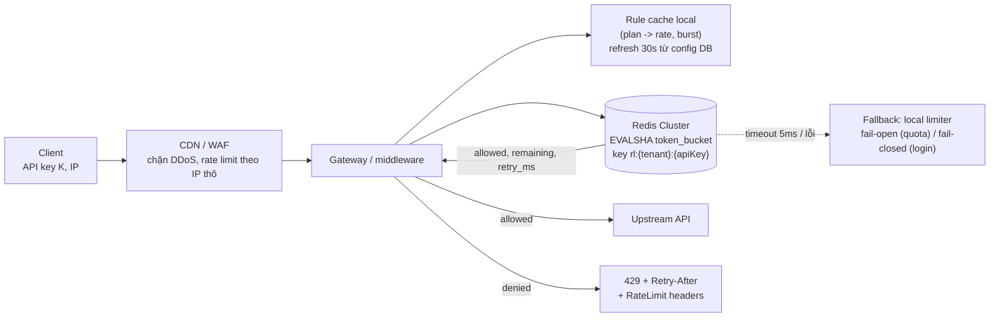
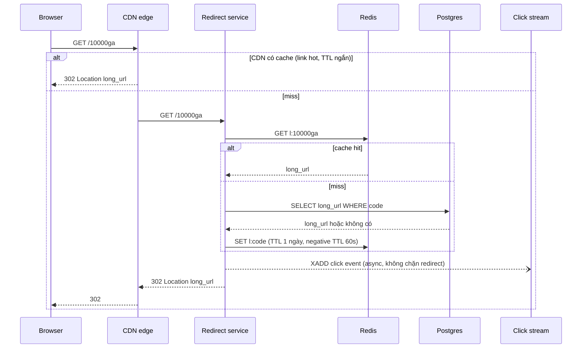

## Bối cảnh & vấn đề

Một public API cho phép mỗi API key 100 request/phút. Rate limiter viết trong 10 dòng: đọc counter từ Redis, nếu dưới 100 thì ghi lại counter + 1. Trong load test với một client tuần tự, nó chặn đúng ở request 101. Một tuần sau khi lên production, một khách hàng chạy 50 worker song song và vượt quota gấp năm lần mà không bị chặn; cùng lúc, một khách khác than bị throttle ở 80% quota. Cả hai triệu chứng đến từ cùng một đoạn code: **race condition** khi đọc-sửa-ghi không atomic, và **fixed window** cho burst gấp đôi ở ranh giới phút.

URL shortener là bài toán "đơn giản" thứ hai mà interviewer dùng để đo độ sâu: ai cũng vẽ được `code → long_url`, nhưng câu hỏi thật nằm ở **key generation** (không trùng, không đoán được, không cần một DB tập trung cho mỗi lần tạo), **redirect path** (p99 dưới 50 ms cho một link viral 100.000 lần/giây), và các lựa chọn nhỏ có hệ quả lớn (301 hay 302).

Bài này làm hai bài toán từ đầu tới cuối với code chạy thật: Redis 8.10.2, ioredis 6.0, Postgres 17, Node 24.21.

## Khái niệm

### Năm thuật toán rate limit

**Fixed window counter**: đếm request trong cửa sổ cố định (phút 12:00, phút 12:01). Một counter mỗi cửa sổ, cực rẻ, dễ giải thích. Nhược điểm: ở ranh giới, client có thể dùng hết quota trong giây cuối của phút này và hết quota tiếp trong giây đầu phút sau, tức **gấp đôi** quota trong 2 giây.

**Sliding log**: lưu timestamp từng request (ví dụ Redis sorted set), mỗi lần kiểm tra xoá timestamp cũ hơn cửa sổ rồi đếm. Chính xác tuyệt đối, nhưng bộ nhớ tỷ lệ với số request (100 request/phút × 1 triệu key = 100 triệu phần tử).

**Sliding window counter**: giữ counter của cửa sổ hiện tại và cửa sổ trước, ước lượng số request trong 60 giây gần nhất bằng nội suy `prev × (phần còn lại của cửa sổ trước) + current`. Gần chính xác (giả định request ở cửa sổ trước phân bố đều), chỉ hai counter mỗi key.

**Token bucket**: bucket dung lượng `b` token, được nạp `r` token/giây. Mỗi request lấy một token; hết token thì từ chối. Cho phép **burst** tới `b` nhưng trung bình dài hạn là `r`. State chỉ là `{tokens, last_refill}`. Phổ biến nhất cho API (AWS API Gateway, Stripe dùng biến thể này).

**Leaky bucket**: request vào hàng đợi, được "rò" ra với tốc độ đều. Làm mượt output (hợp khi bảo vệ một downstream chỉ chịu tốc độ đều), nhưng thêm latency (request chờ trong hàng) và hàng đầy thì từ chối.

**Interview angle:** chọn token bucket cho API public (burst hợp lý, trung bình chặt), sliding window counter khi cần "N mỗi phút" dễ giải thích cho khách hàng, leaky bucket khi bảo vệ downstream cần tốc độ đều.

### Atomicity trong Redis

Mọi thuật toán trên đều là **read-check-update**. Nếu đọc và ghi là hai lệnh riêng, nhiều request đồng thời cùng đọc `count = 50`, cùng thấy dưới ngưỡng, cùng ghi `51`: đếm thiếu, cho qua quá nhiều. Redis thực thi **từng lệnh** atomic (single-threaded cho việc thực thi lệnh), nên có hai cách đúng:

- Dùng lệnh vốn atomic: `INCR` trả về giá trị **sau khi** tăng, nên mỗi request nhận một số khác nhau; so sánh số đó với ngưỡng. `EXPIRE` đặt khi `INCR` trả 1 (hoặc dùng `SET key 0 EX 60 NX` trước rồi `INCR`).
- Dùng **Lua script** (`EVAL`/`EVALSHA`, hoặc Redis Functions): cả script chạy atomic, không lệnh nào khác chen vào giữa. Đây là cách duy nhất để làm token bucket hoặc sliding window counter (cần đọc nhiều giá trị, tính, rồi ghi) mà không race.

`MULTI/EXEC` không giải được read-check-write vì các lệnh trong transaction không đọc được kết quả của nhau trước khi `EXEC`; muốn dùng thì phải `WATCH` + retry (optimistic), phức tạp và chậm hơn Lua.

### Fail-open và fail-closed

Khi Redis của rate limiter chết hoặc chậm, middleware phải chọn: **fail-open** (cho request qua, log + alert) hay **fail-closed** (từ chối). Không có đáp án chung: quota business của API public nên fail-open (Redis chết không nên làm sập API của mọi khách); endpoint login/OTP chống brute force nên fail-closed hoặc fallback sang limiter local chặt hơn, vì mở cửa lúc đó là đúng điều attacker muốn. Dù chọn gì, gọi Redis phải có **timeout ngắn** (vài ms), nếu không rate limiter trở thành nguồn latency.

### URL shortener: key generation

Có ba họ cách sinh short code:

- **Counter + base62**: một ID tăng dần, đổi sang base62. Không bao giờ trùng, code ngắn nhất có thể. Nhưng một counter tập trung là bottleneck và SPOF; cách tránh là **cấp ID theo block** (mỗi node xin 1.000 ID một lần từ DB/ZooKeeper, dùng dần trong memory). Nhược: code **đoán được** (liên tiếp), lộ số lượng link; không hợp cho link private.
- **Random**: 7 ký tự base62 ngẫu nhiên (crypto RNG), chèn với unique constraint, trùng thì sinh lại. Không đoán được, không cần phối hợp. Xác suất trùng thấp khi keyspace còn trống (3,5 × 10¹²), tăng dần khi đầy.
- **Hash của URL** (MD5/SHA rồi cắt 7 ký tự): cùng URL ra cùng code (dedupe tự nhiên), nhưng cắt ngắn thì **trùng giữa URL khác nhau** vẫn xảy ra và phải xử lý (thêm salt rồi hash lại), và cùng URL của hai user khác nhau thành một link (mất analytics riêng).

### Redirect: 301 hay 302

**301 Moved Permanently** (và 308): browser và proxy được phép **cache** redirect lâu dài, nên lần click sau không quay lại server của bạn. Rẻ cho server, nhưng **mất analytics** (không đếm được click lặp lại) và không đổi/thu hồi được link (link bị báo phishing vẫn redirect từ cache của browser). **302 Found** (và 307): không cache mặc định (trừ khi có header cache), mọi click đi qua server, đếm được, đổi được. Hầu hết shortener thương mại dùng 302 (hoặc 301 kèm `Cache-Control` ngắn) vì analytics là sản phẩm.

## Cơ chế hoạt động

### Rate limiter phân tán



Middleware lấy rule cho request (plan của tenant quy định rate và burst cho từng loại key, endpoint login có rule theo IP) từ **cache local** refresh định kỳ, để không phải đọc config DB mỗi request. Nó gọi **một** Lua script trên Redis với key của bucket; script dùng `TIME` của Redis làm đồng hồ (không dùng đồng hồ của từng pod, vì clock skew giữa pod làm refill sai). Kết quả gồm allowed, số token còn lại và thời gian chờ, đủ để trả header `RateLimit-*` và `Retry-After`. Nếu Redis lỗi hoặc chậm quá timeout, fallback sang limiter trong memory của pod (chặt hơn, vì mỗi pod chỉ thấy phần traffic của nó) hoặc fail-open/closed theo loại endpoint.

Trong Redis Cluster, key `rl:{tenant}:{apiKey}` dùng **hash tag** `{tenant}` khi script cần nhiều key của cùng tenant (bucket theo key + bucket theo tenant), vì một script chỉ được chạm key cùng slot. Đổi lại, tenant rất lớn dồn vào một slot; nếu chỉ cần một key mỗi script, đừng dùng hash tag để key phân tán theo API key.

### Redirect path của URL shortener



Read path không ghi DB đồng bộ: click event đi vào stream/queue rồi được consumer gộp vào analytics store (ClickHouse, hoặc bảng tổng hợp theo giờ). Link không tồn tại cũng được cache (**negative cache** TTL ngắn) để bot quét code ngẫu nhiên không đánh xuyên xuống DB (cache penetration). Với link viral 100.000 redirect/giây (follow-up câu 027), phần lớn được CDN trả ở edge (cache 302 vài giây), phần còn lại rơi vào Redis; nếu một key Redis vẫn quá nóng, thêm L1 cache in-process vài giây trong redirect service.

## Ví dụ thực tế

### Race condition: GET + SET so với INCR so với Lua

500 request đồng thời cho cùng một user, giới hạn 100:

```ts
async function allowBuggy(userId: string) {                 // the snippet from question 024
  const key = `rl:${userId}:${Math.floor(Date.now() / 60_000)}`;
  const count = Number((await redis.get(key)) ?? 0);
  if (count >= 100) return false;
  await redis.set(key, count + 1, "EX", 60);
  return true;
}
async function allowIncr(userId: string) {                  // minimal fix: atomic INCR
  const key = `rlx:${userId}:${Math.floor(Date.now() / 60_000)}`;
  const n = await redis.incr(key);
  if (n === 1) await redis.expire(key, 60);
  return n <= 100;
}
```

Token bucket trong một Lua script (follow-up câu 024: script lưu state gì):

```lua
local key = KEYS[1]
local rate = tonumber(ARGV[1])      -- tokens per second
local burst = tonumber(ARGV[2])     -- bucket capacity
local cost = tonumber(ARGV[3])
local t = redis.call('TIME')        -- Redis clock, not the pod clock
local now = tonumber(t[1]) * 1000 + math.floor(tonumber(t[2]) / 1000)
local s = redis.call('HMGET', key, 'tokens', 'ts')
local tokens = tonumber(s[1]) or burst
local ts = tonumber(s[2]) or now
tokens = math.min(burst, tokens + (now - ts) * rate / 1000)
local allowed = 0
local retry_ms = 0
if tokens >= cost then tokens = tokens - cost allowed = 1
else retry_ms = math.ceil((cost - tokens) * 1000 / rate) end
redis.call('HSET', key, 'tokens', tokens, 'ts', now)
redis.call('PEXPIRE', key, math.ceil(burst * 1000 / rate) + 1000)
return {allowed, math.floor(tokens), retry_ms}
```

```text
GET + SET (buggy), limit 100       allowed 500/500
INCR + EXPIRE, limit 100           allowed 100/500
Lua token bucket, burst 100        allowed 100/500
next call -> allowed=0 tokens_left=0 retry_after_ms=76
after 1 s at 10 tokens/s -> allowed 10/50
state: { tokens: '0.27000000000000846', ts: '1790822222956' } pttl: 10995
```

Bản lỗi cho qua **cả 500**: mọi request đọc được `null`/giá trị nhỏ trước khi bất kỳ ai kịp ghi. `INCR` và Lua chặn đúng 100. Script lưu đúng hai trường `tokens` (số thực, vì refill theo mili giây) và `ts` (lần refill cuối, theo đồng hồ Redis), và TTL đủ để bucket đầy lại rồi tự biến mất, nên key không dùng tới không tốn bộ nhớ mãi. `retry_after_ms = 76` là đủ để trả `Retry-After`. Sau 1 giây ở tốc độ 10 token/s, đúng 10 request được qua.

Ghi chú về `INCR` + `EXPIRE` riêng lẻ: nếu process chết giữa hai lệnh, key không có TTL và user bị chặn mãi trong cửa sổ đó (và key tồn tại mãi). Cửa sổ rủi ro nhỏ nhưng có thật; Lua (hoặc `SET NX EX` rồi `INCR`) loại bỏ nó.

### Năm thuật toán trên cùng một trace ranh giới

Giới hạn 100/60 s. Trace: 100 request trong giây 59, 100 request trong giây 60, 100 request ở giây 90:

```ts
function fixedWindow() { const c = new Map<number, number>(); return (t: number) => { const w = Math.floor(t / W); const n = (c.get(w) ?? 0) + 1; c.set(w, n); return n <= LIMIT; }; }
function slidingCounter() { const c = new Map<number, number>(); return (t: number) => {
  const w = Math.floor(t / W), prev = c.get(w - 1) ?? 0, cur = c.get(w) ?? 0;
  const est = prev * (1 - (t % W) / W) + cur; if (est >= LIMIT) return false; c.set(w, cur + 1); return true; }; }
```

```text
fixed window                     allowed in 59-61s: 200 | at t=90s: 0
sliding log                      allowed in 59-61s: 100 | at t=90s: 0
sliding window counter           allowed in 59-61s: 102 | at t=90s: 48
token bucket (r=100/min, b=100)  allowed in 59-61s: 103 | at t=90s: 48
```

Fixed window cho **200 request trong 2 giây**, gấp đôi quota, đúng điểm yếu đã nêu; rồi chặn toàn bộ ở giây 90 vì cửa sổ phút 1 đã đầy. Sliding log chính xác: 100. Sliding window counter và token bucket cho khoảng 100 ở ranh giới và cho thêm 48 ở giây 90 (vì quota "hồi" dần theo thời gian). Đây cũng là nguồn của khiếu nại "bị throttle ở 80% quota" (follow-up câu 028): khách đếm theo phút lịch trên đồng hồ của họ, limiter đếm theo cửa sổ trượt hoặc theo bucket, hai cách đếm không khớp nhau ở ranh giới. Điều tra bằng log quyết định của limiter (key, tokens còn lại, rule áp dụng) cho đúng request bị 429, so với đồng hồ và cách đếm của khách; kiểm tra thêm có nhiều rule chồng nhau (per key + per tenant + per IP, request bị chặn bởi rule chặt nhất) và có nhiều pod dùng limiter local không.

### Prototype URL shortener

Một server Node (http thuần) + Postgres + Redis, sinh code theo hai cách: block ID allocation + base62 (mặc định) và random:

```ts
const ALPHABET = "0123456789abcdefghijklmnopqrstuvwxyzABCDEFGHIJKLMNOPQRSTUVWXYZ";
const base62 = (n: bigint) => { let s = ""; do { s = ALPHABET[Number(n % 62n)] + s; n /= 62n; } while (n > 0n); return s; };
let next = 0n, end = 0n;
async function nextId() {                                   // range allocation: 1 DB round trip per 1000 links
  if (next === end) { const { rows } = await db.query("SELECT nextval('link_block') AS b"); next = BigInt(rows[0].b) * 1000n; end = next + 1000n; }
  return next++;
}
const randomCode = (len = 7) => Array.from({ length: len }, () => ALPHABET[randomInt(62)]).join("");
// POST /links: insert with ON CONFLICT DO NOTHING, retry up to 5 times on collision
const code = mode === "random" ? randomCode() : base62((await nextId()) + 56_800_235_584n);   // +62^6 => always 7 chars
// GET /:code: Redis -> Postgres -> negative cache 60 s; click event to a Redis stream; 302
await redis.set(`l:${code}`, target, "EX", target ? 86_400 : 60);
void redis.xadd("clicks", "MAXLEN", "~", "100000", "*", "code", code, "ua", req.headers["user-agent"] ?? "");
res.writeHead(302, { location: target, "cache-control": "private, max-age=0", "x-source": source });
```

```bash
curl -s -XPOST localhost:8787/links -d '{"longUrl":"https://example.com/a/very/long/path?utm=1"}'
curl -s -XPOST localhost:8787/links -d '{"longUrl":"https://example.com/b"}'
curl -s -XPOST localhost:8787/links -d '{"longUrl":"https://example.com/c","mode":"random"}'
curl -s -XPOST localhost:8787/links -d '{"longUrl":"javascript:alert(1)"}'
# create /d, delete its cache key, then redirect twice
curl -s -o /dev/null -D - localhost:8787/10000ga
```

```text
{"code":"10000g8","short":"http://localhost:8787/10000g8"}
{"code":"10000g9","short":"http://localhost:8787/10000g9"}
{"code":"bKjkUWP","short":"http://localhost:8787/bKjkUWP"}
{"error":"invalid url"}
HTTP/1.1 302 Found
location: https://example.com/d
x-source: db
HTTP/1.1 302 Found
location: https://example.com/d
x-source: cache
HTTP/1.1 404 Not Found          <- unknown code zzzzzzz, first request
x-source: db
HTTP/1.1 404 Not Found          <- second request answered by the negative cache
x-source: cache
```

Quan sát: code theo block liên tiếp (`10000g8`, `10000g9`), tức **đoán được**; code random (`bKjkUWP`) thì không. URL `javascript:` bị từ chối (một shortener không validate scheme là công cụ XSS/phishing miễn phí). Lần redirect đầu sau khi cache bị xoá đi xuống DB, lần sau từ Redis. Code không tồn tại cũng chỉ chạm DB một lần nhờ negative cache.

## Trade-offs & lựa chọn thay thế

| Quyết định | Lựa chọn A | Lựa chọn B | Chọn A khi |
| --- | --- | --- | --- |
| Thuật toán limit | Token bucket | Sliding window counter | API public cần burst hợp lý; B khi cần "N/phút" dễ giải thích |
| Độ chính xác toàn cục | Redis mỗi request | Counter local + sync định kỳ | Quota tính tiền, cần chính xác; B khi latency cực thấp, chấp nhận lệch vài % |
| Vị trí limit | Edge (CDN/WAF) | App/gateway | Chống DDoS, theo IP thô; B cho quota theo tenant/plan/API key |
| Redis lỗi | Fail-open | Fail-closed | Quota business; B cho login/OTP/chống brute force |
| Short code | Random + unique constraint | Counter theo block + base62 | Link không được đoán; B khi cần code ngắn nhất và không quan tâm đoán được |
| Redirect | 302 | 301 | Cần analytics, thu hồi link; B khi chỉ cần giảm tải và link bất biến |
| Store link | Postgres + Redis cache | KV store (DynamoDB) | 40 ghi/s, 6 TB/10 năm vừa sức một DB; B khi muốn serverless, multi-region sẵn |
| Dedupe cùng URL | Không (mỗi lần tạo một code) | Có (hash URL) | Analytics theo người tạo; B khi muốn tiết kiệm keyspace |

Chọn thế nào: với rate limiter, mặc định token bucket trong Lua trên Redis, rule cache local, timeout Redis vài ms, fail-open cho quota và fail-closed cho auth; thêm lớp edge cho DDoS. Chỉ chuyển sang counter local + sync khi Redis thật sự là bottleneck latency (rất hiếm dưới vài trăm nghìn request/giây). Với URL shortener, Postgres + Redis + CDN là đủ ở 4.000 đọc/s; random code nếu link có thể private, 302 nếu analytics là sản phẩm.

## Edge cases & failure modes

- **Hot tenant trên Redis Cluster**: hash tag `{tenant}` dồn mọi bucket của tenant lớn vào một slot/một node. Shard theo API key khi script chỉ cần một key; tenant cực lớn có thể dùng local limiter + quota định kỳ.
- **Clock skew**: refill tính theo đồng hồ pod lệch nhau làm bucket nạp sai; dùng `TIME` của Redis trong script.
- **Redis failover**: replica async có thể mất vài giây state bucket; khách được thêm chút quota. Chấp nhận được cho rate limit (không phải sổ cái).
- **Rule thay đổi**: hạ plan làm `burst` mới nhỏ hơn `tokens` đang có; script phải `min(burst, tokens)` (như trên).
- **Nhiều rule chồng nhau**: một request phải qua bucket per key, per tenant, per IP; trả header của rule **chặt nhất** và log rule nào chặn, nếu không khách không debug được.
- **Shortener bị dùng cho phishing/malware**: scan URL khi tạo (Safe Browsing API), rate limit tạo link theo user/IP, cơ chế thu hồi (đó là lý do 302 hữu ích).
- **Code trùng khi random**: xác suất nhỏ nhưng không bằng 0; luôn có unique constraint + retry, và theo dõi tỷ lệ retry (tăng = keyspace đầy dần, tăng độ dài code).
- **Link vừa tạo chưa redirect được**: nếu đọc từ replica có lag, link mới 404 vài trăm ms. Write-through cache khi tạo (như prototype) hoặc đọc primary khi cache miss.
- **Negative cache quá dài**: code vừa được tạo nhưng negative cache cũ còn 60 giây vẫn trả 404; xoá negative entry khi tạo, hoặc TTL ngắn.

## Pitfalls

- ❌ `GET` rồi `SET` counter → ✅ `INCR` atomic, hoặc toàn bộ thuật toán trong một Lua script.
- ❌ `INCR` rồi `EXPIRE` không có bảo vệ → ✅ Lua hoặc `SET NX EX` trước; key không TTL là bug âm thầm.
- ❌ Fixed window cho API trả tiền theo quota → ✅ token bucket/sliding window để tránh burst ×2 ở ranh giới.
- ❌ Dùng `Date.now()` của pod trong refill → ✅ `TIME` của Redis.
- ❌ Gọi Redis không timeout → ✅ timeout vài ms + fallback rõ ràng (open/closed theo endpoint).
- ❌ Counter tập trung `nextval()` mỗi lần tạo link → ✅ cấp block ID, hoặc random code.
- ❌ 301 rồi mới nhận ra cần analytics → ✅ 302, hoặc 301 với `Cache-Control` ngắn có chủ đích.
- ❌ Không validate scheme của long URL → ✅ chỉ `http`/`https`, scan URL, rate limit tạo link.

## Tóm tắt

- Fixed window rẻ nhưng burst ×2 ở ranh giới (200 trong 2 giây, đo thật); sliding log chính xác nhưng tốn bộ nhớ; sliding window counter gần đúng và rẻ; token bucket cho burst + trung bình; leaky bucket làm mượt output.
- Read-check-write phải atomic: GET + SET cho qua 500/500, INCR và token bucket Lua chặn đúng 100 (Redis 8.10).
- Token bucket lưu `{tokens, ts}`, dùng đồng hồ Redis, TTL để tự dọn; trả `Retry-After` và `RateLimit-*`.
- Rate limiter multi-tenant: rule cache local, Redis Cluster, edge cho DDoS, fail-open cho quota và fail-closed cho auth, timeout ngắn.
- URL shortener: read path chiếm đa số → CDN + Redis + negative cache, click event async; key gen bằng block ID (đoán được) hoặc random + unique constraint (không đoán được); 302 giữ analytics.
