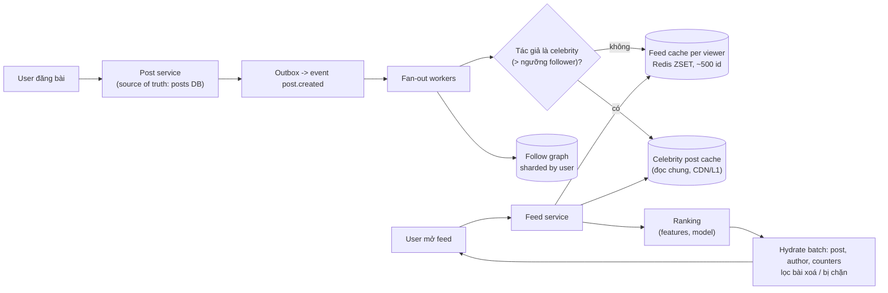
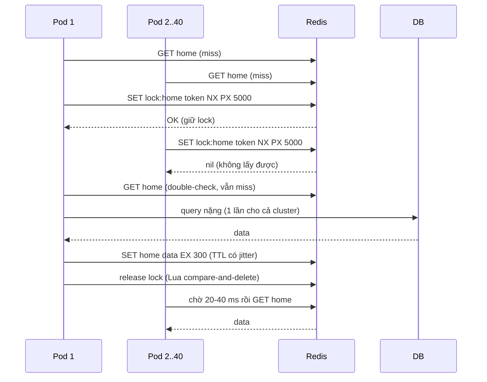

## Bối cảnh & vấn đề

21:00, một ca sĩ có 20 triệu follower đăng một bài. Service feed dùng **fan-out on write**: mỗi bài mới được ghi `post_id` vào feed cache của từng follower. 20 triệu lệnh ghi đổ vào Redis cluster trong vài phút; cùng lúc, hàng triệu người mở app và cùng đọc key `post:9876` (nội dung bài đó), key này nằm trên **một** node. CPU của node đó lên 100%, mọi key khác trên node (của hàng triệu user không liên quan) cũng chậm theo, và feed service bắt đầu timeout. Đó là **hot key / hot shard**: thiết kế đúng cho trung bình, sai cho outlier.

Bài này gom các bài toán xoay quanh cache phân tán và dữ liệu "nóng": thiết kế một distributed cache, cache stampede, hot key, leaderboard thời gian thực trên Redis sorted set, news feed với fan-out, và pagination ổn định. Điểm chung: tất cả đều về chuyện **phân bố tải không đều** và **dữ liệu dẫn xuất** (cache, feed, leaderboard) có thể rebuild từ một source of truth. Các kỹ thuật cache chi tiết (pattern, invalidation, stampede đo trên 5 pod) đã có ở track [Caching](/tracks/caching/learn/stampede-protection); bài này nhìn từ góc system design.

## Khái niệm

### Distributed cache

Một **distributed cache** (Memcached, Redis Cluster) chia key cho nhiều node để tổng bộ nhớ và throughput vượt một máy. Các quyết định thiết kế:

- **Partitioning**: consistent hashing với virtual node (Memcached client-side, ketama) hoặc hash slot cố định (Redis Cluster, 16.384 slot). Xem [bài 4](/tracks/system-design/learn/data-replication-sharding).
- **Routing**: **smart client** giữ bản đồ slot → node và gửi thẳng (Redis Cluster client nhận `MOVED`/`ASK` để cập nhật bản đồ), hoặc **proxy** (twemproxy, Envoy, mcrouter) để client đơn giản, đổi lại thêm một hop.
- **Replication**: mỗi shard một primary + replica; failover tự động qua gossip + quorum (Redis Cluster) hoặc Sentinel. Replication async nên failover có thể mất vài ghi gần nhất, chấp nhận được vì cache **không phải source of truth**.
- **Eviction**: khi đầy bộ nhớ, đuổi key theo LRU/LFU. Redis không duy trì danh sách LRU chính xác mà **lấy mẫu** vài key (`maxmemory-samples`, mặc định 5) và đuổi key "già" nhất trong mẫu: xấp xỉ, rẻ.
- **TTL**: mỗi key có hạn; key hết hạn bị xoá lười (khi truy cập) và định kỳ (lấy mẫu).

**Khi một node chết**: key của nó chuyển sang node khác (hoặc replica được promote). Nếu không có replica, phần key đó **miss toàn bộ** và đánh xuống DB cùng lúc (miss storm). Giảm thiệt hại bằng replica, request coalescing, warm-up, và giới hạn concurrency vào DB.

**Interview angle:** câu chốt là "cache có thể mất dữ liệu, nhưng **không được làm sập DB khi mất**"; thiết kế phải có đường lui khi cả cluster cache chết.

### Cache stampede (thundering herd)

**Cache stampede** xảy ra khi một key hot hết hạn (hoặc bị xoá khi invalidate, hoặc cache vừa restart): hàng nghìn request cùng miss trong cùng khoảnh khắc, cùng query DB, DB quá tải, query chậm đi, cửa sổ miss dài ra, càng nhiều request dồn vào. Nó **tự khuếch đại**.

Các biện pháp:

- **Request coalescing / single-flight**: chỉ một request rebuild key, các request khác chờ kết quả đó. Trong một process: `Map<key, Promise>`. **Xuyên pod**: lock Redis `SET lock:key token NX PX <ttl>`, pod lấy được lock thì rebuild (sau khi double-check cache), pod khác chờ ngắn và đọc lại, hoặc trả bản stale.
- **Stale-while-revalidate**: lưu soft TTL bên trong value và hard TTL dài hơn trên key; quá soft thì trả bản cũ ngay và refresh nền một lần.
- **Probabilistic early expiration** (XFetch): mỗi request tự quyết refresh sớm với xác suất tăng dần khi gần hết hạn.
- **TTL jitter**: tránh nhiều key cùng hết hạn; **warm cache** trước sự kiện; **giới hạn concurrency** vào DB.

**Interview angle:** follow-up của câu 038: "single-flight trong process vẫn để 40 pod cùng đánh DB" — đúng, single-flight chỉ giảm số query xuống bằng số pod; xuyên pod cần lock Redis (hoặc SWR với lock refresh) để còn 1.

### Hot key

**Hot key** là một key nhận tải vượt khả năng của **một** node: bài của celebrity, sản phẩm flash sale, config dùng chung, leaderboard toàn cầu. Hash phân tán đều **key**, không phân tán **tải**: một key vẫn chỉ nằm trên một shard.

Cách xử lý theo loại tải:

- **Đọc nóng**: **L1 cache in-process** TTL ngắn (1–5 giây) trong mọi pod, nên mỗi pod chỉ hỏi Redis vài lần mỗi giây; **replicate key** thành `post:9876#r1..rN` và đọc ngẫu nhiên một bản (rải sang N slot/node); đọc từ replica của Redis.
- **Ghi nóng**: **sharded counter** (`likes:9876#0..15`, cộng khi đọc), gom ghi trong memory rồi flush định kỳ, hoặc chuyển sang queue.

**Phát hiện**: Redis với `maxmemory-policy` LFU cho `OBJECT FREQ` và `redis-cli --hotkeys`; metrics phía client (đếm key theo top-K, ví dụ Count-Min Sketch); slowlog và CPU từng node lệch hẳn so với node khác. Phát hiện sớm (follow-up câu 035) nghĩa là alert khi một node CPU vượt X% trong khi trung bình cluster thấp, và top-K key theo QPS ở client.

### Leaderboard trên sorted set

**Redis sorted set** (ZSET) giữ member duy nhất kèm score, sắp theo score, được cài bằng skip list + hash table: thêm/cập nhật/xếp hạng O(log N), lấy dải O(log N + M). Đúng hình dạng của leaderboard:

- Cộng điểm: `ZINCRBY lb:week:2026-40 <delta> <userId>`.
- Top 100: `ZREVRANGE lb:week:2026-40 0 99 WITHSCORES` (hoặc `ZRANGE ... REV`).
- Hạng của tôi: `ZREVRANK lb:week:2026-40 <userId>` (Redis 7.2+ có `WITHSCORE`), người xung quanh: `ZREVRANGE` quanh hạng đó.
- Theo kỳ: key mới mỗi tuần (`lb:week:2026-40`) + `EXPIRE` để tự dọn.

**Tie-break**: hai người cùng điểm thì ai đạt trước xếp trên. Score là số thực 64 bit (double), chính xác cho số nguyên tới 2⁵³ ≈ 9 × 10¹⁵. Có thể ghép `score = points × 10^k + (MAX_TS − ts)`, nhưng phải kiểm tra **không tràn 2⁵³**: timestamp tính bằng giây (10 chữ số) để lại khoảng 10⁵ cho points; timestamp mili giây (13 chữ số) chỉ để lại khoảng 10² điểm. Khi không vừa, dùng epoch riêng (giây kể từ đầu kỳ) hoặc tie-break ở tầng app.

**Durability**: event cộng điểm lưu ở DB/Kafka là source of truth; ZSET là view có thể rebuild bằng replay. Event phải có id để replay trùng không cộng hai lần.

### News feed: fan-out on write, on read, hybrid

**Fan-out on write (push)**: khi user đăng bài, worker ghi `post_id` vào feed cache của **từng follower** (Redis list/ZSET giới hạn vài trăm phần tử). Đọc feed cực nhanh (một lệnh đọc dải + hydrate). Nhược: chi phí ghi O(follower) mỗi bài, lãng phí cho follower không bao giờ mở app, và bài của celebrity tạo write storm.

**Fan-out on read (pull)**: khi mở feed, lấy bài mới nhất của mọi người mình follow rồi merge. Ghi rẻ; đọc đắt (theo dõi 500 người là 500 lần lấy dữ liệu, hoặc một query lớn), latency đọc khó giữ dưới 300 ms.

**Hybrid**: push cho user thường; **celebrity** (vượt ngưỡng follower) không fan-out, bài của họ được **merge lúc đọc** (bài celebrity lại rất dễ cache vì mọi người đọc cùng nội dung). Thêm: chỉ fan-out cho follower **active gần đây**; follower lâu không vào thì feed được dựng lại bằng pull khi họ quay lại.

**Hydration**: feed cache chỉ giữ id; nội dung bài, tác giả, counter được lấy theo batch (`MGET`, query `WHERE id = ANY(...)`) từ cache riêng. Bài bị xoá hoặc user bị chặn được **lọc lúc hydrate**, không cần xoá khỏi hàng triệu feed. Unfollow: xoá các post của người đó khỏi feed của mình (lazy: lọc lúc đọc theo danh sách đang follow).

### Pagination: offset và cursor

**Offset pagination** (`LIMIT 20 OFFSET 10000`): DB vẫn phải đi qua và bỏ 10.000 dòng, nên trang càng sâu càng chậm; và khi có dòng mới chèn lên đầu giữa hai lần tải, trang sau bị **trùng** (dòng cuối trang 1 bị đẩy xuống thành dòng đầu trang 2) hoặc **sót**. Hợp với admin table cần "trang 5/40", dữ liệu nhỏ.

**Cursor / keyset pagination**: trang sau bắt đầu **sau** phần tử cuối của trang trước: `WHERE (created_at, id) < ($1, $2) ORDER BY created_at DESC, id DESC LIMIT 20`. Với index `(created_at DESC, id DESC)` đây là một index seek O(log n), ổn định khi dữ liệu thay đổi. Không nhảy tới trang bất kỳ được. Cursor cần **tie-breaker duy nhất** (`id`) vì `created_at` có thể trùng, và nên được encode opaque (base64 của JSON) để client không phụ thuộc cấu trúc.

Với feed có **ranking** (follow-up câu 044), thứ tự đổi giữa trang 1 và trang 2 (điểm được tính lại). Cách giữ ổn định: **snapshot** danh sách id đã rank cho phiên (lưu trong Redis với TTL 10–30 phút, cursor là offset trong snapshot), hoặc cursor chứa danh sách id đã trả để lọc trùng. Với Elasticsearch sắp theo relevance (follow-up câu 015): `search_after` với sort `[_score, id]` cộng **point in time** (PIT) để giữ snapshot index giữa các trang.

## Cơ chế hoạt động

### Kiến trúc news feed hybrid



Đường ghi: post service ghi bài vào DB (nguồn sự thật) và phát event qua outbox. Fan-out worker đọc follow graph theo batch; tác giả thường thì ghi `post_id` vào feed của follower active, tác giả celebrity thì chỉ cập nhật cache bài của họ. Đường đọc: feed service đọc feed cache của viewer, đọc thêm bài mới của các celebrity mà viewer follow, merge, rank, rồi hydrate theo batch. Nếu fan-out bị lag, bài của **chính mình** được chèn ngay vào feed của mình khi đọc (read-your-writes). Nếu feed cache mất, rebuild bằng pull.

### Cache stampede và coalescing xuyên pod



Trong mỗi pod, single-flight gom các request cùng key thành một; giữa các pod, lock bảo đảm chỉ một pod chạm DB. Pod không lấy được lock chờ có giới hạn rồi đọc lại; quá giới hạn thì trả bản stale hoặc fallback, không treo vô hạn. TTL của lock phải lớn hơn thời gian query tối đa.

## Ví dụ thực tế

### Leaderboard 10 triệu người chơi: đo bộ nhớ và thao tác

Redis 8.10.2 trong Docker, nạp 10 triệu member `user:<i>` (score giả lập) bằng Lua theo lô 1 triệu:

```bash
for c in 0 1 2 3 4 5 6 7 8 9; do
  redis-cli EVAL "for i=tonumber(ARGV[1]),tonumber(ARGV[1])+999999 do redis.call('ZADD','lb:week:2026-40', (i*7919)%1000003, 'user:'..i) end return 1" 0 $((c*1000000))
done
redis-cli ZCARD lb:week:2026-40
redis-cli INFO memory | grep used_memory_human
redis-cli ZINCRBY lb:week:2026-40 5000000 user:42
redis-cli ZREVRANGE lb:week:2026-40 0 2 WITHSCORES
redis-cli ZREVRANK lb:week:2026-40 user:4242 WITHSCORE
```

```text
10000000
used_memory_human:753.97M          (instance was empty before: 1.82M)
5332598                            (new score of user:42)
user:42
5332598
user:9341359
1000002
user:8341356
1000002
4077006                            (rank of user:4242, 0-based from the top)
592299                             (its score)
```

10 triệu member với tên ngắn (khoảng 12 byte) tốn **khoảng 750 MB** (`MEMORY USAGE ... SAMPLES 0` ước lượng 894 MB, cao hơn số thực của `used_memory`), khớp với hint "vài trăm MB tới 1 GB, cần đo" của câu 030. Member dài hơn (UUID 36 ký tự) sẽ tăng con số này đáng kể. Bộ nhớ không phải vấn đề; vấn đề là **một key = một node**: mọi `ZINCRBY` và `ZREVRANK` của 10 triệu người chơi đều vào một node.

Shard leaderboard trên Redis Cluster mà vẫn trả lời "hạng toàn cầu của tôi" (follow-up câu 030): (1) chia theo **dải điểm** (bucket `lb:0-999`, `lb:1000-1999`, ...), giữ count của mỗi bucket; hạng toàn cầu = tổng count các bucket điểm cao hơn + hạng trong bucket của mình. Người chơi đổi bucket khi điểm vượt ngưỡng (xoá ở bucket cũ, thêm ở bucket mới). (2) Chia theo hash user thành N shard; top-100 toàn cầu = merge top-100 của từng shard; hạng chính xác = tổng `ZCOUNT score > mine` trên mọi shard (N lệnh song song). (3) Chấp nhận **hạng xấp xỉ** cho người ngoài top (percentile từ histogram điểm), chỉ top-N là chính xác.

### Phát hiện hot key

Đặt `maxmemory-policy allkeys-lfu`, tạo 50 key `post:1..50`, bắn 200.000 GET vào `post:7` bằng `redis-benchmark`:

```bash
redis-cli CONFIG SET maxmemory-policy allkeys-lfu
redis-benchmark -q -n 200000 -c 50 -r 1 GET post:7
redis-cli --hotkeys | grep 'post:7"'
redis-cli OBJECT FREQ post:7
redis-cli OBJECT FREQ post:8
```

```text
GET post:7: 154440.16 requests per second, p50=0.135 msec
hot key found with counter: 196  keyname: "post:7"
197
5
```

`OBJECT FREQ` là bộ đếm LFU logarit (không phải số request thật), nên 197 so với 5 nghĩa là "nóng hơn rất nhiều", không phải "39 lần". `--hotkeys` quét **toàn bộ keyspace** bằng `SCAN` + `OBJECT FREQ`, nên chạy trên replica hoặc giờ thấp điểm với keyspace lớn; nó chỉ hoạt động khi policy là LFU. Trong production, phát hiện hot key thường dựa vào metrics phía client (top-K key) vì nhanh và không tốn tài nguyên Redis.

### Chi phí fan-out theo ngưỡng celebrity

Mô phỏng 1 triệu user, số follower theo phân bố power law (vài người cực nhiều, đa số rất ít), mỗi người đăng 1 bài/ngày:

```ts
const followers = Array.from({ length: N }, () => Math.min(5_000_000, Math.floor(20 / Math.pow(1 - rnd(), 1 / 1.1)) - 19));
for (const threshold of [Infinity, 100_000, 10_000]) {
  let pushWrites = 0, celebs = 0;
  for (const f of followers) { if (f < threshold) pushWrites += f; else celebs++; }
  console.log(`threshold=${threshold} celebs=${celebs} fan-out writes/day=${(pushWrites / 1e6).toFixed(1)}M biggest single fan-out=...`);
}
```

```text
max followers=1,066,012 p99=1214 median=17 avg following=207
threshold=Infinity celebs=   0 fan-out writes/day=206.8M  biggest single fan-out=1,066,012
threshold=  100000 celebs=  95 fan-out writes/day=105.5M  biggest single fan-out=48,280
threshold=   10000 celebs=1430 fan-out writes/day=77.8M  biggest single fan-out=9,741
```

Chỉ **95 tài khoản** (0,01% user, trên 100.000 follower) chiếm **một nửa** tổng lượt ghi fan-out (207 triệu xuống 105 triệu khi loại họ ra). Quan trọng hơn, lượt fan-out lớn nhất của một bài giảm từ 1 triệu xuống 48.000: không còn write storm. Cái giá là mỗi lần mở feed phải merge thêm bài của các celebrity mình follow (đọc từ cache bài của họ, rất dễ cache vì ai cũng đọc cùng nội dung). Hạ ngưỡng xuống 10.000 tiết kiệm thêm, nhưng số tài khoản phải merge lúc đọc tăng lên 1.430; chọn ngưỡng là cân bằng giữa tải ghi và latency đọc.

### Offset so với keyset trên 2 triệu dòng

Postgres 17, bảng `post` 2 triệu dòng, index `(created_at DESC, id DESC)`:

```sql
EXPLAIN (ANALYZE, COSTS OFF, TIMING OFF, SUMMARY ON)
SELECT id FROM post ORDER BY created_at DESC, id DESC LIMIT 20 OFFSET 1000000;

EXPLAIN (ANALYZE, COSTS OFF, TIMING OFF, SUMMARY ON)
SELECT id FROM post WHERE (created_at, id) < (:'created_at', :id) ORDER BY created_at DESC, id DESC LIMIT 20;
```

```text
 Limit (actual rows=20 loops=1)
   ->  Index Only Scan using post_created_id on post (actual rows=1000020 loops=1)
         Heap Fetches: 1000020
 Execution Time: 289.281 ms

 Limit (actual rows=20 loops=1)
   ->  Index Only Scan using post_created_id on post (actual rows=20 loops=1)
         Index Cond: (ROW(created_at, id) < ROW('2026-09-19 12:52:53.681273+00'::timestamp with time zone, 1000000))
         Heap Fetches: 20
 Execution Time: 0.063 ms
```

Offset đọc **1.000.020 dòng** để trả 20 (289 ms); keyset đọc đúng 20 (0,063 ms), nhanh hơn khoảng 4.500 lần và không phụ thuộc độ sâu trang. Cursor gửi cho client là base64 của `{"created_at": "...", "id": 1000000}`.

### CV: Redis trên nền tảng e-commerce (câu 062)

Khung trả lời (điền số liệu thật của bạn, các con số dưới đây chỉ là chỗ trống minh hoạ):

```text
Cache gì:   catalog/giá theo tenant (cache-aside, TTL 5 phút + jitter), session, rate limit, lock ngắn cho job
Key:        t:{tenantId}:product:{id}:v{schemaVersion}:{locale}
Invalidate: sau khi transaction commit -> DEL key (không UPDATE cache trước commit); event product.updated cho cache ở service khác
Sự cố:      key trang chủ hết hạn lúc 12:00 -> DB CPU 100% -> thêm single-flight + SWR; hit rate ...% -> ...%
Redis chết: fail-open về DB với concurrency limit; rate limit fallback local
```

Follow-up "vì sao xoá key **sau** commit thay vì cập nhật cache **trước**": cập nhật trước commit thì transaction có thể rollback, cache giữ giá trị không bao giờ tồn tại; cập nhật (SET) sau commit thì hai writer đồng thời có thể ghi cache theo thứ tự ngược với thứ tự commit, cache giữ giá trị cũ vô thời hạn. DEL sau commit để lần đọc sau tải lại từ DB, cửa sổ sai chỉ còn race nhỏ giữa reader chậm và DEL (giảm bằng delayed double delete hoặc version). Chi tiết ở track [Caching](/tracks/caching/learn/invalidation-consistency).

## Trade-offs & lựa chọn thay thế

| Quyết định | Lựa chọn A | Lựa chọn B | Chọn A khi |
| --- | --- | --- | --- |
| Routing cache | Smart client (slot map) | Proxy | Latency thấp nhất, client hỗ trợ cluster; B khi nhiều ngôn ngữ/client đơn giản |
| Chống stampede | Lock xuyên pod + double-check | Stale-while-revalidate | Dữ liệu không được stale; B khi stale vài giây chấp nhận được (latency phẳng hơn) |
| Hot key đọc | L1 in-process TTL ngắn | Replicate key `#r1..rN` | Hầu hết trường hợp (rẻ nhất); B khi cần nhất quán hơn giữa pod hoặc dữ liệu lớn |
| Leaderboard | Một ZSET | Shard theo dải điểm / hash | Tới vài chục triệu member, QPS một node chịu được; B khi CPU một node là bottleneck |
| Feed | Fan-out on write | Fan-out on read | Đa số user ít follower, đọc nhiều; B khi ghi nhiều, follower rất lớn |
| Feed thực tế | Hybrid (push + pull celebrity) | Thuần push/pull | Gần như luôn A ở quy mô lớn |
| Pagination | Cursor/keyset | Offset | Infinite scroll, dataset lớn, dữ liệu thay đổi; B cho admin table nhỏ cần nhảy trang |

Chọn thế nào: với cache, mặc định cache-aside + TTL jitter + single-flight; thêm lock hoặc SWR cho key hot đã biết; L1 in-process cho hot key đọc. Leaderboard bắt đầu với một ZSET mỗi kỳ (và đo); chỉ shard khi một node không chịu nổi. Feed: hybrid với ngưỡng celebrity chọn theo dữ liệu thật về phân bố follower, fan-out chỉ cho follower active. Pagination: cursor cho mọi danh sách user-facing; offset chỉ cho admin.

## Edge cases & failure modes

- **Cache node chết không có replica**: miss storm vào DB cho toàn bộ key của node đó. Replica, coalescing, concurrency limit vào DB, và circuit breaker ở tầng cache để không phải chờ timeout mỗi request.
- **Hot key làm nghẽn cả node**: mọi key khác trên node bị ảnh hưởng (noisy neighbor trong cache). L1 + replicate key; tách key hot đã biết sang node riêng.
- **Invalidate key hot = stampede**: DEL một key hot cũng giống hết hạn. Với key hot, ghi giá trị mới (có version) thay vì DEL, hoặc dùng SWR.
- **Fan-out lag**: worker không theo kịp khi celebrity đăng; follower thấy bài trễ vài phút. Celebrity đi đường pull; theo dõi lag của queue fan-out.
- **Unfollow / xoá bài với push**: feed của hàng triệu người vẫn chứa id cũ. Lọc lúc hydrate (bài không tồn tại, tác giả không còn được follow) thay vì xoá chủ động.
- **Leaderboard reset kỳ**: dùng key mới theo kỳ + TTL, không `DEL` một ZSET 10 triệu phần tử (xoá key lớn chặn Redis; nếu phải xoá, dùng `UNLINK`).
- **Replay event điểm trùng**: cộng hai lần; event id + bảng processed hoặc rebuild từ đầu kỳ.
- **Cursor trỏ tới dòng đã xoá**: keyset vẫn đúng (so sánh theo giá trị, không cần dòng tồn tại).
- **Ranking đổi giữa các trang**: trùng/sót bài; snapshot id theo phiên.

## Pitfalls

- ❌ "Thêm cache" mà không nói invalidation, TTL, stampede, key theo tenant → ✅ nói đủ bốn thứ cho mỗi cache.
- ❌ Chỉ single-flight trong process với 40 pod → ✅ lock Redis xuyên pod hoặc SWR; single-flight giảm xuống bằng số pod, không phải 1.
- ❌ Nghĩ consistent hashing giải quyết hot key → ✅ nó phân tán key, không phân tán tải; hot key cần L1/replicate/sharded counter.
- ❌ Fan-out on write cho mọi tài khoản → ✅ hybrid với ngưỡng celebrity; chỉ fan-out cho follower active.
- ❌ Tie-break bằng `points × 10^13 + ts_ms` → ✅ kiểm tra giới hạn 2⁵³ của double; dùng giây hoặc epoch theo kỳ.
- ❌ `DEL` leaderboard lớn khi reset → ✅ key mới theo kỳ + TTL, hoặc `UNLINK`.
- ❌ `OFFSET` cho infinite scroll → ✅ keyset với tie-breaker duy nhất và cursor opaque.
- ❌ Cập nhật cache trước khi commit DB → ✅ DEL sau commit (hoặc event sau commit).

## Tóm tắt

- Distributed cache: partition (ring + vnode hoặc hash slot), smart client hoặc proxy, replica async, eviction LRU/LFU xấp xỉ bằng lấy mẫu; node chết thì phải không làm sập DB.
- Stampede: single-flight trong pod, lock `SET NX PX` + double-check xuyên pod, SWR, XFetch, TTL jitter.
- Hot key: phân tán key không phân tán tải; L1 in-process, replicate key, sharded counter; phát hiện bằng LFU `OBJECT FREQ`/`--hotkeys` và top-K ở client.
- Leaderboard: ZSET với `ZINCRBY`/`ZREVRANGE`/`ZREVRANK`; 10 triệu member ≈ 750 MB (đo thật); shard theo dải điểm hoặc hash khi một node không đủ; tie-break nhớ giới hạn 2⁵³.
- Feed: push đọc nhanh ghi đắt, pull ghi rẻ đọc đắt; hybrid loại celebrity (95 tài khoản = một nửa lượt ghi trong mô phỏng); lọc lúc hydrate.
- Pagination: keyset nhanh hơn offset hàng nghìn lần ở trang sâu (0,06 ms so với 289 ms) và ổn định khi dữ liệu đổi; ranking cần snapshot theo phiên; ES dùng `search_after` + PIT.
