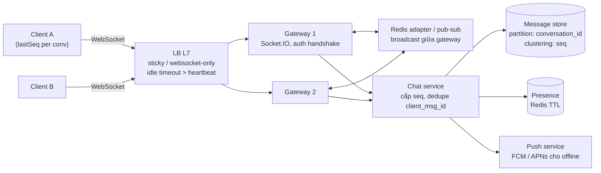
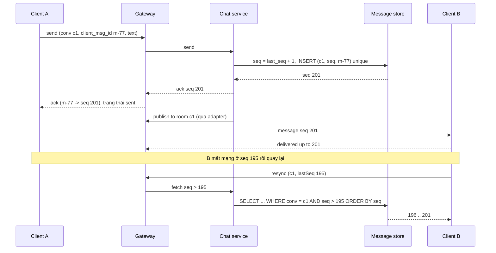

## Bối cảnh & vấn đề

Một ứng dụng chat nội bộ chạy Socket.IO trên một server, mọi thứ ổn. Khi số user tăng, team deploy 3 replica sau một load balancer round-robin. Ngay lập tức: client bị reconnect liên tục, console đầy `400 Session ID unknown`, và những tin nhắn đi được thì chỉ tới một phần người trong phòng. Không có dòng code nào sai; vấn đề là code được viết với giả định "mọi socket nằm trong cùng một process", và giả định đó vỡ khi có process thứ hai.

Realtime là nơi giả định "stateless service" của [bài 3](/tracks/system-design/learn/building-blocks) bị phá: một connection WebSocket **là** state, sống hàng giờ, gắn với một process cụ thể. Bài này đi từ lựa chọn transport (WebSocket, SSE, long polling), qua cách scale Socket.IO (sticky session, adapter), tới thiết kế đầy đủ một hệ thống chat (ordering, delivery receipt, offline sync) và một hệ thống streaming giá cho ứng dụng tài chính. Mọi ví dụ chạy thật với Socket.IO 4.8.4, @socket.io/redis-adapter 8.3, Redis 8.10, Postgres 17, Node 24.21.

## Khái niệm

### WebSocket, SSE, long polling

**WebSocket** (RFC 6455) bắt đầu bằng một HTTP request có header `Upgrade: websocket`, sau đó connection TCP được dùng cho **full-duplex** frame hai chiều với overhead rất nhỏ (vài byte mỗi frame). Hợp với chat, collaborative editing, game, trading, mọi thứ cần client gửi lên thường xuyên với độ trễ thấp. Cái giá: load balancer/proxy phải hỗ trợ upgrade và idle timeout dài; scale nhiều node cần pub/sub; bạn tự làm heartbeat, reconnect, resync.

**Server-Sent Events (SSE)** là một HTTP response không kết thúc (`Content-Type: text/event-stream`), server đẩy các event dạng text **một chiều** xuống client. Trình duyệt (`EventSource`) **tự reconnect** và gửi header `Last-Event-ID` để server tiếp tục từ event cuối. Đi qua proxy/CDN dễ (vẫn là HTTP), hợp với notification, live price một chiều, progress của job. Nhược: chỉ text (binary phải base64), client gửi lên phải dùng request HTTP riêng; trên HTTP/1.1, trình duyệt giới hạn khoảng **6 connection mỗi origin**, nên mở SSE ở nhiều tab là hết connection cho request khác. HTTP/2 multiplex nhiều stream trên một connection (giới hạn stream đồng thời thường khoảng 100, do server cấu hình) nên vấn đề gần như biến mất (verify với server/CDN của bạn).

**Long polling**: client gửi request, server giữ tới khi có dữ liệu (hoặc timeout 25–30 giây) rồi trả lời, client gửi request mới ngay. Hoạt động ở mọi nơi (proxy cổ, firewall công ty), nhưng tốn một request mỗi lần nhận, latency tăng ở thời điểm request mới đang được gửi.

**Socket.IO** không phải WebSocket: nó là một thư viện với giao thức riêng (Engine.IO bên dưới) bắt đầu bằng HTTP long polling rồi **upgrade** lên WebSocket nếu được, và thêm rooms, ack, reconnect tự động, buffer khi mất kết nối. Client WebSocket thuần **không** nói chuyện được với server Socket.IO và ngược lại.

**Interview angle:** "Notification, chat, live price chọn gì?" — notification: SSE (một chiều, auto reconnect) hoặc push của OS; chat: WebSocket/Socket.IO (hai chiều); live price: SSE hoặc WebSocket tuỳ client có cần gửi lên (subscribe/unsubscribe symbol) thường xuyên không.

### Sticky session và adapter

Hai vấn đề riêng biệt khi Socket.IO có nhiều instance:

1. **Sticky session**: với transport polling, một "session" gồm **nhiều** HTTP request (handshake, rồi các request poll/post mang `sid`). Nếu load balancer gửi request thứ hai sang instance khác, instance đó không biết `sid` và trả `400 {"code":1,"message":"Session ID unknown"}`, client reconnect, lặp lại. Sửa: sticky theo cookie hoặc IP hash ở load balancer, hoặc ép `transports: ["websocket"]` ở client (mất fallback polling cho mạng chặn WebSocket).
2. **Adapter**: `io.to(room).emit()` chỉ gửi tới socket trong room **trên instance hiện tại**, vì danh sách thành viên room nằm trong memory. Sửa: **adapter** đồng bộ broadcast giữa các instance, phổ biến nhất là `@socket.io/redis-adapter` (Redis pub/sub) hoặc Redis Streams adapter.

Adapter **không** đảm bảo delivery: Redis pub/sub là fire-and-forget, instance nào không subscribe đúng lúc (đang restart, Redis failover) thì mất message. Vì vậy message phải được **lưu** trước khi emit, và client phải **resync** khi reconnect.

### Sequence per conversation

Thứ tự toàn cục của mọi tin nhắn trong hệ thống vừa đắt vừa không cần. Thứ cần là thứ tự **trong một conversation**: mọi thành viên thấy tin theo cùng một thứ tự. Cách làm: mỗi conversation có một **sequence tăng dần** được cấp bởi một nơi duy nhất cho conversation đó (counter atomic: `UPDATE conversation SET last_seq = last_seq + 1 RETURNING last_seq`, hoặc Redis `INCR conv:{id}:seq`, hoặc service owner của partition). Client sắp theo `seq`, không theo timestamp (đồng hồ client sai, đồng hồ server lệch nhau).

**Dedupe** bằng `client_msg_id`: client sinh UUID cho mỗi tin trước khi gửi; retry (do mất mạng, không nhận ack) gửi lại cùng id; server có unique constraint `(conversation_id, client_msg_id)` và trả lại `seq` cũ. Đây là idempotency key của chat.

**Offline sync**: client nhớ `lastSeq` của mỗi conversation; khi reconnect, gửi `lastSeq` và server trả mọi tin `seq > lastSeq` (phân trang). Không cần server biết client đã nhận gì: client tự biết qua `lastSeq`.

### Delivery receipts và presence

Trạng thái tin nhắn: **sent** (server đã lưu, ack về sender với `seq`), **delivered** (thiết bị của người nhận đã nhận), **read** (người nhận đã xem). Với 1:1 thì đơn giản. Với group 500 người (follow-up câu 043), lưu receipt **từng tin × từng người** là 500 dòng mỗi tin. Cách rẻ: mỗi thành viên lưu một con trỏ **`last_read_seq` per conversation** (một dòng mỗi người mỗi conversation); "tin X đã được ai đọc" = những người có `last_read_seq ≥ X.seq`. Cập nhật con trỏ được gộp (debounce vài giây) và chỉ broadcast số lượng đã đọc hoặc chỉ cho người gửi.

**Presence** (online/offline/typing) là best-effort: key Redis `presence:{user}` với TTL 30–60 giây được làm mới theo heartbeat; không lưu DB, không đảm bảo chính xác, và chỉ phát tới những người đang mở conversation liên quan (presence fan-out cho mọi contact rất đắt).

### Conflation và backpressure

Với dữ liệu thay đổi rất nhanh (giá cổ phiếu, crypto: hàng chục tick mỗi giây mỗi symbol), client không cần **mọi** tick, chỉ cần giá **mới nhất**. **Conflation**: gộp update theo symbol, mỗi 100–250 ms chỉ gửi giá cuối cùng; client chậm (mạng yếu) nhận ít update hơn nhưng luôn đúng giá mới nhất. **Backpressure**: khi buffer gửi của một socket đầy (`socket.conn.transport` không ghi kịp, `bufferedAmount` lớn), **bỏ update cũ** thay vì xếp hàng vô hạn (xếp hàng vô hạn làm memory server phình và client nhận giá cũ hàng giây sau).

Với dữ liệu **không được mất** (số dư tài khoản, trạng thái lệnh), không conflate mù: gửi kèm `seq`/version, client bỏ update có version cũ hơn cái đang có, và khi reconnect lấy **snapshot** rồi áp **delta** có `seq` lớn hơn snapshot.

## Cơ chế hoạt động

### Kiến trúc chat



Gateway giữ connection và **không** chứa logic nghiệp vụ; nó xác thực khi handshake, chuyển tin lên chat service, và nhận broadcast qua adapter. Chat service là nơi duy nhất cấp `seq` và ghi message store. Message store phân vùng theo `conversation_id` (mọi tin của một conversation nằm cùng partition, sắp theo `seq`): ở quy mô nhỏ là Postgres với primary key `(conversation_id, seq)`, ở quy mô 2 tỷ tin/ngày ([bài 2](/tracks/system-design/learn/back-of-envelope)) là Cassandra/ScyllaDB/DynamoDB. Người nhận offline (không có connection nào) nhận push notification.

### Luồng gửi tin: persist, ack, fan-out, resync



Thứ tự quan trọng: **persist trước, ack sau, fan-out sau cùng**. Nếu emit trước khi lưu mà server crash, người nhận thấy một tin không tồn tại trong lịch sử. Nếu sender không nhận ack (mạng rớt), nó gửi lại cùng `client_msg_id` và nhận lại `seq` cũ. Nếu người nhận bỏ lỡ broadcast (adapter fire-and-forget, gateway restart), lần reconnect kế tiếp kéo phần thiếu bằng `lastSeq`. Không bước nào cần "exactly-once delivery" từ hạ tầng.

## Ví dụ thực tế

### Hai instance Socket.IO: không adapter so với Redis adapter

Hai server Socket.IO trên cổng 3001 và 3002, client A nối 3001, client B nối 3002 (WebSocket-only để tách riêng vấn đề adapter khỏi vấn đề sticky), cả hai join `room-1`, B gửi tin:

```ts
async function start(port: number) {
  const httpServer = http.createServer(); const io = new Server(httpServer);
  if (withAdapter) {
    const pub = createClient({ url: "redis://localhost:56379" }); const sub = pub.duplicate();
    await Promise.all([pub.connect(), sub.connect()]); io.adapter(createAdapter(pub, sub));
  }
  io.on("connection", (socket) => {
    socket.on("join", (room: string) => socket.join(room));
    socket.on("message", (msg: { roomId: string; text: string }) => io.to(msg.roomId).emit("message", { ...msg, via: port }));
  });
  await new Promise<void>((r) => httpServer.listen(port, r));
}
```

```text
no adapter: [ 'B got "hello from B" (emitted on :3002)' ]
with redis adapter: [
  'B got "hello from B" (emitted on :3002)',
  'A got "hello from B" (emitted on :3002)'
]
```

Không có adapter, `io.to("room-1")` trên node 3002 chỉ biết các socket của node 3002, nên A (ở 3001) không nhận được: đúng triệu chứng "một số tin không bao giờ tới" của câu 041. Thêm adapter, node 3002 publish broadcast lên Redis, node 3001 nhận và gửi cho A.

### Không sticky: "Session ID unknown"

Handshake polling trên node 1, rồi gửi request tiếp theo của cùng session tới node 1 và node 2 (đúng điều round-robin LB làm):

```ts
const hs = await (await fetch("http://localhost:3011/socket.io/?EIO=4&transport=polling")).text();
const sid = /"sid":"([^"]+)"/.exec(hs)![1];
const same = await fetch(`http://localhost:3011/socket.io/?EIO=4&transport=polling&sid=${sid}`, { method: "POST", body: "40" });
const other = await fetch(`http://localhost:3012/socket.io/?EIO=4&transport=polling&sid=${sid}`, { method: "POST", body: "40" });
```

```text
handshake on node 1: 0{"sid":"RB5i4OJ0ppMPmJPwAAAA","upgrades":["websocket"],"pingInterval":25000,"pingTimeout"...
next request -> node 1: 200 ok
next request -> node 2: 400 {"code":1,"message":"Session ID unknown"}
```

Một client Socket.IO thật (transport polling) qua một proxy round-robin tự viết cho chuỗi sự kiện `connect_error: xhr post error → disconnect: transport error → reconnect attempt 1 → ...` lặp lại, đúng "reconnect loop". Handshake cũng cho thấy `pingInterval: 25000`: heartbeat 25 giây, ngắn hơn idle timeout 60 giây mặc định của nhiều load balancer.

### Sequence per conversation, dedupe và resync trên Postgres

200 tin gửi đồng thời vào một conversation, một lần retry trùng `client_msg_id`, rồi resync từ `lastSeq = 195`:

```ts
async function send(conv: string, sender: string, clientMsgId: string, body: string) {
  const c = await db.connect();
  try {
    await c.query("BEGIN");
    const dup = await c.query("SELECT seq FROM message WHERE conversation_id=$1 AND client_msg_id=$2", [conv, clientMsgId]);
    if (dup.rowCount) { await c.query("ROLLBACK"); return { seq: Number(dup.rows[0].seq), duplicate: true }; }
    const { rows: [{ last_seq }] } = await c.query("UPDATE conversation SET last_seq = last_seq + 1 WHERE id=$1 RETURNING last_seq", [conv]);
    await c.query("INSERT INTO message(conversation_id, seq, client_msg_id, sender, body) VALUES ($1,$2,$3,$4,$5)", [conv, last_seq, clientMsgId, sender, body]);
    await c.query("COMMIT"); return { seq: Number(last_seq), duplicate: false };   // ack AFTER commit, then fan out
  } catch (e) { await c.query("ROLLBACK"); throw e; } finally { c.release(); }
}
```

```text
200 concurrent sends -> seq range 1..200, distinct=200, gaps=false
client retries msg #17 after a timeout: { seq: 21, duplicate: true }
reconnect with lastSeq=195 -> 196:m192 197:m196 198:m173 199:m199 200:m191
```

`UPDATE ... RETURNING` khoá dòng conversation trong transaction, nên 200 request đồng thời nhận 200 seq liên tiếp, không trùng, không lỗ (lỗ chỉ xuất hiện nếu transaction rollback sau khi tăng counter; client không được giả định seq liền mạch tuyệt đối, chỉ tăng dần). Retry trả lại seq cũ. Resync trả đúng 5 tin còn thiếu theo thứ tự seq (thứ tự gửi m192, m196, ... khác thứ tự chữ số vì các request đồng thời đến theo thứ tự bất kỳ; seq là thứ tự chuẩn). Hai request retry cùng `client_msg_id` đến **cùng lúc** đều có thể vượt qua `SELECT`; khi đó unique constraint `(conversation_id, client_msg_id)` làm một transaction lỗi và rollback, và handler trả lại seq của bản đã ghi.

Cái giá của khoá dòng conversation: mọi tin của **một** conversation được tuần tự hoá. Với group 500 người, vài chục tin/giây là đủ; một "conversation" kiểu livestream chat với hàng nghìn tin/giây cần thiết kế khác (seq theo shard + merge, hoặc chấp nhận thứ tự gần đúng theo thời gian server).

### Streaming giá: conflation và snapshot + delta

Phần lõi của fan-out service (minh hoạ):

```ts
const latest = new Map<string, { price: number; seq: number }>();     // symbol -> newest tick
kafkaConsumer.on("tick", (t: { symbol: string; price: number; seq: number }) => {
  const cur = latest.get(t.symbol);
  if (!cur || t.seq > cur.seq) latest.set(t.symbol, t);                // drop out-of-order ticks
});
setInterval(() => {                                                      // conflate: at most 4 updates/s per symbol
  for (const [symbol, tick] of latest) io.to(`sym:${symbol}`).volatile.emit("price", { symbol, ...tick });
  latest.clear();
}, 250);
io.on("connection", (socket) => {
  socket.on("subscribe", async (symbol: string, ack: (snap: unknown) => void) => {
    socket.join(`sym:${symbol}`);
    ack(await snapshotStore.get(symbol));                                // snapshot first, deltas with higher seq after
  });
});
```

`volatile.emit` của Socket.IO bỏ gói nếu transport của socket chưa sẵn sàng ghi (thay vì buffer), đúng với giá (giá mới hơn sẽ tới sau 250 ms). Với số dư tài khoản (room `user:{id}`), dùng `emit` thường kèm `seq`, và client so `seq` để bỏ update cũ.

**Re-auth trên kết nối dài** (follow-up câu 050): access token hết hạn sau 10 phút nhưng socket sống hàng giờ. Xác thực JWT ở handshake (`io.use` middleware), lưu `exp` trên socket; client gửi token mới qua event `reauth` trước khi hết hạn; server kiểm tra lại (chữ ký, revocation) và cập nhật `exp`; một timer server ngắt socket khi quá `exp` mà không có token mới. Authorization kiểm tra **mỗi lần join room** (`user:{id}` chỉ cho chính user đó), không chỉ lúc connect.

## Trade-offs & lựa chọn thay thế

| Quyết định | Lựa chọn A | Lựa chọn B | Chọn A khi |
| --- | --- | --- | --- |
| Transport | WebSocket / Socket.IO | SSE | Hai chiều, client gửi thường xuyên; B khi một chiều, muốn auto reconnect + HTTP thuần |
| Socket.IO scale | Sticky session | `transports: ["websocket"]` | Cần fallback polling (mạng công ty); B khi kiểm soát client và mạng |
| Broadcast giữa node | Redis pub/sub adapter | Routing `user → gateway` qua registry + RPC | Nhỏ/vừa, đơn giản; B ở quy mô rất lớn (pub/sub broadcast mọi node tốn kém) |
| Message store | Postgres `(conversation_id, seq)` | Cassandra / ScyllaDB / DynamoDB | Tới vài nghìn tin/s, cần query linh hoạt; B khi chục nghìn tin/s và trăm TB |
| Fan-out group | Ghi một lần, đọc theo conversation | Ghi vào inbox từng thành viên | Group lớn; B cho group nhỏ cần inbox per user nhanh |
| Read receipts | `last_read_seq` per member | Receipt per message per member | Group lớn (rẻ); B cho 1:1 cần chi tiết |
| Giá realtime | Conflation + volatile | Gửi mọi tick | Client là người xem; B khi client là bot giao dịch cần mọi tick (dùng kênh khác) |
| Recovery | Snapshot + delta theo seq | Socket.IO connection state recovery | Cần đúng tuyệt đối, mọi adapter; B khi mất kết nối ngắn và adapter hỗ trợ (verify) |

Chọn thế nào: Socket.IO + Redis adapter + sticky session là điểm bắt đầu hợp lý cho tới vài trăm nghìn connection; persistence + `seq` + resync luôn cần, bất kể adapter. **Connection state recovery** của Socket.IO (v4.6+) khôi phục room và gói bị lỡ sau mất kết nối ngắn (mặc định tối đa 2 phút), nhưng chỉ với một số adapter (không phải adapter Redis pub/sub cổ điển, verify với docs hiện hành) và không thay cho resync từ DB khi mất lâu hơn. Ở quy mô hàng triệu connection, chuyển sang routing có chủ đích (`user → gateway` trong registry, chat service gửi thẳng tới gateway đang giữ user) thay vì broadcast mọi tin lên mọi node.

## Edge cases & failure modes

- **Deploy làm mọi socket reconnect cùng lúc** (follow-up câu 061): 200.000 client cùng handshake + cùng resync → spike vào auth và DB. Rolling deploy chậm (drain từng gateway), client reconnect với **jitter** (Socket.IO có `randomizationFactor`), server gửi lệnh "reconnect sau X giây" trước khi tắt, resync phân trang và giới hạn.
- **Redis adapter failover**: pub/sub mất message trong lúc failover; client chỉ phục hồi được nhờ resync theo `lastSeq`. Theo dõi khoảng trống seq ở client để tự kích hoạt resync.
- **Gateway chết**: mọi connection của nó rớt; client reconnect qua LB tới gateway khác, presence TTL hết hạn tự nhiên.
- **Tin đến không theo thứ tự ở client** (hai đường: broadcast và resync): client sắp theo seq, giữ buffer ngắn cho seq bị lỗ trước khi kích hoạt resync.
- **Client đồng hồ sai**: hiển thị theo `created_at` của server, sắp theo seq.
- **Multi-device**: mỗi thiết bị có `lastSeq` riêng; "read" trên một thiết bị cập nhật `last_read_seq` chung của user.
- **Slow consumer**: một client mạng yếu làm buffer của socket phình; giới hạn buffer, conflate, hoặc ngắt kết nối và bắt resync.
- **E2E encryption**: server không đọc được nội dung, nên mất search server-side, moderation và preview trong push; là trade-off sản phẩm phải chốt sớm.

## Pitfalls

- ❌ Scale Socket.IO lên nhiều instance mà không sticky và không adapter → ✅ cả hai (hoặc websocket-only + adapter).
- ❌ Tin vào adapter là đảm bảo delivery → ✅ persist trước, emit sau, client resync theo `lastSeq`.
- ❌ Sắp tin theo timestamp client → ✅ `seq` per conversation cấp ở server.
- ❌ Không có `client_msg_id` → ✅ retry sinh tin trùng; unique `(conversation_id, client_msg_id)`.
- ❌ Receipt per message per member cho group 500 → ✅ `last_read_seq` per member.
- ❌ Đẩy mọi tick giá tới mọi client → ✅ conflation theo symbol, `volatile` cho dữ liệu thay thế được, bỏ update cũ khi buffer đầy.
- ❌ Chỉ xác thực lúc connect → ✅ re-auth định kỳ trên socket dài, authorization mỗi lần join room.
- ❌ Heartbeat dài hơn idle timeout của LB → ✅ ping (25 giây) < idle timeout (60 giây).

## Tóm tắt

- WebSocket cho hai chiều độ trễ thấp; SSE cho một chiều với auto reconnect + `Last-Event-ID` (HTTP/1.1 giới hạn ~6 connection/origin, HTTP/2 giải quyết); long polling là fallback; Socket.IO là giao thức riêng trên các transport đó.
- Socket.IO nhiều node cần sticky session (polling: `Session ID unknown` khi lệch node, tái hiện thật) và adapter (không có adapter, tin không tới socket ở node khác, tái hiện thật).
- Adapter là fire-and-forget: persist trước, ack với `seq`, fan-out sau, resync theo `lastSeq`.
- `seq` per conversation từ một nơi cấp duy nhất; dedupe bằng `client_msg_id`; 200 tin đồng thời ra 200 seq liên tiếp (Postgres thật).
- Chat 50M DAU: bài toán là connection + fan-out; message store phân vùng theo `conversation_id`.
- Streaming giá: conflation 100–250 ms, bỏ tick cũ, snapshot + delta theo `seq` khi reconnect, re-auth trên socket dài.
