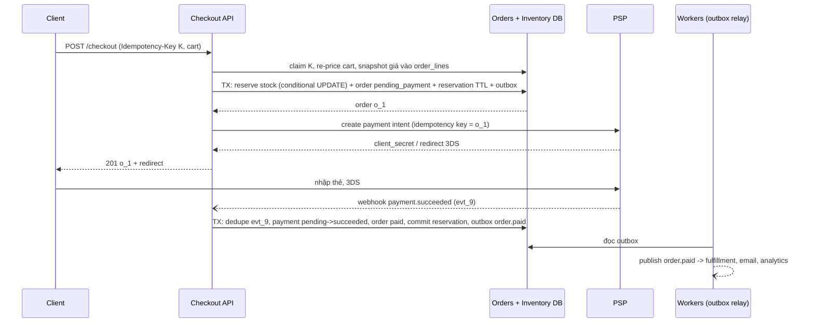
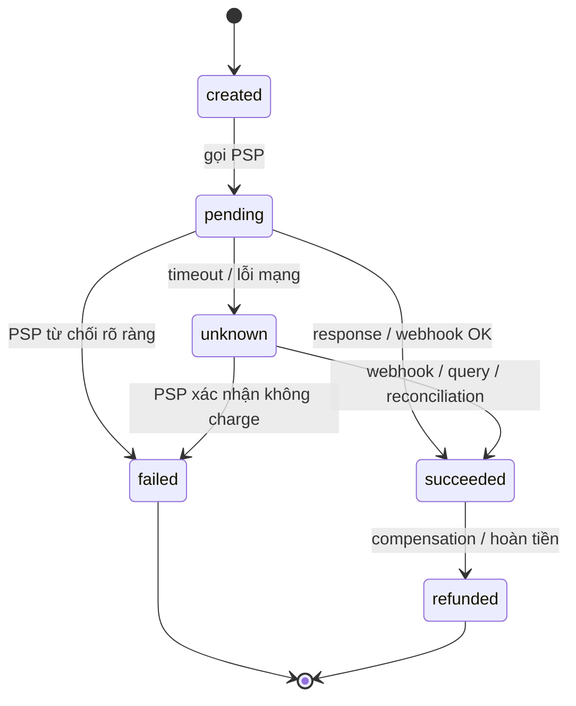

## Bối cảnh & vấn đề

Flash sale lúc 12:00: 500 chiếc tai nghe giá 50%. Đến 12:01, hệ thống ghi nhận 540 đơn đã thanh toán. Kho chỉ có 500. Bộ phận CSKH phải gọi 40 khách để huỷ đơn, tặng voucher xin lỗi, và đọc bình luận "lừa đảo" trên fanpage. Trong cùng đợt sale, vài khách bị trừ tiền nhưng đơn hiển thị "thất bại": PSP (payment service provider) phản hồi chậm hơn timeout 30 giây của checkout service, service coi timeout là thất bại, huỷ đơn và trả hàng về kho; vài phút sau PSP gửi webhook "đã thanh toán thành công" cho một đơn đã huỷ.

Checkout là nơi mọi khái niệm của [bài 5](/tracks/system-design/learn/async-idempotency-resilience) gặp nhau trong một luồng có tiền thật: concurrency (nhiều người mua cùng SKU), idempotency (double click, retry), trạng thái không xác định (timeout), dependency bên ngoài không kiểm soát được (PSP, 3DS, webhook đến trễ hoặc trùng), và transaction không thể trải qua nhiều hệ thống (saga). Bài này tái hiện đúng hai sự cố trên với Postgres 17 thật, rồi xây lại luồng checkout cho một nền tảng e-commerce multi-tenant.

## Khái niệm

### Oversell và read-check-write

**Oversell** xảy ra khi số lượng bán vượt tồn kho. Nguyên nhân kinh điển là **read-check-write không atomic**:

```ts
const { available } = await db.one("SELECT available FROM inventory WHERE sku=$1", [sku]);
if (available < qty) throw new OutOfStock();
await db.none("UPDATE inventory SET available = $1 WHERE sku=$2", [available - qty, sku]);   // minh hoạ: bug
```

Hai request đọc cùng `available = 1`, cả hai qua được `if`, cả hai ghi. Có hai biến thể với hậu quả khác nhau: ghi **giá trị tuyệt đối** (`available = $1`) thì các update **đè nhau** (lost update), tồn kho trong DB trông vẫn còn hàng trong khi đã bán vượt; ghi **tương đối** (`available = available - 1`) thì tồn kho đi xuống **âm**. Ngoài race này, còn các nguyên nhân khác: đọc tồn kho từ **cache stale** để quyết định bán, trừ kho **sau** thanh toán async mà không giữ hàng trước, và retry checkout không idempotent (một khách tạo hai đơn).

### Conditional update

Cách sửa căn bản là để database làm **check và write trong một câu lệnh atomic**:

```sql
UPDATE inventory SET available = available - $2 WHERE sku = $1 AND available >= $2;
```

Postgres khoá dòng khi update; các transaction đồng thời trên cùng dòng phải chờ, và sau khi transaction trước commit, điều kiện `available >= $2` được **đánh giá lại** trên phiên bản mới của dòng (ở Read Committed). Row count 1 = trừ được; row count 0 = hết hàng. Thêm `CHECK (available >= 0)` làm lớp bảo vệ cuối cùng. Trên SQL Server tương đương là `UPDATE ... WHERE available >= @qty` rồi kiểm tra `@@ROWCOUNT`, hoặc `SELECT ... WITH (UPDLOCK, ROWLOCK)` trong transaction nếu cần đọc trước rồi mới quyết định. Chi tiết khoá và isolation ở [Locking](/tracks/sql-postgres/learn/locking-concurrency).

### Reservation có TTL

Giữa lúc khách bấm "Đặt hàng" và lúc thanh toán xong có thể là vài phút (nhập thẻ, 3DS, chuyển sang app ngân hàng). Trừ kho **sau** thanh toán thì hai người có thể cùng trả tiền cho chiếc cuối cùng; trừ kho **vĩnh viễn** lúc đặt thì khách bỏ dở giỏ hàng giữ hàng mãi. **Reservation** là trạng thái ở giữa: chuyển hàng từ `available` sang `reserved` (trong một transaction với việc tạo dòng `reservation(order_id, sku, qty, expires_at)`), khi thanh toán thành công thì **commit** reservation (giảm `reserved`), khi hết hạn hoặc huỷ thì **release** (trả về `available`).

Follow-up câu 034: release reservation khi khách bỏ thanh toán, và nếu job release chết thì sao? Job định kỳ (hoặc delayed message theo `expires_at`) release các reservation quá hạn bằng một câu lệnh idempotent (chỉ chuyển `held → released`). Nếu job chết, hàng bị giữ lâu hơn (bán chậm hơn, không oversell), nên đây là failure mode **an toàn**; alert khi số reservation quá hạn tăng. Một phòng thủ thêm: lúc kiểm tra tồn kho, coi reservation quá hạn là đã release (lazy expiry).

### Hot SKU

Với conditional update, mọi người mua cùng SKU **xếp hàng** trên khoá của một dòng. Một transaction ngắn (vài ms) cho vài trăm tới vài nghìn lượt trừ/giây trên một dòng; flash sale 40.000 request/giây thì không đủ. Các lớp giảm tải:

- **Gác cổng bằng Redis**: `DECRBY stock:sku 1` trong Lua (không xuống dưới 0) trước khi vào DB; ai qua được cổng mới được tạo reservation trong DB. Redis xử lý hàng trăm nghìn lệnh/giây; DB chỉ nhận đúng số request có cơ hội mua (500 thay vì 40.000). DB vẫn là source of truth: nếu bước DB thất bại, `INCRBY` trả lại cổng.
- **Queue tuần tự per SKU**: request vào hàng đợi, một consumer xử lý tuần tự; user nhận "đang xử lý" rồi kết quả async.
- **Chia stock thành bucket**: 500 chiếc chia thành 10 dòng × 50, request chọn ngẫu nhiên một bucket còn hàng; giảm tranh chấp khoá, đổi lại logic "hết hàng" phức tạp hơn.

Và **idempotency key cho checkout** để một khách không giữ hai suất bằng double click.

### Payment state machine

Một lần thanh toán không phải "thành công hay thất bại": nó đi qua nhiều trạng thái, có trạng thái **không xác định**, và nhận sự kiện từ nhiều nguồn (response đồng bộ, webhook, reconciliation) không theo thứ tự. **State machine** định nghĩa trạng thái và chuyển tiếp hợp lệ:

`created → pending → (succeeded | failed | unknown)`, `unknown → (succeeded | failed)`, `succeeded → refunded`.

Mỗi chuyển tiếp được cài bằng một **conditional update** `UPDATE ... SET state = $to WHERE id = $id AND state IN (<các trạng thái nguồn hợp lệ>)`. Vì thế mọi chuyển tiếp **idempotent** (áp lại lần hai không đổi gì) và **không thể đi lùi** (webhook "succeeded" đến trước rồi handler "timeout → failed" đến sau sẽ bị bỏ qua). Webhook được dedupe theo `event_id` của PSP trong cùng transaction.

### Timeout là trạng thái không xác định

Khi PSP không trả lời trong 30 giây, bạn **không biết** khách đã bị trừ tiền chưa: request có thể chưa tới PSP, có thể đã charge xong nhưng response bị mất. Coi timeout là thất bại (rồi cho khách thử lại bằng request mới) là cách chắc chắn nhất để **charge hai lần**. Hành vi đúng:

- Chuyển payment sang `unknown`, đơn hàng chờ, UI hiển thị "đang xác nhận thanh toán".
- Retry với **cùng idempotency key** (PSP dedupe), hoặc **query trạng thái** theo reference id của mình.
- Chờ **webhook**; **reconciliation job** định kỳ đối chiếu với API/báo cáo của PSP cho mọi payment kẹt ở `pending/unknown`.
- Nếu cuối cùng là `succeeded` nhưng đơn đã bị huỷ (hoặc reservation đã hết hạn), chạy **compensation**: refund tự động, hoặc giữ đơn nếu còn hàng.
- Timeout phía mình nên **ngắn hơn** (vài giây cho bước khởi tạo), có circuit breaker, và **không giữ DB transaction mở** trong lúc gọi PSP (giữ transaction mở 30 giây là giữ khoá và connection 30 giây).

### Saga thay cho distributed transaction

Checkout chạm nhiều hệ thống: inventory (DB của mình), payment (PSP bên ngoài), fulfillment, notification. Không có transaction nào trải qua PSP. **Two-phase commit** (2PC) đòi mọi bên hỗ trợ prepare/commit và khoá tài nguyên trong lúc chờ coordinator, nên không dùng được với PSP và tệ cho availability. **Saga** là chuỗi các bước local transaction; mỗi bước có một **compensation** (bước bù) chạy khi một bước sau thất bại: reserve stock ↔ release stock, charge ↔ refund, create shipment ↔ cancel shipment. Saga có thể **orchestration** (một orchestrator gọi từng bước và quyết định compensation; dễ theo dõi) hoặc **choreography** (mỗi service phản ứng với event của service trước; ít coupling, khó nhìn toàn cục). Mỗi bước và mỗi compensation phải **idempotent**, vì chúng sẽ được retry.

## Cơ chế hoạt động

### Luồng checkout



Những điểm thiết kế đáng nói ra: giá được **tính lại và snapshot** vào `order_lines` tại checkout (khách thấy giá gì thì trả giá đó, hoặc được báo nếu giá đổi); reserve stock, tạo order, reservation và outbox nằm trong **một transaction DB**; lời gọi PSP nằm **ngoài** transaction; kết quả thanh toán đến qua **webhook** (không chỉ qua redirect của browser, vì khách có thể đóng tab), được dedupe theo event id; mọi side effect phía sau (fulfillment, email) đi qua **outbox**, nên không có dual write.

### Sơ đồ trạng thái thanh toán



`unknown` là trạng thái then chốt: nó tồn tại để **không ai** được tự coi timeout là thất bại. Từ `unknown` chỉ có hai lối ra, đều dựa trên thông tin từ PSP. `succeeded` không bao giờ quay về `failed`; sai lầm ở đơn hàng (đơn đã huỷ) được sửa bằng một chuyển tiếp tiến lên (`refunded`), không bằng cách sửa lịch sử.

## Ví dụ thực tế

### 500 sản phẩm, 540 người mua

Postgres 17, pool 50 connection, 540 request mua đồng thời, mỗi request có 5 ms "xử lý ở app" giữa đọc và ghi (tính giá, khuyến mãi):

```ts
const buggy = async () => {                                     // read-check-write, absolute value
  const { rows: [r] } = await db.query("SELECT available FROM inventory WHERE sku='SKU-1'");
  if (r.available < 1) return false;
  await new Promise((x) => setTimeout(x, 5));
  await db.query("UPDATE inventory SET available = $1 WHERE sku='SKU-1'", [r.available - 1]); return true;
};
const buggyDecrement = async () => {                            // read-check, then relative decrement
  const { rows: [r] } = await db.query("SELECT available FROM inventory WHERE sku='SKU-1'");
  if (r.available < 1) return false;
  await new Promise((x) => setTimeout(x, 5));
  await db.query("UPDATE inventory SET available = available - 1 WHERE sku='SKU-1'"); return true;
};
const atomic = async () =>
  (await db.query("UPDATE inventory SET available = available - 1 WHERE sku='SKU-1' AND available >= 1")).rowCount === 1;
```

```text
read-check-write      : sold 540 of 500, stock now { available: 499, reserved: 0 } (lost updates hide the oversell)
check, then decrement : sold 540 of 500, stock now { available: -40, reserved: 0 }
conditional UPDATE    : sold 500 of 500, stock now { available: 0, reserved: 0 }
```

Đúng con số của câu 034: **540 đơn cho 500 chiếc**. Biến thể ghi giá trị tuyệt đối còn tệ hơn: DB báo **còn 499**, vì hầu hết update đè lên nhau; không ai phát hiện oversell cho tới khi kho đi lấy hàng. Biến thể trừ tương đối cho tồn kho **−40**, ít nhất là thấy được. Conditional UPDATE bán đúng 500 và từ chối 40, không cần khoá tường minh hay thay đổi isolation level. (Hai bản lỗi chạy sau khi đã bỏ `CHECK (available >= 0)`; với CHECK, bản trừ tương đối sẽ lỗi ở 40 request cuối thay vì âm kho, nhưng bản ghi tuyệt đối vẫn oversell.)

### Reservation và release khi hết hạn

```ts
const reserve = async (orderId: string) => {
  const c = await db.connect();
  try {
    await c.query("BEGIN");
    const u = await c.query("UPDATE inventory SET available = available - 1, reserved = reserved + 1 WHERE sku='SKU-1' AND available >= 1");
    if (u.rowCount === 0) { await c.query("ROLLBACK"); return false; }
    await c.query("INSERT INTO reservation(order_id, sku, qty, expires_at) VALUES ($1,'SKU-1',1, now() + interval '10 minutes')", [orderId]);
    await c.query("COMMIT"); return true;
  } finally { c.release(); }
};
```

```sql
-- release job: idempotent, only held -> released, returns stock in the same statement
WITH expired AS (
  UPDATE reservation SET status = 'released'
  WHERE status = 'held' AND expires_at < now()
  RETURNING sku, qty)
UPDATE inventory i SET available = available + e.total, reserved = reserved - e.total
FROM (SELECT sku, sum(qty)::int AS total FROM expired GROUP BY sku) e
WHERE i.sku = e.sku;
```

```text
reserve (TTL 10 min)  : held 500, stock now { available: 0, reserved: 500 }
release expired (30)  : rows=1, stock now { available: 30, reserved: 470 }
```

540 request giữ được đúng 500 suất. Cho 30 reservation hết hạn rồi chạy job: 30 chiếc quay về `available`. Câu lệnh release chỉ chuyển dòng đang `held`, nên chạy hai lần (hai instance job, hoặc retry) không trả hàng hai lần. Vì CTE thay đổi dữ liệu nằm trong một câu lệnh, việc đổi trạng thái reservation và cộng lại tồn kho là atomic.

### Payment state machine với webhook trùng và handler đến muộn

```ts
const ALLOWED: Record<string, string[]> = {
  pending: ["created"], unknown: ["pending"], succeeded: ["pending", "unknown"],
  failed: ["pending", "unknown"], refunded: ["succeeded"],
};
async function transition(id: string, to: string, pspRef?: string) {
  const r = await db.query(
    "UPDATE payment_attempt SET state=$2, psp_ref=COALESCE($3, psp_ref), updated_at=now() WHERE id=$1 AND state = ANY($4) RETURNING state",
    [id, to, pspRef ?? null, ALLOWED[to]]);
  return r.rowCount ? "applied" : "ignored";
}
// webhook: INSERT INTO psp_event(event_id) ON CONFLICT DO NOTHING, then transition, in one transaction
```

```text
pending   -> applied (state=pending)
unknown   -> applied (state=unknown)
webhook evt_9 succeeded -> applied
webhook evt_9 duplicate -> ignored
failed    -> ignored (state=succeeded)
refunded  -> applied (state=refunded)
```

Kịch bản của câu 037: gọi PSP, timeout, chuyển `unknown` (không phải `failed`). Webhook `succeeded` đến sau và được áp dụng. PSP gửi lại cùng webhook: bị bỏ qua nhờ dedupe `event_id`. Một handler cũ "timeout thì đánh dấu failed" chạy muộn: bị bỏ qua vì `failed` không được phép từ `succeeded`. Cuối cùng một refund hợp lệ. Mọi chuyển tiếp idempotent mà không cần lock tường minh: điều kiện `state = ANY(...)` trong `WHERE` chính là state machine (follow-up câu 037).

### Khi thanh toán thành công nhưng reservation đã hết hạn

Follow-up câu 045: khách ở màn hình 3DS 12 phút, reservation 10 phút đã hết hạn và chiếc cuối cùng đã bán cho người khác; rồi webhook `succeeded` tới. Không có đáp án kỹ thuật duy nhất; phải có **policy** được chốt với business trước:

```text
1. Thử reserve lại (conditional UPDATE). Còn hàng -> giữ đơn, như bình thường.
2. Hết hàng -> đơn chuyển "paid_out_of_stock":
     a. backorder nếu SKU cho phép (thông báo ngày giao mới), hoặc
     b. refund tự động + voucher + email xin lỗi (compensation).
3. Giảm xác suất xảy ra: TTL reservation > thời gian thanh toán p99 (đo thật),
   gia hạn reservation khi khách vào bước 3DS, hiển thị đồng hồ đếm ngược.
```

### CV: "Bạn đã build module Checkout" (câu 057)

Interviewer muốn nghe **cơ chế cụ thể và một lần nó hỏng**, không phải danh sách pattern. Khung trả lời (điền số liệu thật của bạn; dòng nào bạn không làm thì nói thật là không làm và bây giờ sẽ làm thế nào):

```text
Double order:  Idempotency-Key sinh ở client theo cart/attempt, unique (tenant_id, key),
               request đang processing -> 409, response được lưu và trả lại cho retry
Tồn kho:       SQL Server: UPDATE inventory SET available = available - @qty
               WHERE sku = @sku AND available >= @qty; IF @@ROWCOUNT = 0 -> hết hàng
               (hoặc reservation TTL nếu thanh toán qua cổng redirect mất vài phút)
Payment:       state machine (pending / unknown / succeeded / failed), webhook idempotent theo event id,
               job reconciliation mỗi N phút cho payment kẹt
Giá:           snapshot giá + khuyến mãi vào order line lúc checkout
Bug thật:      <ví dụ: double click tạo 2 đơn trước khi có unique key; cách phát hiện; cách sửa>
Số liệu:       <số order/ngày, peak/phút, tỷ lệ lỗi thanh toán, thời gian checkout p95>
Làm lại hôm nay: <ví dụ: outbox thay cho publish sau commit; reservation thay cho trừ kho sau thanh toán>
```

Câu "nếu làm lại, bạn đổi gì đầu tiên" (follow-up) là để đo khả năng tự phản biện: chọn **một** thay đổi có lý do rõ (ví dụ outbox vì từng mất event khi crash), không liệt kê mười thứ.

## Trade-offs & lựa chọn thay thế

| Quyết định | Lựa chọn A | Lựa chọn B | Chọn A khi |
| --- | --- | --- | --- |
| Trừ kho | Conditional UPDATE | `SELECT ... FOR UPDATE` rồi UPDATE | Logic chỉ là "đủ hàng thì trừ"; B khi cần đọc nhiều giá trị để quyết định (combo, nhiều kho) |
| Thời điểm giữ hàng | Reservation lúc đặt (TTL) | Trừ kho sau thanh toán | Hàng khan hiếm, thanh toán mất vài phút; B khi tồn kho dư dả và chấp nhận hiếm khi oversell |
| Hot SKU | Redis gate + DB source of truth | Queue tuần tự per SKU | Cần phản hồi đồng bộ nhanh; B khi chấp nhận kết quả async và cần đơn giản, đúng tuyệt đối |
| Kết quả thanh toán | Webhook + reconciliation | Chỉ response đồng bộ / redirect | Luôn A; B mất đơn khi khách đóng tab hoặc timeout |
| Giao dịch xuyên hệ thống | Saga + compensation | 2PC | Gần như luôn A (PSP không hỗ trợ 2PC) |
| Saga | Orchestration | Choreography | Luồng nhiều bước cần theo dõi (checkout); B khi ít bước, team độc lập |
| Event sau thay đổi | Outbox | Publish trực tiếp sau commit | Luôn A cho event nghiệp vụ |

Chọn thế nào: conditional UPDATE + reservation TTL là mặc định cho mọi checkout có hàng hữu hạn. Thêm Redis gate hoặc queue chỉ khi đo được hot SKU vượt khả năng khoá một dòng (flash sale). Payment luôn có state machine với `unknown`, webhook idempotent và reconciliation; không bao giờ coi timeout là thất bại. Saga orchestration cho checkout vì cần một nơi biết đơn đang ở bước nào.

## Edge cases & failure modes

- **PSP timeout** → `unknown`, không charge lại bằng key mới; reconciliation quyết định.
- **Webhook đến trước response đồng bộ** (thường gặp): handler response phải chấp nhận payment đã ở `succeeded` (chuyển tiếp bị bỏ qua, không phải lỗi).
- **Webhook trùng hoặc sai thứ tự** (`payment.succeeded` đến sau `charge.refunded`): dedupe theo event id và state machine chỉ cho chuyển tiếp hợp lệ; với PSP gửi sai thứ tự, có thể fetch trạng thái mới nhất từ API thay vì tin payload.
- **Reservation hết hạn khi khách vẫn đang trả tiền**: policy re-reserve / backorder / refund như trên.
- **Job release chết**: hàng bị giữ lâu hơn (an toàn, không oversell); alert theo số reservation quá hạn; lazy expiry khi đọc.
- **Giá đổi giữa lúc xem và lúc checkout**: snapshot giá vào order line tại checkout; nếu khác giá trong giỏ, trả 409 và yêu cầu khách xác nhận.
- **Khuyến mãi giới hạn số lượt** (voucher 1.000 lượt): cùng bài toán oversell, cùng lời giải (conditional update trên counter của voucher, idempotency theo order).
- **Tenant**: mọi bảng có `tenant_id`, idempotency key theo `(tenant_id, key)`, PSP account có thể khác nhau theo tenant (marketplace), webhook phải xác định đúng tenant từ account/chữ ký.
- **Redis gate lệch với DB**: Redis nói còn hàng nhưng DB hết (hoặc ngược lại) sau sự cố; DB luôn thắng, gate được đồng bộ lại định kỳ từ DB.

## Pitfalls

- ❌ `SELECT available` rồi `UPDATE available = x - 1` → ✅ `UPDATE ... WHERE available >= $n` và kiểm tra row count; `CHECK (available >= 0)` làm lưới an toàn.
- ❌ Quyết định bán dựa trên tồn kho trong cache → ✅ cache để hiển thị; quyết định ở source of truth.
- ❌ Giữ DB transaction mở trong lúc gọi PSP → ✅ commit reservation trước, gọi PSP ngoài transaction, cập nhật kết quả bằng transaction mới.
- ❌ Timeout = thất bại → ✅ `unknown` + retry cùng key / query trạng thái / webhook / reconciliation.
- ❌ Chỉ dựa vào redirect của browser để biết đã thanh toán → ✅ webhook là nguồn chính, redirect chỉ để UX.
- ❌ 2PC qua payment, inventory, shipping → ✅ saga với compensation idempotent.
- ❌ Publish `order.paid` ngay sau commit bằng một lời gọi riêng → ✅ outbox trong cùng transaction.
- ❌ Không có policy cho "paid nhưng hết hàng" → ✅ chốt với business: re-reserve, backorder hoặc refund + voucher.

## Tóm tắt

- Oversell đến từ read-check-write không atomic, cache stale, trừ kho sau thanh toán và retry không idempotent; tái hiện thật: 540 đơn cho 500 chiếc, DB còn báo 499.
- Conditional UPDATE (`WHERE available >= n`, kiểm tra row count) bán đúng 500; SQL Server: `@@ROWCOUNT` hoặc `UPDLOCK, ROWLOCK`.
- Reservation TTL giữ hàng trong lúc thanh toán; release job idempotent; job chết là failure mode an toàn.
- Hot SKU: Redis gate trước DB, queue tuần tự, hoặc chia bucket; DB là source of truth.
- Payment state machine với `unknown`; mọi chuyển tiếp là conditional update nên idempotent và không đi lùi; webhook dedupe theo event id.
- PSP timeout không phải thất bại: retry cùng key, query, webhook, reconciliation, compensation.
- Saga + outbox thay cho 2PC; snapshot giá vào order line; chốt policy cho "paid nhưng hết hàng".
