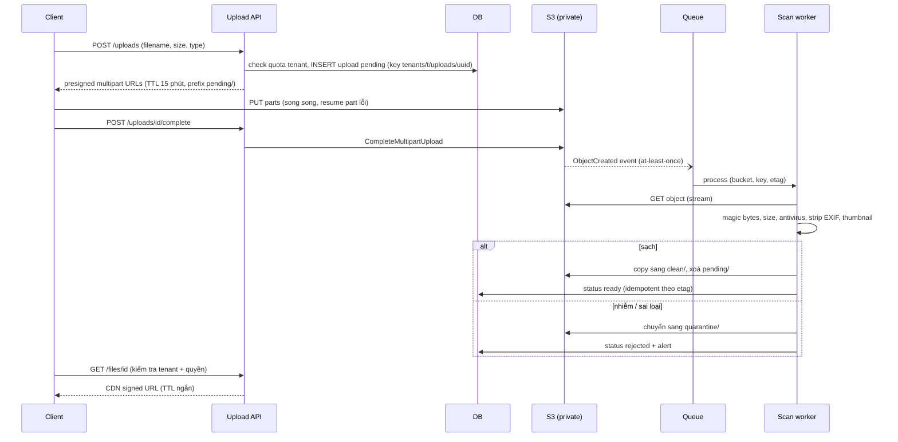
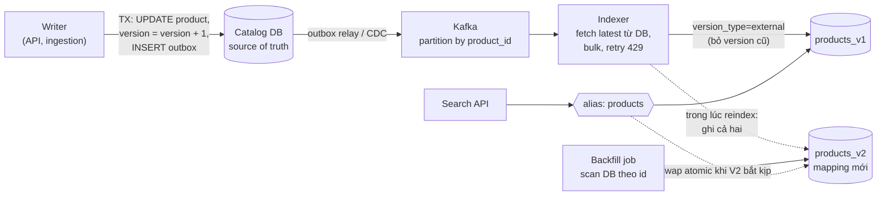

## Bối cảnh & vấn đề

Một nền tảng B2B cho phép nhà cung cấp upload hoá đơn PDF và ảnh sản phẩm. Phiên bản đầu nhận file qua `multipart/form-data` vào API Node, lưu tạm `/tmp`, rồi đẩy lên S3. Một nhà cung cấp upload file 1,8 GB: request chiếm một connection 15 phút, pod hết đĩa tạm, health check lỗi, pod bị kill, upload thất bại ở 90%. Tuần sau, một file "anh_san_pham.png" hoá ra là file thực thi Windows, được phục vụ thẳng từ bucket công khai với tên gốc.

Cùng nền tảng có catalog vài triệu SKU từ hàng trăm nhà cung cấp, đẩy feed CSV/API mỗi ngày. Search ban đầu là `WHERE name ILIKE '%tai nghe%'`: 4 giây mỗi query, không tìm được "tai nghe" khi gõ "tai nghé", không có facet theo thương hiệu. Khi chuyển sang Elasticsearch, có lúc giá trong kết quả search khác giá trên trang chi tiết vì một event cập nhật cũ đến sau event mới.

Bài này đi qua ba hệ thống "dữ liệu lớn, đi qua nhiều bước": upload file (đưa byte ra khỏi API server), search indexing (giữ một index dẫn xuất đồng bộ với DB), và catalog ingestion (pipeline nhiều bước, chịu lỗi từng dòng). Chúng có chung các nguyên tắc: **source of truth rõ ràng**, **xử lý async idempotent**, và **chịu lỗi một phần** thay vì hỏng toàn bộ. Search engine chi tiết ở track [NoSQL & Search](/tracks/nosql-search/learn/db-es-sync-indexer).

## Khái niệm

### Presigned URL

**Presigned URL** là một URL tới object storage (S3, GCS, Azure Blob) có chữ ký của server, cho phép **bất kỳ ai cầm URL** thực hiện **đúng một thao tác** (PUT một key cụ thể, hoặc GET) trong **thời gian giới hạn**, mà không cần credential. API server chỉ cấp URL (vài ms, không chạm byte); client upload thẳng lên S3; S3 chịu băng thông, retry và độ bền.

Hai loại cho upload:

- **Presigned PUT**: ký một request PUT tới key cố định. Có thể ký thêm header (`Content-Type`, `Content-Length`) để S3 từ chối nếu client gửi khác; header nào **không** được ký thì client gửi gì cũng được. Không có cách nói "tối đa 10 MB": chỉ ký được một `Content-Length` chính xác.
- **Presigned POST** (form upload với policy): policy có điều kiện như `content-length-range` (min, max), `starts-with $Content-Type image/`, key cố định hoặc prefix. Đây là cách giới hạn kích thước tối đa.

Với file lớn, dùng **multipart upload**: chia file thành part (tối thiểu 5 MiB trừ part cuối, tối đa 10.000 part, verify giới hạn hiện hành), mỗi part một presigned URL riêng, client upload song song và **resume** được part lỗi, cuối cùng gọi `CompleteMultipartUpload`. Upload dở dang vẫn tốn tiền lưu trữ cho tới khi bị abort, nên đặt lifecycle rule `AbortIncompleteMultipartUpload` sau vài ngày.

**Interview angle:** follow-up câu 020: "làm sao ngăn người khác dùng presigned URL của bạn để host file 5 GB?" — TTL ngắn (vài phút), POST policy với `content-length-range`, key do server đặt (không cho client chọn), ký `Content-Type`, upload vào prefix `pending/` không public, và quota per tenant kiểm tra lúc cấp URL.

### Pipeline sau upload

Upload xong chưa phải là xong. File phải qua: **validate** (kích thước thật, **magic bytes** để biết loại file thật, không tin extension hay `Content-Type` client gửi), **antivirus** (ClamAV hoặc dịch vụ quét), **xử lý** (strip EXIF chứa GPS, tạo thumbnail, trích metadata, OCR hoá đơn), rồi mới chuyển sang trạng thái **ready** và cho phép tải. File nhiễm hoặc sai loại bị **quarantine** (chuyển sang prefix/bucket riêng, không ai đọc được) và alert.

Mô hình trạng thái: `pending` (đã cấp URL) → `uploaded` (S3 event báo object tồn tại) → `scanning` → `ready` hoặc `rejected`. Không ai tải được file trước `ready`. S3 event notification (qua SQS/EventBridge) là at-least-once nên worker phải idempotent theo `(bucket, key, version/etag)`.

### Tenant isolation cho file

Key đặt theo `tenants/{tenantId}/uploads/{uuid}`, **không bao giờ** dùng tên file của user làm key (path traversal, ghi đè, ký tự lạ); tên gốc lưu trong DB để hiển thị và gửi qua `Content-Disposition` khi tải. Bucket **private**; tải qua **signed URL** hoặc signed cookie của CDN (CloudFront với origin access control), TTL ngắn, và chỉ ký **sau khi** kiểm tra authorization: object thuộc tenant của user, user có quyền xem.

Follow-up câu 033: "object key bị lộ thì sao?" — key lộ không đủ để đọc vì bucket private, mọi GET cần chữ ký; chữ ký chỉ được cấp sau khi kiểm tra quyền theo tenant; thêm IAM policy giới hạn role của service theo prefix tenant nếu dùng credential theo tenant, và cân nhắc mã hoá per tenant (SSE-KMS với key riêng) cho tenant enterprise.

### Inverted index

`LIKE '%term%'` có wildcard ở đầu nên **không dùng được B-tree index**: Postgres phải quét toàn bộ bảng (trigram index `pg_trgm` giúp được phần này). Nhưng tốc độ chỉ là một phần; search thật cần **relevance** (kết quả nào lên trước), **stemming/analysis** (chạy, chạy bộ), **typo tolerance**, **facet** (đếm theo thương hiệu, khoảng giá), **tiếng Việt có dấu và không dấu**.

Search engine (Elasticsearch, OpenSearch) dựng **inverted index**: với mỗi **term** sau khi qua **analyzer** (tokenize, lowercase, ASCII folding "nghé" → "nghe"), lưu danh sách document chứa nó (posting list). Query "tai nghe" tra hai posting list, giao/hợp, chấm điểm **BM25** (term hiếm có trọng số cao, document ngắn chứa term có điểm cao hơn). Facet dùng doc values (cột) để aggregate nhanh.

### Đồng bộ DB → search index

DB là **source of truth**; index là **view dẫn xuất** có thể rebuild. Luồng chuẩn:

1. Thay đổi trong DB phát ra event bằng **transactional outbox** (bảng outbox ghi cùng transaction) hoặc **CDC** (Debezium đọc WAL/binlog). Tránh dual write (ghi DB rồi gọi ES trong request: một trong hai có thể thất bại).
2. Event qua queue/Kafka (partition theo `product_id` để giữ thứ tự cho một sản phẩm).
3. **Indexer** idempotent đọc event, thường **fetch lại** bản mới nhất từ DB (event chỉ là tín hiệu "sản phẩm X đổi"), dựng document, gửi **bulk API**.
4. Chống **out-of-order**: mỗi document mang `version` từ DB (cột `version` tăng mỗi lần update, hoặc LSN/`updated_at` dạng số); index với `version_type=external` nên ES **từ chối** ghi có version nhỏ hơn hoặc bằng version đang có (`409 version_conflict`).
5. **Reindex** toàn bộ (đổi mapping, analyzer) vào index mới `products_v2`, trong lúc đó vẫn ghi delta vào cả hai (dual write ở indexer) hoặc replay từ checkpoint; xong thì **alias swap** atomic: alias `products` chuyển từ v1 sang v2 trong một request `_aliases`. Ứng dụng luôn query qua alias.

Chấp nhận lag vài giây (ES refresh mặc định 1 giây, cộng lag pipeline); trang chi tiết và checkout đọc từ DB, không từ index.

### Catalog ingestion

**Ingestion pipeline** nhận dữ liệu từ bên ngoài (feed CSV, API, SFTP) có chất lượng không kiểm soát được, và đưa vào hệ thống qua nhiều bước: nhận file → parse → validate → **staging** → **enrich** (map category của nhà cung cấp sang taxonomy của mình, chuẩn hoá thuộc tính "Màu: Đỏ/RED/red", tải ảnh, tính giá) → **upsert** vào catalog DB → index. Ba nguyên tắc:

- **Lỗi theo dòng, không theo file**: một dòng sai không làm fail cả file 2 triệu dòng; ghi lỗi kèm số dòng, lý do, trả báo cáo cho nhà cung cấp.
- **Idempotent và có version**: chạy lại một feed (retry, gửi trùng) không tạo bản ghi trùng; dùng natural key `(supplier_id, supplier_sku)` để upsert, và chỉ cập nhật khi nội dung thật sự đổi (so hash) để không đẩy hàng triệu event index vô ích.
- **Tách khỏi DB giao dịch**: ingestion chạy với tốc độ có kiểm soát (batch nhỏ, throttle) để không làm chậm checkout.

Follow-up câu 046: "feed sẽ xoá 60% catalog của nhà cung cấp" — **safety threshold**: so số SKU trong feed với số SKU hiện có; nếu feed full làm biến mất quá X% (ví dụ 20%), **dừng lại** ở staging và yêu cầu xác nhận thủ công. Xoá là **soft delete** (ẩn khỏi search, giữ dữ liệu N ngày), và feed delta không được ngầm hiểu "SKU không có mặt = xoá".

## Cơ chế hoạt động

### Pipeline upload file



API server không bao giờ chạm byte của file: nó cấp URL, ghi trạng thái, và ký URL tải. Worker xử lý async, nên upload xong file chưa dùng được ngay (trade-off: scan đồng bộ chặn user vài giây tới vài phút với file lớn). Mọi bước của worker idempotent theo etag/version, nên event trùng hoặc worker chết giữa chừng chỉ làm việc bị lặp lại, không sai.

### Đồng bộ DB → Elasticsearch và reindex



Đọc hình: writer ghi DB và outbox trong một transaction; relay đẩy event lên Kafka; indexer gửi bulk vào index hiện tại qua external version. Khi cần reindex, backfill job quét DB vào `products_v2` trong khi indexer ghi delta vào cả hai; vì cả backfill lẫn delta đều dùng external version, thứ tự giữa chúng không quan trọng (bản mới hơn luôn thắng). Khi v2 bắt kịp (so số document và checksum mẫu), một request `_aliases` chuyển alias; rollback cũng chỉ là swap ngược.

## Ví dụ thực tế

### Presigned PUT và POST với AWS SDK v3

`@aws-sdk/client-s3` và `@aws-sdk/s3-request-presigner` 3.1144, credential giả (ký URL không cần gọi mạng):

```ts
const key = `tenants/${tenant}/uploads/${randomUUID()}`;
const put = await getSignedUrl(s3, new PutObjectCommand({ Bucket: "acme-uploads", Key: key, ContentType: "image/png", ContentLength: 2_000_000 }), { expiresIn: 300 });
console.log("signed headers:", new URL(put).searchParams.get("X-Amz-SignedHeaders"));

const signedCt = await getSignedUrl(s3, new PutObjectCommand({ Bucket: "acme-uploads", Key: key, ContentType: "image/png", ContentLength: 2_000_000 }),
  { expiresIn: 300, signableHeaders: new Set(["content-type"]) });
console.log("with signableHeaders:", new URL(signedCt).searchParams.get("X-Amz-SignedHeaders"));

const post = await createPresignedPost(s3, { Bucket: "acme-uploads", Key: key, Expires: 300,
  Conditions: [["content-length-range", 1, 10 * 1024 * 1024], ["starts-with", "$Content-Type", "image/"]], Fields: { "Content-Type": "image/png" } });
console.log("policy:", JSON.stringify(JSON.parse(Buffer.from(post.fields.Policy, "base64").toString()).conditions));
```

```text
signed headers: content-length;host | expires: 300
with signableHeaders: content-length;content-type;host
policy: [["content-length-range",1,10485760],["starts-with","$Content-Type","image/"],{"Content-Type":"image/png"},{"bucket":"acme-uploads"},{"X-Amz-Algorithm":"AWS4-HMAC-SHA256"},{"X-Amz-Credential":"AKIAEXAMPLE/20261001/ap-southeast-1/s3/aws4_request"},{"X-Amz-Date":"20261001T024135Z"},{"key":"tenants/t_42/uploads/d4a511e2-8f11-48cf-a8f6-ff1e544075f5"}]
```

Gotcha thật: dù truyền `ContentType: "image/png"`, presigned PUT mặc định chỉ ký `content-length;host`, nên client có thể upload với `Content-Type: text/html` và S3 vẫn chấp nhận (một file HTML trên domain của bạn là XSS nếu bucket/CDN phục vụ inline). Phải yêu cầu ký thêm bằng `signableHeaders` (hành vi theo version SDK, verify với version bạn dùng). Presigned POST thì policy chứa đủ điều kiện, kể cả **giới hạn kích thước 1 byte tới 10 MiB**, thứ presigned PUT không làm được.

### Magic bytes: đừng tin extension

```ts
const sniff = (b: Buffer) =>
  b.subarray(0, 8).equals(Buffer.from([0x89, 0x50, 0x4e, 0x47, 0x0d, 0x0a, 0x1a, 0x0a])) ? "image/png"
  : b.subarray(0, 3).equals(Buffer.from([0xff, 0xd8, 0xff])) ? "image/jpeg"
  : b.subarray(0, 4).toString() === "%PDF" ? "application/pdf"
  : b.subarray(0, 2).toString() === "MZ" ? "application/x-msdownload" : "unknown";
```

```text
cat.png      claims image/png -> sniffed image/png
invoice.pdf  claims application/pdf -> sniffed application/pdf
photo.png    claims image/png -> sniffed application/x-msdownload
```

"photo.png" bắt đầu bằng `MZ`, header của file thực thi Windows: đúng trường hợp của phần Bối cảnh. Trong production dùng thư viện như `file-type` (đọc vài KB đầu từ stream), và kết hợp với antivirus; magic bytes chỉ chặn được file khai sai loại, không chặn được PDF chứa mã độc.

### External version chặn update đến muộn

Một index giả lập đúng quy tắc của Elasticsearch `version_type=external` (chỉ ghi khi version mới lớn hơn version đang có). DB commit v1 → v2 → v3, nhưng queue giao lại theo thứ tự v1, v3, v3 (giao lại), v2 (đến muộn):

```ts
function indexExternal(d: Doc) {
  const cur = index.get(d.sku);
  if (cur && d.version <= cur.version) return `409 version_conflict (have v${cur.version}, got v${d.version})`;
  index.set(d.sku, d); return `200 indexed v${d.version}`;
}
```

```text
event v1 price=100 -> 200 indexed v1
event v3 price=120 -> 200 indexed v3
event v3 price=120 -> 409 version_conflict (have v3, got v3)
event v2 price=90 -> 409 version_conflict (have v3, got v2)
naive last-write-wins index: { sku: 'A', price: 90, version: 2 } | versioned index: { sku: 'A', price: 120, version: 3 }
```

Index "ghi đè cuối cùng thắng" kết thúc với giá **90 (v2, cũ)** trong khi DB là 120: đúng sự cố "giá search khác trang chi tiết" (follow-up câu 021). Index có version giữ 120. Request thật tới Elasticsearch (minh hoạ):

```http
PUT /products/_doc/A?version=3&version_type=external
Content-Type: application/json

{ "sku": "A", "name": "Tai nghe XYZ", "price": 120, "tenant_id": "t_42" }
```

Trong bulk indexer, 409 từ external version là **thành công về mặt nghiệp vụ** (đã có bản mới hơn), không được retry và không đẩy vào DLQ.

### Alias swap

```http
POST /_aliases
Content-Type: application/json

{ "actions": [
  { "remove": { "index": "products_v1", "alias": "products" } },
  { "add":    { "index": "products_v2", "alias": "products", "is_write_index": true } }
] }
```

Hai action trong một request được áp dụng atomic: không có thời điểm nào alias trỏ vào không index hoặc cả hai (minh hoạ; cú pháp theo docs Elasticsearch hiện hành).

### CV: Data Enrichment service và ES Indexer (câu 058)

Khung trả lời, điền số liệu thật:

```text
Nguồn thay đổi:  <outbox / CDC Debezium / event từ service / polling updated_at> và vì sao
                 (polling updated_at: đơn giản nhưng sót update cùng timestamp và không thấy delete)
Enrichment:      các bước (map category, chuẩn hoá thuộc tính, ảnh, giá); cache lookup (taxonomy, brand);
                 lỗi từng record -> retry có giới hạn -> DLQ + báo cáo cho supplier
Indexer:         bulk 5-15 MB hoặc 1.000-5.000 doc; 429 es_rejected_execution -> backoff + giảm concurrency;
                 idempotent bằng version_type=external (hoặc so updated_at)
Reindex:         products_vN mới, backfill + dual write delta, so count/checksum, alias swap, giữ vN-1 để rollback
Tenant:          filter tenant_id bắt buộc ở tầng query (filtered alias per tenant hoặc index per tenant lớn)
Đồng bộ:         job so sánh định kỳ (count theo tenant, checksum theo khoảng id) DB vs index, alert drift
Số liệu:         <số document, thời gian full reindex, lag p95 DB -> search>
```

Follow-up "làm sao bạn biết index đồng bộ với DB?": metric lag (thời gian từ commit tới document visible), job **drift detection** so count và checksum theo tenant/khoảng id, và lấy mẫu ngẫu nhiên document để so từng trường. Không có con số đo thì câu trả lời là "chúng tôi hy vọng".

## Trade-offs & lựa chọn thay thế

| Quyết định | Lựa chọn A | Lựa chọn B | Chọn A khi |
| --- | --- | --- | --- |
| Upload | Presigned URL thẳng lên S3 | Qua API server | Gần như luôn A; B chỉ cho file rất nhỏ cần xử lý đồng bộ |
| Giới hạn upload | Presigned POST (policy) | Presigned PUT + ký header | Cần giới hạn kích thước tối đa, upload từ form; B khi cần multipart / đơn giản và biết chính xác kích thước |
| Scan | Async (file chưa dùng được ngay) | Đồng bộ trước khi trả lời | File lớn, nhiều; B khi file nhỏ và UX cần kết quả ngay |
| Search | Elasticsearch/OpenSearch | Postgres FTS + `pg_trgm` | Relevance, facet, typo, nhiều ngôn ngữ, dataset lớn; B khi vừa, muốn ít hệ thống |
| Nguồn event | Outbox | CDC (Debezium) | Kiểm soát được code writer, event có ngữ nghĩa nghiệp vụ; B khi nhiều writer/legacy, không sửa được code |
| Document | Indexer fetch lại từ DB | Dùng payload của event | Đúng tuyệt đối, event chỉ là tín hiệu; B khi muốn giảm tải DB và event đầy đủ, có version |
| Ingestion | Batch theo feed | Streaming theo record | Nhà cung cấp gửi file định kỳ; B khi API push từng thay đổi |
| Reindex | Index mới + alias swap | Update by query tại chỗ | Đổi mapping/analyzer; B chỉ cho thay đổi nhỏ không đổi mapping |

Chọn thế nào: upload luôn qua presigned URL (POST nếu cần giới hạn kích thước, multipart cho file lớn), pipeline async với trạng thái rõ ràng. Search: bắt đầu với Postgres FTS nếu dataset nhỏ và yêu cầu đơn giản; chuyển sang Elasticsearch khi cần relevance và facet thật, với outbox + external version + alias từ ngày đầu. Ingestion: batch + staging + lỗi theo dòng + safety threshold.

## Edge cases & failure modes

- **Upload dở dang**: multipart không bao giờ complete vẫn tốn tiền; lifecycle abort sau 1–7 ngày; record `pending` quá hạn được dọn.
- **S3 event trùng hoặc đến trước khi API ghi record**: worker idempotent theo etag; nếu chưa có record thì retry sau (hoặc tạo từ metadata của object).
- **Worker chết giữa scan**: message quay lại queue (visibility timeout); bước copy/move idempotent.
- **File độc lọt qua scan** (signature chưa có): phục vụ với `Content-Disposition: attachment`, domain riêng cho user content, không phục vụ inline HTML/SVG.
- **ES bulk trả 429**: thread pool write đầy; backoff, giảm concurrency/kích thước bulk, và theo dõi lag thay vì retry dồn dập. Bulk có thể **thành công một phần**: phải đọc lỗi từng item, không chỉ status HTTP.
- **Delete không được index**: CDC thấy delete, polling `updated_at` thì không; soft delete với version hoặc tombstone event.
- **Mapping explosion**: thuộc tính động của nhà cung cấp tạo hàng nghìn field; dùng `flattened` hoặc key/value nested có kiểm soát.
- **Feed lỗi một phần**: báo lỗi theo dòng; poison record vào DLQ; feed sai định dạng toàn bộ bị dừng ở bước parse, không chạm catalog.
- **Feed làm biến mất phần lớn catalog**: safety threshold + duyệt thủ công + soft delete.
- **Enrichment chậm** (tải ảnh, gọi dịch vụ dịch): tách thành bước riêng; sản phẩm có thể hiển thị khi chưa enrich xong (với dữ liệu tối thiểu) hoặc ẩn tới khi xong, tuỳ business.

## Pitfalls

- ❌ Nhận file qua API server rồi đẩy lên S3 → ✅ presigned URL, client upload thẳng.
- ❌ Tin extension/`Content-Type` của client → ✅ magic bytes + antivirus; ký `Content-Type` (`signableHeaders`) hoặc dùng POST policy.
- ❌ Dùng tên file của user làm object key → ✅ `tenants/{t}/uploads/{uuid}`, tên gốc trong DB.
- ❌ Bucket public để "tải cho nhanh" → ✅ private + CDN signed URL sau khi kiểm tra quyền theo tenant.
- ❌ `ILIKE '%x%'` cho search sản phẩm → ✅ search engine với analyzer (ASCII folding cho tiếng Việt), hoặc ít nhất `pg_trgm`.
- ❌ Ghi DB rồi gọi ES trong request → ✅ outbox/CDC + indexer async.
- ❌ Index không có version → ✅ `version_type=external` (hoặc so `updated_at` dạng số), coi 409 là thành công.
- ❌ Reindex tại chỗ khi đổi mapping → ✅ index mới + alias swap, giữ index cũ để rollback.
- ❌ Fail cả feed vì một dòng sai → ✅ lỗi theo dòng, báo cáo cho nhà cung cấp, DLQ cho poison record.

## Tóm tắt

- Presigned URL đưa byte ra khỏi API server; POST policy giới hạn được kích thước, PUT thì không; AWS SDK v3 không ký `Content-Type` của PUT nếu không yêu cầu `signableHeaders` (chạy thật); multipart cho file lớn + lifecycle abort.
- Pipeline sau upload: `pending → uploaded → scanning → ready/rejected`, magic bytes + antivirus + strip EXIF, worker idempotent theo etag, quarantine file độc.
- Tenant isolation cho file: key theo tenant + uuid, bucket private, signed URL ngắn hạn sau khi kiểm tra quyền.
- Search: inverted index + analyzer + BM25; DB là source of truth, sync bằng outbox/CDC → queue → indexer idempotent với external version (bản cũ đến muộn bị từ chối, mô phỏng thật), reindex bằng alias swap.
- Ingestion: staging, enrich, upsert theo natural key, chỉ cập nhật khi hash đổi, lỗi theo dòng, safety threshold chống feed xoá hàng loạt, backpressure khi ES chậm.
