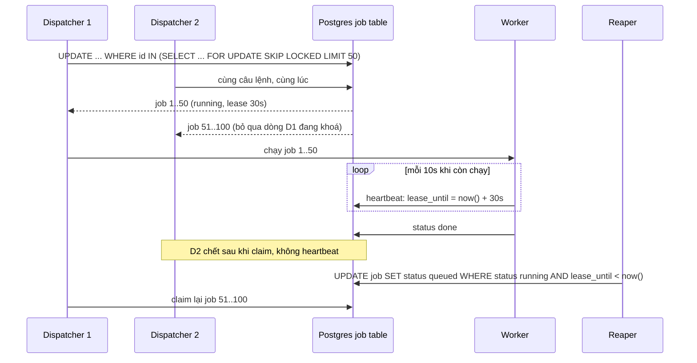
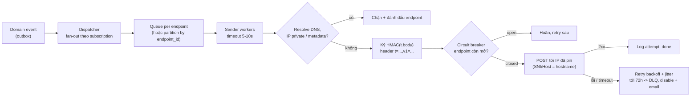

## Bối cảnh & vấn đề

Ba sự cố trong cùng một quý của một hệ thống quản lý chuỗi bán lẻ:

1. Báo cáo doanh thu hằng đêm được gửi cho giám đốc **ba lần**. API chạy 3 replica, mỗi replica có `node-cron` với `0 2 * * *`.
2. Nhân viên ở Sydney thấy ca "Thứ Hai 09:00–17:00" hiển thị thành **10:00–18:00** từ đầu tháng 10. Template ca được tạo hồi tháng 5 và lưu giờ dưới dạng UTC cố định.
3. Một khách hàng enterprise đăng ký webhook tới `http://169.254.169.254/latest/meta-data/`. Hệ thống ngoan ngoãn gọi URL đó và lưu response (chứa thông tin credential của instance) vào log delivery mà khách xem được.

Ba sự cố thuộc ba hệ thống khác nhau nhưng cùng một họ: **việc xảy ra theo thời gian, không theo request** (job định lịch, ca làm việc lặp lại, notification, webhook). Chúng khó vì thời gian là thứ dễ hiểu sai (time zone, DST), vì "chạy đúng một lần" không có thật trong hệ phân tán, và vì gửi request ra ngoài tới URL do người khác cung cấp là một bề mặt tấn công. Bài này thiết kế từng hệ thống với code chạy thật trên Postgres 17, Luxon 3.7 và Node 24.21.

## Khái niệm

### Vì sao cron trong process không scale

**In-process scheduler** (`node-cron`, `node-schedule`, Spring `@Scheduled`) chạy trong mọi instance của app. Với N instance, mỗi job chạy **N lần**. Các cách sửa, theo thứ tự tăng dần độ vững:

- **Distributed lock** trước khi chạy (`SET lock:daily-report token NX PX 600000`): chỉ instance lấy được lock chạy. Đơn giản, nhưng nếu instance giữ lock chết giữa chừng thì job không chạy lại cho tới khi lock hết hạn, và việc nhả lock phải là compare-and-delete atomic (Lua), không phải `GET` rồi `DEL`.
- **Leader election**: một instance làm leader và là nơi duy nhất trigger job.
- **Tách scheduler ra khỏi app**: một component duy nhất (hoặc managed: K8s CronJob, EventBridge Scheduler) quyết định **khi nào** chạy và enqueue job; một đội worker quyết định **ai** chạy. Đây là mô hình production phổ biến nhất.

Dù chọn gì, **handler phải idempotent**. K8s CronJob chẳng hạn chỉ tạo Job "khoảng một lần" mỗi lịch; tài liệu Kubernetes nói rõ có trường hợp tạo hai Job hoặc không tạo Job nào, nên job phải idempotent (verify với docs version bạn dùng). Báo cáo hằng đêm idempotent nghĩa là: trước khi gửi, ghi `report_runs(report_date)` với unique constraint; ai chèn được mới gửi.

### Job scheduler phân tán

Một scheduler cho hàng triệu job (one-off "nhắc lịch lúc 09:00" và cron "mỗi thứ Hai") cần: lưu job **bền** (sống qua restart), nhặt job đến hạn nhanh, **không chạy trùng** (hoặc chạy trùng vô hại), retry với backoff, phục hồi khi worker chết, và quan sát được.

Thiết kế trên Postgres:

- Bảng `job(id, kind, payload, run_at, status, lease_until, attempts, locked_by)` với **partial index** `(run_at) WHERE status = 'queued'`.
- Nhiều **dispatcher** cùng chạy `UPDATE job SET status='running', lease_until = now() + 30s ... WHERE id IN (SELECT id FROM job WHERE status='queued' AND run_at <= now() ORDER BY run_at FOR UPDATE SKIP LOCKED LIMIT 100) RETURNING id`. `FOR UPDATE` khoá các dòng được chọn; `SKIP LOCKED` khiến dispatcher khác **bỏ qua** dòng đang bị khoá thay vì chờ, nên N dispatcher nhặt N tập job rời nhau mà không tranh chấp.
- **Lease**: job đang chạy có `lease_until`; worker còn sống thì **heartbeat** gia hạn lease. Worker chết thì lease hết hạn, một **reaper** đưa job về `queued` (tăng `attempts`, tính `run_at` mới theo backoff), và job được nhặt lại. Hệ quả: at-least-once, nên handler idempotent.
- **Cron**: lưu biểu thức cron + **IANA zone**; sau mỗi lần chạy, tính `next_run_at` theo zone (xử lý DST), không phải "cộng 24 giờ".
- **Missed schedule** khi hệ thống down: chính sách **catch-up** (chạy bù mọi lần lỡ), **chạy một lần** cho mọi lần lỡ, hoặc **skip** (nhắc lịch 09:00 mà chạy lúc 14:00 thì vô nghĩa). Chính sách thuộc về **từng loại job**.
- **Thundering herd lúc 00:00**: hàng triệu job "nửa đêm" cùng đến hạn; thêm jitter vài phút cho job không cần chính xác.

DB polling chịu được tới cỡ nghìn job/giây với index tốt; lớn hơn thì chuyển sang time-bucketed (Redis ZSET `ZRANGEBYSCORE` theo `run_at`, hoặc timing wheel) hoặc managed (EventBridge Scheduler).

### Time zone: instant, wall time và IANA zone

Ba khái niệm thường bị trộn lẫn:

- **Instant**: một điểm trên dòng thời gian, không phụ thuộc nơi chốn (`2026-10-11T22:00:00Z`). Lưu bằng `timestamptz` (Postgres lưu UTC bên trong).
- **Wall time** (local time): giờ trên đồng hồ treo tường ở một nơi ("09:00").
- **Time zone** theo IANA (`Australia/Sydney`, `Asia/Ho_Chi_Minh`): **tập luật** ánh xạ wall time ↔ instant theo thời gian, gồm DST và các lần chính phủ đổi luật. **Offset** (`+10:00`) chỉ là kết quả của luật tại một instant; offset không phải time zone.

Quy tắc lưu trữ: **lịch lặp** (ca "Thứ Hai 09:00", "nhắc mỗi sáng 08:00") lưu **wall time + IANA zone**, vì ý nghĩa của nó là "09:00 theo đồng hồ ở Sydney", và mỗi lần sinh occurrence mới chuyển sang instant **cho ngày cụ thể đó**. **Sự kiện cụ thể** (ca ngày 2026-10-12, thời điểm gửi nhắc) lưu **instant UTC** (kèm zone để hiển thị). Lưu lịch lặp bằng UTC cố định (tính từ offset lúc tạo) là lỗi kinh điển: khi DST đổi offset, giờ hiển thị lệch 1 tiếng.

**DST có hai cạnh**: **gap** (đồng hồ nhảy từ 02:00 lên 03:00, nên 02:30 không tồn tại) và **overlap** (đồng hồ lùi từ 03:00 về 02:00, nên 02:30 xảy ra **hai lần**). Thư viện phải được cấu hình chính sách rõ (Temporal có `disambiguation: 'compatible' | 'earlier' | 'later' | 'reject'`); ca qua đêm trong đêm đổi giờ dài 7 hoặc 9 tiếng thật, và lương phải tính theo **duration thật**.

### Shift scheduling

Mô hình dữ liệu cho chuỗi cửa hàng nhiều time zone:

- `stores(id, tz)` với `tz` là IANA zone.
- `shift_templates(store_id, weekday, start_local, end_local)`: wall time.
- `shifts(id, store_id, employee_id, during tstzrange, tz)`: occurrence cụ thể, `tz` là **snapshot** zone của store lúc sinh (để hiển thị và audit).
- Chống chồng ca: Postgres **exclusion constraint** `EXCLUDE USING gist (employee_id WITH =, during WITH &&)` (cần extension `btree_gist`): database từ chối mọi ca của cùng nhân viên có khoảng thời gian **giao nhau**, kể cả khi hai ca ở hai cửa hàng khác time zone, vì so sánh trên instant. SQL Server không có exclusion constraint: thay bằng kiểm tra trong transaction với khoá theo nhân viên (`SELECT ... WITH (UPDLOCK, HOLDLOCK)` trên dòng nhân viên, rồi kiểm tra giao nhau `start < @end AND end > @start`, rồi insert), hoặc indexed view/trigger.
- Rule giờ làm (tối đa giờ/tuần, nghỉ tối thiểu giữa hai ca) kiểm tra trong cùng transaction.
- Sinh sẵn occurrence N tuần (query đơn giản, phải regenerate khi template đổi) hay tính động (luôn đúng theo template, query phức tạp hơn).

Follow-up câu 048: "một quốc gia bỏ DST, ca đã sinh thì sao?" — luật mới đến qua bản cập nhật tzdata (của OS, runtime, DB). Occurrence đã lưu bằng instant UTC sẽ **hiển thị sai** wall time sau khi tzdata cập nhật (ca 09:00 thành 08:00 hoặc 10:00). Cách xử lý: job regenerate các occurrence **tương lai** từ template (wall time + zone vẫn đúng), thông báo cho nhân viên bị ảnh hưởng; occurrence quá khứ giữ nguyên (đã làm việc theo instant đó). Đây cũng là lý do lưu template bằng wall time.

### Notification system

Gửi email/SMS/push cho sự kiện đơn hàng nghe đơn giản, nhưng các yêu cầu thật là: nhiều kênh, template đa ngôn ngữ, **preference/opt-out** theo user và loại thông báo, **quiet hours** theo time zone của user, **ưu tiên** (OTP phải tới trong 10 giây, marketing thì không), **không gửi trùng**, retry, audit.

Thiết kế: service nghiệp vụ phát event (`order.shipped`) qua outbox → **notification service** resolve người nhận, preference, kênh, template, ngôn ngữ → tạo bản ghi `notifications(id, dedupe_key, user_id, channel, status, attempts)` với **unique `dedupe_key = event_id + channel`** (event giao lại không tạo notification thứ hai) → **queue riêng theo kênh và theo ưu tiên** → worker gọi provider (SES, Twilio, FCM/APNs) với **token bucket per provider** (provider có rate limit) → webhook trạng thái từ provider (delivered, bounced) cập nhật bản ghi.

Follow-up câu 029: "OTP phải tới trong 10 giây giữa đợt marketing blast" — **queue riêng** cho OTP (không chung hàng với 2 triệu SMS marketing), worker và quota provider **dành riêng** (hoặc provider/sender ID riêng cho transactional), marketing chạy với rate limit thấp hơn quota tổng để luôn còn chỗ, và alert theo latency p99 của OTP.

### Webhook delivery

Gửi webhook tới hàng nghìn endpoint của tenant đòi hỏi: **at-least-once** với retry backoff kéo dài 24–72 giờ; **ký payload** để receiver xác thực; **chống replay**; **cô lập** endpoint chậm (một endpoint timeout 30 giây không được làm chậm mọi endpoint khác); và **an toàn khi gọi URL do người khác cung cấp**.

- **Chữ ký**: `signature = HMAC-SHA256(secret, timestamp + "." + body)`, gửi kèm header `t=<timestamp>,v1=<hex>`. Receiver tính lại, so sánh bằng **constant-time compare**, và từ chối nếu timestamp lệch quá 5 phút (chống replay một request cũ). Thêm `event_id` trong body để receiver dedupe (vì at-least-once, và vì timestamp window vẫn cho phép replay trong 5 phút). **Secret rotation**: giữ hai secret song song trong thời gian chuyển, ký bằng secret mới, receiver chấp nhận cả hai.
- **Cô lập**: queue (hoặc partition) **theo endpoint**, timeout gửi ngắn (5–10 giây), **circuit breaker per endpoint**; endpoint lỗi liên tục nhiều ngày thì tự disable và email cho tenant.
- **SSRF**: URL do tenant nhập có thể trỏ vào mạng nội bộ của bạn (`localhost`, `10.x`, metadata `169.254.169.254`). Chặn: chỉ HTTPS, **resolve DNS rồi kiểm tra IP** (chặn private, loopback, link-local, CGNAT, IPv6 tương ứng), rồi **kết nối tới đúng IP đã kiểm tra** (pin IP; nếu resolve lại lúc connect, attacker đổi DNS giữa hai lần resolve: DNS rebinding), không follow redirect (hoặc kiểm tra lại mỗi hop), chạy sender trong mạng egress riêng không có quyền vào mạng nội bộ.
- **Thin event vs full payload** (follow-up câu 049): gửi **thin event** (`{type, id, occurred_at}`) để receiver gọi API lấy dữ liệu mới nhất. Lợi ích: không lộ dữ liệu nhạy cảm qua webhook (URL có thể bị cấu hình sai), không có vấn đề thứ tự (receiver luôn lấy bản mới nhất), payload nhỏ, và authorization được kiểm tra lại khi gọi API. Đổi lại: thêm một round trip và tải API.

## Cơ chế hoạt động

### Dispatcher, lease và reaper



`SKIP LOCKED` là thứ làm cho nhiều dispatcher không giẫm lên nhau mà không cần lock phân tán riêng: tranh chấp được giải quyết bởi khoá dòng của chính Postgres. Lease biến "worker chết" từ một sự cố (job kẹt vĩnh viễn) thành một độ trễ (job chạy lại sau tối đa 30 giây). Cái giá là at-least-once: worker có thể đã làm xong việc nhưng chết trước khi ghi `done`, và job chạy lại.

### Luồng gửi webhook



Mỗi endpoint có hàng đợi riêng nên một endpoint chậm chỉ làm chậm chính nó. SSRF được kiểm tra **trước mỗi lần gửi** (DNS có thể đổi sau khi đăng ký). Mọi attempt được log để tenant xem và bấm "redeliver".

## Ví dụ thực tế

### Ba dispatcher, 1.000 job, một dispatcher chết

Postgres 17, pg 8.23. 1.000 job đến hạn; ba dispatcher cùng claim theo lô 50; dispatcher `d3` "chết" sau khi claim lô thứ hai (không bao giờ đánh dấu done); sau đó reaper đưa job hết lease về hàng đợi:

```ts
async function claim(worker: string, batch = 50) {
  const { rows } = await db.query(`UPDATE job SET status='running', lease_until=now() + interval '30 seconds', attempts=attempts+1, locked_by=$1
    WHERE id IN (SELECT id FROM job WHERE status='queued' AND run_at <= now() ORDER BY run_at FOR UPDATE SKIP LOCKED LIMIT $2)
    RETURNING id`, [worker, batch]);
  return rows.map((r) => Number(r.id));
}
```

```text
claimed per dispatcher: [ 450, 450, 100 ] | jobs run twice: 0
stuck: [
  { status: 'done', count: '950' },
  { status: 'running', count: '50' }
]
reaper requeued: 50 | picked up again by d1: 50
```

Không job nào bị hai dispatcher claim cùng lúc (`jobs run twice: 0`). 50 job của dispatcher chết kẹt ở `running` cho tới khi lease hết; reaper đưa chúng về `queued` và `d1` nhặt lại. Đây là câu trả lời cho follow-up câu 032 về node-cron trên 3 instance: (1) ngay lập tức, thêm guard idempotent (`report_runs` unique theo ngày) để lần thứ hai và thứ ba không gửi; (2) chuyển trigger ra một nơi duy nhất (K8s CronJob với `concurrencyPolicy: Forbid`, EventBridge Scheduler, hoặc một job row trong bảng trên) và để worker thực thi; (3) thêm alert "job hằng ngày không chạy trong 25 giờ" (dead man's switch).

### Ca Sydney lệch giờ khi DST

Luxon 3.7.2. Template lỗi lưu "Thứ Hai 09:00" bằng giờ UTC cố định tính hồi tháng 5 (AEST, UTC+10): Chủ nhật 23:00 UTC. Hiển thị lại ở các thời điểm trong năm, rồi so với cách lưu wall time + zone:

```ts
const zone = "Australia/Sydney";
const show = (utcIso: string) => DateTime.fromISO(utcIso, { zone: "utc" }).setZone(zone).toFormat("ccc yyyy-MM-dd HH:mm ZZZZ");
for (const sunday of ["2026-05-17", "2026-10-11", "2027-01-10", "2027-04-04", "2027-04-11"])
  console.log(`buggy  ${sunday}T23:00Z -> ${show(`${sunday}T23:00:00Z`)}`);
const occurrence = (date: string, hhmm: string) => DateTime.fromISO(`${date}T${hhmm}`, { zone });
```

```text
buggy  2026-05-17T23:00Z -> Mon 2026-05-18 09:00 GMT+10
buggy  2026-10-11T23:00Z -> Mon 2026-10-12 10:00 GMT+11
buggy  2027-01-10T23:00Z -> Mon 2027-01-11 10:00 GMT+11
buggy  2027-04-04T23:00Z -> Mon 2027-04-05 09:00 GMT+10
buggy  2027-04-11T23:00Z -> Mon 2027-04-12 09:00 GMT+10
fixed  2026-05-18 09:00-17:00 Australia/Sydney -> start 2026-05-17T23:00:00.000Z (+10:00), 8h
fixed  2026-10-12 09:00-17:00 Australia/Sydney -> start 2026-10-11T22:00:00.000Z (+11:00), 8h
fixed  2027-01-11 09:00-17:00 Australia/Sydney -> start 2027-01-10T22:00:00.000Z (+11:00), 8h
gap     2026-10-04 02:30 (does not exist) -> luxon gives 2026-10-04T03:30:00.000+11:00
overnight shift 22:00 Sat -> 06:00 Sun across spring-forward = 7h worked
overnight shift 22:00 Sat -> 06:00 Sun across fall-back     = 9h worked
overlap 2027-04-04 02:30 (happens twice) -> luxon picks 2027-04-04T02:30:00.000+10:00 | the other one is 2027-04-04T02:30:00.000+11:00
```

Template lưu UTC cố định hiển thị **10:00** trong suốt mùa AEDT (từ Chủ nhật đầu tháng 10 tới Chủ nhật đầu tháng 4), đúng 9:00 phần còn lại của năm. Lưu ý chiều lệch: template tạo trong mùa **AEST** (UTC+10) sẽ hiện **muộn** một tiếng trong mùa hè; template tạo trong mùa **AEDT** (UTC+11) mới hiện **sớm** một tiếng (08:00) trong mùa đông. Cách lưu wall time + zone cho 09:00 quanh năm, với instant UTC đổi theo mùa (23:00Z hoặc 22:00Z).

Các cạnh DST: 02:30 ngày 2026-10-04 không tồn tại, Luxon dịch tiến thành 03:30 (giống `disambiguation: 'compatible'` của Temporal); ca đêm 22:00–06:00 qua đêm đổi giờ dài **7 giờ** (mùa xuân) hoặc **9 giờ** (mùa thu) thật, nên lương tính theo duration; 02:30 ngày 2027-04-04 xảy ra hai lần, Luxon chọn lần thứ hai (+10:00). Chính sách nào đúng là quyết định nghiệp vụ, phải ghi rõ và test (follow-up câu 059: test DST bằng các ngày cố định như trên trong unit test, với tzdata được pin trong CI).

### Exclusion constraint chống chồng ca giữa hai time zone

```sql
CREATE EXTENSION IF NOT EXISTS btree_gist;
CREATE TABLE shift (
  id bigserial PRIMARY KEY, employee_id int NOT NULL, store_id int NOT NULL,
  during tstzrange NOT NULL, tz text NOT NULL,
  EXCLUDE USING gist (employee_id WITH =, during WITH &&)
);
-- store 1, Sydney (UTC+11 on this date): 09:00-17:00
INSERT INTO shift(employee_id, store_id, during, tz) VALUES
  (7, 1, tstzrange('2026-10-12 09:00 Australia/Sydney', '2026-10-12 17:00 Australia/Sydney'), 'Australia/Sydney');
-- store 2, Perth (UTC+8): 15:00-19:00 local = 18:00-22:00 Sydney -> no overlap, accepted
INSERT INTO shift(employee_id, store_id, during, tz) VALUES
  (7, 2, tstzrange('2026-10-12 15:00 Australia/Perth', '2026-10-12 19:00 Australia/Perth'), 'Australia/Perth');
-- store 2, Perth: 13:00-19:00 local = 16:00-22:00 Sydney -> overlaps 16:00-17:00
INSERT INTO shift(employee_id, store_id, during, tz) VALUES
  (7, 2, tstzrange('2026-10-12 13:00 Australia/Perth', '2026-10-12 19:00 Australia/Perth'), 'Australia/Perth');
SELECT employee_id, store_id, lower(during) AT TIME ZONE tz AS local_start, upper(during) AT TIME ZONE tz AS local_end, tz FROM shift;
```

```text
ERROR:  conflicting key value violates exclusion constraint "shift_employee_id_during_excl"
DETAIL:  Key (employee_id, during)=(7, ["2026-10-12 05:00:00+00","2026-10-12 11:00:00+00")) conflicts with existing key (employee_id, during)=(7, ["2026-10-11 22:00:00+00","2026-10-12 06:00:00+00")).
 employee_id | store_id |     local_start     |      local_end      |        tz
-------------+----------+---------------------+---------------------+------------------
           7 |        1 | 2026-10-12 09:00:00 | 2026-10-12 17:00:00 | Australia/Sydney
           7 |        2 | 2026-10-12 15:00:00 | 2026-10-12 19:00:00 | Australia/Perth
```

Ca Perth 15:00 được nhận vì sau 17:00 Sydney; ca Perth 13:00 bị **database** từ chối vì giao 16:00–17:00 giờ Sydney, dù hai cửa hàng khác time zone và wall time "13:00" trông không chồng "09:00–17:00". Ràng buộc nằm ở DB nên không race được: hai manager cùng xếp ca cho một nhân viên ở hai cửa hàng cũng chỉ một người thành công. `tstzrange` mặc định `[)` (đóng đầu, mở cuối) nên ca 09:00–17:00 và 17:00–21:00 **không** bị coi là chồng. Follow-up câu 048 về "ca thuộc time zone của ai" khi nhân viên làm hai nơi: ca thuộc time zone của **cửa hàng** (nơi công việc diễn ra), hiển thị cho nhân viên theo zone của cửa hàng kèm nhãn zone, không theo zone của trình duyệt.

### Webhook: HMAC, replay và SSRF

```ts
const sign = (secret: string, ts: number, body: string) => createHmac("sha256", secret).update(`${ts}.${body}`).digest("hex");
function verify(secrets: string[], header: string, body: string, nowSec: number, toleranceSec = 300) {
  const m = /t=(\d+),v1=([0-9a-f]+)/.exec(header); if (!m) return "bad header";
  const ts = Number(m[1]); if (Math.abs(nowSec - ts) > toleranceSec) return "too old (replay?)";
  const given = Buffer.from(m[2], "hex");
  return secrets.some((s) => { const exp = Buffer.from(sign(s, ts, body), "hex"); return exp.length === given.length && timingSafeEqual(exp, given); }) ? "ok" : "bad signature";
}
const blocked = (ip: string) => { const b = new net.BlockList();
  for (const [a, p] of [["10.0.0.0", 8], ["172.16.0.0", 12], ["192.168.0.0", 16], ["127.0.0.0", 8], ["169.254.0.0", 16], ["100.64.0.0", 10], ["0.0.0.0", 8]] as const) b.addSubnet(a, p, "ipv4");
  b.addSubnet("::1", 128, "ipv6"); b.addSubnet("fc00::", 7, "ipv6"); b.addSubnet("fe80::", 10, "ipv6");
  return b.check(ip, net.isIPv6(ip) ? "ipv6" : "ipv4"); };
```

```text
header: t=1790000000,v1=9ad20f3ea4255fe8d788f3e2...
receiver has [old,new] secrets : ok
body tampered                  : bad signature
replayed 1 hour later          : too old (replay?)
example.com      -> 104.20.23.154    allowed
localhost        -> ::1              BLOCKED
169.254.169.254  -> 169.254.169.254  BLOCKED
10.1.2.3         -> 10.1.2.3         BLOCKED
```

Receiver giữ cả secret cũ và mới trong lúc rotation nên vẫn xác thực được. Body bị sửa hay request bị phát lại sau một giờ đều bị từ chối. Bộ lọc SSRF chặn `localhost` (resolve ra `::1`), địa chỉ metadata và dải private: đúng sự cố số 3 ở đầu bài. Trong production, sender phải kết nối tới **chính IP vừa kiểm tra** (ví dụ dùng `lookup` tuỳ biến của `http.Agent` trả IP đã pin) để chống DNS rebinding, và chặn cả IPv4-mapped IPv6 (`::ffff:10.0.0.1`).

## Trade-offs & lựa chọn thay thế

| Quyết định | Lựa chọn A | Lựa chọn B | Chọn A khi |
| --- | --- | --- | --- |
| Trigger job | Scheduler tách riêng / managed | Cron trong app + distributed lock | Production nhiều instance; B tạm thời cho app nhỏ |
| Store job | Postgres + SKIP LOCKED | Redis ZSET / BullMQ | Cần query theo nghiệp vụ (huỷ job của tenant), tới ~nghìn job/s; B khi throughput cao hơn, job ngắn |
| Managed | EventBridge Scheduler / K8s CronJob | Tự vận hành | Ít job phức tạp, đã ở trên AWS/K8s; B khi cần query/sửa hàng loạt theo dữ liệu nghiệp vụ |
| Lịch lặp | Wall time + IANA zone | UTC cố định | Luôn A cho lịch con người; B chỉ cho job hệ thống không gắn đồng hồ địa phương |
| Occurrence ca | Sinh sẵn N tuần | Tính động từ template | Cần query, chống chồng bằng constraint; B khi template đổi thường xuyên |
| Chống chồng ca | Exclusion constraint (Postgres) | Check trong transaction + lock theo nhân viên | Postgres; B trên SQL Server/MySQL |
| Notification trùng | Unique `dedupe_key` | Chấp nhận hiếm khi trùng | OTP, giao dịch; B cho marketing nếu chi phí dedupe cao |
| Webhook payload | Thin event | Full payload | Dữ liệu nhạy cảm, thứ tự quan trọng; B khi receiver không gọi lại API được |

Chọn thế nào: trigger ở một nơi, thực thi ở nhiều worker, handler idempotent; Postgres + SKIP LOCKED là lựa chọn rất tốt khi đã có Postgres và throughput vừa phải. Mọi thứ liên quan tới đồng hồ của con người lưu wall time + zone và test DST bằng ngày cố định. Notification: queue theo kênh và ưu tiên, dedupe theo event + kênh. Webhook: queue per endpoint, HMAC + timestamp + event id, SSRF guard với IP pin.

## Edge cases & failure modes

- **Worker chết sau khi làm xong, trước khi ghi done**: job chạy lại; idempotency là bắt buộc.
- **Lease quá ngắn so với job dài**: reaper đưa job đang chạy về hàng đợi, hai worker chạy cùng job; heartbeat gia hạn lease, hoặc lease > p99 thời gian job.
- **Downtime làm lỡ lịch**: catch-up / chạy một lần / skip theo loại job; K8s CronJob có `startingDeadlineSeconds` cho cửa sổ chạy bù.
- **00:00 thundering herd**: jitter cho job không cần đúng giây; partition theo `run_at`.
- **tzdata cũ** trên một server: hai service tính cùng wall time ra hai instant khác nhau. Pin và cập nhật tzdata đồng bộ (OS, runtime, DB).
- **Nhân viên làm ở hai zone**: ca thuộc zone của cửa hàng; rule "tối đa giờ/tuần" tính theo tuần của zone nào phải được chốt.
- **Quiet hours** của notification theo zone của **người nhận**, không của server; user không có zone thì dùng zone của địa chỉ/store.
- **Provider rate limit** (SMS 100/s): token bucket per provider; vượt thì hàng đợi chứ không lỗi; failover sang provider dự phòng.
- **Push token hết hạn**, email bounce/complaint: xoá token, đưa vào suppression list, không retry.
- **Endpoint webhook down nhiều ngày**: backoff tới 72 giờ, DLQ, tự disable và email tenant; nút redeliver khi họ sửa xong.
- **Receiver chậm**: timeout ngắn ở sender; receiver nên trả 2xx ngay rồi xử lý async.

## Pitfalls

- ❌ `node-cron` trong mọi replica → ✅ trigger ở một nơi (managed/scheduler) + handler idempotent.
- ❌ Nhả lock bằng `GET` rồi `DEL` → ✅ Lua compare-and-delete (hai lệnh riêng có race).
- ❌ Tin K8s CronJob "không bao giờ chạy trùng" → ✅ docs nói khoảng một lần; vẫn cần idempotent.
- ❌ Lưu lịch lặp bằng UTC hoặc offset cố định → ✅ wall time + IANA zone, chuyển sang instant mỗi occurrence.
- ❌ Hiển thị ca theo zone của trình duyệt → ✅ zone của cửa hàng, có nhãn.
- ❌ Kiểm tra chồng ca bằng `SELECT` rồi `INSERT` không lock → ✅ exclusion constraint hoặc lock theo nhân viên.
- ❌ Chung một queue cho OTP và marketing → ✅ queue và quota riêng theo ưu tiên.
- ❌ Gọi webhook URL của tenant không kiểm tra IP → ✅ chặn private/metadata, pin IP, không follow redirect mù.
- ❌ So sánh chữ ký bằng `===` → ✅ `timingSafeEqual`; kèm timestamp và event id.

## Tóm tắt

- Cron trong process chạy N lần với N instance; tách trigger khỏi worker, handler idempotent (K8s CronJob cũng chỉ "khoảng một lần").
- Scheduler trên Postgres: `FOR UPDATE SKIP LOCKED` cho nhiều dispatcher, lease + heartbeat + reaper cho worker chết (3 dispatcher, 1.000 job, 0 trùng, 50 job phục hồi, chạy thật); cron lưu biểu thức + IANA zone.
- Instant ≠ wall time ≠ offset; lịch lặp lưu wall time + zone. Lưu UTC cố định từ tháng 5 làm ca Sydney hiện 10:00 suốt mùa AEDT (tái hiện thật); DST có gap (giờ không tồn tại) và overlap (giờ lặp), ca qua đêm dài 7 hoặc 9 giờ.
- Exclusion constraint `EXCLUDE USING gist (employee_id WITH =, during WITH &&)` chặn chồng ca ngay cả giữa hai time zone; SQL Server thay bằng lock theo nhân viên.
- Notification: outbox → resolve preference/template → queue theo kênh + ưu tiên → token bucket per provider; unique `event_id + channel`.
- Webhook: queue per endpoint, HMAC(t.body) + timestamp + event id, secret rotation hai secret, SSRF guard với IP pin, thin event khi dữ liệu nhạy cảm.
