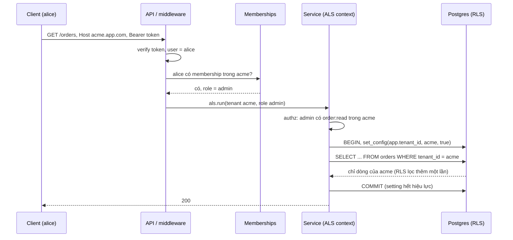
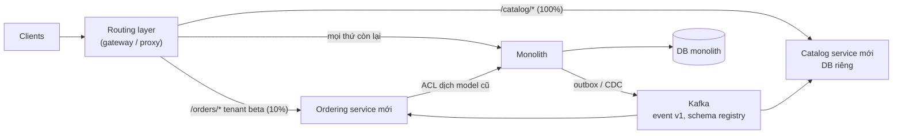

## Bối cảnh & vấn đề

Một nền tảng B2B2C e-commerce phục vụ 800 thương hiệu (tenant), mỗi thương hiệu có admin, nhân viên kho, nhân viên CSKH, và một user có thể làm cho hai thương hiệu cùng lúc. Một ngày, một nhân viên của thương hiệu A mở báo cáo đơn hàng và thấy đơn của thương hiệu B. Nguyên nhân: một endpoint báo cáo mới viết bằng raw SQL, quên `WHERE tenant_id = $1`. Code review không bắt được vì diff chỉ có 12 dòng. Không có lớp nào phía dưới chặn lại.

Cùng năm đó, team (15 kỹ sư) quyết định "chuyển sang microservices với Kafka" để scale. Sáu tháng sau có 11 service, mỗi feature đụng tới 4 service và 3 repo, một thay đổi schema event làm vỡ hai consumer mà không ai biết cho tới khi số đơn trong báo cáo lệch, và thời gian on-call tăng gấp ba. Không phải microservices sai, mà ranh giới và thời điểm tách sai.

Bài cuối của track gom hai loại câu hỏi senior: **thiết kế multi-tenant** (cô lập dữ liệu tuyệt đối, RBAC khi user thuộc nhiều tenant) và **judgment về kiến trúc** (chia service ở đâu, ai sở hữu dữ liệu nào, khi nào nên tách, migrate thế nào mà không dừng hệ thống). Phần multi-tenant có ví dụ chạy thật trên Postgres 17; track [Multi-tenancy](/tracks/multi-tenancy/learn/tenancy-models) đi sâu hơn từng phần.

## Khái niệm

### Tenancy model: pool, bridge, silo

- **Pool** (shared everything): mọi tenant chung database, chung schema, mỗi bảng có cột `tenant_id`. Rẻ nhất, vận hành một hệ thống, migration một lần. Nhược: **blast radius** lớn (một bug filter lộ dữ liệu mọi tenant), noisy neighbor, khó đáp ứng yêu cầu "dữ liệu của tôi ở database riêng".
- **Bridge** (schema per tenant): chung database, mỗi tenant một schema. Cô lập tốt hơn ở tầng tên bảng, nhưng migration phải chạy trên N schema, và với vài nghìn tenant thì catalog của Postgres phình to.
- **Silo** (database per tenant, hoặc cả stack per tenant): cô lập mạnh nhất, backup/restore và data residency theo tenant dễ, noisy neighbor gần như không có. Nhược: chi phí và vận hành nhân theo số tenant (migration, monitoring, connection pool cho mỗi DB).

Thực tế thường **hybrid theo plan**: tenant nhỏ ở pool, tenant enterprise (hoặc có yêu cầu compliance) ở silo, với một **tenant directory** cho biết tenant nằm ở đâu.

Follow-up câu 047: "chạy migration trên 2.000 database silo thế nào?" — migration phải **tương thích ngược** (expand/contract: thêm cột nullable trước, code đọc cả hai, rồi mới bỏ cột cũ) để các DB ở các version khác nhau cùng chạy được với một version code; một **migration orchestrator** chạy theo đợt (canary vài tenant, rồi 10%, rồi tất cả), song song có giới hạn, ghi trạng thái từng tenant (`tenant_migrations`), dừng khi tỷ lệ lỗi vượt ngưỡng, và retry idempotent.

### Tenant resolution và membership

**Tenant resolution** là xác định request thuộc tenant nào: từ subdomain (`acme.app.com`), header (`X-Tenant-Id`), path, hoặc claim trong token. Nguyên tắc: **không tin** giá trị client gửi. Header `X-Tenant-Id: globex` chỉ là **yêu cầu**; server phải kiểm tra user đã xác thực có **membership** trong tenant đó (bảng `memberships(user_id, tenant_id, role_id)`), và chỉ khi đó mới đặt tenant context. Với user thuộc nhiều tenant, token không nên "chốt" một tenant cố định (hoặc phải có cơ chế đổi tenant bằng token mới), và mọi request phải được kiểm tra lại membership (có cache ngắn).

### Tenant context và ép filter

Sau khi resolve, tenant id phải đi theo request tới **mọi** truy vấn mà không cần truyền tay qua 15 tầng hàm. Trong Node: **AsyncLocalStorage** giữ một context theo chuỗi async của request. Repository/ORM middleware đọc context và **tự thêm** filter `tenant_id`; truy vấn nào chạy ngoài context thì **lỗi** (fail closed), không phải chạy không filter.

**Defense in depth** ở database: **Postgres Row-Level Security**. Bật RLS trên bảng và tạo policy `USING (tenant_id = current_setting('app.tenant_id', true))`; app đặt `app.tenant_id` cho mỗi transaction (`set_config('app.tenant_id', $1, true)`, tham số thứ ba `true` = chỉ trong transaction hiện tại). Khi đó một query quên `WHERE tenant_id` vẫn chỉ thấy dữ liệu của tenant hiện tại. Ba gotcha quan trọng:

- **Superuser và role có `BYPASSRLS` luôn bỏ qua RLS**; **chủ sở hữu bảng** cũng bỏ qua trừ khi bảng có `FORCE ROW LEVEL SECURITY`. App phải kết nối bằng role thường, không phải role sở hữu schema.
- Đặt setting ở mức **session** (`set_config(..., false)` hoặc `SET`) trên connection pool là nguy hiểm: connection quay lại pool vẫn mang tenant cũ, request sau của tenant khác dùng lại nó. Dùng mức transaction.
- `current_setting('app.tenant_id', true)` trả `NULL` khi chưa đặt, nên `tenant_id = NULL` không khớp dòng nào: **fail closed**, đúng thứ mình muốn.

Trên SQL Server, tương đương là Row-Level Security với **security policy** + predicate function đọc `SESSION_CONTEXT(N'tenant_id')`. Chi tiết RLS production ở [Postgres RLS](/tracks/multi-tenancy/learn/postgres-rls).

Ngoài DB, tenant phải có mặt ở **mọi** nơi lưu dữ liệu: cache key (`t:{tenant}:...`), search index (filter bắt buộc hoặc filtered alias per tenant), object storage prefix, log/trace (để điều tra), và rate limit/quota per tenant (noisy neighbor).

### RBAC cho user thuộc nhiều tenant

Mô hình: `memberships(user_id, tenant_id, role_id)`, `roles(id, tenant_id NULL cho role hệ thống, name)`, `role_permissions(role_id, permission)`. Một user có role khác nhau ở mỗi tenant (admin ở A, viewer ở B). Tenant được tạo **custom role** (role có `tenant_id`). Kiểm tra quyền ở **resource level**: không chỉ "user có quyền `order:refund`" mà "user có quyền `order:refund` **trong tenant của order này**", và order thực sự thuộc tenant hiện tại. Kiểm tra ở service/domain, không chỉ ở route (route guard bỏ sót khi cùng logic được gọi từ job hoặc endpoint khác). Mọi thay đổi quyền và hành động nhạy cảm vào **audit log** có tenant.

### Bounded context và data ownership

Khi tách một hệ thống thành service, ranh giới tốt đi theo **bounded context** của domain (DDD): một vùng mà các khái niệm có nghĩa nhất quán và **thay đổi cùng nhau** (Catalog, Ordering, Payments, Fulfillment, Identity). Ranh giới tệ đi theo **layer kỹ thuật** ("user-db-service", "notification-dao-service"): mọi feature xuyên qua mọi service.

Mỗi service **sở hữu dữ liệu** của nó: chỉ service đó ghi vào bảng của nó; service khác đọc qua API hoặc qua **event** (và giữ bản sao read-model của riêng họ). Không join DB chéo service. Follow-up câu 053 ("hai service cần join orders và customers cho báo cáo"): (1) API composition (service báo cáo gọi cả hai, join trong memory; được với dữ liệu nhỏ); (2) **read model** dẫn xuất: consumer nghe event của cả hai và dựng bảng báo cáo phi chuẩn hoá; (3) đẩy cả hai vào **data warehouse** (CDC → warehouse) cho analytics. Không cấp quyền đọc DB của service khác "cho nhanh": đó là coupling vô hình phá vỡ quyền tự do đổi schema.

Từ chối tách khi: phần đó có **transaction chặt** với nhau (order và order lines), team quá nhỏ để vận hành nhiều service, chưa có CI/CD, observability (trace xuyên service) và quy trình on-call. Tách trong những điều kiện đó tạo ra **distributed monolith**: deploy phải đi cùng nhau, lỗi lan qua mạng, mà không có lợi ích nào của microservices.

### Modular monolith và microservices

**Modular monolith**: một deployable, nhưng code chia module theo bounded context với ranh giới được **ép** (module chỉ gọi nhau qua interface công khai, mỗi module sở hữu bảng của nó, lint rule/dependency-cruiser chặn import chéo). Transaction ACID xuyên module khi thật sự cần, debug một process, một pipeline deploy, chi phí vận hành thấp. Việc async (email, index, webhook) đi qua job queue (BullMQ, SQS) + outbox.

**Microservices với Kafka**: deploy và scale độc lập, team sở hữu service end-to-end, event log replay được, nhiều consumer. Cái giá: eventual consistency giữa service, schema registry và kỷ luật tương thích, idempotency ở mọi consumer, tracing phân tán, mỗi service một pipeline, on-call nhiều hơn, chi phí hạ tầng cao hơn.

Với 15 kỹ sư (câu 055), lập luận mặc định là **modular monolith + outbox + queue**, và tách service khi có **lực đẩy thật**: một phần cần scale khác biệt (search indexer, image processing), cần deploy độc lập với nhịp khác (team riêng, release hằng giờ), yêu cầu compliance/isolation (payments PCI), hoặc công nghệ khác (ML service Python). Câu trả lời senior nêu **tín hiệu sẽ khiến mình đổi quyết định** (follow-up): merge conflict và deploy queue thành bottleneck giữa các team, một module cần tài nguyên/scale khác hẳn, sự cố ở một module thường xuyên kéo sập module không liên quan, build/test vượt quá N phút.

### Strangler Fig và tương thích ngược

**Strangler Fig** migrate monolith dần dần: đặt một lớp routing (API gateway, reverse proxy, hoặc router trong monolith) ở trước; từng phần chức năng được viết lại thành service mới và routing chuyển dần traffic sang (theo endpoint, theo tenant, theo % traffic); monolith "co lại" cho tới khi phần cũ có thể xoá. Mỗi bước nhỏ, đảo ngược được (rollback = chuyển routing lại).

Các kỹ thuật đi kèm:

- **Anti-corruption layer**: adapter dịch giữa model cũ và model mới để service mới không bị nhiễm khái niệm lộn xộn của monolith.
- **Đồng bộ dữ liệu trong giai đoạn chuyển tiếp**: CDC từ DB monolith sang service mới (đọc), hoặc outbox; tránh dual write từ code.
- **API versioning** và **expand/contract** cho schema DB.
- **Event schema evolution**: chỉ **thêm** field optional, không đổi nghĩa hay kiểu của field có sẵn, không xoá field đang có consumer; consumer là **tolerant reader** (bỏ qua field lạ, có default cho field thiếu); dùng **schema registry** với compatibility mode (BACKWARD/FULL) để CI chặn thay đổi phá vỡ; thay đổi phá vỡ thật sự thì tạo **topic/event version mới** và chạy song song.
- **Partition key và ordering**: event của cùng một aggregate (order) dùng cùng key để giữ thứ tự; consumer idempotent theo event id.

## Cơ chế hoạt động

### Một request đi qua các lớp tenant isolation



Bốn lớp, mỗi lớp chặn một loại lỗi: xác thực (ai), membership (có thuộc tenant đó không, không tin header/subdomain), authorization (được làm gì trong tenant đó), và RLS (kể cả code quên filter). Filter trong repository và RLS là hai lớp **độc lập**: lỗi ở một lớp không đủ để lộ dữ liệu.

### Strangler Fig



Routing layer là nơi duy nhất quyết định request đi đâu, nên chuyển (và rollback) là thay đổi cấu hình. Service mới nhận dữ liệu từ monolith qua outbox/CDC (không đọc thẳng DB monolith); khi một service mới cần gọi chức năng còn nằm trong monolith, nó đi qua anti-corruption layer. Monolith co lại theo từng bounded context.

## Ví dụ thực tế

### Tenant resolution + AsyncLocalStorage + RLS trên Postgres

Postgres 17, pg 8.23, Node 24.21. Bảng `orders` bật RLS với policy theo `app.tenant_id`; ứng dụng kết nối bằng role `app` (không phải superuser, không phải chủ bảng):

```sql
ALTER TABLE orders ENABLE ROW LEVEL SECURITY;
CREATE POLICY tenant_isolation ON orders USING (tenant_id = current_setting('app.tenant_id', true));
GRANT SELECT, INSERT ON orders TO app;
```

```ts
type Ctx = { userId: string; tenantId: string; role: string };
const als = new AsyncLocalStorage<Ctx>();
async function resolveTenant(userId: string, requestedTenant: string): Promise<Ctx> {   // never trust the header alone
  const { rows } = await admin.query("SELECT role FROM membership WHERE user_id=$1 AND tenant_id=$2", [userId, requestedTenant]);
  if (!rows.length) throw new Error(`403: ${userId} is not a member of ${requestedTenant}`);
  return { userId, tenantId: requestedTenant, role: rows[0].role };
}
async function tq(sql: string, params: unknown[] = []) {                               // every query runs inside the tenant context
  const ctx = als.getStore(); if (!ctx) throw new Error("no tenant context");
  const c = await pool.connect();
  try {
    await c.query("BEGIN");
    await c.query("SELECT set_config('app.tenant_id', $1, true)", [ctx.tenantId]);     // true = local to this transaction
    const r = await c.query(sql, params); await c.query("COMMIT"); return r.rows;
  } finally { c.release(); }
}
```

```text
alice@acme: [{"tenant_id":"acme","total":100},{"tenant_id":"acme","total":250}]
alice@globex: [{"tenant_id":"globex","total":999}]
403: bob is not a member of acme
forgot the filter: [ { n: 1 } ]
pooled connection, no context: [ { n: 0 } ]
as table owner (superuser), RLS bypassed: [ { n: 3 } ]
```

Đọc từng dòng: alice là thành viên cả hai tenant và thấy đúng dữ liệu của tenant đang chọn. bob gửi tenant `acme` nhưng không có membership: 403 trước khi chạm dữ liệu. Một query **quên** `WHERE tenant_id` (`SELECT count(*) FROM orders`) trong context của globex chỉ đếm được 1: RLS lọc thay. Một connection lấy thẳng từ pool, không có transaction nào đặt `app.tenant_id`, đếm được **0** dòng: fail closed. Và kết nối bằng **superuser** thì thấy cả 3 dòng: RLS không bảo vệ gì nếu app chạy bằng role có quyền bỏ qua nó. Đây là các ý chính cho câu CV 056 ("đảm bảo không query nào lộ dữ liệu tenant khác").

### Phát hiện query thiếu tenant filter (follow-up câu 056)

Ba lớp phát hiện, từ sớm tới muộn (minh hoạ):

```ts
// 1. Test cross-tenant tự động: seed 2 tenant, gọi mọi endpoint list/detail bằng user của tenant A,
//    assert không có id nào của tenant B trong response.
for (const route of listRoutes) {
  const res = await asUser(aliceOfAcme).get(route.path);
  expect(collectIds(res.body)).not.toContainAnyOf(globexIds);
}
// 2. Guard ở repository: query trên bảng có tenant_id mà không có tenant context -> throw (fail closed).
// 3. Production: RLS chặn; log policy violation / alert khi query trả 0 dòng bất thường;
//    audit log có tenant_id để điều tra "ai đã xem gì".
```

### Event schema tương thích ngược

```ts
// v1 consumers only know these fields. v2 ADDS an optional field, never renames or retypes.
type OrderPlacedV1 = { eventId: string; orderId: string; tenantId: string; totalCents: number; occurredAt: string };
type OrderPlacedV2 = OrderPlacedV1 & { currency?: string };     // optional, default "VND" when absent

// tolerant reader: ignore unknown fields, default missing ones
function readOrderPlaced(raw: unknown): OrderPlacedV2 {
  const e = raw as Partial<OrderPlacedV2>;
  if (!e.eventId || !e.orderId || !e.tenantId || typeof e.totalCents !== "number") throw new Error("invalid event");
  return { ...(e as OrderPlacedV1), currency: e.currency ?? "VND" };
}
console.log(readOrderPlaced({ eventId: "e1", orderId: "o1", tenantId: "acme", totalCents: 1000, occurredAt: "2026-10-01T00:00:00Z", couponCode: "X" }));
```

```text
{
  eventId: 'e1',
  orderId: 'o1',
  tenantId: 'acme',
  totalCents: 1000,
  occurredAt: '2026-10-01T00:00:00Z',
  couponCode: 'X',
  currency: 'VND'
}
```

Consumer cũ không vỡ khi producer thêm `couponCode` hay `currency`; consumer mới có default khi đọc event cũ. Đổi `totalCents` thành chuỗi, hay đổi nghĩa từ "đã gồm thuế" sang "chưa gồm thuế", là thay đổi phá vỡ: phải thành `order.placed.v2` (topic hoặc type mới) chạy song song tới khi mọi consumer chuyển xong. (Output trên chạy bằng Node 24.21 với type stripping.)

### Khung trả lời câu CV migration (câu 060)

```text
Chiến lược:   Strangler Fig; routing theo <endpoint / tenant / % traffic>; service đầu tiên tách là <X> vì <lý do đo được>
Dữ liệu:      <CDC Debezium / outbox> từ monolith -> Kafka; không dual write từ code; ai sở hữu bảng nào sau khi tách
Tương thích:  API versioning + adapter (ACL); event chỉ thêm field optional; schema registry mode <BACKWARD>; tolerant reader
Ordering:     partition key = <orderId / tenantId>; consumer idempotent theo eventId
Rollback:     chuyển routing về monolith; dữ liệu ghi bởi service mới được sync ngược thế nào
Số liệu:      <số service, thời gian migration, incident và bài học>
Khó nhất:     <ví dụ: bảng customers bị 6 module ghi, phải chọn owner và chuyển 5 module sang API/event>
```

## Trade-offs & lựa chọn thay thế

| Quyết định | Lựa chọn A | Lựa chọn B | Chọn A khi |
| --- | --- | --- | --- |
| Tenancy | Pool + `tenant_id` + RLS | Silo (DB per tenant) | Nhiều tenant nhỏ, chi phí quan trọng; B cho enterprise, compliance, data residency |
| Tenant context | AsyncLocalStorage + repository tự filter | Truyền `tenantId` tường minh mọi hàm | Codebase lớn, nhiều tầng; B khi codebase nhỏ, muốn tường minh (kết hợp được) |
| Defense in depth | RLS ở DB | Chỉ filter ở app | Pool model, dữ liệu nhạy cảm; B khi silo (DB đã là ranh giới) |
| Ranh giới service | Bounded context | Layer kỹ thuật | Luôn A |
| Kiến trúc cho team 15 người | Modular monolith + queue + outbox | Microservices + Kafka | Hầu hết trường hợp; B khi có lực đẩy thật (scale/deploy/compliance khác biệt) |
| Migration | Strangler Fig từng phần | Big-bang rewrite | Gần như luôn A |
| Đồng bộ dữ liệu khi migrate | CDC / outbox | Dual write từ code | Luôn A |
| Event breaking change | Version mới song song | Sửa tại chỗ | Luôn A |

Chọn thế nào: pool + RLS + context tự động là mặc định cho SaaS B2B nhiều tenant nhỏ; thêm silo cho tenant có yêu cầu đặc biệt, quản lý bằng tenant directory. Với kiến trúc, bắt đầu modular monolith với ranh giới được ép bằng tooling (đó cũng là bước chuẩn bị tốt nhất để tách sau này), và chỉ tách khi nói được service đó giải quyết vấn đề đo được nào.

## Edge cases & failure modes

- **Background job và consumer chạy ngoài request**: không có ALS context; job phải tự đặt context từ `tenant_id` trong payload, và repository fail closed nếu thiếu.
- **Query cross-tenant hợp lệ** (admin nền tảng, báo cáo tổng): đi qua role riêng có `BYPASSRLS` trong service riêng, có audit; không mở cho code ứng dụng thường.
- **Connection pooler ở transaction mode** (PgBouncer): setting mức session không dùng được và nguy hiểm; mức transaction là đúng.
- **Index không bắt đầu bằng `tenant_id`**: RLS thêm điều kiện `tenant_id = ...` nhưng index `(created_at)` không dùng được hiệu quả; index composite bắt đầu bằng `tenant_id`.
- **Noisy neighbor**: một tenant chạy export lớn làm chậm mọi tenant; rate limit + quota + hàng đợi riêng per tenant, hoặc chuyển tenant đó sang silo.
- **Cache/search/file thiếu tenant**: RLS chỉ bảo vệ Postgres; cache key, filter search, prefix S3 phải có tenant (lỗi lộ dữ liệu hay xảy ra ở cache hơn ở DB).
- **User bị xoá khỏi tenant khi đang có session**: kiểm tra membership mỗi request (cache ngắn) hoặc revoke token.
- **Distributed monolith sau khi tách**: deploy phải đi cùng nhau, gọi đồng bộ thành chuỗi dài; dấu hiệu ranh giới sai, cân nhắc gộp lại.
- **Consumer chưa nâng cấp gặp event version mới**: tolerant reader bỏ qua field lạ; event type lạ thì bỏ qua có log, không crash.

## Pitfalls

- ❌ Tin `X-Tenant-Id` hoặc subdomain → ✅ kiểm tra membership của user đã xác thực.
- ❌ Chỉ dựa vào code review để nhớ `WHERE tenant_id` → ✅ repository tự filter + RLS + test cross-tenant tự động.
- ❌ App kết nối Postgres bằng superuser hoặc role chủ bảng → ✅ role thường; `FORCE ROW LEVEL SECURITY` nếu cần.
- ❌ `SET app.tenant_id` mức session trên pool → ✅ `set_config(..., true)` trong transaction.
- ❌ Check quyền chỉ ở route → ✅ check ở resource level trong service, kèm tenant của resource.
- ❌ Chia service theo layer kỹ thuật, join DB chéo service → ✅ bounded context, mỗi service sở hữu dữ liệu, chia sẻ qua API/event.
- ❌ "Chuyển sang microservices để scale" mà không nói vấn đề cụ thể → ✅ modular monolith trước, tách khi có lực đẩy đo được.
- ❌ Big-bang rewrite → ✅ Strangler Fig với routing đảo ngược được.
- ❌ Đổi tên/kiểu field trong event đang có consumer → ✅ chỉ thêm field optional; breaking change thành version mới.

## Tóm tắt

- Pool (rẻ, blast radius lớn), bridge, silo (cô lập mạnh, vận hành đắt); hybrid theo plan với tenant directory; migration silo theo đợt, expand/contract.
- Tenant resolution phải kiểm tra membership; tenant context đi theo request bằng AsyncLocalStorage; repository tự filter và fail closed khi thiếu context.
- RLS là defense in depth: quên filter vẫn chỉ thấy tenant hiện tại, pool connection không context thấy 0 dòng, nhưng superuser bỏ qua RLS (chạy thật); dùng `set_config(..., true)` mức transaction.
- RBAC đa tenant: `memberships(user, tenant, role)`, custom role per tenant, kiểm tra ở resource level.
- Ranh giới service theo bounded context, mỗi service sở hữu dữ liệu; báo cáo xuyên service bằng API composition, read model hoặc warehouse; từ chối tách khi transaction chặt hoặc chưa có nền tảng vận hành.
- Team 15 người: modular monolith + queue + outbox, tách service khi có tín hiệu rõ.
- Migration: Strangler Fig, ACL, CDC/outbox, event chỉ thêm field optional, tolerant reader, schema registry, version mới cho breaking change.
