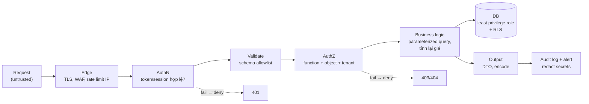
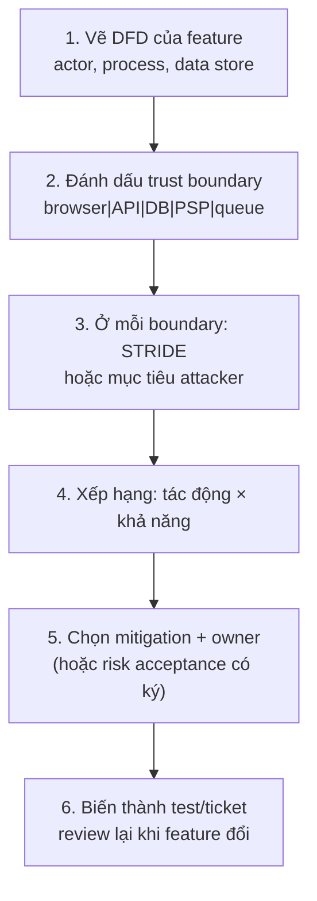

## Bối cảnh & vấn đề

Một team e-commerce có đủ "checklist bảo mật": HTTPS, JWT, bcrypt, helmet, WAF ở CDN. Một buổi sáng, một khách hàng của tenant A gửi ảnh chụp màn hình: trong lịch sử đơn hàng của họ có đơn của một khách tenant B, kèm địa chỉ và số điện thoại. Điều tra cho thấy endpoint `GET /api/orders/:id` chỉ kiểm tra "đã đăng nhập", không kiểm tra đơn đó thuộc về ai. Không có công cụ nào trong checklist bắt được lỗi này: WAF không biết đơn 1043 là của ai, scanner tự động không hiểu quan hệ sở hữu, và JWT hợp lệ hoàn toàn.

Câu chuyện này lặp lại ở hầu hết công ty. Lý do là bảo mật không phải danh sách thư viện cần cài, mà là **một cách nghĩ**: ở mỗi điểm dữ liệu đi qua, ai kiểm soát nó, mình đang tin điều gì, và nếu điều đó sai thì chuyện gì xảy ra. Thư viện chỉ giải quyết các lớp lỗi đã biết (escape HTML, hash password); lỗi đắt nhất thường nằm ở **logic của chính ứng dụng**: quên kiểm tra quyền, tin giá trị client gửi lên, xử lý lỗi theo hướng "cho qua".

Bài này đặt nền cho cả track: các nguyên tắc (untrusted input, trust boundary, least privilege, defense in depth), cách làm **threat modeling** cho một flow cụ thể, bản đồ **OWASP Top 10:2025** và **OWASP API Security Top 10:2023** để biết lỗi nào phổ biến nhất, và cách đưa tooling vào team. Các bài sau đi sâu từng lớp tấn công.

**Interview angle:** interviewer senior ít khi hỏi "XSS là gì"; họ hỏi "nhìn vào feature này, bạn lo điều gì trước?". Câu trả lời tốt bắt đầu từ tài sản cần bảo vệ và trust boundary, không phải từ tên thư viện.

## Khái niệm

### Untrusted input và trust boundary

**Untrusted input** là mọi dữ liệu mà người khác có thể kiểm soát, dù chỉ một phần. Danh sách dài hơn nhiều so với "request body": query string, path param, header (`X-Forwarded-For`, `Host`, `Origin`), cookie, claim trong JWT **chưa được verify**, tên file và nội dung file upload, URL người dùng nhập, payload webhook từ bên thứ ba, message từ queue mà service khác publish, dữ liệu đọc từ DB nếu ban đầu nó đến từ người dùng (stored XSS chính là input "đi đường vòng" qua DB).

**Trust boundary** là đường ranh giới mà tại đó mức độ tin cậy thay đổi: browser → API, API → DB, service A → service B, app → API của đối tác. Mọi lỗ hổng injection, access control hay SSRF đều xảy ra khi dữ liệu vượt ranh giới mà không được kiểm tra đúng cách. Vẽ được các ranh giới này là bước đầu tiên của threat model.

Hai câu hỏi dùng ở mỗi ranh giới: "dữ liệu này có thể bị ai sửa?" và "phía nhận đang **tin** điều gì về nó?". Ví dụ: frontend gửi `price: 49000` trong body checkout; backend tin giá đó là giá thật. Người dùng mở DevTools sửa thành `price: 1000`. Không có gì "bị hack", chỉ có một giả định sai.

**Interview angle:** khi được hỏi "giá trị nào từ client bạn không tin?", liệt kê theo loại (giá, discount, `tenantId`, `role`, `userId`, header IP) và nói server tự tính lại từ nguồn tin cậy.

### Least privilege

**Least privilege** nghĩa là mỗi thành phần chỉ có đúng quyền tối thiểu để làm việc của nó. Mục đích không phải ngăn tấn công xảy ra, mà **giới hạn thiệt hại** khi một thành phần bị chiếm. Nếu API bị SQL injection nhưng DB user của API không có quyền `DROP`, `TRUNCATE` hay tạo bảng, attacker không thể xoá schema; nếu IAM role của service chỉ có `s3:GetObject` trên một prefix, credential bị lộ không mở được cả bucket.

Ví dụ cụ thể trong Node.js backend: DB user `app_rw` chỉ có `SELECT, INSERT, UPDATE, DELETE` trên các bảng cần thiết, migration chạy bằng user khác có quyền DDL; container chạy user non-root với filesystem read-only; CI token chỉ có quyền đọc repo và ghi package của chính nó. Phần "Ví dụ thực tế" bên dưới chạy thật một role như vậy trên Postgres 17.

**Interview angle:** câu follow-up kinh điển là "DB user của production API hiện có quyền gì?". Trả lời được bằng số liệu thật (có DDL hay không, có superuser không) là tín hiệu tốt.

### Defense in depth

**Defense in depth** là xếp nhiều lớp phòng thủ **độc lập** để một lớp hỏng không làm sập toàn bộ. Từ khoá là *độc lập*: hai lớp cùng dựa trên một giả định thì thực chất là một lớp. Ví dụ tenant isolation có thể có bốn lớp: repository luôn thêm `tenant_id` vào query; Postgres Row-Level Security lọc theo `app.tenant_id`; test tự động gọi mọi endpoint bằng user của tenant khác; audit log so tenant của dữ liệu trả về với tenant của request và cảnh báo khi lệch. Một dev quên `WHERE tenant_id` thì RLS vẫn chặn; RLS bị cấu hình sai thì test bắt được.

Defense in depth không có nghĩa "thêm thật nhiều thứ". Mỗi lớp có chi phí (độ phức tạp, latency, false positive); câu hỏi đúng là "nếu lớp này thủng, lớp nào bắt?".

**Interview angle:** câu trả lời mạnh nói rõ giả định mỗi lớp và trường hợp lớp đó fail.

### Threat modeling và STRIDE

**Threat modeling** là bài tập có cấu trúc để trả lời bốn câu hỏi (theo OWASP và Adam Shostack): *chúng ta đang xây gì?*, *điều gì có thể sai?*, *chúng ta làm gì với nó?*, *chúng ta làm đủ tốt chưa?*. Không cần công cụ phức tạp; một sơ đồ luồng dữ liệu (DFD) với các trust boundary và 45 phút thảo luận đã bắt được phần lớn lỗi thiết kế.

**STRIDE** là bộ gợi ý để không bỏ sót loại mối đe doạ. Mỗi chữ cái ứng với một thuộc tính an toàn bị vi phạm:

- **S**poofing (giả danh) → vi phạm *authentication*. Ví dụ: webhook giả mạo PSP.
- **T**ampering (sửa dữ liệu) → vi phạm *integrity*. Ví dụ: client sửa giá trong body.
- **R**epudiation (chối bỏ) → thiếu *non-repudiation*/audit. Ví dụ: admin đổi payout mà không có log ai làm.
- **I**nformation disclosure → vi phạm *confidentiality*. Ví dụ: response trả `passwordHash`.
- **D**enial of service → vi phạm *availability*. Ví dụ: `?limit=1000000`, regex backtracking.
- **E**levation of privilege → vi phạm *authorization*. Ví dụ: mass assignment `role: "admin"`.

Một cách khác là nghĩ theo **mục tiêu của attacker** ("lấy hàng không trả tiền", "đọc dữ liệu tenant khác", "chiếm tài khoản admin"), rồi đi ngược xem đường nào dẫn tới mục tiêu. Với checkout, cách này thường hiệu quả hơn vì gắn với tiền.

**Interview angle:** khi được yêu cầu "threat-model checkout", đừng liệt kê STRIDE như học thuộc; vẽ nhanh luồng (cart → price → coupon → payment → webhook → fulfillment), chỉ ra trust boundary, rồi chọn 5–7 mối đe doạ có tác động tiền lớn nhất.

### OWASP Top 10:2025

**OWASP Top 10** là danh sách mười nhóm rủi ro phổ biến và nghiêm trọng nhất của web application, xây từ dữ liệu thực tế (CVE, kết quả pentest, khảo sát). Phiên bản 2025 (verify trạng thái phát hành chính thức trên top10.owasp.org) gồm:

1. **A01 Broken Access Control**: vẫn đứng đầu; **SSRF** được gộp vào đây.
2. **A02 Security Misconfiguration**: lên từ #5 (CORS mở, debug bật, bucket public, header thiếu).
3. **A03 Software Supply Chain Failures**: mở rộng từ "Vulnerable and Outdated Components" sang toàn bộ chuỗi cung ứng (dependency, build, CI, registry).
4. **A04 Cryptographic Failures**: xuống từ #2.
5. **A05 Injection**: SQL, NoSQL, OS command, và cả **XSS**.
6. **A06 Insecure Design**: lỗi nằm ở thiết kế, không sửa được bằng code tốt hơn.
7. **A07 Authentication Failures**.
8. **A08 Software or Data Integrity Failures**: dữ liệu/code không được xác minh nguồn gốc (deserialization, auto-update không ký).
9. **A09 Security Logging and Alerting Failures**: đổi tên để nhấn mạnh *alerting*, log mà không ai nhìn thì không có giá trị.
10. **A10 Mishandling of Exceptional Conditions**: mới, gồm fail-open, nuốt exception, trạng thái dở dang khi lỗi.

Vì sao SSRF gộp vào A01? Bản chất SSRF là server bị lợi dụng để truy cập tài nguyên mà **người gửi request không có quyền** truy cập (mạng nội bộ, metadata service). Đó là một dạng access control bị bỏ qua, chỉ khác là đi qua server làm trung gian.

**Interview angle:** thuộc thứ tự không quan trọng bằng hiểu ý nghĩa: access control đứng đầu nghĩa là phần lớn lỗi nằm ở logic phân quyền, không phải ở thư viện.

### OWASP API Security Top 10:2023

API có danh sách riêng vì API trả dữ liệu có cấu trúc trực tiếp và thường không có lớp UI "che" đi: API1 **BOLA** (Broken Object Level Authorization), API2 Broken Authentication, API3 **BOPLA** (Broken Object Property Level Authorization: mass assignment và trả thừa field), API4 Unrestricted Resource Consumption, API5 **BFLA** (Broken Function Level Authorization: endpoint admin không check role), API6 Unrestricted Access to Sensitive Business Flows (bot mua hết hàng flash sale, spam tạo tài khoản lấy voucher), API7 SSRF, API8 Security Misconfiguration, API9 Improper Inventory Management (endpoint/version cũ bị quên), API10 Unsafe Consumption of APIs (tin dữ liệu từ API đối tác).

Với một REST API Node.js điển hình, ba mục đáng lo nhất là **BOLA** (mỗi query phải scope theo owner/tenant, xem [bài access control](/tracks/web-security/learn/access-control)), **BFLA** (route admin quên guard), và **resource consumption** (không giới hạn page size, body size, upload, chi phí gọi SMS/AI; xem [bài API hardening](/tracks/web-security/learn/api-hardening)).

Ví dụ API10 khi tích hợp nhà vận chuyển: API của họ trả `tracking_url` và bạn render thẳng vào email gửi khách, hoặc bạn tin trường `status: "delivered"` để tự động giải ngân cho seller mà không kiểm tra chữ ký/nguồn. Đối tác bị chiếm thì hệ thống của bạn bị chiếm theo.

**Interview angle:** biết phân biệt BOLA (object) với BFLA (function) với BOPLA (property) là dấu hiệu đã thực sự làm API security, không chỉ đọc qua.

## Cơ chế hoạt động

Một request đi vào API qua nhiều lớp, mỗi lớp trả lời một câu hỏi khác và bắt một loại lỗi khác. Sơ đồ dưới là "đường ống" mặc định mà các bài sau sẽ mổ xẻ:



Đọc từ trái sang phải: **edge** chặn volume và một số payload thô (nhưng không hiểu business logic); **authentication** xác định "ai"; **validation** đảm bảo dữ liệu đúng hình dạng (kiểu, độ dài, field cho phép), loại bỏ cả một lớp lỗi như mass assignment và NoSQL operator injection; **authorization** trả lời "người này có được làm việc này với object này không"; **business logic** dùng parameterized query và tự tính các giá trị nhạy cảm; **DB** có role tối thiểu và RLS làm lưới cuối; **output** chỉ trả field cần thiết; **log** ghi sự kiện bảo mật và cảnh báo. Các mũi tên nét đứt nhấn mạnh nguyên tắc **deny by default**: khi một lớp không chắc chắn (lỗi, timeout), kết quả là từ chối.

Threat modeling là quá trình áp sơ đồ này vào một feature cụ thể. Quy trình nhẹ mà một team có thể làm trong một buổi:



Bước 4 là chỗ nhiều team bỏ qua: không phải mối đe doạ nào cũng cần sửa ngay. Một mối đe doạ có tác động thấp và khó khai thác có thể được **chấp nhận** (risk acceptance) nếu có người chịu trách nhiệm ký và ghi lại. Bước 6 biến kết quả thành thứ kiểm chứng được (test cross-tenant, rule lint), nếu không threat model chỉ là một tài liệu bị quên.

## Ví dụ thực tế

### Least privilege trên Postgres 17

Tạo role cho API chỉ có DML, không có DDL. Chạy trên Postgres 17.11 trong Docker (`postgres:17`):

```sql
CREATE ROLE app_rw LOGIN PASSWORD 'app';
GRANT SELECT, INSERT, UPDATE, DELETE ON ALL TABLES IN SCHEMA public TO app_rw;
GRANT USAGE ON ALL SEQUENCES IN SCHEMA public TO app_rw;
```

Đăng nhập bằng `app_rw` và thử các lệnh mà một attacker (qua SQL injection) hoặc một bug sẽ muốn chạy:

```text
$ psql -U app_rw -c "SELECT count(*) FROM users;" -c "DROP TABLE users;" -c "CREATE TABLE t(x int);" -c "TRUNCATE orders;"
 count
-------
     3
(1 row)

ERROR:  must be owner of table users
ERROR:  permission denied for schema public
LINE 1: CREATE TABLE t(x int);
ERROR:  permission denied for table orders
```

Đọc được dữ liệu (role cần quyền đó để làm việc), nhưng không xoá được bảng, không tạo được bảng (từ PostgreSQL 15, `PUBLIC` không còn quyền `CREATE` trên schema `public`, verify với phiên bản của bạn), không `TRUNCATE` được. Kiểm tra quyền thực tế bằng catalog:

```text
 grantee | table_name |         string_agg
---------+------------+-----------------------------
 app_rw  | orders     | DELETE,INSERT,SELECT,UPDATE
 app_rw  | users      | DELETE,INSERT,SELECT,UPDATE
```

Least privilege không chặn được attacker *đọc* bảng `users` qua injection, vì app cần quyền đọc. Đó là lý do nó là một lớp, không phải giải pháp: parameterized query chặn injection, least privilege giới hạn thiệt hại nếu lớp kia thủng. Có thể siết thêm bằng column privilege (`GRANT SELECT (id, email) ON users`) hoặc tách bảng nhạy cảm sang schema mà chỉ service KYC đọc được.

### Threat model checkout (rút gọn)

Flow: browser → `POST /checkout` (cart id, coupon, address id) → API tính giá → tạo payment intent ở PSP → PSP gửi webhook `payment.succeeded` → API đánh dấu order paid → fulfillment.

| Mục tiêu attacker | Đường đi | Mitigation |
|---|---|---|
| Trả ít tiền hơn | Sửa `price`, `discount`, `shippingFee` trong body | Server tính lại toàn bộ từ catalog + promotion engine; snapshot giá vào order |
| Dùng coupon nhiều lần | Gửi 20 request song song | Redeem atomic (`UPDATE ... WHERE used < max_uses`), unique `(coupon_id, user_id)` |
| Đoán mã coupon | Brute-force endpoint apply coupon | Mã entropy cao, rate limit per account + IP, alert |
| Xem/sửa đơn người khác | Đổi `orderId`, `addressId` | Scope query theo `customer_id` + `tenant_id` |
| Đánh dấu order paid giả | Gửi webhook giả hoặc phát lại webhook cũ | Verify HMAC + timestamp + dedupe event id; số tiền/currency khớp order |
| Thử thẻ ăn cắp (card testing) | Gọi checkout hàng nghìn lần số tiền nhỏ | Velocity rule, 3DS, rate limit, bot management |
| Mua hết hàng flash sale bằng bot | Script đặt hàng ngay khi mở bán | Queue ảo, giới hạn per account, bot score (API6) |
| Lộ dữ liệu thẻ | Log body, tự lưu PAN | Hosted fields/tokenization của PSP, redact log |

Bảng này dẫn thẳng tới các bài sau: race condition coupon có số đo thật ở [bài access control](/tracks/web-security/learn/access-control), webhook có code chạy thật ở [bài API hardening](/tracks/web-security/learn/api-hardening). Câu hỏi PCI DSS: khi dùng hosted payment fields (iframe của PSP), số thẻ không bao giờ chạm server của bạn, nên phạm vi PCI thu hẹp đáng kể (thường là SAQ A thay vì SAQ D, verify với PSP và QSA của bạn).

### Đưa tooling vào team

Một team 15 người bật SAST + SCA + DAST cùng lúc và nhận 2.300 finding trong tuần đầu; sau hai tuần, không ai mở dashboard nữa. Lộ trình thực tế hơn:

1. **Secret scanning + push protection** trước (tín hiệu gần như luôn đúng, chi phí sửa thấp).
2. **Lockfile + SCA chỉ cho critical/high có đường khai thác** (reachability), Dependabot/Renovate có cooldown vài ngày để tránh kéo bản vừa bị compromise.
3. **SAST với baseline**: chấp nhận nợ hiện tại, chỉ fail PR khi có finding **mới** trong code được sửa. Tune rule theo stack (ví dụ rule `knex.raw` có template literal).
4. **DAST** cho môi trường staging theo lịch, kết quả vào backlog có owner.
5. Đo: thời gian sửa critical, số secret bị chặn, tỷ lệ false positive theo rule; rule nào > 50% false positive thì tắt hoặc sửa.

Khi có CVE critical trong transitive dependency mà chưa có bản vá: kiểm tra reachability (code của bạn có gọi hàm bị lỗi không), dùng `overrides` để ép phiên bản an toàn nếu có, thêm biện pháp bù (WAF rule, tắt tính năng), ghi lại quyết định và ngày xem lại.

## Trade-offs & lựa chọn thay thế

| Quyết định | Phương án A | Phương án B | Khi nào chọn gì |
|---|---|---|---|
| Phương pháp threat model | STRIDE theo từng boundary | Mục tiêu attacker (attack tree) | STRIDE để không bỏ sót loại; attack tree khi flow gắn với tiền |
| Độ nặng | Workshop 45 phút mỗi feature nhạy cảm | Threat model đầy đủ, tài liệu dài | Nhẹ và thường xuyên tốt hơn nặng và hiếm |
| Khi lớp bảo mật lỗi | Fail-closed (từ chối) | Fail-open (cho qua) | Quyết định bảo mật → closed; tính năng phụ như recommendation → open + alert |
| Tooling | Bật hết, chặn mọi thứ | Baseline + chặn finding mới | Baseline gần như luôn đúng cho codebase có sẵn |
| Kiểm soát quyền | Ở route (role) | Ở service/repository (object + tenant) | Cả hai; route-only là nguồn BOLA |

Nguyên tắc chọn: ưu tiên biện pháp **loại bỏ cả một lớp lỗi** (parameterized query, schema validation strict, repository tự scope tenant) trước biện pháp vá từng chỗ. Khi phải đánh đổi với UX hay tốc độ, đưa ra con số (tác động tiền của account takeover, tỷ lệ drop khi thêm bước) và để người có thẩm quyền quyết định, có ghi lại.

## Edge cases & failure modes

- **"Internal" không có nghĩa là an toàn**: service nội bộ không auth (Redis, Elasticsearch, admin panel) trở thành mục tiêu ngay khi có SSRF hoặc một pod bị chiếm. Zero trust ở mức tối thiểu: auth cả service-to-service.
- **Hai lớp cùng một giả định**: filter tenant ở repository và RLS cùng đọc `tenantId` từ header client gửi lên, thì cả hai cùng sai khi header bị giả. Nguồn tenant phải là membership đã verify.
- **Threat model lỗi thời**: feature đổi (thêm "đăng nhập bằng Google", thêm webhook mới) mà model không cập nhật. Gắn review threat model vào checklist PR cho các vùng nhạy cảm.
- **WAF tạo cảm giác an toàn giả**: WAF chặn payload thô nhưng không biết object 1043 là của ai; BOLA, mass assignment, logic giá đều đi qua WAF.
- **Risk acceptance không có owner**: "tạm chấp nhận" mà không ai ký, không ngày xem lại, thành vĩnh viễn.
- **Tooling flood**: hàng nghìn finding không triage làm team bỏ qua cả finding thật; tệ hơn là không có tool.

## Pitfalls

- ❌ Coi bảo mật là danh sách thư viện → ✅ bắt đầu từ tài sản, trust boundary và giả định; thư viện chỉ giải quyết lớp lỗi đã biết.
- ❌ Chỉ check role ở route → ✅ check thêm object + tenant ở service/repository (BOLA là API1).
- ❌ DB user của app là owner hoặc superuser → ✅ role chỉ DML, migration dùng role riêng.
- ❌ "Có WAF nên không cần validate" → ✅ WAF là lớp edge; validation và authorization ở app.
- ❌ Bật mọi scanner rồi chặn mọi PR → ✅ baseline, chặn finding mới, tune rule, đo false positive.
- ❌ Xử lý lỗi bằng `catch { next() }` → ✅ deny by default khi quyết định bảo mật không chắc chắn (A10:2025).
- ❌ Học thuộc OWASP Top 10 như danh sách → ✅ hiểu vì sao mỗi mục tồn tại và ví dụ thật trong stack của bạn.

## Tóm tắt

- Mọi dữ liệu người khác kiểm soát được đều là untrusted input, kể cả header, JWT chưa verify, webhook và dữ liệu đọc lại từ DB.
- Trust boundary là nơi lỗi xảy ra; ở mỗi boundary hỏi "ai sửa được dữ liệu này, phía nhận đang tin gì".
- Least privilege giới hạn thiệt hại (role `app_rw` không DROP/CREATE/TRUNCATE được); defense in depth cần các lớp **độc lập**.
- Threat modeling nhẹ: DFD + boundary + STRIDE/mục tiêu attacker + xếp hạng + owner + biến thành test.
- OWASP Top 10:2025: A01 Broken Access Control (gồm SSRF), A03 Supply Chain mới mở rộng, A10 Mishandling of Exceptional Conditions mới.
- API Top 10:2023: BOLA, BFLA, BOPLA và resource consumption là bốn mục cần lo trước cho REST API.
- Tooling: secret scanning trước, baseline + chặn finding mới, đo false positive.
