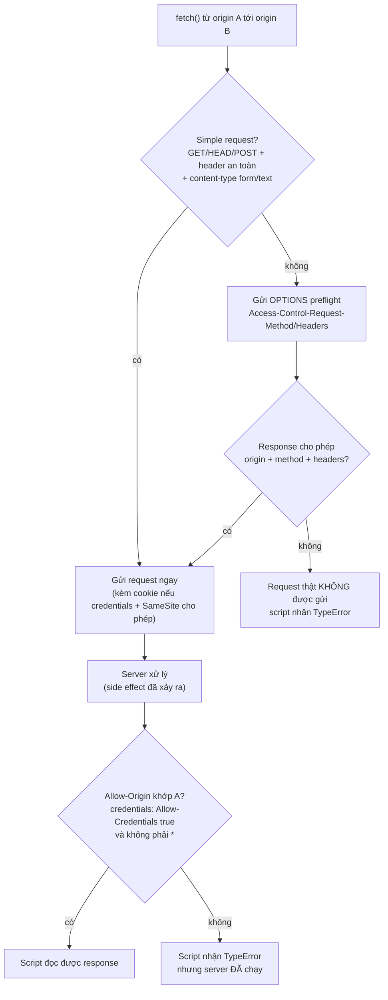
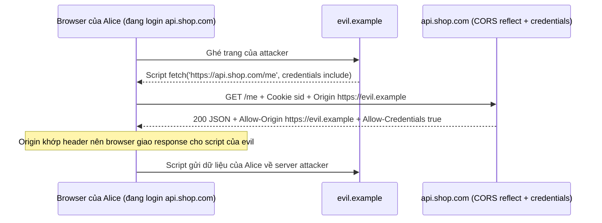

## Bối cảnh & vấn đề

Frontend ở `https://app.shop.com` gọi API ở `https://api.shop.com` và console báo đỏ: *"has been blocked by CORS policy: No 'Access-Control-Allow-Origin' header is present"*. Deadline gần, một dev tìm trên mạng và dán đoạn cấu hình "cho phép tất cả": phản chiếu lại header `Origin` của request vào `Access-Control-Allow-Origin`, bật `credentials: true`, và đặt cookie session `SameSite=None` để "cho chắc". Lỗi CORS biến mất. Ba tháng sau, pentest báo một trang bất kỳ trên internet có thể đọc `/api/me`, lịch sử đơn hàng và CSRF token của bất kỳ user nào đang đăng nhập mà ghé qua trang đó.

Sự cố này xảy ra vì CORS bị hiểu ngược. Nhiều người nghĩ CORS là "tường lửa" bảo vệ API, nên khi gặp lỗi CORS họ "mở tường lửa". Thực ra mặc định của browser (Same-Origin Policy) đã là trạng thái an toàn; CORS là cơ chế để server **nới** sự an toàn đó cho những origin cụ thể. Mở CORS sai cách là tự tay tắt một lớp bảo vệ của user.

Bài này giải thích SOP chặn gì và không chặn gì, phân biệt **origin** với **site** (khác biệt này quyết định cả CSRF và cookie ở [bài sau](/tracks/web-security/learn/csrf-cookies)), cách preflight hoạt động, và chạy thật cấu hình sai trong Chrome headless để thấy hậu quả.

**Interview angle:** câu "CORS bảo vệ API của tôi khỏi client lạ" là red flag kinh điển. Interviewer muốn nghe: CORS bảo vệ **user trên browser**, server vẫn phải tự xác thực và phân quyền.

## Khái niệm

### Origin

**Origin** là bộ ba **scheme + host + port**. `https://app.shop.com` (port mặc định 443) và `https://app.shop.com:8443` là hai origin khác nhau; `http://shop.com` và `https://shop.com` cũng khác nhau; `https://app.shop.com` và `https://api.shop.com` khác nhau vì host khác. Path không thuộc origin: `https://shop.com/a` và `https://shop.com/b` cùng origin.

Origin quan trọng vì browser gắn mọi thứ nhạy cảm vào nó: DOM, `localStorage`, quyền đọc response của `fetch`, quyền truy cập camera. Một script chạy trong origin nào thì "mang danh tính" của origin đó. Đây cũng là lý do XSS nguy hiểm: script của attacker chạy **trong origin của bạn** nên có mọi quyền của origin đó.

### Site (eTLD+1)

**Site** rộng hơn origin: nó là **registrable domain**, tức eTLD+1 (effective top-level domain cộng một nhãn), cộng với scheme (khái niệm "schemeful same-site" mà Chrome áp dụng). eTLD lấy từ Public Suffix List: `com`, `co.uk`, `github.io`, `vercel.app`... Vì vậy `app.shop.com` và `api.shop.com` là **cross-origin nhưng same-site** (cùng `shop.com`). Ngược lại `victim.github.io` và `evil.github.io` là **cross-site**, vì `github.io` nằm trong Public Suffix List nên mỗi subdomain là một site riêng.

Site là đơn vị mà **SameSite cookie** và header `Sec-Fetch-Site` dùng. Điều này dẫn tới một hệ quả quan trọng: một subdomain bị chiếm (subdomain takeover, hoặc subdomain chứa nội dung người dùng như `blog.shop.com`) là same-site với app chính, nên `SameSite=Lax` không chặn nó.

**Interview angle:** "`https://app.example.com` có cùng origin với `https://api.example.com` không? Cùng site không?" Đáp: khác origin, cùng site. Câu này mở đường sang CSRF và cookie.

### Same-Origin Policy

**Same-Origin Policy (SOP)** là quy tắc của browser: script ở origin A **không được đọc** response, DOM hay storage của origin B. Điểm hay bị hiểu sai: SOP **không chặn việc gửi** request. Một trang ở `evil.example` hoàn toàn có thể khiến browser gửi request tới `api.shop.com` bằng `<form method=POST>`, ``, `<script src>`, hoặc `fetch()`. Browser vẫn gửi đi (kèm cookie nếu cookie cho phép), server vẫn xử lý; SOP chỉ ngăn script của `evil.example` **đọc** kết quả.

Thiết kế này có lý do lịch sử: web từ đầu đã cho phép nhúng ảnh, script, form từ site khác; chặn gửi sẽ phá vỡ web. Hệ quả là mọi request "thay đổi state" mà chỉ dựa vào cookie đều có thể bị kích hoạt từ site khác. Đó chính là **CSRF**, chủ đề của [bài 3](/tracks/web-security/learn/csrf-cookies).

### CORS

**CORS (Cross-Origin Resource Sharing)** là giao thức để server nói với browser: "origin X được phép đọc response của tôi". Server trả `Access-Control-Allow-Origin: https://app.shop.com`; browser so với origin của trang đang gọi và chỉ giao response cho script nếu khớp. Nếu request mang credential (cookie, HTTP auth) thì server còn phải trả `Access-Control-Allow-Credentials: true`, và lúc đó `Allow-Origin` **không được là `*`**, phải là một origin cụ thể.

CORS hoàn toàn do browser thực thi. `curl`, Postman, script Python, server của attacker không quan tâm CORS. Vì vậy CORS không phải authentication hay authorization: API vẫn phải kiểm tra token, session, quyền như với mọi client. Ghi chú trong Notion "CORS giúp chặn CSRF" là sai: CORS không ngăn request được gửi đi, nó chỉ ngăn đọc response.

### Simple request và preflight

Browser chia request cross-origin thành hai loại. **Simple request** là loại mà một `<form>` HTML cũng gửi được: method `GET`, `HEAD`, `POST`; chỉ các header "an toàn" (`Accept`, `Content-Language`, `Content-Type`...); và `Content-Type` chỉ là `application/x-www-form-urlencoded`, `multipart/form-data` hoặc `text/plain`. Với simple request, browser **gửi luôn**, rồi mới kiểm tra header CORS của response để quyết định có cho script đọc không.

Mọi request khác (method `PUT`/`DELETE`/`PATCH`, `Content-Type: application/json`, header tuỳ chỉnh như `Authorization` hay `X-Requested-With`) cần **preflight**: browser gửi trước một request `OPTIONS` với `Access-Control-Request-Method` và `Access-Control-Request-Headers`; chỉ khi server trả lời cho phép thì request thật mới được gửi. Preflight tồn tại để bảo vệ các server cũ được viết trước khi có CORS, vốn giả định "browser không thể gửi `DELETE` hay JSON cross-origin".

Vì sao điều này quan trọng cho bảo mật: một API JSON chỉ chấp nhận `Content-Type: application/json` gián tiếp được preflight bảo vệ khỏi CSRF, **miễn là** CORS cấu hình chặt và server thực sự từ chối các content type khác. Nếu server chấp nhận `text/plain` rồi `JSON.parse` body, attacker gửi được simple request chứa JSON.

### Credentials và `Vary: Origin`

Cookie chỉ đi kèm `fetch` cross-origin khi script đặt `credentials: 'include'`, và chỉ được đọc response khi server trả `Allow-Credentials: true` cùng origin cụ thể. Khi server tính `Allow-Origin` động theo request (ví dụ chọn từ allowlist), response phụ thuộc vào header `Origin`, nên phải trả `Vary: Origin`. Thiếu nó, một CDN hoặc proxy cache có thể lưu response có `Allow-Origin: https://app.shop.com` và trả cho request từ origin khác, hoặc ngược lại, cache response không có header CORS làm app hợp lệ bị lỗi.

## Cơ chế hoạt động

Sơ đồ dưới là cách browser quyết định với một `fetch` cross-origin, và vì sao lỗi "CORS blocked" không có nghĩa request không tới server:



Nhánh quan trọng nhất là `ERR2`: với simple request, server đã xử lý xong (ghi DB, chuyển tiền) trước khi browser kiểm tra CORS. Dev thấy lỗi CORS trong console và tưởng "request bị chặn", trong khi side effect đã xảy ra. Chỉ request cần preflight mới thực sự không tới server khi CORS từ chối, và chỉ khi server không tự trả lời `OPTIONS` một cách quá rộng rãi.

Tổng hợp trách nhiệm: SOP + CORS bảo vệ **tính bí mật của response** đối với script trên site khác. Việc chống **request giả mạo** (CSRF) thuộc về SameSite cookie, CSRF token và kiểm tra `Origin`/`Sec-Fetch-Site`. Việc chống **client không phải browser** thuộc về authentication/authorization. Ba trách nhiệm, ba cơ chế.



Sơ đồ thứ hai cho thấy vì sao "reflect origin + credentials" là lỗ hổng: browser làm đúng như server bảo. Server nói "origin nào cũng được đọc, kể cả kèm cookie", nên browser giao dữ liệu của Alice cho script của attacker.

## Ví dụ thực tế

### Đo thật: reflect origin vs allowlist trong Chrome 154

Setup chạy trên máy local: API Express 5.2.1 + `cors` 2.8 ở `http://localhost:4001`, "trang attacker" ở `http://127.0.0.1:4002` (khác site với `localhost`), Chrome 154 headless qua Puppeteer 25.12. API có hai nhóm route: `/v/*` dùng cấu hình sai, `/f/*` dùng allowlist chính xác.

```ts
// /v: reflect any Origin + credentials (the "fix" from the story)
api.use('/v', cors({ origin: (origin, cb) => cb(null, origin), credentials: true }));
// /f: exact allowlist from config
const ALLOWED = new Set(['http://localhost:4003']);
api.use('/f', cors({ origin: (o, cb) => cb(null, !!o && ALLOWED.has(o)), credentials: true }));
const me = (req, res) => res.json({ email: req.cookies.sid ? 'alice@acme.test' : null, csrfToken: req.cookies.sid ? 'tok-123' : null });
api.get('/v/me', me);
api.get('/f/me', me);
```

Trang attacker chạy `fetch('http://localhost:4001/v/me', { credentials: 'include' })` và tương tự với `/f/me`. Victim đã đăng nhập với cookie `SameSite=None; Secure` (như câu chuyện), sau đó với `SameSite=Lax`:

```text
=== cookie SameSite=None ===
evil page reads: {
 "/v/me": "{\"email\":\"alice@acme.test\",\"csrfToken\":\"tok-123\"}",
 "/f/me": "blocked: Failed to fetch",
 "simplePost": "response blocked: Failed to fetch"
}
server saw: {"path":"/transfer","cookie":"S3CR3T-None","origin":"http://127.0.0.1:4002","secFetchSite":"cross-site","ct":"text/plain"}

=== cookie SameSite=Lax ===
evil page reads: {
 "/v/me": "{\"email\":null,\"csrfToken\":null}",
 "/f/me": "blocked: Failed to fetch",
 "simplePost": "response blocked: Failed to fetch"
}
server saw: {"path":"/transfer","cookie":"(none)","origin":"http://127.0.0.1:4002","secFetchSite":"cross-site","ct":"text/plain"}
```

Ba điều rút ra. Thứ nhất, với reflect + credentials + `SameSite=None`, trang attacker **đọc được email và CSRF token** của victim; có CSRF token trong tay thì mọi CSRF defense dựa trên token cũng vô hiệu. Thứ hai, `/f/me` với allowlist: script attacker nhận `TypeError` (Failed to fetch). Thứ ba, dòng `simplePost`: script attacker không đọc được response, nhưng `server saw` cho thấy request `POST /transfer` với `text/plain` **đã tới server, kèm cookie**. Đó là minh chứng cho nhánh `ERR2`. Khi cookie là `SameSite=Lax`, browser không gửi cookie trong cả hai trường hợp, nên kể cả CORS sai cũng chỉ đọc được dữ liệu "chưa đăng nhập". SameSite là một lớp bảo vệ độc lập với CORS.

### Header thật với curl

Cùng app, xem header CORS trả về cho các origin khác nhau. Có thêm route `/bad` so khớp bằng `origin.endsWith('shop.com')`:

```text
--- /v Origin: https://evil.example
Access-Control-Allow-Origin: https://evil.example
Vary: Origin
Access-Control-Allow-Credentials: true
--- /v Origin: null
Access-Control-Allow-Origin: null
Access-Control-Allow-Credentials: true
--- /bad Origin: https://evilshop.com
Access-Control-Allow-Origin: https://evilshop.com
Access-Control-Allow-Credentials: true
--- /f Origin: https://evil.example
HTTP/1.1 200 OK
Vary: Origin
Access-Control-Allow-Credentials: true
--- /f preflight from app
HTTP/1.1 204 No Content
Access-Control-Allow-Origin: https://app.shop.com
Vary: Origin, Access-Control-Request-Headers
Access-Control-Allow-Methods: GET,HEAD,PUT,PATCH,POST,DELETE
Access-Control-Allow-Headers: content-type
```

Route `/v` chấp nhận cả origin `null`, giá trị mà browser gửi từ iframe `sandbox`, `file://` hoặc một số redirect; attacker dễ dàng tạo ra nó, nên **không bao giờ** đưa `null` vào allowlist. Route `/bad` chấp nhận `evilshop.com` vì `endsWith('shop.com')` không kiểm tra dấu chấm phân cách; regex `/shop\.com$/` cũng mắc lỗi tương tự, và regex không escape dấu chấm (`/^https:\/\/app.shop.com$/`) còn khớp `appXshop.com`. Route `/f` với origin lạ vẫn trả **200 OK** cho curl: CORS không bảo vệ server, chỉ là không có `Allow-Origin` nên browser không giao response cho script.

### Cấu hình đúng

```ts
// origins come from config per environment, compared as exact strings
const allowed = new Set(process.env.CORS_ORIGINS!.split(','));   // "https://app.shop.com,https://admin.shop.com"
app.use(cors({
  origin: (origin, cb) => cb(null, origin !== undefined && allowed.has(origin)),
  credentials: true,
  methods: ['GET', 'POST', 'PATCH', 'DELETE'],
  allowedHeaders: ['Content-Type', 'Authorization', 'X-CSRF-Token'],
  maxAge: 600,                                                     // cache preflight 10 minutes
}));
```

`cors` tự thêm `Vary: Origin` khi `origin` là function hoặc mảng. Request không có header `Origin` (same-origin GET, server-to-server) không cần CORS; callback trả `false` chỉ có nghĩa không thêm header, không phải chặn request. Nếu frontend và API cùng site (`app.shop.com` và `api.shop.com`), cookie `SameSite=Lax` vẫn được gửi trong `fetch` cross-origin với `credentials: 'include'`, nên không cần `SameSite=None`. Chỉ khi frontend nằm ở site khác (ví dụ `shop-app.vercel.app`) mới cần `None`, và khi đó nên cân nhắc BFF (backend-for-frontend) cùng site thay vì nới cookie.

## Trade-offs & lựa chọn thay thế

| Cách tổ chức | CORS cần gì | Cookie | Ghi chú |
| --- | --- | --- | --- |
| Cùng origin (frontend và API sau một reverse proxy, `/api/*`) | Không cần CORS | `SameSite=Lax`, `__Host-` | Đơn giản và an toàn nhất |
| Cùng site, khác origin (`app.` và `api.`) | Allowlist chính xác + credentials | `SameSite=Lax` vẫn gửi | Phổ biến; nhớ `Vary: Origin` |
| Khác site, cookie | Allowlist + credentials | `SameSite=None; Secure` | Mất lớp SameSite; cần CSRF token + Origin check |
| Khác site, token trong header | Allowlist, không cần credentials | Không dùng cookie | Token phải nằm ở JS, rủi ro khi có XSS |
| API public không có dữ liệu user | `Allow-Origin: *`, không credentials | Không | Hợp lệ cho dữ liệu công khai |

Chọn thế nào: ưu tiên **cùng origin qua reverse proxy** hoặc BFF; khi đó CORS không còn là vấn đề và cookie giữ được SameSite. Nếu bắt buộc khác origin, dùng allowlist từ config theo môi trường, so khớp chuỗi đầy đủ. `Access-Control-Allow-Origin: *` chỉ dành cho tài nguyên thật sự công khai và không bao giờ đi cùng credential (browser cũng từ chối tổ hợp đó). Khi được hỏi "custom header có chống CSRF không": có, vì form không thêm được header và fetch có header lạ phải qua preflight; nhưng chỉ đúng khi CORS chặt. Với CORS reflect, preflight được chấp nhận và defense đó sụp.

## Edge cases & failure modes

- **CDN cache thiếu `Vary: Origin`**: response có `Allow-Origin` của origin A bị cache và trả cho B, hoặc response cache từ curl (không có header CORS) trả cho app thật, làm app hỏng ngẫu nhiên.
- **Preflight bị chặn bởi auth middleware**: `OPTIONS` không mang cookie/token; nếu middleware auth chạy trước CORS, preflight nhận 401 và mọi request thật thất bại. Đặt CORS trước auth.
- **`null` origin**: iframe `sandbox`, `file://`, redirect qua data URL. Đưa `null` vào allowlist "để test local" là mở cửa cho mọi attacker.
- **Origin so khớp lỏng**: `endsWith`, `includes`, regex không neo hoặc không escape dấu chấm. Luôn so khớp chính xác với một tập cố định.
- **Wildcard subdomain**: cho phép `*.shop.com` nghĩa là một subdomain bị takeover (DNS trỏ tới bucket S3 đã xoá) đọc được API.
- **Simple request có side effect**: CORS từ chối không ngăn được `POST text/plain` đã chạy; endpoint thay đổi state phải có chống CSRF riêng.
- **Private Network Access**: Chrome đang triển khai giới hạn request từ site public vào địa chỉ private/localhost (preflight đặc biệt hoặc chặn hẳn); hành vi phụ thuộc phiên bản (verify).

## Pitfalls

- ❌ "CORS bảo vệ API khỏi client không được phép" → ✅ CORS chỉ quyết định script trên browser có đọc được response; server vẫn phải auth và authorize.
- ❌ Gặp lỗi CORS thì reflect `Origin` + `credentials: true` → ✅ allowlist chính xác từ config; với cùng site thì `SameSite=Lax` là đủ.
- ❌ `origin.endsWith('shop.com')` hoặc regex không escape → ✅ `allowed.has(origin)` với chuỗi đầy đủ.
- ❌ Cho phép origin `null` → ✅ không bao giờ; attacker tạo được `null` dễ dàng.
- ❌ Nghĩ lỗi CORS trong console nghĩa là request không tới server → ✅ simple request đã chạy xong ở server.
- ❌ Quên `Vary: Origin` khi `Allow-Origin` động → ✅ để thư viện tự thêm hoặc set thủ công, đặc biệt khi có CDN.
- ❌ Đặt auth middleware trước CORS → ✅ CORS (và preflight) trước, auth sau.

## Tóm tắt

- Origin = scheme + host + port; site = eTLD+1 (theo Public Suffix List). `app.shop.com` và `api.shop.com` khác origin, cùng site; `a.github.io` và `b.github.io` khác site.
- SOP chặn **đọc** cross-origin, không chặn **gửi**; đó là lý do CSRF tồn tại.
- CORS là cách server **nới** SOP cho origin cụ thể; chỉ browser thực thi, curl bỏ qua hoàn toàn.
- Simple request được gửi ngay, CORS chỉ quyết định đọc response; request khác cần preflight `OPTIONS`.
- Reflect Origin + credentials = mọi website đọc được dữ liệu và CSRF token của user (đo thật trong Chrome 154).
- Allowlist chính xác, không `null`, có `Vary: Origin`; ưu tiên cùng origin/BFF để khỏi cần CORS.
