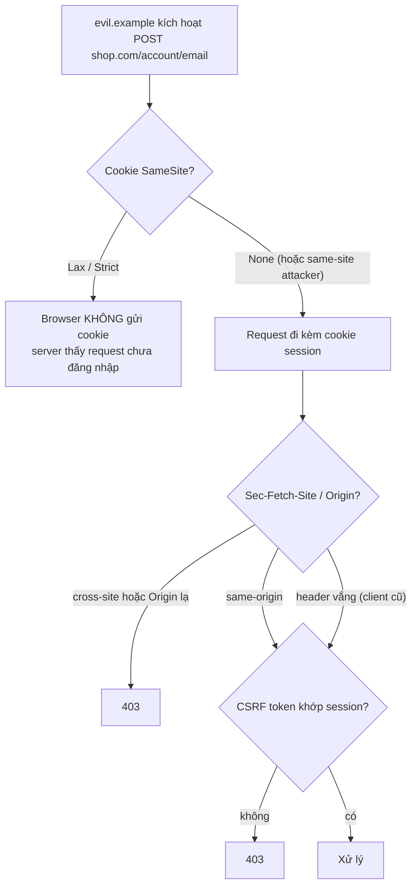
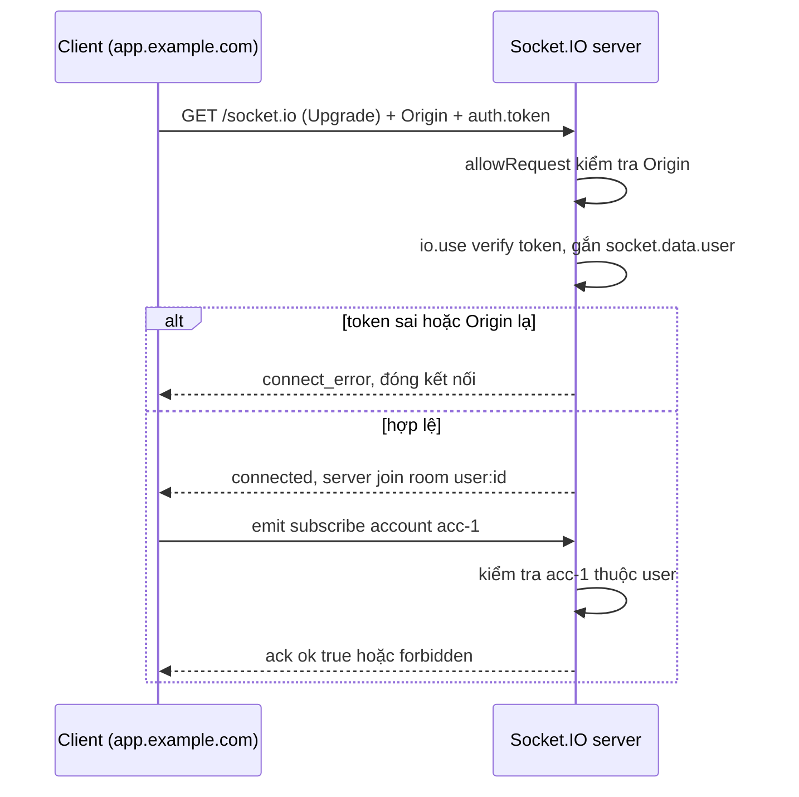

## Bối cảnh & vấn đề

Alice đăng nhập `shop.com`; session là một cookie. Cô mở tab khác đọc một blog, trên đó có một form ẩn tự submit `POST https://shop.com/account/email` với `email=attacker@evil.example`. Browser gửi request đó **kèm cookie session của Alice**, vì cookie gắn với domain đích, không gắn với trang đã tạo ra request. Server thấy session hợp lệ, đổi email. Attacker bấm "quên mật khẩu", nhận link reset ở email mới, và chiếm tài khoản. Alice không thấy gì bất thường, ngoài một tab blog.

Đây là **CSRF (Cross-Site Request Forgery)**. Nó không cần XSS, không cần đọc response, không cần đánh cắp gì. Nó chỉ lợi dụng một hành vi mặc định của web: browser **tự đính kèm credential** vào request tới domain, bất kể request do trang nào kích hoạt. [Bài trước](/tracks/web-security/learn/sop-cors) đã cho thấy SOP chặn đọc nhưng không chặn gửi; CSRF chính là khoảng trống đó.

Ngày nay browser đã có `SameSite` cookie và header `Sec-Fetch-Site`, nên nhiều người nghĩ CSRF "đã chết". Bài này đo thật xem SameSite chặn được gì và không chặn được gì, giải thích từng attribute của cookie session, so sánh các cách chống CSRF, và mở rộng sang WebSocket, nơi cùng loại lỗi xuất hiện dưới tên Cross-Site WebSocket Hijacking.

**Interview angle:** câu hỏi "app nào bị CSRF?" kiểm tra bạn có hiểu *credential tự gửi* là gốc rễ không, thay vì trả lời thuộc lòng "app dùng cookie".

## Khái niệm

### CSRF và ambient credential

CSRF xảy ra khi ba điều kiện cùng đúng: có một hành động **thay đổi state** đáng giá (đổi email, chuyển tiền, đổi payout); server xác định user **chỉ** bằng một credential mà browser **tự gửi** (ambient credential); và attacker đoán trước được toàn bộ tham số của request (không có giá trị bí mật nào mà attacker không biết).

Ambient credential không chỉ là cookie session. Nó còn là cookie chứa JWT, HTTP Basic/Digest auth (browser nhớ và tự gửi), client certificate TLS, và xác thực theo **mạng** (app nội bộ tin mọi request từ IP văn phòng hay VPN; trang ngoài internet có thể khiến browser trong mạng nội bộ gọi vào). Ghi chú Notion "CSRF chỉ xảy ra khi dùng cookie" vì thế chưa đủ.

Ngược lại, khi token nằm trong header `Authorization: Bearer ...` do JavaScript tự gắn, browser không tự gửi, nên trang khác không tạo được request có token. Cái giá là token phải nằm ở chỗ JavaScript đọc được (memory, `localStorage`), nên một lỗi XSS sẽ lấy được token. Đây là trade-off cookie vs header mà [bài XSS](/tracks/web-security/learn/xss) quay lại.

Hai biến thể hay bị quên: **login CSRF** (attacker ép browser nạn nhân đăng nhập vào **tài khoản của attacker**; nạn nhân sau đó lưu thẻ, địa chỉ, lịch sử tìm kiếm vào tài khoản attacker), và CSRF trên **GET có side effect** (`GET /logout`, `GET /cart/add?id=`), vì GET đi qua mọi lớp SameSite Lax.

### SameSite: Strict, Lax, None

`SameSite` là attribute của cookie quyết định cookie có được gửi trong request **cross-site** hay không (nhắc lại: site là eTLD+1, không phải origin):

- **`Strict`**: không gửi trong bất kỳ request cross-site nào, kể cả khi user bấm link từ email hay Google sang site của bạn. Hệ quả UX: user đến từ link ngoài trông như chưa đăng nhập ở request đầu tiên.
- **`Lax`**: gửi khi **top-level navigation** dùng method "an toàn" (bấm link, `GET` đổi URL thanh địa chỉ), không gửi trong POST form cross-site, iframe, `fetch`, ``. Đây là điểm cân bằng phổ biến.
- **`None`**: luôn gửi, bắt buộc kèm `Secure`. Cần cho cookie dùng trong iframe nhúng ở site khác hoặc SPA ở site khác.

Chrome coi cookie **không khai báo** SameSite là `Lax` (từ 2020), kèm một ngoại lệ tạm thời "Lax+POST" cho cookie vừa set dưới 2 phút để không phá các flow SSO cũ (verify; Firefox và Safari có mặc định khác). Vì vậy luôn khai báo tường minh, đừng dựa vào mặc định.

SameSite không đủ một mình vì: (1) **same-site không phải same-origin**: một subdomain bị chiếm hoặc chứa nội dung user (`blog.shop.com`, `user123.shop.com`) gửi được request kèm cookie `Lax`, thậm chí `Strict`; (2) GET có side effect đi qua Lax; (3) browser cũ hoặc embedded webview; (4) cookie đặt `None` vì lý do tích hợp. OWASP coi SameSite là **defense in depth**, vẫn nên có token hoặc kiểm tra `Origin`/`Sec-Fetch-Site`.

### Cookie attributes và prefix

Một cookie session tốt trông như sau, và mỗi attribute chặn một thứ khác nhau:

```text
Set-Cookie: __Host-sid=4f1c...; Path=/; Secure; HttpOnly; SameSite=Lax; Max-Age=28800
```

- **`HttpOnly`**: JavaScript không đọc được qua `document.cookie`. Chặn XSS **đánh cắp** cookie, nhưng không chặn XSS **dùng** cookie: script độc chạy trong origin của bạn vẫn gọi `fetch('/api/...')` và browser tự gắn cookie.
- **`Secure`**: chỉ gửi qua HTTPS, chống lộ trên mạng không mã hoá.
- **`SameSite=Lax`**: giảm CSRF như trên.
- **`Path=/` và không có `Domain`**: cookie là "host-only", chỉ gửi cho đúng host đã set, không gửi cho subdomain. Đặt `Domain=shop.com` làm cookie đi tới mọi subdomain, kể cả subdomain kém an toàn.
- **Prefix `__Host-`**: browser **chỉ chấp nhận** cookie tên `__Host-...` nếu có `Secure`, `Path=/` và **không** có `Domain`. Nhờ vậy một subdomain không thể ghi đè cookie session của host chính (cookie tossing). **`__Secure-`** chỉ ép `Secure`.
- **`Max-Age`/`Expires`** hợp lý cho session; và luôn **tạo session id mới sau khi login** (chống session fixation: attacker cài trước một session id vào browser nạn nhân, chờ nạn nhân login, rồi dùng chính id đó).

### Các cách chống CSRF

**Synchronizer token**: server sinh token ngẫu nhiên, lưu trong session, nhúng vào form hoặc trả qua API; mọi request thay đổi state phải gửi lại token (field ẩn hoặc header `X-CSRF-Token`) và server so với giá trị trong session. Attacker không đọc được token (SOP chặn đọc), nên không giả được request. Mạnh nhất, phù hợp app có server session.

**Signed double-submit cookie**: không cần lưu state. Server set một cookie chứa token gắn với session (ví dụ `HMAC(secret, sessionId + random)`), client đọc cookie đó và gửi lại trong header. Server kiểm tra header khớp cookie **và** chữ ký đúng với session hiện tại. Bản "naive" (không ký, chỉ so cookie với header) bị phá khi attacker ghi được cookie từ một subdomain (cookie tossing): attacker set cả cookie và header cùng giá trị do mình chọn.

**Kiểm tra `Origin` / Fetch Metadata**: browser hiện đại gửi header `Sec-Fetch-Site` (`same-origin`, `same-site`, `cross-site`, `none`) và `Origin` cho request POST/CORS. Server từ chối request thay đổi state có `Sec-Fetch-Site: cross-site` (và cân nhắc `same-site`), hoặc có `Origin` không nằm trong allowlist. Rẻ, không cần đổi frontend, hiệu quả với browser hiện đại; cần fallback hợp lý khi header vắng mặt (client cũ, request server-to-server).

**Custom header bắt buộc** (`X-Requested-With`, hoặc chỉ chấp nhận `Content-Type: application/json`): form HTML không thêm được header, `fetch` cross-origin có header lạ phải qua preflight. An toàn **chỉ khi** CORS chặt; với CORS reflect, preflight được chấp nhận và defense biến mất.

### WebSocket và Cross-Site WebSocket Hijacking

WebSocket handshake là một HTTP `GET` có `Upgrade: websocket`. Browser gửi cookie theo handshake (theo quy tắc SameSite) và **không áp CORS** cho WebSocket. Nếu server xác thực socket chỉ bằng cookie và không kiểm tra `Origin`, một trang khác mở được WebSocket tới server bằng session của nạn nhân và **đọc được mọi message** (khác CSRF thường, ở đây attacker đọc được dữ liệu). Đó là **Cross-Site WebSocket Hijacking (CSWSH)**.

Với Socket.IO, hai việc cần làm ở **handshake**: kiểm tra `Origin` (option `allowRequest` hoặc `cors` của server), và xác thực bằng token trong `socket.handshake.auth` trong middleware `io.use`, từ chối trước khi sự kiện `connection` xảy ra. Sau đó, **server** quyết định socket được join room nào; client chỉ được *xin* subscribe, và server kiểm tra quyền như với REST.

## Cơ chế hoạt động

Sơ đồ dưới là một request cross-site tới endpoint thay đổi state, với các lớp kiểm tra theo thứ tự mà một request phải vượt qua:



Mỗi lớp xử lý một trường hợp mà lớp trước bỏ lọt. SameSite chặn phần lớn attacker ở site khác. Kiểm tra `Sec-Fetch-Site`/`Origin` chặn cả khi cookie là `None` vì lý do tích hợp. Token là lớp cuối, cần cho trường hợp attacker là **same-site** (subdomain bị chiếm có `Sec-Fetch-Site: same-site`) hoặc header vắng mặt. Hành động cực nhạy cảm (đổi email, payout) thêm **re-authentication** (nhập lại password hoặc MFA), lớp này chặn cả CSRF lẫn XSS.

Với Socket.IO, luồng xác thực diễn ra như sau:



## Ví dụ thực tế

### Đo thật: form POST cross-site với SameSite None vs Lax

Cùng lab với [bài CORS](/tracks/web-security/learn/sop-cors): API Express 5.2.1 ở `http://localhost:4001`, trang attacker ở `http://127.0.0.1:4002` (khác site), Chrome 154 headless. Trang attacker auto-submit một form `POST /transfer` và một form khác tới `/transfer-guarded`, route có kiểm tra Fetch Metadata:

```ts
api.post('/transfer-guarded', express.urlencoded({ extended: false }), (req, res) => {
  const site = req.get('sec-fetch-site');
  const origin = req.get('origin');
  // modern browsers send Sec-Fetch-Site; fall back to an exact Origin check
  const ok = site ? ['same-origin', 'none'].includes(site) : origin === 'http://localhost:4001';
  res.status(ok ? 200 : 403).send(ok ? 'ok' : 'forbidden');
});
```

Kết quả phía server:

```text
=== cookie SameSite=None ===
server saw: {"path":"/transfer-guarded","cookie":"S3CR3T-None","secFetchSite":"cross-site","decision":"403"}
server saw: {"path":"/transfer","cookie":"S3CR3T-None","origin":"http://127.0.0.1:4002","secFetchSite":"cross-site","ct":"application/x-www-form-urlencoded"}

=== cookie SameSite=Lax ===
server saw: {"path":"/transfer-guarded","cookie":"(none)","secFetchSite":"cross-site","decision":"403"}
server saw: {"path":"/transfer","cookie":"(none)","origin":"http://127.0.0.1:4002","secFetchSite":"cross-site","ct":"application/x-www-form-urlencoded"}
```

Với `SameSite=None`, form cross-site tới `/transfer` mang **cookie thật** của victim: đây là CSRF thành công trên route không có bảo vệ. Route guarded vẫn trả 403 dù có cookie, vì `Sec-Fetch-Site: cross-site`. Với `SameSite=Lax`, browser không gửi cookie trong POST cross-site, nên kể cả route không bảo vệ cũng chỉ nhận request "chưa đăng nhập". Lưu ý server vẫn **nhận** request trong mọi trường hợp; bảo vệ CSRF là chuyện server có *hành động* hay không.

### Đo thật: `__Host-` prefix

Server set sáu cookie trong một response, Chrome 154 lưu lại những cái hợp lệ:

```text
Set-Cookie: __Host-ok=1; Path=/; Secure; HttpOnly; SameSite=Lax
Set-Cookie: __Host-withdomain=1; Path=/; Secure; Domain=localhost
Set-Cookie: __Host-nosecure=1; Path=/
Set-Cookie: __Host-subpath=1; Path=/app; Secure
Set-Cookie: __Secure-x=1; Path=/; Secure
Set-Cookie: plain=1; Path=/

stored cookies: __Host-ok, __Secure-x, plain
```

Ba cookie `__Host-` vi phạm quy tắc (có `Domain`, thiếu `Secure`, `Path` khác `/`) bị **browser từ chối im lặng**. Đó chính là giá trị của prefix: một subdomain hoặc một đoạn code cấu hình sai không thể tạo ra cookie `__Host-sid` có phạm vi rộng hơn host. (Chrome coi `http://localhost` là secure context nên chấp nhận `Secure` trong lab; production luôn là HTTPS.)

### Synchronizer token tối giản (minh hoạ)

```ts
import { randomBytes, timingSafeEqual } from 'node:crypto';
// after login: rotate the session id AND create a CSRF token bound to it
app.post('/login', async (req, res) => {
  const user = await verifyCredentials(req.body);
  await req.session.regenerate();                 // new session id: blocks session fixation
  req.session.userId = user.id;
  req.session.csrf = randomBytes(32).toString('base64url');
  res.json({ csrfToken: req.session.csrf });
});
function requireCsrf(req, res, next) {
  if (['GET', 'HEAD', 'OPTIONS'].includes(req.method)) return next();
  const given = Buffer.from(String(req.get('x-csrf-token') ?? ''));
  const expected = Buffer.from(req.session.csrf ?? '');
  if (given.length === 0 || given.length !== expected.length || !timingSafeEqual(given, expected)) return res.status(403).end();
  next();
}
```

Snippet này dùng API kiểu `express-session` để minh hoạ; ý chính là token gắn với session, đổi khi login, so sánh constant-time, và chỉ miễn cho method an toàn. Điều kiện ngầm: **GET không bao giờ có side effect**.

### Đo thật: Socket.IO 4.8 xác thực handshake

```ts
const io = new Server(http, {
  allowRequest: (req, cb) => cb(null, req.headers.origin === undefined || req.headers.origin === 'https://app.example.com'),
});
io.use((socket, next) => {
  const user = verifyToken(socket.handshake.auth?.token);
  if (!user) return next(new Error('unauthorized'));
  socket.data.user = user;
  next();
});
io.on('connection', (socket) => {
  socket.join(`user:${socket.data.user.userId}`);            // server decides the rooms
  socket.on('subscribe', (accountId, ack) => {
    if (!socket.data.user.accounts.includes(accountId)) return ack({ ok: false, error: 'forbidden' });
    socket.join(`account:${accountId}`);
    ack({ ok: true });
  });
});
```

```text
1) no token
  connect_error: unauthorized
2) evil Origin
  connect_error: websocket error
3) valid token
  connected: true
  subscribe acc-1 -> { ok: true }
  subscribe acc-999 -> { ok: false, error: 'forbidden' }
```

Không có token bị từ chối ở middleware; Origin lạ bị chặn ngay ở tầng HTTP upgrade (client chỉ thấy "websocket error"); token hợp lệ kết nối được nhưng chỉ subscribe được account của mình. Câu follow-up "quyền bị thu hồi khi socket đang mở thì sao?" cần thiết kế thêm: token ngắn hạn kèm re-auth định kỳ, hoặc khi thu hồi quyền thì publish sự kiện để server `socket.leave()`/`disconnect()` các socket của user đó; nếu không, socket đã mở giữ quyền tới khi ngắt.

## Trade-offs & lựa chọn thay thế

| Biện pháp | Stateful? | Chặn same-site attacker? | Phụ thuộc | Hợp khi |
| --- | --- | --- | --- | --- |
| `SameSite=Lax` | Không | Không | Browser hiện đại | Luôn bật, lớp đầu tiên |
| `SameSite=Strict` | Không | Không | Browser | Admin panel, ít link từ ngoài vào |
| Synchronizer token | Có (session) | Có | Frontend gửi token | App server-rendered, session server |
| Signed double-submit | Không | Có (nếu ký với session) | Secret phía server | API stateless có cookie |
| `Sec-Fetch-Site` / `Origin` check | Không | Một phần (`same-site` phân biệt được) | Browser gửi header | Lớp rẻ cho mọi API cookie |
| Custom header / JSON-only | Không | Có nếu CORS chặt | CORS đúng | SPA gọi API JSON |
| Token trong `Authorization` header | Không | Không áp dụng (không ambient) | JS giữ token | Mobile, API cho bên thứ ba |
| Re-auth/MFA cho hành động nhạy cảm | Không | Có | UX | Đổi email, payout, xoá tài khoản |

Chọn thế nào: với SPA + API cùng site, tổ hợp thực tế là cookie `__Host-` + `HttpOnly` + `SameSite=Lax`, kiểm tra `Sec-Fetch-Site`/`Origin` cho mọi method thay đổi state, và token (synchronizer hoặc signed double-submit) cho form nhạy cảm. Với app server-rendered truyền thống, synchronizer token là mặc định của hầu hết framework. Với API cho mobile/đối tác dùng bearer token, CSRF không áp dụng nhưng phải lo lưu token an toàn.

## Edge cases & failure modes

- **Subdomain takeover**: DNS `promo.shop.com` trỏ tới một bucket đã xoá, attacker tạo lại bucket và host trang của họ; request từ đó là same-site, cookie `Lax` được gửi và `Sec-Fetch-Site` là `same-site`. Token và kiểm tra `same-origin` mới chặn được.
- **GET có side effect**: `GET /logout`, `GET /subscribe?plan=pro` đi qua SameSite Lax bằng một link hoặc redirect. Mọi thay đổi state phải là POST/PUT/PATCH/DELETE.
- **Method override**: framework chấp nhận `_method=DELETE` trong form POST, hoặc header `X-HTTP-Method-Override`, làm một simple request trở thành DELETE.
- **Content-type lỏng**: API "JSON only" nhưng body parser chấp nhận `text/plain` rồi parse JSON, nên form gửi được JSON giả mà không cần preflight.
- **Token rò qua URL**: CSRF token trong query string bị lộ qua `Referer`, log, history. Gửi trong header hoặc body.
- **Session fixation**: không regenerate session id sau login, nên id attacker cài trước trở thành session đã đăng nhập.
- **Socket mở lâu**: quyền bị thu hồi hoặc token hết hạn nhưng socket vẫn nhận broadcast vì chỉ kiểm tra lúc handshake.

## Pitfalls

- ❌ "Dùng JWT nên không bị CSRF" → ✅ phụ thuộc JWT nằm ở đâu: trong cookie thì vẫn là ambient credential, chỉ header `Authorization` mới không.
- ❌ "SameSite=Lax là đủ" → ✅ same-site attacker, GET có side effect, browser cũ; thêm `Origin`/`Sec-Fetch-Site` check và token cho hành động nhạy cảm.
- ❌ `HttpOnly` để "chống XSS" → ✅ HttpOnly chỉ chống đánh cắp cookie; XSS vẫn gọi API bằng cookie đó.
- ❌ Đặt `Domain=shop.com` cho cookie session "để subdomain dùng chung" → ✅ host-only + `__Host-`; chia sẻ session qua subdomain là mở rộng bề mặt tấn công.
- ❌ Double-submit không ký → ✅ ký token với session id (HMAC), hoặc dùng synchronizer token.
- ❌ Không đổi session id sau login → ✅ `regenerate()` sau login và sau khi nâng quyền.
- ❌ Socket.IO xác thực bằng cookie, không kiểm Origin, client tự `join` room → ✅ token ở handshake, kiểm `Origin`, server quyết định room và kiểm quyền mỗi lần subscribe.

## Tóm tắt

- CSRF = site khác khiến browser gửi request thay đổi state kèm **ambient credential** (cookie, Basic auth, client cert, IP nội bộ).
- SameSite: Strict chặn mọi cross-site, Lax cho qua top-level GET, None luôn gửi (cần Secure); Chrome mặc định Lax nhưng hãy khai báo tường minh.
- SameSite không chặn attacker **same-site** (subdomain) và GET có side effect; thêm `Sec-Fetch-Site`/`Origin` check và token.
- Cookie session: `__Host-` + `Secure` + `HttpOnly` + `SameSite=Lax` + `Path=/`, không `Domain`; Chrome từ chối im lặng cookie `__Host-` sai quy tắc.
- Đổi session id sau login để chống session fixation; hành động nhạy cảm cần re-auth.
- WebSocket không có CORS: kiểm Origin + xác thực ở handshake, server quyết định room, xử lý thu hồi quyền khi socket đang mở.
